# Báo cáo phân tích và thiết kế hệ thống

Aurelia Living: website thương mại điện tử nội thất, tích hợp xem 3D, AR và không gian mẫu 360°.

Tài liệu gồm ba mô hình theo yêu cầu của giảng viên: **(1) mô hình hoạt động chức năng** (Activity Diagram), **(2) mô hình tuần tự chức năng** (Sequence Diagram), **(3) mô hình quan hệ dữ liệu theo hướng đối tượng** (Class Diagram), kèm danh sách API, ánh xạ vào code và lộ trình triển khai. Đồng thời là bản thiết kế để code theo: tên module, class, hàm, endpoint, DTO, model khớp với project (`apps/api`, `apps/web`) và với `apps/api/prisma/schema.prisma`.

Tài liệu liên quan: [DAC_TA_CHUC_NANG_THEO_VAI_TRO.md](DAC_TA_CHUC_NANG_THEO_VAI_TRO.md) (đặc tả 76 use case), [DATABASE_SCHEMA.md](DATABASE_SCHEMA.md) (từ điển dữ liệu, trigger), [QUY_UOC_CODE_DB.md](QUY_UOC_CODE_DB.md) (quy ước code với CSDL).

## 1. Tổng quan

### 1.1. Công nghệ

| Tầng | Công nghệ |
| --- | --- |
| Frontend (`apps/web`) | Next.js 14 (App Router), React 18, TypeScript, Tailwind CSS, React Three Fiber/drei (xem 3D, panorama), Zustand (store), TanStack Query (gọi API) |
| Backend (`apps/api`) | NestJS 10, TypeScript, Passport JWT, class-validator, Swagger |
| ORM / CSDL | Prisma 5.22, PostgreSQL 16 (44 bảng, 36 trigger, extension citext, pg_trgm, unaccent, pgcrypto) |
| Hàng đợi / cache | BullMQ + Redis 7: queue `model-processing` (kiểm tra GLB, sinh LOD), `image-processing` (webp, thumbnail); throttler lưu bộ đếm trong Redis. Worker chạy cùng tiến trình API |
| Lưu trữ tệp | MinIO (S3 tương thích) qua `StorageService`: bucket public (ảnh, panorama, mô hình đã xử lý) và private (tệp gốc, ảnh AR chưa công khai); driver `local` dự phòng. Mô hình 3D và panorama tải bằng presigned PUT |
| Tích hợp ngoài | Cổng thanh toán MoMo, VNPay, ZaloPay; đơn vị vận chuyển GHN, GHTK, Viettel Post; SMTP gửi email |
| Hạ tầng dev | Docker Compose (postgres, redis, minio, minio-init, mailpit, api; profile test: postgres-test) |

### 1.2. Kiến trúc

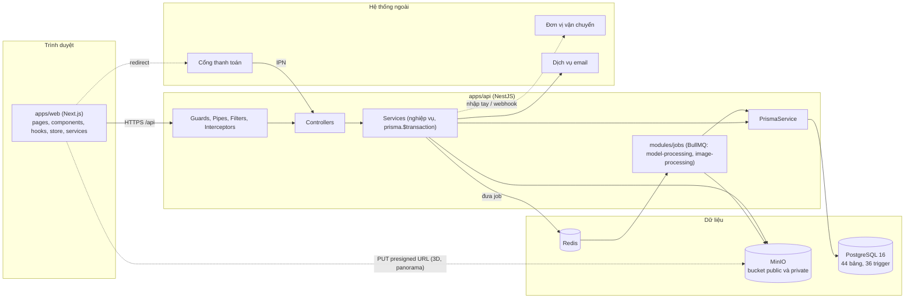
```mermaid
flowchart LR
    subgraph Client["Trình duyệt"]
        WEB["apps/web (Next.js)<br>pages, components, hooks, store, services"]
    end
    subgraph API["apps/api (NestJS)"]
        GUARD["Guards, Pipes, Filters, Interceptors"]
        CTRL["Controllers"]
        SVC["Services (nghiệp vụ, prisma.$transaction)"]
        PRISMA["PrismaService"]
        JOBS["modules/jobs (BullMQ: model-processing, image-processing)"]
    end
    subgraph DATA["Dữ liệu"]
        PG[("PostgreSQL 16<br>44 bảng, 36 trigger")]
        RD[("Redis")]
        S3[("MinIO<br>bucket public và private")]
    end
    subgraph EXT["Hệ thống ngoài"]
        GW["Cổng thanh toán"]
        SH["Đơn vị vận chuyển"]
        SMTP["Dịch vụ email"]
    end
    WEB -- "HTTPS /api" --> GUARD --> CTRL --> SVC --> PRISMA --> PG
    SVC -- "đưa job" --> RD
    RD --> JOBS
    JOBS --> S3
    JOBS --> PRISMA
    SVC --> S3
    WEB -. "PUT presigned URL (3D, panorama)" .-> S3
    SVC --> SMTP
    WEB -. "redirect" .-> GW
    GW -- "IPN" --> CTRL
    SVC -. "nhập tay / webhook" .-> SH
```

Quy tắc xuyên suốt: (1) trigger CSDL tự làm `updated_at`, `ratingAvg/ratingCount`, `has3dModel/hasAr`, `Space.viewCount`, `OrderStatusHistory`, gán vai trò `user`; Service không code lặp lại. (2) Việc Service tự làm (trừ/hoàn kho kèm `InventoryMovement`, `soldCount`, kiểm tra và ghi `CouponUsage`, kiểm tra "đã mua mới được đánh giá") nằm trong `prisma.$transaction`. (3) Tiền là `Prisma.Decimal`, trả ra bằng `serialize()` thành number. (4) Chỉ xóa mềm với `User`, `Product`.

### 1.3. Cây thư mục rút gọn

```text
apps/
├── api/                              NestJS + Prisma
│   ├── prisma/  schema.prisma, seed.ts, migrations/{0_init, ..._media_file_size_int}
│   └── src/
│       ├── main.ts, app.module.ts    (khung; cần setGlobalPrefix('api'), ConfigModule)
│       ├── prisma/                   [CẦN TẠO MỚI] prisma.module.ts, prisma.service.ts
│       ├── common/
│       │   ├── decorators/ filters/ pipes/ interceptors/     (khung đã có)
│       │   ├── guards/   jwt-auth.guard.ts, roles.guard.ts (có) + optional-jwt-auth.guard.ts, permissions.guard.ts [CẦN TẠO MỚI]
│       │   ├── interceptors/ + activity-log.interceptor.ts   [CẦN TẠO MỚI]
│       │   └── utils/serialize.ts                            (đã có)
│       ├── config/                   env.validation, AppConfig (đã có); Swagger trong app.setup.ts
│       └── modules/
│           ├── auth/ users/ products/ cart/ orders/ spaces/ product-models/ media/ jobs/   (khung đã có)
│           ├── ai/ ar-overlay/      (có sẵn, ngoài phạm vi UC: Hướng phát triển)
│           └── addresses/ notifications/ wishlist/ categories/ brands/ pages/ attributes/ reviews/ coupons/
│               payments/ shipments/ inventory/ settings/ stats/ activity-logs/ ar-sessions/ ar-snapshots/ mail/   [CẦN TẠO MỚI]
├── web/                              Next.js 14
│   └── src/ app/{(admin),(auth),(shop)}, components/{cart,layout,product,ui,viewer}, hooks, lib, services, store, types
└── mobile/                           Android (Kotlin), ngoài phạm vi
```


## 2. Use case đã mô hình hóa

61 use case Bắt buộc (29) và Nên có (32) có đủ Activity (mục 3) và Sequence (mục 4). 15 use case Mở rộng chỉ liệt kê (mô tả ở tài liệu đặc tả). Số thứ tự `A.n` và `S.n` là mục của sơ đồ.

| STT | Mã | Tên | Ưu tiên | Vai trò | Activity | Sequence |
| --- | --- | --- | --- | --- | --- | --- |
| 1 | UC-AUTH-01 | Đăng ký tài khoản | Bắt buộc | Khách vãng lai | A.1 | S.1 |
| 2 | UC-AUTH-02 | Đăng nhập | Bắt buộc | Khách vãng lai | A.2 | S.2 |
| 3 | UC-AUTH-03 | Làm mới access token | Bắt buộc | Client (tự động) | A.3 | S.3 |
| 4 | UC-AUTH-04 | Đăng xuất | Bắt buộc | Người dùng | A.4 | S.4 |
| 5 | UC-AUTH-05 | Quên mật khẩu (yêu cầu đặt lại) | Bắt buộc | Khách vãng lai | A.5 | S.5 |
| 6 | UC-AUTH-06 | Đặt lại mật khẩu | Bắt buộc | Khách vãng lai | A.6 | S.6 |
| 7 | UC-AUTH-07 | Xác thực email | Nên có | Người dùng | A.7 | S.7 |
| 8 | UC-ACC-01 | Xem và cập nhật hồ sơ cá nhân | Nên có | Người dùng | A.8 | S.8 |
| 9 | UC-ACC-02 | Đổi mật khẩu | Nên có | Người dùng | A.9 | S.9 |
| 10 | UC-ACC-04 | Quản lý sổ địa chỉ giao hàng | Nên có | Người dùng | A.10 | S.10 |
| 11 | UC-ACC-05 | Xem và đánh dấu đã đọc thông báo | Nên có | Người dùng | A.11 | S.11 |
| 12 | UC-ACC-06 | Quản lý danh sách yêu thích | Nên có | Người dùng | A.12 | S.12 |
| 13 | UC-CAT-01 | Xem trang chủ | Bắt buộc | Khách vãng lai | A.13 | S.13 |
| 14 | UC-CAT-02 | Duyệt sản phẩm theo danh mục | Bắt buộc | Khách vãng lai | A.14 | S.14 |
| 15 | UC-CAT-03 | Tìm kiếm sản phẩm | Bắt buộc | Khách vãng lai | A.15 | S.15 |
| 16 | UC-CAT-04 | Xem chi tiết sản phẩm | Bắt buộc | Khách vãng lai | A.16 | S.16 |
| 17 | UC-CAT-05 | Xem trang tĩnh | Nên có | Khách vãng lai | A.17 | S.17 |
| 18 | UC-CAT-06 | Tìm kiếm sản phẩm không dấu | Nên có | Khách vãng lai | A.18 | S.18 |
| 19 | UC-CART-01 | Thêm sản phẩm vào giỏ hàng | Bắt buộc | Người dùng | A.19 | S.19 |
| 20 | UC-CART-02 | Xem giỏ hàng | Bắt buộc | Người dùng | A.20 | S.20 |
| 21 | UC-CART-03 | Cập nhật số lượng / xóa dòng trong giỏ | Bắt buộc | Người dùng | A.21 | S.21 |
| 22 | UC-CART-04 | Áp mã giảm giá | Nên có | Người dùng | A.22 | S.22 |
| 23 | UC-ORD-01 | Đặt hàng | Bắt buộc | Người dùng | A.23 | S.23 |
| 24 | UC-ORD-02 | Xem và theo dõi đơn hàng của tôi | Bắt buộc | Người dùng | A.24 | S.24 |
| 25 | UC-ORD-03 | Hủy đơn hàng | Bắt buộc | Người dùng | A.25 | S.25 |
| 26 | UC-PAY-01 | Thanh toán đơn hàng online | Bắt buộc | Người dùng | A.26 | S.26 |
| 27 | UC-PAY-02 | Nhận callback/IPN từ cổng thanh toán | Bắt buộc | Cổng thanh toán | A.27 | S.27 |
| 28 | UC-PAY-03 | Thanh toán lại đơn chưa thanh toán | Nên có | Người dùng | A.28 | S.28 |
| 29 | UC-REV-01 | Xem đánh giá sản phẩm | Nên có | Khách vãng lai | A.29 | S.29 |
| 30 | UC-REV-02 | Đánh giá sản phẩm đã mua | Nên có | Người dùng | A.30 | S.30 |
| 31 | UC-3D-01 | Xem mô hình 3D của sản phẩm | Nên có | Khách vãng lai | A.31 | S.31 |
| 32 | UC-3D-02 | Xem sản phẩm bằng AR (đặt vào không gian thật) | Nên có | Khách vãng lai | A.32 | S.32 |
| 33 | UC-3D-04 | Chụp và lưu ảnh AR | Nên có | Người dùng | A.33 | S.33 |
| 34 | UC-3D-05 | Quản lý ảnh AR của tôi (công khai/ẩn/xóa) | Nên có | Người dùng | A.34 | S.34 |
| 35 | UC-3D-06 | Xem ảnh AR công khai "Khách hàng đã trải nghiệm" | Nên có | Khách vãng lai | A.35 | S.35 |
| 36 | UC-SPACE-01 | Duyệt và tìm kiếm không gian mẫu | Nên có | Khách vãng lai | A.36 | S.36 |
| 37 | UC-SPACE-02 | Xem không gian mẫu 360° | Nên có | Khách vãng lai | A.37 | S.37 |
| 38 | UC-SPACE-03 | Bấm điểm sản phẩm trong phòng mẫu (mua theo phong cách phòng) | Nên có | Khách vãng lai | A.38 | S.38 |
| 39 | UC-SPACE-04 | Lưu / bỏ lưu không gian mẫu yêu thích | Nên có | Người dùng | A.39 | S.39 |
| 40 | UC-ADM-01 | Quản lý người dùng | Nên có | Quản trị viên | A.40 | S.40 |
| 41 | UC-ADM-03 | Quản lý cài đặt hệ thống | Nên có | Quản trị viên | A.41 | S.41 |
| 42 | UC-ADM-04 | Quản lý media (ảnh, tệp) | Bắt buộc | Quản trị viên | A.42 | S.42 |
| 43 | UC-ADM-05 | Quản lý danh mục sản phẩm | Bắt buộc | Quản trị viên | A.43 | S.43 |
| 44 | UC-ADM-06 | Quản lý thương hiệu | Nên có | Quản trị viên | A.44 | S.44 |
| 45 | UC-ADM-07 | Quản lý trang tĩnh | Nên có | Quản trị viên | A.45 | S.45 |
| 46 | UC-ADM-08 | Quản lý thuộc tính và giá trị thuộc tính | Bắt buộc | Quản trị viên | A.46 | S.46 |
| 47 | UC-ADM-09 | Quản lý sản phẩm | Bắt buộc | Quản trị viên | A.47 | S.47 |
| 48 | UC-ADM-10 | Quản lý biến thể sản phẩm | Bắt buộc | Quản trị viên | A.48 | S.48 |
| 49 | UC-ADM-11 | Quản lý ảnh sản phẩm | Bắt buộc | Quản trị viên | A.49 | S.49 |
| 50 | UC-ADM-12 | Nhập kho và điều chỉnh tồn kho | Bắt buộc | Quản trị viên | A.50 | S.50 |
| 51 | UC-ADM-13 | Tải và quản lý mô hình 3D sản phẩm | Nên có | Quản trị viên | A.51 | S.51 |
| 52 | UC-ADM-15 | Quản lý không gian mẫu và ảnh 360° | Nên có | Quản trị viên | A.52 | S.52 |
| 53 | UC-ADM-16 | Quản lý điểm tương tác (hotspot) trên ảnh 360° | Nên có | Quản trị viên | A.53 | S.53 |
| 54 | UC-ADM-18 | Duyệt hoặc từ chối đánh giá | Nên có | Quản trị viên | A.54 | S.54 |
| 55 | UC-ADM-19 | Quản lý mã giảm giá | Nên có | Quản trị viên | A.55 | S.55 |
| 56 | UC-ADM-20 | Xem danh sách và chi tiết đơn hàng | Bắt buộc | Quản trị viên | A.56 | S.56 |
| 57 | UC-ADM-21 | Cập nhật trạng thái đơn hàng | Bắt buộc | Quản trị viên | A.57 | S.57 |
| 58 | UC-ADM-22 | Hủy đơn hàng (quản trị) | Bắt buộc | Quản trị viên | A.58 | S.58 |
| 59 | UC-ADM-23 | Hoàn tiền thủ công | Nên có | Quản trị viên | A.59 | S.59 |
| 60 | UC-ADM-24 | Quản lý thanh toán (xác nhận chuyển khoản) | Nên có | Quản trị viên | A.60 | S.60 |
| 61 | UC-ADM-25 | Quản lý vận chuyển | Bắt buộc | Quản trị viên | A.61 | S.61 |

**Use case Mở rộng (chỉ liệt kê):**

| Mã | Tên | Endpoint chính |
| --- | --- | --- |
| UC-ACC-03 | Quản lý phiên đăng nhập (đăng xuất từ xa) | DELETE /api/users/me/sessions/:id |
| UC-ACC-07 | Yêu cầu xóa tài khoản (xóa mềm) | DELETE /api/users/me |
| UC-REV-03 | Sửa/xóa đánh giá của mình | PATCH /api/reviews/:id |
| UC-3D-03 | Đổi màu/chất liệu trên mô hình 3D | không có API riêng (xử lý ở client) |
| UC-3D-07 | Ghi nhận thống kê phiên 3D/AR (ẩn danh) | POST /api/ar-sessions |
| UC-SPACE-05 | Thử đổi món đồ trong phòng mẫu | GET /api/spaces/:slug/placements/:placementId/alternatives |
| UC-SPACE-06 | Ghi nhận lượt xem không gian mẫu (một lần khi rời trang) | POST /api/spaces/:slug/views |
| UC-ADM-02 | Quản lý vai trò và phân quyền | PUT /api/admin/users/:id/roles/admin |
| UC-ADM-14 | Cấu hình biến thể chất liệu cho mô hình 3D | PUT /api/admin/models/:id/material-variants/:variantId |
| UC-ADM-17 | Đặt mô hình 3D sản phẩm vào ảnh 360° (placement) | POST /api/admin/panoramas/:id/placements |
| UC-ADM-26 | Gửi thông báo cho người dùng | POST /api/admin/notifications |
| UC-ADM-27 | Xem nhật ký hoạt động của quản trị viên | GET /api/admin/activity-logs |
| UC-ADM-28 | Xem thống kê tổng quan | GET /api/admin/stats/overview |
| UC-ADM-29 | Thống kê AR và phễu không gian mẫu | GET /api/admin/stats/ar |
| UC-ADM-30 | Gỡ ảnh AR công khai không phù hợp | PATCH /api/admin/ar-snapshots/:id |

## 3. Phần 1 – Mô hình hoạt động chức năng (Activity Diagram)

Quy ước: mỗi sơ đồ là một `flowchart` có các làn (swimlane) **Người dùng/tác nhân** · **Hệ thống (API)** · **Cơ sở dữ liệu** (thêm **Hệ thống ngoài** khi có). `(Bắt đầu)` và `(Kết thúc)` là nút đầu/cuối; hình thoi là rẽ nhánh (Có/Không); ô `[Web]` là bước kiểm tra phía giao diện. Nhánh lỗi ghi mã HTTP và thông báo. Trong transaction, mọi nhánh lỗi đi qua "Rollback transaction". Bước `Trigger DB` là việc cơ sở dữ liệu tự làm.

### A.1 UC-AUTH-01 – Đăng ký tài khoản

| Mục | Nội dung |
| --- | --- |
| Tác nhân | Khách vãng lai \| phụ: Dịch vụ email |
| Ưu tiên · Nhóm | Bắt buộc · Xác thực |
| Tiền điều kiện | Chưa đăng nhập. Email chưa thuộc tài khoản nào chưa xóa mềm. |
| Hậu điều kiện | Có bản ghi User (status = active), có UserSession, tài khoản có vai trò `user`. Email xác thực được gửi (không chặn luồng chính, lỗi gửi chỉ ghi log). |
| Đặc tả chi tiết | [UC-AUTH-01](DAC_TA_CHUC_NANG_THEO_VAI_TRO.md) |

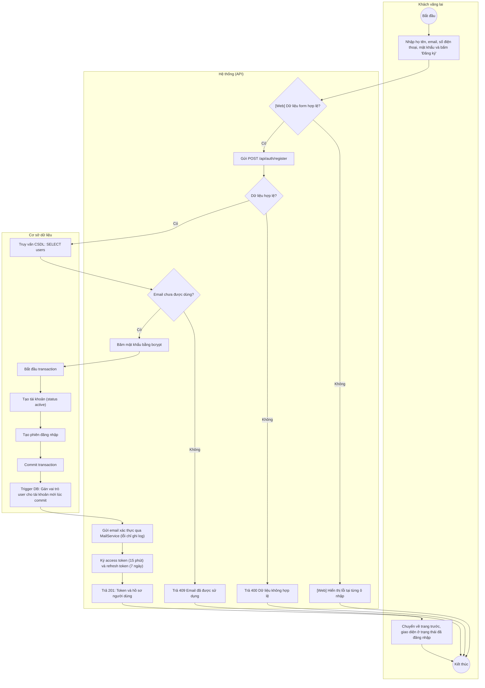
```mermaid
flowchart TD
    subgraph LANE_A["Khách vãng lai"]
        n1(("Bắt đầu"))
        n2["Nhập họ tên, email, số điện thoại, mật khẩu và bấm 'Đăng ký'"]
        n20["Chuyển về trang trước, giao diện ở trạng thái đã đăng nhập"]
        n21(("Kết thúc"))
    end
    subgraph LANE_S["Hệ thống (API)"]
        n3{"[Web] Dữ liệu form hợp lệ?"}
        n4["[Web] Hiển thị lỗi tại từng ô nhập"]
        n5["Gửi POST /api/auth/register"]
        n6{"Dữ liệu hợp lệ?"}
        n7["Trả 400 Dữ liệu không hợp lệ"]
        n9{"Email chưa được dùng?"}
        n10["Trả 409 Email đã được sử dụng"]
        n11["Băm mật khẩu bằng bcrypt"]
        n17["Gửi email xác thực qua MailService (lỗi chỉ ghi log)"]
        n18["Ký access token (15 phút) và refresh token (7 ngày)"]
        n19["Trả 201: Token và hồ sơ người dùng"]
    end
    subgraph LANE_D["Cơ sở dữ liệu"]
        n8["Truy vấn CSDL: SELECT users"]
        n12["Bắt đầu transaction"]
        n13["Tạo tài khoản (status active)"]
        n14["Tạo phiên đăng nhập"]
        n15["Commit transaction"]
        n16["Trigger DB: Gán vai trò user cho tài khoản mới lúc commit"]
    end
    n1 --> n2
    n2 --> n3
    n3 -->|"Không"| n4
    n3 -->|"Có"| n5
    n5 --> n6
    n6 -->|"Không"| n7
    n6 -->|"Có"| n8
    n8 --> n9
    n9 -->|"Không"| n10
    n9 -->|"Có"| n11
    n11 --> n12
    n12 --> n13
    n13 --> n14
    n14 --> n15
    n15 --> n16
    n16 --> n17
    n17 --> n18
    n18 --> n19
    n19 --> n20
    n20 --> n21
    n4 --> n21
    n7 --> n21
    n10 --> n21
```

### A.2 UC-AUTH-02 – Đăng nhập

| Mục | Nội dung |
| --- | --- |
| Tác nhân | Khách vãng lai (đã có tài khoản) \| phụ: — |
| Ưu tiên · Nhóm | Bắt buộc · Xác thực |
| Tiền điều kiện | Tài khoản tồn tại, chưa xóa mềm. |
| Hậu điều kiện | Có UserSession mới; `User.lastLoginAt` được cập nhật; client giữ access/refresh token. |
| Đặc tả chi tiết | [UC-AUTH-02](DAC_TA_CHUC_NANG_THEO_VAI_TRO.md) |

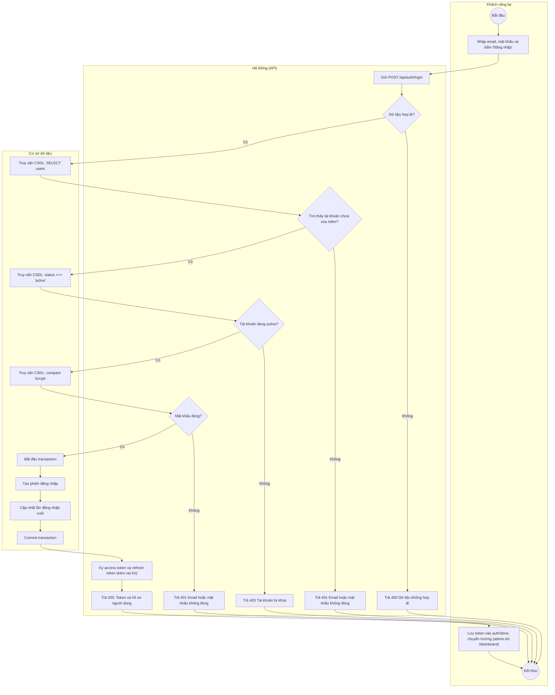
```mermaid
flowchart TD
    subgraph LANE_A["Khách vãng lai"]
        n1(("Bắt đầu"))
        n2["Nhập email, mật khẩu và bấm 'Đăng nhập'"]
        n21["Lưu token vào authStore, chuyển hướng (admin tới /dashboard)"]
        n22(("Kết thúc"))
    end
    subgraph LANE_S["Hệ thống (API)"]
        n3["Gửi POST /api/auth/login"]
        n4{"Dữ liệu hợp lệ?"}
        n5["Trả 400 Dữ liệu không hợp lệ"]
        n7{"Tìm thấy tài khoản chưa xóa mềm?"}
        n8["Trả 401 Email hoặc mật khẩu không đúng"]
        n10{"Tài khoản đang active?"}
        n11["Trả 403 Tài khoản bị khóa"]
        n13{"Mật khẩu đúng?"}
        n14["Trả 401 Email hoặc mật khẩu không đúng"]
        n19["Ký access token và refresh token (kèm vai trò)"]
        n20["Trả 200: Token và hồ sơ người dùng"]
    end
    subgraph LANE_D["Cơ sở dữ liệu"]
        n6["Truy vấn CSDL: SELECT users"]
        n9["Truy vấn CSDL: status === 'active'"]
        n12["Truy vấn CSDL: compare bcrypt"]
        n15["Bắt đầu transaction"]
        n16["Tạo phiên đăng nhập"]
        n17["Cập nhật lần đăng nhập cuối"]
        n18["Commit transaction"]
    end
    n1 --> n2
    n2 --> n3
    n3 --> n4
    n4 -->|"Không"| n5
    n4 -->|"Có"| n6
    n6 --> n7
    n7 -->|"Không"| n8
    n7 -->|"Có"| n9
    n9 --> n10
    n10 -->|"Không"| n11
    n10 -->|"Có"| n12
    n12 --> n13
    n13 -->|"Không"| n14
    n13 -->|"Có"| n15
    n15 --> n16
    n16 --> n17
    n17 --> n18
    n18 --> n19
    n19 --> n20
    n20 --> n21
    n21 --> n22
    n5 --> n22
    n8 --> n22
    n11 --> n22
    n14 --> n22
```

### A.3 UC-AUTH-03 – Làm mới access token

| Mục | Nội dung |
| --- | --- |
| Tác nhân | Người dùng đã đăng nhập (client tự động) |
| Ưu tiên · Nhóm | Bắt buộc · Xác thực |
| Tiền điều kiện | Có refresh token hợp lệ. |
| Hậu điều kiện | Phiên cũ bị thu hồi, phiên mới được tạo; client nhận cặp token mới. |
| Đặc tả chi tiết | [UC-AUTH-03](DAC_TA_CHUC_NANG_THEO_VAI_TRO.md) |

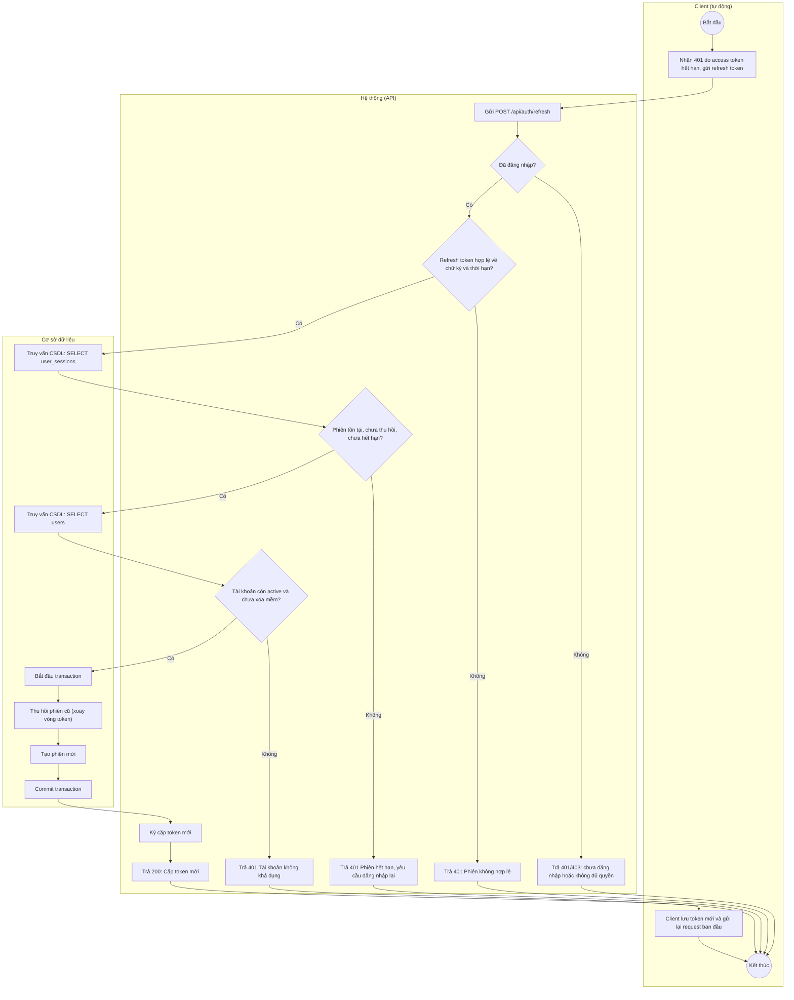
```mermaid
flowchart TD
    subgraph LANE_A["Client (tự động)"]
        n1(("Bắt đầu"))
        n2["Nhận 401 do access token hết hạn, gửi refresh token"]
        n20["Client lưu token mới và gửi lại request ban đầu"]
        n21(("Kết thúc"))
    end
    subgraph LANE_S["Hệ thống (API)"]
        n3["Gửi POST /api/auth/refresh"]
        n4{"Đã đăng nhập?"}
        n5["Trả 401/403: chưa đăng nhập hoặc không đủ quyền"]
        n6{"Refresh token hợp lệ về chữ ký và thời hạn?"}
        n7["Trả 401 Phiên không hợp lệ"]
        n9{"Phiên tồn tại, chưa thu hồi, chưa hết hạn?"}
        n10["Trả 401 Phiên hết hạn, yêu cầu đăng nhập lại"]
        n12{"Tài khoản còn active và chưa xóa mềm?"}
        n13["Trả 401 Tài khoản không khả dụng"]
        n18["Ký cặp token mới"]
        n19["Trả 200: Cặp token mới"]
    end
    subgraph LANE_D["Cơ sở dữ liệu"]
        n8["Truy vấn CSDL: SELECT user_sessions"]
        n11["Truy vấn CSDL: SELECT users"]
        n14["Bắt đầu transaction"]
        n15["Thu hồi phiên cũ (xoay vòng token)"]
        n16["Tạo phiên mới"]
        n17["Commit transaction"]
    end
    n1 --> n2
    n2 --> n3
    n3 --> n4
    n4 -->|"Không"| n5
    n4 -->|"Có"| n6
    n6 -->|"Không"| n7
    n6 -->|"Có"| n8
    n8 --> n9
    n9 -->|"Không"| n10
    n9 -->|"Có"| n11
    n11 --> n12
    n12 -->|"Không"| n13
    n12 -->|"Có"| n14
    n14 --> n15
    n15 --> n16
    n16 --> n17
    n17 --> n18
    n18 --> n19
    n19 --> n20
    n20 --> n21
    n5 --> n21
    n7 --> n21
    n10 --> n21
    n13 --> n21
```

### A.4 UC-AUTH-04 – Đăng xuất

| Mục | Nội dung |
| --- | --- |
| Tác nhân | Người dùng đã đăng nhập |
| Ưu tiên · Nhóm | Bắt buộc · Xác thực |
| Tiền điều kiện | Đã đăng nhập. |
| Hậu điều kiện | `UserSession.revokedAt` được đặt; token cũ không dùng làm mới được nữa. |
| Đặc tả chi tiết | [UC-AUTH-04](DAC_TA_CHUC_NANG_THEO_VAI_TRO.md) |

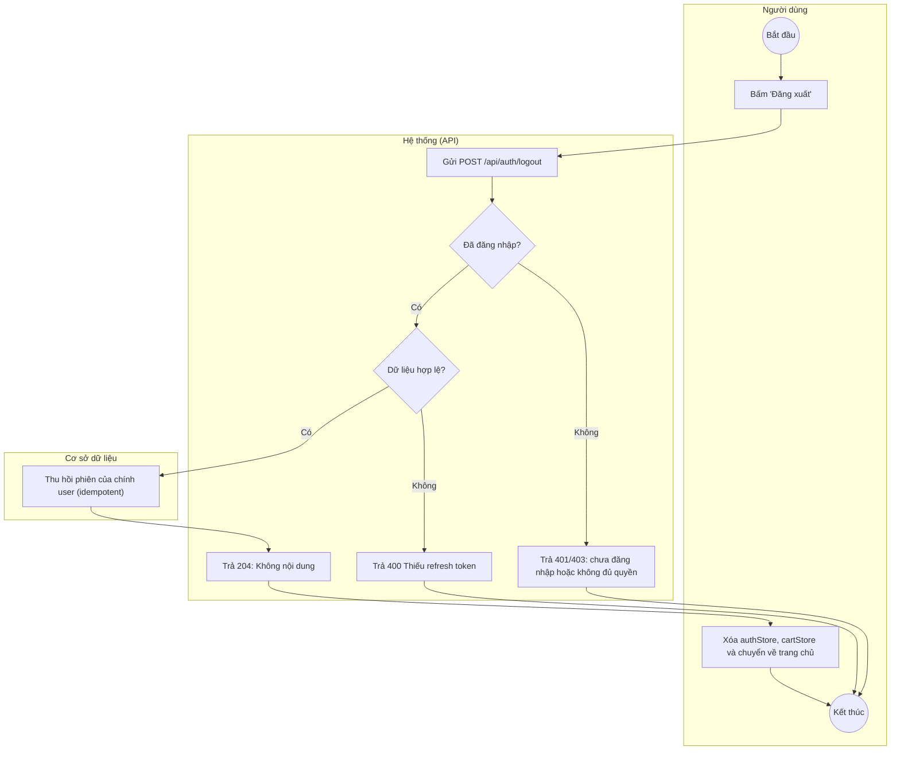
```mermaid
flowchart TD
    subgraph LANE_A["Người dùng"]
        n1(("Bắt đầu"))
        n2["Bấm 'Đăng xuất'"]
        n10["Xóa authStore, cartStore và chuyển về trang chủ"]
        n11(("Kết thúc"))
    end
    subgraph LANE_S["Hệ thống (API)"]
        n3["Gửi POST /api/auth/logout"]
        n4{"Đã đăng nhập?"}
        n5["Trả 401/403: chưa đăng nhập hoặc không đủ quyền"]
        n6{"Dữ liệu hợp lệ?"}
        n7["Trả 400 Thiếu refresh token"]
        n9["Trả 204: Không nội dung"]
    end
    subgraph LANE_D["Cơ sở dữ liệu"]
        n8["Thu hồi phiên của chính user (idempotent)"]
    end
    n1 --> n2
    n2 --> n3
    n3 --> n4
    n4 -->|"Không"| n5
    n4 -->|"Có"| n6
    n6 -->|"Không"| n7
    n6 -->|"Có"| n8
    n8 --> n9
    n9 --> n10
    n10 --> n11
    n5 --> n11
    n7 --> n11
```

### A.5 UC-AUTH-05 – Quên mật khẩu (yêu cầu đặt lại)

| Mục | Nội dung |
| --- | --- |
| Tác nhân | Khách vãng lai (người quên mật khẩu) \| phụ: Dịch vụ email |
| Ưu tiên · Nhóm | Bắt buộc · Xác thực |
| Tiền điều kiện | Chưa đăng nhập. |
| Hậu điều kiện | Nếu email tồn tại: có `PasswordReset` mới và email được gửi. |
| Đặc tả chi tiết | [UC-AUTH-05](DAC_TA_CHUC_NANG_THEO_VAI_TRO.md) |

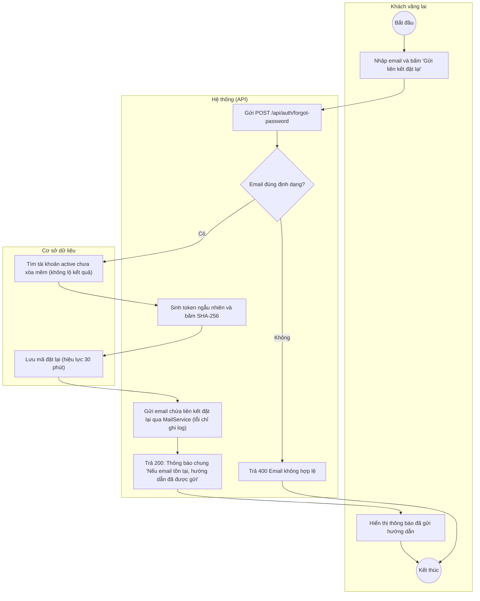
```mermaid
flowchart TD
    subgraph LANE_A["Khách vãng lai"]
        n1(("Bắt đầu"))
        n2["Nhập email và bấm 'Gửi liên kết đặt lại'"]
        n11["Hiển thị thông báo đã gửi hướng dẫn"]
        n12(("Kết thúc"))
    end
    subgraph LANE_S["Hệ thống (API)"]
        n3["Gửi POST /api/auth/forgot-password"]
        n4{"Email đúng định dạng?"}
        n5["Trả 400 Email không hợp lệ"]
        n7["Sinh token ngẫu nhiên và băm SHA-256"]
        n9["Gửi email chứa liên kết đặt lại qua MailService (lỗi chỉ ghi log)"]
        n10["Trả 200: Thông báo chung 'Nếu email tồn tại, hướng dẫn đã được gửi'"]
    end
    subgraph LANE_D["Cơ sở dữ liệu"]
        n6["Tìm tài khoản active chưa xóa mềm (không lộ kết quả)"]
        n8["Lưu mã đặt lại (hiệu lực 30 phút)"]
    end
    n1 --> n2
    n2 --> n3
    n3 --> n4
    n4 -->|"Không"| n5
    n4 -->|"Có"| n6
    n6 --> n7
    n7 --> n8
    n8 --> n9
    n9 --> n10
    n10 --> n11
    n11 --> n12
    n5 --> n12
```

### A.6 UC-AUTH-06 – Đặt lại mật khẩu

| Mục | Nội dung |
| --- | --- |
| Tác nhân | Khách vãng lai (có liên kết từ email) |
| Ưu tiên · Nhóm | Bắt buộc · Xác thực |
| Tiền điều kiện | Có token chưa dùng, chưa hết hạn. |
| Hậu điều kiện | Mật khẩu đổi; token bị đánh dấu đã dùng; mọi phiên cũ bị thu hồi. |
| Đặc tả chi tiết | [UC-AUTH-06](DAC_TA_CHUC_NANG_THEO_VAI_TRO.md) |

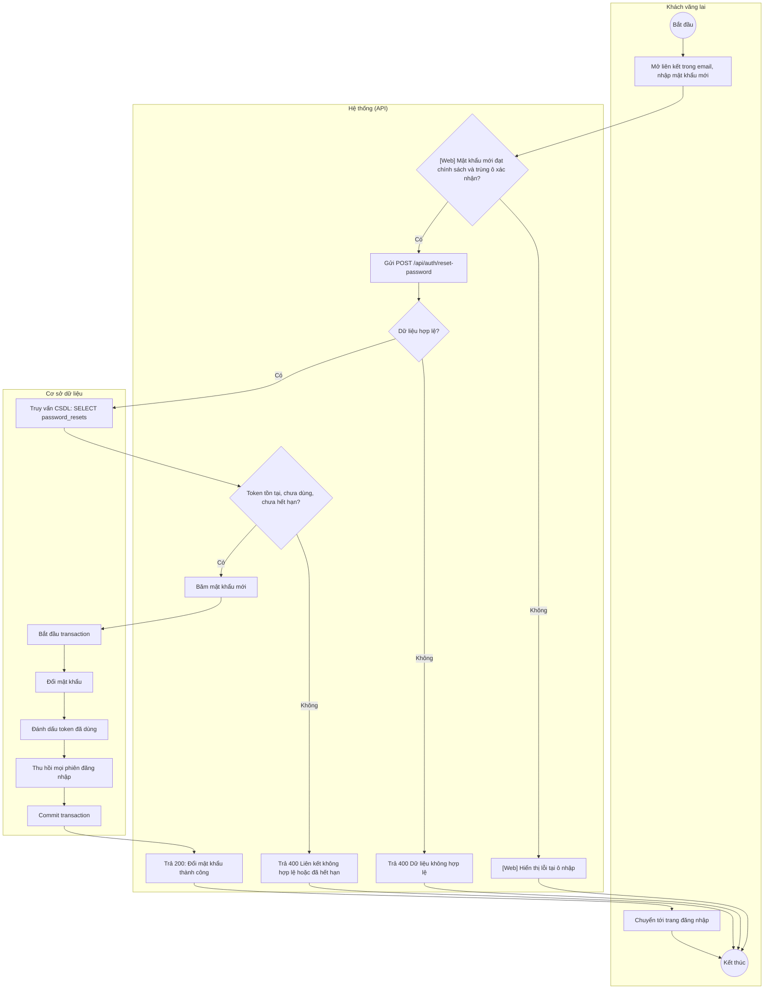
```mermaid
flowchart TD
    subgraph LANE_A["Khách vãng lai"]
        n1(("Bắt đầu"))
        n2["Mở liên kết trong email, nhập mật khẩu mới"]
        n18["Chuyển tới trang đăng nhập"]
        n19(("Kết thúc"))
    end
    subgraph LANE_S["Hệ thống (API)"]
        n3{"[Web] Mật khẩu mới đạt chính sách và trùng ô xác nhận?"}
        n4["[Web] Hiển thị lỗi tại ô nhập"]
        n5["Gửi POST /api/auth/reset-password"]
        n6{"Dữ liệu hợp lệ?"}
        n7["Trả 400 Dữ liệu không hợp lệ"]
        n9{"Token tồn tại, chưa dùng, chưa hết hạn?"}
        n10["Trả 400 Liên kết không hợp lệ hoặc đã hết hạn"]
        n11["Băm mật khẩu mới"]
        n17["Trả 200: Đổi mật khẩu thành công"]
    end
    subgraph LANE_D["Cơ sở dữ liệu"]
        n8["Truy vấn CSDL: SELECT password_resets"]
        n12["Bắt đầu transaction"]
        n13["Đổi mật khẩu"]
        n14["Đánh dấu token đã dùng"]
        n15["Thu hồi mọi phiên đăng nhập"]
        n16["Commit transaction"]
    end
    n1 --> n2
    n2 --> n3
    n3 -->|"Không"| n4
    n3 -->|"Có"| n5
    n5 --> n6
    n6 -->|"Không"| n7
    n6 -->|"Có"| n8
    n8 --> n9
    n9 -->|"Không"| n10
    n9 -->|"Có"| n11
    n11 --> n12
    n12 --> n13
    n13 --> n14
    n14 --> n15
    n15 --> n16
    n16 --> n17
    n17 --> n18
    n18 --> n19
    n4 --> n19
    n7 --> n19
    n10 --> n19
```

### A.7 UC-AUTH-07 – Xác thực email

| Mục | Nội dung |
| --- | --- |
| Tác nhân | Người dùng \| phụ: Dịch vụ email |
| Ưu tiên · Nhóm | Nên có · Xác thực |
| Tiền điều kiện | Đã đăng nhập (gửi lại) hoặc có liên kết hợp lệ (xác nhận). |
| Hậu điều kiện | `User.emailVerifiedAt` được đặt. |
| Đặc tả chi tiết | [UC-AUTH-07](DAC_TA_CHUC_NANG_THEO_VAI_TRO.md) |

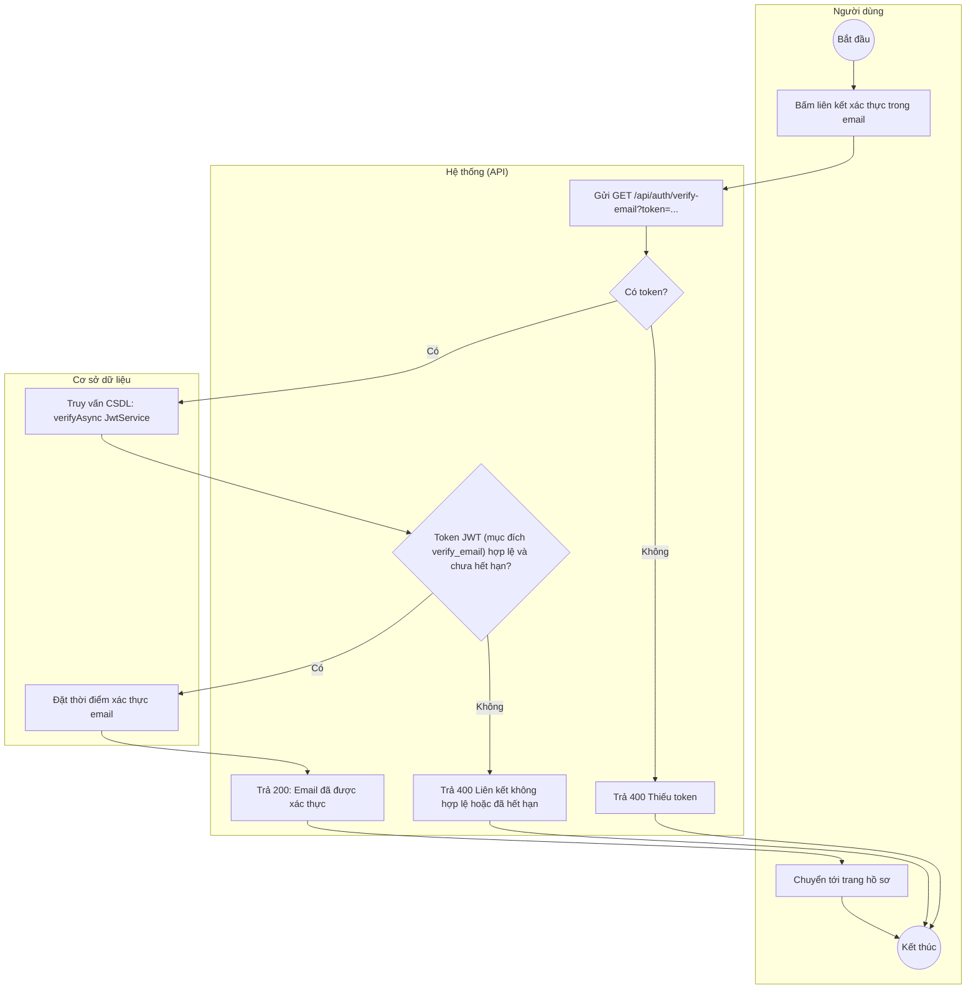
```mermaid
flowchart TD
    subgraph LANE_A["Người dùng"]
        n1(("Bắt đầu"))
        n2["Bấm liên kết xác thực trong email"]
        n11["Chuyển tới trang hồ sơ"]
        n12(("Kết thúc"))
    end
    subgraph LANE_S["Hệ thống (API)"]
        n3["Gửi GET /api/auth/verify-email?token=..."]
        n4{"Có token?"}
        n5["Trả 400 Thiếu token"]
        n7{"Token JWT (mục đích verify_email) hợp lệ và chưa hết hạn?"}
        n8["Trả 400 Liên kết không hợp lệ hoặc đã hết hạn"]
        n10["Trả 200: Email đã được xác thực"]
    end
    subgraph LANE_D["Cơ sở dữ liệu"]
        n6["Truy vấn CSDL: verifyAsync JwtService"]
        n9["Đặt thời điểm xác thực email"]
    end
    n1 --> n2
    n2 --> n3
    n3 --> n4
    n4 -->|"Không"| n5
    n4 -->|"Có"| n6
    n6 --> n7
    n7 -->|"Không"| n8
    n7 -->|"Có"| n9
    n9 --> n10
    n10 --> n11
    n11 --> n12
    n5 --> n12
    n8 --> n12
```

### A.8 UC-ACC-01 – Xem và cập nhật hồ sơ cá nhân

| Mục | Nội dung |
| --- | --- |
| Tác nhân | Người dùng |
| Ưu tiên · Nhóm | Nên có · Tài khoản |
| Tiền điều kiện | Đã đăng nhập. |
| Hậu điều kiện | Thông tin User được cập nhật. |
| Đặc tả chi tiết | [UC-ACC-01](DAC_TA_CHUC_NANG_THEO_VAI_TRO.md) |

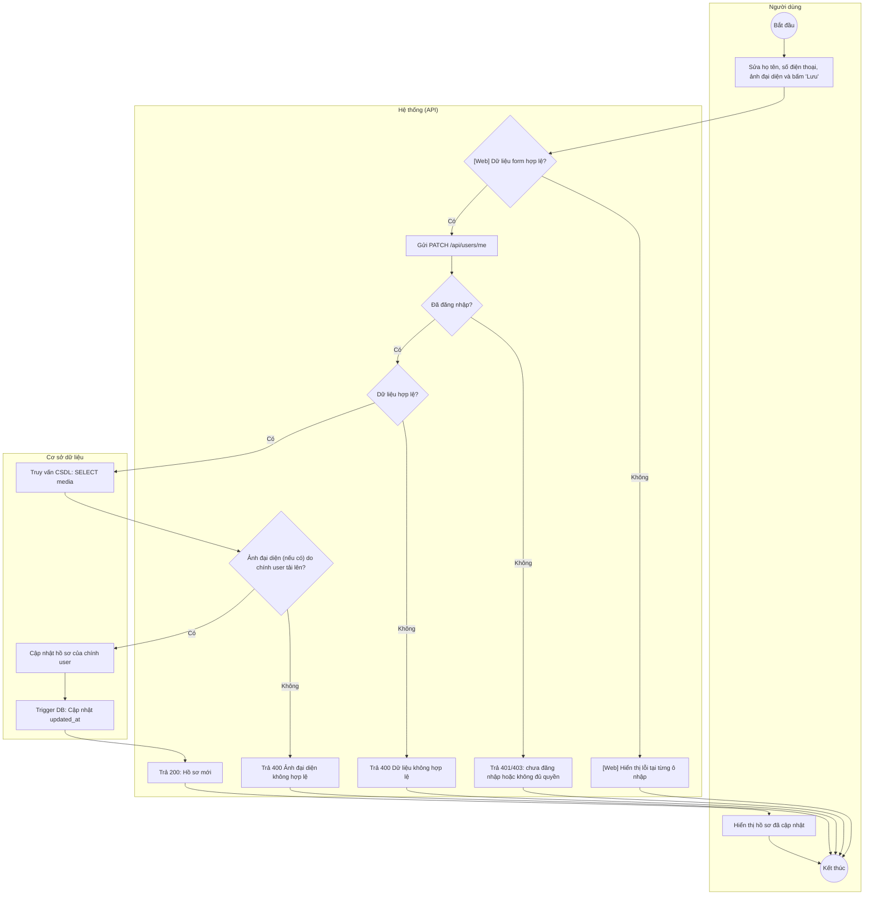
```mermaid
flowchart TD
    subgraph LANE_A["Người dùng"]
        n1(("Bắt đầu"))
        n2["Sửa họ tên, số điện thoại, ảnh đại diện và bấm 'Lưu'"]
        n16["Hiển thị hồ sơ đã cập nhật"]
        n17(("Kết thúc"))
    end
    subgraph LANE_S["Hệ thống (API)"]
        n3{"[Web] Dữ liệu form hợp lệ?"}
        n4["[Web] Hiển thị lỗi tại từng ô nhập"]
        n5["Gửi PATCH /api/users/me"]
        n6{"Đã đăng nhập?"}
        n7["Trả 401/403: chưa đăng nhập hoặc không đủ quyền"]
        n8{"Dữ liệu hợp lệ?"}
        n9["Trả 400 Dữ liệu không hợp lệ"]
        n11{"Ảnh đại diện (nếu có) do chính user tải lên?"}
        n12["Trả 400 Ảnh đại diện không hợp lệ"]
        n15["Trả 200: Hồ sơ mới"]
    end
    subgraph LANE_D["Cơ sở dữ liệu"]
        n10["Truy vấn CSDL: SELECT media"]
        n13["Cập nhật hồ sơ của chính user"]
        n14["Trigger DB: Cập nhật updated_at"]
    end
    n1 --> n2
    n2 --> n3
    n3 -->|"Không"| n4
    n3 -->|"Có"| n5
    n5 --> n6
    n6 -->|"Không"| n7
    n6 -->|"Có"| n8
    n8 -->|"Không"| n9
    n8 -->|"Có"| n10
    n10 --> n11
    n11 -->|"Không"| n12
    n11 -->|"Có"| n13
    n13 --> n14
    n14 --> n15
    n15 --> n16
    n16 --> n17
    n4 --> n17
    n7 --> n17
    n9 --> n17
    n12 --> n17
```

### A.9 UC-ACC-02 – Đổi mật khẩu

| Mục | Nội dung |
| --- | --- |
| Tác nhân | Người dùng |
| Ưu tiên · Nhóm | Nên có · Tài khoản |
| Tiền điều kiện | Đã đăng nhập. |
| Hậu điều kiện | Mật khẩu đổi; các phiên khác bị thu hồi. |
| Đặc tả chi tiết | [UC-ACC-02](DAC_TA_CHUC_NANG_THEO_VAI_TRO.md) |

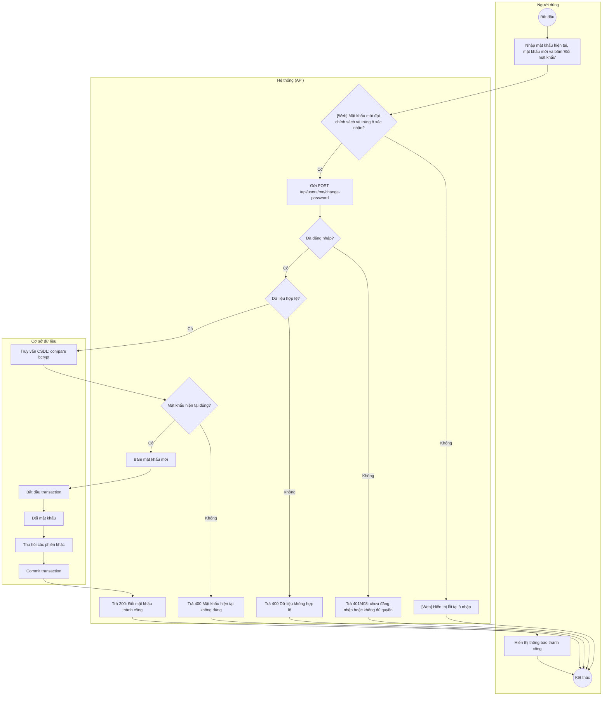
```mermaid
flowchart TD
    subgraph LANE_A["Người dùng"]
        n1(("Bắt đầu"))
        n2["Nhập mật khẩu hiện tại, mật khẩu mới và bấm 'Đổi mật khẩu'"]
        n19["Hiển thị thông báo thành công"]
        n20(("Kết thúc"))
    end
    subgraph LANE_S["Hệ thống (API)"]
        n3{"[Web] Mật khẩu mới đạt chính sách và trùng ô xác nhận?"}
        n4["[Web] Hiển thị lỗi tại ô nhập"]
        n5["Gửi POST /api/users/me/change-password"]
        n6{"Đã đăng nhập?"}
        n7["Trả 401/403: chưa đăng nhập hoặc không đủ quyền"]
        n8{"Dữ liệu hợp lệ?"}
        n9["Trả 400 Dữ liệu không hợp lệ"]
        n11{"Mật khẩu hiện tại đúng?"}
        n12["Trả 400 Mật khẩu hiện tại không đúng"]
        n13["Băm mật khẩu mới"]
        n18["Trả 200: Đổi mật khẩu thành công"]
    end
    subgraph LANE_D["Cơ sở dữ liệu"]
        n10["Truy vấn CSDL: compare bcrypt"]
        n14["Bắt đầu transaction"]
        n15["Đổi mật khẩu"]
        n16["Thu hồi các phiên khác"]
        n17["Commit transaction"]
    end
    n1 --> n2
    n2 --> n3
    n3 -->|"Không"| n4
    n3 -->|"Có"| n5
    n5 --> n6
    n6 -->|"Không"| n7
    n6 -->|"Có"| n8
    n8 -->|"Không"| n9
    n8 -->|"Có"| n10
    n10 --> n11
    n11 -->|"Không"| n12
    n11 -->|"Có"| n13
    n13 --> n14
    n14 --> n15
    n15 --> n16
    n16 --> n17
    n17 --> n18
    n18 --> n19
    n19 --> n20
    n4 --> n20
    n7 --> n20
    n9 --> n20
    n12 --> n20
```

### A.10 UC-ACC-04 – Quản lý sổ địa chỉ giao hàng

| Mục | Nội dung |
| --- | --- |
| Tác nhân | Người dùng |
| Ưu tiên · Nhóm | Nên có · Tài khoản |
| Tiền điều kiện | Đã đăng nhập. |
| Hậu điều kiện | Sổ địa chỉ của user được cập nhật; tối đa một địa chỉ mặc định. |
| Đặc tả chi tiết | [UC-ACC-04](DAC_TA_CHUC_NANG_THEO_VAI_TRO.md) |

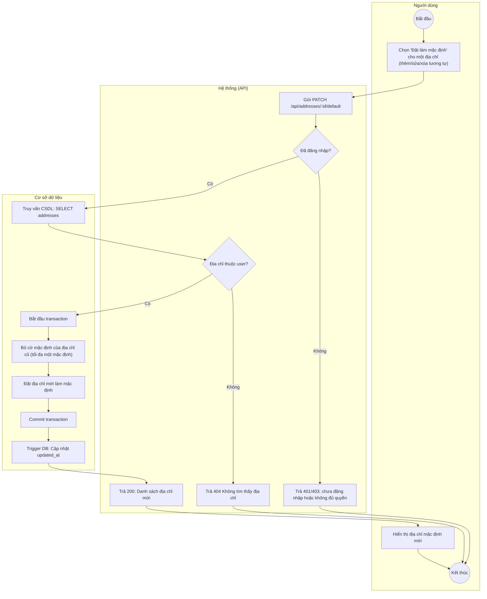
```mermaid
flowchart TD
    subgraph LANE_A["Người dùng"]
        n1(("Bắt đầu"))
        n2["Chọn 'Đặt làm mặc định' cho một địa chỉ (thêm/sửa/xóa tương tự)"]
        n15["Hiển thị địa chỉ mặc định mới"]
        n16(("Kết thúc"))
    end
    subgraph LANE_S["Hệ thống (API)"]
        n3["Gửi PATCH /api/addresses/:id/default"]
        n4{"Đã đăng nhập?"}
        n5["Trả 401/403: chưa đăng nhập hoặc không đủ quyền"]
        n7{"Địa chỉ thuộc user?"}
        n8["Trả 404 Không tìm thấy địa chỉ"]
        n14["Trả 200: Danh sách địa chỉ mới"]
    end
    subgraph LANE_D["Cơ sở dữ liệu"]
        n6["Truy vấn CSDL: SELECT addresses"]
        n9["Bắt đầu transaction"]
        n10["Bỏ cờ mặc định của địa chỉ cũ (tối đa một mặc định)"]
        n11["Đặt địa chỉ mới làm mặc định"]
        n12["Commit transaction"]
        n13["Trigger DB: Cập nhật updated_at"]
    end
    n1 --> n2
    n2 --> n3
    n3 --> n4
    n4 -->|"Không"| n5
    n4 -->|"Có"| n6
    n6 --> n7
    n7 -->|"Không"| n8
    n7 -->|"Có"| n9
    n9 --> n10
    n10 --> n11
    n11 --> n12
    n12 --> n13
    n13 --> n14
    n14 --> n15
    n15 --> n16
    n5 --> n16
    n8 --> n16
```

### A.11 UC-ACC-05 – Xem và đánh dấu đã đọc thông báo

| Mục | Nội dung |
| --- | --- |
| Tác nhân | Người dùng |
| Ưu tiên · Nhóm | Nên có · Tài khoản |
| Tiền điều kiện | Đã đăng nhập. |
| Hậu điều kiện | `readAt` được đặt cho thông báo đã đọc. |
| Đặc tả chi tiết | [UC-ACC-05](DAC_TA_CHUC_NANG_THEO_VAI_TRO.md) |

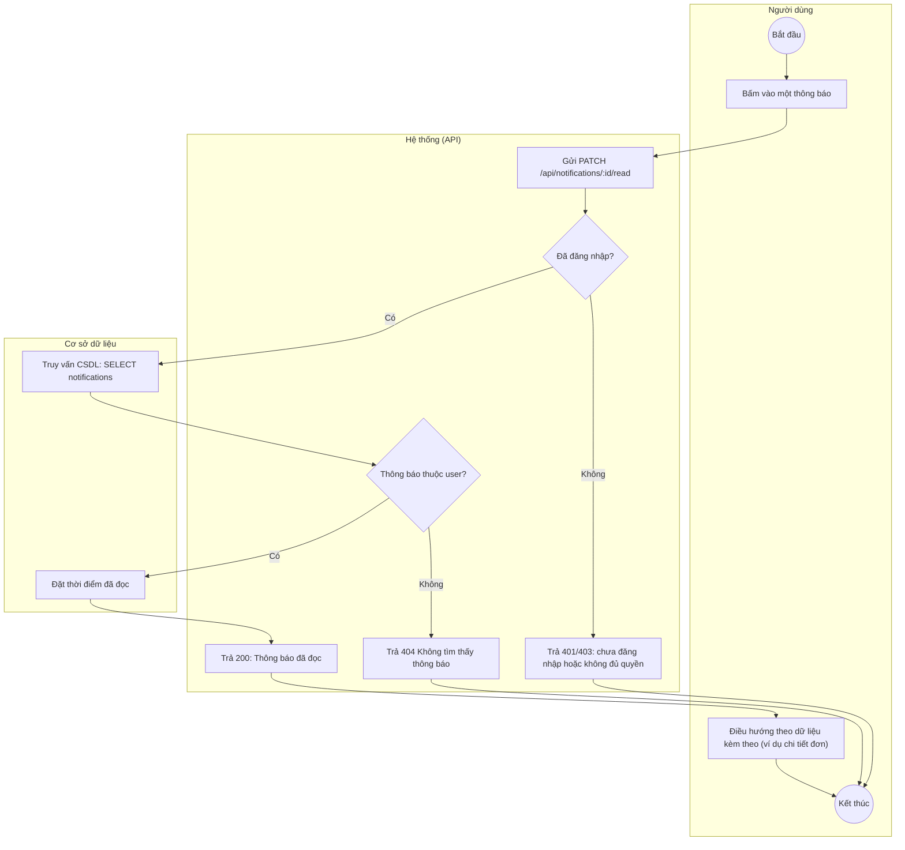
```mermaid
flowchart TD
    subgraph LANE_A["Người dùng"]
        n1(("Bắt đầu"))
        n2["Bấm vào một thông báo"]
        n11["Điều hướng theo dữ liệu kèm theo (ví dụ chi tiết đơn)"]
        n12(("Kết thúc"))
    end
    subgraph LANE_S["Hệ thống (API)"]
        n3["Gửi PATCH /api/notifications/:id/read"]
        n4{"Đã đăng nhập?"}
        n5["Trả 401/403: chưa đăng nhập hoặc không đủ quyền"]
        n7{"Thông báo thuộc user?"}
        n8["Trả 404 Không tìm thấy thông báo"]
        n10["Trả 200: Thông báo đã đọc"]
    end
    subgraph LANE_D["Cơ sở dữ liệu"]
        n6["Truy vấn CSDL: SELECT notifications"]
        n9["Đặt thời điểm đã đọc"]
    end
    n1 --> n2
    n2 --> n3
    n3 --> n4
    n4 -->|"Không"| n5
    n4 -->|"Có"| n6
    n6 --> n7
    n7 -->|"Không"| n8
    n7 -->|"Có"| n9
    n9 --> n10
    n10 --> n11
    n11 --> n12
    n5 --> n12
    n8 --> n12
```

### A.12 UC-ACC-06 – Quản lý danh sách yêu thích

| Mục | Nội dung |
| --- | --- |
| Tác nhân | Người dùng |
| Ưu tiên · Nhóm | Nên có · Tài khoản |
| Tiền điều kiện | Đã đăng nhập (khách bấm tim sẽ được yêu cầu đăng nhập). |
| Hậu điều kiện | Có/không có bản ghi Wishlist của cặp (user, sản phẩm). |
| Đặc tả chi tiết | [UC-ACC-06](DAC_TA_CHUC_NANG_THEO_VAI_TRO.md) |

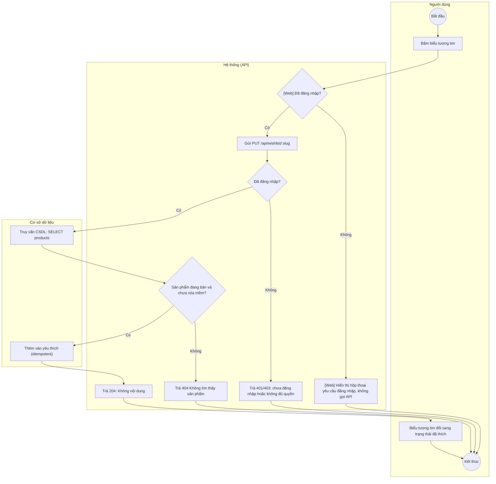
```mermaid
flowchart TD
    subgraph LANE_A["Người dùng"]
        n1(("Bắt đầu"))
        n2["Bấm biểu tượng tim"]
        n13["Biểu tượng tim đổi sang trạng thái đã thích"]
        n14(("Kết thúc"))
    end
    subgraph LANE_S["Hệ thống (API)"]
        n3{"[Web] Đã đăng nhập?"}
        n4["[Web] Hiển thị hộp thoại yêu cầu đăng nhập, không gọi API"]
        n5["Gửi PUT /api/wishlist/:slug"]
        n6{"Đã đăng nhập?"}
        n7["Trả 401/403: chưa đăng nhập hoặc không đủ quyền"]
        n9{"Sản phẩm đang bán và chưa xóa mềm?"}
        n10["Trả 404 Không tìm thấy sản phẩm"]
        n12["Trả 204: Không nội dung"]
    end
    subgraph LANE_D["Cơ sở dữ liệu"]
        n8["Truy vấn CSDL: SELECT products"]
        n11["Thêm vào yêu thích (idempotent)"]
    end
    n1 --> n2
    n2 --> n3
    n3 -->|"Không"| n4
    n3 -->|"Có"| n5
    n5 --> n6
    n6 -->|"Không"| n7
    n6 -->|"Có"| n8
    n8 --> n9
    n9 -->|"Không"| n10
    n9 -->|"Có"| n11
    n11 --> n12
    n12 --> n13
    n13 --> n14
    n4 --> n14
    n7 --> n14
    n10 --> n14
```

### A.13 UC-CAT-01 – Xem trang chủ

| Mục | Nội dung |
| --- | --- |
| Tác nhân | Khách vãng lai / Người dùng |
| Ưu tiên · Nhóm | Bắt buộc · Danh mục & sản phẩm |
| Tiền điều kiện | Không. |
| Hậu điều kiện | Không thay đổi dữ liệu. |
| Đặc tả chi tiết | [UC-CAT-01](DAC_TA_CHUC_NANG_THEO_VAI_TRO.md) |

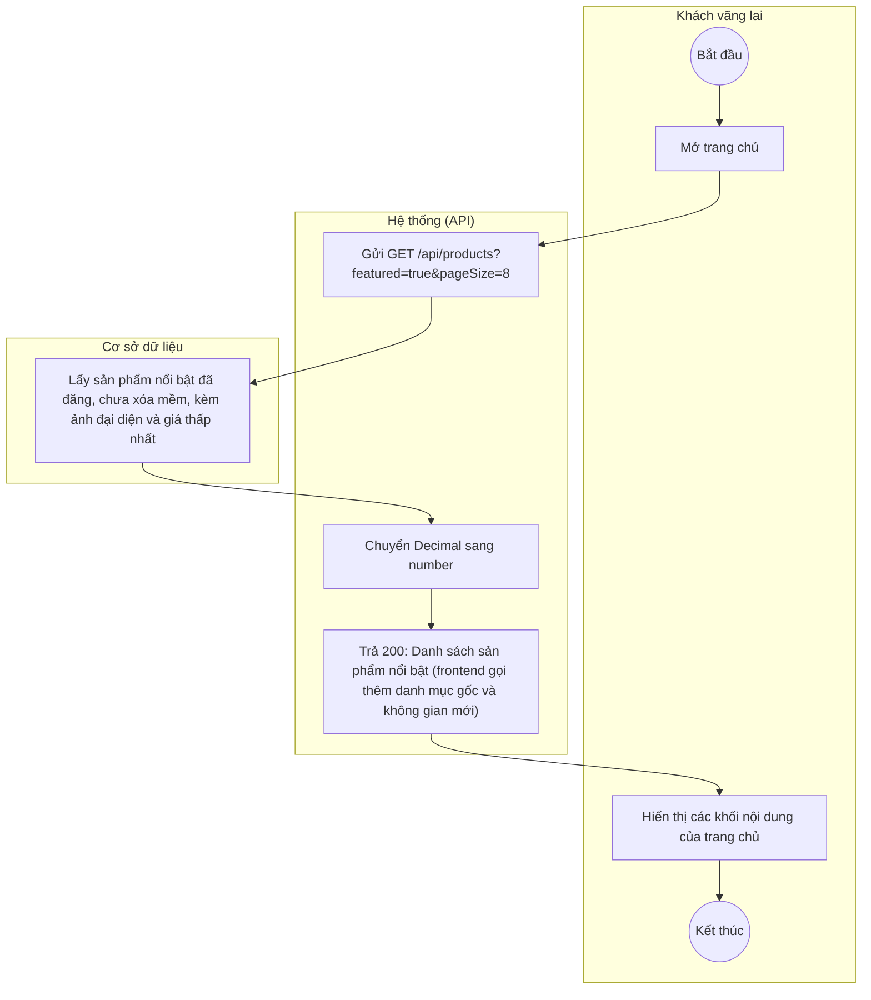
```mermaid
flowchart TD
    subgraph LANE_A["Khách vãng lai"]
        n1(("Bắt đầu"))
        n2["Mở trang chủ"]
        n7["Hiển thị các khối nội dung của trang chủ"]
        n8(("Kết thúc"))
    end
    subgraph LANE_S["Hệ thống (API)"]
        n3["Gửi GET /api/products?featured=true&pageSize=8"]
        n5["Chuyển Decimal sang number"]
        n6["Trả 200: Danh sách sản phẩm nổi bật (frontend gọi thêm danh mục gốc và không gian mới)"]
    end
    subgraph LANE_D["Cơ sở dữ liệu"]
        n4["Lấy sản phẩm nổi bật đã đăng, chưa xóa mềm, kèm ảnh đại diện và giá thấp nhất"]
    end
    n1 --> n2
    n2 --> n3
    n3 --> n4
    n4 --> n5
    n5 --> n6
    n6 --> n7
    n7 --> n8
```

### A.14 UC-CAT-02 – Duyệt sản phẩm theo danh mục

| Mục | Nội dung |
| --- | --- |
| Tác nhân | Khách vãng lai / Người dùng |
| Ưu tiên · Nhóm | Bắt buộc · Danh mục & sản phẩm |
| Tiền điều kiện | Không. |
| Hậu điều kiện | Không thay đổi dữ liệu. |
| Đặc tả chi tiết | [UC-CAT-02](DAC_TA_CHUC_NANG_THEO_VAI_TRO.md) |

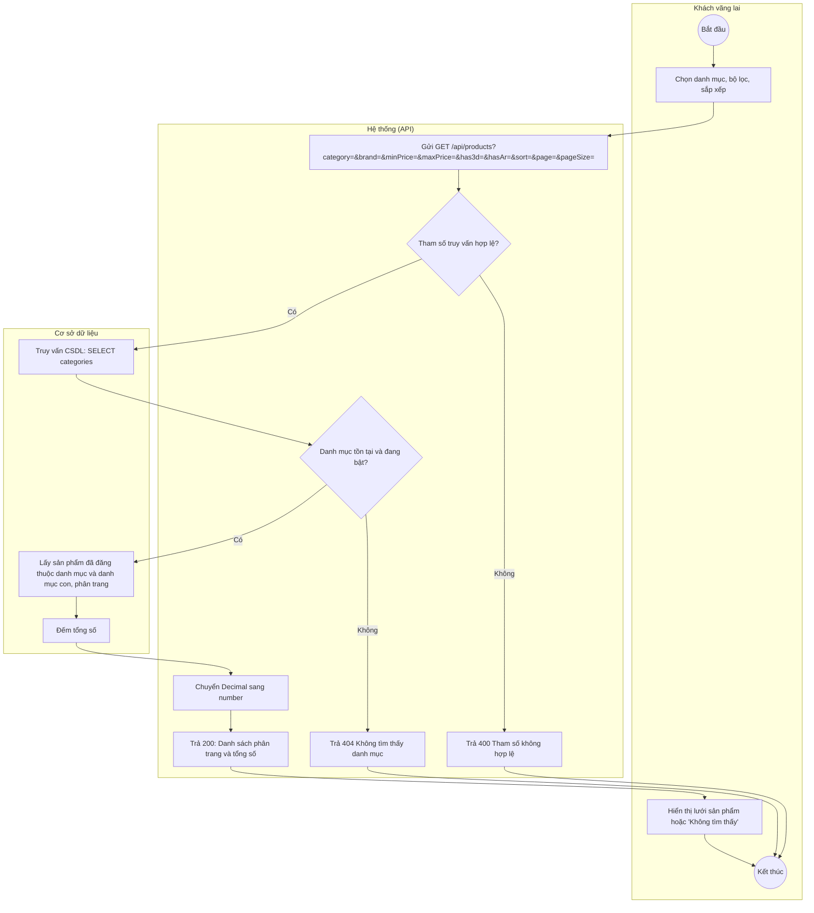
```mermaid
flowchart TD
    subgraph LANE_A["Khách vãng lai"]
        n1(("Bắt đầu"))
        n2["Chọn danh mục, bộ lọc, sắp xếp"]
        n13["Hiển thị lưới sản phẩm hoặc 'Không tìm thấy'"]
        n14(("Kết thúc"))
    end
    subgraph LANE_S["Hệ thống (API)"]
        n3["Gửi GET /api/products?category=&brand=&minPrice=&maxPrice=&has3d=&hasAr=&sort=&page=&pageSize="]
        n4{"Tham số truy vấn hợp lệ?"}
        n5["Trả 400 Tham số không hợp lệ"]
        n7{"Danh mục tồn tại và đang bật?"}
        n8["Trả 404 Không tìm thấy danh mục"]
        n11["Chuyển Decimal sang number"]
        n12["Trả 200: Danh sách phân trang và tổng số"]
    end
    subgraph LANE_D["Cơ sở dữ liệu"]
        n6["Truy vấn CSDL: SELECT categories"]
        n9["Lấy sản phẩm đã đăng thuộc danh mục và danh mục con, phân trang"]
        n10["Đếm tổng số"]
    end
    n1 --> n2
    n2 --> n3
    n3 --> n4
    n4 -->|"Không"| n5
    n4 -->|"Có"| n6
    n6 --> n7
    n7 -->|"Không"| n8
    n7 -->|"Có"| n9
    n9 --> n10
    n10 --> n11
    n11 --> n12
    n12 --> n13
    n13 --> n14
    n5 --> n14
    n8 --> n14
```

### A.15 UC-CAT-03 – Tìm kiếm sản phẩm

| Mục | Nội dung |
| --- | --- |
| Tác nhân | Khách vãng lai / Người dùng |
| Ưu tiên · Nhóm | Bắt buộc · Danh mục & sản phẩm |
| Tiền điều kiện | Không. |
| Hậu điều kiện | Không thay đổi dữ liệu. |
| Đặc tả chi tiết | [UC-CAT-03](DAC_TA_CHUC_NANG_THEO_VAI_TRO.md) |

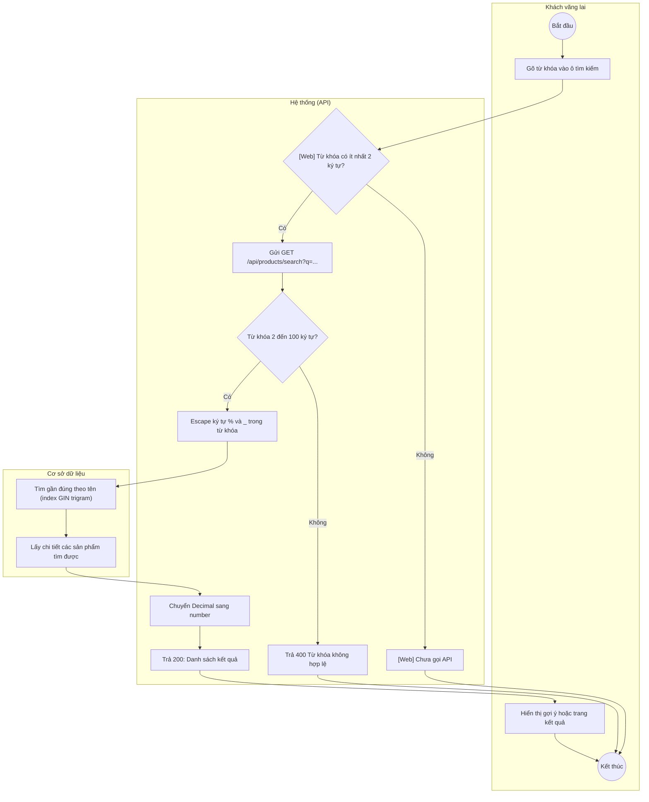
```mermaid
flowchart TD
    subgraph LANE_A["Khách vãng lai"]
        n1(("Bắt đầu"))
        n2["Gõ từ khóa vào ô tìm kiếm"]
        n13["Hiển thị gợi ý hoặc trang kết quả"]
        n14(("Kết thúc"))
    end
    subgraph LANE_S["Hệ thống (API)"]
        n3{"[Web] Từ khóa có ít nhất 2 ký tự?"}
        n4["[Web] Chưa gọi API"]
        n5["Gửi GET /api/products/search?q=..."]
        n6{"Từ khóa 2 đến 100 ký tự?"}
        n7["Trả 400 Từ khóa không hợp lệ"]
        n8["Escape ký tự % và _ trong từ khóa"]
        n11["Chuyển Decimal sang number"]
        n12["Trả 200: Danh sách kết quả"]
    end
    subgraph LANE_D["Cơ sở dữ liệu"]
        n9["Tìm gần đúng theo tên (index GIN trigram)"]
        n10["Lấy chi tiết các sản phẩm tìm được"]
    end
    n1 --> n2
    n2 --> n3
    n3 -->|"Không"| n4
    n3 -->|"Có"| n5
    n5 --> n6
    n6 -->|"Không"| n7
    n6 -->|"Có"| n8
    n8 --> n9
    n9 --> n10
    n10 --> n11
    n11 --> n12
    n12 --> n13
    n13 --> n14
    n4 --> n14
    n7 --> n14
```

### A.16 UC-CAT-04 – Xem chi tiết sản phẩm

| Mục | Nội dung |
| --- | --- |
| Tác nhân | Khách vãng lai / Người dùng |
| Ưu tiên · Nhóm | Bắt buộc · Danh mục & sản phẩm |
| Tiền điều kiện | Sản phẩm `published` và chưa xóa mềm. |
| Hậu điều kiện | Không thay đổi dữ liệu. |
| Đặc tả chi tiết | [UC-CAT-04](DAC_TA_CHUC_NANG_THEO_VAI_TRO.md) |

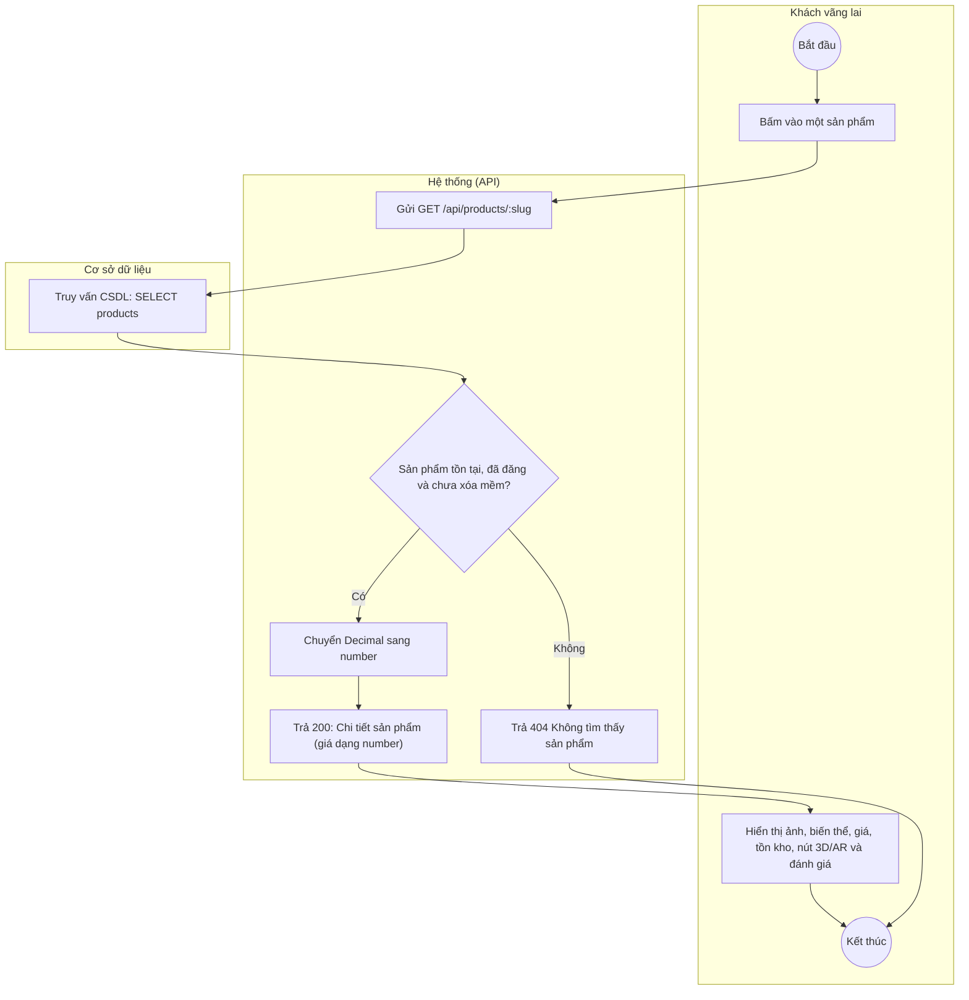
```mermaid
flowchart TD
    subgraph LANE_A["Khách vãng lai"]
        n1(("Bắt đầu"))
        n2["Bấm vào một sản phẩm"]
        n9["Hiển thị ảnh, biến thể, giá, tồn kho, nút 3D/AR và đánh giá"]
        n10(("Kết thúc"))
    end
    subgraph LANE_S["Hệ thống (API)"]
        n3["Gửi GET /api/products/:slug"]
        n5{"Sản phẩm tồn tại, đã đăng và chưa xóa mềm?"}
        n6["Trả 404 Không tìm thấy sản phẩm"]
        n7["Chuyển Decimal sang number"]
        n8["Trả 200: Chi tiết sản phẩm (giá dạng number)"]
    end
    subgraph LANE_D["Cơ sở dữ liệu"]
        n4["Truy vấn CSDL: SELECT products"]
    end
    n1 --> n2
    n2 --> n3
    n3 --> n4
    n4 --> n5
    n5 -->|"Không"| n6
    n5 -->|"Có"| n7
    n7 --> n8
    n8 --> n9
    n9 --> n10
    n6 --> n10
```

### A.17 UC-CAT-05 – Xem trang tĩnh

| Mục | Nội dung |
| --- | --- |
| Tác nhân | Khách vãng lai / Người dùng |
| Ưu tiên · Nhóm | Nên có · Danh mục & sản phẩm |
| Tiền điều kiện | Trang `published`. |
| Hậu điều kiện | Không thay đổi dữ liệu. |
| Đặc tả chi tiết | [UC-CAT-05](DAC_TA_CHUC_NANG_THEO_VAI_TRO.md) |

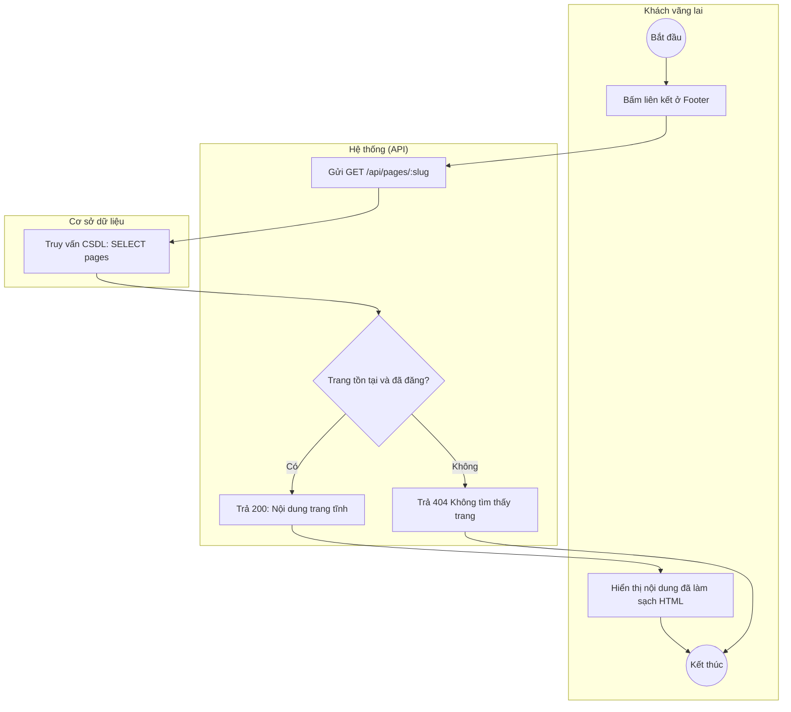
```mermaid
flowchart TD
    subgraph LANE_A["Khách vãng lai"]
        n1(("Bắt đầu"))
        n2["Bấm liên kết ở Footer"]
        n8["Hiển thị nội dung đã làm sạch HTML"]
        n9(("Kết thúc"))
    end
    subgraph LANE_S["Hệ thống (API)"]
        n3["Gửi GET /api/pages/:slug"]
        n5{"Trang tồn tại và đã đăng?"}
        n6["Trả 404 Không tìm thấy trang"]
        n7["Trả 200: Nội dung trang tĩnh"]
    end
    subgraph LANE_D["Cơ sở dữ liệu"]
        n4["Truy vấn CSDL: SELECT pages"]
    end
    n1 --> n2
    n2 --> n3
    n3 --> n4
    n4 --> n5
    n5 -->|"Không"| n6
    n5 -->|"Có"| n7
    n7 --> n8
    n8 --> n9
    n6 --> n9
```

### A.18 UC-CAT-06 – Tìm kiếm sản phẩm không dấu

| Mục | Nội dung |
| --- | --- |
| Tác nhân | Khách vãng lai / Người dùng |
| Ưu tiên · Nhóm | Nên có · Danh mục & sản phẩm |
| Tiền điều kiện | Đã có index không dấu trên `products.name` (xem quy tắc). |
| Hậu điều kiện | Không thay đổi dữ liệu. |
| Đặc tả chi tiết | [UC-CAT-06](DAC_TA_CHUC_NANG_THEO_VAI_TRO.md) |

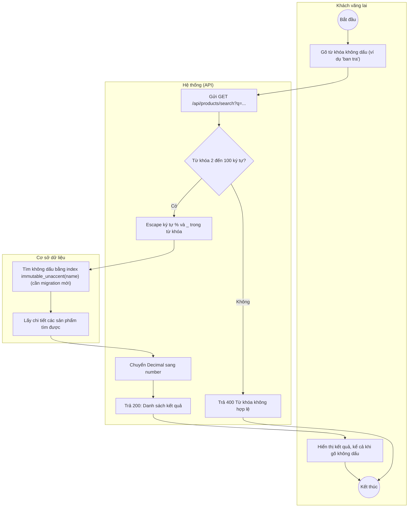
```mermaid
flowchart TD
    subgraph LANE_A["Khách vãng lai"]
        n1(("Bắt đầu"))
        n2["Gõ từ khóa không dấu (ví dụ 'ban tra')"]
        n11["Hiển thị kết quả, kể cả khi gõ không dấu"]
        n12(("Kết thúc"))
    end
    subgraph LANE_S["Hệ thống (API)"]
        n3["Gửi GET /api/products/search?q=..."]
        n4{"Từ khóa 2 đến 100 ký tự?"}
        n5["Trả 400 Từ khóa không hợp lệ"]
        n6["Escape ký tự % và _ trong từ khóa"]
        n9["Chuyển Decimal sang number"]
        n10["Trả 200: Danh sách kết quả"]
    end
    subgraph LANE_D["Cơ sở dữ liệu"]
        n7["Tìm không dấu bằng index immutable_unaccent(name) (cần migration mới)"]
        n8["Lấy chi tiết các sản phẩm tìm được"]
    end
    n1 --> n2
    n2 --> n3
    n3 --> n4
    n4 -->|"Không"| n5
    n4 -->|"Có"| n6
    n6 --> n7
    n7 --> n8
    n8 --> n9
    n9 --> n10
    n10 --> n11
    n11 --> n12
    n5 --> n12
```

### A.19 UC-CART-01 – Thêm sản phẩm vào giỏ hàng

| Mục | Nội dung |
| --- | --- |
| Tác nhân | Người dùng (khách chưa đăng nhập bị yêu cầu đăng nhập) |
| Ưu tiên · Nhóm | Bắt buộc · Giỏ hàng |
| Tiền điều kiện | Đã đăng nhập; biến thể đang bán. |
| Hậu điều kiện | Có/tăng `CartItem`; giỏ tồn tại. |
| Đặc tả chi tiết | [UC-CART-01](DAC_TA_CHUC_NANG_THEO_VAI_TRO.md) |

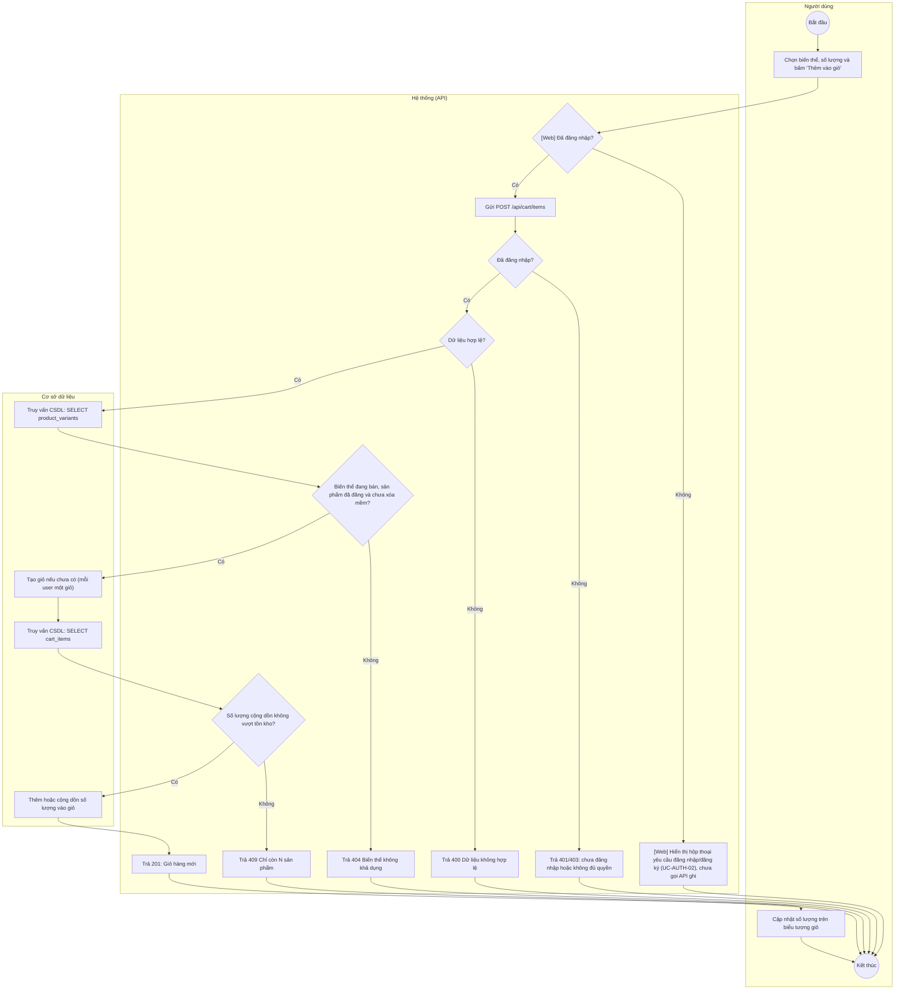
```mermaid
flowchart TD
    subgraph LANE_A["Người dùng"]
        n1(("Bắt đầu"))
        n2["Chọn biến thể, số lượng và bấm 'Thêm vào giỏ'"]
        n19["Cập nhật số lượng trên biểu tượng giỏ"]
        n20(("Kết thúc"))
    end
    subgraph LANE_S["Hệ thống (API)"]
        n3{"[Web] Đã đăng nhập?"}
        n4["[Web] Hiển thị hộp thoại yêu cầu đăng nhập/đăng ký (UC-AUTH-02), chưa gọi API ghi"]
        n5["Gửi POST /api/cart/items"]
        n6{"Đã đăng nhập?"}
        n7["Trả 401/403: chưa đăng nhập hoặc không đủ quyền"]
        n8{"Dữ liệu hợp lệ?"}
        n9["Trả 400 Dữ liệu không hợp lệ"]
        n11{"Biến thể đang bán, sản phẩm đã đăng và chưa xóa mềm?"}
        n12["Trả 404 Biến thể không khả dụng"]
        n15{"Số lượng cộng dồn không vượt tồn kho?"}
        n16["Trả 409 Chỉ còn N sản phẩm"]
        n18["Trả 201: Giỏ hàng mới"]
    end
    subgraph LANE_D["Cơ sở dữ liệu"]
        n10["Truy vấn CSDL: SELECT product_variants"]
        n13["Tạo giỏ nếu chưa có (mỗi user một giỏ)"]
        n14["Truy vấn CSDL: SELECT cart_items"]
        n17["Thêm hoặc cộng dồn số lượng vào giỏ"]
    end
    n1 --> n2
    n2 --> n3
    n3 -->|"Không"| n4
    n3 -->|"Có"| n5
    n5 --> n6
    n6 -->|"Không"| n7
    n6 -->|"Có"| n8
    n8 -->|"Không"| n9
    n8 -->|"Có"| n10
    n10 --> n11
    n11 -->|"Không"| n12
    n11 -->|"Có"| n13
    n13 --> n14
    n14 --> n15
    n15 -->|"Không"| n16
    n15 -->|"Có"| n17
    n17 --> n18
    n18 --> n19
    n19 --> n20
    n4 --> n20
    n7 --> n20
    n9 --> n20
    n12 --> n20
    n16 --> n20
```

### A.20 UC-CART-02 – Xem giỏ hàng

| Mục | Nội dung |
| --- | --- |
| Tác nhân | Người dùng |
| Ưu tiên · Nhóm | Bắt buộc · Giỏ hàng |
| Tiền điều kiện | Đã đăng nhập. |
| Hậu điều kiện | Không thay đổi dữ liệu. |
| Đặc tả chi tiết | [UC-CART-02](DAC_TA_CHUC_NANG_THEO_VAI_TRO.md) |

```mermaid
flowchart TD
    subgraph LANE_A["Người dùng"]
        n1(("Bắt đầu"))
        n2["Mở trang giỏ hàng"]
        n12["Hiển thị các dòng, cảnh báo và tổng kết CartSummary"]
        n13(("Kết thúc"))
    end
    subgraph LANE_S["Hệ thống (API)"]
        n3{"[Web] Đã đăng nhập?"}
        n4["[Web] Chuyển tới /login?redirect=/cart"]
        n5["Gửi GET /api/cart"]
        n6{"Đã đăng nhập?"}
        n7["Trả 401/403: chưa đăng nhập hoặc không đủ quyền"]
        n9["Tính giá hiện hành, cờ hết hàng/ngừng bán và subtotal bằng Prisma.Decimal"]
        n10["Chuyển Decimal sang number"]
        n11["Trả 200: Giỏ hàng (giỏ rỗng nếu chưa có)"]
    end
    subgraph LANE_D["Cơ sở dữ liệu"]
        n8["Lấy giỏ và các dòng kèm biến thể, sản phẩm, ảnh"]
    end
    n1 --> n2
    n2 --> n3
    n3 -->|"Không"| n4
    n3 -->|"Có"| n5
    n5 --> n6
    n6 -->|"Không"| n7
    n6 -->|"Có"| n8
    n8 --> n9
    n9 --> n10
    n10 --> n11
    n11 --> n12
    n12 --> n13
    n4 --> n13
    n7 --> n13
```

### A.21 UC-CART-03 – Cập nhật số lượng / xóa dòng trong giỏ

| Mục | Nội dung |
| --- | --- |
| Tác nhân | Người dùng |
| Ưu tiên · Nhóm | Bắt buộc · Giỏ hàng |
| Tiền điều kiện | Đã đăng nhập; dòng thuộc giỏ của mình. |
| Hậu điều kiện | Dòng giỏ được cập nhật/xóa. |
| Đặc tả chi tiết | [UC-CART-03](DAC_TA_CHUC_NANG_THEO_VAI_TRO.md) |

```mermaid
flowchart TD
    subgraph LANE_A["Người dùng"]
        n1(("Bắt đầu"))
        n2["Đổi số lượng hoặc bấm xóa một dòng"]
        n17["Cập nhật dòng và tổng tiền"]
        n18(("Kết thúc"))
    end
    subgraph LANE_S["Hệ thống (API)"]
        n3["Gửi PATCH /api/cart/items/:id"]
        n4{"Đã đăng nhập?"}
        n5["Trả 401/403: chưa đăng nhập hoặc không đủ quyền"]
        n6{"Dữ liệu hợp lệ?"}
        n7["Trả 400 Số lượng không hợp lệ"]
        n9{"Dòng thuộc giỏ của user?"}
        n10["Trả 404 Không tìm thấy dòng giỏ hàng"]
        n12{"Số lượng không vượt tồn kho?"}
        n13["Trả 409 Chỉ còn N sản phẩm"]
        n16["Trả 200: Giỏ hàng mới"]
    end
    subgraph LANE_D["Cơ sở dữ liệu"]
        n8["Truy vấn CSDL: SELECT cart_items"]
        n11["Truy vấn CSDL: quantity <= variant.stockQuantity"]
        n14["Cập nhật số lượng (0 thì xóa dòng)"]
        n15["Trigger DB: Cập nhật updated_at"]
    end
    n1 --> n2
    n2 --> n3
    n3 --> n4
    n4 -->|"Không"| n5
    n4 -->|"Có"| n6
    n6 -->|"Không"| n7
    n6 -->|"Có"| n8
    n8 --> n9
    n9 -->|"Không"| n10
    n9 -->|"Có"| n11
    n11 --> n12
    n12 -->|"Không"| n13
    n12 -->|"Có"| n14
    n14 --> n15
    n15 --> n16
    n16 --> n17
    n17 --> n18
    n5 --> n18
    n7 --> n18
    n10 --> n18
    n13 --> n18
```

### A.22 UC-CART-04 – Áp mã giảm giá

| Mục | Nội dung |
| --- | --- |
| Tác nhân | Người dùng |
| Ưu tiên · Nhóm | Nên có · Giỏ hàng |
| Tiền điều kiện | Đã đăng nhập; giỏ có sản phẩm. |
| Hậu điều kiện | Giao diện hiển thị số tiền giảm; chưa thay đổi dữ liệu. |
| Đặc tả chi tiết | [UC-CART-04](DAC_TA_CHUC_NANG_THEO_VAI_TRO.md) |

```mermaid
flowchart TD
    subgraph LANE_A["Người dùng"]
        n1(("Bắt đầu"))
        n2["Nhập mã giảm giá và bấm 'Áp dụng'"]
        n24["Hiển thị số tiền giảm; giữ couponCode để gửi khi đặt hàng"]
        n25(("Kết thúc"))
    end
    subgraph LANE_S["Hệ thống (API)"]
        n3{"[Web] Đã đăng nhập?"}
        n4["[Web] Hiển thị hộp thoại yêu cầu đăng nhập, chưa gọi API"]
        n5["Gửi POST /api/coupons/validate"]
        n6{"Đã đăng nhập?"}
        n7["Trả 401/403: chưa đăng nhập hoặc không đủ quyền"]
        n8{"Mã hợp lệ về định dạng?"}
        n9["Trả 400 Mã không hợp lệ"]
        n11{"Giỏ có sản phẩm?"}
        n12["Trả 400 Giỏ hàng trống"]
        n14{"Mã tồn tại, đang bật và trong thời gian hiệu lực?"}
        n15["Trả 400 Mã không tồn tại hoặc đã hết hạn"]
        n17{"Đạt giá trị đơn tối thiểu và còn lượt toàn hệ thống?"}
        n18["Trả 400 Chưa đạt điều kiện áp mã"]
        n20{"User còn lượt dùng mã này?"}
        n21["Trả 400 Bạn đã dùng hết lượt"]
        n22["Tính số tiền giảm (percent có trần maxDiscount, fixed không quá subtotal)"]
        n23["Trả 200: Số tiền giảm và tổng dự kiến (chưa ghi dữ liệu)"]
    end
    subgraph LANE_D["Cơ sở dữ liệu"]
        n10["Truy vấn CSDL: SELECT carts"]
        n13["Truy vấn CSDL: SELECT coupons"]
        n16["Truy vấn CSDL: subtotal >= minOrderValue && usedCount <"]
        n19["Truy vấn CSDL: SELECT count coupon_usages"]
    end
    n1 --> n2
    n2 --> n3
    n3 -->|"Không"| n4
    n3 -->|"Có"| n5
    n5 --> n6
    n6 -->|"Không"| n7
    n6 -->|"Có"| n8
    n8 -->|"Không"| n9
    n8 -->|"Có"| n10
    n10 --> n11
    n11 -->|"Không"| n12
    n11 -->|"Có"| n13
    n13 --> n14
    n14 -->|"Không"| n15
    n14 -->|"Có"| n16
    n16 --> n17
    n17 -->|"Không"| n18
    n17 -->|"Có"| n19
    n19 --> n20
    n20 -->|"Không"| n21
    n20 -->|"Có"| n22
    n22 --> n23
    n23 --> n24
    n24 --> n25
    n4 --> n25
    n7 --> n25
    n9 --> n25
    n12 --> n25
    n15 --> n25
    n18 --> n25
    n21 --> n25
```

### A.23 UC-ORD-01 – Đặt hàng

| Mục | Nội dung |
| --- | --- |
| Tác nhân | Người dùng \| phụ: Dịch vụ email |
| Ưu tiên · Nhóm | Bắt buộc · Đơn hàng |
| Tiền điều kiện | Đã đăng nhập; giỏ có ít nhất một dòng; có địa chỉ giao hàng. |
| Hậu điều kiện | Có `Order` (status `pending`), `OrderItem`, `Payment` (pending); tồn kho đã trừ; giỏ đã được dọn; có thông báo. |
| Đặc tả chi tiết | [UC-ORD-01](DAC_TA_CHUC_NANG_THEO_VAI_TRO.md) |

```mermaid
flowchart TD
    subgraph LANE_A["Người dùng"]
        n1(("Bắt đầu"))
        n2["Chọn địa chỉ, phương thức thanh toán, nhập mã giảm giá (nếu có) và bấm 'Đặt hàng'"]
        n42["COD hoặc chuyển khoản: trang 'Đặt hàng thành công'; online: chuyển sang bước thanh toán (UC-PAY-01)"]
        n43(("Kết thúc"))
    end
    subgraph LANE_S["Hệ thống (API)"]
        n3{"[Web] Đã đăng nhập và đã chọn địa chỉ?"}
        n4["[Web] Yêu cầu đăng nhập hoặc chọn địa chỉ, chưa gọi API"]
        n5["Gửi POST /api/orders"]
        n6{"Đã đăng nhập?"}
        n7["Trả 401/403: chưa đăng nhập hoặc không đủ quyền"]
        n8{"Dữ liệu hợp lệ?"}
        n9["Trả 400 Dữ liệu không hợp lệ"]
        n12{"Địa chỉ thuộc user?"}
        n13["Trả 404 Không tìm thấy địa chỉ"]
        n16{"Giỏ có sản phẩm?"}
        n17["Trả 400 Giỏ hàng trống"]
        n19{"Mọi dòng giỏ còn bán (biến thể active, sản phẩm đã đăng)?"}
        n20["Trả 409 Có sản phẩm không còn bán"]
        n21["Tính subtotal bằng Prisma.Decimal từ salePrice hoặc price"]
        n22["Với mỗi phần tử: dòng giỏ hàng"]
        n24{"Trừ tồn kho thành công (đủ hàng)?"}
        n25["Trả 409 Sản phẩm không đủ tồn kho"]
        n27{"Còn phần tử khác?"}
        n29{"Mã giảm giá (nếu có) còn hợp lệ và giữ được lượt dùng?"}
        n30["Trả 400 Mã giảm giá không hợp lệ hoặc đã hết lượt"]
        n32["Tính discountAmount, shippingFee và total = subtotal - discount + shipping"]
        n40["(sau commit) Tạo thông báo và gửi email xác nhận đơn"]
        n41["Trả 201: OrderResponseDto của đơn mới"]
    end
    subgraph LANE_D["Cơ sở dữ liệu"]
        n10["Bắt đầu transaction"]
        n11["Truy vấn CSDL: SELECT addresses"]
        n14["Rollback transaction"]
        n15["Truy vấn CSDL: SELECT carts"]
        n18["Truy vấn CSDL: every items"]
        n23["Truy vấn CSDL: UPDATE product_variants"]
        n26["Ghi biến động kho loại sale"]
        n28["Truy vấn CSDL: UPDATE coupons"]
        n31["Đọc phí vận chuyển mặc định và ngưỡng miễn phí"]
        n33["Tạo đơn hàng (bản chụp địa chỉ, status pending)"]
        n34["Trigger DB: Ghi dòng đầu OrderStatusHistory (null sang pending)"]
        n35["Tạo các dòng hàng (bản chụp tên, SKU, đơn giá)"]
        n36["Ghi lượt dùng mã giảm giá"]
        n37["Tạo giao dịch thanh toán chờ xử lý"]
        n38["Dọn các dòng giỏ đã đặt"]
        n39["Commit transaction"]
    end
    n1 --> n2
    n2 --> n3
    n3 -->|"Không"| n4
    n3 -->|"Có"| n5
    n5 --> n6
    n6 -->|"Không"| n7
    n6 -->|"Có"| n8
    n8 -->|"Không"| n9
    n8 -->|"Có"| n10
    n10 --> n11
    n11 --> n12
    n12 -->|"Không"| n13
    n13 --> n14
    n12 -->|"Có"| n15
    n15 --> n16
    n16 -->|"Không"| n17
    n17 --> n14
    n16 -->|"Có"| n18
    n18 --> n19
    n19 -->|"Không"| n20
    n20 --> n14
    n19 -->|"Có"| n21
    n21 --> n22
    n22 --> n23
    n23 --> n24
    n24 -->|"Không"| n25
    n25 --> n14
    n24 -->|"Có"| n26
    n26 --> n27
    n27 -->|"Có"| n22
    n27 -->|"Không"| n28
    n28 --> n29
    n29 -->|"Không"| n30
    n30 --> n14
    n29 -->|"Có"| n31
    n31 --> n32
    n32 --> n33
    n33 --> n34
    n34 --> n35
    n35 --> n36
    n36 --> n37
    n37 --> n38
    n38 --> n39
    n39 --> n40
    n40 --> n41
    n41 --> n42
    n42 --> n43
    n4 --> n43
    n7 --> n43
    n9 --> n43
    n14 --> n43
```

### A.24 UC-ORD-02 – Xem và theo dõi đơn hàng của tôi

| Mục | Nội dung |
| --- | --- |
| Tác nhân | Người dùng |
| Ưu tiên · Nhóm | Bắt buộc · Đơn hàng |
| Tiền điều kiện | Đã đăng nhập. |
| Hậu điều kiện | Không thay đổi dữ liệu. |
| Đặc tả chi tiết | [UC-ORD-02](DAC_TA_CHUC_NANG_THEO_VAI_TRO.md) |

```mermaid
flowchart TD
    subgraph LANE_A["Người dùng"]
        n1(("Bắt đầu"))
        n2["Mở danh sách đơn rồi bấm một đơn để xem chi tiết"]
        n11["Hiển thị tiến trình đơn và các nút hủy, thanh toán lại, đánh giá theo trạng thái"]
        n12(("Kết thúc"))
    end
    subgraph LANE_S["Hệ thống (API)"]
        n3["Gửi GET /api/orders/:orderCode"]
        n4{"Đã đăng nhập?"}
        n5["Trả 401/403: chưa đăng nhập hoặc không đủ quyền"]
        n7{"Đơn thuộc user?"}
        n8["Trả 404 Không tìm thấy đơn hàng"]
        n9["Chuyển Decimal sang number"]
        n10["Trả 200: Chi tiết đơn, lịch sử trạng thái, thanh toán, vận chuyển"]
    end
    subgraph LANE_D["Cơ sở dữ liệu"]
        n6["Truy vấn CSDL: SELECT orders"]
    end
    n1 --> n2
    n2 --> n3
    n3 --> n4
    n4 -->|"Không"| n5
    n4 -->|"Có"| n6
    n6 --> n7
    n7 -->|"Không"| n8
    n7 -->|"Có"| n9
    n9 --> n10
    n10 --> n11
    n11 --> n12
    n5 --> n12
    n8 --> n12
```

### A.25 UC-ORD-03 – Hủy đơn hàng

| Mục | Nội dung |
| --- | --- |
| Tác nhân | Người dùng \| phụ: Admin (UC-ADM-22 cho phạm vi rộng hơn) |
| Ưu tiên · Nhóm | Bắt buộc · Đơn hàng |
| Tiền điều kiện | Đơn của user, `status ∈ {pending, confirmed}`. |
| Hậu điều kiện | Đơn `cancelled` kèm lý do; tồn kho và lượt dùng mã được hoàn. |
| Đặc tả chi tiết | [UC-ORD-03](DAC_TA_CHUC_NANG_THEO_VAI_TRO.md) |

```mermaid
flowchart TD
    subgraph LANE_A["Người dùng"]
        n1(("Bắt đầu"))
        n2["Bấm 'Hủy đơn', nhập lý do và xác nhận"]
        n29["Hiển thị đơn đã hủy (đơn đã thanh toán: chờ cửa hàng hoàn tiền thủ công)"]
        n30(("Kết thúc"))
    end
    subgraph LANE_S["Hệ thống (API)"]
        n3["Gửi POST /api/orders/:id/cancel"]
        n4{"Đã đăng nhập?"}
        n5["Trả 401/403: chưa đăng nhập hoặc không đủ quyền"]
        n6{"Lý do hợp lệ (5 đến 500 ký tự)?"}
        n7["Trả 400 Lý do không hợp lệ"]
        n10{"Đơn thuộc user?"}
        n11["Trả 404 Không tìm thấy đơn hàng"]
        n14{"Đơn đang pending hoặc confirmed?"}
        n15["Trả 409 Đơn không thể hủy, vui lòng liên hệ cửa hàng"]
        n16["Đặt biến phiên người thực hiện"]
        n19["Với mỗi phần tử: dòng hàng còn variantId"]
        n22{"Còn phần tử khác?"}
        n27["(sau commit) Tạo thông báo cho user"]
        n28["Trả 200: Đơn sau khi hủy"]
    end
    subgraph LANE_D["Cơ sở dữ liệu"]
        n8["Bắt đầu transaction"]
        n9["Truy vấn CSDL: SELECT orders"]
        n12["Rollback transaction"]
        n13["Truy vấn CSDL: status in ['pending', 'confirmed']"]
        n17["Chuyển đơn sang cancelled kèm lý do"]
        n18["Trigger DB: Ghi OrderStatusHistory (đến cancelled, changedBy = user)"]
        n20["Hoàn tồn kho"]
        n21["Ghi biến động kho loại return"]
        n23["Hoàn lượt dùng mã giảm giá (xóa bản ghi sử dụng)"]
        n24["Giảm bộ đếm lượt dùng của mã"]
        n25["Đóng giao dịch thanh toán chờ xử lý"]
        n26["Commit transaction"]
    end
    n1 --> n2
    n2 --> n3
    n3 --> n4
    n4 -->|"Không"| n5
    n4 -->|"Có"| n6
    n6 -->|"Không"| n7
    n6 -->|"Có"| n8
    n8 --> n9
    n9 --> n10
    n10 -->|"Không"| n11
    n11 --> n12
    n10 -->|"Có"| n13
    n13 --> n14
    n14 -->|"Không"| n15
    n15 --> n12
    n14 -->|"Có"| n16
    n16 --> n17
    n17 --> n18
    n18 --> n19
    n19 --> n20
    n20 --> n21
    n21 --> n22
    n22 -->|"Có"| n19
    n22 -->|"Không"| n23
    n23 --> n24
    n24 --> n25
    n25 --> n26
    n26 --> n27
    n27 --> n28
    n28 --> n29
    n29 --> n30
    n5 --> n30
    n7 --> n30
    n12 --> n30
```

### A.26 UC-PAY-01 – Thanh toán đơn hàng online

| Mục | Nội dung |
| --- | --- |
| Tác nhân | Người dùng \| phụ: Cổng thanh toán (MoMo, VNPay, ZaloPay) |
| Ưu tiên · Nhóm | Bắt buộc · Thanh toán |
| Tiền điều kiện | Đơn `pending`, `paymentStatus = unpaid`, phương thức online (`momo`, `vnpay`, `zalopay`, `card`). |
| Hậu điều kiện | `Payment` có mã tham chiếu giao dịch; người dùng được chuyển sang cổng. |
| Đặc tả chi tiết | [UC-PAY-01](DAC_TA_CHUC_NANG_THEO_VAI_TRO.md) |

```mermaid
flowchart TD
    subgraph LANE_A["Người dùng"]
        n1(("Bắt đầu"))
        n2["Bấm 'Thanh toán' cho đơn dùng cổng online"]
        n14["Trình duyệt chuyển sang trang thanh toán của cổng"]
        n15(("Kết thúc"))
    end
    subgraph LANE_S["Hệ thống (API)"]
        n3["Gửi POST /api/payments/:orderId/checkout"]
        n4{"Đã đăng nhập?"}
        n5["Trả 401/403: chưa đăng nhập hoặc không đủ quyền"]
        n7{"Đơn thuộc user, đang pending và chưa thanh toán?"}
        n8["Trả 409 Đơn không thể thanh toán"]
        n10{"Có giao dịch pending dùng cổng online?"}
        n11["Trả 400 Phương thức thanh toán không hỗ trợ"]
        n12["Tạo URL thanh toán có chữ ký HMAC (số tiền lấy từ Order.total)"]
        n13["Trả 200: paymentUrl và thời hạn"]
    end
    subgraph LANE_D["Cơ sở dữ liệu"]
        n6["Truy vấn CSDL: SELECT orders"]
        n9["Truy vấn CSDL: SELECT payments"]
    end
    n1 --> n2
    n2 --> n3
    n3 --> n4
    n4 -->|"Không"| n5
    n4 -->|"Có"| n6
    n6 --> n7
    n7 -->|"Không"| n8
    n7 -->|"Có"| n9
    n9 --> n10
    n10 -->|"Không"| n11
    n10 -->|"Có"| n12
    n12 --> n13
    n13 --> n14
    n14 --> n15
    n5 --> n15
    n8 --> n15
    n11 --> n15
```

### A.27 UC-PAY-02 – Nhận callback/IPN từ cổng thanh toán

| Mục | Nội dung |
| --- | --- |
| Tác nhân | Cổng thanh toán (MoMo, VNPay, ZaloPay) |
| Ưu tiên · Nhóm | Bắt buộc · Thanh toán |
| Tiền điều kiện | Có `Payment` pending tương ứng. |
| Hậu điều kiện | `Payment.status` = `success` hoặc `failed`; `Order.paymentStatus` tương ứng; khi thành công và đơn đang `pending` thì đơn tự chuyển `confirmed`. |
| Đặc tả chi tiết | [UC-PAY-02](DAC_TA_CHUC_NANG_THEO_VAI_TRO.md) |

```mermaid
flowchart TD
    subgraph LANE_A["Cổng thanh toán"]
        n1(("Bắt đầu"))
        n2["Gửi thông báo kết quả giao dịch (IPN) tới máy chủ"]
        n21(("Kết thúc"))
    end
    subgraph LANE_S["Hệ thống (API)"]
        n3["Gửi POST /api/payments/:gateway/ipn"]
        n4{"Chữ ký HMAC hợp lệ?"}
        n5["Trả 400 Chữ ký không hợp lệ (RspCode 97)"]
        n7{"Tìm thấy giao dịch tương ứng và số tiền khớp Order.total?"}
        n8["Trả 400 Không tìm thấy giao dịch hoặc sai số tiền (RspCode 01 hoặc 04)"]
        n10{"Giao dịch chưa được xử lý trước đó?"}
        n11["Trả 200 Đã xử lý (idempotent)"]
        n15["Đặt ghi chú phiên (không đặt người đổi nên changedBy = NULL)"]
        n19["(sau commit) Tạo thông báo cho user"]
        n20["Trả 200: Phản hồi theo chuẩn cổng (ví dụ RspCode 00)"]
    end
    subgraph LANE_D["Cơ sở dữ liệu"]
        n6["Truy vấn CSDL: SELECT payments"]
        n9["Truy vấn CSDL: status payments"]
        n12["Bắt đầu transaction"]
        n13["Ghi kết quả giao dịch (success, mã giao dịch, phản hồi, thời điểm thanh toán)"]
        n14["Đồng bộ trạng thái thanh toán của đơn"]
        n16["Tự chuyển đơn pending sang confirmed"]
        n17["Trigger DB: Ghi OrderStatusHistory (pending sang confirmed, changedBy NULL)"]
        n18["Commit transaction"]
    end
    n1 --> n2
    n2 --> n3
    n3 --> n4
    n4 -->|"Không"| n5
    n4 -->|"Có"| n6
    n6 --> n7
    n7 -->|"Không"| n8
    n7 -->|"Có"| n9
    n9 --> n10
    n10 -->|"Không"| n11
    n10 -->|"Có"| n12
    n12 --> n13
    n13 --> n14
    n14 --> n15
    n15 --> n16
    n16 --> n17
    n17 --> n18
    n18 --> n19
    n19 --> n20
    n20 --> n21
    n5 --> n21
    n8 --> n21
    n11 --> n21
```

### A.28 UC-PAY-03 – Thanh toán lại đơn chưa thanh toán

| Mục | Nội dung |
| --- | --- |
| Tác nhân | Người dùng \| phụ: Cổng thanh toán |
| Ưu tiên · Nhóm | Nên có · Thanh toán |
| Tiền điều kiện | Đơn `pending`, `paymentStatus ∈ {unpaid, failed}`. |
| Hậu điều kiện | Có `Payment` pending mới; chuyển sang cổng. |
| Đặc tả chi tiết | [UC-PAY-03](DAC_TA_CHUC_NANG_THEO_VAI_TRO.md) |

```mermaid
flowchart TD
    subgraph LANE_A["Người dùng"]
        n1(("Bắt đầu"))
        n2["Bấm 'Thanh toán lại' (có thể đổi phương thức)"]
        n18["Trình duyệt chuyển sang trang thanh toán của cổng"]
        n19(("Kết thúc"))
    end
    subgraph LANE_S["Hệ thống (API)"]
        n3["Gửi POST /api/payments/:orderId/retry"]
        n4{"Đã đăng nhập?"}
        n5["Trả 401/403: chưa đăng nhập hoặc không đủ quyền"]
        n6{"Phương thức hợp lệ?"}
        n7["Trả 400 Phương thức không hợp lệ"]
        n9{"Đơn thuộc user, pending và chưa paid?"}
        n10["Trả 409 Đơn không thể thanh toán lại"]
        n16["Tạo URL thanh toán có chữ ký"]
        n17["Trả 200: paymentUrl"]
    end
    subgraph LANE_D["Cơ sở dữ liệu"]
        n8["Truy vấn CSDL: SELECT orders"]
        n11["Bắt đầu transaction"]
        n12["Đóng giao dịch cũ còn pending"]
        n13["Tạo giao dịch mới"]
        n14["Cập nhật phương thức và đặt lại trạng thái thanh toán"]
        n15["Commit transaction"]
    end
    n1 --> n2
    n2 --> n3
    n3 --> n4
    n4 -->|"Không"| n5
    n4 -->|"Có"| n6
    n6 -->|"Không"| n7
    n6 -->|"Có"| n8
    n8 --> n9
    n9 -->|"Không"| n10
    n9 -->|"Có"| n11
    n11 --> n12
    n12 --> n13
    n13 --> n14
    n14 --> n15
    n15 --> n16
    n16 --> n17
    n17 --> n18
    n18 --> n19
    n5 --> n19
    n7 --> n19
    n10 --> n19
```

### A.29 UC-REV-01 – Xem đánh giá sản phẩm

| Mục | Nội dung |
| --- | --- |
| Tác nhân | Khách vãng lai / Người dùng |
| Ưu tiên · Nhóm | Nên có · Đánh giá |
| Tiền điều kiện | Sản phẩm đang bán. |
| Hậu điều kiện | Không thay đổi dữ liệu. |
| Đặc tả chi tiết | [UC-REV-01](DAC_TA_CHUC_NANG_THEO_VAI_TRO.md) |

```mermaid
flowchart TD
    subgraph LANE_A["Khách vãng lai"]
        n1(("Bắt đầu"))
        n2["Cuộn tới mục 'Đánh giá'"]
        n10["Hiển thị điểm trung bình và danh sách đánh giá"]
        n11(("Kết thúc"))
    end
    subgraph LANE_S["Hệ thống (API)"]
        n3["Gửi GET /api/products/:slug/reviews?page=&rating="]
        n5{"Sản phẩm tồn tại và đang bán?"}
        n6["Trả 404 Không tìm thấy sản phẩm"]
        n8["Chuyển Decimal sang number"]
        n9["Trả 200: Danh sách đánh giá, ratingAvg, ratingCount"]
    end
    subgraph LANE_D["Cơ sở dữ liệu"]
        n4["Truy vấn CSDL: SELECT products"]
        n7["Lấy đánh giá đã duyệt, phân trang"]
    end
    n1 --> n2
    n2 --> n3
    n3 --> n4
    n4 --> n5
    n5 -->|"Không"| n6
    n5 -->|"Có"| n7
    n7 --> n8
    n8 --> n9
    n9 --> n10
    n10 --> n11
    n6 --> n11
```

### A.30 UC-REV-02 – Đánh giá sản phẩm đã mua

| Mục | Nội dung |
| --- | --- |
| Tác nhân | Người dùng |
| Ưu tiên · Nhóm | Nên có · Đánh giá |
| Tiền điều kiện | Đã đăng nhập; email đã xác thực (bắt buộc); có `OrderItem` của sản phẩm trong đơn `completed` của chính user; chưa đánh giá sản phẩm này cho đơn đó. |
| Hậu điều kiện | Có `Review` status `pending`. |
| Đặc tả chi tiết | [UC-REV-02](DAC_TA_CHUC_NANG_THEO_VAI_TRO.md) |

```mermaid
flowchart TD
    subgraph LANE_A["Người dùng"]
        n1(("Bắt đầu"))
        n2["Chọn số sao, nhập nội dung và bấm 'Gửi đánh giá'"]
        n22["Hiển thị thông báo 'Đánh giá đang chờ duyệt'"]
        n23(("Kết thúc"))
    end
    subgraph LANE_S["Hệ thống (API)"]
        n3{"[Web] Đã đăng nhập?"}
        n4["[Web] Hiển thị hộp thoại yêu cầu đăng nhập, chưa gọi API"]
        n5["Gửi POST /api/products/:slug/reviews"]
        n6{"Đã đăng nhập?"}
        n7["Trả 401/403: chưa đăng nhập hoặc không đủ quyền"]
        n8{"Số sao từ 1 đến 5?"}
        n9["Trả 400 Dữ liệu không hợp lệ"]
        n11{"Email đã được xác thực?"}
        n12["Trả 403 Cần xác thực email để đánh giá"]
        n14{"User đã mua sản phẩm (đơn completed của chính mình có sản phẩm)?"}
        n15["Trả 403 Chỉ người đã mua mới được đánh giá"]
        n17{"Chưa đánh giá sản phẩm này cho đơn này?"}
        n18["Trả 409 Bạn đã đánh giá sản phẩm này"]
        n21["Trả 201: Đánh giá đang chờ duyệt"]
    end
    subgraph LANE_D["Cơ sở dữ liệu"]
        n10["Truy vấn CSDL: SELECT users"]
        n13["Truy vấn CSDL: SELECT orders"]
        n16["Truy vấn CSDL: SELECT reviews"]
        n19["Tạo đánh giá ở trạng thái pending"]
        n20["Trigger DB: Trigger tính lại điểm trung bình (chưa đổi vì pending)"]
    end
    n1 --> n2
    n2 --> n3
    n3 -->|"Không"| n4
    n3 -->|"Có"| n5
    n5 --> n6
    n6 -->|"Không"| n7
    n6 -->|"Có"| n8
    n8 -->|"Không"| n9
    n8 -->|"Có"| n10
    n10 --> n11
    n11 -->|"Không"| n12
    n11 -->|"Có"| n13
    n13 --> n14
    n14 -->|"Không"| n15
    n14 -->|"Có"| n16
    n16 --> n17
    n17 -->|"Không"| n18
    n17 -->|"Có"| n19
    n19 --> n20
    n20 --> n21
    n21 --> n22
    n22 --> n23
    n4 --> n23
    n7 --> n23
    n9 --> n23
    n12 --> n23
    n15 --> n23
    n18 --> n23
```

### A.31 UC-3D-01 – Xem mô hình 3D của sản phẩm

| Mục | Nội dung |
| --- | --- |
| Tác nhân | Khách vãng lai / Người dùng |
| Ưu tiên · Nhóm | Nên có · 3D & AR |
| Tiền điều kiện | Sản phẩm có mô hình `status = ready` (`has3dModel = true`). |
| Hậu điều kiện | Ghi một `ArSession` mode `view_3d` (ẩn danh nếu là khách). |
| Đặc tả chi tiết | [UC-3D-01](DAC_TA_CHUC_NANG_THEO_VAI_TRO.md) |

```mermaid
flowchart TD
    subgraph LANE_A["Khách vãng lai"]
        n1(("Bắt đầu"))
        n2["Bấm tab 'Xem 3D' ở trang chi tiết"]
        n9["Tải GLB theo LOD phù hợp thiết bị; ghi nhận phiên 3D ẩn danh (UC-3D-07)"]
        n10(("Kết thúc"))
    end
    subgraph LANE_S["Hệ thống (API)"]
        n3["Gửi GET /api/products/:slug/model"]
        n5{"Sản phẩm có mô hình chính ở trạng thái ready?"}
        n6["Trả 404 Sản phẩm chưa có mô hình 3D"]
        n7["Gom các tệp GLB theo LOD và URL media"]
        n8["Trả 200: Kích thước thật, viewerConfig, ảnh chờ, danh sách tệp, biến thể vật liệu"]
    end
    subgraph LANE_D["Cơ sở dữ liệu"]
        n4["Truy vấn CSDL: SELECT product_3d_models"]
    end
    n1 --> n2
    n2 --> n3
    n3 --> n4
    n4 --> n5
    n5 -->|"Không"| n6
    n5 -->|"Có"| n7
    n7 --> n8
    n8 --> n9
    n9 --> n10
    n6 --> n10
```

### A.32 UC-3D-02 – Xem sản phẩm bằng AR (đặt vào không gian thật)

| Mục | Nội dung |
| --- | --- |
| Tác nhân | Khách vãng lai / Người dùng |
| Ưu tiên · Nhóm | Nên có · 3D & AR |
| Tiền điều kiện | `hasAr = true` (mô hình `ready` có đủ GLB và USDZ); thiết bị hỗ trợ AR. |
| Hậu điều kiện | Có `ArSession` mode `ar` với các cờ `placed`, `captured`, `addedToCart`. |
| Đặc tả chi tiết | [UC-3D-02](DAC_TA_CHUC_NANG_THEO_VAI_TRO.md) |

```mermaid
flowchart TD
    subgraph LANE_A["Khách vãng lai"]
        n1(("Bắt đầu"))
        n2["Bấm 'Xem trong không gian của bạn' trên thiết bị hỗ trợ AR"]
        n9["Mở AR (Quick Look / Scene Viewer / WebXR); ghi nhận phiên AR (UC-3D-07)"]
        n10(("Kết thúc"))
    end
    subgraph LANE_S["Hệ thống (API)"]
        n3["Gửi GET /api/products/:slug/model"]
        n5{"Sản phẩm hỗ trợ AR (có đủ GLB và USDZ ở mô hình ready)?"}
        n6["Trả 404 Sản phẩm chưa hỗ trợ AR"]
        n7["Chọn USDZ cho iOS, GLB cho Android/Web và truyền kích thước thật"]
        n8["Trả 200: Tệp AR, kích thước thật, vị trí đặt, allowScaling"]
    end
    subgraph LANE_D["Cơ sở dữ liệu"]
        n4["Truy vấn CSDL: SELECT product_3d_models"]
    end
    n1 --> n2
    n2 --> n3
    n3 --> n4
    n4 --> n5
    n5 -->|"Không"| n6
    n5 -->|"Có"| n7
    n7 --> n8
    n8 --> n9
    n9 --> n10
    n6 --> n10
```

### A.33 UC-3D-04 – Chụp và lưu ảnh AR

| Mục | Nội dung |
| --- | --- |
| Tác nhân | Người dùng |
| Ưu tiên · Nhóm | Nên có · 3D & AR |
| Tiền điều kiện | Đang trong phiên AR; đã đăng nhập. |
| Hậu điều kiện | Có `Media` (ảnh) và `ArSnapshot` (`isPublic = false`); `ArSession.captured = true`. |
| Đặc tả chi tiết | [UC-3D-04](DAC_TA_CHUC_NANG_THEO_VAI_TRO.md) |

```mermaid
flowchart TD
    subgraph LANE_A["Người dùng"]
        n1(("Bắt đầu"))
        n2["Bấm nút chụp trong chế độ AR"]
        n18["Hiển thị ảnh đã lưu, cho phép chia sẻ hoặc đặt công khai"]
        n19(("Kết thúc"))
    end
    subgraph LANE_S["Hệ thống (API)"]
        n3{"[Web] Đã đăng nhập?"}
        n4["[Web] Yêu cầu đăng nhập để lưu ảnh, chưa gọi API"]
        n5["Gửi POST /api/ar-snapshots"]
        n6{"Đã đăng nhập?"}
        n7["Trả 401/403: chưa đăng nhập hoặc không đủ quyền"]
        n8{"Tệp ảnh hợp lệ (jpeg/png/webp, tối đa 10 MB)?"}
        n9["Trả 400/413 Tệp không hợp lệ"]
        n16["Đưa job vào hàng đợi image-processing: tạo webp và thumbnail"]
        n17["Trả 201: id, imageUrl, isPublic"]
    end
    subgraph LANE_D["Cơ sở dữ liệu"]
        n11["Bắt đầu transaction"]
        n12["Tạo bản ghi media"]
        n13["Tạo ảnh AR (mặc định riêng tư)"]
        n14["Đánh dấu phiên AR đã chụp ảnh"]
        n15["Commit transaction"]
    end
    subgraph LANE_X["MinIO/S3"]
        n10["Lưu ảnh lên MinIO/S3"]
    end
    n1 --> n2
    n2 --> n3
    n3 -->|"Không"| n4
    n3 -->|"Có"| n5
    n5 --> n6
    n6 -->|"Không"| n7
    n6 -->|"Có"| n8
    n8 -->|"Không"| n9
    n8 -->|"Có"| n10
    n10 --> n11
    n11 --> n12
    n12 --> n13
    n13 --> n14
    n14 --> n15
    n15 --> n16
    n16 --> n17
    n17 --> n18
    n18 --> n19
    n4 --> n19
    n7 --> n19
    n9 --> n19
```

### A.34 UC-3D-05 – Quản lý ảnh AR của tôi (công khai/ẩn/xóa)

| Mục | Nội dung |
| --- | --- |
| Tác nhân | Người dùng |
| Ưu tiên · Nhóm | Nên có · 3D & AR |
| Tiền điều kiện | Đã đăng nhập. |
| Hậu điều kiện | `isPublic` được đổi hoặc ảnh bị xóa. |
| Đặc tả chi tiết | [UC-3D-05](DAC_TA_CHUC_NANG_THEO_VAI_TRO.md) |

```mermaid
flowchart TD
    subgraph LANE_A["Người dùng"]
        n1(("Bắt đầu"))
        n2["Bật 'Công khai' cho một ảnh AR"]
        n14["Ảnh xuất hiện ở mục 'Khách hàng đã trải nghiệm' khi công khai"]
        n15(("Kết thúc"))
    end
    subgraph LANE_S["Hệ thống (API)"]
        n3["Gửi PATCH /api/ar-snapshots/:id"]
        n4{"Đã đăng nhập?"}
        n5["Trả 401/403: chưa đăng nhập hoặc không đủ quyền"]
        n6{"isPublic là boolean?"}
        n7["Trả 400 Dữ liệu không hợp lệ"]
        n9{"Ảnh thuộc user?"}
        n10["Trả 404 Không tìm thấy ảnh"]
        n13["Trả 200: Ảnh AR sau khi cập nhật"]
    end
    subgraph LANE_D["Cơ sở dữ liệu"]
        n8["Truy vấn CSDL: SELECT ar_snapshots"]
        n11["Đổi trạng thái công khai"]
        n12["Trigger DB: Cập nhật updated_at"]
    end
    n1 --> n2
    n2 --> n3
    n3 --> n4
    n4 -->|"Không"| n5
    n4 -->|"Có"| n6
    n6 -->|"Không"| n7
    n6 -->|"Có"| n8
    n8 --> n9
    n9 -->|"Không"| n10
    n9 -->|"Có"| n11
    n11 --> n12
    n12 --> n13
    n13 --> n14
    n14 --> n15
    n5 --> n15
    n7 --> n15
    n10 --> n15
```

### A.35 UC-3D-06 – Xem ảnh AR công khai "Khách hàng đã trải nghiệm"

| Mục | Nội dung |
| --- | --- |
| Tác nhân | Khách vãng lai / Người dùng |
| Ưu tiên · Nhóm | Nên có · 3D & AR |
| Tiền điều kiện |  |
| Hậu điều kiện |  |
| Đặc tả chi tiết | [UC-3D-06](DAC_TA_CHUC_NANG_THEO_VAI_TRO.md) |

```mermaid
flowchart TD
    subgraph LANE_A["Khách vãng lai"]
        n1(("Bắt đầu"))
        n2["Mở mục 'Khách hàng đã trải nghiệm'"]
        n6["Hiển thị lưới ảnh"]
        n7(("Kết thúc"))
    end
    subgraph LANE_S["Hệ thống (API)"]
        n3["Gửi GET /api/ar-snapshots/public?productId=&page="]
        n5["Trả 200: Danh sách ảnh công khai (không lộ email, điện thoại)"]
    end
    subgraph LANE_D["Cơ sở dữ liệu"]
        n4["Lấy ảnh công khai kèm tên rút gọn người chụp"]
    end
    n1 --> n2
    n2 --> n3
    n3 --> n4
    n4 --> n5
    n5 --> n6
    n6 --> n7
```

### A.36 UC-SPACE-01 – Duyệt và tìm kiếm không gian mẫu

| Mục | Nội dung |
| --- | --- |
| Tác nhân | Khách vãng lai / Người dùng |
| Ưu tiên · Nhóm | Nên có · Không gian mẫu |
| Tiền điều kiện | Không. |
| Hậu điều kiện | Không thay đổi dữ liệu. |
| Đặc tả chi tiết | [UC-SPACE-01](DAC_TA_CHUC_NANG_THEO_VAI_TRO.md) |

```mermaid
flowchart TD
    subgraph LANE_A["Khách vãng lai"]
        n1(("Bắt đầu"))
        n2["Chọn loại phòng, phong cách hoặc gõ tìm kiếm"]
        n9["Hiển thị lưới không gian mẫu"]
        n10(("Kết thúc"))
    end
    subgraph LANE_S["Hệ thống (API)"]
        n3["Gửi GET /api/spaces?roomType=&style=&category=&q=&sort=&page="]
        n4{"Tham số hợp lệ (roomType thuộc enum)?"}
        n5["Trả 400 Tham số không hợp lệ"]
        n8["Trả 200: Danh sách phân trang"]
    end
    subgraph LANE_D["Cơ sở dữ liệu"]
        n6["Tìm không gian đã đăng, không dấu theo tiêu đề (index GIN)"]
        n7["Lấy chi tiết thẻ không gian (ảnh bìa, loại phòng, viewCount)"]
    end
    n1 --> n2
    n2 --> n3
    n3 --> n4
    n4 -->|"Không"| n5
    n4 -->|"Có"| n6
    n6 --> n7
    n7 --> n8
    n8 --> n9
    n9 --> n10
    n5 --> n10
```

### A.37 UC-SPACE-02 – Xem không gian mẫu 360°

| Mục | Nội dung |
| --- | --- |
| Tác nhân | Khách vãng lai / Người dùng |
| Ưu tiên · Nhóm | Nên có · Không gian mẫu |
| Tiền điều kiện | Không gian `published`. |
| Hậu điều kiện | Khi người xem rời trang, có một `SpaceView` (ẩn danh nếu là khách) và `Space.viewCount` tăng. |
| Đặc tả chi tiết | [UC-SPACE-02](DAC_TA_CHUC_NANG_THEO_VAI_TRO.md) |

```mermaid
flowchart TD
    subgraph LANE_A["Khách vãng lai"]
        n1(("Bắt đầu"))
        n2["Bấm vào một không gian mẫu để tham quan"]
        n9["Mở ảnh mở đầu với góc nhìn mặc định; sau đó ghi lượt xem một lần khi rời trang (UC-SPACE-06)"]
        n10(("Kết thúc"))
    end
    subgraph LANE_S["Hệ thống (API)"]
        n3["Gửi GET /api/spaces/:slug"]
        n5{"Không gian tồn tại và đã đăng?"}
        n6["Trả 404 Không tìm thấy không gian"]
        n7["Chọn ảnh mở đầu (isStart) và chuẩn hóa dữ liệu"]
        n8["Trả 200: Không gian, ảnh 360°, hotspot, placement"]
    end
    subgraph LANE_D["Cơ sở dữ liệu"]
        n4["Truy vấn CSDL: SELECT spaces"]
    end
    n1 --> n2
    n2 --> n3
    n3 --> n4
    n4 --> n5
    n5 -->|"Không"| n6
    n5 -->|"Có"| n7
    n7 --> n8
    n8 --> n9
    n9 --> n10
    n6 --> n10
```

### A.38 UC-SPACE-03 – Bấm điểm sản phẩm trong phòng mẫu (mua theo phong cách phòng)

| Mục | Nội dung |
| --- | --- |
| Tác nhân | Khách vãng lai / Người dùng |
| Ưu tiên · Nhóm | Nên có · Không gian mẫu |
| Tiền điều kiện |  |
| Hậu điều kiện |  |
| Đặc tả chi tiết | [UC-SPACE-03](DAC_TA_CHUC_NANG_THEO_VAI_TRO.md) |

```mermaid
flowchart TD
    subgraph LANE_A["Khách vãng lai"]
        n1(("Bắt đầu"))
        n2["Bấm vào hotspot loại sản phẩm trong phòng 360°"]
        n9["Hiện thẻ sản phẩm; nút 'Xem chi tiết' hoặc 'Thêm vào giỏ' (UC-CART-01); tăng bộ đếm hotspot cục bộ"]
        n10(("Kết thúc"))
    end
    subgraph LANE_S["Hệ thống (API)"]
        n3["Gửi GET /api/products/:slug"]
        n5{"Sản phẩm tồn tại, đã đăng và chưa xóa mềm?"}
        n6["Trả 404 Sản phẩm không còn bán"]
        n7["Chuyển Decimal sang number"]
        n8["Trả 200: Thông tin nhanh của sản phẩm"]
    end
    subgraph LANE_D["Cơ sở dữ liệu"]
        n4["Truy vấn CSDL: SELECT products"]
    end
    n1 --> n2
    n2 --> n3
    n3 --> n4
    n4 --> n5
    n5 -->|"Không"| n6
    n5 -->|"Có"| n7
    n7 --> n8
    n8 --> n9
    n9 --> n10
    n6 --> n10
```

### A.39 UC-SPACE-04 – Lưu / bỏ lưu không gian mẫu yêu thích

| Mục | Nội dung |
| --- | --- |
| Tác nhân | Người dùng |
| Ưu tiên · Nhóm | Nên có · Không gian mẫu |
| Tiền điều kiện | Đã đăng nhập (khách bấm lưu được yêu cầu đăng nhập). |
| Hậu điều kiện | Có/không có `SpaceBookmark` của cặp (user, không gian). |
| Đặc tả chi tiết | [UC-SPACE-04](DAC_TA_CHUC_NANG_THEO_VAI_TRO.md) |

```mermaid
flowchart TD
    subgraph LANE_A["Người dùng"]
        n1(("Bắt đầu"))
        n2["Bấm biểu tượng 'Lưu' ở không gian mẫu"]
        n13["Biểu tượng 'Lưu' đổi sang đã lưu"]
        n14(("Kết thúc"))
    end
    subgraph LANE_S["Hệ thống (API)"]
        n3{"[Web] Đã đăng nhập?"}
        n4["[Web] Hiển thị hộp thoại yêu cầu đăng nhập, chưa gọi API"]
        n5["Gửi PUT /api/spaces/:slug/bookmark"]
        n6{"Đã đăng nhập?"}
        n7["Trả 401/403: chưa đăng nhập hoặc không đủ quyền"]
        n9{"Không gian tồn tại và đã đăng?"}
        n10["Trả 404 Không tìm thấy không gian"]
        n12["Trả 204: Không nội dung"]
    end
    subgraph LANE_D["Cơ sở dữ liệu"]
        n8["Truy vấn CSDL: SELECT spaces"]
        n11["Lưu không gian (idempotent)"]
    end
    n1 --> n2
    n2 --> n3
    n3 -->|"Không"| n4
    n3 -->|"Có"| n5
    n5 --> n6
    n6 -->|"Không"| n7
    n6 -->|"Có"| n8
    n8 --> n9
    n9 -->|"Không"| n10
    n9 -->|"Có"| n11
    n11 --> n12
    n12 --> n13
    n13 --> n14
    n4 --> n14
    n7 --> n14
    n10 --> n14
```

### A.40 UC-ADM-01 – Quản lý người dùng

| Mục | Nội dung |
| --- | --- |
| Tác nhân | Quản trị viên (quyền `manage_users`) |
| Ưu tiên · Nhóm | Nên có · Quản trị |
| Tiền điều kiện | Admin đã đăng nhập, có quyền `manage_users`. |
| Hậu điều kiện | Trạng thái tài khoản thay đổi; phiên đăng nhập bị thu hồi khi khóa/cấm; có `ActivityLog`. |
| Đặc tả chi tiết | [UC-ADM-01](DAC_TA_CHUC_NANG_THEO_VAI_TRO.md) |

```mermaid
flowchart TD
    subgraph LANE_A["Quản trị viên"]
        n1(("Bắt đầu"))
        n2["Chọn người dùng và bấm 'Khóa', 'Cấm', 'Mở khóa' hoặc 'Xóa'"]
        n21["Hiển thị trạng thái mới"]
        n22(("Kết thúc"))
    end
    subgraph LANE_S["Hệ thống (API)"]
        n3["Gửi PATCH /api/admin/users/:id/status"]
        n4{"Đã đăng nhập và đủ quyền?"}
        n5["Trả 401/403: chưa đăng nhập hoặc không đủ quyền"]
        n6{"Trạng thái thuộc active, suspended, banned?"}
        n7["Trả 400 Trạng thái không hợp lệ"]
        n9{"Người dùng tồn tại?"}
        n10["Trả 404 Không tìm thấy người dùng"]
        n12{"Không phải tự khóa mình hoặc quản trị viên cuối cùng?"}
        n13["Trả 409 Không thể thực hiện với tài khoản này"]
        n20["Trả 200: Hồ sơ người dùng sau khi đổi"]
    end
    subgraph LANE_D["Cơ sở dữ liệu"]
        n8["Truy vấn CSDL: SELECT users"]
        n11["Truy vấn CSDL: SELECT count user_roles"]
        n14["Bắt đầu transaction"]
        n15["Đổi trạng thái tài khoản"]
        n16["Thu hồi mọi phiên đăng nhập"]
        n17["Ghi nhật ký hoạt động của admin"]
        n18["Commit transaction"]
        n19["Trigger DB: Cập nhật updated_at"]
    end
    n1 --> n2
    n2 --> n3
    n3 --> n4
    n4 -->|"Không"| n5
    n4 -->|"Có"| n6
    n6 -->|"Không"| n7
    n6 -->|"Có"| n8
    n8 --> n9
    n9 -->|"Không"| n10
    n9 -->|"Có"| n11
    n11 --> n12
    n12 -->|"Không"| n13
    n12 -->|"Có"| n14
    n14 --> n15
    n15 --> n16
    n16 --> n17
    n17 --> n18
    n18 --> n19
    n19 --> n20
    n20 --> n21
    n21 --> n22
    n5 --> n22
    n7 --> n22
    n10 --> n22
    n13 --> n22
```

### A.41 UC-ADM-03 – Quản lý cài đặt hệ thống

| Mục | Nội dung |
| --- | --- |
| Tác nhân | Quản trị viên (quyền `manage_settings`) |
| Ưu tiên · Nhóm | Nên có · Quản trị |
| Tiền điều kiện | Admin có quyền `manage_settings`. |
| Hậu điều kiện | Giá trị cấu hình được cập nhật; có `ActivityLog`. |
| Đặc tả chi tiết | [UC-ADM-03](DAC_TA_CHUC_NANG_THEO_VAI_TRO.md) |

```mermaid
flowchart TD
    subgraph LANE_A["Quản trị viên"]
        n1(("Bắt đầu"))
        n2["Sửa giá trị cấu hình (ví dụ phí vận chuyển mặc định) và bấm 'Lưu'"]
        n13["Hiển thị cấu hình đã lưu"]
        n14(("Kết thúc"))
    end
    subgraph LANE_S["Hệ thống (API)"]
        n3["Gửi PUT /api/admin/settings/:key"]
        n4{"Đã đăng nhập và đủ quyền?"}
        n5["Trả 401/403: chưa đăng nhập hoặc không đủ quyền"]
        n6{"Khóa hợp lệ và giá trị đúng kiểu?"}
        n7["Trả 400 Khóa hoặc giá trị không hợp lệ"]
        n12["Trả 200: Khóa, giá trị, thời điểm cập nhật"]
    end
    subgraph LANE_D["Cơ sở dữ liệu"]
        n8["Đọc giá trị cũ để ghi nhật ký"]
        n9["Lưu giá trị mới (JSONB)"]
        n10["Ghi nhật ký hoạt động (trước và sau)"]
        n11["Trigger DB: Cập nhật updated_at"]
    end
    n1 --> n2
    n2 --> n3
    n3 --> n4
    n4 -->|"Không"| n5
    n4 -->|"Có"| n6
    n6 -->|"Không"| n7
    n6 -->|"Có"| n8
    n8 --> n9
    n9 --> n10
    n10 --> n11
    n11 --> n12
    n12 --> n13
    n13 --> n14
    n5 --> n14
    n7 --> n14
```

### A.42 UC-ADM-04 – Quản lý media (ảnh, tệp)

| Mục | Nội dung |
| --- | --- |
| Tác nhân | Quản trị viên (quyền `manage_products` hoặc `manage_content`) |
| Ưu tiên · Nhóm | Bắt buộc · Quản trị |
| Tiền điều kiện | Admin đã đăng nhập, có quyền. |
| Hậu điều kiện | Tệp lưu trên MinIO/S3; có bản ghi `Media`. |
| Đặc tả chi tiết | [UC-ADM-04](DAC_TA_CHUC_NANG_THEO_VAI_TRO.md) |

```mermaid
flowchart TD
    subgraph LANE_A["Quản trị viên"]
        n1(("Bắt đầu"))
        n2["Chọn ảnh (≤ 5 MB) hoặc ảnh 360° (≤ 20 MB, tải bằng presigned PUT) và bấm 'Tải lên'"]
        n13["Tệp xuất hiện trong thư viện"]
        n14(("Kết thúc"))
    end
    subgraph LANE_S["Hệ thống (API)"]
        n3["Gửi POST /api/admin/media"]
        n4{"Đã đăng nhập và đủ quyền?"}
        n5["Trả 401/403: chưa đăng nhập hoặc không đủ quyền"]
        n6{"Loại MIME và dung lượng cho phép?"}
        n7["Trả 400/413 Tệp không hợp lệ"]
        n10["Đưa job vào hàng đợi image-processing: tạo webp và thumbnail"]
        n12["Trả 201: id, url, mimeType, fileSize"]
    end
    subgraph LANE_D["Cơ sở dữ liệu"]
        n9["Tạo bản ghi media"]
        n11["Ghi nhật ký hoạt động"]
    end
    subgraph LANE_X["MinIO/S3"]
        n8["Lưu tệp lên MinIO/S3"]
    end
    n1 --> n2
    n2 --> n3
    n3 --> n4
    n4 -->|"Không"| n5
    n4 -->|"Có"| n6
    n6 -->|"Không"| n7
    n6 -->|"Có"| n8
    n8 --> n9
    n9 --> n10
    n10 --> n11
    n11 --> n12
    n12 --> n13
    n13 --> n14
    n5 --> n14
    n7 --> n14
```

### A.43 UC-ADM-05 – Quản lý danh mục sản phẩm

| Mục | Nội dung |
| --- | --- |
| Tác nhân | Quản trị viên (quyền `manage_products`) |
| Ưu tiên · Nhóm | Bắt buộc · Quản trị |
| Tiền điều kiện | Admin có quyền. |
| Hậu điều kiện | Cây danh mục được cập nhật; có `ActivityLog`. |
| Đặc tả chi tiết | [UC-ADM-05](DAC_TA_CHUC_NANG_THEO_VAI_TRO.md) |

```mermaid
flowchart TD
    subgraph LANE_A["Quản trị viên"]
        n1(("Bắt đầu"))
        n2["Nhập tên, slug, danh mục cha, ảnh, thứ tự và bấm 'Lưu'"]
        n17["Cây danh mục được cập nhật"]
        n18(("Kết thúc"))
    end
    subgraph LANE_S["Hệ thống (API)"]
        n3["Gửi POST /api/admin/categories"]
        n4{"Đã đăng nhập và đủ quyền?"}
        n5["Trả 401/403: chưa đăng nhập hoặc không đủ quyền"]
        n6{"Dữ liệu hợp lệ?"}
        n7["Trả 400 Dữ liệu không hợp lệ"]
        n9{"Slug chưa được dùng?"}
        n10["Trả 409 Slug đã tồn tại"]
        n12{"Danh mục cha không tạo vòng lặp?"}
        n13["Trả 400 Danh mục cha không hợp lệ"]
        n16["Trả 201: Danh mục mới"]
    end
    subgraph LANE_D["Cơ sở dữ liệu"]
        n8["Truy vấn CSDL: SELECT categories"]
        n11["Truy vấn CSDL: isDescendant CategoriesService"]
        n14["Tạo danh mục"]
        n15["Ghi nhật ký hoạt động"]
    end
    n1 --> n2
    n2 --> n3
    n3 --> n4
    n4 -->|"Không"| n5
    n4 -->|"Có"| n6
    n6 -->|"Không"| n7
    n6 -->|"Có"| n8
    n8 --> n9
    n9 -->|"Không"| n10
    n9 -->|"Có"| n11
    n11 --> n12
    n12 -->|"Không"| n13
    n12 -->|"Có"| n14
    n14 --> n15
    n15 --> n16
    n16 --> n17
    n17 --> n18
    n5 --> n18
    n7 --> n18
    n10 --> n18
    n13 --> n18
```

### A.44 UC-ADM-06 – Quản lý thương hiệu

| Mục | Nội dung |
| --- | --- |
| Tác nhân | Quản trị viên (quyền `manage_products`) |
| Ưu tiên · Nhóm | Nên có · Quản trị |
| Tiền điều kiện | Admin có quyền. |
| Hậu điều kiện | Danh sách thương hiệu được cập nhật. |
| Đặc tả chi tiết | [UC-ADM-06](DAC_TA_CHUC_NANG_THEO_VAI_TRO.md) |

```mermaid
flowchart TD
    subgraph LANE_A["Quản trị viên"]
        n1(("Bắt đầu"))
        n2["Nhập tên, slug, logo và bấm 'Lưu'"]
        n14["Danh sách thương hiệu được cập nhật"]
        n15(("Kết thúc"))
    end
    subgraph LANE_S["Hệ thống (API)"]
        n3["Gửi POST /api/admin/brands"]
        n4{"Đã đăng nhập và đủ quyền?"}
        n5["Trả 401/403: chưa đăng nhập hoặc không đủ quyền"]
        n6{"Dữ liệu hợp lệ?"}
        n7["Trả 400 Dữ liệu không hợp lệ"]
        n9{"Slug chưa được dùng?"}
        n10["Trả 409 Slug đã tồn tại"]
        n13["Trả 201: Thương hiệu mới"]
    end
    subgraph LANE_D["Cơ sở dữ liệu"]
        n8["Truy vấn CSDL: SELECT brands"]
        n11["Tạo thương hiệu"]
        n12["Ghi nhật ký hoạt động"]
    end
    n1 --> n2
    n2 --> n3
    n3 --> n4
    n4 -->|"Không"| n5
    n4 -->|"Có"| n6
    n6 -->|"Không"| n7
    n6 -->|"Có"| n8
    n8 --> n9
    n9 -->|"Không"| n10
    n9 -->|"Có"| n11
    n11 --> n12
    n12 --> n13
    n13 --> n14
    n14 --> n15
    n5 --> n15
    n7 --> n15
    n10 --> n15
```

### A.45 UC-ADM-07 – Quản lý trang tĩnh

| Mục | Nội dung |
| --- | --- |
| Tác nhân | Quản trị viên (quyền `manage_content`) |
| Ưu tiên · Nhóm | Nên có · Quản trị |
| Tiền điều kiện | Admin có quyền. |
| Hậu điều kiện | Trang thay đổi trạng thái/nội dung. |
| Đặc tả chi tiết | [UC-ADM-07](DAC_TA_CHUC_NANG_THEO_VAI_TRO.md) |

```mermaid
flowchart TD
    subgraph LANE_A["Quản trị viên"]
        n1(("Bắt đầu"))
        n2["Soạn nội dung, chọn trạng thái và bấm 'Lưu'"]
        n15["Danh sách trang được cập nhật"]
        n16(("Kết thúc"))
    end
    subgraph LANE_S["Hệ thống (API)"]
        n3["Gửi POST /api/admin/pages"]
        n4{"Đã đăng nhập và đủ quyền?"}
        n5["Trả 401/403: chưa đăng nhập hoặc không đủ quyền"]
        n6{"Dữ liệu hợp lệ?"}
        n7["Trả 400 Dữ liệu không hợp lệ"]
        n9{"Slug chưa được dùng?"}
        n10["Trả 409 Slug đã tồn tại"]
        n11["Làm sạch HTML trước khi lưu"]
        n14["Trả 201: Trang mới"]
    end
    subgraph LANE_D["Cơ sở dữ liệu"]
        n8["Truy vấn CSDL: SELECT pages"]
        n12["Tạo trang (đặt publishedAt khi đăng)"]
        n13["Ghi nhật ký hoạt động"]
    end
    n1 --> n2
    n2 --> n3
    n3 --> n4
    n4 -->|"Không"| n5
    n4 -->|"Có"| n6
    n6 -->|"Không"| n7
    n6 -->|"Có"| n8
    n8 --> n9
    n9 -->|"Không"| n10
    n9 -->|"Có"| n11
    n11 --> n12
    n12 --> n13
    n13 --> n14
    n14 --> n15
    n15 --> n16
    n5 --> n16
    n7 --> n16
    n10 --> n16
```

### A.46 UC-ADM-08 – Quản lý thuộc tính và giá trị thuộc tính

| Mục | Nội dung |
| --- | --- |
| Tác nhân | Quản trị viên (quyền `manage_products`) |
| Ưu tiên · Nhóm | Bắt buộc · Quản trị |
| Tiền điều kiện | Admin có quyền. |
| Hậu điều kiện | Danh mục thuộc tính được cập nhật. |
| Đặc tả chi tiết | [UC-ADM-08](DAC_TA_CHUC_NANG_THEO_VAI_TRO.md) |

```mermaid
flowchart TD
    subgraph LANE_A["Quản trị viên"]
        n1(("Bắt đầu"))
        n2["Thêm thuộc tính hoặc giá trị thuộc tính và bấm 'Lưu'"]
        n14["Danh sách thuộc tính được cập nhật"]
        n15(("Kết thúc"))
    end
    subgraph LANE_S["Hệ thống (API)"]
        n3["Gửi POST /api/admin/attributes"]
        n4{"Đã đăng nhập và đủ quyền?"}
        n5["Trả 401/403: chưa đăng nhập hoặc không đủ quyền"]
        n6{"Dữ liệu hợp lệ?"}
        n7["Trả 400 Dữ liệu không hợp lệ"]
        n9{"Mã và tên thuộc tính chưa tồn tại?"}
        n10["Trả 409 Thuộc tính đã tồn tại"]
        n13["Trả 201: Thuộc tính mới"]
    end
    subgraph LANE_D["Cơ sở dữ liệu"]
        n8["Truy vấn CSDL: SELECT attributes"]
        n11["Tạo thuộc tính"]
        n12["Ghi nhật ký hoạt động"]
    end
    n1 --> n2
    n2 --> n3
    n3 --> n4
    n4 -->|"Không"| n5
    n4 -->|"Có"| n6
    n6 -->|"Không"| n7
    n6 -->|"Có"| n8
    n8 --> n9
    n9 -->|"Không"| n10
    n9 -->|"Có"| n11
    n11 --> n12
    n12 --> n13
    n13 --> n14
    n14 --> n15
    n5 --> n15
    n7 --> n15
    n10 --> n15
```

### A.47 UC-ADM-09 – Quản lý sản phẩm

| Mục | Nội dung |
| --- | --- |
| Tác nhân | Quản trị viên (quyền `manage_products`) |
| Ưu tiên · Nhóm | Bắt buộc · Quản trị |
| Tiền điều kiện | Admin có quyền. |
| Hậu điều kiện | Sản phẩm thay đổi; có `ActivityLog`. |
| Đặc tả chi tiết | [UC-ADM-09](DAC_TA_CHUC_NANG_THEO_VAI_TRO.md) |

```mermaid
flowchart TD
    subgraph LANE_A["Quản trị viên"]
        n1(("Bắt đầu"))
        n2["Nhập thông tin sản phẩm (tên, danh mục, thương hiệu, mô tả, SEO) và bấm 'Lưu'"]
        n18["Chuyển tới trang sửa để thêm biến thể, ảnh, mô hình 3D"]
        n19(("Kết thúc"))
    end
    subgraph LANE_S["Hệ thống (API)"]
        n3["Gửi POST /api/admin/products"]
        n4{"Đã đăng nhập và đủ quyền?"}
        n5["Trả 401/403: chưa đăng nhập hoặc không đủ quyền"]
        n6{"Dữ liệu hợp lệ?"}
        n7["Trả 400 Dữ liệu không hợp lệ"]
        n8["Sinh slug từ tên (bỏ dấu) nếu để trống"]
        n10{"Slug chưa được dùng (kể cả sản phẩm đã xóa mềm)?"}
        n11["Trả 409 Slug đã tồn tại"]
        n13{"Danh mục và thương hiệu tồn tại?"}
        n14["Trả 400 Danh mục hoặc thương hiệu không hợp lệ"]
        n17["Trả 201: ProductResponseDto"]
    end
    subgraph LANE_D["Cơ sở dữ liệu"]
        n9["Truy vấn CSDL: SELECT products"]
        n12["Truy vấn CSDL: SELECT categories"]
        n15["Tạo sản phẩm (rating, cờ 3D/AR do trigger giữ)"]
        n16["Ghi nhật ký hoạt động"]
    end
    n1 --> n2
    n2 --> n3
    n3 --> n4
    n4 -->|"Không"| n5
    n4 -->|"Có"| n6
    n6 -->|"Không"| n7
    n6 -->|"Có"| n8
    n8 --> n9
    n9 --> n10
    n10 -->|"Không"| n11
    n10 -->|"Có"| n12
    n12 --> n13
    n13 -->|"Không"| n14
    n13 -->|"Có"| n15
    n15 --> n16
    n16 --> n17
    n17 --> n18
    n18 --> n19
    n5 --> n19
    n7 --> n19
    n11 --> n19
    n14 --> n19
```

### A.48 UC-ADM-10 – Quản lý biến thể sản phẩm

| Mục | Nội dung |
| --- | --- |
| Tác nhân | Quản trị viên (quyền `manage_products`) |
| Ưu tiên · Nhóm | Bắt buộc · Quản trị |
| Tiền điều kiện | Sản phẩm tồn tại. |
| Hậu điều kiện | Biến thể và thuộc tính được lưu. |
| Đặc tả chi tiết | [UC-ADM-10](DAC_TA_CHUC_NANG_THEO_VAI_TRO.md) |

```mermaid
flowchart TD
    subgraph LANE_A["Quản trị viên"]
        n1(("Bắt đầu"))
        n2["Nhập SKU, giá, giá khuyến mãi, cân nặng, chọn giá trị thuộc tính và bấm 'Lưu biến thể'"]
        n21["Danh sách biến thể được cập nhật"]
        n22(("Kết thúc"))
    end
    subgraph LANE_S["Hệ thống (API)"]
        n3["Gửi POST /api/admin/products/:id/variants"]
        n4{"Đã đăng nhập và đủ quyền?"}
        n5["Trả 401/403: chưa đăng nhập hoặc không đủ quyền"]
        n6{"Dữ liệu hợp lệ (giá >= 0, salePrice <= price, mỗi thuộc tính một giá trị)?"}
        n7["Trả 400 Dữ liệu không hợp lệ"]
        n9{"Sản phẩm tồn tại?"}
        n10["Trả 404 Không tìm thấy sản phẩm"]
        n12{"SKU chưa được dùng?"}
        n13["Trả 409 SKU đã tồn tại"]
        n20["Trả 201: Biến thể mới (giá dạng number)"]
    end
    subgraph LANE_D["Cơ sở dữ liệu"]
        n8["Truy vấn CSDL: SELECT products"]
        n11["Truy vấn CSDL: SELECT product_variants"]
        n14["Bắt đầu transaction"]
        n15["Tạo biến thể (tồn kho ban đầu 0)"]
        n16["Gắn giá trị thuộc tính (kèm attributeId)"]
        n17["Ghi nhật ký hoạt động"]
        n18["Commit transaction"]
        n19["Trigger DB: Cập nhật updated_at"]
    end
    n1 --> n2
    n2 --> n3
    n3 --> n4
    n4 -->|"Không"| n5
    n4 -->|"Có"| n6
    n6 -->|"Không"| n7
    n6 -->|"Có"| n8
    n8 --> n9
    n9 -->|"Không"| n10
    n9 -->|"Có"| n11
    n11 --> n12
    n12 -->|"Không"| n13
    n12 -->|"Có"| n14
    n14 --> n15
    n15 --> n16
    n16 --> n17
    n17 --> n18
    n18 --> n19
    n19 --> n20
    n20 --> n21
    n21 --> n22
    n5 --> n22
    n7 --> n22
    n10 --> n22
    n13 --> n22
```

### A.49 UC-ADM-11 – Quản lý ảnh sản phẩm

| Mục | Nội dung |
| --- | --- |
| Tác nhân | Quản trị viên (quyền `manage_products`) |
| Ưu tiên · Nhóm | Bắt buộc · Quản trị |
| Tiền điều kiện | Sản phẩm tồn tại; ảnh đã tải lên (UC-ADM-04) hoặc tải ngay. |
| Hậu điều kiện | `ProductImage` được thêm/sửa; đúng một ảnh đại diện. |
| Đặc tả chi tiết | [UC-ADM-11](DAC_TA_CHUC_NANG_THEO_VAI_TRO.md) |

```mermaid
flowchart TD
    subgraph LANE_A["Quản trị viên"]
        n1(("Bắt đầu"))
        n2["Chọn ảnh từ thư viện, bấm 'Đặt làm ảnh đại diện'"]
        n15["Ảnh đại diện mới được hiển thị"]
        n16(("Kết thúc"))
    end
    subgraph LANE_S["Hệ thống (API)"]
        n3["Gửi PATCH /api/admin/product-images/:imageId/primary"]
        n4{"Đã đăng nhập và đủ quyền?"}
        n5["Trả 401/403: chưa đăng nhập hoặc không đủ quyền"]
        n7{"Ảnh tồn tại?"}
        n8["Trả 404 Không tìm thấy ảnh"]
        n14["Trả 200: Danh sách ảnh của sản phẩm"]
    end
    subgraph LANE_D["Cơ sở dữ liệu"]
        n6["Truy vấn CSDL: SELECT product_images"]
        n9["Bắt đầu transaction"]
        n10["Bỏ cờ ảnh đại diện cũ (tối đa một ảnh đại diện)"]
        n11["Đặt ảnh mới làm ảnh đại diện"]
        n12["Commit transaction"]
        n13["Trigger DB: Cập nhật updated_at"]
    end
    n1 --> n2
    n2 --> n3
    n3 --> n4
    n4 -->|"Không"| n5
    n4 -->|"Có"| n6
    n6 --> n7
    n7 -->|"Không"| n8
    n7 -->|"Có"| n9
    n9 --> n10
    n10 --> n11
    n11 --> n12
    n12 --> n13
    n13 --> n14
    n14 --> n15
    n15 --> n16
    n5 --> n16
    n8 --> n16
```

### A.50 UC-ADM-12 – Nhập kho và điều chỉnh tồn kho

| Mục | Nội dung |
| --- | --- |
| Tác nhân | Quản trị viên (quyền `manage_products`) |
| Ưu tiên · Nhóm | Bắt buộc · Quản trị |
| Tiền điều kiện | Biến thể tồn tại. |
| Hậu điều kiện | `stockQuantity` thay đổi và có đúng một `InventoryMovement` tương ứng. |
| Đặc tả chi tiết | [UC-ADM-12](DAC_TA_CHUC_NANG_THEO_VAI_TRO.md) |

```mermaid
flowchart TD
    subgraph LANE_A["Quản trị viên"]
        n1(("Bắt đầu"))
        n2["Chọn biến thể, loại (nhập kho/điều chỉnh/trả hàng), số lượng, lý do và bấm 'Ghi nhận'"]
        n21["Lịch sử kho và tồn kho được cập nhật"]
        n22(("Kết thúc"))
    end
    subgraph LANE_S["Hệ thống (API)"]
        n3["Gửi POST /api/admin/inventory/movements"]
        n4{"Đã đăng nhập và đủ quyền?"}
        n5["Trả 401/403: chưa đăng nhập hoặc không đủ quyền"]
        n6{"type không phải sale và quantityChange khác 0?"}
        n7["Trả 400 Dữ liệu không hợp lệ"]
        n10{"Biến thể tồn tại?"}
        n11["Trả 404 Không tìm thấy biến thể"]
        n14{"Tồn kho sau điều chỉnh không âm?"}
        n15["Trả 409 Tồn kho không đủ"]
        n20["Trả 201: Biến động kho và tồn kho mới"]
    end
    subgraph LANE_D["Cơ sở dữ liệu"]
        n8["Bắt đầu transaction"]
        n9["Truy vấn CSDL: SELECT product_variants"]
        n12["Rollback transaction"]
        n13["Truy vấn CSDL: UPDATE product_variants"]
        n16["Ghi biến động kho (người thực hiện là admin)"]
        n17["Ghi nhật ký hoạt động"]
        n18["Commit transaction"]
        n19["Trigger DB: Cập nhật updated_at của biến thể"]
    end
    n1 --> n2
    n2 --> n3
    n3 --> n4
    n4 -->|"Không"| n5
    n4 -->|"Có"| n6
    n6 -->|"Không"| n7
    n6 -->|"Có"| n8
    n8 --> n9
    n9 --> n10
    n10 -->|"Không"| n11
    n11 --> n12
    n10 -->|"Có"| n13
    n13 --> n14
    n14 -->|"Không"| n15
    n15 --> n12
    n14 -->|"Có"| n16
    n16 --> n17
    n17 --> n18
    n18 --> n19
    n19 --> n20
    n20 --> n21
    n21 --> n22
    n5 --> n22
    n7 --> n22
    n12 --> n22
```

### A.51 UC-ADM-13 – Tải và quản lý mô hình 3D sản phẩm

| Mục | Nội dung |
| --- | --- |
| Tác nhân | Quản trị viên (quyền `manage_products`) \| phụ: Worker BullMQ, MinIO |
| Ưu tiên · Nhóm | Nên có · Quản trị |
| Tiền điều kiện | Sản phẩm tồn tại; admin có quyền. |
| Hậu điều kiện | Mô hình `ready` (hoặc `failed`); cờ `has3dModel`/`hasAr` của sản phẩm được trigger cập nhật. |
| Đặc tả chi tiết | [UC-ADM-13](DAC_TA_CHUC_NANG_THEO_VAI_TRO.md) |

```mermaid
flowchart TD
    subgraph LANE_A["Quản trị viên"]
        n1(("Bắt đầu"))
        n2["Chọn tệp GLB hoặc USDZ cho mô hình (đã khai báo kích thước thật) và bấm 'Tải lên'"]
        n20a["Tệp được PUT thẳng lên MinIO"]
        n23["Theo dõi trạng thái processing, rồi ready hoặc failed"]
        n24(("Kết thúc"))
    end
    subgraph LANE_S["Hệ thống (API)"]
        n3["Gửi POST /api/admin/models/:id/files/presign"]
        n4{"Đã đăng nhập và đủ quyền?"}
        n5["Trả 401/403: chưa đăng nhập hoặc không đủ quyền"]
        n6{"Định dạng glb hoặc usdz và dung lượng trong giới hạn?"}
        n7["Trả 413/400 Tệp không hợp lệ"]
        n9{"Mô hình tồn tại?"}
        n10["Trả 404 Không tìm thấy mô hình"]
        n12["Trả 200: uploadUrl (presigned PUT), key"]
        n13["Gửi POST /api/admin/models/:id/files/confirm"]
        n14{"Tệp có trên MinIO và trong giới hạn?"}
        n14b["Trả 404/413"]
        n21["Đẩy job vào hàng đợi model-processing"]
        n22["Trả 202: modelId, jobId, status processing"]
    end
    subgraph LANE_D["Cơ sở dữ liệu"]
        n8["Truy vấn CSDL: SELECT product_3d_models"]
        n18["Chuyển mô hình sang processing"]
    end
    subgraph LANE_X["MinIO / Redis / Worker"]
        n15["Kiểm tra GLB, đo đa giác và texture, sinh LOD high, medium, low"]
        n16["Tải các LOD lên bucket public, tạo media và model_files"]
        n17{"Xử lý thành công?"}
        n19["Mô hình ready; trigger DB cập nhật has3dModel, hasAr"]
        n20["Mô hình failed (sau tối đa 3 lần thử hoặc tệp hỏng)"]
    end
    n1 --> n2
    n2 --> n3
    n3 --> n4
    n4 -->|"Không"| n5
    n4 -->|"Có"| n6
    n6 -->|"Không"| n7
    n6 -->|"Có"| n8
    n8 --> n9
    n9 -->|"Không"| n10
    n9 -->|"Có"| n12
    n12 --> n20a
    n20a --> n13
    n13 --> n14
    n14 -->|"Không"| n14b
    n14 -->|"Có"| n18
    n18 --> n21
    n21 --> n22
    n22 --> n15
    n15 --> n16
    n16 --> n17
    n17 -->|"Có"| n19
    n17 -->|"Không"| n20
    n19 --> n23
    n20 --> n23
    n23 --> n24
    n5 --> n24
    n7 --> n24
    n10 --> n24
    n14b --> n24
```

### A.52 UC-ADM-15 – Quản lý không gian mẫu và ảnh 360°

| Mục | Nội dung |
| --- | --- |
| Tác nhân | Quản trị viên (quyền `manage_content`) |
| Ưu tiên · Nhóm | Nên có · Quản trị |
| Tiền điều kiện | Admin có quyền. |
| Hậu điều kiện | Không gian có ít nhất một ảnh và đúng một ảnh mở đầu khi `published`. |
| Đặc tả chi tiết | [UC-ADM-15](DAC_TA_CHUC_NANG_THEO_VAI_TRO.md) |

```mermaid
flowchart TD
    subgraph LANE_A["Quản trị viên"]
        n1(("Bắt đầu"))
        n2["Bấm 'Đăng' cho một không gian mẫu"]
        n18["Không gian xuất hiện ở danh sách công khai khi published"]
        n19(("Kết thúc"))
    end
    subgraph LANE_S["Hệ thống (API)"]
        n3["Gửi PATCH /api/admin/spaces/:id/status"]
        n4{"Đã đăng nhập và đủ quyền?"}
        n5["Trả 401/403: chưa đăng nhập hoặc không đủ quyền"]
        n6{"Trạng thái thuộc draft, published, archived?"}
        n7["Trả 400 Trạng thái không hợp lệ"]
        n9{"Không gian tồn tại?"}
        n10["Trả 404 Không tìm thấy không gian"]
        n12{"Có ít nhất một ảnh 360° và đúng một ảnh mở đầu?"}
        n13["Trả 400 Cần ảnh 360° và một ảnh mở đầu trước khi đăng"]
        n17["Trả 200: Không gian sau khi đổi trạng thái"]
    end
    subgraph LANE_D["Cơ sở dữ liệu"]
        n8["Truy vấn CSDL: SELECT spaces"]
        n11["Truy vấn CSDL: spacePanoramas spaces"]
        n14["Đổi trạng thái và đặt thời điểm đăng"]
        n15["Ghi nhật ký hoạt động"]
        n16["Trigger DB: Cập nhật updated_at"]
    end
    n1 --> n2
    n2 --> n3
    n3 --> n4
    n4 -->|"Không"| n5
    n4 -->|"Có"| n6
    n6 -->|"Không"| n7
    n6 -->|"Có"| n8
    n8 --> n9
    n9 -->|"Không"| n10
    n9 -->|"Có"| n11
    n11 --> n12
    n12 -->|"Không"| n13
    n12 -->|"Có"| n14
    n14 --> n15
    n15 --> n16
    n16 --> n17
    n17 --> n18
    n18 --> n19
    n5 --> n19
    n7 --> n19
    n10 --> n19
    n13 --> n19
```

### A.53 UC-ADM-16 – Quản lý điểm tương tác (hotspot) trên ảnh 360°

| Mục | Nội dung |
| --- | --- |
| Tác nhân | Quản trị viên (quyền `manage_content`) |
| Ưu tiên · Nhóm | Nên có · Quản trị |
| Tiền điều kiện | Ảnh 360° tồn tại. |
| Hậu điều kiện | Hotspot hợp lệ theo loại. |
| Đặc tả chi tiết | [UC-ADM-16](DAC_TA_CHUC_NANG_THEO_VAI_TRO.md) |

```mermaid
flowchart TD
    subgraph LANE_A["Quản trị viên"]
        n1(("Bắt đầu"))
        n2["Bấm vị trí trên ảnh 360°, chọn loại hotspot (sản phẩm, điều hướng, thông tin) và bấm 'Lưu'"]
        n18["Hotspot hiển thị trên ảnh 360°"]
        n19(("Kết thúc"))
    end
    subgraph LANE_S["Hệ thống (API)"]
        n3["Gửi POST /api/admin/panoramas/:id/hotspots"]
        n4{"Đã đăng nhập và đủ quyền?"}
        n5["Trả 401/403: chưa đăng nhập hoặc không đủ quyền"]
        n6{"Dữ liệu khớp loại (product cần productId, navigation cần targetPanoramaId, info cần content)?"}
        n7["Trả 400 Dữ liệu hotspot không khớp loại"]
        n9{"Ảnh 360° tồn tại?"}
        n10["Trả 404 Không tìm thấy ảnh 360°"]
        n12{"Ảnh đích cùng không gian và khác ảnh hiện tại (nếu là điều hướng)?"}
        n13["Trả 400 Ảnh đích không hợp lệ"]
        n17["Trả 201: Hotspot mới"]
    end
    subgraph LANE_D["Cơ sở dữ liệu"]
        n8["Truy vấn CSDL: SELECT space_panoramas"]
        n11["Truy vấn CSDL: SELECT space_panoramas"]
        n14["Tạo hotspot"]
        n15["Ghi nhật ký hoạt động"]
        n16["Trigger DB: Cập nhật updated_at"]
    end
    n1 --> n2
    n2 --> n3
    n3 --> n4
    n4 -->|"Không"| n5
    n4 -->|"Có"| n6
    n6 -->|"Không"| n7
    n6 -->|"Có"| n8
    n8 --> n9
    n9 -->|"Không"| n10
    n9 -->|"Có"| n11
    n11 --> n12
    n12 -->|"Không"| n13
    n12 -->|"Có"| n14
    n14 --> n15
    n15 --> n16
    n16 --> n17
    n17 --> n18
    n18 --> n19
    n5 --> n19
    n7 --> n19
    n10 --> n19
    n13 --> n19
```

### A.54 UC-ADM-18 – Duyệt hoặc từ chối đánh giá

| Mục | Nội dung |
| --- | --- |
| Tác nhân | Quản trị viên (quyền `manage_content`) |
| Ưu tiên · Nhóm | Nên có · Quản trị |
| Tiền điều kiện | Có đánh giá `pending`. |
| Hậu điều kiện | Review `approved` hoặc `rejected`; điểm trung bình sản phẩm được trigger cập nhật. |
| Đặc tả chi tiết | [UC-ADM-18](DAC_TA_CHUC_NANG_THEO_VAI_TRO.md) |

```mermaid
flowchart TD
    subgraph LANE_A["Quản trị viên"]
        n1(("Bắt đầu"))
        n2["Đọc đánh giá chờ duyệt và bấm 'Duyệt' hoặc 'Từ chối'"]
        n16["Đánh giá rời hàng đợi chờ duyệt"]
        n17(("Kết thúc"))
    end
    subgraph LANE_S["Hệ thống (API)"]
        n3["Gửi PATCH /api/admin/reviews/:id/status"]
        n4{"Đã đăng nhập và đủ quyền?"}
        n5["Trả 401/403: chưa đăng nhập hoặc không đủ quyền"]
        n6{"status thuộc approved, rejected, pending?"}
        n7["Trả 400 Trạng thái không hợp lệ"]
        n9{"Đánh giá tồn tại?"}
        n10["Trả 404 Không tìm thấy đánh giá"]
        n14["(sau commit) Thông báo cho người viết"]
        n15["Trả 200: Đánh giá sau khi duyệt"]
    end
    subgraph LANE_D["Cơ sở dữ liệu"]
        n8["Truy vấn CSDL: SELECT reviews"]
        n11["Đổi trạng thái đánh giá"]
        n12["Trigger DB: Tính lại ratingAvg và ratingCount (chỉ review approved)"]
        n13["Ghi nhật ký hoạt động"]
    end
    n1 --> n2
    n2 --> n3
    n3 --> n4
    n4 -->|"Không"| n5
    n4 -->|"Có"| n6
    n6 -->|"Không"| n7
    n6 -->|"Có"| n8
    n8 --> n9
    n9 -->|"Không"| n10
    n9 -->|"Có"| n11
    n11 --> n12
    n12 --> n13
    n13 --> n14
    n14 --> n15
    n15 --> n16
    n16 --> n17
    n5 --> n17
    n7 --> n17
    n10 --> n17
```

### A.55 UC-ADM-19 – Quản lý mã giảm giá

| Mục | Nội dung |
| --- | --- |
| Tác nhân | Quản trị viên (quyền `manage_content`) |
| Ưu tiên · Nhóm | Nên có · Quản trị |
| Tiền điều kiện | Admin có quyền. |
| Hậu điều kiện | Mã được lưu; có `ActivityLog`. |
| Đặc tả chi tiết | [UC-ADM-19](DAC_TA_CHUC_NANG_THEO_VAI_TRO.md) |

```mermaid
flowchart TD
    subgraph LANE_A["Quản trị viên"]
        n1(("Bắt đầu"))
        n2["Nhập mã, loại, giá trị, điều kiện, thời gian hiệu lực và bấm 'Lưu'"]
        n14["Danh sách mã được cập nhật"]
        n15(("Kết thúc"))
    end
    subgraph LANE_S["Hệ thống (API)"]
        n3["Gửi POST /api/admin/coupons"]
        n4{"Đã đăng nhập và đủ quyền?"}
        n5["Trả 401/403: chưa đăng nhập hoặc không đủ quyền"]
        n6{"Giá trị hợp lệ (percent tối đa 100, value > 0, startsAt < endsAt)?"}
        n7["Trả 400 Dữ liệu mã giảm giá không hợp lệ"]
        n9{"Mã chưa tồn tại (không phân biệt hoa thường)?"}
        n10["Trả 409 Mã giảm giá đã tồn tại"]
        n13["Trả 201: Mã giảm giá mới"]
    end
    subgraph LANE_D["Cơ sở dữ liệu"]
        n8["Truy vấn CSDL: SELECT coupons"]
        n11["Tạo mã giảm giá"]
        n12["Ghi nhật ký hoạt động"]
    end
    n1 --> n2
    n2 --> n3
    n3 --> n4
    n4 -->|"Không"| n5
    n4 -->|"Có"| n6
    n6 -->|"Không"| n7
    n6 -->|"Có"| n8
    n8 --> n9
    n9 -->|"Không"| n10
    n9 -->|"Có"| n11
    n11 --> n12
    n12 --> n13
    n13 --> n14
    n14 --> n15
    n5 --> n15
    n7 --> n15
    n10 --> n15
```

### A.56 UC-ADM-20 – Xem danh sách và chi tiết đơn hàng

| Mục | Nội dung |
| --- | --- |
| Tác nhân | Quản trị viên (quyền `view_orders`) |
| Ưu tiên · Nhóm | Bắt buộc · Quản trị |
| Tiền điều kiện | Admin có quyền `view_orders`. |
| Hậu điều kiện | Không thay đổi dữ liệu. |
| Đặc tả chi tiết | [UC-ADM-20](DAC_TA_CHUC_NANG_THEO_VAI_TRO.md) |

```mermaid
flowchart TD
    subgraph LANE_A["Quản trị viên"]
        n1(("Bắt đầu"))
        n2["Chọn bộ lọc (trạng thái, thanh toán, ngày, từ khóa) và mở một đơn"]
        n12["Hiển thị bảng đơn; bấm một dòng để xem chi tiết (GET /api/admin/orders/:id)"]
        n13(("Kết thúc"))
    end
    subgraph LANE_S["Hệ thống (API)"]
        n3["Gửi GET /api/admin/orders?status=&paymentStatus=&from=&to=&q=&page="]
        n4{"Đã đăng nhập và đủ quyền?"}
        n5["Trả 401/403: chưa đăng nhập hoặc không đủ quyền"]
        n6{"Tham số hợp lệ?"}
        n7["Trả 400 Tham số không hợp lệ"]
        n10["Chuyển Decimal sang number"]
        n11["Trả 200: Danh sách phân trang"]
    end
    subgraph LANE_D["Cơ sở dữ liệu"]
        n8["Lấy đơn theo bộ lọc, phân trang (index theo trạng thái và ngày)"]
        n9["Đếm tổng số"]
    end
    n1 --> n2
    n2 --> n3
    n3 --> n4
    n4 -->|"Không"| n5
    n4 -->|"Có"| n6
    n6 -->|"Không"| n7
    n6 -->|"Có"| n8
    n8 --> n9
    n9 --> n10
    n10 --> n11
    n11 --> n12
    n12 --> n13
    n5 --> n13
    n7 --> n13
```

### A.57 UC-ADM-21 – Cập nhật trạng thái đơn hàng

| Mục | Nội dung |
| --- | --- |
| Tác nhân | Quản trị viên (quyền `process_orders`) |
| Ưu tiên · Nhóm | Bắt buộc · Quản trị |
| Tiền điều kiện | Đơn ở trạng thái hợp lệ cho bước kế tiếp. |
| Hậu điều kiện | Đơn sang trạng thái mới; lịch sử được ghi tự động; người dùng được thông báo. |
| Đặc tả chi tiết | [UC-ADM-21](DAC_TA_CHUC_NANG_THEO_VAI_TRO.md) |

```mermaid
flowchart TD
    subgraph LANE_A["Quản trị viên"]
        n1(("Bắt đầu"))
        n2["Bấm 'Xác nhận', 'Bắt đầu xử lý' hoặc 'Giao hàng' và ghi chú (nếu có)"]
        n25["Hiển thị trạng thái mới trong dòng thời gian"]
        n26(("Kết thúc"))
    end
    subgraph LANE_S["Hệ thống (API)"]
        n3["Gửi PATCH /api/admin/orders/:id/status"]
        n4{"Đã đăng nhập và đủ quyền?"}
        n5["Trả 401/403: chưa đăng nhập hoặc không đủ quyền"]
        n6{"status là confirmed, processing hoặc shipping?"}
        n7["Trả 409 Hoàn tất khi vận đơn được đánh dấu đã giao (UC-ADM-25)"]
        n10{"Đơn tồn tại?"}
        n11["Trả 404 Không tìm thấy đơn hàng"]
        n14{"Chuyển trạng thái hợp lệ (pending, confirmed, processing, shipping theo thứ tự)?"}
        n15["Trả 409 Chuyển trạng thái không hợp lệ"]
        n17{"Sang shipping thì đã có vận đơn?"}
        n18["Trả 400 Chưa có vận đơn"]
        n19["Đặt người thực hiện và ghi chú cho trigger"]
        n23["(sau commit) Tạo thông báo và gửi email cho user"]
        n24["Trả 200: Đơn kèm lịch sử trạng thái"]
    end
    subgraph LANE_D["Cơ sở dữ liệu"]
        n8["Bắt đầu transaction"]
        n9["Truy vấn CSDL: SELECT orders"]
        n12["Rollback transaction"]
        n13["Truy vấn CSDL: assertTransition OrdersService"]
        n16["Truy vấn CSDL: length shipments"]
        n20["Cập nhật trạng thái đơn"]
        n21["Trigger DB: Ghi OrderStatusHistory (từ, đến, changedBy = admin)"]
        n22["Commit transaction"]
    end
    n1 --> n2
    n2 --> n3
    n3 --> n4
    n4 -->|"Không"| n5
    n4 -->|"Có"| n6
    n6 -->|"Không"| n7
    n6 -->|"Có"| n8
    n8 --> n9
    n9 --> n10
    n10 -->|"Không"| n11
    n11 --> n12
    n10 -->|"Có"| n13
    n13 --> n14
    n14 -->|"Không"| n15
    n15 --> n12
    n14 -->|"Có"| n16
    n16 --> n17
    n17 -->|"Không"| n18
    n18 --> n12
    n17 -->|"Có"| n19
    n19 --> n20
    n20 --> n21
    n21 --> n22
    n22 --> n23
    n23 --> n24
    n24 --> n25
    n25 --> n26
    n5 --> n26
    n7 --> n26
    n12 --> n26
```

### A.58 UC-ADM-22 – Hủy đơn hàng (quản trị)

| Mục | Nội dung |
| --- | --- |
| Tác nhân | Quản trị viên (quyền `process_orders`) |
| Ưu tiên · Nhóm | Bắt buộc · Quản trị |
| Tiền điều kiện | Đơn ở trạng thái `pending`, `confirmed` hoặc `processing`. |
| Hậu điều kiện | Đơn `cancelled`; tồn kho và lượt dùng mã được hoàn. |
| Đặc tả chi tiết | [UC-ADM-22](DAC_TA_CHUC_NANG_THEO_VAI_TRO.md) |

```mermaid
flowchart TD
    subgraph LANE_A["Quản trị viên"]
        n1(("Bắt đầu"))
        n2["Bấm 'Hủy đơn', nhập lý do và xác nhận"]
        n27["Hiển thị đơn đã hủy (cảnh báo hoàn tiền nếu đã thanh toán)"]
        n28(("Kết thúc"))
    end
    subgraph LANE_S["Hệ thống (API)"]
        n3["Gửi POST /api/admin/orders/:id/cancel"]
        n4{"Đã đăng nhập và đủ quyền?"}
        n5["Trả 401/403: chưa đăng nhập hoặc không đủ quyền"]
        n6{"Lý do hợp lệ (5 đến 500 ký tự)?"}
        n7["Trả 400 Lý do không hợp lệ"]
        n10{"Đơn tồn tại và đang pending, confirmed hoặc processing?"}
        n11["Trả 409 Đơn đã giao hoặc không thể hủy"]
        n13["Đặt người thực hiện cho trigger"]
        n16["Với mỗi phần tử: dòng hàng còn variantId"]
        n19{"Còn phần tử khác?"}
        n25["(sau commit) Thông báo user; đơn đã thanh toán cần hoàn tiền thủ công"]
        n26["Trả 200: Đơn đã hủy"]
    end
    subgraph LANE_D["Cơ sở dữ liệu"]
        n8["Bắt đầu transaction"]
        n9["Truy vấn CSDL: SELECT orders"]
        n12["Rollback transaction"]
        n14["Chuyển đơn sang cancelled kèm lý do"]
        n15["Trigger DB: Ghi OrderStatusHistory (đến cancelled, changedBy = admin)"]
        n17["Hoàn tồn kho"]
        n18["Ghi biến động kho loại return"]
        n20["Hoàn lượt dùng mã giảm giá"]
        n21["Giảm bộ đếm lượt dùng của mã"]
        n22["Đóng giao dịch thanh toán chờ xử lý"]
        n23["Ghi nhật ký hoạt động"]
        n24["Commit transaction"]
    end
    n1 --> n2
    n2 --> n3
    n3 --> n4
    n4 -->|"Không"| n5
    n4 -->|"Có"| n6
    n6 -->|"Không"| n7
    n6 -->|"Có"| n8
    n8 --> n9
    n9 --> n10
    n10 -->|"Không"| n11
    n11 --> n12
    n10 -->|"Có"| n13
    n13 --> n14
    n14 --> n15
    n15 --> n16
    n16 --> n17
    n17 --> n18
    n18 --> n19
    n19 -->|"Có"| n16
    n19 -->|"Không"| n20
    n20 --> n21
    n21 --> n22
    n22 --> n23
    n23 --> n24
    n24 --> n25
    n25 --> n26
    n26 --> n27
    n27 --> n28
    n5 --> n28
    n7 --> n28
    n12 --> n28
```

### A.59 UC-ADM-23 – Hoàn tiền thủ công

| Mục | Nội dung |
| --- | --- |
| Tác nhân | Quản trị viên (quyền `process_orders`) |
| Ưu tiên · Nhóm | Nên có · Quản trị |
| Tiền điều kiện | Đơn `completed` hoặc `cancelled` đã thanh toán (`paymentStatus = paid`). |
| Hậu điều kiện | `Order.status = refunded`, `Order.paymentStatus = refunded`, `Payment.status = refunded`. |
| Đặc tả chi tiết | [UC-ADM-23](DAC_TA_CHUC_NANG_THEO_VAI_TRO.md) |

```mermaid
flowchart TD
    subgraph LANE_A["Quản trị viên"]
        n1(("Bắt đầu"))
        n2["Sau khi đã hoàn tiền ngoài hệ thống, bấm 'Ghi nhận hoàn tiền'"]
        n22["Hiển thị trạng thái hoàn tiền"]
        n23(("Kết thúc"))
    end
    subgraph LANE_S["Hệ thống (API)"]
        n3["Gửi POST /api/admin/orders/:id/refund"]
        n4{"Đã đăng nhập và đủ quyền?"}
        n5["Trả 401/403: chưa đăng nhập hoặc không đủ quyền"]
        n8{"Đơn completed hoặc cancelled và đã thanh toán?"}
        n9["Trả 409 Đơn không đủ điều kiện hoàn tiền"]
        n11["Đặt người thực hiện cho trigger"]
        n15["Với mỗi phần tử: dòng hàng (chỉ khi chọn nhập lại kho)"]
        n17{"Còn phần tử khác?"}
        n20["(sau commit) Thông báo cho user"]
        n21["Trả 200: Đơn đã hoàn tiền"]
    end
    subgraph LANE_D["Cơ sở dữ liệu"]
        n6["Bắt đầu transaction"]
        n7["Truy vấn CSDL: SELECT orders"]
        n10["Rollback transaction"]
        n12["Chuyển đơn sang refunded, thanh toán refunded"]
        n13["Trigger DB: Ghi OrderStatusHistory (đến refunded, changedBy = admin)"]
        n14["Đánh dấu giao dịch đã hoàn"]
        n16["Nhập lại kho và ghi biến động return"]
        n18["Ghi nhật ký hoạt động"]
        n19["Commit transaction"]
    end
    n1 --> n2
    n2 --> n3
    n3 --> n4
    n4 -->|"Không"| n5
    n4 -->|"Có"| n6
    n6 --> n7
    n7 --> n8
    n8 -->|"Không"| n9
    n9 --> n10
    n8 -->|"Có"| n11
    n11 --> n12
    n12 --> n13
    n13 --> n14
    n14 --> n15
    n15 --> n16
    n16 --> n17
    n17 -->|"Có"| n15
    n17 -->|"Không"| n18
    n18 --> n19
    n19 --> n20
    n20 --> n21
    n21 --> n22
    n22 --> n23
    n5 --> n23
    n10 --> n23
```

### A.60 UC-ADM-24 – Quản lý thanh toán (xác nhận chuyển khoản)

| Mục | Nội dung |
| --- | --- |
| Tác nhân | Quản trị viên (quyền `process_orders`) |
| Ưu tiên · Nhóm | Nên có · Quản trị |
| Tiền điều kiện | Có `Payment` pending (chuyển khoản). |
| Hậu điều kiện | `Payment` success/failed; `Order.paymentStatus` tương ứng. |
| Đặc tả chi tiết | [UC-ADM-24](DAC_TA_CHUC_NANG_THEO_VAI_TRO.md) |

```mermaid
flowchart TD
    subgraph LANE_A["Quản trị viên"]
        n1(("Bắt đầu"))
        n2["Đối soát sao kê và bấm 'Xác nhận đã nhận tiền'"]
        n19["Đơn chuyển sang đã xác nhận"]
        n20(("Kết thúc"))
    end
    subgraph LANE_S["Hệ thống (API)"]
        n3["Gửi PATCH /api/admin/payments/:id/confirm"]
        n4{"Đã đăng nhập và đủ quyền?"}
        n5["Trả 401/403: chưa đăng nhập hoặc không đủ quyền"]
        n7{"Giao dịch chuyển khoản đang pending?"}
        n8["Trả 409 Giao dịch không thể xác nhận"]
        n12["Đặt người thực hiện cho trigger"]
        n17["(sau commit) Thông báo cho user"]
        n18["Trả 200: Giao dịch sau khi xác nhận"]
    end
    subgraph LANE_D["Cơ sở dữ liệu"]
        n6["Truy vấn CSDL: SELECT payments"]
        n9["Bắt đầu transaction"]
        n10["Xác nhận thanh toán thành công (mã giao dịch UNIQUE)"]
        n11["Đồng bộ trạng thái thanh toán của đơn"]
        n13["Tự chuyển đơn pending sang confirmed"]
        n14["Trigger DB: Ghi OrderStatusHistory (pending sang confirmed, changedBy = admin)"]
        n15["Ghi nhật ký hoạt động"]
        n16["Commit transaction"]
    end
    n1 --> n2
    n2 --> n3
    n3 --> n4
    n4 -->|"Không"| n5
    n4 -->|"Có"| n6
    n6 --> n7
    n7 -->|"Không"| n8
    n7 -->|"Có"| n9
    n9 --> n10
    n10 --> n11
    n11 --> n12
    n12 --> n13
    n13 --> n14
    n14 --> n15
    n15 --> n16
    n16 --> n17
    n17 --> n18
    n18 --> n19
    n19 --> n20
    n5 --> n20
    n8 --> n20
```

### A.61 UC-ADM-25 – Quản lý vận chuyển

| Mục | Nội dung |
| --- | --- |
| Tác nhân | Quản trị viên (quyền `process_orders`) \| phụ: Đơn vị vận chuyển (GHN, GHTK, Viettel Post) |
| Ưu tiên · Nhóm | Bắt buộc · Quản trị |
| Tiền điều kiện | Đơn `processing` trở đi. |
| Hậu điều kiện | `Shipment` cập nhật; khi `delivered`: đơn `completed`, COD được ghi nhận đã thanh toán. |
| Đặc tả chi tiết | [UC-ADM-25](DAC_TA_CHUC_NANG_THEO_VAI_TRO.md) |

```mermaid
flowchart TD
    subgraph LANE_A["Quản trị viên"]
        n1(("Bắt đầu"))
        n2["Đổi trạng thái vận đơn sang 'Đã giao' (delivered)"]
        n25["Đơn hiển thị trạng thái hoàn tất"]
        n26(("Kết thúc"))
    end
    subgraph LANE_S["Hệ thống (API)"]
        n3["Gửi PATCH /api/admin/shipments/:id"]
        n4{"Đã đăng nhập và đủ quyền?"}
        n5["Trả 401/403: chưa đăng nhập hoặc không đủ quyền"]
        n6{"status thuộc ShipmentStatus và deliveredAt >= shippedAt?"}
        n7["Trả 400 Dữ liệu vận đơn không hợp lệ"]
        n10{"Vận đơn tồn tại và (khi delivered) đơn đang shipping?"}
        n11["Trả 409 Chưa thể đánh dấu đã giao"]
        n14["Đặt người thực hiện cho trigger"]
        n17["Với mỗi phần tử: dòng hàng của đơn"]
        n19{"Còn phần tử khác?"}
        n23["(sau commit) Thông báo user đơn đã giao"]
        n24["Trả 200: Vận đơn và đơn sau khi cập nhật"]
    end
    subgraph LANE_D["Cơ sở dữ liệu"]
        n8["Bắt đầu transaction"]
        n9["Truy vấn CSDL: SELECT shipments"]
        n12["Rollback transaction"]
        n13["Cập nhật vận đơn (shippedAt, deliveredAt)"]
        n15["Đơn shipping sang completed"]
        n16["Trigger DB: Ghi OrderStatusHistory (đến completed, changedBy = admin)"]
        n18["Tăng số lượng đã bán của sản phẩm"]
        n20["Nếu COD thì ghi nhận đã thu tiền (payment success, paymentStatus paid)"]
        n21["Ghi nhật ký hoạt động"]
        n22["Commit transaction"]
    end
    n1 --> n2
    n2 --> n3
    n3 --> n4
    n4 -->|"Không"| n5
    n4 -->|"Có"| n6
    n6 -->|"Không"| n7
    n6 -->|"Có"| n8
    n8 --> n9
    n9 --> n10
    n10 -->|"Không"| n11
    n11 --> n12
    n10 -->|"Có"| n13
    n13 --> n14
    n14 --> n15
    n15 --> n16
    n16 --> n17
    n17 --> n18
    n18 --> n19
    n19 -->|"Có"| n17
    n19 -->|"Không"| n20
    n20 --> n21
    n21 --> n22
    n22 --> n23
    n23 --> n24
    n24 --> n25
    n25 --> n26
    n5 --> n26
    n7 --> n26
    n12 --> n26
```

## 4. Phần 2 – Mô hình tuần tự chức năng (Sequence Diagram)

Quy ước: participant theo thứ tự **Tác nhân → Frontend (trang thật) → Guard → Controller → Service → PrismaService → PostgreSQL** (thêm hệ thống ngoài, hàng đợi/worker khi có). Thông điệp `->>` ghi endpoint, hàm kèm DTO, lệnh Prisma chính; `-->>` là trả về kèm mã HTTP. `alt` là nhánh lỗi, `loop` là lặp, `critical $transaction` là một `prisma.$transaction` (lỗi trong khối này rollback toàn bộ). `Note over PostgreSQL` là trigger CSDL tự chạy (không phải việc của Service). `-)` là gửi bất đồng bộ (hàng đợi).

### S.1 UC-AUTH-01 – Đăng ký tài khoản

```mermaid
sequenceDiagram
    autonumber
    actor A as Khách vãng lai
    participant FE as Trang Đăng ký (RegisterPage)
    participant C as AuthController
    participant S as AuthService
    participant P as PrismaService
    participant D as PostgreSQL
    participant W as MailService / SMTP (Mailpit)
    A->>FE: Nhập họ tên, email, số điện thoại, mật khẩu và bấm "Đăng ký"
    alt Không: Dữ liệu form hợp lệ
        FE-->>A: Hiển thị lỗi tại từng ô nhập
    end
    FE->>C: POST /api/auth/register
    C->>C: ValidationPipe(RegisterDto)
    alt Không: Dữ liệu hợp lệ
        C-->>FE: 400 Dữ liệu không hợp lệ
    end
    C->>S: AuthService.register(dto)
    S->>P: user.findFirst({ where: { email, deletedAt: null } })
    P->>D: SELECT users
    D-->>P: kết quả
    P-->>S: kết quả
    alt 409 Email đã được sử dụng
        S-->>C: throw ConflictException
        C-->>FE: 409 Email đã được sử dụng
    end
    S->>S: Băm mật khẩu bằng bcrypt - bcrypt.hash(password, 10)
    critical $transaction (Prisma)
        S->>P: user.create({ data: { fullName, email, phone, passwordHash } })
        P->>D: INSERT INTO users
        D-->>P: kết quả
        P-->>S: kết quả
        S->>P: userSession.create({ data: { userId, refreshTokenHash, ipAddress, userAgent } })
        P->>D: INSERT INTO user_sessions
        D-->>P: kết quả
        P-->>S: kết quả
    end
    Note over D: Trigger trg_users_assign_default_role
    S-)W: Gửi email xác thực (MailService.sendVerification(user))
    S->>S: Ký access token (15 phút) và refresh token (7 ngày) - JwtService.signAsync
    S-->>C: kết quả
    C-->>FE: 201 Token và hồ sơ người dùng
    FE-->>A: Chuyển về trang trước, giao diện ở trạng thái đã đăng nhập
```

**Đặc tả cài đặt**

| Bước | Thành phần | File | Hàm / Endpoint | Ghi chú |
| --- | --- | --- | --- | --- |
| 1 | Giao diện | apps/web/src/app/(auth)/register/page.tsx | Trang Đăng ký (RegisterPage) | Trang/route; đã có (khung rỗng) |
| 2 | Service gọi API (web) | apps/web/src/services/auth.api.ts | register(dto) | đã có (khung rỗng) |
| 3 | Controller | apps/api/src/modules/auth/auth.controller.ts | AuthController.register(dto: RegisterDto)  [POST /api/auth/register] | đã có (khung rỗng) |
| 4 | DTO | apps/api/src/modules/auth/dto/register.dto.ts | RegisterDto | [CẦN TẠO MỚI] |
| 5 | Service | apps/api/src/modules/auth/auth.service.ts | AuthService.register(dto) | đã có (khung rỗng) |
| 6 | Prisma / PostgreSQL | apps/api/prisma/schema.prisma | user.findFirst({ where: { email, deletedAt: null } }); user.create({ data: { fullName, email, phone, passwordHash } }); userSession.create({ data: { userId, refreshTokenHash, ipAddress, userAgent } }) | model có sẵn trong schema |
| 7 | DB trigger | migrations/0_init | trg_users_assign_default_role | DB tự làm, không code lại |

### S.2 UC-AUTH-02 – Đăng nhập

```mermaid
sequenceDiagram
    autonumber
    actor A as Khách vãng lai
    participant FE as Trang Đăng nhập (LoginPage)
    participant C as AuthController
    participant S as AuthService
    participant P as PrismaService
    participant D as PostgreSQL
    A->>FE: Nhập email, mật khẩu và bấm "Đăng nhập"
    FE->>C: POST /api/auth/login
    C->>C: ValidationPipe(LoginDto)
    alt Không: Dữ liệu hợp lệ
        C-->>FE: 400 Dữ liệu không hợp lệ
    end
    C->>S: AuthService.login(dto, meta)
    S->>P: user.findFirst({ where: { email, deletedAt: null }, include: { userRoles: { include: { role: true } } } })
    P->>D: SELECT users
    D-->>P: kết quả
    P-->>S: kết quả
    alt 401 Email hoặc mật khẩu không đúng
        S-->>C: throw UnauthorizedException
        C-->>FE: 401 Email hoặc mật khẩu không đúng
    end
    S->>P: status === 'active'
    P->>D: status === 'active'
    D-->>P: kết quả
    P-->>S: kết quả
    alt 403 Tài khoản bị khóa
        S-->>C: throw ForbiddenException
        C-->>FE: 403 Tài khoản bị khóa
    end
    S->>P: bcrypt.compare(password, user.passwordHash)
    P->>D: compare bcrypt
    D-->>P: kết quả
    P-->>S: kết quả
    alt 401 Email hoặc mật khẩu không đúng
        S-->>C: throw UnauthorizedException
        C-->>FE: 401 Email hoặc mật khẩu không đúng
    end
    critical $transaction (Prisma)
        S->>P: userSession.create({ data: { userId, refreshTokenHash, ipAddress, userAgent, deviceName, expiresAt } })
        P->>D: INSERT INTO user_sessions
        D-->>P: kết quả
        P-->>S: kết quả
        S->>P: user.update({ where: { id }, data: { lastLoginAt: new Date() } })
        P->>D: UPDATE users
        D-->>P: kết quả
        P-->>S: kết quả
    end
    S->>S: Ký access token và refresh token (kèm vai trò) - JwtService.signAsync
    S-->>C: kết quả
    C-->>FE: 200 Token và hồ sơ người dùng
    FE-->>A: Lưu token vào authStore, chuyển hướng (admin tới /dashboard)
```

**Đặc tả cài đặt**

| Bước | Thành phần | File | Hàm / Endpoint | Ghi chú |
| --- | --- | --- | --- | --- |
| 1 | Giao diện | apps/web/src/app/(auth)/login/page.tsx | Trang Đăng nhập (LoginPage) | Trang/route; đã có (khung rỗng) |
| 2 | Service gọi API (web) | apps/web/src/services/auth.api.ts | login(dto) | đã có (khung rỗng) |
| 3 | Controller | apps/api/src/modules/auth/auth.controller.ts | AuthController.login(dto: LoginDto, req)  [POST /api/auth/login] | đã có (khung rỗng) |
| 4 | DTO | apps/api/src/modules/auth/dto/login.dto.ts | LoginDto | đã có (khung rỗng) |
| 5 | Service | apps/api/src/modules/auth/auth.service.ts | AuthService.login(dto, meta) | đã có (khung rỗng) |
| 6 | Prisma / PostgreSQL | apps/api/prisma/schema.prisma | user.findFirst({ where: { email, deletedAt: null }, include: { userRoles: { include: { role: true } } } }); status === 'active'; bcrypt.compare(password, user.passwordHash); userSession.create({ data: { userId, refreshTokenHash, ipAddress, userAgent, deviceName, expiresAt } }); user.update({ where:  | model có sẵn trong schema |

### S.3 UC-AUTH-03 – Làm mới access token

```mermaid
sequenceDiagram
    autonumber
    actor A as Client (tự động)
    participant FE as Interceptor của api-client (axios)
    participant G as JwtRefreshGuard
    participant C as AuthController
    participant S as AuthService
    participant P as PrismaService
    participant D as PostgreSQL
    A->>FE: Nhận 401 do access token hết hạn, gửi refresh token
    FE->>G: POST /api/auth/refresh
    G->>G: xác thực JWT
    alt Token thiếu, hết hạn hoặc không đủ quyền
        G-->>FE: 401 / 403
        FE-->>A: yêu cầu đăng nhập / báo không đủ quyền
    end
    G->>C: request (kèm user từ token)
    C->>C: ValidationPipe(RefreshTokenDto)
    alt Không: Refresh token hợp lệ về chữ ký và thời hạn
        C-->>FE: 401 Phiên không hợp lệ
    end
    C->>S: AuthService.refresh(refreshToken)
    S->>P: userSession.findFirst({ where: { refreshTokenHash, revokedAt: null, expiresAt: { gt: now } } })
    P->>D: SELECT user_sessions
    D-->>P: kết quả
    P-->>S: kết quả
    alt 401 Phiên hết hạn, yêu cầu đăng nhập lại
        S-->>C: throw UnauthorizedException
        C-->>FE: 401 Phiên hết hạn, yêu cầu đăng nhập lại
    end
    S->>P: user.findFirst({ where: { id: session.userId, status: 'active', deletedAt: null } })
    P->>D: SELECT users
    D-->>P: kết quả
    P-->>S: kết quả
    alt 401 Tài khoản không khả dụng
        S-->>C: throw UnauthorizedException
        C-->>FE: 401 Tài khoản không khả dụng
    end
    critical $transaction (Prisma)
        S->>P: userSession.update({ where: { id }, data: { revokedAt: new Date() } })
        P->>D: UPDATE user_sessions
        D-->>P: kết quả
        P-->>S: kết quả
        S->>P: userSession.create({ data: { userId, refreshTokenHash: newHash, expiresAt } })
        P->>D: INSERT INTO user_sessions
        D-->>P: kết quả
        P-->>S: kết quả
    end
    S->>S: Ký cặp token mới - JwtService.signAsync
    S-->>C: kết quả
    C-->>FE: 200 Cặp token mới
    FE-->>A: Client lưu token mới và gửi lại request ban đầu
```

**Đặc tả cài đặt**

| Bước | Thành phần | File | Hàm / Endpoint | Ghi chú |
| --- | --- | --- | --- | --- |
| 1 | Giao diện | apps/web/src/services/api-client.ts | Interceptor của api-client (axios) | Trang/route; đã có (khung rỗng) |
| 2 | Service gọi API (web) | apps/web/src/services/auth.api.ts | refresh() | đã có (khung rỗng) |
| 3 | Guard | apps/api/src/modules/auth/strategies/refresh.strategy.ts | JwtRefreshGuard | đã có (khung rỗng) |
| 4 | Controller | apps/api/src/modules/auth/auth.controller.ts | AuthController.refresh(dto: RefreshTokenDto)  [POST /api/auth/refresh] | đã có (khung rỗng) |
| 5 | DTO | apps/api/src/modules/auth/dto/refresh-token.dto.ts | RefreshTokenDto | [CẦN TẠO MỚI] |
| 6 | Service | apps/api/src/modules/auth/auth.service.ts | AuthService.refresh(refreshToken) | đã có (khung rỗng) |
| 7 | Prisma / PostgreSQL | apps/api/prisma/schema.prisma | userSession.findFirst({ where: { refreshTokenHash, revokedAt: null, expiresAt: { gt: now } } }); user.findFirst({ where: { id: session.userId, status: 'active', deletedAt: null } }); userSession.update({ where: { id }, data: { revokedAt: new Date() } }); userSession.create({ data: { userId, refreshT | model có sẵn trong schema |

### S.4 UC-AUTH-04 – Đăng xuất

```mermaid
sequenceDiagram
    autonumber
    actor A as Người dùng
    participant FE as Header (nút Đăng xuất)
    participant G as JwtAuthGuard
    participant C as AuthController
    participant S as AuthService
    participant P as PrismaService
    participant D as PostgreSQL
    A->>FE: Bấm "Đăng xuất"
    FE->>G: POST /api/auth/logout
    G->>G: xác thực JWT
    alt Token thiếu, hết hạn hoặc không đủ quyền
        G-->>FE: 401 / 403
        FE-->>A: yêu cầu đăng nhập / báo không đủ quyền
    end
    G->>C: request (kèm user từ token)
    C->>C: ValidationPipe(RefreshTokenDto)
    alt Không: Dữ liệu hợp lệ
        C-->>FE: 400 Thiếu refresh token
    end
    C->>S: AuthService.logout(userId, refreshToken)
    S->>P: userSession.updateMany({ where: { userId, refreshTokenHash, revokedAt: null }, data: { revokedAt: new Date() } })
    P->>D: UPDATE user_sessions
    D-->>P: kết quả
    P-->>S: kết quả
    S-->>C: kết quả
    C-->>FE: 204 Không nội dung
    FE-->>A: Xóa authStore, cartStore và chuyển về trang chủ
```

**Đặc tả cài đặt**

| Bước | Thành phần | File | Hàm / Endpoint | Ghi chú |
| --- | --- | --- | --- | --- |
| 1 | Giao diện | apps/web/src/components/layout/Header.tsx | Header (nút Đăng xuất) | Trang/route; đã có (khung rỗng) |
| 2 | Service gọi API (web) | apps/web/src/services/auth.api.ts | logout() | đã có (khung rỗng) |
| 3 | Guard | apps/api/src/common/guards/jwt-auth.guard.ts | JwtAuthGuard | đã có (khung rỗng) |
| 4 | Controller | apps/api/src/modules/auth/auth.controller.ts | AuthController.logout(user, dto: RefreshTokenDto)  [POST /api/auth/logout] | đã có (khung rỗng) |
| 5 | DTO | apps/api/src/modules/auth/dto/refresh-token.dto.ts | RefreshTokenDto | [CẦN TẠO MỚI] |
| 6 | Service | apps/api/src/modules/auth/auth.service.ts | AuthService.logout(userId, refreshToken) | đã có (khung rỗng) |
| 7 | Prisma / PostgreSQL | apps/api/prisma/schema.prisma | userSession.updateMany({ where: { userId, refreshTokenHash, revokedAt: null }, data: { revokedAt: new Date() } }) | model có sẵn trong schema |

### S.5 UC-AUTH-05 – Quên mật khẩu (yêu cầu đặt lại)

```mermaid
sequenceDiagram
    autonumber
    actor A as Khách vãng lai
    participant FE as Trang Quên mật khẩu (ForgotPasswordPage)
    participant C as AuthController
    participant S as AuthService
    participant P as PrismaService
    participant D as PostgreSQL
    participant W as MailService / SMTP (Mailpit)
    A->>FE: Nhập email và bấm "Gửi liên kết đặt lại"
    FE->>C: POST /api/auth/forgot-password
    C->>C: ValidationPipe(ForgotPasswordDto)
    alt Không: Email đúng định dạng
        C-->>FE: 400 Email không hợp lệ
    end
    C->>S: AuthService.forgotPassword(email)
    S->>P: user.findFirst({ where: { email, status: 'active', deletedAt: null } })
    P->>D: SELECT users
    D-->>P: kết quả
    P-->>S: kết quả
    S->>S: Sinh token ngẫu nhiên và băm SHA-256 - crypto.randomBytes(32), sha256
    S->>P: passwordReset.create({ data: { userId, tokenHash, expiresAt } })
    P->>D: INSERT INTO password_resets
    D-->>P: kết quả
    P-->>S: kết quả
    S-)W: Gửi email chứa liên kết đặt lại (MailService.sendPasswordReset(user, token))
    S-->>C: kết quả
    C-->>FE: 200 Thông báo chung "Nếu email tồn tại, hướng dẫn đã được gửi"
    FE-->>A: Hiển thị thông báo đã gửi hướng dẫn
```

**Đặc tả cài đặt**

| Bước | Thành phần | File | Hàm / Endpoint | Ghi chú |
| --- | --- | --- | --- | --- |
| 1 | Giao diện | apps/web/src/app/(auth)/forgot-password/page.tsx | Trang Quên mật khẩu (ForgotPasswordPage) | Trang/route; [CẦN TẠO MỚI] |
| 2 | Service gọi API (web) | apps/web/src/services/auth.api.ts | forgotPassword(email) | đã có (khung rỗng) |
| 3 | Controller | apps/api/src/modules/auth/auth.controller.ts | AuthController.forgotPassword(dto: ForgotPasswordDto)  [POST /api/auth/forgot-password] | đã có (khung rỗng) |
| 4 | DTO | apps/api/src/modules/auth/dto/forgot-password.dto.ts | ForgotPasswordDto | [CẦN TẠO MỚI] |
| 5 | Service | apps/api/src/modules/auth/auth.service.ts | AuthService.forgotPassword(email) | đã có (khung rỗng) |
| 6 | Prisma / PostgreSQL | apps/api/prisma/schema.prisma | user.findFirst({ where: { email, status: 'active', deletedAt: null } }); passwordReset.create({ data: { userId, tokenHash, expiresAt } }) | model có sẵn trong schema |

### S.6 UC-AUTH-06 – Đặt lại mật khẩu

```mermaid
sequenceDiagram
    autonumber
    actor A as Khách vãng lai
    participant FE as Trang Đặt lại mật khẩu (ResetPasswordPage)
    participant C as AuthController
    participant S as AuthService
    participant P as PrismaService
    participant D as PostgreSQL
    A->>FE: Mở liên kết trong email, nhập mật khẩu mới
    alt Không: Mật khẩu mới đạt chính sách và trùng ô xác nhận
        FE-->>A: Hiển thị lỗi tại ô nhập
    end
    FE->>C: POST /api/auth/reset-password
    C->>C: ValidationPipe(ResetPasswordDto)
    alt Không: Dữ liệu hợp lệ
        C-->>FE: 400 Dữ liệu không hợp lệ
    end
    C->>S: AuthService.resetPassword(dto)
    S->>P: passwordReset.findFirst({ where: { tokenHash, usedAt: null, expiresAt: { gt: now } } })
    P->>D: SELECT password_resets
    D-->>P: kết quả
    P-->>S: kết quả
    alt 400 Liên kết không hợp lệ hoặc đã hết hạn
        S-->>C: throw BadRequestException
        C-->>FE: 400 Liên kết không hợp lệ hoặc đã hết hạn
    end
    S->>S: Băm mật khẩu mới - bcrypt.hash(newPassword, 10)
    critical $transaction (Prisma)
        S->>P: user.update({ where: { id: userId }, data: { passwordHash } })
        P->>D: UPDATE users
        D-->>P: kết quả
        P-->>S: kết quả
        S->>P: passwordReset.update({ where: { id }, data: { usedAt: new Date() } })
        P->>D: UPDATE password_resets
        D-->>P: kết quả
        P-->>S: kết quả
        S->>P: userSession.updateMany({ where: { userId, revokedAt: null }, data: { revokedAt: new Date() } })
        P->>D: UPDATE user_sessions
        D-->>P: kết quả
        P-->>S: kết quả
    end
    S-->>C: kết quả
    C-->>FE: 200 Đổi mật khẩu thành công
    FE-->>A: Chuyển tới trang đăng nhập
```

**Đặc tả cài đặt**

| Bước | Thành phần | File | Hàm / Endpoint | Ghi chú |
| --- | --- | --- | --- | --- |
| 1 | Giao diện | apps/web/src/app/(auth)/reset-password/page.tsx | Trang Đặt lại mật khẩu (ResetPasswordPage) | Trang/route; [CẦN TẠO MỚI] |
| 2 | Service gọi API (web) | apps/web/src/services/auth.api.ts | resetPassword(dto) | đã có (khung rỗng) |
| 3 | Controller | apps/api/src/modules/auth/auth.controller.ts | AuthController.resetPassword(dto: ResetPasswordDto)  [POST /api/auth/reset-password] | đã có (khung rỗng) |
| 4 | DTO | apps/api/src/modules/auth/dto/reset-password.dto.ts | ResetPasswordDto | [CẦN TẠO MỚI] |
| 5 | Service | apps/api/src/modules/auth/auth.service.ts | AuthService.resetPassword(dto) | đã có (khung rỗng) |
| 6 | Prisma / PostgreSQL | apps/api/prisma/schema.prisma | passwordReset.findFirst({ where: { tokenHash, usedAt: null, expiresAt: { gt: now } } }); user.update({ where: { id: userId }, data: { passwordHash } }); passwordReset.update({ where: { id }, data: { usedAt: new Date() } }); userSession.updateMany({ where: { userId, revokedAt: null }, data: { revoked | model có sẵn trong schema |

### S.7 UC-AUTH-07 – Xác thực email

```mermaid
sequenceDiagram
    autonumber
    actor A as Người dùng
    participant FE as Trang xác thực email (VerifyEmailPage)
    participant C as AuthController
    participant S as AuthService
    participant P as PrismaService
    participant D as PostgreSQL
    A->>FE: Bấm liên kết xác thực trong email
    FE->>C: GET /api/auth/verify-email?token=...
    C->>C: ValidationPipe(VerifyEmailQueryDto)
    alt Không: Có token
        C-->>FE: 400 Thiếu token
    end
    C->>S: AuthService.verifyEmail(token)
    S->>P: JwtService.verifyAsync(token)
    P->>D: verifyAsync JwtService
    D-->>P: kết quả
    P-->>S: kết quả
    alt 400 Liên kết không hợp lệ hoặc đã hết hạn
        S-->>C: throw BadRequestException
        C-->>FE: 400 Liên kết không hợp lệ hoặc đã hết hạn
    end
    S->>P: user.update({ where: { id: userId }, data: { emailVerifiedAt: new Date() } })
    P->>D: UPDATE users
    D-->>P: kết quả
    P-->>S: kết quả
    S-->>C: kết quả
    C-->>FE: 200 Email đã được xác thực
    FE-->>A: Chuyển tới trang hồ sơ
```

**Đặc tả cài đặt**

| Bước | Thành phần | File | Hàm / Endpoint | Ghi chú |
| --- | --- | --- | --- | --- |
| 1 | Giao diện | apps/web/src/app/(auth)/verify-email/page.tsx | Trang xác thực email (VerifyEmailPage) | Trang/route; [CẦN TẠO MỚI] |
| 2 | Service gọi API (web) | apps/web/src/services/auth.api.ts | verifyEmail(token) | đã có (khung rỗng) |
| 3 | Controller | apps/api/src/modules/auth/auth.controller.ts | AuthController.verifyEmail(query: VerifyEmailQueryDto)  [GET /api/auth/verify-email?token=...] | đã có (khung rỗng) |
| 4 | DTO | apps/api/src/modules/auth/dto/verify-email-query.dto.ts | VerifyEmailQueryDto | [CẦN TẠO MỚI] |
| 5 | Service | apps/api/src/modules/auth/auth.service.ts | AuthService.verifyEmail(token) | đã có (khung rỗng) |
| 6 | Prisma / PostgreSQL | apps/api/prisma/schema.prisma | JwtService.verifyAsync(token); user.update({ where: { id: userId }, data: { emailVerifiedAt: new Date() } }) | model có sẵn trong schema |

### S.8 UC-ACC-01 – Xem và cập nhật hồ sơ cá nhân

```mermaid
sequenceDiagram
    autonumber
    actor A as Người dùng
    participant FE as Trang Hồ sơ (ProfilePage)
    participant G as JwtAuthGuard
    participant C as UsersController
    participant S as UsersService
    participant P as PrismaService
    participant D as PostgreSQL
    A->>FE: Sửa họ tên, số điện thoại, ảnh đại diện và bấm "Lưu"
    alt Không: Dữ liệu form hợp lệ
        FE-->>A: Hiển thị lỗi tại từng ô nhập
    end
    FE->>G: PATCH /api/users/me
    G->>G: xác thực JWT
    alt Token thiếu, hết hạn hoặc không đủ quyền
        G-->>FE: 401 / 403
        FE-->>A: yêu cầu đăng nhập / báo không đủ quyền
    end
    G->>C: request (kèm user từ token)
    C->>C: ValidationPipe(UpdateUserDto)
    alt Không: Dữ liệu hợp lệ
        C-->>FE: 400 Dữ liệu không hợp lệ
    end
    C->>S: UsersService.updateProfile(userId, dto)
    S->>P: media.findFirst({ where: { id: avatarMediaId, uploadedBy: userId } })
    P->>D: SELECT media
    D-->>P: kết quả
    P-->>S: kết quả
    alt 400 Ảnh đại diện không hợp lệ
        S-->>C: throw BadRequestException
        C-->>FE: 400 Ảnh đại diện không hợp lệ
    end
    S->>P: user.update({ where: { id: userId }, data: { fullName, phone, avatarMediaId } })
    P->>D: UPDATE users
    D-->>P: kết quả
    P-->>S: kết quả
    Note over D: Trigger trg_users_set_updated_at
    S-->>C: kết quả
    C-->>FE: 200 Hồ sơ mới
    FE-->>A: Hiển thị hồ sơ đã cập nhật
```

**Đặc tả cài đặt**

| Bước | Thành phần | File | Hàm / Endpoint | Ghi chú |
| --- | --- | --- | --- | --- |
| 1 | Giao diện | apps/web/src/app/(shop)/account/profile/page.tsx | Trang Hồ sơ (ProfilePage) | Trang/route; [CẦN TẠO MỚI] |
| 2 | Service gọi API (web) | apps/web/src/services/users.api.ts | updateMe(dto) | [CẦN TẠO MỚI] |
| 3 | Guard | apps/api/src/common/guards/jwt-auth.guard.ts | JwtAuthGuard | đã có (khung rỗng) |
| 4 | Controller | apps/api/src/modules/users/users.controller.ts | UsersController.updateMe(user, dto: UpdateUserDto)  [PATCH /api/users/me] | đã có (khung rỗng) |
| 5 | DTO | apps/api/src/modules/users/dto/update-user.dto.ts | UpdateUserDto | đã có (khung rỗng) |
| 6 | Service | apps/api/src/modules/users/users.service.ts | UsersService.updateProfile(userId, dto) | đã có (khung rỗng) |
| 7 | Prisma / PostgreSQL | apps/api/prisma/schema.prisma | media.findFirst({ where: { id: avatarMediaId, uploadedBy: userId } }); user.update({ where: { id: userId }, data: { fullName, phone, avatarMediaId } }) | model có sẵn trong schema |
| 8 | DB trigger | migrations/0_init | trg_users_set_updated_at | DB tự làm, không code lại |

### S.9 UC-ACC-02 – Đổi mật khẩu

```mermaid
sequenceDiagram
    autonumber
    actor A as Người dùng
    participant FE as Trang Đổi mật khẩu (ChangePasswordPage)
    participant G as JwtAuthGuard
    participant C as UsersController
    participant S as UsersService
    participant P as PrismaService
    participant D as PostgreSQL
    A->>FE: Nhập mật khẩu hiện tại, mật khẩu mới và bấm "Đổi mật khẩu"
    alt Không: Mật khẩu mới đạt chính sách và trùng ô xác nhận
        FE-->>A: Hiển thị lỗi tại ô nhập
    end
    FE->>G: POST /api/users/me/change-password
    G->>G: xác thực JWT
    alt Token thiếu, hết hạn hoặc không đủ quyền
        G-->>FE: 401 / 403
        FE-->>A: yêu cầu đăng nhập / báo không đủ quyền
    end
    G->>C: request (kèm user từ token)
    C->>C: ValidationPipe(ChangePasswordDto)
    alt Không: Dữ liệu hợp lệ
        C-->>FE: 400 Dữ liệu không hợp lệ
    end
    C->>S: UsersService.changePassword(userId, dto, currentSessionId)
    S->>P: bcrypt.compare(currentPassword, passwordHash)
    P->>D: compare bcrypt
    D-->>P: kết quả
    P-->>S: kết quả
    alt 400 Mật khẩu hiện tại không đúng
        S-->>C: throw BadRequestException
        C-->>FE: 400 Mật khẩu hiện tại không đúng
    end
    S->>S: Băm mật khẩu mới - bcrypt.hash(newPassword, 10)
    critical $transaction (Prisma)
        S->>P: user.update({ where: { id: userId }, data: { passwordHash } })
        P->>D: UPDATE users
        D-->>P: kết quả
        P-->>S: kết quả
        S->>P: userSession.updateMany({ where: { userId, id: { not: currentSessionId }, revokedAt: null }, data: { revokedAt: new Date() } })
        P->>D: UPDATE user_sessions
        D-->>P: kết quả
        P-->>S: kết quả
    end
    S-->>C: kết quả
    C-->>FE: 200 Đổi mật khẩu thành công
    FE-->>A: Hiển thị thông báo thành công
```

**Đặc tả cài đặt**

| Bước | Thành phần | File | Hàm / Endpoint | Ghi chú |
| --- | --- | --- | --- | --- |
| 1 | Giao diện | apps/web/src/app/(shop)/account/security/page.tsx | Trang Đổi mật khẩu (ChangePasswordPage) | Trang/route; [CẦN TẠO MỚI] |
| 2 | Service gọi API (web) | apps/web/src/services/users.api.ts | changePassword(dto) | [CẦN TẠO MỚI] |
| 3 | Guard | apps/api/src/common/guards/jwt-auth.guard.ts | JwtAuthGuard | đã có (khung rỗng) |
| 4 | Controller | apps/api/src/modules/users/users.controller.ts | UsersController.changePassword(user, dto: ChangePasswordDto)  [POST /api/users/me/change-password] | đã có (khung rỗng) |
| 5 | DTO | apps/api/src/modules/users/dto/change-password.dto.ts | ChangePasswordDto | [CẦN TẠO MỚI] |
| 6 | Service | apps/api/src/modules/users/users.service.ts | UsersService.changePassword(userId, dto, currentSessionId) | đã có (khung rỗng) |
| 7 | Prisma / PostgreSQL | apps/api/prisma/schema.prisma | bcrypt.compare(currentPassword, passwordHash); user.update({ where: { id: userId }, data: { passwordHash } }); userSession.updateMany({ where: { userId, id: { not: currentSessionId }, revokedAt: null }, data: { revokedAt: new Date() } }) | model có sẵn trong schema |

### S.10 UC-ACC-04 – Quản lý sổ địa chỉ giao hàng

```mermaid
sequenceDiagram
    autonumber
    actor A as Người dùng
    participant FE as Trang Sổ địa chỉ (AddressesPage)
    participant G as JwtAuthGuard
    participant C as AddressesController
    participant S as AddressesService
    participant P as PrismaService
    participant D as PostgreSQL
    A->>FE: Chọn "Đặt làm mặc định" cho một địa chỉ (thêm/sửa/xóa tương tự)
    FE->>G: PATCH /api/addresses/:id/default
    G->>G: xác thực JWT
    alt Token thiếu, hết hạn hoặc không đủ quyền
        G-->>FE: 401 / 403
        FE-->>A: yêu cầu đăng nhập / báo không đủ quyền
    end
    G->>C: request (kèm user từ token)
    C->>S: AddressesService.setDefault(userId, id)
    S->>P: address.findFirst({ where: { id, userId } })
    P->>D: SELECT addresses
    D-->>P: kết quả
    P-->>S: kết quả
    alt 404 Không tìm thấy địa chỉ
        S-->>C: throw NotFoundException
        C-->>FE: 404 Không tìm thấy địa chỉ
    end
    critical $transaction (Prisma)
        S->>P: address.updateMany({ where: { userId, isDefault: true }, data: { isDefault: false } })
        P->>D: UPDATE addresses
        D-->>P: kết quả
        P-->>S: kết quả
        S->>P: address.update({ where: { id }, data: { isDefault: true } })
        P->>D: UPDATE addresses
        D-->>P: kết quả
        P-->>S: kết quả
    end
    Note over D: Trigger trg_addresses_set_updated_at
    S-->>C: kết quả
    C-->>FE: 200 Danh sách địa chỉ mới
    FE-->>A: Hiển thị địa chỉ mặc định mới
```

**Đặc tả cài đặt**

| Bước | Thành phần | File | Hàm / Endpoint | Ghi chú |
| --- | --- | --- | --- | --- |
| 1 | Giao diện | apps/web/src/app/(shop)/account/addresses/page.tsx | Trang Sổ địa chỉ (AddressesPage) | Trang/route; [CẦN TẠO MỚI] |
| 2 | Service gọi API (web) | apps/web/src/services/addresses.api.ts | setDefault(id) | [CẦN TẠO MỚI] |
| 3 | Guard | apps/api/src/common/guards/jwt-auth.guard.ts | JwtAuthGuard | đã có (khung rỗng) |
| 4 | Controller | apps/api/src/modules/addresses/addresses.controller.ts | AddressesController.setDefault(user, id)  [PATCH /api/addresses/:id/default] | [CẦN TẠO MỚI] |
| 5 | DTO | apps/api/src/modules/addresses/dto/create-address.dto.ts | CreateAddressDto | [CẦN TẠO MỚI] |
| 6 | DTO | apps/api/src/modules/addresses/dto/update-address.dto.ts | UpdateAddressDto | [CẦN TẠO MỚI] |
| 7 | Service | apps/api/src/modules/addresses/addresses.service.ts | AddressesService.setDefault(userId, id) | [CẦN TẠO MỚI] |
| 8 | Prisma / PostgreSQL | apps/api/prisma/schema.prisma | address.findFirst({ where: { id, userId } }); address.updateMany({ where: { userId, isDefault: true }, data: { isDefault: false } }); address.update({ where: { id }, data: { isDefault: true } }) | model có sẵn trong schema |
| 9 | DB trigger | migrations/0_init | trg_addresses_set_updated_at | DB tự làm, không code lại |

### S.11 UC-ACC-05 – Xem và đánh dấu đã đọc thông báo

```mermaid
sequenceDiagram
    autonumber
    actor A as Người dùng
    participant FE as Chuông thông báo trên Header
    participant G as JwtAuthGuard
    participant C as NotificationsController
    participant S as NotificationsService
    participant P as PrismaService
    participant D as PostgreSQL
    A->>FE: Bấm vào một thông báo
    FE->>G: PATCH /api/notifications/:id/read
    G->>G: xác thực JWT
    alt Token thiếu, hết hạn hoặc không đủ quyền
        G-->>FE: 401 / 403
        FE-->>A: yêu cầu đăng nhập / báo không đủ quyền
    end
    G->>C: request (kèm user từ token)
    C->>S: NotificationsService.markRead(userId, id)
    S->>P: notification.findFirst({ where: { id, userId } })
    P->>D: SELECT notifications
    D-->>P: kết quả
    P-->>S: kết quả
    alt 404 Không tìm thấy thông báo
        S-->>C: throw NotFoundException
        C-->>FE: 404 Không tìm thấy thông báo
    end
    S->>P: notification.update({ where: { id }, data: { readAt: new Date() } })
    P->>D: UPDATE notifications
    D-->>P: kết quả
    P-->>S: kết quả
    S-->>C: kết quả
    C-->>FE: 200 Thông báo đã đọc
    FE-->>A: Điều hướng theo dữ liệu kèm theo (ví dụ chi tiết đơn)
```

**Đặc tả cài đặt**

| Bước | Thành phần | File | Hàm / Endpoint | Ghi chú |
| --- | --- | --- | --- | --- |
| 1 | Giao diện | apps/web/src/components/layout/Header.tsx | Chuông thông báo trên Header | Trang/route; đã có (khung rỗng) |
| 2 | Service gọi API (web) | apps/web/src/services/notifications.api.ts | markRead(id) | [CẦN TẠO MỚI] |
| 3 | Guard | apps/api/src/common/guards/jwt-auth.guard.ts | JwtAuthGuard | đã có (khung rỗng) |
| 4 | Controller | apps/api/src/modules/notifications/notifications.controller.ts | NotificationsController.markRead(user, id)  [PATCH /api/notifications/:id/read] | [CẦN TẠO MỚI] |
| 5 | Service | apps/api/src/modules/notifications/notifications.service.ts | NotificationsService.markRead(userId, id) | [CẦN TẠO MỚI] |
| 6 | Prisma / PostgreSQL | apps/api/prisma/schema.prisma | notification.findFirst({ where: { id, userId } }); notification.update({ where: { id }, data: { readAt: new Date() } }) | model có sẵn trong schema |

### S.12 UC-ACC-06 – Quản lý danh sách yêu thích

```mermaid
sequenceDiagram
    autonumber
    actor A as Người dùng
    participant FE as Nút tim trên ProductCard / ProductInfo
    participant G as JwtAuthGuard
    participant C as WishlistController
    participant S as WishlistService
    participant P as PrismaService
    participant D as PostgreSQL
    A->>FE: Bấm biểu tượng tim
    alt Không: Đã đăng nhập
        FE-->>A: Hiển thị hộp thoại yêu cầu đăng nhập, không gọi API
    end
    FE->>G: PUT /api/wishlist/:slug
    G->>G: xác thực JWT
    alt Token thiếu, hết hạn hoặc không đủ quyền
        G-->>FE: 401 / 403
        FE-->>A: yêu cầu đăng nhập / báo không đủ quyền
    end
    G->>C: request (kèm user từ token)
    C->>S: WishlistService.add(userId, slug)
    S->>P: product.findFirst({ where: { slug, status: 'published', deletedAt: null } })
    P->>D: SELECT products
    D-->>P: kết quả
    P-->>S: kết quả
    alt 404 Không tìm thấy sản phẩm
        S-->>C: throw NotFoundException
        C-->>FE: 404 Không tìm thấy sản phẩm
    end
    S->>P: wishlist.upsert({ where: { userId_productId: { userId, productId } }, update: {}, create: { userId, productId } })
    P->>D: INSERT ... ON CONFLICT DO UPDATE wishlists
    D-->>P: kết quả
    P-->>S: kết quả
    S-->>C: kết quả
    C-->>FE: 204 Không nội dung
    FE-->>A: Biểu tượng tim đổi sang trạng thái đã thích
```

**Đặc tả cài đặt**

| Bước | Thành phần | File | Hàm / Endpoint | Ghi chú |
| --- | --- | --- | --- | --- |
| 1 | Giao diện | apps/web/src/components/product/ProductCard.tsx | Nút tim trên ProductCard / ProductInfo | Trang/route; đã có (khung rỗng) |
| 2 | Service gọi API (web) | apps/web/src/services/wishlist.api.ts | add(slug) | [CẦN TẠO MỚI] |
| 3 | Guard | apps/api/src/common/guards/jwt-auth.guard.ts | JwtAuthGuard | đã có (khung rỗng) |
| 4 | Controller | apps/api/src/modules/wishlist/wishlist.controller.ts | WishlistController.add(user, slug)  [PUT /api/wishlist/:slug] | [CẦN TẠO MỚI] |
| 5 | Service | apps/api/src/modules/wishlist/wishlist.service.ts | WishlistService.add(userId, slug) | [CẦN TẠO MỚI] |
| 6 | Prisma / PostgreSQL | apps/api/prisma/schema.prisma | product.findFirst({ where: { slug, status: 'published', deletedAt: null } }); wishlist.upsert({ where: { userId_productId: { userId, productId } }, update: {}, create: { userId, productId } }) | model có sẵn trong schema |

### S.13 UC-CAT-01 – Xem trang chủ

```mermaid
sequenceDiagram
    autonumber
    actor A as Khách vãng lai
    participant FE as Trang chủ (HomePage)
    participant C as ProductsController
    participant S as ProductsService
    participant P as PrismaService
    participant D as PostgreSQL
    A->>FE: Mở trang chủ
    FE->>C: GET /api/products?featured=true&pageSize=8
    C->>S: ProductsService.findAll(query)
    S->>P: product.findMany({ where: { isFeatured: true, status: 'published', deletedAt: null }, include: { productImages: true, productVariants: true } })
    P->>D: SELECT products
    D-->>P: kết quả
    P-->>S: kết quả
    S->>S: Chuyển Decimal sang number - serialize(items)
    S-->>C: kết quả
    C-->>FE: 200 Danh sách sản phẩm nổi bật (frontend gọi thêm danh mục gốc và không gian mới)
    FE-->>A: Hiển thị các khối nội dung của trang chủ
```

**Đặc tả cài đặt**

| Bước | Thành phần | File | Hàm / Endpoint | Ghi chú |
| --- | --- | --- | --- | --- |
| 1 | Giao diện | apps/web/src/app/page.tsx | Trang chủ (HomePage) | Trang/route; đã có (khung rỗng) |
| 2 | Service gọi API (web) | apps/web/src/services/product.api.ts | getFeatured() | đã có (khung rỗng) |
| 3 | Controller | apps/api/src/modules/products/products.controller.ts | ProductsController.findAll(query: ProductQueryDto)  [GET /api/products?featured=true&pageSize=8] | đã có (khung rỗng) |
| 4 | DTO | apps/api/src/modules/products/dto/product-query.dto.ts | ProductQueryDto | [CẦN TẠO MỚI] |
| 5 | Service | apps/api/src/modules/products/products.service.ts | ProductsService.findAll(query) | đã có (khung rỗng) |
| 6 | Prisma / PostgreSQL | apps/api/prisma/schema.prisma | product.findMany({ where: { isFeatured: true, status: 'published', deletedAt: null }, include: { productImages: true, productVariants: true } }) | model có sẵn trong schema |

### S.14 UC-CAT-02 – Duyệt sản phẩm theo danh mục

```mermaid
sequenceDiagram
    autonumber
    actor A as Khách vãng lai
    participant FE as Trang danh sách sản phẩm (ProductsPage)
    participant C as ProductsController
    participant S as ProductsService
    participant P as PrismaService
    participant D as PostgreSQL
    A->>FE: Chọn danh mục, bộ lọc, sắp xếp
    FE->>C: GET /api/products?category=&brand=&minPrice=&maxPrice=&has3d=&hasAr=&sort=&page=&pageSize=
    C->>C: ValidationPipe(ProductQueryDto)
    alt Không: Tham số truy vấn hợp lệ
        C-->>FE: 400 Tham số không hợp lệ
    end
    C->>S: ProductsService.findAll(query)
    S->>P: category.findFirst({ where: { slug, isActive: true } })
    P->>D: SELECT categories
    D-->>P: kết quả
    P-->>S: kết quả
    alt 404 Không tìm thấy danh mục
        S-->>C: throw NotFoundException
        C-->>FE: 404 Không tìm thấy danh mục
    end
    S->>P: product.findMany({ where: { status: 'published', deletedAt: null, categoryId: { in: ids } }, orderBy, skip, take })
    P->>D: SELECT products
    D-->>P: kết quả
    P-->>S: kết quả
    S->>P: product.count({ where })
    P->>D: SELECT count products
    D-->>P: kết quả
    P-->>S: kết quả
    S->>S: Chuyển Decimal sang number - serialize(items)
    S-->>C: kết quả
    C-->>FE: 200 Danh sách phân trang và tổng số
    FE-->>A: Hiển thị lưới sản phẩm hoặc "Không tìm thấy"
```

**Đặc tả cài đặt**

| Bước | Thành phần | File | Hàm / Endpoint | Ghi chú |
| --- | --- | --- | --- | --- |
| 1 | Giao diện | apps/web/src/app/(shop)/products/page.tsx | Trang danh sách sản phẩm (ProductsPage) | Trang/route; đã có (khung rỗng) |
| 2 | Service gọi API (web) | apps/web/src/services/product.api.ts | list(query) | đã có (khung rỗng) |
| 3 | Controller | apps/api/src/modules/products/products.controller.ts | ProductsController.findAll(query: ProductQueryDto)  [GET /api/products?category=&brand=&minPrice=&maxPrice=&has3d=&hasAr=&sort=&page=&pageSize=] | đã có (khung rỗng) |
| 4 | DTO | apps/api/src/modules/products/dto/product-query.dto.ts | ProductQueryDto | [CẦN TẠO MỚI] |
| 5 | Service | apps/api/src/modules/products/products.service.ts | ProductsService.findAll(query) | đã có (khung rỗng) |
| 6 | Prisma / PostgreSQL | apps/api/prisma/schema.prisma | category.findFirst({ where: { slug, isActive: true } }); product.findMany({ where: { status: 'published', deletedAt: null, categoryId: { in: ids } }, orderBy, skip, take }); product.count({ where }) | model có sẵn trong schema |

### S.15 UC-CAT-03 – Tìm kiếm sản phẩm

```mermaid
sequenceDiagram
    autonumber
    actor A as Khách vãng lai
    participant FE as Ô tìm kiếm trên Header
    participant C as ProductsController
    participant S as ProductsService
    participant P as PrismaService
    participant D as PostgreSQL
    A->>FE: Gõ từ khóa vào ô tìm kiếm
    alt Không: Từ khóa có ít nhất 2 ký tự
        FE-->>A: Chưa gọi API
    end
    FE->>C: GET /api/products/search?q=...
    C->>C: ValidationPipe(SearchProductsDto)
    alt Không: Từ khóa 2 đến 100 ký tự
        C-->>FE: 400 Từ khóa không hợp lệ
    end
    C->>S: ProductsService.search(q, page, limit)
    S->>S: Escape ký tự % và _ trong từ khóa - escapeLike(q)
    S->>P: $queryRaw`SELECT id FROM products WHERE name ILIKE ${pattern} AND status = 'published' AND deleted_at IS NULL ORDER BY similarity(name, ${q}) DESC`
    P->>D: SQL thô (SELECT)
    D-->>P: kết quả
    P-->>S: kết quả
    S->>P: product.findMany({ where: { id: { in: ids } }, include: { productImages: true } })
    P->>D: SELECT products
    D-->>P: kết quả
    P-->>S: kết quả
    S->>S: Chuyển Decimal sang number - serialize(items)
    S-->>C: kết quả
    C-->>FE: 200 Danh sách kết quả
    FE-->>A: Hiển thị gợi ý hoặc trang kết quả
```

**Đặc tả cài đặt**

| Bước | Thành phần | File | Hàm / Endpoint | Ghi chú |
| --- | --- | --- | --- | --- |
| 1 | Giao diện | apps/web/src/components/layout/Header.tsx | Ô tìm kiếm trên Header | Trang/route; đã có (khung rỗng) |
| 2 | Service gọi API (web) | apps/web/src/services/product.api.ts | search(q) | đã có (khung rỗng) |
| 3 | Controller | apps/api/src/modules/products/products.controller.ts | ProductsController.search(query: SearchProductsDto)  [GET /api/products/search?q=...] | đã có (khung rỗng) |
| 4 | DTO | apps/api/src/modules/products/dto/search-products.dto.ts | SearchProductsDto | [CẦN TẠO MỚI] |
| 5 | Service | apps/api/src/modules/products/products.service.ts | ProductsService.search(q, page, limit) | đã có (khung rỗng) |
| 6 | Prisma / PostgreSQL | apps/api/prisma/schema.prisma | $queryRaw`SELECT id FROM products WHERE name ILIKE ${pattern} AND status = 'published' AND deleted_at IS NULL ORDER BY similarity(name, ${q}) DESC`; product.findMany({ where: { id: { in: ids } }, include: { productImages: true } }) | model có sẵn trong schema |

### S.16 UC-CAT-04 – Xem chi tiết sản phẩm

```mermaid
sequenceDiagram
    autonumber
    actor A as Khách vãng lai
    participant FE as Trang chi tiết sản phẩm (ProductDetailPage)
    participant C as ProductsController
    participant S as ProductsService
    participant P as PrismaService
    participant D as PostgreSQL
    A->>FE: Bấm vào một sản phẩm
    FE->>C: GET /api/products/:slug
    C->>S: ProductsService.findBySlug(slug)
    S->>P: product.findFirst({ where: { slug, status: 'published', deletedAt: null }, include: { productImages: true, productVariants: { where: { isActive: true }, include: { variantAttributeValues: { include: { attributeValue: true } } } }, brand: true, category: true } })
    P->>D: SELECT products
    D-->>P: kết quả
    P-->>S: kết quả
    alt 404 Không tìm thấy sản phẩm
        S-->>C: throw NotFoundException
        C-->>FE: 404 Không tìm thấy sản phẩm
    end
    S->>S: Chuyển Decimal sang number - serialize(product)
    S-->>C: kết quả
    C-->>FE: 200 Chi tiết sản phẩm (giá dạng number)
    FE-->>A: Hiển thị ảnh, biến thể, giá, tồn kho, nút 3D/AR và đánh giá
```

**Đặc tả cài đặt**

| Bước | Thành phần | File | Hàm / Endpoint | Ghi chú |
| --- | --- | --- | --- | --- |
| 1 | Giao diện | apps/web/src/app/(shop)/products/[id]/page.tsx | Trang chi tiết sản phẩm (ProductDetailPage) | Trang/route (cần đổi tên route theo slug [CẦN SỬA]); đã có (khung rỗng) |
| 2 | Service gọi API (web) | apps/web/src/services/product.api.ts | getBySlug(slug) | đã có (khung rỗng) |
| 3 | Controller | apps/api/src/modules/products/products.controller.ts | ProductsController.findBySlug(slug)  [GET /api/products/:slug] | đã có (khung rỗng) |
| 4 | Service | apps/api/src/modules/products/products.service.ts | ProductsService.findBySlug(slug) | đã có (khung rỗng) |
| 5 | Prisma / PostgreSQL | apps/api/prisma/schema.prisma | product.findFirst({ where: { slug, status: 'published', deletedAt: null }, include: { productImages: true, productVariants: { where: { isActive: true }, include: { variantAttributeValues: { include: { attributeValue: true } } } }, brand: true, category: true } }) | model có sẵn trong schema |

### S.17 UC-CAT-05 – Xem trang tĩnh

```mermaid
sequenceDiagram
    autonumber
    actor A as Khách vãng lai
    participant FE as Trang tĩnh (StaticPage)
    participant C as PagesController
    participant S as PagesService
    participant P as PrismaService
    participant D as PostgreSQL
    A->>FE: Bấm liên kết ở Footer
    FE->>C: GET /api/pages/:slug
    C->>S: PagesService.findBySlug(slug)
    S->>P: page.findFirst({ where: { slug, status: 'published' } })
    P->>D: SELECT pages
    D-->>P: kết quả
    P-->>S: kết quả
    alt 404 Không tìm thấy trang
        S-->>C: throw NotFoundException
        C-->>FE: 404 Không tìm thấy trang
    end
    S-->>C: kết quả
    C-->>FE: 200 Nội dung trang tĩnh
    FE-->>A: Hiển thị nội dung đã làm sạch HTML
```

**Đặc tả cài đặt**

| Bước | Thành phần | File | Hàm / Endpoint | Ghi chú |
| --- | --- | --- | --- | --- |
| 1 | Giao diện | apps/web/src/app/(shop)/pages/[slug]/page.tsx | Trang tĩnh (StaticPage) | Trang/route; [CẦN TẠO MỚI] |
| 2 | Service gọi API (web) | apps/web/src/services/pages.api.ts | getBySlug(slug) | [CẦN TẠO MỚI] |
| 3 | Controller | apps/api/src/modules/pages/pages.controller.ts | PagesController.findBySlug(slug)  [GET /api/pages/:slug] | [CẦN TẠO MỚI] |
| 4 | Service | apps/api/src/modules/pages/pages.service.ts | PagesService.findBySlug(slug) | [CẦN TẠO MỚI] |
| 5 | Prisma / PostgreSQL | apps/api/prisma/schema.prisma | page.findFirst({ where: { slug, status: 'published' } }) | model có sẵn trong schema |

### S.18 UC-CAT-06 – Tìm kiếm sản phẩm không dấu

```mermaid
sequenceDiagram
    autonumber
    actor A as Khách vãng lai
    participant FE as Ô tìm kiếm trên Header
    participant C as ProductsController
    participant S as ProductsService
    participant P as PrismaService
    participant D as PostgreSQL
    A->>FE: Gõ từ khóa không dấu (ví dụ "ban tra")
    FE->>C: GET /api/products/search?q=...
    C->>C: ValidationPipe(SearchProductsDto)
    alt Không: Từ khóa 2 đến 100 ký tự
        C-->>FE: 400 Từ khóa không hợp lệ
    end
    C->>S: ProductsService.search(q, page, limit)
    S->>S: Escape ký tự % và _ trong từ khóa - escapeLike(q)
    S->>P: $queryRaw`SELECT id FROM products WHERE immutable_unaccent(name) ILIKE '%' || immutable_unaccent(${q}) || '%' AND status = 'published' AND deleted_at IS NULL ORDER BY similarity(immutable_unaccent(name), immutable_unaccent(${q})) DESC`
    P->>D: SQL thô (SELECT)
    D-->>P: kết quả
    P-->>S: kết quả
    S->>P: product.findMany({ where: { id: { in: ids } }, include: { productImages: true } })
    P->>D: SELECT products
    D-->>P: kết quả
    P-->>S: kết quả
    S->>S: Chuyển Decimal sang number - serialize(items)
    S-->>C: kết quả
    C-->>FE: 200 Danh sách kết quả
    FE-->>A: Hiển thị kết quả, kể cả khi gõ không dấu
```

**Đặc tả cài đặt**

| Bước | Thành phần | File | Hàm / Endpoint | Ghi chú |
| --- | --- | --- | --- | --- |
| 1 | Giao diện | apps/web/src/components/layout/Header.tsx | Ô tìm kiếm trên Header | Trang/route; đã có (khung rỗng) |
| 2 | Service gọi API (web) | apps/web/src/services/product.api.ts | search(q) | đã có (khung rỗng) |
| 3 | Controller | apps/api/src/modules/products/products.controller.ts | ProductsController.search(query: SearchProductsDto)  [GET /api/products/search?q=...] | đã có (khung rỗng) |
| 4 | DTO | apps/api/src/modules/products/dto/search-products.dto.ts | SearchProductsDto | [CẦN TẠO MỚI] |
| 5 | Service | apps/api/src/modules/products/products.service.ts | ProductsService.search(q, page, limit) | đã có (khung rỗng) |
| 6 | Prisma / PostgreSQL | apps/api/prisma/schema.prisma | $queryRaw`SELECT id FROM products WHERE immutable_unaccent(name) ILIKE '%' \|\| immutable_unaccent(${q}) \|\| '%' AND status = 'published' AND deleted_at IS NULL ORDER BY similarity(immutable_unaccent(name), immutable_unaccent(${q})) DESC`; product.findMany({ where: { id: { in: ids } }, include: { produ | model có sẵn trong schema |

### S.19 UC-CART-01 – Thêm sản phẩm vào giỏ hàng

```mermaid
sequenceDiagram
    autonumber
    actor A as Người dùng
    participant FE as Nút "Thêm vào giỏ" (ProductInfo)
    participant G as JwtAuthGuard
    participant C as CartController
    participant S as CartService
    participant P as PrismaService
    participant D as PostgreSQL
    A->>FE: Chọn biến thể, số lượng và bấm "Thêm vào giỏ"
    alt Không: Đã đăng nhập
        FE-->>A: Hiển thị hộp thoại yêu cầu đăng nhập/đăng ký (UC-AUTH-02), chưa gọi API ghi
    end
    FE->>G: POST /api/cart/items
    G->>G: xác thực JWT
    alt Token thiếu, hết hạn hoặc không đủ quyền
        G-->>FE: 401 / 403
        FE-->>A: yêu cầu đăng nhập / báo không đủ quyền
    end
    G->>C: request (kèm user từ token)
    C->>C: ValidationPipe(AddCartItemDto)
    alt Không: Dữ liệu hợp lệ
        C-->>FE: 400 Dữ liệu không hợp lệ
    end
    C->>S: CartService.addItem(userId, dto)
    S->>P: productVariant.findFirst({ where: { id: variantId, isActive: true, product: { status: 'published', deletedAt: null } } })
    P->>D: SELECT product_variants
    D-->>P: kết quả
    P-->>S: kết quả
    alt 404 Biến thể không khả dụng
        S-->>C: throw NotFoundException
        C-->>FE: 404 Biến thể không khả dụng
    end
    S->>P: cart.upsert({ where: { userId }, update: {}, create: { userId } })
    P->>D: INSERT ... ON CONFLICT DO UPDATE carts
    D-->>P: kết quả
    P-->>S: kết quả
    S->>P: cartItem.findUnique({ where: { cartId_variantId: { cartId, variantId } } })
    P->>D: SELECT cart_items
    D-->>P: kết quả
    P-->>S: kết quả
    alt 409 Chỉ còn N sản phẩm
        S-->>C: throw ConflictException
        C-->>FE: 409 Chỉ còn N sản phẩm
    end
    S->>P: cartItem.upsert({ where: { cartId_variantId }, update: { quantity: { increment: quantity } }, create: { cartId, variantId, quantity } })
    P->>D: INSERT ... ON CONFLICT DO UPDATE cart_items
    D-->>P: kết quả
    P-->>S: kết quả
    S-->>C: kết quả
    C-->>FE: 201 Giỏ hàng mới
    FE-->>A: Cập nhật số lượng trên biểu tượng giỏ
```

**Đặc tả cài đặt**

| Bước | Thành phần | File | Hàm / Endpoint | Ghi chú |
| --- | --- | --- | --- | --- |
| 1 | Giao diện | apps/web/src/components/product/ProductInfo.tsx | Nút "Thêm vào giỏ" (ProductInfo) | Trang/route; đã có (khung rỗng) |
| 2 | Service gọi API (web) | apps/web/src/services/cart.api.ts | addItem(dto) | đã có (khung rỗng) |
| 3 | Guard | apps/api/src/common/guards/jwt-auth.guard.ts | JwtAuthGuard | đã có (khung rỗng) |
| 4 | Controller | apps/api/src/modules/cart/cart.controller.ts | CartController.addItem(user, dto: AddCartItemDto)  [POST /api/cart/items] | đã có (khung rỗng) |
| 5 | DTO | apps/api/src/modules/cart/dto/add-cart-item.dto.ts | AddCartItemDto | [CẦN TẠO MỚI] |
| 6 | Service | apps/api/src/modules/cart/cart.service.ts | CartService.addItem(userId, dto) | đã có (khung rỗng) |
| 7 | Prisma / PostgreSQL | apps/api/prisma/schema.prisma | productVariant.findFirst({ where: { id: variantId, isActive: true, product: { status: 'published', deletedAt: null } } }); cart.upsert({ where: { userId }, update: {}, create: { userId } }); cartItem.findUnique({ where: { cartId_variantId: { cartId, variantId } } }); cartItem.upsert({ where: { cartI | model có sẵn trong schema |

### S.20 UC-CART-02 – Xem giỏ hàng

```mermaid
sequenceDiagram
    autonumber
    actor A as Người dùng
    participant FE as Trang Giỏ hàng (CartPage)
    participant G as JwtAuthGuard
    participant C as CartController
    participant S as CartService
    participant P as PrismaService
    participant D as PostgreSQL
    A->>FE: Mở trang giỏ hàng
    alt Không: Đã đăng nhập
        FE-->>A: Chuyển tới /login?redirect=/cart
    end
    FE->>G: GET /api/cart
    G->>G: xác thực JWT
    alt Token thiếu, hết hạn hoặc không đủ quyền
        G-->>FE: 401 / 403
        FE-->>A: yêu cầu đăng nhập / báo không đủ quyền
    end
    G->>C: request (kèm user từ token)
    C->>S: CartService.getCart(userId)
    S->>P: cart.findUnique({ where: { userId }, include: { cartItems: { include: { variant: { include: { product: true } } } } } })
    P->>D: SELECT carts
    D-->>P: kết quả
    P-->>S: kết quả
    S->>S: Tính giá hiện hành, cờ hết hàng/ngừng bán và subtotal bằng Prisma.Decimal - CartService.buildView(cart)
    S->>S: Chuyển Decimal sang number - serialize(view)
    S-->>C: kết quả
    C-->>FE: 200 Giỏ hàng (giỏ rỗng nếu chưa có)
    FE-->>A: Hiển thị các dòng, cảnh báo và tổng kết CartSummary
```

**Đặc tả cài đặt**

| Bước | Thành phần | File | Hàm / Endpoint | Ghi chú |
| --- | --- | --- | --- | --- |
| 1 | Giao diện | apps/web/src/app/(shop)/cart/page.tsx | Trang Giỏ hàng (CartPage) | Trang/route; đã có (khung rỗng) |
| 2 | Service gọi API (web) | apps/web/src/services/cart.api.ts | getCart() | đã có (khung rỗng) |
| 3 | Guard | apps/api/src/common/guards/jwt-auth.guard.ts | JwtAuthGuard | đã có (khung rỗng) |
| 4 | Controller | apps/api/src/modules/cart/cart.controller.ts | CartController.getCart(user)  [GET /api/cart] | đã có (khung rỗng) |
| 5 | Service | apps/api/src/modules/cart/cart.service.ts | CartService.getCart(userId) | đã có (khung rỗng) |
| 6 | Prisma / PostgreSQL | apps/api/prisma/schema.prisma | cart.findUnique({ where: { userId }, include: { cartItems: { include: { variant: { include: { product: true } } } } } }) | model có sẵn trong schema |

### S.21 UC-CART-03 – Cập nhật số lượng / xóa dòng trong giỏ

```mermaid
sequenceDiagram
    autonumber
    actor A as Người dùng
    participant FE as CartItem (đổi số lượng/xóa)
    participant G as JwtAuthGuard
    participant C as CartController
    participant S as CartService
    participant P as PrismaService
    participant D as PostgreSQL
    A->>FE: Đổi số lượng hoặc bấm xóa một dòng
    FE->>G: PATCH /api/cart/items/:id
    G->>G: xác thực JWT
    alt Token thiếu, hết hạn hoặc không đủ quyền
        G-->>FE: 401 / 403
        FE-->>A: yêu cầu đăng nhập / báo không đủ quyền
    end
    G->>C: request (kèm user từ token)
    C->>C: ValidationPipe(UpdateCartItemDto)
    alt Không: Dữ liệu hợp lệ
        C-->>FE: 400 Số lượng không hợp lệ
    end
    C->>S: CartService.updateItem(userId, id, dto)
    S->>P: cartItem.findFirst({ where: { id, cart: { userId } }, include: { variant: true } })
    P->>D: SELECT cart_items
    D-->>P: kết quả
    P-->>S: kết quả
    alt 404 Không tìm thấy dòng giỏ hàng
        S-->>C: throw NotFoundException
        C-->>FE: 404 Không tìm thấy dòng giỏ hàng
    end
    S->>P: quantity <= variant.stockQuantity
    P->>D: quantity <= variant.stockQuantity
    D-->>P: kết quả
    P-->>S: kết quả
    alt 409 Chỉ còn N sản phẩm
        S-->>C: throw ConflictException
        C-->>FE: 409 Chỉ còn N sản phẩm
    end
    S->>P: cartItem.update({ where: { id }, data: { quantity } })
    P->>D: UPDATE cart_items
    D-->>P: kết quả
    P-->>S: kết quả
    Note over D: Trigger trg_cart_items_set_updated_at
    S-->>C: kết quả
    C-->>FE: 200 Giỏ hàng mới
    FE-->>A: Cập nhật dòng và tổng tiền
```

**Đặc tả cài đặt**

| Bước | Thành phần | File | Hàm / Endpoint | Ghi chú |
| --- | --- | --- | --- | --- |
| 1 | Giao diện | apps/web/src/components/cart/CartItem.tsx | CartItem (đổi số lượng/xóa) | Trang/route; đã có (khung rỗng) |
| 2 | Service gọi API (web) | apps/web/src/services/cart.api.ts | updateItem(id, quantity) | đã có (khung rỗng) |
| 3 | Guard | apps/api/src/common/guards/jwt-auth.guard.ts | JwtAuthGuard | đã có (khung rỗng) |
| 4 | Controller | apps/api/src/modules/cart/cart.controller.ts | CartController.updateItem(user, id, dto: UpdateCartItemDto)  [PATCH /api/cart/items/:id] | đã có (khung rỗng) |
| 5 | DTO | apps/api/src/modules/cart/dto/update-cart-item.dto.ts | UpdateCartItemDto | [CẦN TẠO MỚI] |
| 6 | Service | apps/api/src/modules/cart/cart.service.ts | CartService.updateItem(userId, id, dto) | đã có (khung rỗng) |
| 7 | Prisma / PostgreSQL | apps/api/prisma/schema.prisma | cartItem.findFirst({ where: { id, cart: { userId } }, include: { variant: true } }); quantity <= variant.stockQuantity; cartItem.update({ where: { id }, data: { quantity } }) | model có sẵn trong schema |
| 8 | DB trigger | migrations/0_init | trg_cart_items_set_updated_at | DB tự làm, không code lại |

### S.22 UC-CART-04 – Áp mã giảm giá

```mermaid
sequenceDiagram
    autonumber
    actor A as Người dùng
    participant FE as Ô nhập mã giảm giá ở trang thanh toán
    participant G as JwtAuthGuard
    participant C as CouponsController
    participant S as CouponsService
    participant P as PrismaService
    participant D as PostgreSQL
    A->>FE: Nhập mã giảm giá và bấm "Áp dụng"
    alt Không: Đã đăng nhập
        FE-->>A: Hiển thị hộp thoại yêu cầu đăng nhập, chưa gọi API
    end
    FE->>G: POST /api/coupons/validate
    G->>G: xác thực JWT
    alt Token thiếu, hết hạn hoặc không đủ quyền
        G-->>FE: 401 / 403
        FE-->>A: yêu cầu đăng nhập / báo không đủ quyền
    end
    G->>C: request (kèm user từ token)
    C->>C: ValidationPipe(ValidateCouponDto)
    alt Không: Mã hợp lệ về định dạng
        C-->>FE: 400 Mã không hợp lệ
    end
    C->>S: CouponsService.validate(userId, code)
    S->>P: cart.findUnique({ where: { userId }, include: { cartItems: true } })
    P->>D: SELECT carts
    D-->>P: kết quả
    P-->>S: kết quả
    alt 400 Giỏ hàng trống
        S-->>C: throw BadRequestException
        C-->>FE: 400 Giỏ hàng trống
    end
    S->>P: coupon.findFirst({ where: { code, isActive: true, startsAt: { lte: now } } })
    P->>D: SELECT coupons
    D-->>P: kết quả
    P-->>S: kết quả
    alt 400 Mã không tồn tại hoặc đã hết hạn
        S-->>C: throw BadRequestException
        C-->>FE: 400 Mã không tồn tại hoặc đã hết hạn
    end
    S->>P: subtotal >= minOrderValue && usedCount < usageLimit
    P->>D: subtotal >= minOrderValue && usedCount <
    D-->>P: kết quả
    P-->>S: kết quả
    alt 400 Chưa đạt điều kiện áp mã
        S-->>C: throw BadRequestException
        C-->>FE: 400 Chưa đạt điều kiện áp mã
    end
    S->>P: couponUsage.count({ where: { couponId, userId } })
    P->>D: SELECT count coupon_usages
    D-->>P: kết quả
    P-->>S: kết quả
    alt 400 Bạn đã dùng hết lượt
        S-->>C: throw BadRequestException
        C-->>FE: 400 Bạn đã dùng hết lượt
    end
    S->>S: Tính số tiền giảm (percent có trần maxDiscount, fixed không quá subtotal) - CouponsService.computeDiscount(coupon, subtotal)
    S-->>C: kết quả
    C-->>FE: 200 Số tiền giảm và tổng dự kiến (chưa ghi dữ liệu)
    FE-->>A: Hiển thị số tiền giảm, giữ couponCode để gửi khi đặt hàng
```

**Đặc tả cài đặt**

| Bước | Thành phần | File | Hàm / Endpoint | Ghi chú |
| --- | --- | --- | --- | --- |
| 1 | Giao diện | apps/web/src/app/(shop)/checkout/page.tsx | Ô nhập mã giảm giá ở trang thanh toán | Trang/route; đã có (khung rỗng) |
| 2 | Service gọi API (web) | apps/web/src/services/cart.api.ts | validateCoupon(code) | đã có (khung rỗng) |
| 3 | Guard | apps/api/src/common/guards/jwt-auth.guard.ts | JwtAuthGuard | đã có (khung rỗng) |
| 4 | Controller | apps/api/src/modules/coupons/coupons.controller.ts | CouponsController.validate(user, dto: ValidateCouponDto)  [POST /api/coupons/validate] | [CẦN TẠO MỚI] |
| 5 | DTO | apps/api/src/modules/coupons/dto/validate-coupon.dto.ts | ValidateCouponDto | [CẦN TẠO MỚI] |
| 6 | Service | apps/api/src/modules/coupons/coupons.service.ts | CouponsService.validate(userId, code) | [CẦN TẠO MỚI] |
| 7 | Prisma / PostgreSQL | apps/api/prisma/schema.prisma | cart.findUnique({ where: { userId }, include: { cartItems: true } }); coupon.findFirst({ where: { code, isActive: true, startsAt: { lte: now } } }); subtotal >= minOrderValue && usedCount < usageLimit; couponUsage.count({ where: { couponId, userId } }) | model có sẵn trong schema |

### S.23 UC-ORD-01 – Đặt hàng

```mermaid
sequenceDiagram
    autonumber
    actor A as Người dùng
    participant FE as Trang Thanh toán (CheckoutPage)
    participant G as JwtAuthGuard
    participant C as OrdersController
    participant S as OrdersService
    participant P as PrismaService
    participant D as PostgreSQL
    A->>FE: Chọn địa chỉ, phương thức thanh toán, nhập mã giảm giá (nếu có) và bấm "Đặt hàng"
    alt Không: Đã đăng nhập và đã chọn địa chỉ
        FE-->>A: Yêu cầu đăng nhập hoặc chọn địa chỉ, chưa gọi API
    end
    FE->>G: POST /api/orders
    G->>G: xác thực JWT
    alt Token thiếu, hết hạn hoặc không đủ quyền
        G-->>FE: 401 / 403
        FE-->>A: yêu cầu đăng nhập / báo không đủ quyền
    end
    G->>C: request (kèm user từ token)
    C->>C: ValidationPipe(CreateOrderDto)
    alt Không: Dữ liệu hợp lệ
        C-->>FE: 400 Dữ liệu không hợp lệ
    end
    C->>S: OrdersService.create(userId, dto)
    critical $transaction (Prisma)
        S->>P: address.findFirst({ where: { id: addressId, userId } })
        P->>D: SELECT addresses
        D-->>P: kết quả
        P-->>S: kết quả
        alt 404 Không tìm thấy địa chỉ
            S-->>C: throw NotFoundException
            Note over S,D: rollback transaction
            C-->>FE: 404 Không tìm thấy địa chỉ
        end
        S->>P: cart.findUnique({ where: { userId }, include: { cartItems: { include: { variant: { include: { product: true } } } } } })
        P->>D: SELECT carts
        D-->>P: kết quả
        P-->>S: kết quả
        alt 400 Giỏ hàng trống
            S-->>C: throw BadRequestException
            Note over S,D: rollback transaction
            C-->>FE: 400 Giỏ hàng trống
        end
        S->>P: items.every(isSellable)
        P->>D: every items
        D-->>P: kết quả
        P-->>S: kết quả
        alt 409 Có sản phẩm không còn bán
            S-->>C: throw ConflictException
            Note over S,D: rollback transaction
            C-->>FE: 409 Có sản phẩm không còn bán
        end
        S->>S: Tính subtotal bằng Prisma.Decimal từ salePrice hoặc price - Decimal.sum(unitPrice * quantity)
        loop dòng giỏ hàng
            S->>P: productVariant.updateMany({ where: { id: variantId, stockQuantity: { gte: quantity } }, data: { stockQuantity: { decrement: quantity } } })
            P->>D: UPDATE product_variants
            D-->>P: kết quả
            P-->>S: kết quả
            alt 409 Sản phẩm không đủ tồn kho
                S-->>C: throw ConflictException
                Note over S,D: rollback transaction
                C-->>FE: 409 Sản phẩm không đủ tồn kho
            end
            S->>P: inventoryMovement.create({ data: { variantId, type: 'sale', quantityChange: -quantity, referenceCode: orderCode } })
            P->>D: INSERT INTO inventory_movements
            D-->>P: kết quả
            P-->>S: kết quả
        end
        S->>P: coupon.updateMany({ where: { id: couponId, isActive: true, usedCount: { lt: usageLimit } }, data: { usedCount: { increment: 1 } } })
        P->>D: UPDATE coupons
        D-->>P: kết quả
        P-->>S: kết quả
        alt 400 Mã giảm giá không hợp lệ hoặc đã hết lượt
            S-->>C: throw BadRequestException
            Note over S,D: rollback transaction
            C-->>FE: 400 Mã giảm giá không hợp lệ hoặc đã hết lượt
        end
        S->>P: setting.findMany({ where: { key: { in: ['default_shipping_fee', 'free_shipping_threshold'] } } })
        P->>D: SELECT settings
        D-->>P: kết quả
        P-->>S: kết quả
        S->>S: Tính discountAmount, shippingFee và total = subtotal - discount + shipping - OrdersService.computeTotals()
        S->>P: order.create({ data: { orderCode, userId, recipientName, shippingAddress, subtotal, discountAmount, shippingFee, total, couponId, paymentMethod } })
        P->>D: INSERT INTO orders
        D-->>P: kết quả
        P-->>S: kết quả
        Note over D: Trigger trg_orders_log_status_insert
        S->>P: orderItem.createMany({ data: items })
        P->>D: INSERT INTO order_items
        D-->>P: kết quả
        P-->>S: kết quả
        S->>P: couponUsage.create({ data: { couponId, userId, orderId } })
        P->>D: INSERT INTO coupon_usages
        D-->>P: kết quả
        P-->>S: kết quả
        S->>P: payment.create({ data: { orderId, method, amount: total, status: 'pending' } })
        P->>D: INSERT INTO payments
        D-->>P: kết quả
        P-->>S: kết quả
        S->>P: cartItem.deleteMany({ where: { cartId } })
        P->>D: DELETE FROM cart_items
        D-->>P: kết quả
        P-->>S: kết quả
    end
    S->>S: (sau commit) Tạo thông báo và gửi email xác nhận đơn - NotificationsService.create, MailService.sendOrderCreated
    S-->>C: kết quả
    C-->>FE: 201 OrderResponseDto của đơn mới
    FE-->>A: COD hoặc chuyển khoản: trang "Đặt hàng thành công", online: chuyển sang bước thanh toán (UC-PAY-01)
```

**Đặc tả cài đặt**

| Bước | Thành phần | File | Hàm / Endpoint | Ghi chú |
| --- | --- | --- | --- | --- |
| 1 | Giao diện | apps/web/src/app/(shop)/checkout/page.tsx | Trang Thanh toán (CheckoutPage) | Trang/route; đã có (khung rỗng) |
| 2 | Service gọi API (web) | apps/web/src/services/orders.api.ts | createOrder(dto) | [CẦN TẠO MỚI] |
| 3 | Guard | apps/api/src/common/guards/jwt-auth.guard.ts | JwtAuthGuard | đã có (khung rỗng) |
| 4 | Controller | apps/api/src/modules/orders/orders.controller.ts | OrdersController.create(user, dto: CreateOrderDto)  [POST /api/orders] | đã có (khung rỗng) |
| 5 | DTO | apps/api/src/modules/orders/dto/create-order.dto.ts | CreateOrderDto | [CẦN TẠO MỚI] |
| 6 | Service | apps/api/src/modules/orders/orders.service.ts | OrdersService.create(userId, dto) | đã có (khung rỗng) |
| 7 | Prisma / PostgreSQL | apps/api/prisma/schema.prisma | address.findFirst({ where: { id: addressId, userId } }); cart.findUnique({ where: { userId }, include: { cartItems: { include: { variant: { include: { product: true } } } } } }); items.every(isSellable); productVariant.updateMany({ where: { id: variantId, stockQuantity: { gte: quantity } }, data: {  | model có sẵn trong schema |
| 8 | DB trigger | migrations/0_init | trg_orders_log_status_insert | DB tự làm, không code lại |

### S.24 UC-ORD-02 – Xem và theo dõi đơn hàng của tôi

```mermaid
sequenceDiagram
    autonumber
    actor A as Người dùng
    participant FE as Trang Chi tiết đơn (OrderDetailPage)
    participant G as JwtAuthGuard
    participant C as OrdersController
    participant S as OrdersService
    participant P as PrismaService
    participant D as PostgreSQL
    A->>FE: Mở danh sách đơn rồi bấm một đơn để xem chi tiết
    FE->>G: GET /api/orders/:orderCode
    G->>G: xác thực JWT
    alt Token thiếu, hết hạn hoặc không đủ quyền
        G-->>FE: 401 / 403
        FE-->>A: yêu cầu đăng nhập / báo không đủ quyền
    end
    G->>C: request (kèm user từ token)
    C->>S: OrdersService.findOne(userId, orderCode)
    S->>P: order.findFirst({ where: { orderCode, userId }, include: { orderItems: true, orderStatusHistory: true, payments: true, shipments: true } })
    P->>D: SELECT orders
    D-->>P: kết quả
    P-->>S: kết quả
    alt 404 Không tìm thấy đơn hàng
        S-->>C: throw NotFoundException
        C-->>FE: 404 Không tìm thấy đơn hàng
    end
    S->>S: Chuyển Decimal sang number - serialize(order)
    S-->>C: kết quả
    C-->>FE: 200 Chi tiết đơn, lịch sử trạng thái, thanh toán, vận chuyển
    FE-->>A: Hiển thị tiến trình đơn và các nút hủy, thanh toán lại, đánh giá theo trạng thái
```

**Đặc tả cài đặt**

| Bước | Thành phần | File | Hàm / Endpoint | Ghi chú |
| --- | --- | --- | --- | --- |
| 1 | Giao diện | apps/web/src/app/(shop)/account/orders/[code]/page.tsx | Trang Chi tiết đơn (OrderDetailPage) | Trang/route; [CẦN TẠO MỚI] |
| 2 | Service gọi API (web) | apps/web/src/services/orders.api.ts | getOrder(code) | [CẦN TẠO MỚI] |
| 3 | Guard | apps/api/src/common/guards/jwt-auth.guard.ts | JwtAuthGuard | đã có (khung rỗng) |
| 4 | Controller | apps/api/src/modules/orders/orders.controller.ts | OrdersController.findOne(user, orderCode)  [GET /api/orders/:orderCode] | đã có (khung rỗng) |
| 5 | Service | apps/api/src/modules/orders/orders.service.ts | OrdersService.findOne(userId, orderCode) | đã có (khung rỗng) |
| 6 | Prisma / PostgreSQL | apps/api/prisma/schema.prisma | order.findFirst({ where: { orderCode, userId }, include: { orderItems: true, orderStatusHistory: true, payments: true, shipments: true } }) | model có sẵn trong schema |

### S.25 UC-ORD-03 – Hủy đơn hàng

```mermaid
sequenceDiagram
    autonumber
    actor A as Người dùng
    participant FE as Chi tiết đơn (nút "Hủy đơn")
    participant G as JwtAuthGuard
    participant C as OrdersController
    participant S as OrdersService
    participant P as PrismaService
    participant D as PostgreSQL
    A->>FE: Bấm "Hủy đơn", nhập lý do và xác nhận
    FE->>G: POST /api/orders/:id/cancel
    G->>G: xác thực JWT
    alt Token thiếu, hết hạn hoặc không đủ quyền
        G-->>FE: 401 / 403
        FE-->>A: yêu cầu đăng nhập / báo không đủ quyền
    end
    G->>C: request (kèm user từ token)
    C->>C: ValidationPipe(CancelOrderDto)
    alt Không: Lý do hợp lệ (5 đến 500 ký tự)
        C-->>FE: 400 Lý do không hợp lệ
    end
    C->>S: OrdersService.cancel(userId, id, dto)
    critical $transaction (Prisma)
        S->>P: order.findFirst({ where: { id, userId }, include: { orderItems: true, couponUsages: true } })
        P->>D: SELECT orders
        D-->>P: kết quả
        P-->>S: kết quả
        alt 404 Không tìm thấy đơn hàng
            S-->>C: throw NotFoundException
            Note over S,D: rollback transaction
            C-->>FE: 404 Không tìm thấy đơn hàng
        end
        S->>P: status in ['pending', 'confirmed']
        P->>D: status in ['pending', 'confirmed']
        D-->>P: kết quả
        P-->>S: kết quả
        alt 409 Đơn không thể hủy, vui lòng liên hệ cửa hàng
            S-->>C: throw ConflictException
            Note over S,D: rollback transaction
            C-->>FE: 409 Đơn không thể hủy, vui lòng liên hệ cửa hàng
        end
        S->>S: Đặt biến phiên người thực hiện - $executeRaw`SELECT set_config('app.current_user_id', ${userId}, true)`
        S->>P: order.update({ where: { id }, data: { status: 'cancelled', cancelReason } })
        P->>D: UPDATE orders
        D-->>P: kết quả
        P-->>S: kết quả
        Note over D: Trigger trg_orders_log_status_update
        loop dòng hàng còn variantId
            S->>P: productVariant.update({ where: { id: variantId }, data: { stockQuantity: { increment: quantity } } })
            P->>D: UPDATE product_variants
            D-->>P: kết quả
            P-->>S: kết quả
            S->>P: inventoryMovement.create({ data: { variantId, type: 'return', quantityChange: quantity, referenceCode: orderCode } })
            P->>D: INSERT INTO inventory_movements
            D-->>P: kết quả
            P-->>S: kết quả
        end
        S->>P: couponUsage.deleteMany({ where: { orderId: id } })
        P->>D: DELETE FROM coupon_usages
        D-->>P: kết quả
        P-->>S: kết quả
        S->>P: coupon.updateMany({ where: { id: couponId, usedCount: { gt: 0 } }, data: { usedCount: { decrement: 1 } } })
        P->>D: UPDATE coupons
        D-->>P: kết quả
        P-->>S: kết quả
        S->>P: payment.updateMany({ where: { orderId: id, status: 'pending' }, data: { status: 'failed' } })
        P->>D: UPDATE payments
        D-->>P: kết quả
        P-->>S: kết quả
    end
    S->>S: (sau commit) Tạo thông báo cho user - NotificationsService.create
    S-->>C: kết quả
    C-->>FE: 200 Đơn sau khi hủy
    FE-->>A: Hiển thị đơn đã hủy (đơn đã thanh toán: chờ cửa hàng hoàn tiền thủ công)
```

**Đặc tả cài đặt**

| Bước | Thành phần | File | Hàm / Endpoint | Ghi chú |
| --- | --- | --- | --- | --- |
| 1 | Giao diện | apps/web/src/app/(shop)/account/orders/[code]/page.tsx | Chi tiết đơn (nút "Hủy đơn") | Trang/route; [CẦN TẠO MỚI] |
| 2 | Service gọi API (web) | apps/web/src/services/orders.api.ts | cancelOrder(id, reason) | [CẦN TẠO MỚI] |
| 3 | Guard | apps/api/src/common/guards/jwt-auth.guard.ts | JwtAuthGuard | đã có (khung rỗng) |
| 4 | Controller | apps/api/src/modules/orders/orders.controller.ts | OrdersController.cancel(user, id, dto: CancelOrderDto)  [POST /api/orders/:id/cancel] | đã có (khung rỗng) |
| 5 | DTO | apps/api/src/modules/orders/dto/cancel-order.dto.ts | CancelOrderDto | [CẦN TẠO MỚI] |
| 6 | Service | apps/api/src/modules/orders/orders.service.ts | OrdersService.cancel(userId, id, dto) | đã có (khung rỗng) |
| 7 | Prisma / PostgreSQL | apps/api/prisma/schema.prisma | order.findFirst({ where: { id, userId }, include: { orderItems: true, couponUsages: true } }); status in ['pending', 'confirmed']; order.update({ where: { id }, data: { status: 'cancelled', cancelReason } }); productVariant.update({ where: { id: variantId }, data: { stockQuantity: { increment: quant | model có sẵn trong schema |
| 8 | DB trigger | migrations/0_init | trg_orders_log_status_update | DB tự làm, không code lại |

### S.26 UC-PAY-01 – Thanh toán đơn hàng online

```mermaid
sequenceDiagram
    autonumber
    actor A as Người dùng
    participant FE as Trang kết quả đặt hàng / Chi tiết đơn
    participant G as JwtAuthGuard
    participant C as PaymentsController
    participant S as PaymentsService
    participant P as PrismaService
    participant D as PostgreSQL
    A->>FE: Bấm "Thanh toán" cho đơn dùng cổng online
    FE->>G: POST /api/payments/:orderId/checkout
    G->>G: xác thực JWT
    alt Token thiếu, hết hạn hoặc không đủ quyền
        G-->>FE: 401 / 403
        FE-->>A: yêu cầu đăng nhập / báo không đủ quyền
    end
    G->>C: request (kèm user từ token)
    C->>S: PaymentsService.createCheckout(userId, orderId)
    S->>P: order.findFirst({ where: { id: orderId, userId, status: 'pending', paymentStatus: 'unpaid' } })
    P->>D: SELECT orders
    D-->>P: kết quả
    P-->>S: kết quả
    alt 409 Đơn không thể thanh toán
        S-->>C: throw ConflictException
        C-->>FE: 409 Đơn không thể thanh toán
    end
    S->>P: payment.findFirst({ where: { orderId, status: 'pending' } })
    P->>D: SELECT payments
    D-->>P: kết quả
    P-->>S: kết quả
    alt 400 Phương thức thanh toán không hỗ trợ
        S-->>C: throw BadRequestException
        C-->>FE: 400 Phương thức thanh toán không hỗ trợ
    end
    S->>S: Tạo URL thanh toán có chữ ký HMAC (số tiền lấy từ Order.total) - GatewayFactory.get(method).buildPaymentUrl(order, payment)
    S-->>C: kết quả
    C-->>FE: 200 paymentUrl và thời hạn
    FE-->>A: Trình duyệt chuyển sang trang thanh toán của cổng
```

**Đặc tả cài đặt**

| Bước | Thành phần | File | Hàm / Endpoint | Ghi chú |
| --- | --- | --- | --- | --- |
| 1 | Giao diện | apps/web/src/app/(shop)/checkout/page.tsx | Trang kết quả đặt hàng / Chi tiết đơn | Trang/route; đã có (khung rỗng) |
| 2 | Service gọi API (web) | apps/web/src/services/payments.api.ts | checkout(orderId) | [CẦN TẠO MỚI] |
| 3 | Guard | apps/api/src/common/guards/jwt-auth.guard.ts | JwtAuthGuard | đã có (khung rỗng) |
| 4 | Controller | apps/api/src/modules/payments/payments.controller.ts | PaymentsController.checkout(user, orderId)  [POST /api/payments/:orderId/checkout] | [CẦN TẠO MỚI] |
| 5 | Service | apps/api/src/modules/payments/payments.service.ts | PaymentsService.createCheckout(userId, orderId) | [CẦN TẠO MỚI] |
| 6 | Prisma / PostgreSQL | apps/api/prisma/schema.prisma | order.findFirst({ where: { id: orderId, userId, status: 'pending', paymentStatus: 'unpaid' } }); payment.findFirst({ where: { orderId, status: 'pending' } }) | model có sẵn trong schema |

### S.27 UC-PAY-02 – Nhận callback/IPN từ cổng thanh toán

```mermaid
sequenceDiagram
    autonumber
    actor A as Cổng thanh toán
    participant C as PaymentsController
    participant S as PaymentsService
    participant P as PrismaService
    participant D as PostgreSQL
    Note over A: Gửi thông báo kết quả giao dịch (IPN) tới máy chủ
    A->>C: POST /api/payments/:gateway/ipn (payload và chữ ký của cổng)
    C->>C: ValidationPipe(DTO)
    alt Không: Chữ ký HMAC hợp lệ
        C-->>A: 400 Chữ ký không hợp lệ (RspCode 97)
    end
    C->>S: PaymentsService.handleCallback(gateway, payload)
    S->>P: payment.findFirst({ where: { orderId, status: 'pending' }, include: { order: true } })
    P->>D: SELECT payments
    D-->>P: kết quả
    P-->>S: kết quả
    alt 400 Không tìm thấy giao dịch hoặc sai số tiền (RspCode 01 hoặc 04)
        S-->>C: throw BadRequestException
        C-->>A: 400 Không tìm thấy giao dịch hoặc sai số tiền (RspCode 01 hoặc 04)
    end
    S->>P: payment.status !== 'success'
    P->>D: status payments
    D-->>P: kết quả
    P-->>S: kết quả
    alt 200 Đã xử lý (idempotent)
        S-->>C: throw HttpException
        C-->>A: 200 Đã xử lý (idempotent)
    end
    critical $transaction (Prisma)
        S->>P: payment.update({ where: { id }, data: { status: 'success', transactionCode, gatewayResponse, paidAt: new Date() } })
        P->>D: UPDATE payments
        D-->>P: kết quả
        P-->>S: kết quả
        S->>P: order.update({ where: { id: orderId }, data: { paymentStatus: 'paid' } })
        P->>D: UPDATE orders
        D-->>P: kết quả
        P-->>S: kết quả
        S->>S: Đặt ghi chú phiên (không đặt người đổi nên changedBy = NULL) - $executeRaw`SELECT set_config('app.status_note', 'Thanh toán online thành công', true)`
        S->>P: order.updateMany({ where: { id: orderId, status: 'pending' }, data: { status: 'confirmed' } })
        P->>D: UPDATE orders
        D-->>P: kết quả
        P-->>S: kết quả
        Note over D: Trigger trg_orders_log_status_update
    end
    S->>S: (sau commit) Tạo thông báo cho user - NotificationsService.create
    S-->>C: kết quả
    C-->>A: 200 Phản hồi theo chuẩn cổng (ví dụ RspCode 00)
```

**Đặc tả cài đặt**

| Bước | Thành phần | File | Hàm / Endpoint | Ghi chú |
| --- | --- | --- | --- | --- |
| 1 | Controller | apps/api/src/modules/payments/payments.controller.ts | PaymentsController.ipn(gateway, payload)  [POST /api/payments/:gateway/ipn] | [CẦN TẠO MỚI] |
| 2 | Service | apps/api/src/modules/payments/payments.service.ts | PaymentsService.handleCallback(gateway, payload) | [CẦN TẠO MỚI] |
| 3 | Prisma / PostgreSQL | apps/api/prisma/schema.prisma | payment.findFirst({ where: { orderId, status: 'pending' }, include: { order: true } }); payment.status !== 'success'; payment.update({ where: { id }, data: { status: 'success', transactionCode, gatewayResponse, paidAt: new Date() } }); order.update({ where: { id: orderId }, data: { paymentStatus: 'p | model có sẵn trong schema |
| 4 | DB trigger | migrations/0_init | trg_orders_log_status_update | DB tự làm, không code lại |

### S.28 UC-PAY-03 – Thanh toán lại đơn chưa thanh toán

```mermaid
sequenceDiagram
    autonumber
    actor A as Người dùng
    participant FE as Chi tiết đơn (nút "Thanh toán lại")
    participant G as JwtAuthGuard
    participant C as PaymentsController
    participant S as PaymentsService
    participant P as PrismaService
    participant D as PostgreSQL
    A->>FE: Bấm "Thanh toán lại" (có thể đổi phương thức)
    FE->>G: POST /api/payments/:orderId/retry
    G->>G: xác thực JWT
    alt Token thiếu, hết hạn hoặc không đủ quyền
        G-->>FE: 401 / 403
        FE-->>A: yêu cầu đăng nhập / báo không đủ quyền
    end
    G->>C: request (kèm user từ token)
    C->>C: ValidationPipe(RetryPaymentDto)
    alt Không: Phương thức hợp lệ
        C-->>FE: 400 Phương thức không hợp lệ
    end
    C->>S: PaymentsService.retry(userId, orderId, dto)
    S->>P: order.findFirst({ where: { id: orderId, userId, status: 'pending', paymentStatus: { in: ['unpaid', 'failed'] } } })
    P->>D: SELECT orders
    D-->>P: kết quả
    P-->>S: kết quả
    alt 409 Đơn không thể thanh toán lại
        S-->>C: throw ConflictException
        C-->>FE: 409 Đơn không thể thanh toán lại
    end
    critical $transaction (Prisma)
        S->>P: payment.updateMany({ where: { orderId, status: 'pending' }, data: { status: 'failed' } })
        P->>D: UPDATE payments
        D-->>P: kết quả
        P-->>S: kết quả
        S->>P: payment.create({ data: { orderId, method, amount: total, status: 'pending' } })
        P->>D: INSERT INTO payments
        D-->>P: kết quả
        P-->>S: kết quả
        S->>P: order.update({ where: { id: orderId }, data: { paymentMethod: method, paymentStatus: 'unpaid' } })
        P->>D: UPDATE orders
        D-->>P: kết quả
        P-->>S: kết quả
    end
    S->>S: Tạo URL thanh toán có chữ ký - GatewayFactory.get(method).buildPaymentUrl(order, payment)
    S-->>C: kết quả
    C-->>FE: 200 paymentUrl
    FE-->>A: Trình duyệt chuyển sang trang thanh toán của cổng
```

**Đặc tả cài đặt**

| Bước | Thành phần | File | Hàm / Endpoint | Ghi chú |
| --- | --- | --- | --- | --- |
| 1 | Giao diện | apps/web/src/app/(shop)/account/orders/[code]/page.tsx | Chi tiết đơn (nút "Thanh toán lại") | Trang/route; [CẦN TẠO MỚI] |
| 2 | Service gọi API (web) | apps/web/src/services/payments.api.ts | retry(orderId, method) | [CẦN TẠO MỚI] |
| 3 | Guard | apps/api/src/common/guards/jwt-auth.guard.ts | JwtAuthGuard | đã có (khung rỗng) |
| 4 | Controller | apps/api/src/modules/payments/payments.controller.ts | PaymentsController.retry(user, orderId, dto: RetryPaymentDto)  [POST /api/payments/:orderId/retry] | [CẦN TẠO MỚI] |
| 5 | DTO | apps/api/src/modules/payments/dto/retry-payment.dto.ts | RetryPaymentDto | [CẦN TẠO MỚI] |
| 6 | Service | apps/api/src/modules/payments/payments.service.ts | PaymentsService.retry(userId, orderId, dto) | [CẦN TẠO MỚI] |
| 7 | Prisma / PostgreSQL | apps/api/prisma/schema.prisma | order.findFirst({ where: { id: orderId, userId, status: 'pending', paymentStatus: { in: ['unpaid', 'failed'] } } }); payment.updateMany({ where: { orderId, status: 'pending' }, data: { status: 'failed' } }); payment.create({ data: { orderId, method, amount: total, status: 'pending' } }); order.updat | model có sẵn trong schema |

### S.29 UC-REV-01 – Xem đánh giá sản phẩm

```mermaid
sequenceDiagram
    autonumber
    actor A as Khách vãng lai
    participant FE as Mục Đánh giá ở trang chi tiết sản phẩm
    participant C as ReviewsController
    participant S as ReviewsService
    participant P as PrismaService
    participant D as PostgreSQL
    A->>FE: Cuộn tới mục "Đánh giá"
    FE->>C: GET /api/products/:slug/reviews?page=&rating=
    C->>S: ReviewsService.listByProduct(slug, query)
    S->>P: product.findFirst({ where: { slug, status: 'published', deletedAt: null }, select: { id, ratingAvg, ratingCount } })
    P->>D: SELECT products
    D-->>P: kết quả
    P-->>S: kết quả
    alt 404 Không tìm thấy sản phẩm
        S-->>C: throw NotFoundException
        C-->>FE: 404 Không tìm thấy sản phẩm
    end
    S->>P: review.findMany({ where: { productId, status: 'approved' }, orderBy: { createdAt: 'desc' }, skip, take })
    P->>D: SELECT reviews
    D-->>P: kết quả
    P-->>S: kết quả
    S->>S: Chuyển Decimal sang number - serialize(result)
    S-->>C: kết quả
    C-->>FE: 200 Danh sách đánh giá, ratingAvg, ratingCount
    FE-->>A: Hiển thị điểm trung bình và danh sách đánh giá
```

**Đặc tả cài đặt**

| Bước | Thành phần | File | Hàm / Endpoint | Ghi chú |
| --- | --- | --- | --- | --- |
| 1 | Giao diện | apps/web/src/app/(shop)/products/[id]/page.tsx | Mục Đánh giá ở trang chi tiết sản phẩm | Trang/route (cần đổi tên route theo slug [CẦN SỬA]); đã có (khung rỗng) |
| 2 | Service gọi API (web) | apps/web/src/services/reviews.api.ts | listByProduct(slug, query) | [CẦN TẠO MỚI] |
| 3 | Controller | apps/api/src/modules/reviews/reviews.controller.ts | ReviewsController.listByProduct(slug, query: ReviewQueryDto)  [GET /api/products/:slug/reviews?page=&rating=] | [CẦN TẠO MỚI] |
| 4 | DTO | apps/api/src/modules/reviews/dto/review-query.dto.ts | ReviewQueryDto | [CẦN TẠO MỚI] |
| 5 | Service | apps/api/src/modules/reviews/reviews.service.ts | ReviewsService.listByProduct(slug, query) | [CẦN TẠO MỚI] |
| 6 | Prisma / PostgreSQL | apps/api/prisma/schema.prisma | product.findFirst({ where: { slug, status: 'published', deletedAt: null }, select: { id, ratingAvg, ratingCount } }); review.findMany({ where: { productId, status: 'approved' }, orderBy: { createdAt: 'desc' }, skip, take }) | model có sẵn trong schema |

### S.30 UC-REV-02 – Đánh giá sản phẩm đã mua

```mermaid
sequenceDiagram
    autonumber
    actor A as Người dùng
    participant FE as Form đánh giá ở chi tiết đơn
    participant G as JwtAuthGuard
    participant C as ReviewsController
    participant S as ReviewsService
    participant P as PrismaService
    participant D as PostgreSQL
    A->>FE: Chọn số sao, nhập nội dung và bấm "Gửi đánh giá"
    alt Không: Đã đăng nhập
        FE-->>A: Hiển thị hộp thoại yêu cầu đăng nhập, chưa gọi API
    end
    FE->>G: POST /api/products/:slug/reviews
    G->>G: xác thực JWT
    alt Token thiếu, hết hạn hoặc không đủ quyền
        G-->>FE: 401 / 403
        FE-->>A: yêu cầu đăng nhập / báo không đủ quyền
    end
    G->>C: request (kèm user từ token)
    C->>C: ValidationPipe(CreateReviewDto)
    alt Không: Số sao từ 1 đến 5
        C-->>FE: 400 Dữ liệu không hợp lệ
    end
    C->>S: ReviewsService.create(userId, slug, dto)
    S->>P: user.findUnique({ where: { id: userId }, select: { emailVerifiedAt } })
    P->>D: SELECT users
    D-->>P: kết quả
    P-->>S: kết quả
    alt 403 Cần xác thực email để đánh giá
        S-->>C: throw ForbiddenException
        C-->>FE: 403 Cần xác thực email để đánh giá
    end
    S->>P: order.findFirst({ where: { id: orderId, userId, status: 'completed', orderItems: { some: { variant: { productId } } } } })
    P->>D: SELECT orders
    D-->>P: kết quả
    P-->>S: kết quả
    alt 403 Chỉ người đã mua mới được đánh giá
        S-->>C: throw ForbiddenException
        C-->>FE: 403 Chỉ người đã mua mới được đánh giá
    end
    S->>P: review.findFirst({ where: { userId, productId, orderId } })
    P->>D: SELECT reviews
    D-->>P: kết quả
    P-->>S: kết quả
    alt 409 Bạn đã đánh giá sản phẩm này
        S-->>C: throw ConflictException
        C-->>FE: 409 Bạn đã đánh giá sản phẩm này
    end
    S->>P: review.create({ data: { userId, productId, orderId, rating, content } })
    P->>D: INSERT INTO reviews
    D-->>P: kết quả
    P-->>S: kết quả
    Note over D: Trigger trg_reviews_refresh_rating
    S-->>C: kết quả
    C-->>FE: 201 Đánh giá đang chờ duyệt
    FE-->>A: Hiển thị thông báo "Đánh giá đang chờ duyệt"
```

**Đặc tả cài đặt**

| Bước | Thành phần | File | Hàm / Endpoint | Ghi chú |
| --- | --- | --- | --- | --- |
| 1 | Giao diện | apps/web/src/app/(shop)/account/orders/[code]/page.tsx | Form đánh giá ở chi tiết đơn | Trang/route; [CẦN TẠO MỚI] |
| 2 | Service gọi API (web) | apps/web/src/services/reviews.api.ts | create(slug, dto) | [CẦN TẠO MỚI] |
| 3 | Guard | apps/api/src/common/guards/jwt-auth.guard.ts | JwtAuthGuard | đã có (khung rỗng) |
| 4 | Controller | apps/api/src/modules/reviews/reviews.controller.ts | ReviewsController.create(user, slug, dto: CreateReviewDto)  [POST /api/products/:slug/reviews] | [CẦN TẠO MỚI] |
| 5 | DTO | apps/api/src/modules/reviews/dto/create-review.dto.ts | CreateReviewDto | [CẦN TẠO MỚI] |
| 6 | Service | apps/api/src/modules/reviews/reviews.service.ts | ReviewsService.create(userId, slug, dto) | [CẦN TẠO MỚI] |
| 7 | Prisma / PostgreSQL | apps/api/prisma/schema.prisma | user.findUnique({ where: { id: userId }, select: { emailVerifiedAt } }); order.findFirst({ where: { id: orderId, userId, status: 'completed', orderItems: { some: { variant: { productId } } } } }); review.findFirst({ where: { userId, productId, orderId } }); review.create({ data: { userId, productId, | model có sẵn trong schema |
| 8 | DB trigger | migrations/0_init | trg_reviews_refresh_rating | DB tự làm, không code lại |

### S.31 UC-3D-01 – Xem mô hình 3D của sản phẩm

```mermaid
sequenceDiagram
    autonumber
    actor A as Khách vãng lai
    participant FE as Tab "Xem 3D" (ProductViewer3D)
    participant C as ProductModelsController
    participant S as ProductModelsService
    participant P as PrismaService
    participant D as PostgreSQL
    A->>FE: Bấm tab "Xem 3D" ở trang chi tiết
    FE->>C: GET /api/products/:slug/model
    C->>S: ProductModelsService.getPublicModel(slug, variantId)
    S->>P: product3DModel.findFirst({ where: { product: { slug }, isPrimary: true, status: 'ready' }, include: { modelFiles: { include: { media: true } }, modelMaterialVariants: true } })
    P->>D: SELECT product_3d_models
    D-->>P: kết quả
    P-->>S: kết quả
    alt 404 Sản phẩm chưa có mô hình 3D
        S-->>C: throw NotFoundException
        C-->>FE: 404 Sản phẩm chưa có mô hình 3D
    end
    S->>S: Gom các tệp GLB theo LOD và URL media - ProductModelsService.toPublicDto(model)
    S-->>C: kết quả
    C-->>FE: 200 Kích thước thật, viewerConfig, ảnh chờ, danh sách tệp, biến thể vật liệu
    FE-->>A: Tải GLB theo LOD phù hợp thiết bị, ghi nhận phiên 3D ẩn danh (UC-3D-07)
```

**Đặc tả cài đặt**

| Bước | Thành phần | File | Hàm / Endpoint | Ghi chú |
| --- | --- | --- | --- | --- |
| 1 | Giao diện | apps/web/src/components/viewer/ProductViewer3D.tsx | Tab "Xem 3D" (ProductViewer3D) | Trang/route; đã có (khung rỗng) |
| 2 | Service gọi API (web) | apps/web/src/services/product.api.ts | getModel(slug) | đã có (khung rỗng) |
| 3 | Controller | apps/api/src/modules/product-models/product-models.controller.ts | ProductModelsController.getPublicModel(slug, variantId)  [GET /api/products/:slug/model] | đã có (khung rỗng) |
| 4 | Service | apps/api/src/modules/product-models/product-models.service.ts | ProductModelsService.getPublicModel(slug, variantId) | đã có (khung rỗng) |
| 5 | Prisma / PostgreSQL | apps/api/prisma/schema.prisma | product3DModel.findFirst({ where: { product: { slug }, isPrimary: true, status: 'ready' }, include: { modelFiles: { include: { media: true } }, modelMaterialVariants: true } }) | model có sẵn trong schema |

### S.32 UC-3D-02 – Xem sản phẩm bằng AR (đặt vào không gian thật)

```mermaid
sequenceDiagram
    autonumber
    actor A as Khách vãng lai
    participant FE as Nút "Xem trong không gian của bạn"
    participant C as ProductModelsController
    participant S as ProductModelsService
    participant P as PrismaService
    participant D as PostgreSQL
    A->>FE: Bấm "Xem trong không gian của bạn" trên thiết bị hỗ trợ AR
    FE->>C: GET /api/products/:slug/model
    C->>S: ProductModelsService.getPublicModel(slug, variantId)
    S->>P: product3DModel.findFirst({ where: { product: { slug, hasAr: true }, isPrimary: true, status: 'ready' }, include: { modelFiles: { include: { media: true } } } })
    P->>D: SELECT product_3d_models
    D-->>P: kết quả
    P-->>S: kết quả
    alt 404 Sản phẩm chưa hỗ trợ AR
        S-->>C: throw NotFoundException
        C-->>FE: 404 Sản phẩm chưa hỗ trợ AR
    end
    S->>S: Chọn USDZ cho iOS, GLB cho Android/Web và truyền kích thước thật - ProductModelsService.toPublicDto(model)
    S-->>C: kết quả
    C-->>FE: 200 Tệp AR, kích thước thật, vị trí đặt, allowScaling
    FE-->>A: Mở AR (Quick Look / Scene Viewer / WebXR), ghi nhận phiên AR (UC-3D-07)
```

**Đặc tả cài đặt**

| Bước | Thành phần | File | Hàm / Endpoint | Ghi chú |
| --- | --- | --- | --- | --- |
| 1 | Giao diện | apps/web/src/components/viewer/ProductViewer3D.tsx | Nút "Xem trong không gian của bạn" | Trang/route; đã có (khung rỗng) |
| 2 | Service gọi API (web) | apps/web/src/services/product.api.ts | getModel(slug) | đã có (khung rỗng) |
| 3 | Controller | apps/api/src/modules/product-models/product-models.controller.ts | ProductModelsController.getPublicModel(slug, variantId)  [GET /api/products/:slug/model] | đã có (khung rỗng) |
| 4 | Service | apps/api/src/modules/product-models/product-models.service.ts | ProductModelsService.getPublicModel(slug, variantId) | đã có (khung rỗng) |
| 5 | Prisma / PostgreSQL | apps/api/prisma/schema.prisma | product3DModel.findFirst({ where: { product: { slug, hasAr: true }, isPrimary: true, status: 'ready' }, include: { modelFiles: { include: { media: true } } } }) | model có sẵn trong schema |

### S.33 UC-3D-04 – Chụp và lưu ảnh AR

```mermaid
sequenceDiagram
    autonumber
    actor A as Người dùng
    participant FE as Nút chụp trong chế độ AR
    participant G as JwtAuthGuard
    participant C as ArSnapshotsController
    participant S as ArSnapshotsService
    participant P as PrismaService
    participant D as PostgreSQL
    participant X as MinIO/S3
    participant W as Hàng đợi BullMQ / Worker
    A->>FE: Bấm nút chụp trong chế độ AR
    alt Không: Đã đăng nhập
        FE-->>A: Yêu cầu đăng nhập để lưu ảnh, chưa gọi API
    end
    FE->>G: POST /api/ar-snapshots (multipart: file, productId, arSessionUuid)
    G->>G: xác thực JWT
    alt Token thiếu, hết hạn hoặc không đủ quyền
        G-->>FE: 401 / 403
        FE-->>A: yêu cầu đăng nhập / báo không đủ quyền
    end
    G->>C: request (kèm user từ token)
    C->>C: ValidationPipe(CreateArSnapshotDto)
    alt Không: Tệp ảnh hợp lệ (jpeg/png/webp, tối đa 10 MB)
        C-->>FE: 400/413 Tệp không hợp lệ
    end
    C->>S: ArSnapshotsService.create(userId, file, dto)
    S->>X: putObject(file)
    X-->>S: URL tệp
    critical $transaction (Prisma)
        S->>P: media.create({ data: { fileName, filePath, mimeType, fileSize, uploadedBy: userId } })
        P->>D: INSERT INTO media
        D-->>P: kết quả
        P-->>S: kết quả
        S->>P: arSnapshot.create({ data: { userId, productId, arSessionId, mediaId, isPublic: false } })
        P->>D: INSERT INTO ar_snapshots
        D-->>P: kết quả
        P-->>S: kết quả
        S->>P: arSession.updateMany({ where: { uuid: arSessionUuid, userId }, data: { captured: true } })
        P->>D: UPDATE ar_sessions
        D-->>P: kết quả
        P-->>S: kết quả
    end
    S-)W: Đưa job vào hàng đợi image-processing (webp + thumbnail bằng sharp)
    S-->>C: kết quả
    C-->>FE: 201 id, imageUrl, isPublic
    FE-->>A: Hiển thị ảnh đã lưu, cho phép chia sẻ hoặc đặt công khai
```

**Đặc tả cài đặt**

| Bước | Thành phần | File | Hàm / Endpoint | Ghi chú |
| --- | --- | --- | --- | --- |
| 1 | Giao diện | apps/web/src/components/viewer/ProductViewer3D.tsx | Nút chụp trong chế độ AR | Trang/route; đã có (khung rỗng) |
| 2 | Service gọi API (web) | apps/web/src/services/media.api.ts | uploadArSnapshot(form) | đã có (khung rỗng) |
| 3 | Guard | apps/api/src/common/guards/jwt-auth.guard.ts | JwtAuthGuard | đã có (khung rỗng) |
| 4 | Controller | apps/api/src/modules/ar-snapshots/ar-snapshots.controller.ts | ArSnapshotsController.create(user, file, dto: CreateArSnapshotDto)  [POST /api/ar-snapshots] | [CẦN TẠO MỚI] |
| 5 | DTO | apps/api/src/modules/ar-snapshots/dto/create-ar-snapshot.dto.ts | CreateArSnapshotDto | [CẦN TẠO MỚI] |
| 6 | Service | apps/api/src/modules/ar-snapshots/ar-snapshots.service.ts | ArSnapshotsService.create(userId, file, dto) | [CẦN TẠO MỚI] |
| 7 | Prisma / PostgreSQL | apps/api/prisma/schema.prisma | media.create({ data: { fileName, filePath, mimeType, fileSize, uploadedBy: userId } }); arSnapshot.create({ data: { userId, productId, arSessionId, mediaId, isPublic: false } }); arSession.updateMany({ where: { uuid: arSessionUuid, userId }, data: { captured: true } }) | model có sẵn trong schema |

### S.34 UC-3D-05 – Quản lý ảnh AR của tôi (công khai/ẩn/xóa)

```mermaid
sequenceDiagram
    autonumber
    actor A as Người dùng
    participant FE as Trang Ảnh AR của tôi (ArPhotosPage)
    participant G as JwtAuthGuard
    participant C as ArSnapshotsController
    participant S as ArSnapshotsService
    participant P as PrismaService
    participant D as PostgreSQL
    A->>FE: Bật "Công khai" cho một ảnh AR
    FE->>G: PATCH /api/ar-snapshots/:id
    G->>G: xác thực JWT
    alt Token thiếu, hết hạn hoặc không đủ quyền
        G-->>FE: 401 / 403
        FE-->>A: yêu cầu đăng nhập / báo không đủ quyền
    end
    G->>C: request (kèm user từ token)
    C->>C: ValidationPipe(UpdateArSnapshotDto)
    alt Không: isPublic là boolean
        C-->>FE: 400 Dữ liệu không hợp lệ
    end
    C->>S: ArSnapshotsService.update(userId, id, dto)
    S->>P: arSnapshot.findFirst({ where: { id, userId } })
    P->>D: SELECT ar_snapshots
    D-->>P: kết quả
    P-->>S: kết quả
    alt 404 Không tìm thấy ảnh
        S-->>C: throw NotFoundException
        C-->>FE: 404 Không tìm thấy ảnh
    end
    S->>P: arSnapshot.update({ where: { id }, data: { isPublic } })
    P->>D: UPDATE ar_snapshots
    D-->>P: kết quả
    P-->>S: kết quả
    Note over D: Trigger trg_ar_snapshots_set_updated_at
    S-->>C: kết quả
    C-->>FE: 200 Ảnh AR sau khi cập nhật
    FE-->>A: Ảnh xuất hiện ở mục "Khách hàng đã trải nghiệm" khi công khai
```

**Đặc tả cài đặt**

| Bước | Thành phần | File | Hàm / Endpoint | Ghi chú |
| --- | --- | --- | --- | --- |
| 1 | Giao diện | apps/web/src/app/(shop)/account/ar-photos/page.tsx | Trang Ảnh AR của tôi (ArPhotosPage) | Trang/route; [CẦN TẠO MỚI] |
| 2 | Service gọi API (web) | apps/web/src/services/media.api.ts | setSnapshotPublic(id, isPublic) | đã có (khung rỗng) |
| 3 | Guard | apps/api/src/common/guards/jwt-auth.guard.ts | JwtAuthGuard | đã có (khung rỗng) |
| 4 | Controller | apps/api/src/modules/ar-snapshots/ar-snapshots.controller.ts | ArSnapshotsController.update(user, id, dto: UpdateArSnapshotDto)  [PATCH /api/ar-snapshots/:id] | [CẦN TẠO MỚI] |
| 5 | DTO | apps/api/src/modules/ar-snapshots/dto/update-ar-snapshot.dto.ts | UpdateArSnapshotDto | [CẦN TẠO MỚI] |
| 6 | Service | apps/api/src/modules/ar-snapshots/ar-snapshots.service.ts | ArSnapshotsService.update(userId, id, dto) | [CẦN TẠO MỚI] |
| 7 | Prisma / PostgreSQL | apps/api/prisma/schema.prisma | arSnapshot.findFirst({ where: { id, userId } }); arSnapshot.update({ where: { id }, data: { isPublic } }) | model có sẵn trong schema |
| 8 | DB trigger | migrations/0_init | trg_ar_snapshots_set_updated_at | DB tự làm, không code lại |

### S.35 UC-3D-06 – Xem ảnh AR công khai "Khách hàng đã trải nghiệm"

```mermaid
sequenceDiagram
    autonumber
    actor A as Khách vãng lai
    participant FE as Mục "Khách hàng đã trải nghiệm"
    participant C as ArSnapshotsController
    participant S as ArSnapshotsService
    participant P as PrismaService
    participant D as PostgreSQL
    A->>FE: Mở mục "Khách hàng đã trải nghiệm"
    FE->>C: GET /api/ar-snapshots/public?productId=&page=
    C->>S: ArSnapshotsService.listPublic(query)
    S->>P: arSnapshot.findMany({ where: { isPublic: true, productId }, include: { media: true, user: { select: { fullName: true } } }, orderBy: { createdAt: 'desc' } })
    P->>D: SELECT ar_snapshots
    D-->>P: kết quả
    P-->>S: kết quả
    S-->>C: kết quả
    C-->>FE: 200 Danh sách ảnh công khai (không lộ email, điện thoại)
    FE-->>A: Hiển thị lưới ảnh
```

**Đặc tả cài đặt**

| Bước | Thành phần | File | Hàm / Endpoint | Ghi chú |
| --- | --- | --- | --- | --- |
| 1 | Giao diện | apps/web/src/app/page.tsx | Mục "Khách hàng đã trải nghiệm" | Trang/route; đã có (khung rỗng) |
| 2 | Service gọi API (web) | apps/web/src/services/media.api.ts | listPublicSnapshots(query) | đã có (khung rỗng) |
| 3 | Controller | apps/api/src/modules/ar-snapshots/ar-snapshots.controller.ts | ArSnapshotsController.listPublic(query: PublicSnapshotQueryDto)  [GET /api/ar-snapshots/public?productId=&page=] | [CẦN TẠO MỚI] |
| 4 | DTO | apps/api/src/modules/ar-snapshots/dto/public-snapshot-query.dto.ts | PublicSnapshotQueryDto | [CẦN TẠO MỚI] |
| 5 | Service | apps/api/src/modules/ar-snapshots/ar-snapshots.service.ts | ArSnapshotsService.listPublic(query) | [CẦN TẠO MỚI] |
| 6 | Prisma / PostgreSQL | apps/api/prisma/schema.prisma | arSnapshot.findMany({ where: { isPublic: true, productId }, include: { media: true, user: { select: { fullName: true } } }, orderBy: { createdAt: 'desc' } }) | model có sẵn trong schema |

### S.36 UC-SPACE-01 – Duyệt và tìm kiếm không gian mẫu

```mermaid
sequenceDiagram
    autonumber
    actor A as Khách vãng lai
    participant FE as Trang danh sách không gian mẫu (SpacesPage)
    participant C as SpacesController
    participant S as SpacesService
    participant P as PrismaService
    participant D as PostgreSQL
    A->>FE: Chọn loại phòng, phong cách hoặc gõ tìm kiếm
    FE->>C: GET /api/spaces?roomType=&style=&category=&q=&sort=&page=
    C->>C: ValidationPipe(SpaceQueryDto)
    alt Không: Tham số hợp lệ (roomType thuộc enum)
        C-->>FE: 400 Tham số không hợp lệ
    end
    C->>S: SpacesService.findAll(query)
    S->>P: $queryRaw`SELECT id FROM spaces WHERE status = 'published' AND immutable_unaccent(title) ILIKE '%' || immutable_unaccent(${q}) || '%'`
    P->>D: SQL thô (SELECT)
    D-->>P: kết quả
    P-->>S: kết quả
    S->>P: space.findMany({ where: { id: { in: ids }, roomType }, include: { coverMedia: true } })
    P->>D: SELECT spaces
    D-->>P: kết quả
    P-->>S: kết quả
    S-->>C: kết quả
    C-->>FE: 200 Danh sách phân trang
    FE-->>A: Hiển thị lưới không gian mẫu
```

**Đặc tả cài đặt**

| Bước | Thành phần | File | Hàm / Endpoint | Ghi chú |
| --- | --- | --- | --- | --- |
| 1 | Giao diện | apps/web/src/app/(shop)/spaces/page.tsx | Trang danh sách không gian mẫu (SpacesPage) | Trang/route; đã có (khung rỗng) |
| 2 | Service gọi API (web) | apps/web/src/services/space.api.ts | list(query) | đã có (khung rỗng) |
| 3 | Controller | apps/api/src/modules/spaces/spaces.controller.ts | SpacesController.findAll(query: SpaceQueryDto)  [GET /api/spaces?roomType=&style=&category=&q=&sort=&page=] | đã có (khung rỗng) |
| 4 | DTO | apps/api/src/modules/spaces/dto/space-query.dto.ts | SpaceQueryDto | [CẦN TẠO MỚI] |
| 5 | Service | apps/api/src/modules/spaces/spaces.service.ts | SpacesService.findAll(query) | đã có (khung rỗng) |
| 6 | Prisma / PostgreSQL | apps/api/prisma/schema.prisma | $queryRaw`SELECT id FROM spaces WHERE status = 'published' AND immutable_unaccent(title) ILIKE '%' \|\| immutable_unaccent(${q}) \|\| '%'`; space.findMany({ where: { id: { in: ids }, roomType }, include: { coverMedia: true } }) | model có sẵn trong schema |

### S.37 UC-SPACE-02 – Xem không gian mẫu 360°

```mermaid
sequenceDiagram
    autonumber
    actor A as Khách vãng lai
    participant FE as Trang chi tiết không gian mẫu (SpaceDetailPage)
    participant C as SpacesController
    participant S as SpacesService
    participant P as PrismaService
    participant D as PostgreSQL
    A->>FE: Bấm vào một không gian mẫu để tham quan
    FE->>C: GET /api/spaces/:slug
    C->>S: SpacesService.findBySlug(slug)
    S->>P: space.findFirst({ where: { slug, status: 'published' }, include: { spacePanoramas: { orderBy: { sortOrder: 'asc' }, include: { media: true, spaceHotspotsAsPanorama: { include: { product: true } }, spaceProductPlacements: { include: { product: true, model: { include: { modelFiles: true } } } } } } } })
    P->>D: SELECT spaces
    D-->>P: kết quả
    P-->>S: kết quả
    alt 404 Không tìm thấy không gian
        S-->>C: throw NotFoundException
        C-->>FE: 404 Không tìm thấy không gian
    end
    S->>S: Chọn ảnh mở đầu (isStart) và chuẩn hóa dữ liệu - serialize(space)
    S-->>C: kết quả
    C-->>FE: 200 Không gian, ảnh 360°, hotspot, placement
    FE-->>A: Mở ảnh mở đầu với góc nhìn mặc định, sau đó ghi lượt xem một lần khi rời trang (UC-SPACE-06)
```

**Đặc tả cài đặt**

| Bước | Thành phần | File | Hàm / Endpoint | Ghi chú |
| --- | --- | --- | --- | --- |
| 1 | Giao diện | apps/web/src/app/(shop)/spaces/[id]/page.tsx | Trang chi tiết không gian mẫu (SpaceDetailPage) | Trang/route (cần đổi tên route theo slug [CẦN SỬA]); đã có (khung rỗng) |
| 2 | Service gọi API (web) | apps/web/src/services/space.api.ts | getBySlug(slug) | đã có (khung rỗng) |
| 3 | Controller | apps/api/src/modules/spaces/spaces.controller.ts | SpacesController.findBySlug(slug)  [GET /api/spaces/:slug] | đã có (khung rỗng) |
| 4 | Service | apps/api/src/modules/spaces/spaces.service.ts | SpacesService.findBySlug(slug) | đã có (khung rỗng) |
| 5 | Prisma / PostgreSQL | apps/api/prisma/schema.prisma | space.findFirst({ where: { slug, status: 'published' }, include: { spacePanoramas: { orderBy: { sortOrder: 'asc' }, include: { media: true, spaceHotspotsAsPanorama: { include: { product: true } }, spaceProductPlacements: { include: { product: true, model: { include: { modelFiles: true } } } } } } }  | model có sẵn trong schema |

### S.38 UC-SPACE-03 – Bấm điểm sản phẩm trong phòng mẫu (mua theo phong cách phòng)

```mermaid
sequenceDiagram
    autonumber
    actor A as Khách vãng lai
    participant FE as Hotspot sản phẩm (Hotspot)
    participant C as ProductsController
    participant S as ProductsService
    participant P as PrismaService
    participant D as PostgreSQL
    A->>FE: Bấm vào hotspot loại sản phẩm trong phòng 360°
    FE->>C: GET /api/products/:slug
    C->>S: ProductsService.findBySlug(slug)
    S->>P: product.findFirst({ where: { slug, status: 'published', deletedAt: null }, include: { productImages: true, productVariants: true } })
    P->>D: SELECT products
    D-->>P: kết quả
    P-->>S: kết quả
    alt 404 Sản phẩm không còn bán
        S-->>C: throw NotFoundException
        C-->>FE: 404 Sản phẩm không còn bán
    end
    S->>S: Chuyển Decimal sang number - serialize(product)
    S-->>C: kết quả
    C-->>FE: 200 Thông tin nhanh của sản phẩm
    FE-->>A: Hiện thẻ sản phẩm, nút "Xem chi tiết" hoặc "Thêm vào giỏ" (UC-CART-01), tăng bộ đếm hotspot cục bộ
```

**Đặc tả cài đặt**

| Bước | Thành phần | File | Hàm / Endpoint | Ghi chú |
| --- | --- | --- | --- | --- |
| 1 | Giao diện | apps/web/src/components/viewer/Hotspot.tsx | Hotspot sản phẩm (Hotspot) | Trang/route; đã có (khung rỗng) |
| 2 | Service gọi API (web) | apps/web/src/services/product.api.ts | getBySlug(slug) | đã có (khung rỗng) |
| 3 | Controller | apps/api/src/modules/products/products.controller.ts | ProductsController.findBySlug(slug)  [GET /api/products/:slug] | đã có (khung rỗng) |
| 4 | Service | apps/api/src/modules/products/products.service.ts | ProductsService.findBySlug(slug) | đã có (khung rỗng) |
| 5 | Prisma / PostgreSQL | apps/api/prisma/schema.prisma | product.findFirst({ where: { slug, status: 'published', deletedAt: null }, include: { productImages: true, productVariants: true } }) | model có sẵn trong schema |

### S.39 UC-SPACE-04 – Lưu / bỏ lưu không gian mẫu yêu thích

```mermaid
sequenceDiagram
    autonumber
    actor A as Người dùng
    participant FE as Nút "Lưu" trên trang không gian
    participant G as JwtAuthGuard
    participant C as SpacesController
    participant S as SpacesService
    participant P as PrismaService
    participant D as PostgreSQL
    A->>FE: Bấm biểu tượng "Lưu" ở không gian mẫu
    alt Không: Đã đăng nhập
        FE-->>A: Hiển thị hộp thoại yêu cầu đăng nhập, chưa gọi API
    end
    FE->>G: PUT /api/spaces/:slug/bookmark
    G->>G: xác thực JWT
    alt Token thiếu, hết hạn hoặc không đủ quyền
        G-->>FE: 401 / 403
        FE-->>A: yêu cầu đăng nhập / báo không đủ quyền
    end
    G->>C: request (kèm user từ token)
    C->>S: SpacesService.bookmark(userId, slug)
    S->>P: space.findFirst({ where: { slug, status: 'published' } })
    P->>D: SELECT spaces
    D-->>P: kết quả
    P-->>S: kết quả
    alt 404 Không tìm thấy không gian
        S-->>C: throw NotFoundException
        C-->>FE: 404 Không tìm thấy không gian
    end
    S->>P: spaceBookmark.upsert({ where: { userId_spaceId: { userId, spaceId } }, update: {}, create: { userId, spaceId } })
    P->>D: INSERT ... ON CONFLICT DO UPDATE space_bookmarks
    D-->>P: kết quả
    P-->>S: kết quả
    S-->>C: kết quả
    C-->>FE: 204 Không nội dung
    FE-->>A: Biểu tượng "Lưu" đổi sang đã lưu
```

**Đặc tả cài đặt**

| Bước | Thành phần | File | Hàm / Endpoint | Ghi chú |
| --- | --- | --- | --- | --- |
| 1 | Giao diện | apps/web/src/app/(shop)/spaces/[id]/page.tsx | Nút "Lưu" trên trang không gian | Trang/route (cần đổi tên route theo slug [CẦN SỬA]); đã có (khung rỗng) |
| 2 | Service gọi API (web) | apps/web/src/services/space.api.ts | bookmark(slug) | đã có (khung rỗng) |
| 3 | Guard | apps/api/src/common/guards/jwt-auth.guard.ts | JwtAuthGuard | đã có (khung rỗng) |
| 4 | Controller | apps/api/src/modules/spaces/spaces.controller.ts | SpacesController.bookmark(user, slug)  [PUT /api/spaces/:slug/bookmark] | đã có (khung rỗng) |
| 5 | Service | apps/api/src/modules/spaces/spaces.service.ts | SpacesService.bookmark(userId, slug) | đã có (khung rỗng) |
| 6 | Prisma / PostgreSQL | apps/api/prisma/schema.prisma | space.findFirst({ where: { slug, status: 'published' } }); spaceBookmark.upsert({ where: { userId_spaceId: { userId, spaceId } }, update: {}, create: { userId, spaceId } }) | model có sẵn trong schema |

### S.40 UC-ADM-01 – Quản lý người dùng

```mermaid
sequenceDiagram
    autonumber
    actor A as Quản trị viên
    participant FE as Trang Quản lý người dùng (AdminUsersPage)
    participant G as JwtAuthGuard + RolesGuard + PermissionsGuard
    participant C as AdminUsersController
    participant S as UsersService
    participant P as PrismaService
    participant D as PostgreSQL
    A->>FE: Chọn người dùng và bấm "Khóa", "Cấm", "Mở khóa" hoặc "Xóa"
    FE->>G: PATCH /api/admin/users/:id/status
    G->>G: xác thực JWT, kiểm tra vai trò admin và quyền
    alt Token thiếu, hết hạn hoặc không đủ quyền
        G-->>FE: 401 / 403
        FE-->>A: yêu cầu đăng nhập / báo không đủ quyền
    end
    G->>C: request (kèm user từ token)
    C->>C: ValidationPipe(UpdateUserStatusDto)
    alt Không: Trạng thái thuộc active, suspended, banned
        C-->>FE: 400 Trạng thái không hợp lệ
    end
    C->>S: UsersService.adminSetStatus(adminId, id, dto)
    S->>P: user.findFirst({ where: { id, deletedAt: null } })
    P->>D: SELECT users
    D-->>P: kết quả
    P-->>S: kết quả
    alt 404 Không tìm thấy người dùng
        S-->>C: throw NotFoundException
        C-->>FE: 404 Không tìm thấy người dùng
    end
    S->>P: userRole.count({ where: { role: { code: 'admin' } } })
    P->>D: SELECT count user_roles
    D-->>P: kết quả
    P-->>S: kết quả
    alt 409 Không thể thực hiện với tài khoản này
        S-->>C: throw ConflictException
        C-->>FE: 409 Không thể thực hiện với tài khoản này
    end
    critical $transaction (Prisma)
        S->>P: user.update({ where: { id }, data: { status } })
        P->>D: UPDATE users
        D-->>P: kết quả
        P-->>S: kết quả
        S->>P: userSession.updateMany({ where: { userId: id, revokedAt: null }, data: { revokedAt: new Date() } })
        P->>D: UPDATE user_sessions
        D-->>P: kết quả
        P-->>S: kết quả
        S->>P: activityLog.create({ data: { actorId: adminId, action: 'user.set_status', targetType: 'users', targetId: id, changes } })
        P->>D: INSERT INTO activity_logs
        D-->>P: kết quả
        P-->>S: kết quả
    end
    Note over D: Trigger trg_users_set_updated_at
    S-->>C: kết quả
    C-->>FE: 200 Hồ sơ người dùng sau khi đổi
    FE-->>A: Hiển thị trạng thái mới
```

**Đặc tả cài đặt**

| Bước | Thành phần | File | Hàm / Endpoint | Ghi chú |
| --- | --- | --- | --- | --- |
| 1 | Giao diện | apps/web/src/app/(admin)/users/page.tsx | Trang Quản lý người dùng (AdminUsersPage) | Trang/route; [CẦN TẠO MỚI] |
| 2 | Service gọi API (web) | apps/web/src/services/admin.api.ts | setUserStatus(id, status) | [CẦN TẠO MỚI] |
| 3 | Guard | apps/api/src/common/guards/roles.guard.ts, permissions.guard.ts | JwtAuthGuard + RolesGuard + PermissionsGuard | JwtAuthGuard, RolesGuard đã có (khung rỗng); PermissionsGuard [CẦN TẠO MỚI] |
| 4 | Controller | apps/api/src/modules/users/admin-users.controller.ts | AdminUsersController.setStatus(admin, id, dto: UpdateUserStatusDto)  [PATCH /api/admin/users/:id/status] | [CẦN TẠO MỚI] |
| 5 | DTO | apps/api/src/modules/users/dto/update-user-status.dto.ts | UpdateUserStatusDto | [CẦN TẠO MỚI] |
| 6 | Service | apps/api/src/modules/users/users.service.ts | UsersService.adminSetStatus(adminId, id, dto) | đã có (khung rỗng) |
| 7 | Prisma / PostgreSQL | apps/api/prisma/schema.prisma | user.findFirst({ where: { id, deletedAt: null } }); userRole.count({ where: { role: { code: 'admin' } } }); user.update({ where: { id }, data: { status } }); userSession.updateMany({ where: { userId: id, revokedAt: null }, data: { revokedAt: new Date() } }); activityLog.create({ data: { actorId: adm | model có sẵn trong schema |
| 8 | DB trigger | migrations/0_init | trg_users_set_updated_at | DB tự làm, không code lại |

### S.41 UC-ADM-03 – Quản lý cài đặt hệ thống

```mermaid
sequenceDiagram
    autonumber
    actor A as Quản trị viên
    participant FE as Trang Cài đặt (AdminSettingsPage)
    participant G as JwtAuthGuard + RolesGuard + PermissionsGuard
    participant C as AdminSettingsController
    participant S as SettingsService
    participant P as PrismaService
    participant D as PostgreSQL
    A->>FE: Sửa giá trị cấu hình (ví dụ phí vận chuyển mặc định) và bấm "Lưu"
    FE->>G: PUT /api/admin/settings/:key
    G->>G: xác thực JWT, kiểm tra vai trò admin và quyền
    alt Token thiếu, hết hạn hoặc không đủ quyền
        G-->>FE: 401 / 403
        FE-->>A: yêu cầu đăng nhập / báo không đủ quyền
    end
    G->>C: request (kèm user từ token)
    C->>C: ValidationPipe(UpdateSettingDto)
    alt Không: Khóa hợp lệ và giá trị đúng kiểu
        C-->>FE: 400 Khóa hoặc giá trị không hợp lệ
    end
    C->>S: SettingsService.update(adminId, key, dto)
    S->>P: setting.findUnique({ where: { key } })
    P->>D: SELECT settings
    D-->>P: kết quả
    P-->>S: kết quả
    S->>P: setting.upsert({ where: { key }, update: { value }, create: { key, value } })
    P->>D: INSERT ... ON CONFLICT DO UPDATE settings
    D-->>P: kết quả
    P-->>S: kết quả
    S->>P: activityLog.create({ data: { actorId: adminId, action: 'setting.update', targetType: 'settings', changes } })
    P->>D: INSERT INTO activity_logs
    D-->>P: kết quả
    P-->>S: kết quả
    Note over D: Trigger trg_settings_set_updated_at
    S-->>C: kết quả
    C-->>FE: 200 Khóa, giá trị, thời điểm cập nhật
    FE-->>A: Hiển thị cấu hình đã lưu
```

**Đặc tả cài đặt**

| Bước | Thành phần | File | Hàm / Endpoint | Ghi chú |
| --- | --- | --- | --- | --- |
| 1 | Giao diện | apps/web/src/app/(admin)/settings/page.tsx | Trang Cài đặt (AdminSettingsPage) | Trang/route; [CẦN TẠO MỚI] |
| 2 | Service gọi API (web) | apps/web/src/services/admin.api.ts | updateSetting(key, value) | [CẦN TẠO MỚI] |
| 3 | Guard | apps/api/src/common/guards/roles.guard.ts, permissions.guard.ts | JwtAuthGuard + RolesGuard + PermissionsGuard | JwtAuthGuard, RolesGuard đã có (khung rỗng); PermissionsGuard [CẦN TẠO MỚI] |
| 4 | Controller | apps/api/src/modules/settings/admin-settings.controller.ts | AdminSettingsController.update(admin, key, dto: UpdateSettingDto)  [PUT /api/admin/settings/:key] | [CẦN TẠO MỚI] |
| 5 | DTO | apps/api/src/modules/settings/dto/update-setting.dto.ts | UpdateSettingDto | [CẦN TẠO MỚI] |
| 6 | Service | apps/api/src/modules/settings/settings.service.ts | SettingsService.update(adminId, key, dto) | [CẦN TẠO MỚI] |
| 7 | Prisma / PostgreSQL | apps/api/prisma/schema.prisma | setting.findUnique({ where: { key } }); setting.upsert({ where: { key }, update: { value }, create: { key, value } }); activityLog.create({ data: { actorId: adminId, action: 'setting.update', targetType: 'settings', changes } }) | model có sẵn trong schema |
| 8 | DB trigger | migrations/0_init | trg_settings_set_updated_at | DB tự làm, không code lại |

### S.42 UC-ADM-04 – Quản lý media (ảnh, tệp)

```mermaid
sequenceDiagram
    autonumber
    actor A as Quản trị viên
    participant FE as Thư viện media (AdminMediaPage)
    participant G as JwtAuthGuard + RolesGuard + PermissionsGuard
    participant C as AdminMediaController
    participant S as MediaService
    participant P as PrismaService
    participant D as PostgreSQL
    participant X as MinIO/S3
    participant W as Hàng đợi BullMQ / Worker
    A->>FE: Chọn tệp (ảnh, GLB, USDZ, ảnh 360°) và bấm "Tải lên"
    FE->>G: POST /api/admin/media (multipart: file, altText)
    G->>G: xác thực JWT, kiểm tra vai trò admin và quyền
    alt Token thiếu, hết hạn hoặc không đủ quyền
        G-->>FE: 401 / 403
        FE-->>A: yêu cầu đăng nhập / báo không đủ quyền
    end
    G->>C: request (kèm user từ token)
    C->>C: ValidationPipe(UploadMediaDto)
    alt Không: Loại MIME và dung lượng cho phép
        C-->>FE: 400/413 Tệp không hợp lệ
    end
    C->>S: MediaService.upload(adminId, file, dto)
    S->>X: putObject(file)
    X-->>S: URL tệp
    S->>P: media.create({ data: { fileName, filePath, mimeType, fileSize, altText, uploadedBy: adminId } })
    P->>D: INSERT INTO media
    D-->>P: kết quả
    P-->>S: kết quả
    S-)W: Đưa job vào hàng đợi image-processing (webp + thumbnail bằng sharp)
    S->>P: activityLog.create({ data: { actorId: adminId, action: 'media.upload', targetType: 'media', targetId } })
    P->>D: INSERT INTO activity_logs
    D-->>P: kết quả
    P-->>S: kết quả
    S-->>C: kết quả
    C-->>FE: 201 id, url, mimeType, fileSize
    FE-->>A: Tệp xuất hiện trong thư viện
```

**Đặc tả cài đặt**

| Bước | Thành phần | File | Hàm / Endpoint | Ghi chú |
| --- | --- | --- | --- | --- |
| 1 | Giao diện | apps/web/src/app/(admin)/media/page.tsx | Thư viện media (AdminMediaPage) | Trang/route; [CẦN TẠO MỚI] |
| 2 | Service gọi API (web) | apps/web/src/services/media.api.ts | upload(file) | đã có (khung rỗng) |
| 3 | Guard | apps/api/src/common/guards/roles.guard.ts, permissions.guard.ts | JwtAuthGuard + RolesGuard + PermissionsGuard | JwtAuthGuard, RolesGuard đã có (khung rỗng); PermissionsGuard [CẦN TẠO MỚI] |
| 4 | Controller | apps/api/src/modules/media/admin-media.controller.ts | AdminMediaController.upload(admin, file, dto: UploadMediaDto)  [POST /api/admin/media] | [CẦN TẠO MỚI] |
| 5 | DTO | apps/api/src/modules/media/dto/upload-media.dto.ts | UploadMediaDto | [CẦN TẠO MỚI] |
| 6 | Service | apps/api/src/modules/media/media.service.ts | MediaService.upload(adminId, file, dto) | đã có (khung rỗng) |
| 7 | Prisma / PostgreSQL | apps/api/prisma/schema.prisma | media.create({ data: { fileName, filePath, mimeType, fileSize, altText, uploadedBy: adminId } }); activityLog.create({ data: { actorId: adminId, action: 'media.upload', targetType: 'media', targetId } }) | model có sẵn trong schema |

### S.43 UC-ADM-05 – Quản lý danh mục sản phẩm

```mermaid
sequenceDiagram
    autonumber
    actor A as Quản trị viên
    participant FE as Trang Danh mục (AdminCategoriesPage)
    participant G as JwtAuthGuard + RolesGuard + PermissionsGuard
    participant C as AdminCategoriesController
    participant S as CategoriesService
    participant P as PrismaService
    participant D as PostgreSQL
    A->>FE: Nhập tên, slug, danh mục cha, ảnh, thứ tự và bấm "Lưu"
    FE->>G: POST /api/admin/categories
    G->>G: xác thực JWT, kiểm tra vai trò admin và quyền
    alt Token thiếu, hết hạn hoặc không đủ quyền
        G-->>FE: 401 / 403
        FE-->>A: yêu cầu đăng nhập / báo không đủ quyền
    end
    G->>C: request (kèm user từ token)
    C->>C: ValidationPipe(CreateCategoryDto)
    alt Không: Dữ liệu hợp lệ
        C-->>FE: 400 Dữ liệu không hợp lệ
    end
    C->>S: CategoriesService.create(adminId, dto)
    S->>P: category.findUnique({ where: { slug } })
    P->>D: SELECT categories
    D-->>P: kết quả
    P-->>S: kết quả
    alt 409 Slug đã tồn tại
        S-->>C: throw ConflictException
        C-->>FE: 409 Slug đã tồn tại
    end
    S->>P: CategoriesService.isDescendant(parentId, id)
    P->>D: isDescendant CategoriesService
    D-->>P: kết quả
    P-->>S: kết quả
    alt 400 Danh mục cha không hợp lệ
        S-->>C: throw BadRequestException
        C-->>FE: 400 Danh mục cha không hợp lệ
    end
    S->>P: category.create({ data: { name, slug, parentId, imageMediaId, sortOrder, isActive, metaTitle, metaDescription } })
    P->>D: INSERT INTO categories
    D-->>P: kết quả
    P-->>S: kết quả
    S->>P: activityLog.create({ data: { actorId: adminId, action: 'category.create', targetType: 'categories' } })
    P->>D: INSERT INTO activity_logs
    D-->>P: kết quả
    P-->>S: kết quả
    S-->>C: kết quả
    C-->>FE: 201 Danh mục mới
    FE-->>A: Cây danh mục được cập nhật
```

**Đặc tả cài đặt**

| Bước | Thành phần | File | Hàm / Endpoint | Ghi chú |
| --- | --- | --- | --- | --- |
| 1 | Giao diện | apps/web/src/app/(admin)/categories/page.tsx | Trang Danh mục (AdminCategoriesPage) | Trang/route; [CẦN TẠO MỚI] |
| 2 | Service gọi API (web) | apps/web/src/services/admin.api.ts | saveCategory(dto) | [CẦN TẠO MỚI] |
| 3 | Guard | apps/api/src/common/guards/roles.guard.ts, permissions.guard.ts | JwtAuthGuard + RolesGuard + PermissionsGuard | JwtAuthGuard, RolesGuard đã có (khung rỗng); PermissionsGuard [CẦN TẠO MỚI] |
| 4 | Controller | apps/api/src/modules/categories/admin-categories.controller.ts | AdminCategoriesController.create(admin, dto: CreateCategoryDto)  [POST /api/admin/categories] | [CẦN TẠO MỚI] |
| 5 | DTO | apps/api/src/modules/categories/dto/create-category.dto.ts | CreateCategoryDto | [CẦN TẠO MỚI] |
| 6 | DTO | apps/api/src/modules/categories/dto/update-category.dto.ts | UpdateCategoryDto | [CẦN TẠO MỚI] |
| 7 | Service | apps/api/src/modules/categories/categories.service.ts | CategoriesService.create(adminId, dto) | [CẦN TẠO MỚI] |
| 8 | Prisma / PostgreSQL | apps/api/prisma/schema.prisma | category.findUnique({ where: { slug } }); CategoriesService.isDescendant(parentId, id); category.create({ data: { name, slug, parentId, imageMediaId, sortOrder, isActive, metaTitle, metaDescription } }); activityLog.create({ data: { actorId: adminId, action: 'category.create', targetType: 'categorie | model có sẵn trong schema |

### S.44 UC-ADM-06 – Quản lý thương hiệu

```mermaid
sequenceDiagram
    autonumber
    actor A as Quản trị viên
    participant FE as Trang Thương hiệu (AdminBrandsPage)
    participant G as JwtAuthGuard + RolesGuard + PermissionsGuard
    participant C as AdminBrandsController
    participant S as BrandsService
    participant P as PrismaService
    participant D as PostgreSQL
    A->>FE: Nhập tên, slug, logo và bấm "Lưu"
    FE->>G: POST /api/admin/brands
    G->>G: xác thực JWT, kiểm tra vai trò admin và quyền
    alt Token thiếu, hết hạn hoặc không đủ quyền
        G-->>FE: 401 / 403
        FE-->>A: yêu cầu đăng nhập / báo không đủ quyền
    end
    G->>C: request (kèm user từ token)
    C->>C: ValidationPipe(CreateBrandDto)
    alt Không: Dữ liệu hợp lệ
        C-->>FE: 400 Dữ liệu không hợp lệ
    end
    C->>S: BrandsService.create(adminId, dto)
    S->>P: brand.findUnique({ where: { slug } })
    P->>D: SELECT brands
    D-->>P: kết quả
    P-->>S: kết quả
    alt 409 Slug đã tồn tại
        S-->>C: throw ConflictException
        C-->>FE: 409 Slug đã tồn tại
    end
    S->>P: brand.create({ data: { name, slug, logoMediaId, isActive } })
    P->>D: INSERT INTO brands
    D-->>P: kết quả
    P-->>S: kết quả
    S->>P: activityLog.create({ data: { actorId: adminId, action: 'brand.create', targetType: 'brands' } })
    P->>D: INSERT INTO activity_logs
    D-->>P: kết quả
    P-->>S: kết quả
    S-->>C: kết quả
    C-->>FE: 201 Thương hiệu mới
    FE-->>A: Danh sách thương hiệu được cập nhật
```

**Đặc tả cài đặt**

| Bước | Thành phần | File | Hàm / Endpoint | Ghi chú |
| --- | --- | --- | --- | --- |
| 1 | Giao diện | apps/web/src/app/(admin)/brands/page.tsx | Trang Thương hiệu (AdminBrandsPage) | Trang/route; [CẦN TẠO MỚI] |
| 2 | Service gọi API (web) | apps/web/src/services/admin.api.ts | saveBrand(dto) | [CẦN TẠO MỚI] |
| 3 | Guard | apps/api/src/common/guards/roles.guard.ts, permissions.guard.ts | JwtAuthGuard + RolesGuard + PermissionsGuard | JwtAuthGuard, RolesGuard đã có (khung rỗng); PermissionsGuard [CẦN TẠO MỚI] |
| 4 | Controller | apps/api/src/modules/brands/admin-brands.controller.ts | AdminBrandsController.create(admin, dto: CreateBrandDto)  [POST /api/admin/brands] | [CẦN TẠO MỚI] |
| 5 | DTO | apps/api/src/modules/brands/dto/create-brand.dto.ts | CreateBrandDto | [CẦN TẠO MỚI] |
| 6 | DTO | apps/api/src/modules/brands/dto/update-brand.dto.ts | UpdateBrandDto | [CẦN TẠO MỚI] |
| 7 | Service | apps/api/src/modules/brands/brands.service.ts | BrandsService.create(adminId, dto) | [CẦN TẠO MỚI] |
| 8 | Prisma / PostgreSQL | apps/api/prisma/schema.prisma | brand.findUnique({ where: { slug } }); brand.create({ data: { name, slug, logoMediaId, isActive } }); activityLog.create({ data: { actorId: adminId, action: 'brand.create', targetType: 'brands' } }) | model có sẵn trong schema |

### S.45 UC-ADM-07 – Quản lý trang tĩnh

```mermaid
sequenceDiagram
    autonumber
    actor A as Quản trị viên
    participant FE as Trang Quản lý trang tĩnh (AdminPagesPage)
    participant G as JwtAuthGuard + RolesGuard + PermissionsGuard
    participant C as AdminPagesController
    participant S as PagesService
    participant P as PrismaService
    participant D as PostgreSQL
    A->>FE: Soạn nội dung, chọn trạng thái và bấm "Lưu"
    FE->>G: POST /api/admin/pages
    G->>G: xác thực JWT, kiểm tra vai trò admin và quyền
    alt Token thiếu, hết hạn hoặc không đủ quyền
        G-->>FE: 401 / 403
        FE-->>A: yêu cầu đăng nhập / báo không đủ quyền
    end
    G->>C: request (kèm user từ token)
    C->>C: ValidationPipe(CreatePageDto)
    alt Không: Dữ liệu hợp lệ
        C-->>FE: 400 Dữ liệu không hợp lệ
    end
    C->>S: PagesService.create(adminId, dto)
    S->>P: page.findUnique({ where: { slug } })
    P->>D: SELECT pages
    D-->>P: kết quả
    P-->>S: kết quả
    alt 409 Slug đã tồn tại
        S-->>C: throw ConflictException
        C-->>FE: 409 Slug đã tồn tại
    end
    S->>S: Làm sạch HTML trước khi lưu - sanitizeHtml(content)
    S->>P: page.create({ data: { title, slug, content, status, metaTitle, metaDescription, publishedAt } })
    P->>D: INSERT INTO pages
    D-->>P: kết quả
    P-->>S: kết quả
    S->>P: activityLog.create({ data: { actorId: adminId, action: 'page.create', targetType: 'pages' } })
    P->>D: INSERT INTO activity_logs
    D-->>P: kết quả
    P-->>S: kết quả
    S-->>C: kết quả
    C-->>FE: 201 Trang mới
    FE-->>A: Danh sách trang được cập nhật
```

**Đặc tả cài đặt**

| Bước | Thành phần | File | Hàm / Endpoint | Ghi chú |
| --- | --- | --- | --- | --- |
| 1 | Giao diện | apps/web/src/app/(admin)/pages/page.tsx | Trang Quản lý trang tĩnh (AdminPagesPage) | Trang/route; [CẦN TẠO MỚI] |
| 2 | Service gọi API (web) | apps/web/src/services/admin.api.ts | savePage(dto) | [CẦN TẠO MỚI] |
| 3 | Guard | apps/api/src/common/guards/roles.guard.ts, permissions.guard.ts | JwtAuthGuard + RolesGuard + PermissionsGuard | JwtAuthGuard, RolesGuard đã có (khung rỗng); PermissionsGuard [CẦN TẠO MỚI] |
| 4 | Controller | apps/api/src/modules/pages/admin-pages.controller.ts | AdminPagesController.create(admin, dto: CreatePageDto)  [POST /api/admin/pages] | [CẦN TẠO MỚI] |
| 5 | DTO | apps/api/src/modules/pages/dto/create-page.dto.ts | CreatePageDto | [CẦN TẠO MỚI] |
| 6 | DTO | apps/api/src/modules/pages/dto/update-page.dto.ts | UpdatePageDto | [CẦN TẠO MỚI] |
| 7 | Service | apps/api/src/modules/pages/pages.service.ts | PagesService.create(adminId, dto) | [CẦN TẠO MỚI] |
| 8 | Prisma / PostgreSQL | apps/api/prisma/schema.prisma | page.findUnique({ where: { slug } }); page.create({ data: { title, slug, content, status, metaTitle, metaDescription, publishedAt } }); activityLog.create({ data: { actorId: adminId, action: 'page.create', targetType: 'pages' } }) | model có sẵn trong schema |

### S.46 UC-ADM-08 – Quản lý thuộc tính và giá trị thuộc tính

```mermaid
sequenceDiagram
    autonumber
    actor A as Quản trị viên
    participant FE as Trang Thuộc tính (AdminAttributesPage)
    participant G as JwtAuthGuard + RolesGuard + PermissionsGuard
    participant C as AdminAttributesController
    participant S as AttributesService
    participant P as PrismaService
    participant D as PostgreSQL
    A->>FE: Thêm thuộc tính hoặc giá trị thuộc tính và bấm "Lưu"
    FE->>G: POST /api/admin/attributes
    G->>G: xác thực JWT, kiểm tra vai trò admin và quyền
    alt Token thiếu, hết hạn hoặc không đủ quyền
        G-->>FE: 401 / 403
        FE-->>A: yêu cầu đăng nhập / báo không đủ quyền
    end
    G->>C: request (kèm user từ token)
    C->>C: ValidationPipe(CreateAttributeDto)
    alt Không: Dữ liệu hợp lệ
        C-->>FE: 400 Dữ liệu không hợp lệ
    end
    C->>S: AttributesService.create(adminId, dto)
    S->>P: attribute.findFirst({ where: { OR: [{ code }, { name }] } })
    P->>D: SELECT attributes
    D-->>P: kết quả
    P-->>S: kết quả
    alt 409 Thuộc tính đã tồn tại
        S-->>C: throw ConflictException
        C-->>FE: 409 Thuộc tính đã tồn tại
    end
    S->>P: attribute.create({ data: { code, name } })
    P->>D: INSERT INTO attributes
    D-->>P: kết quả
    P-->>S: kết quả
    S->>P: activityLog.create({ data: { actorId: adminId, action: 'attribute.create', targetType: 'attributes' } })
    P->>D: INSERT INTO activity_logs
    D-->>P: kết quả
    P-->>S: kết quả
    S-->>C: kết quả
    C-->>FE: 201 Thuộc tính mới
    FE-->>A: Danh sách thuộc tính được cập nhật
```

**Đặc tả cài đặt**

| Bước | Thành phần | File | Hàm / Endpoint | Ghi chú |
| --- | --- | --- | --- | --- |
| 1 | Giao diện | apps/web/src/app/(admin)/attributes/page.tsx | Trang Thuộc tính (AdminAttributesPage) | Trang/route; [CẦN TẠO MỚI] |
| 2 | Service gọi API (web) | apps/web/src/services/admin.api.ts | saveAttribute(dto) | [CẦN TẠO MỚI] |
| 3 | Guard | apps/api/src/common/guards/roles.guard.ts, permissions.guard.ts | JwtAuthGuard + RolesGuard + PermissionsGuard | JwtAuthGuard, RolesGuard đã có (khung rỗng); PermissionsGuard [CẦN TẠO MỚI] |
| 4 | Controller | apps/api/src/modules/attributes/admin-attributes.controller.ts | AdminAttributesController.create(admin, dto: CreateAttributeDto)  [POST /api/admin/attributes] | [CẦN TẠO MỚI] |
| 5 | DTO | apps/api/src/modules/attributes/dto/create-attribute.dto.ts | CreateAttributeDto | [CẦN TẠO MỚI] |
| 6 | DTO | apps/api/src/modules/attributes/dto/create-attribute-value.dto.ts | CreateAttributeValueDto | [CẦN TẠO MỚI] |
| 7 | Service | apps/api/src/modules/attributes/attributes.service.ts | AttributesService.create(adminId, dto) | [CẦN TẠO MỚI] |
| 8 | Prisma / PostgreSQL | apps/api/prisma/schema.prisma | attribute.findFirst({ where: { OR: [{ code }, { name }] } }); attribute.create({ data: { code, name } }); activityLog.create({ data: { actorId: adminId, action: 'attribute.create', targetType: 'attributes' } }) | model có sẵn trong schema |

### S.47 UC-ADM-09 – Quản lý sản phẩm

```mermaid
sequenceDiagram
    autonumber
    actor A as Quản trị viên
    participant FE as Trang Thêm sản phẩm (NewProductPage)
    participant G as JwtAuthGuard + RolesGuard + PermissionsGuard
    participant C as AdminProductsController
    participant S as ProductsService
    participant P as PrismaService
    participant D as PostgreSQL
    A->>FE: Nhập thông tin sản phẩm (tên, danh mục, thương hiệu, mô tả, SEO) và bấm "Lưu"
    FE->>G: POST /api/admin/products
    G->>G: xác thực JWT, kiểm tra vai trò admin và quyền
    alt Token thiếu, hết hạn hoặc không đủ quyền
        G-->>FE: 401 / 403
        FE-->>A: yêu cầu đăng nhập / báo không đủ quyền
    end
    G->>C: request (kèm user từ token)
    C->>C: ValidationPipe(CreateProductDto)
    alt Không: Dữ liệu hợp lệ
        C-->>FE: 400 Dữ liệu không hợp lệ
    end
    C->>S: ProductsService.create(adminId, dto)
    S->>S: Sinh slug từ tên (bỏ dấu) nếu để trống - slugify(name)
    S->>P: product.findUnique({ where: { slug } })
    P->>D: SELECT products
    D-->>P: kết quả
    P-->>S: kết quả
    alt 409 Slug đã tồn tại
        S-->>C: throw ConflictException
        C-->>FE: 409 Slug đã tồn tại
    end
    S->>P: category.findUnique({ where: { id: categoryId } })
    P->>D: SELECT categories
    D-->>P: kết quả
    P-->>S: kết quả
    alt 400 Danh mục hoặc thương hiệu không hợp lệ
        S-->>C: throw BadRequestException
        C-->>FE: 400 Danh mục hoặc thương hiệu không hợp lệ
    end
    S->>P: product.create({ data: { name, slug, shortDescription, description, categoryId, brandId, status, isFeatured, metaTitle, metaDescription } })
    P->>D: INSERT INTO products
    D-->>P: kết quả
    P-->>S: kết quả
    S->>P: activityLog.create({ data: { actorId: adminId, action: 'product.create', targetType: 'products', targetId } })
    P->>D: INSERT INTO activity_logs
    D-->>P: kết quả
    P-->>S: kết quả
    S-->>C: kết quả
    C-->>FE: 201 ProductResponseDto
    FE-->>A: Chuyển tới trang sửa để thêm biến thể, ảnh, mô hình 3D
```

**Đặc tả cài đặt**

| Bước | Thành phần | File | Hàm / Endpoint | Ghi chú |
| --- | --- | --- | --- | --- |
| 1 | Giao diện | apps/web/src/app/(admin)/products/new/page.tsx | Trang Thêm sản phẩm (NewProductPage) | Trang/route; đã có (khung rỗng) |
| 2 | Service gọi API (web) | apps/web/src/services/product.api.ts | create(dto) | đã có (khung rỗng) |
| 3 | Guard | apps/api/src/common/guards/roles.guard.ts, permissions.guard.ts | JwtAuthGuard + RolesGuard + PermissionsGuard | JwtAuthGuard, RolesGuard đã có (khung rỗng); PermissionsGuard [CẦN TẠO MỚI] |
| 4 | Controller | apps/api/src/modules/products/admin-products.controller.ts | AdminProductsController.create(admin, dto: CreateProductDto)  [POST /api/admin/products] | [CẦN TẠO MỚI] |
| 5 | DTO | apps/api/src/modules/products/dto/create-product.dto.ts | CreateProductDto | đã có (khung rỗng) |
| 6 | Service | apps/api/src/modules/products/products.service.ts | ProductsService.create(adminId, dto) | đã có (khung rỗng) |
| 7 | Prisma / PostgreSQL | apps/api/prisma/schema.prisma | product.findUnique({ where: { slug } }); category.findUnique({ where: { id: categoryId } }); product.create({ data: { name, slug, shortDescription, description, categoryId, brandId, status, isFeatured, metaTitle, metaDescription } }); activityLog.create({ data: { actorId: adminId, action: 'product.c | model có sẵn trong schema |

### S.48 UC-ADM-10 – Quản lý biến thể sản phẩm

```mermaid
sequenceDiagram
    autonumber
    actor A as Quản trị viên
    participant FE as Mục Biến thể ở trang sửa sản phẩm
    participant G as JwtAuthGuard + RolesGuard + PermissionsGuard
    participant C as AdminProductsController
    participant S as ProductsService
    participant P as PrismaService
    participant D as PostgreSQL
    A->>FE: Nhập SKU, giá, giá khuyến mãi, cân nặng, chọn giá trị thuộc tính và bấm "Lưu biến thể"
    FE->>G: POST /api/admin/products/:id/variants
    G->>G: xác thực JWT, kiểm tra vai trò admin và quyền
    alt Token thiếu, hết hạn hoặc không đủ quyền
        G-->>FE: 401 / 403
        FE-->>A: yêu cầu đăng nhập / báo không đủ quyền
    end
    G->>C: request (kèm user từ token)
    C->>C: ValidationPipe(CreateVariantDto)
    alt Không: Dữ liệu hợp lệ (giá >= 0, salePrice <= price, mỗi thuộc tính một giá trị)
        C-->>FE: 400 Dữ liệu không hợp lệ
    end
    C->>S: ProductsService.createVariant(adminId, id, dto)
    S->>P: product.findFirst({ where: { id, deletedAt: null } })
    P->>D: SELECT products
    D-->>P: kết quả
    P-->>S: kết quả
    alt 404 Không tìm thấy sản phẩm
        S-->>C: throw NotFoundException
        C-->>FE: 404 Không tìm thấy sản phẩm
    end
    S->>P: productVariant.findUnique({ where: { sku } })
    P->>D: SELECT product_variants
    D-->>P: kết quả
    P-->>S: kết quả
    alt 409 SKU đã tồn tại
        S-->>C: throw ConflictException
        C-->>FE: 409 SKU đã tồn tại
    end
    critical $transaction (Prisma)
        S->>P: productVariant.create({ data: { productId, sku, price, salePrice, weightGram, isActive } })
        P->>D: INSERT INTO product_variants
        D-->>P: kết quả
        P-->>S: kết quả
        S->>P: variantAttributeValue.createMany({ data: [{ variantId, attributeValueId, attributeId }] })
        P->>D: INSERT INTO variant_attribute_values
        D-->>P: kết quả
        P-->>S: kết quả
        S->>P: activityLog.create({ data: { actorId: adminId, action: 'variant.create', targetType: 'product_variants' } })
        P->>D: INSERT INTO activity_logs
        D-->>P: kết quả
        P-->>S: kết quả
    end
    Note over D: Trigger trg_product_variants_set_updated_at
    S-->>C: kết quả
    C-->>FE: 201 Biến thể mới (giá dạng number)
    FE-->>A: Danh sách biến thể được cập nhật
```

**Đặc tả cài đặt**

| Bước | Thành phần | File | Hàm / Endpoint | Ghi chú |
| --- | --- | --- | --- | --- |
| 1 | Giao diện | apps/web/src/app/(admin)/products/page.tsx | Mục Biến thể ở trang sửa sản phẩm | Trang/route; đã có (khung rỗng) |
| 2 | Service gọi API (web) | apps/web/src/services/product.api.ts | createVariant(productId, dto) | đã có (khung rỗng) |
| 3 | Guard | apps/api/src/common/guards/roles.guard.ts, permissions.guard.ts | JwtAuthGuard + RolesGuard + PermissionsGuard | JwtAuthGuard, RolesGuard đã có (khung rỗng); PermissionsGuard [CẦN TẠO MỚI] |
| 4 | Controller | apps/api/src/modules/products/admin-products.controller.ts | AdminProductsController.createVariant(admin, id, dto: CreateVariantDto)  [POST /api/admin/products/:id/variants] | [CẦN TẠO MỚI] |
| 5 | DTO | apps/api/src/modules/products/dto/create-variant.dto.ts | CreateVariantDto | [CẦN TẠO MỚI] |
| 6 | Service | apps/api/src/modules/products/products.service.ts | ProductsService.createVariant(adminId, id, dto) | đã có (khung rỗng) |
| 7 | Prisma / PostgreSQL | apps/api/prisma/schema.prisma | product.findFirst({ where: { id, deletedAt: null } }); productVariant.findUnique({ where: { sku } }); productVariant.create({ data: { productId, sku, price, salePrice, weightGram, isActive } }); variantAttributeValue.createMany({ data: [{ variantId, attributeValueId, attributeId }] }); activityLog.c | model có sẵn trong schema |
| 8 | DB trigger | migrations/0_init | trg_product_variants_set_updated_at | DB tự làm, không code lại |

### S.49 UC-ADM-11 – Quản lý ảnh sản phẩm

```mermaid
sequenceDiagram
    autonumber
    actor A as Quản trị viên
    participant FE as Mục Ảnh ở trang sửa sản phẩm
    participant G as JwtAuthGuard + RolesGuard + PermissionsGuard
    participant C as AdminProductsController
    participant S as ProductsService
    participant P as PrismaService
    participant D as PostgreSQL
    A->>FE: Chọn ảnh từ thư viện, bấm "Đặt làm ảnh đại diện"
    FE->>G: PATCH /api/admin/product-images/:imageId/primary
    G->>G: xác thực JWT, kiểm tra vai trò admin và quyền
    alt Token thiếu, hết hạn hoặc không đủ quyền
        G-->>FE: 401 / 403
        FE-->>A: yêu cầu đăng nhập / báo không đủ quyền
    end
    G->>C: request (kèm user từ token)
    C->>S: ProductsService.setPrimaryImage(adminId, imageId)
    S->>P: productImage.findUnique({ where: { id: imageId } })
    P->>D: SELECT product_images
    D-->>P: kết quả
    P-->>S: kết quả
    alt 404 Không tìm thấy ảnh
        S-->>C: throw NotFoundException
        C-->>FE: 404 Không tìm thấy ảnh
    end
    critical $transaction (Prisma)
        S->>P: productImage.updateMany({ where: { productId, isPrimary: true }, data: { isPrimary: false } })
        P->>D: UPDATE product_images
        D-->>P: kết quả
        P-->>S: kết quả
        S->>P: productImage.update({ where: { id: imageId }, data: { isPrimary: true } })
        P->>D: UPDATE product_images
        D-->>P: kết quả
        P-->>S: kết quả
    end
    Note over D: Trigger trg_product_images_set_updated_at
    S-->>C: kết quả
    C-->>FE: 200 Danh sách ảnh của sản phẩm
    FE-->>A: Ảnh đại diện mới được hiển thị
```

**Đặc tả cài đặt**

| Bước | Thành phần | File | Hàm / Endpoint | Ghi chú |
| --- | --- | --- | --- | --- |
| 1 | Giao diện | apps/web/src/app/(admin)/products/page.tsx | Mục Ảnh ở trang sửa sản phẩm | Trang/route; đã có (khung rỗng) |
| 2 | Service gọi API (web) | apps/web/src/services/media.api.ts | attachProductImage(productId, dto) | đã có (khung rỗng) |
| 3 | Guard | apps/api/src/common/guards/roles.guard.ts, permissions.guard.ts | JwtAuthGuard + RolesGuard + PermissionsGuard | JwtAuthGuard, RolesGuard đã có (khung rỗng); PermissionsGuard [CẦN TẠO MỚI] |
| 4 | Controller | apps/api/src/modules/products/admin-products.controller.ts | AdminProductsController.setPrimaryImage(admin, imageId)  [PATCH /api/admin/product-images/:imageId/primary] | [CẦN TẠO MỚI] |
| 5 | Service | apps/api/src/modules/products/products.service.ts | ProductsService.setPrimaryImage(adminId, imageId) | đã có (khung rỗng) |
| 6 | Prisma / PostgreSQL | apps/api/prisma/schema.prisma | productImage.findUnique({ where: { id: imageId } }); productImage.updateMany({ where: { productId, isPrimary: true }, data: { isPrimary: false } }); productImage.update({ where: { id: imageId }, data: { isPrimary: true } }) | model có sẵn trong schema |
| 7 | DB trigger | migrations/0_init | trg_product_images_set_updated_at | DB tự làm, không code lại |

### S.50 UC-ADM-12 – Nhập kho và điều chỉnh tồn kho

```mermaid
sequenceDiagram
    autonumber
    actor A as Quản trị viên
    participant FE as Trang Kho hàng (AdminInventoryPage)
    participant G as JwtAuthGuard + RolesGuard + PermissionsGuard
    participant C as AdminInventoryController
    participant S as InventoryService
    participant P as PrismaService
    participant D as PostgreSQL
    A->>FE: Chọn biến thể, loại (nhập kho/điều chỉnh/trả hàng), số lượng, lý do và bấm "Ghi nhận"
    FE->>G: POST /api/admin/inventory/movements
    G->>G: xác thực JWT, kiểm tra vai trò admin và quyền
    alt Token thiếu, hết hạn hoặc không đủ quyền
        G-->>FE: 401 / 403
        FE-->>A: yêu cầu đăng nhập / báo không đủ quyền
    end
    G->>C: request (kèm user từ token)
    C->>C: ValidationPipe(CreateInventoryMovementDto)
    alt Không: type không phải sale và quantityChange khác 0
        C-->>FE: 400 Dữ liệu không hợp lệ
    end
    C->>S: InventoryService.record(adminId, dto)
    critical $transaction (Prisma)
        S->>P: productVariant.findUnique({ where: { id: variantId } })
        P->>D: SELECT product_variants
        D-->>P: kết quả
        P-->>S: kết quả
        alt 404 Không tìm thấy biến thể
            S-->>C: throw NotFoundException
            Note over S,D: rollback transaction
            C-->>FE: 404 Không tìm thấy biến thể
        end
        S->>P: productVariant.updateMany({ where: { id: variantId, stockQuantity: { gte: minStock } }, data: { stockQuantity: { increment: quantityChange } } })
        P->>D: UPDATE product_variants
        D-->>P: kết quả
        P-->>S: kết quả
        alt 409 Tồn kho không đủ
            S-->>C: throw ConflictException
            Note over S,D: rollback transaction
            C-->>FE: 409 Tồn kho không đủ
        end
        S->>P: inventoryMovement.create({ data: { variantId, type, quantityChange, reason, referenceCode, performedBy: adminId } })
        P->>D: INSERT INTO inventory_movements
        D-->>P: kết quả
        P-->>S: kết quả
        S->>P: activityLog.create({ data: { actorId: adminId, action: 'inventory.record', targetType: 'product_variants', targetId: variantId } })
        P->>D: INSERT INTO activity_logs
        D-->>P: kết quả
        P-->>S: kết quả
    end
    Note over D: Trigger trg_product_variants_set_updated_at
    S-->>C: kết quả
    C-->>FE: 201 Biến động kho và tồn kho mới
    FE-->>A: Lịch sử kho và tồn kho được cập nhật
```

**Đặc tả cài đặt**

| Bước | Thành phần | File | Hàm / Endpoint | Ghi chú |
| --- | --- | --- | --- | --- |
| 1 | Giao diện | apps/web/src/app/(admin)/inventory/page.tsx | Trang Kho hàng (AdminInventoryPage) | Trang/route; [CẦN TẠO MỚI] |
| 2 | Service gọi API (web) | apps/web/src/services/admin.api.ts | recordMovement(dto) | [CẦN TẠO MỚI] |
| 3 | Guard | apps/api/src/common/guards/roles.guard.ts, permissions.guard.ts | JwtAuthGuard + RolesGuard + PermissionsGuard | JwtAuthGuard, RolesGuard đã có (khung rỗng); PermissionsGuard [CẦN TẠO MỚI] |
| 4 | Controller | apps/api/src/modules/inventory/admin-inventory.controller.ts | AdminInventoryController.record(admin, dto: CreateInventoryMovementDto)  [POST /api/admin/inventory/movements] | [CẦN TẠO MỚI] |
| 5 | DTO | apps/api/src/modules/inventory/dto/create-inventory-movement.dto.ts | CreateInventoryMovementDto | [CẦN TẠO MỚI] |
| 6 | Service | apps/api/src/modules/inventory/inventory.service.ts | InventoryService.record(adminId, dto) | [CẦN TẠO MỚI] |
| 7 | Prisma / PostgreSQL | apps/api/prisma/schema.prisma | productVariant.findUnique({ where: { id: variantId } }); productVariant.updateMany({ where: { id: variantId, stockQuantity: { gte: minStock } }, data: { stockQuantity: { increment: quantityChange } } }); inventoryMovement.create({ data: { variantId, type, quantityChange, reason, referenceCode, perfo | model có sẵn trong schema |
| 8 | DB trigger | migrations/0_init | trg_product_variants_set_updated_at | DB tự làm, không code lại |

### S.51 UC-ADM-13 – Tải và quản lý mô hình 3D sản phẩm

```mermaid
sequenceDiagram
    autonumber
    actor A as Quản trị viên
    participant FE as Mục Mô hình 3D ở trang sửa sản phẩm
    participant G as JwtAuthGuard + RolesGuard
    participant C as AdminModelsController
    participant S as ProductModelsService
    participant P as PrismaService
    participant D as PostgreSQL
    participant X as MinIO (bucket private và public)
    participant Q as Redis (hàng đợi model-processing)
    participant W as Worker BullMQ (cùng tiến trình API)
    A->>FE: Chọn tệp GLB hoặc USDZ và bấm "Tải lên"
    FE->>G: POST /api/admin/models/:id/files/presign (format, lod, fileName, size)
    G->>G: xác thực JWT, kiểm tra vai trò admin
    alt Token thiếu, hết hạn hoặc không đủ quyền
        G-->>FE: 401 / 403
        FE-->>A: yêu cầu đăng nhập / báo không đủ quyền
    end
    G->>C: request (kèm user từ token)
    C->>C: ValidationPipe(PresignModelFileDto)
    C->>S: ProductModelsService.presignFile(id, dto)
    S->>P: product3DModel.findUnique({ where: { id } })
    P->>D: SELECT product_3d_models
    D-->>P: kết quả
    P-->>S: kết quả
    alt 404 Không tìm thấy mô hình
        S-->>FE: 404 Không tìm thấy mô hình
    end
    alt 413 Tệp vượt UPLOAD_MAX_MODEL_MB
        S-->>FE: 413 PAYLOAD_TOO_LARGE
    end
    S->>X: presignPut(models/incoming/:id/uuid.glb, bucket private, Content-Type, Content-Length)
    X-->>S: URL ký (hiệu lực 15 phút)
    S-->>FE: 200 { key, uploadUrl, headers }
    FE->>X: PUT uploadUrl (tệp, trực tiếp, không qua API)
    X-->>FE: 200
    FE->>G: POST /api/admin/models/:id/files/confirm (key, format, lod, fileName)
    G->>C: request
    C->>S: ProductModelsService.confirmFile(id, dto, adminId)
    S->>X: headObject(key) kiểm tra tồn tại và dung lượng
    alt 404 chưa có tệp / 413 vượt giới hạn
        S-->>FE: 404 / 413
    end
    S->>P: product3DModel.update({ where: { id }, data: { status: 'processing' } })
    P->>D: UPDATE product_3d_models
    D-->>P: kết quả
    P-->>S: kết quả
    S-)Q: Queue.add('process', { modelId, format, lod, sourceKey }) (attempts 3, backoff mũ)
    S-->>C: kết quả
    C-->>FE: 202 { modelId, jobId, status: processing }
    FE-->>A: Hiển thị trạng thái processing
    Q-)W: giao job
    W->>X: getObject(sourceKey) từ bucket private
    X-->>W: tệp gốc
    W->>W: GLB: kiểm tra hợp lệ (gltf-transform), đo polygonCount, textureResolution, sinh LOD high/medium/low, nén Meshopt, SHA-256
    alt Tệp hỏng
        W->>P: product3DModel.update({ status: 'failed' })
        P->>D: UPDATE product_3d_models
    end
    W->>X: putObject các LOD vào bucket public (models/:id/tên-lod.glb)
    critical $transaction (Prisma)
        W->>P: media.upsert({ where: { filePath }, ... })
        P->>D: INSERT INTO media
        W->>P: modelFile.upsert({ where: { modelId_format_lod }, ... polygonCount, textureResolution, isCompressed, checksum })
        P->>D: INSERT INTO model_files
    end
    W->>P: product3DModel.update({ where: { id }, data: { status: 'ready' } })
    P->>D: UPDATE product_3d_models
    Note over D: Trigger trg_model_files_refresh_flags, trg_product_3d_models_refresh_flags
    FE->>C: GET trạng thái mô hình (lặp lại)
    C-->>FE: status ready hoặc failed
    FE-->>A: Hiển thị ready hoặc failed
```

**Đặc tả cài đặt**

| Bước | Thành phần | File | Hàm / Endpoint | Ghi chú |
| --- | --- | --- | --- | --- |
| 1 | Giao diện | apps/web/src/app/(admin)/products/page.tsx | Mục Mô hình 3D ở trang sửa sản phẩm | Trang/route; đã có (khung rỗng) |
| 2 | Service gọi API (web) | apps/web/src/services/media.api.ts | uploadModelFile(modelId, form) | đã có (khung rỗng) |
| 3 | Guard | apps/api/src/common/guards/roles.guard.ts, permissions.guard.ts | JwtAuthGuard + RolesGuard + PermissionsGuard | JwtAuthGuard, RolesGuard đã có (khung rỗng); PermissionsGuard [CẦN TẠO MỚI] |
| 4 | Controller | apps/api/src/modules/product-models/admin-product-models.controller.ts | AdminProductModelsController.uploadFile(admin, id, file, dto: UploadModelFileDto)  [POST /api/admin/models/:id/files] | [CẦN TẠO MỚI] |
| 5 | DTO | apps/api/src/modules/product-models/dto/upload-model-file.dto.ts | UploadModelFileDto | [CẦN TẠO MỚI] |
| 6 | Service | apps/api/src/modules/product-models/product-models.service.ts | ProductModelsService.addFile(adminId, id, file, dto) | đã có (khung rỗng) |
| 7 | Prisma / PostgreSQL | apps/api/prisma/schema.prisma | product3DModel.findUnique({ where: { id } }); modelFile.findUnique({ where: { modelId_format_lod: { modelId: id, format, lod } } }); media.create({ data: { fileName, filePath, mimeType, fileSize, uploadedBy: adminId } }); modelFile.create({ data: { modelId: id, format, lod, mediaId } }); product3DMo | model có sẵn trong schema |
| 8 | DB trigger | migrations/0_init | trg_model_files_refresh_flags, trg_product_3d_models_refresh_flags | DB tự làm, không code lại |

### S.52 UC-ADM-15 – Quản lý không gian mẫu và ảnh 360°

```mermaid
sequenceDiagram
    autonumber
    actor A as Quản trị viên
    participant FE as Trang Quản lý không gian mẫu (AdminSpacesPage)
    participant G as JwtAuthGuard + RolesGuard + PermissionsGuard
    participant C as AdminSpacesController
    participant S as SpacesService
    participant P as PrismaService
    participant D as PostgreSQL
    A->>FE: Bấm "Đăng" cho một không gian mẫu
    FE->>G: PATCH /api/admin/spaces/:id/status
    G->>G: xác thực JWT, kiểm tra vai trò admin và quyền
    alt Token thiếu, hết hạn hoặc không đủ quyền
        G-->>FE: 401 / 403
        FE-->>A: yêu cầu đăng nhập / báo không đủ quyền
    end
    G->>C: request (kèm user từ token)
    C->>C: ValidationPipe(UpdateSpaceStatusDto)
    alt Không: Trạng thái thuộc draft, published, archived
        C-->>FE: 400 Trạng thái không hợp lệ
    end
    C->>S: SpacesService.setStatus(adminId, id, dto)
    S->>P: space.findUnique({ where: { id }, include: { spacePanoramas: true } })
    P->>D: SELECT spaces
    D-->>P: kết quả
    P-->>S: kết quả
    alt 404 Không tìm thấy không gian
        S-->>C: throw NotFoundException
        C-->>FE: 404 Không tìm thấy không gian
    end
    S->>P: space.spacePanoramas.length > 0 && space.spacePanoramas.filter(isStart).length === 1
    P->>D: spacePanoramas spaces
    D-->>P: kết quả
    P-->>S: kết quả
    alt 400 Cần ảnh 360° và một ảnh mở đầu trước khi đăng
        S-->>C: throw BadRequestException
        C-->>FE: 400 Cần ảnh 360° và một ảnh mở đầu trước khi đăng
    end
    S->>P: space.update({ where: { id }, data: { status, publishedAt: new Date() } })
    P->>D: UPDATE spaces
    D-->>P: kết quả
    P-->>S: kết quả
    S->>P: activityLog.create({ data: { actorId: adminId, action: 'space.set_status', targetType: 'spaces', targetId: id } })
    P->>D: INSERT INTO activity_logs
    D-->>P: kết quả
    P-->>S: kết quả
    Note over D: Trigger trg_spaces_set_updated_at
    S-->>C: kết quả
    C-->>FE: 200 Không gian sau khi đổi trạng thái
    FE-->>A: Không gian xuất hiện ở danh sách công khai khi published
```

**Đặc tả cài đặt**

| Bước | Thành phần | File | Hàm / Endpoint | Ghi chú |
| --- | --- | --- | --- | --- |
| 1 | Giao diện | apps/web/src/app/(admin)/spaces/page.tsx | Trang Quản lý không gian mẫu (AdminSpacesPage) | Trang/route; [CẦN TẠO MỚI] |
| 2 | Service gọi API (web) | apps/web/src/services/space.api.ts | publish(id) | đã có (khung rỗng) |
| 3 | Guard | apps/api/src/common/guards/roles.guard.ts, permissions.guard.ts | JwtAuthGuard + RolesGuard + PermissionsGuard | JwtAuthGuard, RolesGuard đã có (khung rỗng); PermissionsGuard [CẦN TẠO MỚI] |
| 4 | Controller | apps/api/src/modules/spaces/admin-spaces.controller.ts | AdminSpacesController.setStatus(admin, id, dto: UpdateSpaceStatusDto)  [PATCH /api/admin/spaces/:id/status] | [CẦN TẠO MỚI] |
| 5 | DTO | apps/api/src/modules/spaces/dto/update-space-status.dto.ts | UpdateSpaceStatusDto | [CẦN TẠO MỚI] |
| 6 | Service | apps/api/src/modules/spaces/spaces.service.ts | SpacesService.setStatus(adminId, id, dto) | đã có (khung rỗng) |
| 7 | Prisma / PostgreSQL | apps/api/prisma/schema.prisma | space.findUnique({ where: { id }, include: { spacePanoramas: true } }); space.spacePanoramas.length > 0 && space.spacePanoramas.filter(isStart).length === 1; space.update({ where: { id }, data: { status, publishedAt: new Date() } }); activityLog.create({ data: { actorId: adminId, action: 'space.set_ | model có sẵn trong schema |
| 8 | DB trigger | migrations/0_init | trg_spaces_set_updated_at | DB tự làm, không code lại |

### S.53 UC-ADM-16 – Quản lý điểm tương tác (hotspot) trên ảnh 360°

```mermaid
sequenceDiagram
    autonumber
    actor A as Quản trị viên
    participant FE as Trình soạn thảo ảnh 360° (hotspot)
    participant G as JwtAuthGuard + RolesGuard + PermissionsGuard
    participant C as AdminSpacesController
    participant S as SpacesService
    participant P as PrismaService
    participant D as PostgreSQL
    A->>FE: Bấm vị trí trên ảnh 360°, chọn loại hotspot (sản phẩm, điều hướng, thông tin) và bấm "Lưu"
    FE->>G: POST /api/admin/panoramas/:id/hotspots
    G->>G: xác thực JWT, kiểm tra vai trò admin và quyền
    alt Token thiếu, hết hạn hoặc không đủ quyền
        G-->>FE: 401 / 403
        FE-->>A: yêu cầu đăng nhập / báo không đủ quyền
    end
    G->>C: request (kèm user từ token)
    C->>C: ValidationPipe(CreateHotspotDto)
    alt Không: Dữ liệu khớp loại (product cần productId, navigation cần targetPanoramaId, info cần content)
        C-->>FE: 400 Dữ liệu hotspot không khớp loại
    end
    C->>S: SpacesService.createHotspot(adminId, id, dto)
    S->>P: spacePanorama.findUnique({ where: { id } })
    P->>D: SELECT space_panoramas
    D-->>P: kết quả
    P-->>S: kết quả
    alt 404 Không tìm thấy ảnh 360°
        S-->>C: throw NotFoundException
        C-->>FE: 404 Không tìm thấy ảnh 360°
    end
    S->>P: spacePanorama.findFirst({ where: { id: targetPanoramaId, spaceId } })
    P->>D: SELECT space_panoramas
    D-->>P: kết quả
    P-->>S: kết quả
    alt 400 Ảnh đích không hợp lệ
        S-->>C: throw BadRequestException
        C-->>FE: 400 Ảnh đích không hợp lệ
    end
    S->>P: spaceHotspot.create({ data: { panoramaId: id, type, yaw, pitch, productId, targetPanoramaId, title, content } })
    P->>D: INSERT INTO space_hotspots
    D-->>P: kết quả
    P-->>S: kết quả
    S->>P: activityLog.create({ data: { actorId: adminId, action: 'hotspot.create', targetType: 'space_hotspots' } })
    P->>D: INSERT INTO activity_logs
    D-->>P: kết quả
    P-->>S: kết quả
    Note over D: Trigger trg_space_hotspots_set_updated_at
    S-->>C: kết quả
    C-->>FE: 201 Hotspot mới
    FE-->>A: Hotspot hiển thị trên ảnh 360°
```

**Đặc tả cài đặt**

| Bước | Thành phần | File | Hàm / Endpoint | Ghi chú |
| --- | --- | --- | --- | --- |
| 1 | Giao diện | apps/web/src/components/viewer/SpacePanorama.tsx | Trình soạn thảo ảnh 360° (hotspot) | Trang/route; đã có (khung rỗng) |
| 2 | Service gọi API (web) | apps/web/src/services/space.api.ts | createHotspot(panoramaId, dto) | đã có (khung rỗng) |
| 3 | Guard | apps/api/src/common/guards/roles.guard.ts, permissions.guard.ts | JwtAuthGuard + RolesGuard + PermissionsGuard | JwtAuthGuard, RolesGuard đã có (khung rỗng); PermissionsGuard [CẦN TẠO MỚI] |
| 4 | Controller | apps/api/src/modules/spaces/admin-spaces.controller.ts | AdminSpacesController.createHotspot(admin, id, dto: CreateHotspotDto)  [POST /api/admin/panoramas/:id/hotspots] | [CẦN TẠO MỚI] |
| 5 | DTO | apps/api/src/modules/spaces/dto/create-hotspot.dto.ts | CreateHotspotDto | [CẦN TẠO MỚI] |
| 6 | Service | apps/api/src/modules/spaces/spaces.service.ts | SpacesService.createHotspot(adminId, id, dto) | đã có (khung rỗng) |
| 7 | Prisma / PostgreSQL | apps/api/prisma/schema.prisma | spacePanorama.findUnique({ where: { id } }); spacePanorama.findFirst({ where: { id: targetPanoramaId, spaceId } }); spaceHotspot.create({ data: { panoramaId: id, type, yaw, pitch, productId, targetPanoramaId, title, content } }); activityLog.create({ data: { actorId: adminId, action: 'hotspot.create | model có sẵn trong schema |
| 8 | DB trigger | migrations/0_init | trg_space_hotspots_set_updated_at | DB tự làm, không code lại |

### S.54 UC-ADM-18 – Duyệt hoặc từ chối đánh giá

```mermaid
sequenceDiagram
    autonumber
    actor A as Quản trị viên
    participant FE as Trang Duyệt đánh giá (AdminReviewsPage)
    participant G as JwtAuthGuard + RolesGuard + PermissionsGuard
    participant C as AdminReviewsController
    participant S as ReviewsService
    participant P as PrismaService
    participant D as PostgreSQL
    A->>FE: Đọc đánh giá chờ duyệt và bấm "Duyệt" hoặc "Từ chối"
    FE->>G: PATCH /api/admin/reviews/:id/status
    G->>G: xác thực JWT, kiểm tra vai trò admin và quyền
    alt Token thiếu, hết hạn hoặc không đủ quyền
        G-->>FE: 401 / 403
        FE-->>A: yêu cầu đăng nhập / báo không đủ quyền
    end
    G->>C: request (kèm user từ token)
    C->>C: ValidationPipe(ModerateReviewDto)
    alt Không: status thuộc approved, rejected, pending
        C-->>FE: 400 Trạng thái không hợp lệ
    end
    C->>S: ReviewsService.moderate(adminId, id, dto)
    S->>P: review.findUnique({ where: { id } })
    P->>D: SELECT reviews
    D-->>P: kết quả
    P-->>S: kết quả
    alt 404 Không tìm thấy đánh giá
        S-->>C: throw NotFoundException
        C-->>FE: 404 Không tìm thấy đánh giá
    end
    S->>P: review.update({ where: { id }, data: { status } })
    P->>D: UPDATE reviews
    D-->>P: kết quả
    P-->>S: kết quả
    Note over D: Trigger trg_reviews_refresh_rating
    S->>P: activityLog.create({ data: { actorId: adminId, action: 'review.moderate', targetType: 'reviews', targetId: id } })
    P->>D: INSERT INTO activity_logs
    D-->>P: kết quả
    P-->>S: kết quả
    S->>S: (sau commit) Thông báo cho người viết - NotificationsService.create
    S-->>C: kết quả
    C-->>FE: 200 Đánh giá sau khi duyệt
    FE-->>A: Đánh giá rời hàng đợi chờ duyệt
```

**Đặc tả cài đặt**

| Bước | Thành phần | File | Hàm / Endpoint | Ghi chú |
| --- | --- | --- | --- | --- |
| 1 | Giao diện | apps/web/src/app/(admin)/reviews/page.tsx | Trang Duyệt đánh giá (AdminReviewsPage) | Trang/route; [CẦN TẠO MỚI] |
| 2 | Service gọi API (web) | apps/web/src/services/admin.api.ts | moderateReview(id, status) | [CẦN TẠO MỚI] |
| 3 | Guard | apps/api/src/common/guards/roles.guard.ts, permissions.guard.ts | JwtAuthGuard + RolesGuard + PermissionsGuard | JwtAuthGuard, RolesGuard đã có (khung rỗng); PermissionsGuard [CẦN TẠO MỚI] |
| 4 | Controller | apps/api/src/modules/reviews/admin-reviews.controller.ts | AdminReviewsController.moderate(admin, id, dto: ModerateReviewDto)  [PATCH /api/admin/reviews/:id/status] | [CẦN TẠO MỚI] |
| 5 | DTO | apps/api/src/modules/reviews/dto/moderate-review.dto.ts | ModerateReviewDto | [CẦN TẠO MỚI] |
| 6 | Service | apps/api/src/modules/reviews/reviews.service.ts | ReviewsService.moderate(adminId, id, dto) | [CẦN TẠO MỚI] |
| 7 | Prisma / PostgreSQL | apps/api/prisma/schema.prisma | review.findUnique({ where: { id } }); review.update({ where: { id }, data: { status } }); activityLog.create({ data: { actorId: adminId, action: 'review.moderate', targetType: 'reviews', targetId: id } }) | model có sẵn trong schema |
| 8 | DB trigger | migrations/0_init | trg_reviews_refresh_rating | DB tự làm, không code lại |

### S.55 UC-ADM-19 – Quản lý mã giảm giá

```mermaid
sequenceDiagram
    autonumber
    actor A as Quản trị viên
    participant FE as Trang Mã giảm giá (AdminCouponsPage)
    participant G as JwtAuthGuard + RolesGuard + PermissionsGuard
    participant C as AdminCouponsController
    participant S as CouponsService
    participant P as PrismaService
    participant D as PostgreSQL
    A->>FE: Nhập mã, loại, giá trị, điều kiện, thời gian hiệu lực và bấm "Lưu"
    FE->>G: POST /api/admin/coupons
    G->>G: xác thực JWT, kiểm tra vai trò admin và quyền
    alt Token thiếu, hết hạn hoặc không đủ quyền
        G-->>FE: 401 / 403
        FE-->>A: yêu cầu đăng nhập / báo không đủ quyền
    end
    G->>C: request (kèm user từ token)
    C->>C: ValidationPipe(CreateCouponDto)
    alt Không: Giá trị hợp lệ (percent tối đa 100, value > 0, startsAt < endsAt)
        C-->>FE: 400 Dữ liệu mã giảm giá không hợp lệ
    end
    C->>S: CouponsService.create(adminId, dto)
    S->>P: coupon.findFirst({ where: { code } })
    P->>D: SELECT coupons
    D-->>P: kết quả
    P-->>S: kết quả
    alt 409 Mã giảm giá đã tồn tại
        S-->>C: throw ConflictException
        C-->>FE: 409 Mã giảm giá đã tồn tại
    end
    S->>P: coupon.create({ data: { code, type, value, maxDiscount, minOrderValue, usageLimit, perUserLimit, startsAt, endsAt, isActive } })
    P->>D: INSERT INTO coupons
    D-->>P: kết quả
    P-->>S: kết quả
    S->>P: activityLog.create({ data: { actorId: adminId, action: 'coupon.create', targetType: 'coupons' } })
    P->>D: INSERT INTO activity_logs
    D-->>P: kết quả
    P-->>S: kết quả
    S-->>C: kết quả
    C-->>FE: 201 Mã giảm giá mới
    FE-->>A: Danh sách mã được cập nhật
```

**Đặc tả cài đặt**

| Bước | Thành phần | File | Hàm / Endpoint | Ghi chú |
| --- | --- | --- | --- | --- |
| 1 | Giao diện | apps/web/src/app/(admin)/coupons/page.tsx | Trang Mã giảm giá (AdminCouponsPage) | Trang/route; [CẦN TẠO MỚI] |
| 2 | Service gọi API (web) | apps/web/src/services/admin.api.ts | saveCoupon(dto) | [CẦN TẠO MỚI] |
| 3 | Guard | apps/api/src/common/guards/roles.guard.ts, permissions.guard.ts | JwtAuthGuard + RolesGuard + PermissionsGuard | JwtAuthGuard, RolesGuard đã có (khung rỗng); PermissionsGuard [CẦN TẠO MỚI] |
| 4 | Controller | apps/api/src/modules/coupons/admin-coupons.controller.ts | AdminCouponsController.create(admin, dto: CreateCouponDto)  [POST /api/admin/coupons] | [CẦN TẠO MỚI] |
| 5 | DTO | apps/api/src/modules/coupons/dto/create-coupon.dto.ts | CreateCouponDto | [CẦN TẠO MỚI] |
| 6 | Service | apps/api/src/modules/coupons/coupons.service.ts | CouponsService.create(adminId, dto) | [CẦN TẠO MỚI] |
| 7 | Prisma / PostgreSQL | apps/api/prisma/schema.prisma | coupon.findFirst({ where: { code } }); coupon.create({ data: { code, type, value, maxDiscount, minOrderValue, usageLimit, perUserLimit, startsAt, endsAt, isActive } }); activityLog.create({ data: { actorId: adminId, action: 'coupon.create', targetType: 'coupons' } }) | model có sẵn trong schema |

### S.56 UC-ADM-20 – Xem danh sách và chi tiết đơn hàng

```mermaid
sequenceDiagram
    autonumber
    actor A as Quản trị viên
    participant FE as Trang Đơn hàng (AdminOrdersPage)
    participant G as JwtAuthGuard + RolesGuard + PermissionsGuard
    participant C as AdminOrdersController
    participant S as OrdersService
    participant P as PrismaService
    participant D as PostgreSQL
    A->>FE: Chọn bộ lọc (trạng thái, thanh toán, ngày, từ khóa) và mở một đơn
    FE->>G: GET /api/admin/orders?status=&paymentStatus=&from=&to=&q=&page=
    G->>G: xác thực JWT, kiểm tra vai trò admin và quyền
    alt Token thiếu, hết hạn hoặc không đủ quyền
        G-->>FE: 401 / 403
        FE-->>A: yêu cầu đăng nhập / báo không đủ quyền
    end
    G->>C: request (kèm user từ token)
    C->>C: ValidationPipe(AdminOrderQueryDto)
    alt Không: Tham số hợp lệ
        C-->>FE: 400 Tham số không hợp lệ
    end
    C->>S: OrdersService.adminFindAll(query)
    S->>P: order.findMany({ where, orderBy: { createdAt: 'desc' }, skip, take, include: { user: true } })
    P->>D: SELECT orders
    D-->>P: kết quả
    P-->>S: kết quả
    S->>P: order.count({ where })
    P->>D: SELECT count orders
    D-->>P: kết quả
    P-->>S: kết quả
    S->>S: Chuyển Decimal sang number - serialize(items)
    S-->>C: kết quả
    C-->>FE: 200 Danh sách phân trang
    FE-->>A: Hiển thị bảng đơn, bấm một dòng để xem chi tiết (GET /api/admin/orders/:id)
```

**Đặc tả cài đặt**

| Bước | Thành phần | File | Hàm / Endpoint | Ghi chú |
| --- | --- | --- | --- | --- |
| 1 | Giao diện | apps/web/src/app/(admin)/orders/page.tsx | Trang Đơn hàng (AdminOrdersPage) | Trang/route; [CẦN TẠO MỚI] |
| 2 | Service gọi API (web) | apps/web/src/services/admin.api.ts | listOrders(query) | [CẦN TẠO MỚI] |
| 3 | Guard | apps/api/src/common/guards/roles.guard.ts, permissions.guard.ts | JwtAuthGuard + RolesGuard + PermissionsGuard | JwtAuthGuard, RolesGuard đã có (khung rỗng); PermissionsGuard [CẦN TẠO MỚI] |
| 4 | Controller | apps/api/src/modules/orders/admin-orders.controller.ts | AdminOrdersController.findAll(admin, query: AdminOrderQueryDto)  [GET /api/admin/orders?status=&paymentStatus=&from=&to=&q=&page=] | [CẦN TẠO MỚI] |
| 5 | DTO | apps/api/src/modules/orders/dto/admin-order-query.dto.ts | AdminOrderQueryDto | [CẦN TẠO MỚI] |
| 6 | Service | apps/api/src/modules/orders/orders.service.ts | OrdersService.adminFindAll(query) | đã có (khung rỗng) |
| 7 | Prisma / PostgreSQL | apps/api/prisma/schema.prisma | order.findMany({ where, orderBy: { createdAt: 'desc' }, skip, take, include: { user: true } }); order.count({ where }) | model có sẵn trong schema |

### S.57 UC-ADM-21 – Cập nhật trạng thái đơn hàng

```mermaid
sequenceDiagram
    autonumber
    actor A as Quản trị viên
    participant FE as Chi tiết đơn quản trị (AdminOrderDetailPage)
    participant G as JwtAuthGuard + RolesGuard + PermissionsGuard
    participant C as AdminOrdersController
    participant S as OrdersService
    participant P as PrismaService
    participant D as PostgreSQL
    A->>FE: Bấm "Xác nhận", "Bắt đầu xử lý" hoặc "Giao hàng" và ghi chú (nếu có)
    FE->>G: PATCH /api/admin/orders/:id/status
    G->>G: xác thực JWT, kiểm tra vai trò admin và quyền
    alt Token thiếu, hết hạn hoặc không đủ quyền
        G-->>FE: 401 / 403
        FE-->>A: yêu cầu đăng nhập / báo không đủ quyền
    end
    G->>C: request (kèm user từ token)
    C->>C: ValidationPipe(UpdateOrderStatusDto)
    alt Không: status là confirmed, processing hoặc shipping
        C-->>FE: 409 Hoàn tất khi vận đơn được đánh dấu đã giao (UC-ADM-25)
    end
    C->>S: OrdersService.updateStatus(adminId, id, dto)
    critical $transaction (Prisma)
        S->>P: order.findUnique({ where: { id }, include: { shipments: true } })
        P->>D: SELECT orders
        D-->>P: kết quả
        P-->>S: kết quả
        alt 404 Không tìm thấy đơn hàng
            S-->>C: throw NotFoundException
            Note over S,D: rollback transaction
            C-->>FE: 404 Không tìm thấy đơn hàng
        end
        S->>P: OrdersService.assertTransition(from, to)
        P->>D: assertTransition OrdersService
        D-->>P: kết quả
        P-->>S: kết quả
        alt 409 Chuyển trạng thái không hợp lệ
            S-->>C: throw ConflictException
            Note over S,D: rollback transaction
            C-->>FE: 409 Chuyển trạng thái không hợp lệ
        end
        S->>P: shipments.length > 0
        P->>D: length shipments
        D-->>P: kết quả
        P-->>S: kết quả
        alt 400 Chưa có vận đơn
            S-->>C: throw BadRequestException
            Note over S,D: rollback transaction
            C-->>FE: 400 Chưa có vận đơn
        end
        S->>S: Đặt người thực hiện và ghi chú cho trigger - $executeRaw`SELECT set_config('app.current_user_id', ${adminId}, true)`
        S->>P: order.update({ where: { id }, data: { status } })
        P->>D: UPDATE orders
        D-->>P: kết quả
        P-->>S: kết quả
        Note over D: Trigger trg_orders_log_status_update
    end
    S->>S: (sau commit) Tạo thông báo và gửi email cho user - NotificationsService.create, MailService.sendOrderStatus
    S-->>C: kết quả
    C-->>FE: 200 Đơn kèm lịch sử trạng thái
    FE-->>A: Hiển thị trạng thái mới trong dòng thời gian
```

**Đặc tả cài đặt**

| Bước | Thành phần | File | Hàm / Endpoint | Ghi chú |
| --- | --- | --- | --- | --- |
| 1 | Giao diện | apps/web/src/app/(admin)/orders/[id]/page.tsx | Chi tiết đơn quản trị (AdminOrderDetailPage) | Trang/route; [CẦN TẠO MỚI] |
| 2 | Service gọi API (web) | apps/web/src/services/admin.api.ts | updateOrderStatus(id, status, note) | [CẦN TẠO MỚI] |
| 3 | Guard | apps/api/src/common/guards/roles.guard.ts, permissions.guard.ts | JwtAuthGuard + RolesGuard + PermissionsGuard | JwtAuthGuard, RolesGuard đã có (khung rỗng); PermissionsGuard [CẦN TẠO MỚI] |
| 4 | Controller | apps/api/src/modules/orders/admin-orders.controller.ts | AdminOrdersController.updateStatus(admin, id, dto: UpdateOrderStatusDto)  [PATCH /api/admin/orders/:id/status] | [CẦN TẠO MỚI] |
| 5 | DTO | apps/api/src/modules/orders/dto/update-order-status.dto.ts | UpdateOrderStatusDto | [CẦN TẠO MỚI] |
| 6 | Service | apps/api/src/modules/orders/orders.service.ts | OrdersService.updateStatus(adminId, id, dto) | đã có (khung rỗng) |
| 7 | Prisma / PostgreSQL | apps/api/prisma/schema.prisma | order.findUnique({ where: { id }, include: { shipments: true } }); OrdersService.assertTransition(from, to); shipments.length > 0; order.update({ where: { id }, data: { status } }) | model có sẵn trong schema |
| 8 | DB trigger | migrations/0_init | trg_orders_log_status_update | DB tự làm, không code lại |

### S.58 UC-ADM-22 – Hủy đơn hàng (quản trị)

```mermaid
sequenceDiagram
    autonumber
    actor A as Quản trị viên
    participant FE as Chi tiết đơn quản trị (nút "Hủy đơn")
    participant G as JwtAuthGuard + RolesGuard + PermissionsGuard
    participant C as AdminOrdersController
    participant S as OrdersService
    participant P as PrismaService
    participant D as PostgreSQL
    A->>FE: Bấm "Hủy đơn", nhập lý do và xác nhận
    FE->>G: POST /api/admin/orders/:id/cancel
    G->>G: xác thực JWT, kiểm tra vai trò admin và quyền
    alt Token thiếu, hết hạn hoặc không đủ quyền
        G-->>FE: 401 / 403
        FE-->>A: yêu cầu đăng nhập / báo không đủ quyền
    end
    G->>C: request (kèm user từ token)
    C->>C: ValidationPipe(CancelOrderDto)
    alt Không: Lý do hợp lệ (5 đến 500 ký tự)
        C-->>FE: 400 Lý do không hợp lệ
    end
    C->>S: OrdersService.cancelByAdmin(adminId, id, dto)
    critical $transaction (Prisma)
        S->>P: order.findUnique({ where: { id }, include: { orderItems: true, couponUsages: true } })
        P->>D: SELECT orders
        D-->>P: kết quả
        P-->>S: kết quả
        alt 409 Đơn đã giao hoặc không thể hủy
            S-->>C: throw ConflictException
            Note over S,D: rollback transaction
            C-->>FE: 409 Đơn đã giao hoặc không thể hủy
        end
        S->>S: Đặt người thực hiện cho trigger - $executeRaw`SELECT set_config('app.current_user_id', ${adminId}, true)`
        S->>P: order.update({ where: { id }, data: { status: 'cancelled', cancelReason } })
        P->>D: UPDATE orders
        D-->>P: kết quả
        P-->>S: kết quả
        Note over D: Trigger trg_orders_log_status_update
        loop dòng hàng còn variantId
            S->>P: productVariant.update({ where: { id: variantId }, data: { stockQuantity: { increment: quantity } } })
            P->>D: UPDATE product_variants
            D-->>P: kết quả
            P-->>S: kết quả
            S->>P: inventoryMovement.create({ data: { variantId, type: 'return', quantityChange: quantity, referenceCode: orderCode } })
            P->>D: INSERT INTO inventory_movements
            D-->>P: kết quả
            P-->>S: kết quả
        end
        S->>P: couponUsage.deleteMany({ where: { orderId: id } })
        P->>D: DELETE FROM coupon_usages
        D-->>P: kết quả
        P-->>S: kết quả
        S->>P: coupon.updateMany({ where: { id: couponId, usedCount: { gt: 0 } }, data: { usedCount: { decrement: 1 } } })
        P->>D: UPDATE coupons
        D-->>P: kết quả
        P-->>S: kết quả
        S->>P: payment.updateMany({ where: { orderId: id, status: 'pending' }, data: { status: 'failed' } })
        P->>D: UPDATE payments
        D-->>P: kết quả
        P-->>S: kết quả
        S->>P: activityLog.create({ data: { actorId: adminId, action: 'order.cancel', targetType: 'orders', targetId: id } })
        P->>D: INSERT INTO activity_logs
        D-->>P: kết quả
        P-->>S: kết quả
    end
    S->>S: (sau commit) Thông báo user, đơn đã thanh toán cần hoàn tiền thủ công - NotificationsService.create
    S-->>C: kết quả
    C-->>FE: 200 Đơn đã hủy
    FE-->>A: Hiển thị đơn đã hủy (cảnh báo hoàn tiền nếu đã thanh toán)
```

**Đặc tả cài đặt**

| Bước | Thành phần | File | Hàm / Endpoint | Ghi chú |
| --- | --- | --- | --- | --- |
| 1 | Giao diện | apps/web/src/app/(admin)/orders/[id]/page.tsx | Chi tiết đơn quản trị (nút "Hủy đơn") | Trang/route; [CẦN TẠO MỚI] |
| 2 | Service gọi API (web) | apps/web/src/services/admin.api.ts | cancelOrder(id, reason) | [CẦN TẠO MỚI] |
| 3 | Guard | apps/api/src/common/guards/roles.guard.ts, permissions.guard.ts | JwtAuthGuard + RolesGuard + PermissionsGuard | JwtAuthGuard, RolesGuard đã có (khung rỗng); PermissionsGuard [CẦN TẠO MỚI] |
| 4 | Controller | apps/api/src/modules/orders/admin-orders.controller.ts | AdminOrdersController.cancel(admin, id, dto: CancelOrderDto)  [POST /api/admin/orders/:id/cancel] | [CẦN TẠO MỚI] |
| 5 | DTO | apps/api/src/modules/orders/dto/cancel-order.dto.ts | CancelOrderDto | [CẦN TẠO MỚI] |
| 6 | Service | apps/api/src/modules/orders/orders.service.ts | OrdersService.cancelByAdmin(adminId, id, dto) | đã có (khung rỗng) |
| 7 | Prisma / PostgreSQL | apps/api/prisma/schema.prisma | order.findUnique({ where: { id }, include: { orderItems: true, couponUsages: true } }); order.update({ where: { id }, data: { status: 'cancelled', cancelReason } }); productVariant.update({ where: { id: variantId }, data: { stockQuantity: { increment: quantity } } }); inventoryMovement.create({ data | model có sẵn trong schema |
| 8 | DB trigger | migrations/0_init | trg_orders_log_status_update | DB tự làm, không code lại |

### S.59 UC-ADM-23 – Hoàn tiền thủ công

```mermaid
sequenceDiagram
    autonumber
    actor A as Quản trị viên
    participant FE as Chi tiết đơn quản trị (nút "Ghi nhận hoàn tiền")
    participant G as JwtAuthGuard + RolesGuard + PermissionsGuard
    participant C as AdminOrdersController
    participant S as OrdersService
    participant P as PrismaService
    participant D as PostgreSQL
    A->>FE: Sau khi đã hoàn tiền ngoài hệ thống, bấm "Ghi nhận hoàn tiền"
    FE->>G: POST /api/admin/orders/:id/refund
    G->>G: xác thực JWT, kiểm tra vai trò admin và quyền
    alt Token thiếu, hết hạn hoặc không đủ quyền
        G-->>FE: 401 / 403
        FE-->>A: yêu cầu đăng nhập / báo không đủ quyền
    end
    G->>C: request (kèm user từ token)
    C->>S: OrdersService.refund(adminId, id, dto)
    critical $transaction (Prisma)
        S->>P: order.findUnique({ where: { id }, include: { payments: true, orderItems: true } })
        P->>D: SELECT orders
        D-->>P: kết quả
        P-->>S: kết quả
        alt 409 Đơn không đủ điều kiện hoàn tiền
            S-->>C: throw ConflictException
            Note over S,D: rollback transaction
            C-->>FE: 409 Đơn không đủ điều kiện hoàn tiền
        end
        S->>S: Đặt người thực hiện cho trigger - $executeRaw`SELECT set_config('app.current_user_id', ${adminId}, true)`
        S->>P: order.update({ where: { id }, data: { status: 'refunded', paymentStatus: 'refunded' } })
        P->>D: UPDATE orders
        D-->>P: kết quả
        P-->>S: kết quả
        Note over D: Trigger trg_orders_log_status_update
        S->>P: payment.updateMany({ where: { orderId: id, status: 'success' }, data: { status: 'refunded' } })
        P->>D: UPDATE payments
        D-->>P: kết quả
        P-->>S: kết quả
        loop dòng hàng (chỉ khi chọn nhập lại kho)
            S->>P: productVariant.update({ where: { id: variantId }, data: { stockQuantity: { increment: quantity } } })
            P->>D: UPDATE product_variants
            D-->>P: kết quả
            P-->>S: kết quả
        end
        S->>P: activityLog.create({ data: { actorId: adminId, action: 'order.refund', targetType: 'orders', targetId: id } })
        P->>D: INSERT INTO activity_logs
        D-->>P: kết quả
        P-->>S: kết quả
    end
    S->>S: (sau commit) Thông báo cho user - NotificationsService.create
    S-->>C: kết quả
    C-->>FE: 200 Đơn đã hoàn tiền
    FE-->>A: Hiển thị trạng thái hoàn tiền
```

**Đặc tả cài đặt**

| Bước | Thành phần | File | Hàm / Endpoint | Ghi chú |
| --- | --- | --- | --- | --- |
| 1 | Giao diện | apps/web/src/app/(admin)/orders/[id]/page.tsx | Chi tiết đơn quản trị (nút "Ghi nhận hoàn tiền") | Trang/route; [CẦN TẠO MỚI] |
| 2 | Service gọi API (web) | apps/web/src/services/admin.api.ts | refundOrder(id, dto) | [CẦN TẠO MỚI] |
| 3 | Guard | apps/api/src/common/guards/roles.guard.ts, permissions.guard.ts | JwtAuthGuard + RolesGuard + PermissionsGuard | JwtAuthGuard, RolesGuard đã có (khung rỗng); PermissionsGuard [CẦN TẠO MỚI] |
| 4 | Controller | apps/api/src/modules/orders/admin-orders.controller.ts | AdminOrdersController.refund(admin, id, dto: RefundOrderDto)  [POST /api/admin/orders/:id/refund] | [CẦN TẠO MỚI] |
| 5 | DTO | apps/api/src/modules/orders/dto/refund-order.dto.ts | RefundOrderDto | [CẦN TẠO MỚI] |
| 6 | Service | apps/api/src/modules/orders/orders.service.ts | OrdersService.refund(adminId, id, dto) | đã có (khung rỗng) |
| 7 | Prisma / PostgreSQL | apps/api/prisma/schema.prisma | order.findUnique({ where: { id }, include: { payments: true, orderItems: true } }); order.update({ where: { id }, data: { status: 'refunded', paymentStatus: 'refunded' } }); payment.updateMany({ where: { orderId: id, status: 'success' }, data: { status: 'refunded' } }); productVariant.update({ where | model có sẵn trong schema |
| 8 | DB trigger | migrations/0_init | trg_orders_log_status_update | DB tự làm, không code lại |

### S.60 UC-ADM-24 – Quản lý thanh toán (xác nhận chuyển khoản)

```mermaid
sequenceDiagram
    autonumber
    actor A as Quản trị viên
    participant FE as Trang Thanh toán (AdminPaymentsPage)
    participant G as JwtAuthGuard + RolesGuard + PermissionsGuard
    participant C as AdminPaymentsController
    participant S as PaymentsService
    participant P as PrismaService
    participant D as PostgreSQL
    A->>FE: Đối soát sao kê và bấm "Xác nhận đã nhận tiền"
    FE->>G: PATCH /api/admin/payments/:id/confirm
    G->>G: xác thực JWT, kiểm tra vai trò admin và quyền
    alt Token thiếu, hết hạn hoặc không đủ quyền
        G-->>FE: 401 / 403
        FE-->>A: yêu cầu đăng nhập / báo không đủ quyền
    end
    G->>C: request (kèm user từ token)
    C->>S: PaymentsService.confirmManual(adminId, id, dto)
    S->>P: payment.findFirst({ where: { id, method: 'bank_transfer', status: 'pending' }, include: { order: true } })
    P->>D: SELECT payments
    D-->>P: kết quả
    P-->>S: kết quả
    alt 409 Giao dịch không thể xác nhận
        S-->>C: throw ConflictException
        C-->>FE: 409 Giao dịch không thể xác nhận
    end
    critical $transaction (Prisma)
        S->>P: payment.update({ where: { id }, data: { status: 'success', transactionCode, paidAt: new Date() } })
        P->>D: UPDATE payments
        D-->>P: kết quả
        P-->>S: kết quả
        S->>P: order.update({ where: { id: orderId }, data: { paymentStatus: 'paid' } })
        P->>D: UPDATE orders
        D-->>P: kết quả
        P-->>S: kết quả
        S->>S: Đặt người thực hiện cho trigger - $executeRaw`SELECT set_config('app.current_user_id', ${adminId}, true)`
        S->>P: order.updateMany({ where: { id: orderId, status: 'pending' }, data: { status: 'confirmed' } })
        P->>D: UPDATE orders
        D-->>P: kết quả
        P-->>S: kết quả
        Note over D: Trigger trg_orders_log_status_update
        S->>P: activityLog.create({ data: { actorId: adminId, action: 'payment.confirm', targetType: 'payments', targetId: id } })
        P->>D: INSERT INTO activity_logs
        D-->>P: kết quả
        P-->>S: kết quả
    end
    S->>S: (sau commit) Thông báo cho user - NotificationsService.create
    S-->>C: kết quả
    C-->>FE: 200 Giao dịch sau khi xác nhận
    FE-->>A: Đơn chuyển sang đã xác nhận
```

**Đặc tả cài đặt**

| Bước | Thành phần | File | Hàm / Endpoint | Ghi chú |
| --- | --- | --- | --- | --- |
| 1 | Giao diện | apps/web/src/app/(admin)/payments/page.tsx | Trang Thanh toán (AdminPaymentsPage) | Trang/route; [CẦN TẠO MỚI] |
| 2 | Service gọi API (web) | apps/web/src/services/admin.api.ts | confirmPayment(id, transactionCode) | [CẦN TẠO MỚI] |
| 3 | Guard | apps/api/src/common/guards/roles.guard.ts, permissions.guard.ts | JwtAuthGuard + RolesGuard + PermissionsGuard | JwtAuthGuard, RolesGuard đã có (khung rỗng); PermissionsGuard [CẦN TẠO MỚI] |
| 4 | Controller | apps/api/src/modules/payments/admin-payments.controller.ts | AdminPaymentsController.confirm(admin, id, dto: ConfirmPaymentDto)  [PATCH /api/admin/payments/:id/confirm] | [CẦN TẠO MỚI] |
| 5 | DTO | apps/api/src/modules/payments/dto/confirm-payment.dto.ts | ConfirmPaymentDto | [CẦN TẠO MỚI] |
| 6 | Service | apps/api/src/modules/payments/payments.service.ts | PaymentsService.confirmManual(adminId, id, dto) | [CẦN TẠO MỚI] |
| 7 | Prisma / PostgreSQL | apps/api/prisma/schema.prisma | payment.findFirst({ where: { id, method: 'bank_transfer', status: 'pending' }, include: { order: true } }); payment.update({ where: { id }, data: { status: 'success', transactionCode, paidAt: new Date() } }); order.update({ where: { id: orderId }, data: { paymentStatus: 'paid' } }); order.updateMany | model có sẵn trong schema |
| 8 | DB trigger | migrations/0_init | trg_orders_log_status_update | DB tự làm, không code lại |

### S.61 UC-ADM-25 – Quản lý vận chuyển

```mermaid
sequenceDiagram
    autonumber
    actor A as Quản trị viên
    participant FE as Chi tiết đơn quản trị (mục Vận chuyển)
    participant G as JwtAuthGuard + RolesGuard + PermissionsGuard
    participant C as AdminShipmentsController
    participant S as ShipmentsService
    participant P as PrismaService
    participant D as PostgreSQL
    A->>FE: Đổi trạng thái vận đơn sang "Đã giao" (delivered)
    FE->>G: PATCH /api/admin/shipments/:id
    G->>G: xác thực JWT, kiểm tra vai trò admin và quyền
    alt Token thiếu, hết hạn hoặc không đủ quyền
        G-->>FE: 401 / 403
        FE-->>A: yêu cầu đăng nhập / báo không đủ quyền
    end
    G->>C: request (kèm user từ token)
    C->>C: ValidationPipe(CreateShipmentDto)
    alt Không: status thuộc ShipmentStatus và deliveredAt >= shippedAt
        C-->>FE: 400 Dữ liệu vận đơn không hợp lệ
    end
    C->>S: ShipmentsService.update(adminId, id, dto)
    critical $transaction (Prisma)
        S->>P: shipment.findUnique({ where: { id }, include: { order: { include: { orderItems: true, payments: true } } } })
        P->>D: SELECT shipments
        D-->>P: kết quả
        P-->>S: kết quả
        alt 409 Chưa thể đánh dấu đã giao
            S-->>C: throw ConflictException
            Note over S,D: rollback transaction
            C-->>FE: 409 Chưa thể đánh dấu đã giao
        end
        S->>P: shipment.update({ where: { id }, data: { status, deliveredAt: new Date() } })
        P->>D: UPDATE shipments
        D-->>P: kết quả
        P-->>S: kết quả
        S->>S: Đặt người thực hiện cho trigger - $executeRaw`SELECT set_config('app.current_user_id', ${adminId}, true)`
        S->>P: order.update({ where: { id: orderId }, data: { status: 'completed' } })
        P->>D: UPDATE orders
        D-->>P: kết quả
        P-->>S: kết quả
        Note over D: Trigger trg_orders_log_status_update
        loop dòng hàng của đơn
            S->>P: product.update({ where: { id: productId }, data: { soldCount: { increment: quantity } } })
            P->>D: UPDATE products
            D-->>P: kết quả
            P-->>S: kết quả
        end
        S->>P: payment.updateMany({ where: { orderId, method: 'cod', status: 'pending' }, data: { status: 'success', paidAt: new Date() } })
        P->>D: UPDATE payments
        D-->>P: kết quả
        P-->>S: kết quả
        S->>P: activityLog.create({ data: { actorId: adminId, action: 'shipment.delivered', targetType: 'shipments', targetId: id } })
        P->>D: INSERT INTO activity_logs
        D-->>P: kết quả
        P-->>S: kết quả
    end
    S->>S: (sau commit) Thông báo user đơn đã giao - NotificationsService.create
    S-->>C: kết quả
    C-->>FE: 200 Vận đơn và đơn sau khi cập nhật
    FE-->>A: Đơn hiển thị trạng thái hoàn tất
```

**Đặc tả cài đặt**

| Bước | Thành phần | File | Hàm / Endpoint | Ghi chú |
| --- | --- | --- | --- | --- |
| 1 | Giao diện | apps/web/src/app/(admin)/orders/[id]/page.tsx | Chi tiết đơn quản trị (mục Vận chuyển) | Trang/route; [CẦN TẠO MỚI] |
| 2 | Service gọi API (web) | apps/web/src/services/admin.api.ts | updateShipment(id, dto) | [CẦN TẠO MỚI] |
| 3 | Guard | apps/api/src/common/guards/roles.guard.ts, permissions.guard.ts | JwtAuthGuard + RolesGuard + PermissionsGuard | JwtAuthGuard, RolesGuard đã có (khung rỗng); PermissionsGuard [CẦN TẠO MỚI] |
| 4 | Controller | apps/api/src/modules/shipments/admin-shipments.controller.ts | AdminShipmentsController.update(admin, id, dto: UpdateShipmentDto)  [PATCH /api/admin/shipments/:id] | [CẦN TẠO MỚI] |
| 5 | DTO | apps/api/src/modules/shipments/dto/create-shipment.dto.ts | CreateShipmentDto | [CẦN TẠO MỚI] |
| 6 | DTO | apps/api/src/modules/shipments/dto/update-shipment.dto.ts | UpdateShipmentDto | [CẦN TẠO MỚI] |
| 7 | Service | apps/api/src/modules/shipments/shipments.service.ts | ShipmentsService.update(adminId, id, dto) | [CẦN TẠO MỚI] |
| 8 | Prisma / PostgreSQL | apps/api/prisma/schema.prisma | shipment.findUnique({ where: { id }, include: { order: { include: { orderItems: true, payments: true } } } }); shipment.update({ where: { id }, data: { status, deliveredAt: new Date() } }); order.update({ where: { id: orderId }, data: { status: 'completed' } }); product.update({ where: { id: product | model có sẵn trong schema |
| 9 | DB trigger | migrations/0_init | trg_orders_log_status_update | DB tự làm, không code lại |

## 5. Phần 3 – Mô hình quan hệ dữ liệu theo hướng đối tượng (Class Diagram)

Sinh từ `apps/api/prisma/schema.prisma`: mỗi **class** là một model Prisma (bảng trong ngoặc ở mục 5.10); thuộc tính dùng kiểu Prisma, `«PK»` khóa chính, `«FK»` khóa ngoại, `«UK»` duy nhất; phần dưới là **phương thức nghiệp vụ** (khái niệm thiết kế, hiện thực trong Service, không phải method của Prisma Client). Quan hệ: **composition** `*--` (con không tồn tại độc lập với cha), **aggregation** `o--` (tham chiếu giữ lịch sử/tùy chọn), **association** `--`. Bội số ghi hai đầu. Bảng liên kết nhiều-nhiều (`RolePermission`, `UserRole`, `VariantAttributeValue`) được vẽ thành lớp liên kết. Enum vẽ `<<enumeration>>`.

### 5.1. Sơ đồ tổng quan (chỉ tên class và quan hệ)

```mermaid
classDiagram
    User "0..1" o-- "0..*" ActivityLog
    User "1" *-- "0..*" Address
    Product3DModel "0..1" o-- "0..*" ArSession
    Product "1" -- "0..*" ArSession
    User "0..1" -- "0..*" ArSession
    ArSession "0..1" o-- "0..*" ArSnapshot
    Media "1" o-- "0..*" ArSnapshot
    Product "1" -- "0..*" ArSnapshot
    User "1" -- "0..*" ArSnapshot
    Attribute "1" *-- "0..*" AttributeValue
    Media "0..1" o-- "0..*" Brand
    Cart "1" *-- "0..*" CartItem
    ProductVariant "1" -- "0..*" CartItem
    User "1" *-- "0..1" Cart
    Media "0..1" o-- "0..*" Category
    Category "0..1" o-- "0..*" Category
    Coupon "1" o-- "0..*" CouponUsage
    Order "1" -- "0..*" CouponUsage
    User "1" o-- "0..*" CouponUsage
    User "0..1" o-- "0..*" InventoryMovement
    ProductVariant "1" o-- "0..*" InventoryMovement
    User "0..1" o-- "0..*" Media
    Media "1" o-- "0..*" ModelFile
    Product3DModel "1" *-- "0..*" ModelFile
    Product3DModel "1" *-- "0..*" ModelMaterialVariant
    ProductVariant "1" -- "0..*" ModelMaterialVariant
    User "1" *-- "0..*" Notification
    Order "1" *-- "1..*" OrderItem
    ProductVariant "0..1" o-- "0..*" OrderItem
    User "0..1" o-- "0..*" OrderStatusHistory
    Order "1" *-- "0..*" OrderStatusHistory
    Coupon "0..1" o-- "0..*" Order
    User "1" o-- "0..*" Order
    User "1" *-- "0..*" PasswordReset
    Order "1" o-- "0..*" Payment
    Media "0..1" o-- "0..*" Product3DModel
    Product "1" *-- "0..*" Product3DModel
    ProductVariant "1" -- "0..*" Product3DModel
    Media "1" o-- "0..*" ProductImage
    Product "1" *-- "0..*" ProductImage
    ProductVariant "1" -- "0..*" ProductImage
    Product "1" *-- "0..*" ProductVariant
    Brand "0..1" o-- "0..*" Product
    Category "0..1" o-- "0..*" Product
    Order "0..1" o-- "0..*" Review
    Product "1" -- "0..*" Review
    User "1" -- "0..*" Review
    Permission "1" *-- "0..*" RolePermission
    Role "1" *-- "0..*" RolePermission
    Order "1" o-- "0..*" Shipment
    Space "1" -- "0..*" SpaceBookmark
    User "1" -- "0..*" SpaceBookmark
    SpacePanorama "1" *-- "0..*" SpaceHotspot
    Product "0..1" -- "0..*" SpaceHotspot
    SpacePanorama "0..1" *-- "0..*" SpaceHotspot
    Media "1" o-- "0..*" SpacePanorama
    Space "1" *-- "0..*" SpacePanorama
    Product3DModel "0..1" o-- "0..*" SpaceProductPlacement
    SpacePanorama "1" *-- "0..*" SpaceProductPlacement
    Product "1" -- "0..*" SpaceProductPlacement
    ProductVariant "1" o-- "0..*" SpaceProductPlacement
    Product "0..1" o-- "0..*" SpaceView
    Space "1" -- "0..*" SpaceView
    User "0..1" -- "0..*" SpaceView
    Category "0..1" o-- "0..*" Space
    Media "0..1" o-- "0..*" Space
    Role "1" *-- "0..*" UserRole
    User "1" *-- "0..*" UserRole
    User "1" *-- "0..*" UserSession
    Media "0..1" o-- "0..*" User
    AttributeValue "1" *-- "0..*" VariantAttributeValue
    ProductVariant "1" *-- "0..*" VariantAttributeValue
    Product "1" -- "0..*" Wishlist
    User "1" -- "0..*" Wishlist
```

### 5.2. Nhóm 1 – Người dùng và phân quyền

```mermaid
classDiagram
    class User {
        +Int id «PK»
        +String uuid «UK»
        +String fullName
        +String email
        +String? phone
        +String passwordHash
        +Int? avatarMediaId «FK»
        +UserStatus status
        +DateTime? emailVerifiedAt
        +DateTime? lastLoginAt
        +DateTime? deletedAt
        +DateTime createdAt
        +DateTime updatedAt
        +register(dto)
        +login(email, password) Session
        +changePassword(current, next)
        +isActive() Boolean
        +softDelete()
    }
    class Role {
        +Int id «PK»
        +String code «UK»
        +String name
        +String? description
        +DateTime createdAt
        +DateTime updatedAt
        +hasPermission(code) Boolean
    }
    class Permission {
        +Int id «PK»
        +String code «UK»
        +String name
        +String? description
        +DateTime createdAt
    }
    class RolePermission {
        +Int roleId «PK,FK»
        +Int permissionId «PK,FK»
        +DateTime createdAt
    }
    class UserRole {
        +Int userId «PK,FK»
        +Int roleId «PK,FK»
        +DateTime createdAt
    }
    class PasswordReset {
        +Int id «PK»
        +Int userId «FK»
        +String tokenHash «UK»
        +DateTime expiresAt
        +DateTime? usedAt
        +DateTime createdAt
        +consume(newPassword)
        +isUsable() Boolean
    }
    class UserSession {
        +Int id «PK»
        +Int userId «FK»
        +String refreshTokenHash «UK»
        +String? ipAddress
        +String? userAgent
        +String? deviceName
        +DateTime expiresAt
        +DateTime? revokedAt
        +DateTime createdAt
        +revoke()
        +isValid() Boolean
    }
    class Address {
        +Int id «PK»
        +Int userId «FK»
        +String recipientName
        +String phone
        +String province
        +String district
        +String ward
        +String addressLine
        +Boolean isDefault
        +DateTime createdAt
        +DateTime updatedAt
        +setDefault()
        +toSnapshot() OrderAddress
    }
    class UserStatus {
        <<enumeration>>
        active
        suspended
        banned
    }
    User "0..1" o-- "0..*" ActivityLog : actor
    User "1" *-- "0..*" Address : user
    User "0..1" -- "0..*" ArSession : user
    User "1" -- "0..*" ArSnapshot : user
    User "1" *-- "0..1" Cart : user
    User "1" o-- "0..*" CouponUsage : user
    User "0..1" o-- "0..*" InventoryMovement : performedByUser
    User "0..1" o-- "0..*" Media : uploadedByUser
    User "1" *-- "0..*" Notification : user
    User "0..1" o-- "0..*" OrderStatusHistory : changedByUser
    User "1" o-- "0..*" Order : user
    User "1" *-- "0..*" PasswordReset : user
    User "1" -- "0..*" Review : user
    Permission "1" *-- "0..*" RolePermission : permission
    Role "1" *-- "0..*" RolePermission : role
    User "1" -- "0..*" SpaceBookmark : user
    User "0..1" -- "0..*" SpaceView : user
    Role "1" *-- "0..*" UserRole : role
    User "1" *-- "0..*" UserRole : user
    User "1" *-- "0..*" UserSession : user
    Media "0..1" o-- "0..*" User : avatarMedia
    User "1" -- "0..*" Wishlist : user
    User ..> UserStatus : status
```

### 5.3. Nhóm 2 – Hệ thống chung

```mermaid
classDiagram
    class Setting {
        +Int id «PK»
        +String key «UK»
        +Json value
        +String? description
        +DateTime createdAt
        +DateTime updatedAt
        +getValue() Json
    }
    class Media {
        +Int id «PK»
        +String fileName
        +String filePath «UK»
        +String mimeType
        +Int fileSize
        +String? altText
        +Int? uploadedBy «FK»
        +DateTime createdAt
        +DateTime updatedAt
        +getUrl() String
    }
    class Notification {
        +Int id «PK»
        +Int userId «FK»
        +String title
        +Json data
        +DateTime? readAt
        +DateTime createdAt
        +markRead()
    }
    class ActivityLog {
        +Int id «PK»
        +Int? actorId «FK»
        +String action
        +String? targetType
        +Int? targetId
        +Json? changes
        +String? ipAddress
        +DateTime createdAt
        +record(adminId, action, target)
    }
    User "0..1" o-- "0..*" ActivityLog : actor
    Media "1" o-- "0..*" ArSnapshot : media
    Media "0..1" o-- "0..*" Brand : logoMedia
    Media "0..1" o-- "0..*" Category : imageMedia
    User "0..1" o-- "0..*" Media : uploadedByUser
    Media "1" o-- "0..*" ModelFile : media
    User "1" *-- "0..*" Notification : user
    Media "0..1" o-- "0..*" Product3DModel : posterMedia
    Media "1" o-- "0..*" ProductImage : media
    Media "1" o-- "0..*" SpacePanorama : media
    Media "0..1" o-- "0..*" Space : coverMedia
    Media "0..1" o-- "0..*" User : avatarMedia
```

### 5.4. Nhóm 3 – Nội dung

```mermaid
classDiagram
    class Category {
        +Int id «PK»
        +Int? parentId «FK»
        +String name
        +String slug «UK»
        +Int? imageMediaId «FK»
        +Int sortOrder
        +Boolean isActive
        +String? metaTitle
        +String? metaDescription
        +DateTime createdAt
        +DateTime updatedAt
        +isDescendantOf(id) Boolean
        +getPath() List
    }
    class Page {
        +Int id «PK»
        +String title
        +String slug «UK»
        +String? content
        +ContentStatus status
        +String? metaTitle
        +String? metaDescription
        +DateTime? publishedAt
        +DateTime createdAt
        +DateTime updatedAt
        +publish()
        +archive()
    }
    class ContentStatus {
        <<enumeration>>
        draft
        published
        archived
    }
    Media "0..1" o-- "0..*" Category : imageMedia
    Category "0..1" o-- "0..*" Category : parent
    Category "0..1" o-- "0..*" Product : category
    Category "0..1" o-- "0..*" Space : category
    Page ..> ContentStatus : status
```

### 5.5. Nhóm 4 – Sản phẩm

```mermaid
classDiagram
    class Brand {
        +Int id «PK»
        +String name
        +String slug «UK»
        +Int? logoMediaId «FK»
        +Boolean isActive
        +DateTime createdAt
        +DateTime updatedAt
    }
    class Product {
        +Int id «PK»
        +String name
        +String slug «UK»
        +String? shortDescription
        +String? description
        +Int? categoryId «FK»
        +Int? brandId «FK»
        +ContentStatus status
        +Boolean isFeatured
        +Decimal ratingAvg
        +Int ratingCount
        +Int soldCount
        +Boolean has3dModel
        +Boolean hasAr
        +String? metaTitle
        +String? metaDescription
        +DateTime? deletedAt
        +DateTime createdAt
        +DateTime updatedAt
        +publish()
        +archive()
        +softDelete()
        +minPrice() Decimal
    }
    class Attribute {
        +Int id «PK»
        +String code «UK»
        +String name «UK»
        +DateTime createdAt
        +DateTime updatedAt
    }
    class AttributeValue {
        +Int id «PK»
        +Int attributeId «FK»
        +String value
        +DateTime createdAt
        +DateTime updatedAt
    }
    class ProductVariant {
        +Int id «PK»
        +Int productId «FK»
        +String sku «UK»
        +Decimal price
        +Decimal? salePrice
        +Int stockQuantity
        +Int? weightGram
        +Boolean isActive
        +DateTime createdAt
        +DateTime updatedAt
        +decreaseStock(qty)
        +increaseStock(qty)
        +effectivePrice() Decimal
        +isSellable() Boolean
    }
    class VariantAttributeValue {
        +Int variantId «PK,FK»
        +Int attributeValueId «PK,FK»
        +Int attributeId «FK»
        +DateTime createdAt
    }
    class ProductImage {
        +Int id «PK»
        +Int productId «FK»
        +Int? variantId «FK»
        +Int mediaId «FK»
        +Int sortOrder
        +Boolean isPrimary
        +DateTime createdAt
        +DateTime updatedAt
        +setPrimary()
    }
    class InventoryMovement {
        +Int id «PK»
        +Int variantId «FK»
        +InventoryMovementType type
        +Int quantityChange
        +String? reason
        +String? referenceCode
        +Int? performedBy «FK»
        +DateTime createdAt
        +apply()
    }
    class Review {
        +Int id «PK»
        +Int userId «FK»
        +Int productId «FK»
        +Int? orderId «FK»
        +Int rating
        +String? content
        +ReviewStatus status
        +DateTime createdAt
        +DateTime updatedAt
        +approve()
        +reject()
    }
    class Wishlist {
        +Int id «PK»
        +Int userId «FK»
        +Int productId «FK»
        +DateTime createdAt
    }
    class ContentStatus {
        <<enumeration>>
        draft
        published
        archived
    }
    class InventoryMovementType {
        <<enumeration>>
        import
        sale
        return
        adjustment
    }
    class ReviewStatus {
        <<enumeration>>
        pending
        approved
        rejected
    }
    Product "1" -- "0..*" ArSession : product
    Product "1" -- "0..*" ArSnapshot : product
    Attribute "1" *-- "0..*" AttributeValue : attribute
    Media "0..1" o-- "0..*" Brand : logoMedia
    ProductVariant "1" -- "0..*" CartItem : variant
    User "0..1" o-- "0..*" InventoryMovement : performedByUser
    ProductVariant "1" o-- "0..*" InventoryMovement : variant
    ProductVariant "1" -- "0..*" ModelMaterialVariant : variant
    ProductVariant "0..1" o-- "0..*" OrderItem : variant
    Product "1" *-- "0..*" Product3DModel : product
    ProductVariant "1" -- "0..*" Product3DModel : variant
    Media "1" o-- "0..*" ProductImage : media
    Product "1" *-- "0..*" ProductImage : product
    ProductVariant "1" -- "0..*" ProductImage : variant
    Product "1" *-- "0..*" ProductVariant : product
    Brand "0..1" o-- "0..*" Product : brand
    Category "0..1" o-- "0..*" Product : category
    Order "0..1" o-- "0..*" Review : order
    Product "1" -- "0..*" Review : product
    User "1" -- "0..*" Review : user
    Product "0..1" -- "0..*" SpaceHotspot : product
    Product "1" -- "0..*" SpaceProductPlacement : product
    ProductVariant "1" o-- "0..*" SpaceProductPlacement : variant
    Product "0..1" o-- "0..*" SpaceView : sourceProduct
    AttributeValue "1" *-- "0..*" VariantAttributeValue : attributeValue
    ProductVariant "1" *-- "0..*" VariantAttributeValue : variant
    Product "1" -- "0..*" Wishlist : product
    User "1" -- "0..*" Wishlist : user
    Product ..> ContentStatus : status
    InventoryMovement ..> InventoryMovementType : type
    Review ..> ReviewStatus : status
```

### 5.6. Nhóm 5 – Mô hình 3D và AR

```mermaid
classDiagram
    class Product3DModel {
        +Int id «PK»
        +String uuid «UK»
        +Int productId «FK»
        +Int? variantId «FK»
        +Int lengthMm
        +Int widthMm
        +Int heightMm
        +ModelPlacement placement
        +Boolean allowScaling
        +Json viewerConfig
        +Int? posterMediaId «FK»
        +ModelStatus status
        +Int version
        +Boolean isPrimary
        +DateTime createdAt
        +DateTime updatedAt
        +markProcessing()
        +markReady()
        +markFailed()
        +setPrimary()
    }
    class ModelFile {
        +Int id «PK»
        +Int modelId «FK»
        +ModelFileFormat format
        +ModelLod lod
        +Int mediaId «FK»
        +Int? polygonCount
        +Int? textureResolution
        +Boolean isCompressed
        +String? checksum
        +DateTime createdAt
        +DateTime updatedAt
        +computeChecksum() String
    }
    class ModelMaterialVariant {
        +Int id «PK»
        +Int modelId «FK»
        +Int variantId «FK»
        +String materialName
        +Json config
        +DateTime createdAt
        +DateTime updatedAt
        +applyTo(model)
    }
    class ArSession {
        +Int id «PK»
        +String uuid «UK»
        +Int? userId «FK»
        +String? visitorId
        +Int productId «FK»
        +Int? modelId «FK»
        +String? device
        +String? os
        +String? arPlatform
        +ArMode mode
        +Int durationSeconds
        +Boolean placed
        +Boolean captured
        +Boolean addedToCart
        +DateTime createdAt
        +DateTime updatedAt
        +finish(duration, placed, captured, addedToCart)
    }
    class ArSnapshot {
        +Int id «PK»
        +Int userId «FK»
        +Int productId «FK»
        +Int? arSessionId «FK»
        +Int mediaId «FK»
        +Boolean isPublic
        +DateTime createdAt
        +DateTime updatedAt
        +makePublic()
        +makePrivate()
    }
    class ModelPlacement {
        <<enumeration>>
        floor
        wall
        table
    }
    class ModelStatus {
        <<enumeration>>
        uploading
        processing
        ready
        failed
    }
    class ModelFileFormat {
        <<enumeration>>
        glb
        usdz
    }
    class ModelLod {
        <<enumeration>>
        high
        medium
        low
    }
    class ArMode {
        <<enumeration>>
        view_3d
        ar
    }
    Product3DModel "0..1" o-- "0..*" ArSession : model
    Product "1" -- "0..*" ArSession : product
    User "0..1" -- "0..*" ArSession : user
    ArSession "0..1" o-- "0..*" ArSnapshot : arSession
    Media "1" o-- "0..*" ArSnapshot : media
    Product "1" -- "0..*" ArSnapshot : product
    User "1" -- "0..*" ArSnapshot : user
    Media "1" o-- "0..*" ModelFile : media
    Product3DModel "1" *-- "0..*" ModelFile : model
    Product3DModel "1" *-- "0..*" ModelMaterialVariant : model
    ProductVariant "1" -- "0..*" ModelMaterialVariant : variant
    Media "0..1" o-- "0..*" Product3DModel : posterMedia
    Product "1" *-- "0..*" Product3DModel : product
    ProductVariant "1" -- "0..*" Product3DModel : variant
    Product3DModel "0..1" o-- "0..*" SpaceProductPlacement : model
    Product3DModel ..> ModelPlacement : placement
    Product3DModel ..> ModelStatus : status
    ModelFile ..> ModelFileFormat : format
    ModelFile ..> ModelLod : lod
    ArSession ..> ArMode : mode
```

### 5.7. Nhóm 6 – Giỏ hàng và đơn hàng

```mermaid
classDiagram
    class Cart {
        +Int id «PK»
        +Int userId «FK,UK»
        +DateTime createdAt
        +DateTime updatedAt
        +addItem(variantId, qty)
        +clear()
        +subtotal() Decimal
    }
    class CartItem {
        +Int id «PK»
        +Int cartId «FK»
        +Int variantId «FK»
        +Int quantity
        +DateTime createdAt
        +DateTime updatedAt
        +changeQuantity(qty)
        +lineTotal() Decimal
    }
    class Coupon {
        +Int id «PK»
        +String code «UK»
        +CouponType type
        +Decimal value
        +Decimal? maxDiscount
        +Decimal minOrderValue
        +Int? usageLimit
        +Int? perUserLimit
        +Int usedCount
        +DateTime startsAt
        +DateTime? endsAt
        +Boolean isActive
        +DateTime createdAt
        +DateTime updatedAt
        +isApplicable(userId, subtotal) Boolean
        +computeDiscount(subtotal) Decimal
    }
    class CouponUsage {
        +Int id «PK»
        +Int couponId «FK»
        +Int userId «FK»
        +Int orderId «FK»
        +DateTime createdAt
    }
    class Order {
        +Int id «PK»
        +String uuid «UK»
        +String orderCode «UK»
        +Int userId «FK»
        +OrderStatus status
        +String recipientName
        +String recipientPhone
        +String shippingProvince
        +String shippingDistrict
        +String shippingWard
        +String shippingAddress
        +Decimal subtotal
        +Decimal discountAmount
        +Decimal shippingFee
        +Decimal total
        +Int? couponId «FK»
        +PaymentMethod paymentMethod
        +OrderPaymentStatus paymentStatus
        +String? note
        +String? cancelReason
        +DateTime createdAt
        +DateTime updatedAt
        +create(userId, dto)
        +cancel(reason)
        +confirm()
        +complete()
        +computeTotals()
        +canBeCancelledBy(user) Boolean
    }
    class OrderItem {
        +Int id «PK»
        +Int orderId «FK»
        +Int? variantId «FK»
        +String productName
        +String sku
        +Decimal unitPrice
        +Int quantity
        +Decimal? lineTotal
        +DateTime createdAt
    }
    class OrderStatusHistory {
        +Int id «PK»
        +Int orderId «FK»
        +OrderStatus? fromStatus
        +OrderStatus toStatus
        +Int? changedBy «FK»
        +String? note
        +DateTime createdAt
    }
    class Payment {
        +Int id «PK»
        +Int orderId «FK»
        +PaymentMethod method
        +Decimal amount
        +PaymentTxnStatus status
        +String? transactionCode «UK»
        +Json? gatewayResponse
        +DateTime? paidAt
        +DateTime createdAt
        +DateTime updatedAt
        +markSuccess(transactionCode)
        +markFailed()
        +refund()
    }
    class Shipment {
        +Int id «PK»
        +Int orderId «FK»
        +ShipmentCarrier carrier
        +String? trackingCode
        +ShipmentStatus status
        +Decimal fee
        +DateTime? shippedAt
        +DateTime? deliveredAt
        +DateTime createdAt
        +DateTime updatedAt
        +markDelivered()
    }
    class CouponType {
        <<enumeration>>
        percent
        fixed
    }
    class OrderStatus {
        <<enumeration>>
        pending
        confirmed
        processing
        shipping
        completed
        cancelled
        refunded
    }
    class PaymentMethod {
        <<enumeration>>
        cod
        bank_transfer
        momo
        vnpay
        zalopay
        card
    }
    class OrderPaymentStatus {
        <<enumeration>>
        unpaid
        paid
        refunded
        failed
    }
    class PaymentTxnStatus {
        <<enumeration>>
        pending
        success
        failed
        refunded
    }
    class ShipmentCarrier {
        <<enumeration>>
        ghn
        ghtk
        viettel_post
        other
    }
    class ShipmentStatus {
        <<enumeration>>
        pending
        picked_up
        in_transit
        delivered
        failed
        returned
    }
    Cart "1" *-- "0..*" CartItem : cart
    ProductVariant "1" -- "0..*" CartItem : variant
    User "1" *-- "0..1" Cart : user
    Coupon "1" o-- "0..*" CouponUsage : coupon
    Order "1" -- "0..*" CouponUsage : order
    User "1" o-- "0..*" CouponUsage : user
    Order "1" *-- "1..*" OrderItem : order
    ProductVariant "0..1" o-- "0..*" OrderItem : variant
    User "0..1" o-- "0..*" OrderStatusHistory : changedByUser
    Order "1" *-- "0..*" OrderStatusHistory : order
    Coupon "0..1" o-- "0..*" Order : coupon
    User "1" o-- "0..*" Order : user
    Order "1" o-- "0..*" Payment : order
    Order "0..1" o-- "0..*" Review : order
    Order "1" o-- "0..*" Shipment : order
    Coupon ..> CouponType : type
    Order ..> OrderStatus : status
    Order ..> PaymentMethod : paymentMethod
    Order ..> OrderPaymentStatus : paymentStatus
    OrderStatusHistory ..> OrderStatus : fromStatus
    OrderStatusHistory ..> OrderStatus : toStatus
    Payment ..> PaymentMethod : method
    Payment ..> PaymentTxnStatus : status
    Shipment ..> ShipmentCarrier : carrier
    Shipment ..> ShipmentStatus : status
```

### 5.8. Nhóm 7 – Không gian mẫu

```mermaid
classDiagram
    class Space {
        +Int id «PK»
        +String uuid «UK»
        +String title
        +String slug «UK»
        +String? description
        +RoomType roomType
        +String? style
        +Int? categoryId «FK»
        +Int? coverMediaId «FK»
        +ContentStatus status
        +Int viewCount
        +DateTime? publishedAt
        +DateTime createdAt
        +DateTime updatedAt
        +publish()
        +archive()
    }
    class SpacePanorama {
        +Int id «PK»
        +Int spaceId «FK»
        +Int mediaId «FK»
        +String? title
        +Decimal defaultYaw
        +Decimal defaultPitch
        +Decimal defaultFov
        +Int sortOrder
        +Boolean isStart
        +DateTime createdAt
        +DateTime updatedAt
        +setAsStart()
    }
    class SpaceHotspot {
        +Int id «PK»
        +Int panoramaId «FK»
        +HotspotType type
        +Decimal yaw
        +Decimal pitch
        +Int? productId «FK»
        +Int? targetPanoramaId «FK»
        +String? title
        +String? content
        +DateTime createdAt
        +DateTime updatedAt
        +validateByType() Boolean
    }
    class SpaceProductPlacement {
        +Int id «PK»
        +Int panoramaId «FK»
        +Int productId «FK»
        +Int? variantId «FK»
        +Int? modelId «FK»
        +Decimal yaw
        +Decimal pitch
        +Decimal distance
        +Decimal rotationX
        +Decimal rotationY
        +Decimal rotationZ
        +Decimal scale
        +DateTime createdAt
        +DateTime updatedAt
        +resolveModel() Product3DModel
    }
    class SpaceBookmark {
        +Int id «PK»
        +Int userId «FK»
        +Int spaceId «FK»
        +DateTime createdAt
    }
    class SpaceView {
        +Int id «PK»
        +Int spaceId «FK»
        +Int? userId «FK»
        +String? visitorId
        +Int? sourceProductId «FK»
        +Int hotspotClickCount
        +Boolean addedToCart
        +DateTime createdAt
    }
    class RoomType {
        <<enumeration>>
        living_room
        bedroom
        kitchen
        dining_room
        bathroom
        office
        other
    }
    class ContentStatus {
        <<enumeration>>
        draft
        published
        archived
    }
    class HotspotType {
        <<enumeration>>
        product
        navigation
        info
    }
    Space "1" -- "0..*" SpaceBookmark : space
    User "1" -- "0..*" SpaceBookmark : user
    SpacePanorama "1" *-- "0..*" SpaceHotspot : panorama
    Product "0..1" -- "0..*" SpaceHotspot : product
    SpacePanorama "0..1" *-- "0..*" SpaceHotspot : targetPanorama
    Media "1" o-- "0..*" SpacePanorama : media
    Space "1" *-- "0..*" SpacePanorama : space
    Product3DModel "0..1" o-- "0..*" SpaceProductPlacement : model
    SpacePanorama "1" *-- "0..*" SpaceProductPlacement : panorama
    Product "1" -- "0..*" SpaceProductPlacement : product
    ProductVariant "1" o-- "0..*" SpaceProductPlacement : variant
    Product "0..1" o-- "0..*" SpaceView : sourceProduct
    Space "1" -- "0..*" SpaceView : space
    User "0..1" -- "0..*" SpaceView : user
    Category "0..1" o-- "0..*" Space : category
    Media "0..1" o-- "0..*" Space : coverMedia
    Space ..> RoomType : roomType
    Space ..> ContentStatus : status
    SpaceHotspot ..> HotspotType : type
```

### 5.9. Danh sách quan hệ

| Class A (cha) | Class B (con) | Loại | Bội số A → B | Khóa ngoại | onDelete | Giải thích |
| --- | --- | --- | --- | --- | --- | --- |
| ArSession | ArSnapshot | Aggregation | 0..1 → 0..* | arSessionId | SetNull | Một ArSession có nhiều ArSnapshot (qua `arSessionId`); xóa ArSession thì ArSnapshot giữ lại, khóa ngoại = NULL |
| Attribute | AttributeValue | Composition | 1 → 0..* | attributeId | Cascade | Một Attribute có nhiều AttributeValue (qua `attributeId`); xóa Attribute thì AttributeValue bị xóa theo |
| AttributeValue | VariantAttributeValue | Composition | 1 → 0..* | attributeValueId, attributeId | Cascade | Một AttributeValue có nhiều VariantAttributeValue (qua `attributeValueId, attributeId`); xóa AttributeValue thì VariantAttributeValue bị xóa theo |
| Brand | Product | Aggregation | 0..1 → 0..* | brandId | SetNull | Một Brand có nhiều Product (qua `brandId`); xóa Productrand thì Product giữ lại, khóa ngoại = NULL |
| Cart | CartItem | Composition | 1 → 0..* | cartId | Cascade | Một Cart có nhiều CartItem (qua `cartId`); xóa Cart thì CartItem bị xóa theo |
| Category | Category | Aggregation | 0..1 → 0..* | parentId | Restrict | Một Category có nhiều Category (qua `parentId`); chặn xóa Category khi còn Category |
| Category | Product | Aggregation | 0..1 → 0..* | categoryId | SetNull | Một Category có nhiều Product (qua `categoryId`); xóa Category thì Product giữ lại, khóa ngoại = NULL |
| Category | Space | Aggregation | 0..1 → 0..* | categoryId | SetNull | Một Category có nhiều Space (qua `categoryId`); xóa Category thì Space giữ lại, khóa ngoại = NULL |
| Coupon | CouponUsage | Aggregation | 1 → 0..* | couponId | Restrict | Một Coupon có nhiều CouponUsage (qua `couponId`); chặn xóa Coupon khi còn CouponUsage |
| Coupon | Order | Aggregation | 0..1 → 0..* | couponId | SetNull | Một Coupon có nhiều Order (qua `couponId`); xóa Coupon thì Order giữ lại, khóa ngoại = NULL |
| Media | ArSnapshot | Aggregation | 1 → 0..* | mediaId | Restrict | Một Media có nhiều ArSnapshot (qua `mediaId`); chặn xóa Media khi còn ArSnapshot |
| Media | Brand | Aggregation | 0..1 → 0..* | logoMediaId | SetNull | Một Media có nhiều Brand (qua `logoMediaId`); xóa Media thì Brand giữ lại, khóa ngoại = NULL |
| Media | Category | Aggregation | 0..1 → 0..* | imageMediaId | SetNull | Một Media có nhiều Category (qua `imageMediaId`); xóa Media thì Category giữ lại, khóa ngoại = NULL |
| Media | ModelFile | Aggregation | 1 → 0..* | mediaId | Restrict | Một Media có nhiều ModelFile (qua `mediaId`); chặn xóa Media khi còn ModelFile |
| Media | Product3DModel | Aggregation | 0..1 → 0..* | posterMediaId | SetNull | Một Media có nhiều Product3DModel (qua `posterMediaId`); xóa Media thì Product3DModel giữ lại, khóa ngoại = NULL |
| Media | ProductImage | Aggregation | 1 → 0..* | mediaId | Restrict | Một Media có nhiều ProductImage (qua `mediaId`); chặn xóa Media khi còn ProductImage |
| Media | Space | Aggregation | 0..1 → 0..* | coverMediaId | SetNull | Một Media có nhiều Space (qua `coverMediaId`); xóa Media thì Space giữ lại, khóa ngoại = NULL |
| Media | SpacePanorama | Aggregation | 1 → 0..* | mediaId | Restrict | Một Media có nhiều SpacePanorama (qua `mediaId`); chặn xóa Media khi còn SpacePanorama |
| Media | User | Aggregation | 0..1 → 0..* | avatarMediaId | SetNull | Một Media có nhiều User (qua `avatarMediaId`); xóa Media thì User giữ lại, khóa ngoại = NULL |
| Order | CouponUsage | Association | 1 → 0..* | orderId | Cascade | Một Order có nhiều CouponUsage (qua `orderId`); xóa Order thì CouponUsage bị xóa theo |
| Order | OrderItem | Composition | 1 → 1..* | orderId | Cascade | Một Order có nhiều OrderItem (qua `orderId`); xóa Order thì OrderItem bị xóa theo |
| Order | OrderStatusHistory | Composition | 1 → 0..* | orderId | Cascade | Một Order có nhiều OrderStatusHistory (qua `orderId`); xóa Order thì OrderStatusHistory bị xóa theo |
| Order | Payment | Aggregation | 1 → 0..* | orderId | Restrict | Một Order có nhiều Payment (qua `orderId`); chặn xóa Order khi còn Payment |
| Order | Review | Aggregation | 0..1 → 0..* | orderId | SetNull | Một Order có nhiều Review (qua `orderId`); xóa Order thì Review giữ lại, khóa ngoại = NULL |
| Order | Shipment | Aggregation | 1 → 0..* | orderId | Restrict | Một Order có nhiều Shipment (qua `orderId`); chặn xóa Order khi còn Shipment |
| Permission | RolePermission | Composition | 1 → 0..* | permissionId | Cascade | Một Permission có nhiều RolePermission (qua `permissionId`); xóa Permission thì RolePermission bị xóa theo |
| Product | ArSession | Association | 1 → 0..* | productId | Cascade | Một Product có nhiều ArSession (qua `productId`); xóa Product thì ArSession bị xóa theo |
| Product | ArSnapshot | Association | 1 → 0..* | productId | Cascade | Một Product có nhiều ArSnapshot (qua `productId`); xóa Product thì ArSnapshot bị xóa theo |
| Product | Product3DModel | Composition | 1 → 0..* | productId | Cascade | Một Product có nhiều Product3DModel (qua `productId`); xóa Product thì Product3DModel bị xóa theo |
| Product | ProductImage | Composition | 1 → 0..* | productId | Cascade | Một Product có nhiều ProductImage (qua `productId`); xóa Product thì ProductImage bị xóa theo |
| Product | ProductVariant | Composition | 1 → 0..* | productId | Cascade | Một Product có nhiều ProductVariant (qua `productId`); xóa Product thì ProductVariant bị xóa theo |
| Product | Review | Association | 1 → 0..* | productId | Cascade | Một Product có nhiều Review (qua `productId`); xóa Product thì Review bị xóa theo |
| Product | SpaceHotspot | Association | 0..1 → 0..* | productId | Cascade | Một Product có nhiều SpaceHotspot (qua `productId`); xóa Product thì SpaceHotspot bị xóa theo |
| Product | SpaceProductPlacement | Association | 1 → 0..* | productId | Cascade | Một Product có nhiều SpaceProductPlacement (qua `productId`); xóa Product thì SpaceProductPlacement bị xóa theo |
| Product | SpaceView | Aggregation | 0..1 → 0..* | sourceProductId | SetNull | Một Product có nhiều SpaceView (qua `sourceProductId`); xóa Product thì SpaceView giữ lại, khóa ngoại = NULL |
| Product | Wishlist | Association | 1 → 0..* | productId | Cascade | Một Product có nhiều Wishlist (qua `productId`); xóa Product thì Wishlist bị xóa theo |
| Product3DModel | ArSession | Aggregation | 0..1 → 0..* | modelId | SetNull | Một Product3DModel có nhiều ArSession (qua `modelId`); xóa Product3DModel thì ArSession giữ lại, khóa ngoại = NULL |
| Product3DModel | ModelFile | Composition | 1 → 0..* | modelId | Cascade | Một Product3DModel có nhiều ModelFile (qua `modelId`); xóa Product3DModel thì ModelFile bị xóa theo |
| Product3DModel | ModelMaterialVariant | Composition | 1 → 0..* | modelId | Cascade | Một Product3DModel có nhiều ModelMaterialVariant (qua `modelId`); xóa Product3DModel thì ModelMaterialVariant bị xóa theo |
| Product3DModel | SpaceProductPlacement | Aggregation | 0..1 → 0..* | modelId | SetNull | Một Product3DModel có nhiều SpaceProductPlacement (qua `modelId`); xóa Product3DModel thì SpaceProductPlacement giữ lại, khóa ngoại = NULL |
| ProductVariant | CartItem | Association | 1 → 0..* | variantId | Cascade | Một ProductVariant có nhiều CartItem (qua `variantId`); xóa ProductVariant thì CartItem bị xóa theo |
| ProductVariant | InventoryMovement | Aggregation | 1 → 0..* | variantId | Restrict | Một ProductVariant có nhiều InventoryMovement (qua `variantId`); chặn xóa ProductVariant khi còn InventoryMovement |
| ProductVariant | ModelMaterialVariant | Association | 1 → 0..* | variantId | Cascade | Một ProductVariant có nhiều ModelMaterialVariant (qua `variantId`); xóa ProductVariant thì ModelMaterialVariant bị xóa theo |
| ProductVariant | OrderItem | Aggregation | 0..1 → 0..* | variantId | SetNull | Một ProductVariant có nhiều OrderItem (qua `variantId`); xóa ProductVariant thì OrderItem giữ lại, khóa ngoại = NULL |
| ProductVariant | Product3DModel | Association | 1 → 0..* | variantId, productId | Cascade | Một ProductVariant có nhiều Product3DModel (qua `variantId, productId`); xóa ProductVariant thì Product3DModel bị xóa theo |
| ProductVariant | ProductImage | Association | 1 → 0..* | variantId, productId | Cascade | Một ProductVariant có nhiều ProductImage (qua `variantId, productId`); xóa ProductVariant thì ProductImage bị xóa theo |
| ProductVariant | SpaceProductPlacement | Aggregation | 1 → 0..* | variantId, productId | SetNull | Một ProductVariant có nhiều SpaceProductPlacement (qua `variantId, productId`); xóa ProductVariant thì SpaceProductPlacement giữ lại, khóa ngoại = NULL |
| ProductVariant | VariantAttributeValue | Composition | 1 → 0..* | variantId | Cascade | Một ProductVariant có nhiều VariantAttributeValue (qua `variantId`); xóa ProductVariant thì VariantAttributeValue bị xóa theo |
| Role | RolePermission | Composition | 1 → 0..* | roleId | Cascade | Một Role có nhiều RolePermission (qua `roleId`); xóa Role thì RolePermission bị xóa theo |
| Role | UserRole | Composition | 1 → 0..* | roleId | Restrict | Một Role có nhiều UserRole (qua `roleId`); chặn xóa Role khi còn UserRole |
| Space | SpaceBookmark | Association | 1 → 0..* | spaceId | Cascade | Một Space có nhiều SpaceBookmark (qua `spaceId`); xóa Space thì SpaceBookmark bị xóa theo |
| Space | SpacePanorama | Composition | 1 → 0..* | spaceId | Cascade | Một Space có nhiều SpacePanorama (qua `spaceId`); xóa Space thì SpacePanorama bị xóa theo |
| Space | SpaceView | Association | 1 → 0..* | spaceId | Cascade | Một Space có nhiều SpaceView (qua `spaceId`); xóa Space thì SpaceView bị xóa theo |
| SpacePanorama | SpaceHotspot | Composition | 1 → 0..* | panoramaId | Cascade | Một SpacePanorama có nhiều SpaceHotspot (qua `panoramaId`); xóa SpacePanorama thì SpaceHotspot bị xóa theo |
| SpacePanorama | SpaceHotspot | Composition | 0..1 → 0..* | targetPanoramaId | Cascade | Một SpacePanorama có nhiều SpaceHotspot (qua `targetPanoramaId`); xóa SpacePanorama thì SpaceHotspot bị xóa theo |
| SpacePanorama | SpaceProductPlacement | Composition | 1 → 0..* | panoramaId | Cascade | Một SpacePanorama có nhiều SpaceProductPlacement (qua `panoramaId`); xóa SpacePanorama thì SpaceProductPlacement bị xóa theo |
| User | ActivityLog | Aggregation | 0..1 → 0..* | actorId | SetNull | Một User có nhiều ActivityLog (qua `actorId`); xóa User thì ActivityLog giữ lại, khóa ngoại = NULL |
| User | Address | Composition | 1 → 0..* | userId | Cascade | Một User có nhiều Address (qua `userId`); xóa User thì Address bị xóa theo |
| User | ArSession | Association | 0..1 → 0..* | userId | Cascade | Một User có nhiều ArSession (qua `userId`); xóa User thì ArSession bị xóa theo |
| User | ArSnapshot | Association | 1 → 0..* | userId | Cascade | Một User có nhiều ArSnapshot (qua `userId`); xóa User thì ArSnapshot bị xóa theo |
| User | Cart | Composition | 1 → 0..1 | userId | Cascade | Một User có tối đa một Cart (qua `userId`); xóa User thì Cart bị xóa theo |
| User | CouponUsage | Aggregation | 1 → 0..* | userId | Restrict | Một User có nhiều CouponUsage (qua `userId`); chặn xóa User khi còn CouponUsage |
| User | InventoryMovement | Aggregation | 0..1 → 0..* | performedBy | SetNull | Một User có nhiều InventoryMovement (qua `performedBy`); xóa User thì InventoryMovement giữ lại, khóa ngoại = NULL |
| User | Media | Aggregation | 0..1 → 0..* | uploadedBy | SetNull | Một User có nhiều Media (qua `uploadedBy`); xóa User thì Media giữ lại, khóa ngoại = NULL |
| User | Notification | Composition | 1 → 0..* | userId | Cascade | Một User có nhiều Notification (qua `userId`); xóa User thì Notification bị xóa theo |
| User | Order | Aggregation | 1 → 0..* | userId | Restrict | Một User có nhiều Order (qua `userId`); chặn xóa User khi còn Order |
| User | OrderStatusHistory | Aggregation | 0..1 → 0..* | changedBy | SetNull | Một User có nhiều OrderStatusHistory (qua `changedBy`); xóa User thì OrderStatusHistory giữ lại, khóa ngoại = NULL |
| User | PasswordReset | Composition | 1 → 0..* | userId | Cascade | Một User có nhiều PasswordReset (qua `userId`); xóa User thì PasswordReset bị xóa theo |
| User | Review | Association | 1 → 0..* | userId | Cascade | Một User có nhiều Review (qua `userId`); xóa User thì Review bị xóa theo |
| User | SpaceBookmark | Association | 1 → 0..* | userId | Cascade | Một User có nhiều SpaceBookmark (qua `userId`); xóa User thì SpaceBookmark bị xóa theo |
| User | SpaceView | Association | 0..1 → 0..* | userId | Cascade | Một User có nhiều SpaceView (qua `userId`); xóa User thì SpaceView bị xóa theo |
| User | UserRole | Composition | 1 → 0..* | userId | Cascade | Một User có nhiều UserRole (qua `userId`); xóa User thì UserRole bị xóa theo |
| User | UserSession | Composition | 1 → 0..* | userId | Cascade | Một User có nhiều UserSession (qua `userId`); xóa User thì UserSession bị xóa theo |
| User | Wishlist | Association | 1 → 0..* | userId | Cascade | Một User có nhiều Wishlist (qua `userId`); xóa User thì Wishlist bị xóa theo |

### 5.10. Ánh xạ class ↔ bảng và từ điển dữ liệu

| # | Class (model Prisma) | Bảng | Số thuộc tính | Phương thức nghiệp vụ |
| --- | --- | --- | --- | --- |
| 1 | ActivityLog | activity_logs | 8 | record |
| 2 | Address | addresses | 11 | setDefault, toSnapshot |
| 3 | ArSession | ar_sessions | 16 | finish |
| 4 | ArSnapshot | ar_snapshots | 8 | makePublic, makePrivate |
| 5 | AttributeValue | attribute_values | 5 | — |
| 6 | Attribute | attributes | 5 | — |
| 7 | Brand | brands | 7 | — |
| 8 | CartItem | cart_items | 6 | changeQuantity, lineTotal |
| 9 | Cart | carts | 4 | addItem, clear, subtotal |
| 10 | Category | categories | 11 | isDescendantOf, getPath |
| 11 | CouponUsage | coupon_usages | 5 | — |
| 12 | Coupon | coupons | 14 | isApplicable, computeDiscount |
| 13 | InventoryMovement | inventory_movements | 8 | apply |
| 14 | Media | media | 9 | getUrl |
| 15 | ModelFile | model_files | 11 | computeChecksum |
| 16 | ModelMaterialVariant | model_material_variants | 7 | applyTo |
| 17 | Notification | notifications | 6 | markRead |
| 18 | OrderItem | order_items | 9 | — |
| 19 | OrderStatusHistory | order_status_history | 7 | — |
| 20 | Order | orders | 22 | create, cancel, confirm, complete, computeTotals, canBeCancelledBy |
| 21 | Page | pages | 10 | publish, archive |
| 22 | PasswordReset | password_resets | 6 | consume, isUsable |
| 23 | Payment | payments | 10 | markSuccess, markFailed, refund |
| 24 | Permission | permissions | 5 | — |
| 25 | Product3DModel | product_3d_models | 16 | markProcessing, markReady, markFailed, setPrimary |
| 26 | ProductImage | product_images | 8 | setPrimary |
| 27 | ProductVariant | product_variants | 10 | decreaseStock, increaseStock, effectivePrice, isSellable |
| 28 | Product | products | 19 | publish, archive, softDelete, minPrice |
| 29 | Review | reviews | 9 | approve, reject |
| 30 | RolePermission | role_permissions | 3 | — |
| 31 | Role | roles | 6 | hasPermission |
| 32 | Setting | settings | 6 | getValue |
| 33 | Shipment | shipments | 10 | markDelivered |
| 34 | SpaceBookmark | space_bookmarks | 4 | — |
| 35 | SpaceHotspot | space_hotspots | 11 | validateByType |
| 36 | SpacePanorama | space_panoramas | 11 | setAsStart |
| 37 | SpaceProductPlacement | space_product_placements | 14 | resolveModel |
| 38 | SpaceView | space_views | 8 | — |
| 39 | Space | spaces | 14 | publish, archive |
| 40 | UserRole | user_roles | 3 | — |
| 41 | UserSession | user_sessions | 9 | revoke, isValid |
| 42 | User | users | 13 | register, login, changePassword, isActive, softDelete |
| 43 | VariantAttributeValue | variant_attribute_values | 4 | — |
| 44 | Wishlist | wishlists | 4 | — |

Từ điển dữ liệu chi tiết (kiểu, ràng buộc, mô tả từng cột) xem [DATABASE_SCHEMA.md](DATABASE_SCHEMA.md) mục 4; trigger ở mục 6.

## 6. Danh sách API

Tiền tố `/api`. Tổng **144 endpoint**. Guard: `JwtAuthGuard` (user đã đăng nhập), `OptionalJwtAuthGuard` (khách hoặc user) [CẦN TẠO MỚI], `RolesGuard('admin')` + `PermissionsGuard` (quyền ghi trong ngoặc) cho `/api/admin/*`. Response là phần dữ liệu (định dạng bọc ngoài do `TransformResponseInterceptor` quyết định, mục 9). URL công khai dùng `slug`; API quản trị dùng `id`. **Định dạng response, lỗi, phân trang, sắp xếp: xem [API_CONVENTIONS.md](API_CONVENTIONS.md)** (mọi response bọc `{ success, data, meta? }`; cột "Response" bên dưới ghi phần `data`; phân trang dùng `page` + `pageSize`, sắp xếp dùng `sort=truong:asc|desc`; DELETE trả 200 với `data: null`, không dùng 204).

| # | Method | URL | Controller.hàm | Guard / Vai trò | Request DTO | Response | Mã UC |
| --- | --- | --- | --- | --- | --- | --- | --- |
| 1 | GET | `/api/addresses` | AddressesController.findAll | JwtAuthGuard | - | Danh sách địa chỉ | UC-ACC-04 |
| 2 | POST | `/api/addresses` | AddressesController.create | JwtAuthGuard | CreateAddressDto | 201 địa chỉ | UC-ACC-04 |
| 3 | DELETE | `/api/addresses/:id` | AddressesController.remove | JwtAuthGuard | - | 200 (data: null) | UC-ACC-04 |
| 4 | PATCH | `/api/addresses/:id` | AddressesController.update | JwtAuthGuard | UpdateAddressDto | 200 địa chỉ | UC-ACC-04 |
| 5 | PATCH | `/api/addresses/:id/default` | AddressesController.setDefault | JwtAuthGuard (user) | CreateAddressDto, UpdateAddressDto | 200 – Danh sách địa chỉ mới | UC-ACC-04 |
| 6 | POST | `/api/ar-sessions` | ArSessionsController.create | OptionalJwtAuthGuard (khách hoặc user) | CreateArSessionDto | 201 – uuid phiên | UC-3D-07 |
| 7 | PATCH | `/api/ar-sessions/:uuid` | ArSessionsController.update | OptionalJwtAuthGuard | UpdateArSessionDto | 200 | UC-3D-07 |
| 8 | POST | `/api/ar-snapshots` | ArSnapshotsController.create | JwtAuthGuard (user) | CreateArSnapshotDto | 201 – id, imageUrl, isPublic | UC-3D-04 |
| 9 | DELETE | `/api/ar-snapshots/:id` | ArSnapshotsController.remove | JwtAuthGuard | - | 200 (data: null) | UC-3D-05 |
| 10 | PATCH | `/api/ar-snapshots/:id` | ArSnapshotsController.update | JwtAuthGuard (user) | UpdateArSnapshotDto | 200 – Ảnh AR sau khi cập nhật | UC-3D-05 |
| 11 | GET | `/api/ar-snapshots/me` | ArSnapshotsController.findMine | JwtAuthGuard | - | Ảnh AR của tôi | UC-3D-05 |
| 12 | GET | `/api/ar-snapshots/public?productId=&page=` | ArSnapshotsController.listPublic | Công khai | PublicSnapshotQueryDto | 200 – Danh sách ảnh công khai (không lộ email, điện thoại) | UC-3D-06 |
| 13 | POST | `/api/auth/forgot-password` | AuthController.forgotPassword | Công khai | ForgotPasswordDto | 200 – Thông báo chung "Nếu email tồn tại, hướng dẫn đã được gửi" | UC-AUTH-05 |
| 14 | POST | `/api/auth/login` | AuthController.login | Công khai | LoginDto | 200 – Token và hồ sơ người dùng | UC-AUTH-02 |
| 15 | POST | `/api/auth/logout` | AuthController.logout | JwtAuthGuard (user) | RefreshTokenDto | 200 (data: null) – Không nội dung | UC-AUTH-04 |
| 16 | POST | `/api/auth/refresh` | AuthController.refresh | JwtRefreshGuard | RefreshTokenDto | 200 – Cặp token mới | UC-AUTH-03 |
| 17 | POST | `/api/auth/register` | AuthController.register | Công khai | RegisterDto | 201 – Token và hồ sơ người dùng | UC-AUTH-01 |
| 18 | POST | `/api/auth/resend-verification` | AuthController.resendVerification | JwtAuthGuard | - | 200 | UC-AUTH-07 |
| 19 | POST | `/api/auth/reset-password` | AuthController.resetPassword | Công khai | ResetPasswordDto | 200 – Đổi mật khẩu thành công | UC-AUTH-06 |
| 20 | GET | `/api/auth/verify-email?token=...` | AuthController.verifyEmail | Công khai | VerifyEmailQueryDto | 200 – Email đã được xác thực | UC-AUTH-07 |
| 21 | DELETE | `/api/cart` | CartController.clear | JwtAuthGuard | - | 200 (data: null) | UC-CART-03 |
| 22 | GET | `/api/cart` | CartController.getCart | JwtAuthGuard (user) | - | 200 – Giỏ hàng (giỏ rỗng nếu chưa có) | UC-CART-02 |
| 23 | POST | `/api/cart/items` | CartController.addItem | JwtAuthGuard (user) | AddCartItemDto | 201 – Giỏ hàng mới | UC-CART-01 |
| 24 | DELETE | `/api/cart/items/:id` | CartController.removeItem | JwtAuthGuard | - | 200 giỏ | UC-CART-03 |
| 25 | PATCH | `/api/cart/items/:id` | CartController.updateItem | JwtAuthGuard (user) | UpdateCartItemDto | 200 – Giỏ hàng mới | UC-CART-03 |
| 26 | GET | `/api/categories` | CategoriesController.findTree | Công khai | - | Cây danh mục | UC-CAT-01, UC-CAT-02 |
| 27 | POST | `/api/coupons/validate` | CouponsController.validate | JwtAuthGuard (user) | ValidateCouponDto | 200 – Số tiền giảm và tổng dự kiến (chưa ghi dữ liệu) | UC-CART-04 |
| 28 | GET | `/api/notifications` | NotificationsController.findAll | JwtAuthGuard | - | Danh sách và unreadCount | UC-ACC-05 |
| 29 | PATCH | `/api/notifications/:id/read` | NotificationsController.markRead | JwtAuthGuard (user) | - | 200 – Thông báo đã đọc | UC-ACC-05 |
| 30 | PATCH | `/api/notifications/read-all` | NotificationsController.markAllRead | JwtAuthGuard | - | 200 (data: null) | UC-ACC-05 |
| 31 | GET | `/api/orders` | OrdersController.findAll | JwtAuthGuard | OrderQueryDto | Danh sách đơn của tôi | UC-ORD-02 |
| 32 | POST | `/api/orders` | OrdersController.create | JwtAuthGuard (user) | CreateOrderDto | 201 – OrderResponseDto của đơn mới | UC-ORD-01 |
| 33 | POST | `/api/orders/:id/cancel` | OrdersController.cancel | JwtAuthGuard (user) | CancelOrderDto | 200 – Đơn sau khi hủy | UC-ORD-03 |
| 34 | GET | `/api/orders/:orderCode` | OrdersController.findOne | JwtAuthGuard (user) | - | 200 – Chi tiết đơn, lịch sử trạng thái, thanh toán, vận chuyển | UC-ORD-02 |
| 35 | GET | `/api/pages/:slug` | PagesController.findBySlug | Công khai | - | 200 – Nội dung trang tĩnh | UC-CAT-05 |
| 36 | POST | `/api/payments/:gateway/ipn` | PaymentsController.ipn | Công khai | - | 200 – Phản hồi theo chuẩn cổng (ví dụ RspCode 00) | UC-PAY-02 |
| 37 | GET | `/api/payments/:gateway/return` | PaymentsController.returnUrl | Công khai | - | Chuyển hướng về /orders/:orderCode | UC-PAY-01 |
| 38 | POST | `/api/payments/:orderId/checkout` | PaymentsController.checkout | JwtAuthGuard (user) | - | 200 – paymentUrl và thời hạn | UC-PAY-01 |
| 39 | POST | `/api/payments/:orderId/retry` | PaymentsController.retry | JwtAuthGuard (user) | RetryPaymentDto | 200 – paymentUrl | UC-PAY-03 |
| 40 | GET | `/api/products?category=&brand=&minPrice=&maxPrice=&has3d=&hasAr=&sort=&page=&pageSize=` | ProductsController.findAll | Công khai | ProductQueryDto | 200 – Danh sách sản phẩm nổi bật (frontend gọi thêm danh mục gốc và không gian mới) | UC-CAT-01, UC-CAT-02 |
| 41 | GET | `/api/products/:slug` | ProductsController.findBySlug | Công khai | - | 200 – Chi tiết sản phẩm (giá dạng number) | UC-CAT-04, UC-SPACE-03 |
| 42 | GET | `/api/products/:slug/model` | ProductModelsController.getPublicModel | Công khai | - | 200 – Kích thước thật, viewerConfig, ảnh chờ, danh sách tệp, biến thể vật liệu | UC-3D-01, UC-3D-02 |
| 43 | GET | `/api/products/:slug/reviews?page=&rating=` | ReviewsController.listByProduct | Công khai | ReviewQueryDto | 200 – Danh sách đánh giá, ratingAvg, ratingCount | UC-REV-01 |
| 44 | POST | `/api/products/:slug/reviews` | ReviewsController.create | JwtAuthGuard (user) | CreateReviewDto | 201 – Đánh giá đang chờ duyệt | UC-REV-02 |
| 45 | GET | `/api/products/search?q=...` | ProductsController.search | Công khai | SearchProductsDto | 200 – Danh sách kết quả | UC-CAT-03, UC-CAT-06 |
| 46 | DELETE | `/api/reviews/:id` | ReviewsController.remove | JwtAuthGuard | - | 200 (data: null) | UC-REV-03 |
| 47 | PATCH | `/api/reviews/:id` | ReviewsController.update | JwtAuthGuard (user) | UpdateReviewDto | 200 – Đánh giá sau khi sửa (quay về pending) | UC-REV-03 |
| 48 | GET | `/api/settings/public` | SettingsController.getPublic | Công khai | - | Cấu hình công khai (danh sách trắng) | UC-ADM-03 |
| 49 | GET | `/api/spaces?roomType=&style=&category=&q=&sort=&page=` | SpacesController.findAll | Công khai | SpaceQueryDto | 200 – Danh sách phân trang | UC-SPACE-01, UC-CAT-01 |
| 50 | GET | `/api/spaces/:slug` | SpacesController.findBySlug | Công khai | - | 200 – Không gian, ảnh 360°, hotspot, placement | UC-SPACE-02 |
| 51 | DELETE | `/api/spaces/:slug/bookmark` | SpacesController.unbookmark | JwtAuthGuard | - | 200 (data: null) | UC-SPACE-04 |
| 52 | PUT | `/api/spaces/:slug/bookmark` | SpacesController.bookmark | JwtAuthGuard (user) | - | 200 (data: null) – Không nội dung | UC-SPACE-04 |
| 53 | GET | `/api/spaces/:slug/placements/:placementId/alternatives` | SpacesController.alternatives | Công khai | - | 200 – Sản phẩm thay thế cùng danh mục có mô hình ready | UC-SPACE-05 |
| 54 | POST | `/api/spaces/:slug/views` | SpacesController.recordView | Công khai | RecordSpaceViewDto | 200 (data: null) – Không nội dung (gọi bằng navigator.sendBeacon khi rời trang) | UC-SPACE-06 |
| 55 | GET | `/api/spaces/bookmarks/me` | SpacesController.myBookmarks | JwtAuthGuard | - | Không gian đã lưu | UC-SPACE-04 |
| 56 | DELETE | `/api/users/me` | UsersController.deleteMe | JwtAuthGuard (user) | DeleteAccountDto | 200 (data: null) – Không nội dung | UC-ACC-07 |
| 57 | GET | `/api/users/me` | UsersController.me | JwtAuthGuard | - | Hồ sơ | UC-ACC-01 |
| 58 | PATCH | `/api/users/me` | UsersController.updateMe | JwtAuthGuard (user) | UpdateUserDto | 200 – Hồ sơ mới | UC-ACC-01 |
| 59 | POST | `/api/users/me/change-password` | UsersController.changePassword | JwtAuthGuard (user) | ChangePasswordDto | 200 – Đổi mật khẩu thành công | UC-ACC-02 |
| 60 | GET | `/api/users/me/sessions` | UsersController.listSessions | JwtAuthGuard | - | Danh sách phiên | UC-ACC-03 |
| 61 | DELETE | `/api/users/me/sessions/:id` | UsersController.revokeSession | JwtAuthGuard (user) | - | 200 (data: null) – Không nội dung | UC-ACC-03 |
| 62 | GET | `/api/wishlist` | WishlistController.findAll | JwtAuthGuard | - | Sản phẩm yêu thích | UC-ACC-06 |
| 63 | DELETE | `/api/wishlist/:slug` | WishlistController.remove | JwtAuthGuard | - | 200 (data: null) | UC-ACC-06 |
| 64 | PUT | `/api/wishlist/:slug` | WishlistController.add | JwtAuthGuard (user) | - | 200 (data: null) – Không nội dung | UC-ACC-06 |
| 65 | GET | `/api/admin/activity-logs` | AdminActivityLogsController.findAll | JwtAuthGuard + RolesGuard(admin) + quyền `manage_settings` | ActivityLogQueryDto | 200 – Danh sách nhật ký phân trang | UC-ADM-27 |
| 66 | DELETE | `/api/admin/ar-snapshots/:id` | AdminArSnapshotsController.remove | JwtAuthGuard + RolesGuard + PermissionsGuard (manage_content) | - | 200 (data: null) | UC-ADM-30 |
| 67 | PATCH | `/api/admin/ar-snapshots/:id` | AdminArSnapshotsController.update | JwtAuthGuard + RolesGuard(admin) + quyền `manage_content` | UpdateArSnapshotDto | 200 – Ảnh AR sau khi ẩn | UC-ADM-30 |
| 68 | GET | `/api/admin/attributes` | AdminAttributesController.findAll | JwtAuthGuard + RolesGuard + PermissionsGuard (manage_products) | - | Thuộc tính và giá trị | UC-ADM-08 |
| 69 | POST | `/api/admin/attributes` | AdminAttributesController.create | JwtAuthGuard + RolesGuard(admin) + quyền `manage_products` | CreateAttributeDto, CreateAttributeValueDto | 201 – Thuộc tính mới | UC-ADM-08 |
| 70 | DELETE | `/api/admin/attributes/:id` | AdminAttributesController.remove | JwtAuthGuard + RolesGuard + PermissionsGuard (manage_products) | - | 200 (data: null) (409 nếu đang dùng) | UC-ADM-08 |
| 71 | POST | `/api/admin/attributes/:id/values` | AdminAttributesController.addValue | JwtAuthGuard + RolesGuard + PermissionsGuard (manage_products) | CreateAttributeValueDto | 201 | UC-ADM-08 |
| 72 | GET | `/api/admin/brands` | AdminBrandsController.findAll | JwtAuthGuard + RolesGuard + PermissionsGuard (manage_products) | - | Danh sách thương hiệu | UC-ADM-06 |
| 73 | POST | `/api/admin/brands` | AdminBrandsController.create | JwtAuthGuard + RolesGuard(admin) + quyền `manage_products` | CreateBrandDto, UpdateBrandDto | 201 – Thương hiệu mới | UC-ADM-06 |
| 74 | DELETE | `/api/admin/brands/:id` | AdminBrandsController.remove | JwtAuthGuard + RolesGuard + PermissionsGuard (manage_products) | - | 200 (data: null) | UC-ADM-06 |
| 75 | PATCH | `/api/admin/brands/:id` | AdminBrandsController.update | JwtAuthGuard + RolesGuard + PermissionsGuard (manage_products) | UpdateBrandDto | 200 | UC-ADM-06 |
| 76 | GET | `/api/admin/categories` | AdminCategoriesController.findTree | JwtAuthGuard + RolesGuard + PermissionsGuard (manage_products) | - | Cây danh mục | UC-ADM-05 |
| 77 | POST | `/api/admin/categories` | AdminCategoriesController.create | JwtAuthGuard + RolesGuard(admin) + quyền `manage_products` | CreateCategoryDto, UpdateCategoryDto | 201 – Danh mục mới | UC-ADM-05 |
| 78 | DELETE | `/api/admin/categories/:id` | AdminCategoriesController.remove | JwtAuthGuard + RolesGuard + PermissionsGuard (manage_products) | - | 200 (data: null) (409 nếu còn con) | UC-ADM-05 |
| 79 | PATCH | `/api/admin/categories/:id` | AdminCategoriesController.update | JwtAuthGuard + RolesGuard + PermissionsGuard (manage_products) | UpdateCategoryDto | 200 | UC-ADM-05 |
| 80 | GET | `/api/admin/coupons` | AdminCouponsController.findAll | JwtAuthGuard + RolesGuard + PermissionsGuard (manage_content) | - | Danh sách mã | UC-ADM-19 |
| 81 | POST | `/api/admin/coupons` | AdminCouponsController.create | JwtAuthGuard + RolesGuard(admin) + quyền `manage_content` | CreateCouponDto | 201 – Mã giảm giá mới | UC-ADM-19 |
| 82 | PATCH | `/api/admin/coupons/:id` | AdminCouponsController.update | JwtAuthGuard + RolesGuard + PermissionsGuard (manage_content) | UpdateCouponDto | 200 | UC-ADM-19 |
| 83 | GET | `/api/admin/coupons/:id/usages` | AdminCouponsController.usages | JwtAuthGuard + RolesGuard + PermissionsGuard (manage_content) | - | Lịch sử sử dụng | UC-ADM-19 |
| 84 | DELETE | `/api/admin/hotspots/:id` | AdminSpacesController.removeHotspot | JwtAuthGuard + RolesGuard + PermissionsGuard (manage_content) | - | 200 (data: null) | UC-ADM-16 |
| 85 | PATCH | `/api/admin/hotspots/:id` | AdminSpacesController.updateHotspot | JwtAuthGuard + RolesGuard + PermissionsGuard (manage_content) | UpdateHotspotDto | 200 | UC-ADM-16 |
| 86 | GET | `/api/admin/inventory/movements` | AdminInventoryController.findMovements | JwtAuthGuard + RolesGuard + PermissionsGuard (manage_products) | MovementQueryDto | Lịch sử kho | UC-ADM-12 |
| 87 | POST | `/api/admin/inventory/movements` | AdminInventoryController.record | JwtAuthGuard + RolesGuard(admin) + quyền `manage_products` | CreateInventoryMovementDto | 201 – Biến động kho và tồn kho mới | UC-ADM-12 |
| 88 | GET | `/api/admin/media` | AdminMediaController.findAll | JwtAuthGuard + RolesGuard + PermissionsGuard (manage_products) | MediaQueryDto | Danh sách media | UC-ADM-04 |
| 89 | POST | `/api/admin/media` | AdminMediaController.uploadImage | JwtAuthGuard + RolesGuard(admin) + quyền `manage_products` | multipart `file` (ảnh ≤ 5 MB) | 201 – id, url, mimeType, fileSize, jobId | UC-ADM-04 |
| 90 | DELETE | `/api/admin/media/:id` | AdminMediaController.remove | JwtAuthGuard + RolesGuard + PermissionsGuard (manage_products) | - | 200 (data: null) (409 nếu đang dùng) | UC-ADM-04 |
| 91 | PATCH | `/api/admin/media/:id` | AdminMediaController.update | JwtAuthGuard + RolesGuard + PermissionsGuard (manage_products) | UpdateMediaDto | 200 | UC-ADM-04 |
| 92 | POST | `/api/admin/models/:id/files/presign` | AdminProductModelsController.presignFile | JwtAuthGuard + RolesGuard(admin) + quyền `manage_products` | PresignModelFileDto | 200 – `{ key, uploadUrl, headers, expiresIn }` (PUT thẳng lên MinIO) | UC-ADM-13 |
| 93 | PUT | `/api/admin/models/:id/material-variants/:variantId` | AdminProductModelsController.upsertMaterialVariant | JwtAuthGuard + RolesGuard(admin) + quyền `manage_products` | UpsertMaterialVariantDto | 200 – Cấu hình vật liệu theo biến thể | UC-ADM-14 |
| 94 | PATCH | `/api/admin/models/:id/primary` | AdminProductModelsController.setPrimary | JwtAuthGuard + RolesGuard + PermissionsGuard (manage_products) | - | 200 | UC-ADM-13 |
| 95 | POST | `/api/admin/models/:id/reprocess` | AdminProductModelsController.reprocess | JwtAuthGuard + RolesGuard + PermissionsGuard (manage_products) | - | 202 | UC-ADM-13 |
| 96 | POST | `/api/admin/notifications` | AdminNotificationsController.create | JwtAuthGuard + RolesGuard(admin) + quyền `manage_content` | CreateNotificationDto | 201 – Thông báo đã tạo | UC-ADM-26 |
| 97 | GET | `/api/admin/orders?status=&paymentStatus=&from=&to=&q=&page=` | AdminOrdersController.findAll | JwtAuthGuard + RolesGuard(admin) + quyền `view_orders` | AdminOrderQueryDto | 200 – Danh sách phân trang | UC-ADM-20 |
| 98 | GET | `/api/admin/orders/:id` | AdminOrdersController.findOne | JwtAuthGuard + RolesGuard + PermissionsGuard (view_orders) | - | Chi tiết đơn đầy đủ | UC-ADM-20 |
| 99 | POST | `/api/admin/orders/:id/cancel` | AdminOrdersController.cancel | JwtAuthGuard + RolesGuard(admin) + quyền `process_orders` | CancelOrderDto | 200 – Đơn đã hủy | UC-ADM-22 |
| 100 | POST | `/api/admin/orders/:id/refund` | AdminOrdersController.refund | JwtAuthGuard + RolesGuard(admin) + quyền `process_orders` | RefundOrderDto | 200 – Đơn đã hoàn tiền | UC-ADM-23 |
| 101 | POST | `/api/admin/orders/:id/shipments` | AdminShipmentsController.create | JwtAuthGuard + RolesGuard + PermissionsGuard (process_orders) | CreateShipmentDto | 201 vận đơn | UC-ADM-25 |
| 102 | PATCH | `/api/admin/orders/:id/status` | AdminOrdersController.updateStatus | JwtAuthGuard + RolesGuard(admin) + quyền `process_orders` | UpdateOrderStatusDto | 200 – Đơn kèm lịch sử trạng thái | UC-ADM-21 |
| 103 | GET | `/api/admin/pages` | AdminPagesController.findAll | JwtAuthGuard + RolesGuard + PermissionsGuard (manage_content) | - | Danh sách trang | UC-ADM-07 |
| 104 | POST | `/api/admin/pages` | AdminPagesController.create | JwtAuthGuard + RolesGuard(admin) + quyền `manage_content` | CreatePageDto, UpdatePageDto | 201 – Trang mới | UC-ADM-07 |
| 105 | PATCH | `/api/admin/pages/:id` | AdminPagesController.update | JwtAuthGuard + RolesGuard + PermissionsGuard (manage_content) | UpdatePageDto | 200 | UC-ADM-07 |
| 106 | PATCH | `/api/admin/pages/:id/status` | AdminPagesController.setStatus | JwtAuthGuard + RolesGuard + PermissionsGuard (manage_content) | UpdatePageStatusDto | 200 | UC-ADM-07 |
| 107 | POST | `/api/admin/panoramas/:id/hotspots` | AdminSpacesController.createHotspot | JwtAuthGuard + RolesGuard(admin) + quyền `manage_content` | CreateHotspotDto | 201 – Hotspot mới | UC-ADM-16 |
| 108 | POST | `/api/admin/panoramas/:id/placements` | AdminSpacesController.createPlacement | JwtAuthGuard + RolesGuard(admin) + quyền `manage_content` | CreatePlacementDto | 201 – Placement mới | UC-ADM-17 |
| 109 | PATCH | `/api/admin/panoramas/:id/start` | AdminSpacesController.setStart | JwtAuthGuard + RolesGuard + PermissionsGuard (manage_content) | - | 200 | UC-ADM-15 |
| 110 | GET | `/api/admin/payments` | AdminPaymentsController.findAll | JwtAuthGuard + RolesGuard + PermissionsGuard (process_orders) | AdminPaymentQueryDto | Danh sách giao dịch | UC-ADM-24 |
| 111 | PATCH | `/api/admin/payments/:id/confirm` | AdminPaymentsController.confirm | JwtAuthGuard + RolesGuard(admin) + quyền `process_orders` | ConfirmPaymentDto | 200 – Giao dịch sau khi xác nhận | UC-ADM-24 |
| 112 | DELETE | `/api/admin/product-images/:imageId` | AdminProductsController.removeImage | JwtAuthGuard + RolesGuard + PermissionsGuard (manage_products) | - | 200 (data: null) | UC-ADM-11 |
| 113 | PATCH | `/api/admin/product-images/:imageId/primary` | AdminProductsController.setPrimaryImage | JwtAuthGuard + RolesGuard(admin) + quyền `manage_products` | - | 200 – Danh sách ảnh của sản phẩm | UC-ADM-11 |
| 114 | GET | `/api/admin/products` | AdminProductsController.findAll | JwtAuthGuard + RolesGuard + PermissionsGuard (manage_products) | AdminProductQueryDto | Danh sách sản phẩm | UC-ADM-09 |
| 115 | POST | `/api/admin/products` | AdminProductsController.create | JwtAuthGuard + RolesGuard(admin) + quyền `manage_products` | CreateProductDto | 201 – ProductResponseDto | UC-ADM-09 |
| 116 | DELETE | `/api/admin/products/:id` | AdminProductsController.softDelete | JwtAuthGuard + RolesGuard + PermissionsGuard (manage_products) | - | 200 (data: null) (xóa mềm) | UC-ADM-09 |
| 117 | PATCH | `/api/admin/products/:id` | AdminProductsController.update | JwtAuthGuard + RolesGuard + PermissionsGuard (manage_products) | UpdateProductDto | 200 | UC-ADM-09 |
| 118 | POST | `/api/admin/products/:id/images` | AdminProductsController.addImage | JwtAuthGuard + RolesGuard + PermissionsGuard (manage_products) | AddProductImageDto | 201 | UC-ADM-11 |
| 119 | POST | `/api/admin/products/:id/models` | AdminProductModelsController.create | JwtAuthGuard + RolesGuard + PermissionsGuard (manage_products) | CreateProductModelDto | 201 mô hình (uploading) | UC-ADM-13 |
| 120 | PATCH | `/api/admin/products/:id/status` | AdminProductsController.setStatus | JwtAuthGuard + RolesGuard + PermissionsGuard (manage_products) | UpdateProductStatusDto | 200 | UC-ADM-09 |
| 121 | POST | `/api/admin/products/:id/variants` | AdminProductsController.createVariant | JwtAuthGuard + RolesGuard(admin) + quyền `manage_products` | CreateVariantDto | 201 – Biến thể mới (giá dạng number) | UC-ADM-10 |
| 122 | GET | `/api/admin/reviews` | AdminReviewsController.findAll | JwtAuthGuard + RolesGuard + PermissionsGuard (manage_content) | AdminReviewQueryDto | Hàng đợi đánh giá | UC-ADM-18 |
| 123 | PATCH | `/api/admin/reviews/:id/status` | AdminReviewsController.moderate | JwtAuthGuard + RolesGuard(admin) + quyền `manage_content` | ModerateReviewDto | 200 – Đánh giá sau khi duyệt | UC-ADM-18 |
| 124 | GET | `/api/admin/roles` | AdminUsersController.listRoles | JwtAuthGuard + RolesGuard + PermissionsGuard (manage_users) | - | Vai trò và quyền | UC-ADM-02 |
| 125 | GET | `/api/admin/settings` | AdminSettingsController.findAll | JwtAuthGuard + RolesGuard + PermissionsGuard (manage_settings) | - | Danh sách cấu hình | UC-ADM-03 |
| 126 | PUT | `/api/admin/settings/:key` | AdminSettingsController.update | JwtAuthGuard + RolesGuard(admin) + quyền `manage_settings` | UpdateSettingDto | 200 – Khóa, giá trị, thời điểm cập nhật | UC-ADM-03 |
| 127 | PATCH | `/api/admin/shipments/:id` | AdminShipmentsController.update | JwtAuthGuard + RolesGuard(admin) + quyền `process_orders` | CreateShipmentDto, UpdateShipmentDto | 200 – Vận đơn và đơn sau khi cập nhật | UC-ADM-25 |
| 128 | POST | `/api/admin/spaces` | AdminSpacesController.create | JwtAuthGuard + RolesGuard + PermissionsGuard (manage_content) | CreateSpaceDto | 201 | UC-ADM-15 |
| 129 | PATCH | `/api/admin/spaces/:id` | AdminSpacesController.update | JwtAuthGuard + RolesGuard + PermissionsGuard (manage_content) | UpdateSpaceDto | 200 | UC-ADM-15 |
| 130 | POST | `/api/admin/spaces/:id/panoramas` | AdminSpacesController.addPanorama | JwtAuthGuard + RolesGuard + PermissionsGuard (manage_content) | CreatePanoramaDto | 201 | UC-ADM-15 |
| 131 | PATCH | `/api/admin/spaces/:id/status` | AdminSpacesController.setStatus | JwtAuthGuard + RolesGuard(admin) + quyền `manage_content` | UpdateSpaceStatusDto | 200 – Không gian sau khi đổi trạng thái | UC-ADM-15 |
| 132 | GET | `/api/admin/stats/ar` | AdminStatsController.ar | JwtAuthGuard + RolesGuard(admin) + quyền `manage_content` | StatsQueryDto | 200 – Tỉ lệ đặt được, chụp ảnh, thêm giỏ theo nền tảng và phễu phòng mẫu | UC-ADM-29 |
| 133 | GET | `/api/admin/stats/overview` | AdminStatsController.overview | JwtAuthGuard + RolesGuard(admin) + quyền `view_orders` | StatsQueryDto | 200 – Doanh thu, đơn theo trạng thái, top sản phẩm, người dùng mới | UC-ADM-28 |
| 134 | GET | `/api/admin/stats/spaces` | AdminStatsController.spaces | JwtAuthGuard + RolesGuard + PermissionsGuard (manage_content) | StatsQueryDto | Phễu không gian mẫu | UC-ADM-29 |
| 135 | GET | `/api/admin/users` | AdminUsersController.findAll | JwtAuthGuard + RolesGuard + PermissionsGuard (manage_users) | AdminUserQueryDto | Danh sách người dùng | UC-ADM-01 |
| 136 | DELETE | `/api/admin/users/:id` | AdminUsersController.softDelete | JwtAuthGuard + RolesGuard + PermissionsGuard (manage_users) | - | 200 (data: null) | UC-ADM-01 |
| 137 | GET | `/api/admin/users/:id` | AdminUsersController.findOne | JwtAuthGuard + RolesGuard + PermissionsGuard (manage_users) | - | Chi tiết người dùng | UC-ADM-01 |
| 138 | DELETE | `/api/admin/users/:id/roles/admin` | AdminUsersController.revokeAdmin | JwtAuthGuard + RolesGuard + PermissionsGuard (manage_users) | - | 200 | UC-ADM-02 |
| 139 | PUT | `/api/admin/users/:id/roles/admin` | AdminUsersController.grantAdmin | JwtAuthGuard + RolesGuard(admin) + quyền `manage_users` | - | 200 – Vai trò của người dùng | UC-ADM-02 |
| 140 | PATCH | `/api/admin/users/:id/status` | AdminUsersController.setStatus | JwtAuthGuard + RolesGuard(admin) + quyền `manage_users` | UpdateUserStatusDto | 200 – Hồ sơ người dùng sau khi đổi | UC-ADM-01 |
| 141 | PATCH | `/api/admin/variants/:id` | AdminProductsController.updateVariant | JwtAuthGuard + RolesGuard + PermissionsGuard (manage_products) | UpdateVariantDto | 200 | UC-ADM-10 |
| 142 | POST | `/api/admin/models/:id/files/confirm` | AdminProductModelsController.confirmFile | JwtAuthGuard + RolesGuard(admin) + quyền `manage_products` | ConfirmModelFileDto | 202 – `{ modelId, jobId, status: processing }` | UC-ADM-13 |
| 143 | POST | `/api/admin/media/presign` | AdminMediaController.presign | JwtAuthGuard + RolesGuard(admin) + quyền `manage_content` | PresignUploadDto | 200 – `{ key, uploadUrl, headers, expiresIn }` (panorama) | UC-ADM-04, UC-ADM-15 |
| 144 | POST | `/api/admin/media/confirm` | AdminMediaController.confirm | JwtAuthGuard + RolesGuard(admin) + quyền `manage_content` | ConfirmUploadDto | 201 – media + `jobId` | UC-ADM-04, UC-ADM-15 |

## 7. Ánh xạ vào code

Trạng thái: **đã có** = file tồn tại trong khung nhưng chỉ có dòng chú thích; **[CẦN TẠO MỚI]** = chưa có file.

### Module `auth`

| Loại | File | Trạng thái | Hàm / class cần viết | UC |
| --- | --- | --- | --- | --- |
| Module | apps/api/src/modules/auth/auth.module.ts | đã có | `AuthModule` | — |
| Controller | apps/api/src/modules/auth/auth.controller.ts | đã có | `AuthController.register`<br>`AuthController.login`<br>`AuthController.refresh`<br>`AuthController.logout`<br>`AuthController.forgotPassword`<br>`AuthController.resetPassword`<br>`AuthController.verifyEmail` | UC-AUTH-01, UC-AUTH-02, UC-AUTH-03, UC-AUTH-04, UC-AUTH-05, UC-AUTH-06, UC-AUTH-07 |
| Service | apps/api/src/modules/auth/auth.service.ts | đã có | `AuthService.register`<br>`AuthService.login`<br>`AuthService.refresh`<br>`AuthService.logout`<br>`AuthService.forgotPassword`<br>`AuthService.resetPassword`<br>`AuthService.verifyEmail` | UC-AUTH-01, UC-AUTH-02, UC-AUTH-03, UC-AUTH-04, UC-AUTH-05, UC-AUTH-06, UC-AUTH-07 |
| DTO | apps/api/src/modules/auth/dto/register.dto.ts | [CẦN TẠO MỚI] | `RegisterDto` | UC-AUTH-01 |
| DTO | apps/api/src/modules/auth/dto/login.dto.ts | đã có | `LoginDto` | UC-AUTH-02 |
| DTO | apps/api/src/modules/auth/dto/refresh-token.dto.ts | [CẦN TẠO MỚI] | `RefreshTokenDto` | UC-AUTH-03, UC-AUTH-04 |
| DTO | apps/api/src/modules/auth/dto/forgot-password.dto.ts | [CẦN TẠO MỚI] | `ForgotPasswordDto` | UC-AUTH-05 |
| DTO | apps/api/src/modules/auth/dto/reset-password.dto.ts | [CẦN TẠO MỚI] | `ResetPasswordDto` | UC-AUTH-06 |
| DTO | apps/api/src/modules/auth/dto/verify-email-query.dto.ts | [CẦN TẠO MỚI] | `VerifyEmailQueryDto` | UC-AUTH-07 |

### Module `users`

| Loại | File | Trạng thái | Hàm / class cần viết | UC |
| --- | --- | --- | --- | --- |
| Module | apps/api/src/modules/users/users.module.ts | đã có | `UsersModule` | — |
| Controller | apps/api/src/modules/users/users.controller.ts | đã có | `UsersController.updateMe`<br>`UsersController.changePassword`<br>`UsersController.revokeSession`<br>`UsersController.deleteMe` | UC-ACC-01, UC-ACC-02, UC-ACC-03, UC-ACC-07 |
| Controller | apps/api/src/modules/users/admin-users.controller.ts | [CẦN TẠO MỚI] | `AdminUsersController.setStatus`<br>`AdminUsersController.grantAdmin` | UC-ADM-01, UC-ADM-02 |
| Service | apps/api/src/modules/users/users.service.ts | đã có | `UsersService.updateProfile`<br>`UsersService.changePassword`<br>`UsersService.adminSetStatus`<br>`UsersService.revokeSession`<br>`UsersService.softDeleteSelf`<br>`UsersService.grantAdmin` | UC-ACC-01, UC-ACC-02, UC-ADM-01, UC-ACC-03, UC-ACC-07, UC-ADM-02 |
| DTO | apps/api/src/modules/users/dto/update-user.dto.ts | đã có | `UpdateUserDto` | UC-ACC-01 |
| DTO | apps/api/src/modules/users/dto/change-password.dto.ts | [CẦN TẠO MỚI] | `ChangePasswordDto` | UC-ACC-02 |
| DTO | apps/api/src/modules/users/dto/update-user-status.dto.ts | [CẦN TẠO MỚI] | `UpdateUserStatusDto` | UC-ADM-01 |
| DTO | apps/api/src/modules/users/dto/delete-account.dto.ts | [CẦN TẠO MỚI] | `DeleteAccountDto` | UC-ACC-07 |

### Module `addresses` [CẦN TẠO MỚI]

| Loại | File | Trạng thái | Hàm / class cần viết | UC |
| --- | --- | --- | --- | --- |
| Module | apps/api/src/modules/addresses/addresses.module.ts | [CẦN TẠO MỚI] | `AddressesModule` | — |
| Controller | apps/api/src/modules/addresses/addresses.controller.ts | [CẦN TẠO MỚI] | `AddressesController.setDefault` | UC-ACC-04 |
| Service | apps/api/src/modules/addresses/addresses.service.ts | [CẦN TẠO MỚI] | `AddressesService.setDefault` | UC-ACC-04 |
| DTO | apps/api/src/modules/addresses/dto/create-address.dto.ts | [CẦN TẠO MỚI] | `CreateAddressDto` | UC-ACC-04 |
| DTO | apps/api/src/modules/addresses/dto/update-address.dto.ts | [CẦN TẠO MỚI] | `UpdateAddressDto` | UC-ACC-04 |

### Module `notifications` [CẦN TẠO MỚI]

| Loại | File | Trạng thái | Hàm / class cần viết | UC |
| --- | --- | --- | --- | --- |
| Module | apps/api/src/modules/notifications/notifications.module.ts | [CẦN TẠO MỚI] | `NotificationsModule` | — |
| Controller | apps/api/src/modules/notifications/notifications.controller.ts | [CẦN TẠO MỚI] | `NotificationsController.markRead` | UC-ACC-05 |
| Controller | apps/api/src/modules/notifications/admin-notifications.controller.ts | [CẦN TẠO MỚI] | `AdminNotificationsController.create` | UC-ADM-26 |
| Service | apps/api/src/modules/notifications/notifications.service.ts | [CẦN TẠO MỚI] | `NotificationsService.markRead`<br>`NotificationsService.createByAdmin` | UC-ACC-05, UC-ADM-26 |
| DTO | apps/api/src/modules/notifications/dto/create-notification.dto.ts | [CẦN TẠO MỚI] | `CreateNotificationDto` | UC-ADM-26 |

### Module `wishlist` [CẦN TẠO MỚI]

| Loại | File | Trạng thái | Hàm / class cần viết | UC |
| --- | --- | --- | --- | --- |
| Module | apps/api/src/modules/wishlist/wishlist.module.ts | [CẦN TẠO MỚI] | `WishlistModule` | — |
| Controller | apps/api/src/modules/wishlist/wishlist.controller.ts | [CẦN TẠO MỚI] | `WishlistController.add` | UC-ACC-06 |
| Service | apps/api/src/modules/wishlist/wishlist.service.ts | [CẦN TẠO MỚI] | `WishlistService.add` | UC-ACC-06 |

### Module `products`

| Loại | File | Trạng thái | Hàm / class cần viết | UC |
| --- | --- | --- | --- | --- |
| Module | apps/api/src/modules/products/products.module.ts | đã có | `ProductsModule` | — |
| Controller | apps/api/src/modules/products/products.controller.ts | đã có | `ProductsController.findAll`<br>`ProductsController.search`<br>`ProductsController.findBySlug` | UC-CAT-01, UC-CAT-02, UC-CAT-03, UC-CAT-06, UC-CAT-04, UC-SPACE-03 |
| Controller | apps/api/src/modules/products/admin-products.controller.ts | [CẦN TẠO MỚI] | `AdminProductsController.create`<br>`AdminProductsController.createVariant`<br>`AdminProductsController.setPrimaryImage` | UC-ADM-09, UC-ADM-10, UC-ADM-11 |
| Service | apps/api/src/modules/products/products.service.ts | đã có | `ProductsService.findAll`<br>`ProductsService.search`<br>`ProductsService.findBySlug`<br>`ProductsService.create`<br>`ProductsService.createVariant`<br>`ProductsService.setPrimaryImage` | UC-CAT-01, UC-CAT-02, UC-CAT-03, UC-CAT-06, UC-CAT-04, UC-SPACE-03, UC-ADM-09, UC-ADM-10, UC-ADM-11 |
| DTO | apps/api/src/modules/products/dto/product-query.dto.ts | [CẦN TẠO MỚI] | `ProductQueryDto` | UC-CAT-01, UC-CAT-02 |
| DTO | apps/api/src/modules/products/dto/search-products.dto.ts | [CẦN TẠO MỚI] | `SearchProductsDto` | UC-CAT-03, UC-CAT-06 |
| DTO | apps/api/src/modules/products/dto/create-product.dto.ts | đã có | `CreateProductDto` | UC-ADM-09 |
| DTO | apps/api/src/modules/products/dto/create-variant.dto.ts | [CẦN TẠO MỚI] | `CreateVariantDto` | UC-ADM-10 |

### Module `pages` [CẦN TẠO MỚI]

| Loại | File | Trạng thái | Hàm / class cần viết | UC |
| --- | --- | --- | --- | --- |
| Module | apps/api/src/modules/pages/pages.module.ts | [CẦN TẠO MỚI] | `PagesModule` | — |
| Controller | apps/api/src/modules/pages/pages.controller.ts | [CẦN TẠO MỚI] | `PagesController.findBySlug` | UC-CAT-05 |
| Controller | apps/api/src/modules/pages/admin-pages.controller.ts | [CẦN TẠO MỚI] | `AdminPagesController.create` | UC-ADM-07 |
| Service | apps/api/src/modules/pages/pages.service.ts | [CẦN TẠO MỚI] | `PagesService.findBySlug`<br>`PagesService.create` | UC-CAT-05, UC-ADM-07 |
| DTO | apps/api/src/modules/pages/dto/create-page.dto.ts | [CẦN TẠO MỚI] | `CreatePageDto` | UC-ADM-07 |
| DTO | apps/api/src/modules/pages/dto/update-page.dto.ts | [CẦN TẠO MỚI] | `UpdatePageDto` | UC-ADM-07 |

### Module `cart`

| Loại | File | Trạng thái | Hàm / class cần viết | UC |
| --- | --- | --- | --- | --- |
| Module | apps/api/src/modules/cart/cart.module.ts | đã có | `CartModule` | — |
| Controller | apps/api/src/modules/cart/cart.controller.ts | đã có | `CartController.addItem`<br>`CartController.getCart`<br>`CartController.updateItem` | UC-CART-01, UC-CART-02, UC-CART-03 |
| Service | apps/api/src/modules/cart/cart.service.ts | đã có | `CartService.addItem`<br>`CartService.getCart`<br>`CartService.updateItem` | UC-CART-01, UC-CART-02, UC-CART-03 |
| DTO | apps/api/src/modules/cart/dto/add-cart-item.dto.ts | [CẦN TẠO MỚI] | `AddCartItemDto` | UC-CART-01 |
| DTO | apps/api/src/modules/cart/dto/update-cart-item.dto.ts | [CẦN TẠO MỚI] | `UpdateCartItemDto` | UC-CART-03 |

### Module `coupons` [CẦN TẠO MỚI]

| Loại | File | Trạng thái | Hàm / class cần viết | UC |
| --- | --- | --- | --- | --- |
| Module | apps/api/src/modules/coupons/coupons.module.ts | [CẦN TẠO MỚI] | `CouponsModule` | — |
| Controller | apps/api/src/modules/coupons/coupons.controller.ts | [CẦN TẠO MỚI] | `CouponsController.validate` | UC-CART-04 |
| Controller | apps/api/src/modules/coupons/admin-coupons.controller.ts | [CẦN TẠO MỚI] | `AdminCouponsController.create` | UC-ADM-19 |
| Service | apps/api/src/modules/coupons/coupons.service.ts | [CẦN TẠO MỚI] | `CouponsService.validate`<br>`CouponsService.create` | UC-CART-04, UC-ADM-19 |
| DTO | apps/api/src/modules/coupons/dto/validate-coupon.dto.ts | [CẦN TẠO MỚI] | `ValidateCouponDto` | UC-CART-04 |
| DTO | apps/api/src/modules/coupons/dto/create-coupon.dto.ts | [CẦN TẠO MỚI] | `CreateCouponDto` | UC-ADM-19 |

### Module `orders`

| Loại | File | Trạng thái | Hàm / class cần viết | UC |
| --- | --- | --- | --- | --- |
| Module | apps/api/src/modules/orders/orders.module.ts | đã có | `OrdersModule` | — |
| Controller | apps/api/src/modules/orders/orders.controller.ts | đã có | `OrdersController.create`<br>`OrdersController.findOne`<br>`OrdersController.cancel` | UC-ORD-01, UC-ORD-02, UC-ORD-03 |
| Controller | apps/api/src/modules/orders/admin-orders.controller.ts | [CẦN TẠO MỚI] | `AdminOrdersController.findAll`<br>`AdminOrdersController.updateStatus`<br>`AdminOrdersController.cancel`<br>`AdminOrdersController.refund` | UC-ADM-20, UC-ADM-21, UC-ADM-22, UC-ADM-23 |
| Service | apps/api/src/modules/orders/orders.service.ts | đã có | `OrdersService.create`<br>`OrdersService.findOne`<br>`OrdersService.cancel`<br>`OrdersService.adminFindAll`<br>`OrdersService.updateStatus`<br>`OrdersService.cancelByAdmin`<br>`OrdersService.refund` | UC-ORD-01, UC-ORD-02, UC-ORD-03, UC-ADM-20, UC-ADM-21, UC-ADM-22, UC-ADM-23 |
| DTO | apps/api/src/modules/orders/dto/create-order.dto.ts | [CẦN TẠO MỚI] | `CreateOrderDto` | UC-ORD-01 |
| DTO | apps/api/src/modules/orders/dto/cancel-order.dto.ts | [CẦN TẠO MỚI] | `CancelOrderDto` | UC-ORD-03, UC-ADM-22 |
| DTO | apps/api/src/modules/orders/dto/admin-order-query.dto.ts | [CẦN TẠO MỚI] | `AdminOrderQueryDto` | UC-ADM-20 |
| DTO | apps/api/src/modules/orders/dto/update-order-status.dto.ts | [CẦN TẠO MỚI] | `UpdateOrderStatusDto` | UC-ADM-21 |
| DTO | apps/api/src/modules/orders/dto/refund-order.dto.ts | [CẦN TẠO MỚI] | `RefundOrderDto` | UC-ADM-23 |

### Module `payments` [CẦN TẠO MỚI]

| Loại | File | Trạng thái | Hàm / class cần viết | UC |
| --- | --- | --- | --- | --- |
| Module | apps/api/src/modules/payments/payments.module.ts | [CẦN TẠO MỚI] | `PaymentsModule` | — |
| Controller | apps/api/src/modules/payments/payments.controller.ts | [CẦN TẠO MỚI] | `PaymentsController.checkout`<br>`PaymentsController.ipn`<br>`PaymentsController.retry` | UC-PAY-01, UC-PAY-02, UC-PAY-03 |
| Controller | apps/api/src/modules/payments/admin-payments.controller.ts | [CẦN TẠO MỚI] | `AdminPaymentsController.confirm` | UC-ADM-24 |
| Service | apps/api/src/modules/payments/payments.service.ts | [CẦN TẠO MỚI] | `PaymentsService.createCheckout`<br>`PaymentsService.handleCallback`<br>`PaymentsService.retry`<br>`PaymentsService.confirmManual` | UC-PAY-01, UC-PAY-02, UC-PAY-03, UC-ADM-24 |
| DTO | apps/api/src/modules/payments/dto/retry-payment.dto.ts | [CẦN TẠO MỚI] | `RetryPaymentDto` | UC-PAY-03 |
| DTO | apps/api/src/modules/payments/dto/confirm-payment.dto.ts | [CẦN TẠO MỚI] | `ConfirmPaymentDto` | UC-ADM-24 |

### Module `reviews` [CẦN TẠO MỚI]

| Loại | File | Trạng thái | Hàm / class cần viết | UC |
| --- | --- | --- | --- | --- |
| Module | apps/api/src/modules/reviews/reviews.module.ts | [CẦN TẠO MỚI] | `ReviewsModule` | — |
| Controller | apps/api/src/modules/reviews/reviews.controller.ts | [CẦN TẠO MỚI] | `ReviewsController.listByProduct`<br>`ReviewsController.create`<br>`ReviewsController.update` | UC-REV-01, UC-REV-02, UC-REV-03 |
| Controller | apps/api/src/modules/reviews/admin-reviews.controller.ts | [CẦN TẠO MỚI] | `AdminReviewsController.moderate` | UC-ADM-18 |
| Service | apps/api/src/modules/reviews/reviews.service.ts | [CẦN TẠO MỚI] | `ReviewsService.listByProduct`<br>`ReviewsService.create`<br>`ReviewsService.moderate`<br>`ReviewsService.update` | UC-REV-01, UC-REV-02, UC-ADM-18, UC-REV-03 |
| DTO | apps/api/src/modules/reviews/dto/review-query.dto.ts | [CẦN TẠO MỚI] | `ReviewQueryDto` | UC-REV-01 |
| DTO | apps/api/src/modules/reviews/dto/create-review.dto.ts | [CẦN TẠO MỚI] | `CreateReviewDto` | UC-REV-02 |
| DTO | apps/api/src/modules/reviews/dto/moderate-review.dto.ts | [CẦN TẠO MỚI] | `ModerateReviewDto` | UC-ADM-18 |
| DTO | apps/api/src/modules/reviews/dto/update-review.dto.ts | [CẦN TẠO MỚI] | `UpdateReviewDto` | UC-REV-03 |

### Module `product-models`

| Loại | File | Trạng thái | Hàm / class cần viết | UC |
| --- | --- | --- | --- | --- |
| Module | apps/api/src/modules/product-models/product-models.module.ts | đã có | `ProductModelsModule` | — |
| Controller | apps/api/src/modules/product-models/product-models.controller.ts | đã có | `ProductModelsController.getPublicModel` | UC-3D-01, UC-3D-02 |
| Controller | apps/api/src/modules/product-models/admin-product-models.controller.ts | [CẦN TẠO MỚI] | `AdminProductModelsController.uploadFile`<br>`AdminProductModelsController.upsertMaterialVariant` | UC-ADM-13, UC-ADM-14 |
| Service | apps/api/src/modules/product-models/product-models.service.ts | đã có | `ProductModelsService.getPublicModel`<br>`ProductModelsService.addFile`<br>`ProductModelsService.upsertMaterialVariant` | UC-3D-01, UC-3D-02, UC-ADM-13, UC-ADM-14 |
| DTO | apps/api/src/modules/product-models/dto/upload-model-file.dto.ts | [CẦN TẠO MỚI] | `UploadModelFileDto` | UC-ADM-13 |
| DTO | apps/api/src/modules/product-models/dto/upsert-material-variant.dto.ts | [CẦN TẠO MỚI] | `UpsertMaterialVariantDto` | UC-ADM-14 |

### Module `ar-snapshots` [CẦN TẠO MỚI]

| Loại | File | Trạng thái | Hàm / class cần viết | UC |
| --- | --- | --- | --- | --- |
| Module | apps/api/src/modules/ar-snapshots/ar-snapshots.module.ts | [CẦN TẠO MỚI] | `ArSnapshotsModule` | — |
| Controller | apps/api/src/modules/ar-snapshots/ar-snapshots.controller.ts | [CẦN TẠO MỚI] | `ArSnapshotsController.create`<br>`ArSnapshotsController.update`<br>`ArSnapshotsController.listPublic` | UC-3D-04, UC-3D-05, UC-3D-06 |
| Controller | apps/api/src/modules/ar-snapshots/admin-ar-snapshots.controller.ts | [CẦN TẠO MỚI] | `AdminArSnapshotsController.update` | UC-ADM-30 |
| Service | apps/api/src/modules/ar-snapshots/ar-snapshots.service.ts | [CẦN TẠO MỚI] | `ArSnapshotsService.create`<br>`ArSnapshotsService.update`<br>`ArSnapshotsService.listPublic`<br>`ArSnapshotsService.adminUpdate` | UC-3D-04, UC-3D-05, UC-3D-06, UC-ADM-30 |
| DTO | apps/api/src/modules/ar-snapshots/dto/create-ar-snapshot.dto.ts | [CẦN TẠO MỚI] | `CreateArSnapshotDto` | UC-3D-04 |
| DTO | apps/api/src/modules/ar-snapshots/dto/update-ar-snapshot.dto.ts | [CẦN TẠO MỚI] | `UpdateArSnapshotDto` | UC-3D-05, UC-ADM-30 |
| DTO | apps/api/src/modules/ar-snapshots/dto/public-snapshot-query.dto.ts | [CẦN TẠO MỚI] | `PublicSnapshotQueryDto` | UC-3D-06 |

### Module `spaces`

| Loại | File | Trạng thái | Hàm / class cần viết | UC |
| --- | --- | --- | --- | --- |
| Module | apps/api/src/modules/spaces/spaces.module.ts | đã có | `SpacesModule` | — |
| Controller | apps/api/src/modules/spaces/spaces.controller.ts | đã có | `SpacesController.findAll`<br>`SpacesController.findBySlug`<br>`SpacesController.bookmark`<br>`SpacesController.alternatives`<br>`SpacesController.recordView` | UC-SPACE-01, UC-SPACE-02, UC-SPACE-04, UC-SPACE-05, UC-SPACE-06 |
| Controller | apps/api/src/modules/spaces/admin-spaces.controller.ts | [CẦN TẠO MỚI] | `AdminSpacesController.setStatus`<br>`AdminSpacesController.createHotspot`<br>`AdminSpacesController.createPlacement` | UC-ADM-15, UC-ADM-16, UC-ADM-17 |
| Service | apps/api/src/modules/spaces/spaces.service.ts | đã có | `SpacesService.findAll`<br>`SpacesService.findBySlug`<br>`SpacesService.bookmark`<br>`SpacesService.setStatus`<br>`SpacesService.createHotspot`<br>`SpacesService.alternatives`<br>`SpacesService.recordView`<br>`SpacesService.createPlacement` | UC-SPACE-01, UC-SPACE-02, UC-SPACE-04, UC-ADM-15, UC-ADM-16, UC-SPACE-05, UC-SPACE-06, UC-ADM-17 |
| DTO | apps/api/src/modules/spaces/dto/space-query.dto.ts | [CẦN TẠO MỚI] | `SpaceQueryDto` | UC-SPACE-01 |
| DTO | apps/api/src/modules/spaces/dto/update-space-status.dto.ts | [CẦN TẠO MỚI] | `UpdateSpaceStatusDto` | UC-ADM-15 |
| DTO | apps/api/src/modules/spaces/dto/create-hotspot.dto.ts | [CẦN TẠO MỚI] | `CreateHotspotDto` | UC-ADM-16 |
| DTO | apps/api/src/modules/spaces/dto/record-space-view.dto.ts | [CẦN TẠO MỚI] | `RecordSpaceViewDto` | UC-SPACE-06 |
| DTO | apps/api/src/modules/spaces/dto/create-placement.dto.ts | [CẦN TẠO MỚI] | `CreatePlacementDto` | UC-ADM-17 |

### Module `settings` [CẦN TẠO MỚI]

| Loại | File | Trạng thái | Hàm / class cần viết | UC |
| --- | --- | --- | --- | --- |
| Module | apps/api/src/modules/settings/settings.module.ts | [CẦN TẠO MỚI] | `SettingsModule` | — |
| Controller | apps/api/src/modules/settings/admin-settings.controller.ts | [CẦN TẠO MỚI] | `AdminSettingsController.update` | UC-ADM-03 |
| Service | apps/api/src/modules/settings/settings.service.ts | [CẦN TẠO MỚI] | `SettingsService.update` | UC-ADM-03 |
| DTO | apps/api/src/modules/settings/dto/update-setting.dto.ts | [CẦN TẠO MỚI] | `UpdateSettingDto` | UC-ADM-03 |

### Module `media`

| Loại | File | Trạng thái | Hàm / class cần viết | UC |
| --- | --- | --- | --- | --- |
| Module | apps/api/src/modules/media/media.module.ts | đã có | `MediaModule` | — |
| Controller | apps/api/src/modules/media/admin-media.controller.ts | [CẦN TẠO MỚI] | `AdminMediaController.upload` | UC-ADM-04 |
| Service | apps/api/src/modules/media/media.service.ts | đã có | `MediaService.upload` | UC-ADM-04 |
| DTO | apps/api/src/modules/media/dto/upload-media.dto.ts | [CẦN TẠO MỚI] | `UploadMediaDto` | UC-ADM-04 |

### Module `categories` [CẦN TẠO MỚI]

| Loại | File | Trạng thái | Hàm / class cần viết | UC |
| --- | --- | --- | --- | --- |
| Module | apps/api/src/modules/categories/categories.module.ts | [CẦN TẠO MỚI] | `CategoriesModule` | — |
| Controller | apps/api/src/modules/categories/admin-categories.controller.ts | [CẦN TẠO MỚI] | `AdminCategoriesController.create` | UC-ADM-05 |
| Service | apps/api/src/modules/categories/categories.service.ts | [CẦN TẠO MỚI] | `CategoriesService.create` | UC-ADM-05 |
| DTO | apps/api/src/modules/categories/dto/create-category.dto.ts | [CẦN TẠO MỚI] | `CreateCategoryDto` | UC-ADM-05 |
| DTO | apps/api/src/modules/categories/dto/update-category.dto.ts | [CẦN TẠO MỚI] | `UpdateCategoryDto` | UC-ADM-05 |

### Module `brands` [CẦN TẠO MỚI]

| Loại | File | Trạng thái | Hàm / class cần viết | UC |
| --- | --- | --- | --- | --- |
| Module | apps/api/src/modules/brands/brands.module.ts | [CẦN TẠO MỚI] | `BrandsModule` | — |
| Controller | apps/api/src/modules/brands/admin-brands.controller.ts | [CẦN TẠO MỚI] | `AdminBrandsController.create` | UC-ADM-06 |
| Service | apps/api/src/modules/brands/brands.service.ts | [CẦN TẠO MỚI] | `BrandsService.create` | UC-ADM-06 |
| DTO | apps/api/src/modules/brands/dto/create-brand.dto.ts | [CẦN TẠO MỚI] | `CreateBrandDto` | UC-ADM-06 |
| DTO | apps/api/src/modules/brands/dto/update-brand.dto.ts | [CẦN TẠO MỚI] | `UpdateBrandDto` | UC-ADM-06 |

### Module `attributes` [CẦN TẠO MỚI]

| Loại | File | Trạng thái | Hàm / class cần viết | UC |
| --- | --- | --- | --- | --- |
| Module | apps/api/src/modules/attributes/attributes.module.ts | [CẦN TẠO MỚI] | `AttributesModule` | — |
| Controller | apps/api/src/modules/attributes/admin-attributes.controller.ts | [CẦN TẠO MỚI] | `AdminAttributesController.create` | UC-ADM-08 |
| Service | apps/api/src/modules/attributes/attributes.service.ts | [CẦN TẠO MỚI] | `AttributesService.create` | UC-ADM-08 |
| DTO | apps/api/src/modules/attributes/dto/create-attribute.dto.ts | [CẦN TẠO MỚI] | `CreateAttributeDto` | UC-ADM-08 |
| DTO | apps/api/src/modules/attributes/dto/create-attribute-value.dto.ts | [CẦN TẠO MỚI] | `CreateAttributeValueDto` | UC-ADM-08 |

### Module `inventory` [CẦN TẠO MỚI]

| Loại | File | Trạng thái | Hàm / class cần viết | UC |
| --- | --- | --- | --- | --- |
| Module | apps/api/src/modules/inventory/inventory.module.ts | [CẦN TẠO MỚI] | `InventoryModule` | — |
| Controller | apps/api/src/modules/inventory/admin-inventory.controller.ts | [CẦN TẠO MỚI] | `AdminInventoryController.record` | UC-ADM-12 |
| Service | apps/api/src/modules/inventory/inventory.service.ts | [CẦN TẠO MỚI] | `InventoryService.record` | UC-ADM-12 |
| DTO | apps/api/src/modules/inventory/dto/create-inventory-movement.dto.ts | [CẦN TẠO MỚI] | `CreateInventoryMovementDto` | UC-ADM-12 |

### Module `shipments` [CẦN TẠO MỚI]

| Loại | File | Trạng thái | Hàm / class cần viết | UC |
| --- | --- | --- | --- | --- |
| Module | apps/api/src/modules/shipments/shipments.module.ts | [CẦN TẠO MỚI] | `ShipmentsModule` | — |
| Controller | apps/api/src/modules/shipments/admin-shipments.controller.ts | [CẦN TẠO MỚI] | `AdminShipmentsController.update` | UC-ADM-25 |
| Service | apps/api/src/modules/shipments/shipments.service.ts | [CẦN TẠO MỚI] | `ShipmentsService.update` | UC-ADM-25 |
| DTO | apps/api/src/modules/shipments/dto/create-shipment.dto.ts | [CẦN TẠO MỚI] | `CreateShipmentDto` | UC-ADM-25 |
| DTO | apps/api/src/modules/shipments/dto/update-shipment.dto.ts | [CẦN TẠO MỚI] | `UpdateShipmentDto` | UC-ADM-25 |

### Module `ar-sessions` [CẦN TẠO MỚI]

| Loại | File | Trạng thái | Hàm / class cần viết | UC |
| --- | --- | --- | --- | --- |
| Module | apps/api/src/modules/ar-sessions/ar-sessions.module.ts | [CẦN TẠO MỚI] | `ArSessionsModule` | — |
| Controller | apps/api/src/modules/ar-sessions/ar-sessions.controller.ts | [CẦN TẠO MỚI] | `ArSessionsController.create` | UC-3D-07 |
| Service | apps/api/src/modules/ar-sessions/ar-sessions.service.ts | [CẦN TẠO MỚI] | `ArSessionsService.create` | UC-3D-07 |
| DTO | apps/api/src/modules/ar-sessions/dto/create-ar-session.dto.ts | [CẦN TẠO MỚI] | `CreateArSessionDto` | UC-3D-07 |

### Module `activity-logs` [CẦN TẠO MỚI]

| Loại | File | Trạng thái | Hàm / class cần viết | UC |
| --- | --- | --- | --- | --- |
| Module | apps/api/src/modules/activity-logs/activity-logs.module.ts | [CẦN TẠO MỚI] | `ActivityLogsModule` | — |
| Controller | apps/api/src/modules/activity-logs/admin-activity-logs.controller.ts | [CẦN TẠO MỚI] | `AdminActivityLogsController.findAll` | UC-ADM-27 |
| Service | apps/api/src/modules/activity-logs/activity-logs.service.ts | [CẦN TẠO MỚI] | `ActivityLogsService.findAll` | UC-ADM-27 |
| DTO | apps/api/src/modules/activity-logs/dto/activity-log-query.dto.ts | [CẦN TẠO MỚI] | `ActivityLogQueryDto` | UC-ADM-27 |

### Module `stats` [CẦN TẠO MỚI]

| Loại | File | Trạng thái | Hàm / class cần viết | UC |
| --- | --- | --- | --- | --- |
| Module | apps/api/src/modules/stats/stats.module.ts | [CẦN TẠO MỚI] | `StatsModule` | — |
| Controller | apps/api/src/modules/stats/admin-stats.controller.ts | [CẦN TẠO MỚI] | `AdminStatsController.overview`<br>`AdminStatsController.ar` | UC-ADM-28, UC-ADM-29 |
| Service | apps/api/src/modules/stats/stats.service.ts | [CẦN TẠO MỚI] | `StatsService.overview`<br>`StatsService.arFunnel` | UC-ADM-28, UC-ADM-29 |
| DTO | apps/api/src/modules/stats/dto/stats-query.dto.ts | [CẦN TẠO MỚI] | `StatsQueryDto` | UC-ADM-28, UC-ADM-29 |

### Hàm dùng chung (không gắn với một endpoint)

| Hàm | File | Việc làm | Dùng ở UC |
| --- | --- | --- | --- |
| `OrdersService.completeOrder(adminId, orderId)` | apps/api/src/modules/orders/orders.service.ts | Trong `$transaction`: đơn `shipping → completed`, tăng `soldCount`, COD ghi nhận đã thu tiền | UC-ADM-25 (gọi từ `ShipmentsService`) |
| `OrdersService.assertTransition(from, to)` | cùng file | Chặn chuyển trạng thái đơn không hợp lệ (sơ đồ mục 10.2 của đặc tả) | UC-ADM-21 |
| `OrdersService.computeTotals(subtotal, coupon, settings)` | cùng file | `discountAmount`, `shippingFee`, `total` bằng `Prisma.Decimal` | UC-ORD-01 |
| `OrdersService.generateOrderCode()` | cùng file | `ALV-YYYYMMDD-NNNN`, thử lại khi trùng (`P2002`) | UC-ORD-01 |
| `CouponsService.computeDiscount(coupon, subtotal)` | apps/api/src/modules/coupons/coupons.service.ts | percent có trần `maxDiscount`; fixed không quá `subtotal` | UC-CART-04, UC-ORD-01 |
| `CartService.buildView(cart)` | apps/api/src/modules/cart/cart.service.ts | Giá hiện hành, cờ hết hàng/ngừng bán, `subtotal` | UC-CART-02 |
| `ProductModelsService.toPublicDto(model)` | apps/api/src/modules/product-models/product-models.service.ts | Gom tệp GLB/USDZ theo LOD và URL media | UC-3D-01, UC-3D-02 |
| `GatewayFactory.get(method).buildPaymentUrl / verifyIpn` | apps/api/src/modules/payments/gateways/ | Adapter VNPay, MoMo, ZaloPay (chữ ký HMAC) | UC-PAY-01..03 |
| `NotificationsService.create(userId, title, data)` | apps/api/src/modules/notifications/notifications.service.ts | Tạo `Notification` | nhiều UC |
| `MailService.send*` | apps/api/src/modules/mail/mail.service.ts | Email xác thực, đặt lại mật khẩu, đơn hàng (gửi trực tiếp qua SMTP, không hàng đợi) | UC-AUTH-01, 05, 07; UC-ORD-01; UC-ADM-21 |
| `escapeLike(q)`, `slugify(name)` | apps/api/src/common/utils/ | Escape `%`, `_`; sinh slug bỏ dấu | UC-CAT-03, 06; UC-ADM-05, 09 |

### Thành phần dùng chung và hạ tầng

| Thành phần | File | Trạng thái | Nội dung cần viết |
| --- | --- | --- | --- |
| PrismaService, PrismaModule | `apps/api/src/prisma/prisma.service.ts`, `prisma.module.ts` | [CẦN TẠO MỚI] | `PrismaClient` với `onModuleInit` kết nối, `enableShutdownHooks`; `@Global()` |
| Cấu hình app | `apps/api/src/main.ts`, `app.module.ts` | đã có (khung) | `setGlobalPrefix('api')`, `ValidationPipe({ whitelist, transform })`, `HttpExceptionFilter`, `TransformResponseInterceptor`, Swagger; `ConfigModule.forRoot` đọc `.env` |
| JwtAuthGuard, RolesGuard | `apps/api/src/common/guards/` | đã có (khung) | xác thực JWT, kiểm tra vai trò; từ chối `status ≠ active` hoặc đã xóa mềm |
| OptionalJwtAuthGuard | `apps/api/src/common/guards/optional-jwt-auth.guard.ts` | [CẦN TẠO MỚI] | không bắt buộc token; gán `user` nếu có |
| PermissionsGuard + `@RequirePermission()` | `apps/api/src/common/guards/permissions.guard.ts` | [CẦN TẠO MỚI] | kiểm tra `RolePermission` cho 6 quyền |
| ActivityLogInterceptor | `apps/api/src/common/interceptors/activity-log.interceptor.ts` | [CẦN TẠO MỚI] | ghi `ActivityLog` cho mọi thao tác ghi của admin |
| CurrentUser decorator | `apps/api/src/common/decorators/current-user.decorator.ts` | đã có (khung) | lấy `user` từ request |
| serialize() | `apps/api/src/common/utils/serialize.ts` | đã có | Decimal → number |
| JwtStrategy, RefreshStrategy | `apps/api/src/modules/auth/strategies/` | đã có (khung) | xác minh access/refresh token |
| MailModule/MailService | `apps/api/src/modules/mail/` | [CẦN TẠO MỚI] | gửi email xác thực, đặt lại mật khẩu, đơn hàng (trực tiếp qua SMTP) |
| Jobs | `apps/api/src/modules/jobs/` (queue `model-processing`, `image-processing`; processor mỏng gọi `ModelProcessingService`, `ImageProcessingService`) | đã có | worker chạy cùng tiến trình API, tách `apps/worker` sau này không sửa logic |
| Web: services/hooks/store | `apps/web/src/services/*.api.ts`, `hooks/`, `store/` | đã có (khung) cho auth, cart, media, product, space; còn lại [CẦN TẠO MỚI] | gọi API tương ứng bảng mục 6 |
| Web: đổi route theo slug | `apps/web/src/app/(shop)/products/[id]` → `[slug]`; `spaces/[id]` → `[slug]` | [CẦN SỬA] | đổi tên thư mục và lấy tham số `slug` |
| Migration mới | `apps/api/prisma/migrations/<timestamp>_products_name_unaccent_index` | [CẦN TẠO MỚI] | `CREATE INDEX idx_products_name_unaccent_trgm ... USING gin (immutable_unaccent(name) gin_trgm_ops)` (UC-CAT-06), dùng `--create-only` |

Tổng số file/thư mục module **[CẦN TẠO MỚI]** (backend, từ các bảng trên): **119**; (frontend, trang và service gọi API): **32**.

## 8. Lộ trình code theo giai đoạn

Thứ tự: auth → catalog → cart → order + payment → review → 3D/AR → space → admin/thống kê. Mỗi giai đoạn kết thúc bằng một nhánh chạy được và có test (unit cho Service, e2e cho API chính).


### Giai đoạn 0 – Nền tảng

- [ ] `PrismaModule`/`PrismaService`
- [ ] `main.ts`: `setGlobalPrefix('api')`, `ValidationPipe`, `HttpExceptionFilter`, `TransformResponseInterceptor` (dùng `serialize`), Swagger
- [ ] `ConfigModule` đọc `.env`; cấu hình JWT, Redis, S3
- [ ] Guard: `JwtAuthGuard`, `RolesGuard`, `OptionalJwtAuthGuard`, `PermissionsGuard`; decorator `CurrentUser`, `RequirePermission`
- [ ] `ActivityLogInterceptor`
- [ ] `MailModule` (gửi email trực tiếp qua SMTP; đã có `MailService`)

### Giai đoạn 1 – Xác thực và tài khoản

Use case: UC-AUTH-01..07, UC-ACC-01..07

- [ ] Module `auth`, `users`, `addresses`, `notifications`
- [ ] Phiên đăng nhập xoay vòng refresh token (`UserSession`)
- [ ] Đặt lại mật khẩu (`PasswordReset`), xác thực email (JWT `verify_email`)
- [ ] Web: `/login`, `/register`, `/forgot-password`, `/reset-password`, `/verify-email`, `/account/*`, `authStore`

### Giai đoạn 2 – Danh mục và sản phẩm

Use case: UC-CAT-01..06, UC-ADM-04..11, UC-ADM-12, UC-ADM-03, UC-ADM-07

- [ ] Module `categories`, `brands`, `pages`, `attributes`, `products` (công khai + admin), `media` (MinIO), `inventory`, `settings`
- [ ] Tìm kiếm trigram và không dấu (`$queryRaw`), migration index `immutable_unaccent(name)`
- [ ] Web: đổi route `products/[slug]`, trang danh sách, chi tiết, tìm kiếm; trang admin sản phẩm

### Giai đoạn 3 – Giỏ hàng và mã giảm giá

Use case: UC-CART-01..04, UC-ACC-06, UC-ADM-19

- [ ] Module `cart`, `coupons`, `wishlist`
- [ ] Quy tắc: mỗi user một giỏ, `upsert` theo `(cartId, variantId)`, kiểm tra tồn kho khi thêm
- [ ] `CouponsService.validate/computeDiscount` (xem trước, chưa ghi)

### Giai đoạn 4 – Đơn hàng và thanh toán

Use case: UC-ORD-01..03, UC-PAY-01..03, UC-ADM-20..25

- [ ] Module `orders`, `payments`, `shipments`
- [ ] `OrdersService.create` (transaction: trừ kho + `InventoryMovement`, giữ lượt coupon + `CouponUsage`, tạo `Order`/`OrderItem`/`Payment`)
- [ ] `cancel`, `cancelByAdmin`, `updateStatus`, `completeOrder` (dùng chung với `ShipmentsService`), `refund`
- [ ] Adapter cổng VNPay, MoMo, ZaloPay (`GatewayFactory`): tạo URL ký, xác thực IPN, idempotent
- [ ] Biến phiên `app.current_user_id`, `app.status_note` qua `set_config(..., true)` TRONG transaction

### Giai đoạn 5 – Đánh giá

Use case: UC-REV-01..03, UC-ADM-18

- [ ] Module `reviews`: kiểm tra email đã xác thực, kiểm tra đã mua, UNIQUE `(userId, productId, orderId)`
- [ ] Admin duyệt: chỉ đổi `status`, điểm trung bình do trigger

### Giai đoạn 6 – 3D và AR

Use case: UC-3D-01..07, UC-ADM-13, UC-ADM-14, UC-ADM-30

- [ ] Module `product-models` (công khai + admin), `ar-sessions`, `ar-snapshots`
- [x] `jobs`: `model-processing` (kiểm tra GLB, LOD, checksum, cập nhật `ModelFile`, `Product3DModel.status`), `image-processing` (webp, thumbnail) bằng BullMQ + Redis
- [ ] Web: `ProductViewer3D`, `ModelLoader`, chọn GLB/USDZ theo nền tảng, WebXR/Quick Look/Scene Viewer

### Giai đoạn 7 – Không gian mẫu 360°

Use case: UC-SPACE-01..06, UC-ADM-15..17

- [ ] Module `spaces` (công khai + admin): panorama, hotspot, placement, bookmark
- [ ] `recordView` bằng `navigator.sendBeacon` (không guard)
- [ ] Web: đổi route `spaces/[slug]`, `SpacePanorama`, `Hotspot`

### Giai đoạn 8 – Quản trị còn lại và thống kê

Use case: UC-ADM-01, UC-ADM-02, UC-ADM-26..29

- [ ] Quản lý người dùng, vai trò (chỉ `admin`, `user`), thông báo, nhật ký, thống kê doanh thu, thống kê AR và phễu không gian mẫu
- [ ] Hoàn thiện Swagger, kiểm thử e2e, rà soát bảo mật (giới hạn tốc độ, CORS, kích thước tải lên)

## 9. Giả định và điểm cần xác nhận

Các quyết định nghiệp vụ đã chốt (mục 12.1) và điểm còn mở (mục 12.2) nằm trong [DAC_TA_CHUC_NANG_THEO_VAI_TRO.md](DAC_TA_CHUC_NANG_THEO_VAI_TRO.md). Các giả định riêng của báo cáo này:

| # | Giả định / điểm | Cách thể hiện trong báo cáo | Cần xác nhận |
| --- | --- | --- | --- |
| 1 | ~~Định dạng bọc response chưa có~~ Đã chốt `{ success, data, meta? }` và lỗi `{ success:false, error }` | API list ghi phần `data`; chi tiết ở API_CONVENTIONS.md | Đã giải quyết |
| 2 | Controller quản trị tách file riêng `admin-<module>.controller.ts` trong cùng module, dùng chung Service | Tên class `Admin<Tên>Controller` | Đồng ý quy ước? |
| 3 | ~~`PrismaService` chưa tồn tại~~ Đã tạo ở `src/prisma/` | Mọi sequence dùng `PrismaService` | Đã giải quyết |
| 4 | Biến phiên `app.current_user_id`, `app.status_note` đặt bằng `set_config(..., true)` chỉ có hiệu lực TRONG transaction hiện tại | Sequence đặt trong `critical $transaction` | Bắt buộc dùng interactive `$transaction` khi đổi trạng thái đơn |
| 5 | `OrdersService.completeOrder` dùng chung cho UC-ADM-25 (vận đơn delivered) | Mô tả ở UC-ADM-25 | Đồng ý? |
| 6 | Thông báo và email gửi SAU commit, lỗi gửi không làm hỏng đơn | Bước `(sau commit)` | Đồng ý? |
| 7 | Chống đặt hàng trùng khi bấm hai lần (idempotency) chưa mô hình hóa | Không có | Có cần khóa idempotency `Idempotency-Key` cho `POST /api/orders` không? |
| 8 | Dữ liệu `include` Prisma dùng đúng tên quan hệ trong `schema.prisma` (ví dụ `orderItems`, `productImages`, `spaceHotspotsAsPanorama`) | Các lệnh Prisma trong sơ đồ | — |
| 9 | Truy cập Prisma Client: `product3DModel` (model `Product3DModel`) | Sơ đồ UC 3D | — |
| 10 | Quan hệ composition/aggregation trong class diagram là phân loại thiết kế, không phải thuộc tính của Prisma | Mục 5 | Đồng ý phân loại? |
