# Đặc tả chức năng theo vai trò

Aurelia Living: website thương mại điện tử nội thất, tích hợp xem 3D, AR và không gian mẫu 360°.

## 1. Giới thiệu

### 1.1. Mục đích và phạm vi

Tài liệu đặc tả toàn bộ chức năng của hệ thống theo từng vai trò, làm căn cứ cho Giai đoạn 2 (mô hình hoạt động, mô hình tuần tự, ERD hướng đối tượng) và cho việc viết code. Phạm vi: web (`apps/web`, Next.js) và API (`apps/api`, NestJS + Prisma + PostgreSQL). Ứng dụng Android (`apps/mobile`) và hai module phụ `ai`, `ar-overlay` của API nằm ngoài danh sách chức năng này (xem "Hướng phát triển", mục 13).

### 1.2. Nguồn

| Nguồn | Dùng để |
| --- | --- |
| [CAU_TRUC_DB.md](CAU_TRUC_DB.md) | Nghiệp vụ của 44 bảng |
| `apps/api/prisma/schema.prisma` | Tên model, field, enum, quan hệ (nguồn chuẩn) |
| [DATABASE_SCHEMA.md](DATABASE_SCHEMA.md) | Từ điển dữ liệu, trigger, ánh xạ bảng ↔ model |
| [QUY_UOC_CODE_DB.md](QUY_UOC_CODE_DB.md) | Việc trigger đã làm; việc Service tự làm trong `prisma.$transaction` |
| Cây `apps/` | Module, controller, service, route frontend hiện có (đều là khung rỗng, chưa có code nghiệp vụ) |

### 1.3. Quy ước ký hiệu

- **Mã UC**: `UC-<NHÓM>-<số>`. Nhóm: AUTH (xác thực), ACC (tài khoản), CAT (danh mục/sản phẩm phía khách), CART (giỏ hàng), ORD (đơn hàng), PAY (thanh toán), REV (đánh giá), 3D (3D & AR), SPACE (không gian mẫu), ADM (quản trị).
- **Tên dữ liệu** dùng tên model/field trong `schema.prisma`; tên bảng đặt trong ngoặc, ví dụ `User (users)`.
- **Ưu tiên**: *Bắt buộc* · *Nên có* · *Mở rộng*.
- **Nguồn**: chức năng suy ra trực tiếp từ CSDL ghi tên bảng; chức năng không suy ra trực tiếp ghi `[ĐỀ XUẤT]`.
- `[CẦN TẠO MỚI]`: file/class chưa có trong khung code. `[CẦN XÁC NHẬN]`: điểm cần người quyết định.
- **C/R/U/D** = tạo / đọc / sửa / xóa. Trong ma trận: `*` chỉ dữ liệu của chính mình, `†` chỉ dữ liệu công khai/đang hiển thị, `‡` luồng xác thực do API xử lý cho người chưa đăng nhập.
- **DB trigger** là việc cơ sở dữ liệu tự làm (không code lại); **Service** là việc tầng Service tự làm trong `prisma.$transaction` (xem QUY_UOC_CODE_DB mục 5 và 6).
- Mọi endpoint có tiền tố `/api` (cần `app.setGlobalPrefix('api')` trong `main.ts` [CẦN TẠO MỚI]).

## 2. Vai trò

| Vai trò | Lưu trong CSDL | Phạm vi |
| --- | --- | --- |
| Khách vãng lai | **Không lưu** (không có tài khoản, không có trong `Role`) | CHỈ xem: trang chủ, danh mục, tìm kiếm, chi tiết sản phẩm, 3D/AR, không gian mẫu 360°, trang tĩnh, đánh giá đã duyệt, ảnh AR công khai. Được đăng ký, đăng nhập, quên mật khẩu. Thêm vào giỏ, mua, áp mã, yêu thích, đánh giá, lưu không gian đều yêu cầu đăng nhập. Lượt xem được ghi ẩn danh (`ArSession`, `SpaceView` với `visitorId`) |
| Người dùng (user) | `User (users)` + `Role (roles)` = `user` | Mọi quyền của khách + hồ sơ, đổi mật khẩu, quản lý phiên đăng nhập, sổ địa chỉ, giỏ hàng, áp mã, đặt hàng, thanh toán, theo dõi/hủy đơn, đánh giá sản phẩm đã mua, yêu thích, chụp/công khai ảnh AR, lưu không gian mẫu, thông báo. Chỉ thao tác dữ liệu của chính mình |
| Quản trị viên (admin) | `User (users)` + `Role (roles)` = `admin`, có đủ 6 quyền | Toàn bộ quản trị: người dùng, vai trò, cài đặt, media, danh mục, trang tĩnh, thương hiệu, thuộc tính, sản phẩm, biến thể, ảnh, tồn kho, mô hình 3D, không gian mẫu, đánh giá, mã giảm giá, đơn hàng, thanh toán, vận chuyển, nhật ký, thống kê |
| Tác nhân ngoài | Không lưu | Cổng thanh toán (MoMo, VNPay, ZaloPay), đơn vị vận chuyển (GHN, GHTK, Viettel Post), dịch vụ email |

**Quy tắc kế thừa quyền:** User ⊃ Khách (user làm được mọi việc của khách). Admin là vai trò quản trị riêng: đăng nhập như user nhưng dùng khu vực `/dashboard`, `/admin/*` và API `/api/admin/*`; admin cũng xem được mọi nội dung công khai. Không có vai trò `staff`, `editor`, `customer`, `guest` trong CSDL.

**Quyền chi tiết của admin** (`Permission (permissions)`): `manage_users`, `manage_products`, `view_orders`, `process_orders`, `manage_content`, `manage_settings`. Mỗi UC quản trị ghi quyền cần có. Guard cần có: `JwtAuthGuard`, `RolesGuard` (đã có khung), `PermissionsGuard` [CẦN TẠO MỚI] (đọc `role_permissions`), `OptionalJwtAuthGuard` [CẦN TẠO MỚI] (cho API ghi phiên 3D/AR ẩn danh).

## 3. Danh sách use case

Tổng: **76 UC** (29 Bắt buộc, 32 Nên có, 15 Mở rộng).

| Mã | Tên | Nhóm | Vai trò | Ưu tiên | Model liên quan | Nguồn |
| --- | --- | --- | --- | --- | --- | --- |
| UC-AUTH-01 | Đăng ký tài khoản | Xác thực | Khách | Bắt buộc | User, UserSession, UserRole | CSDL (users, user_roles, user_sessions) |
| UC-AUTH-02 | Đăng nhập | Xác thực | Khách, User, Admin | Bắt buộc | User, UserSession, UserRole, Role | CSDL (users, user_sessions) |
| UC-AUTH-03 | Làm mới access token | Xác thực | User, Admin | Bắt buộc | UserSession, User | CSDL (user_sessions) |
| UC-AUTH-04 | Đăng xuất | Xác thực | User, Admin | Bắt buộc | UserSession | CSDL (user_sessions) |
| UC-AUTH-05 | Quên mật khẩu (yêu cầu đặt lại) | Xác thực | Khách, User, Admin | Bắt buộc | User, PasswordReset | CSDL (password_resets) |
| UC-AUTH-06 | Đặt lại mật khẩu | Xác thực | Khách, User, Admin | Bắt buộc | PasswordReset, User, UserSession | CSDL (password_resets, user_sessions) |
| UC-AUTH-07 | Xác thực email | Xác thực | Khách (phải đăng nhập), User (của mình) | Nên có | User | [ĐỀ XUẤT] (cột `User.emailVerifiedAt`) |
| UC-ACC-01 | Xem và cập nhật hồ sơ cá nhân | Tài khoản | Khách (phải đăng nhập), User (của mình), Admin (của mình) | Nên có | User, Media | CSDL (users, media) |
| UC-ACC-02 | Đổi mật khẩu | Tài khoản | Khách (phải đăng nhập), User (của mình), Admin (của mình) | Nên có | User, UserSession | CSDL (users, user_sessions) |
| UC-ACC-03 | Quản lý phiên đăng nhập (đăng xuất từ xa) | Tài khoản | Khách (phải đăng nhập), User (của mình), Admin (của mình) | Mở rộng | UserSession | CSDL (user_sessions) |
| UC-ACC-04 | Quản lý sổ địa chỉ giao hàng | Tài khoản | Khách (phải đăng nhập), User (của mình) | Nên có | Address | CSDL (addresses) |
| UC-ACC-05 | Xem và đánh dấu đã đọc thông báo | Tài khoản | Khách (phải đăng nhập), User (của mình) | Nên có | Notification | CSDL (notifications) |
| UC-ACC-06 | Quản lý danh sách yêu thích | Tài khoản | Khách (phải đăng nhập), User (của mình) | Nên có | Wishlist, Product | CSDL (wishlists) |
| UC-ACC-07 | Yêu cầu xóa tài khoản (xóa mềm) | Tài khoản | Khách (phải đăng nhập), User (của mình) | Mở rộng | User, UserSession | [ĐỀ XUẤT] (users.deletedAt) |
| UC-CAT-01 | Xem trang chủ | Danh mục & sản phẩm | Khách, User, Admin | Bắt buộc | Product, Category, Space, Setting | CSDL (products, categories, spaces) |
| UC-CAT-02 | Duyệt sản phẩm theo danh mục | Danh mục & sản phẩm | Khách, User, Admin | Bắt buộc | Category, Product, ProductVariant, ProductImage, Brand | CSDL (categories, products, product_variants) |
| UC-CAT-03 | Tìm kiếm sản phẩm | Danh mục & sản phẩm | Khách, User, Admin | Bắt buộc | Product, ProductImage | CSDL (products, index trigram idx_products_name_trgm) |
| UC-CAT-04 | Xem chi tiết sản phẩm | Danh mục & sản phẩm | Khách, User, Admin | Bắt buộc | Product, ProductVariant, VariantAttributeValue, AttributeValue, Attribute, ProductImage, Media, Brand, Category, Product3DModel, Review | CSDL (products, product_variants, product_images, reviews) |
| UC-CAT-05 | Xem trang tĩnh | Danh mục & sản phẩm | Khách, User, Admin | Nên có | Page | CSDL (pages) |
| UC-CAT-06 | Tìm kiếm sản phẩm không dấu | Danh mục & sản phẩm | Khách, User, Admin | Nên có | Product, ProductImage | [ĐỀ XUẤT] (products; cần migration index mới) |
| UC-CART-01 | Thêm sản phẩm vào giỏ hàng | Giỏ hàng | Khách (phải đăng nhập), User (của mình) | Bắt buộc | Cart, CartItem, ProductVariant | CSDL (carts, cart_items) |
| UC-CART-02 | Xem giỏ hàng | Giỏ hàng | Khách (phải đăng nhập), User (của mình) | Bắt buộc | Cart, CartItem, ProductVariant, Product, ProductImage | CSDL (carts, cart_items) |
| UC-CART-03 | Cập nhật số lượng / xóa dòng trong giỏ | Giỏ hàng | Khách (phải đăng nhập), User (của mình) | Bắt buộc | CartItem, Cart | CSDL (cart_items) |
| UC-CART-04 | Áp mã giảm giá | Giỏ hàng | Khách (phải đăng nhập), User (của mình) | Nên có | Coupon, CouponUsage, Cart | CSDL (coupons, coupon_usages) |
| UC-ORD-01 | Đặt hàng | Đơn hàng | Khách (phải đăng nhập), User (của mình) | Bắt buộc | Cart, CartItem, ProductVariant, Product, Address, Coupon, CouponUsage, Order, OrderItem, Payment, InventoryMovement, OrderStatusHistory, Notification, Setting | CSDL (orders, order_items, payments, inventory_movements, coupon_usages) |
| UC-ORD-02 | Xem và theo dõi đơn hàng của tôi | Đơn hàng | Khách (phải đăng nhập), User (của mình) | Bắt buộc | Order, OrderItem, OrderStatusHistory, Payment, Shipment | CSDL (orders, order_items, order_status_history, shipments, payments) |
| UC-ORD-03 | Hủy đơn hàng | Đơn hàng | Khách (phải đăng nhập), User (của mình) | Bắt buộc | Order, OrderItem, ProductVariant, InventoryMovement, Coupon, CouponUsage, Payment, Notification, OrderStatusHistory | CSDL (orders, inventory_movements, coupon_usages) |
| UC-PAY-01 | Thanh toán đơn hàng online | Thanh toán | Khách (phải đăng nhập), User (của mình) | Bắt buộc | Order, Payment | CSDL (payments, orders) |
| UC-PAY-02 | Nhận callback/IPN từ cổng thanh toán | Thanh toán | Hệ thống ngoài | Bắt buộc | Payment, Order, Notification, OrderStatusHistory | CSDL (payments, orders) |
| UC-PAY-03 | Thanh toán lại đơn chưa thanh toán | Thanh toán | Khách (phải đăng nhập), User (của mình) | Nên có | Order, Payment | CSDL (payments) |
| UC-REV-01 | Xem đánh giá sản phẩm | Đánh giá | Khách, User, Admin | Nên có | Review, User | CSDL (reviews) |
| UC-REV-02 | Đánh giá sản phẩm đã mua | Đánh giá | Khách (phải đăng nhập), User (của mình) | Nên có | Review, Order, OrderItem, User | CSDL (reviews) |
| UC-REV-03 | Sửa/xóa đánh giá của mình | Đánh giá | Khách (phải đăng nhập), User (của mình) | Mở rộng | Review | [ĐỀ XUẤT] (reviews) |
| UC-3D-01 | Xem mô hình 3D của sản phẩm | 3D & AR | Khách, User, Admin | Nên có | Product3DModel, ModelFile, Media, ModelMaterialVariant | CSDL (product_3d_models, model_files) |
| UC-3D-02 | Xem sản phẩm bằng AR (đặt vào không gian thật) | 3D & AR | Khách, User, Admin | Nên có | Product3DModel, ModelFile, ArSession | CSDL (product_3d_models, model_files, ar_sessions) |
| UC-3D-03 | Đổi màu/chất liệu trên mô hình 3D | 3D & AR | Khách, User, Admin | Mở rộng | ModelMaterialVariant | CSDL (model_material_variants) |
| UC-3D-04 | Chụp và lưu ảnh AR | 3D & AR | Khách (phải đăng nhập), User (của mình) | Nên có | ArSnapshot, Media, ArSession | CSDL (ar_snapshots, media) |
| UC-3D-05 | Quản lý ảnh AR của tôi (công khai/ẩn/xóa) | 3D & AR | Khách (phải đăng nhập), User (của mình) | Nên có | ArSnapshot, Media | CSDL (ar_snapshots) |
| UC-3D-06 | Xem ảnh AR công khai "Khách hàng đã trải nghiệm" | 3D & AR | Khách, User, Admin | Nên có | ArSnapshot, Media, User | CSDL (ar_snapshots) |
| UC-3D-07 | Ghi nhận thống kê phiên 3D/AR (ẩn danh) | 3D & AR | Khách, User, Admin | Mở rộng | ArSession | CSDL (ar_sessions) |
| UC-SPACE-01 | Duyệt và tìm kiếm không gian mẫu | Không gian mẫu | Khách, User, Admin | Nên có | Space, Media, Category | CSDL (spaces, index idx_spaces_title_unaccent_trgm) |
| UC-SPACE-02 | Xem không gian mẫu 360° | Không gian mẫu | Khách, User, Admin | Nên có | Space, SpacePanorama, SpaceHotspot, SpaceProductPlacement, Product, Product3DModel, ModelFile, Media, SpaceView | CSDL (spaces, space_panoramas, space_hotspots, space_product_placements, space_views) |
| UC-SPACE-03 | Bấm điểm sản phẩm trong phòng mẫu (mua theo phong cách phòng) | Không gian mẫu | Khách, User, Admin | Nên có | SpaceHotspot, Product, ProductVariant | CSDL (space_hotspots, space_views) |
| UC-SPACE-04 | Lưu / bỏ lưu không gian mẫu yêu thích | Không gian mẫu | Khách (phải đăng nhập), User (của mình) | Nên có | SpaceBookmark, Space | CSDL (space_bookmarks) |
| UC-SPACE-05 | Thử đổi món đồ trong phòng mẫu | Không gian mẫu | Khách, User, Admin | Mở rộng | SpaceProductPlacement, Product, Product3DModel | [ĐỀ XUẤT] (space_product_placements) |
| UC-SPACE-06 | Ghi nhận lượt xem không gian mẫu (một lần khi rời trang) | Không gian mẫu | Khách, User, Admin | Mở rộng | SpaceView | CSDL (space_views) |
| UC-ADM-01 | Quản lý người dùng | Quản trị | Admin | Nên có | User, UserSession, Order | CSDL (users, user_sessions) |
| UC-ADM-02 | Quản lý vai trò và phân quyền | Quản trị | Admin | Mở rộng | Role, Permission, RolePermission, UserRole | CSDL (roles, permissions, role_permissions, user_roles) |
| UC-ADM-03 | Quản lý cài đặt hệ thống | Quản trị | Admin | Nên có | Setting | CSDL (settings) |
| UC-ADM-04 | Quản lý media (ảnh, tệp) | Quản trị | Admin | Bắt buộc | Media | CSDL (media) |
| UC-ADM-05 | Quản lý danh mục sản phẩm | Quản trị | Admin | Bắt buộc | Category, Media | CSDL (categories) |
| UC-ADM-06 | Quản lý thương hiệu | Quản trị | Admin | Nên có | Brand, Media | CSDL (brands) |
| UC-ADM-07 | Quản lý trang tĩnh | Quản trị | Admin | Nên có | Page | CSDL (pages) |
| UC-ADM-08 | Quản lý thuộc tính và giá trị thuộc tính | Quản trị | Admin | Bắt buộc | Attribute, AttributeValue, VariantAttributeValue | CSDL (attributes, attribute_values) |
| UC-ADM-09 | Quản lý sản phẩm | Quản trị | Admin | Bắt buộc | Product, Category, Brand, ProductVariant, ProductImage, ActivityLog | CSDL (products) |
| UC-ADM-10 | Quản lý biến thể sản phẩm | Quản trị | Admin | Bắt buộc | ProductVariant, VariantAttributeValue, AttributeValue, Attribute | CSDL (product_variants, variant_attribute_values) |
| UC-ADM-11 | Quản lý ảnh sản phẩm | Quản trị | Admin | Bắt buộc | ProductImage, Media, ProductVariant | CSDL (product_images) |
| UC-ADM-12 | Nhập kho và điều chỉnh tồn kho | Quản trị | Admin | Bắt buộc | InventoryMovement, ProductVariant | CSDL (inventory_movements, product_variants) |
| UC-ADM-13 | Tải và quản lý mô hình 3D sản phẩm | Quản trị | Admin | Nên có | Product3DModel, ModelFile, Media, Product | CSDL (product_3d_models, model_files) |
| UC-ADM-14 | Cấu hình biến thể chất liệu cho mô hình 3D | Quản trị | Admin | Mở rộng | ModelMaterialVariant, ProductVariant | CSDL (model_material_variants) |
| UC-ADM-15 | Quản lý không gian mẫu và ảnh 360° | Quản trị | Admin | Nên có | Space, SpacePanorama, Media, Category | CSDL (spaces, space_panoramas) |
| UC-ADM-16 | Quản lý điểm tương tác (hotspot) trên ảnh 360° | Quản trị | Admin | Nên có | SpaceHotspot, SpacePanorama, Product | CSDL (space_hotspots) |
| UC-ADM-17 | Đặt mô hình 3D sản phẩm vào ảnh 360° (placement) | Quản trị | Admin | Mở rộng | SpaceProductPlacement, Product, Product3DModel, ProductVariant | CSDL (space_product_placements) |
| UC-ADM-18 | Duyệt hoặc từ chối đánh giá | Quản trị | Admin | Nên có | Review, Product, User, Notification | CSDL (reviews) |
| UC-ADM-19 | Quản lý mã giảm giá | Quản trị | Admin | Nên có | Coupon, CouponUsage | CSDL (coupons, coupon_usages) |
| UC-ADM-20 | Xem danh sách và chi tiết đơn hàng | Quản trị | Admin | Bắt buộc | Order, OrderItem, OrderStatusHistory, Payment, Shipment, User | CSDL (orders, order_items, order_status_history, payments, shipments) |
| UC-ADM-21 | Cập nhật trạng thái đơn hàng | Quản trị | Admin | Bắt buộc | Order, OrderItem, Shipment, Notification, OrderStatusHistory | CSDL (orders, order_status_history) |
| UC-ADM-22 | Hủy đơn hàng (quản trị) | Quản trị | Admin | Bắt buộc | Order, OrderItem, ProductVariant, InventoryMovement, Coupon, CouponUsage, Payment, Notification, OrderStatusHistory | CSDL (orders, inventory_movements, coupon_usages) |
| UC-ADM-23 | Hoàn tiền thủ công | Quản trị | Admin | Nên có | Order, Payment, OrderItem, ProductVariant, InventoryMovement, Notification, OrderStatusHistory | CSDL (orders, payments) |
| UC-ADM-24 | Quản lý thanh toán (xác nhận chuyển khoản) | Quản trị | Admin | Nên có | Payment, Order, Notification | CSDL (payments, orders) |
| UC-ADM-25 | Quản lý vận chuyển | Quản trị | Admin | Bắt buộc | Shipment, Order, OrderItem, Product, Payment, Notification, OrderStatusHistory | CSDL (shipments) |
| UC-ADM-26 | Gửi thông báo cho người dùng | Quản trị | Admin | Mở rộng | Notification, User | [ĐỀ XUẤT] (notifications) |
| UC-ADM-27 | Xem nhật ký hoạt động của quản trị viên | Quản trị | Admin | Mở rộng | ActivityLog, User | CSDL (activity_logs) |
| UC-ADM-28 | Xem thống kê tổng quan | Quản trị | Admin | Mở rộng | Order, OrderItem, Product, User | [ĐỀ XUẤT] (orders, order_items, users) |
| UC-ADM-29 | Thống kê AR và phễu không gian mẫu | Quản trị | Admin | Mở rộng | ArSession, SpaceView, Space, Product | CSDL (ar_sessions, space_views) |
| UC-ADM-30 | Gỡ ảnh AR công khai không phù hợp | Quản trị | Admin | Mở rộng | ArSnapshot | [ĐỀ XUẤT] (ar_snapshots) |

## 4. Ma trận phân quyền

### 4.1. UC × vai trò

Giá trị: ✔ được dùng · ✘ không · *chỉ của mình* · *cần đăng nhập* (khách thấy chức năng nhưng bị yêu cầu đăng nhập, không ghi được dữ liệu).

| Mã | Tên | Khách vãng lai | Người dùng | Quản trị viên |
| --- | --- | --- | --- | --- |
| UC-AUTH-01 | Đăng ký tài khoản | ✔ | ✘ | ✘ |
| UC-AUTH-02 | Đăng nhập | ✔ | ✔ | ✔ |
| UC-AUTH-03 | Làm mới access token | ✘ | ✔ | ✔ |
| UC-AUTH-04 | Đăng xuất | ✘ | ✔ | ✔ |
| UC-AUTH-05 | Quên mật khẩu (yêu cầu đặt lại) | ✔ | ✔ | ✔ |
| UC-AUTH-06 | Đặt lại mật khẩu | ✔ | ✔ | ✔ |
| UC-AUTH-07 | Xác thực email | cần đăng nhập | chỉ của mình | ✘ |
| UC-ACC-01 | Xem và cập nhật hồ sơ cá nhân | cần đăng nhập | chỉ của mình | chỉ của mình |
| UC-ACC-02 | Đổi mật khẩu | cần đăng nhập | chỉ của mình | chỉ của mình |
| UC-ACC-03 | Quản lý phiên đăng nhập (đăng xuất từ xa) | cần đăng nhập | chỉ của mình | chỉ của mình |
| UC-ACC-04 | Quản lý sổ địa chỉ giao hàng | cần đăng nhập | chỉ của mình | ✘ |
| UC-ACC-05 | Xem và đánh dấu đã đọc thông báo | cần đăng nhập | chỉ của mình | ✘ |
| UC-ACC-06 | Quản lý danh sách yêu thích | cần đăng nhập | chỉ của mình | ✘ |
| UC-ACC-07 | Yêu cầu xóa tài khoản (xóa mềm) | cần đăng nhập | chỉ của mình | ✘ |
| UC-CAT-01 | Xem trang chủ | ✔ | ✔ | ✔ |
| UC-CAT-02 | Duyệt sản phẩm theo danh mục | ✔ | ✔ | ✔ |
| UC-CAT-03 | Tìm kiếm sản phẩm | ✔ | ✔ | ✔ |
| UC-CAT-04 | Xem chi tiết sản phẩm | ✔ | ✔ | ✔ |
| UC-CAT-05 | Xem trang tĩnh | ✔ | ✔ | ✔ |
| UC-CAT-06 | Tìm kiếm sản phẩm không dấu | ✔ | ✔ | ✔ |
| UC-CART-01 | Thêm sản phẩm vào giỏ hàng | cần đăng nhập | chỉ của mình | ✘ |
| UC-CART-02 | Xem giỏ hàng | cần đăng nhập | chỉ của mình | ✘ |
| UC-CART-03 | Cập nhật số lượng / xóa dòng trong giỏ | cần đăng nhập | chỉ của mình | ✘ |
| UC-CART-04 | Áp mã giảm giá | cần đăng nhập | chỉ của mình | ✘ |
| UC-ORD-01 | Đặt hàng | cần đăng nhập | chỉ của mình | ✘ |
| UC-ORD-02 | Xem và theo dõi đơn hàng của tôi | cần đăng nhập | chỉ của mình | ✘ |
| UC-ORD-03 | Hủy đơn hàng | cần đăng nhập | chỉ của mình | ✘ |
| UC-PAY-01 | Thanh toán đơn hàng online | cần đăng nhập | chỉ của mình | ✘ |
| UC-PAY-02 | Nhận callback/IPN từ cổng thanh toán | hệ thống ngoài | hệ thống ngoài | hệ thống ngoài |
| UC-PAY-03 | Thanh toán lại đơn chưa thanh toán | cần đăng nhập | chỉ của mình | ✘ |
| UC-REV-01 | Xem đánh giá sản phẩm | ✔ | ✔ | ✔ |
| UC-REV-02 | Đánh giá sản phẩm đã mua | cần đăng nhập | chỉ của mình | ✘ |
| UC-REV-03 | Sửa/xóa đánh giá của mình | cần đăng nhập | chỉ của mình | ✘ |
| UC-3D-01 | Xem mô hình 3D của sản phẩm | ✔ | ✔ | ✔ |
| UC-3D-02 | Xem sản phẩm bằng AR (đặt vào không gian thật) | ✔ | ✔ | ✔ |
| UC-3D-03 | Đổi màu/chất liệu trên mô hình 3D | ✔ | ✔ | ✔ |
| UC-3D-04 | Chụp và lưu ảnh AR | cần đăng nhập | chỉ của mình | ✘ |
| UC-3D-05 | Quản lý ảnh AR của tôi (công khai/ẩn/xóa) | cần đăng nhập | chỉ của mình | ✘ |
| UC-3D-06 | Xem ảnh AR công khai "Khách hàng đã trải nghiệm" | ✔ | ✔ | ✔ |
| UC-3D-07 | Ghi nhận thống kê phiên 3D/AR (ẩn danh) | ✔ | ✔ | ✔ |
| UC-SPACE-01 | Duyệt và tìm kiếm không gian mẫu | ✔ | ✔ | ✔ |
| UC-SPACE-02 | Xem không gian mẫu 360° | ✔ | ✔ | ✔ |
| UC-SPACE-03 | Bấm điểm sản phẩm trong phòng mẫu (mua theo phong cách phòng) | ✔ | ✔ | ✔ |
| UC-SPACE-04 | Lưu / bỏ lưu không gian mẫu yêu thích | cần đăng nhập | chỉ của mình | ✘ |
| UC-SPACE-05 | Thử đổi món đồ trong phòng mẫu | ✔ | ✔ | ✔ |
| UC-SPACE-06 | Ghi nhận lượt xem không gian mẫu (một lần khi rời trang) | ✔ | ✔ | ✔ |
| UC-ADM-01 | Quản lý người dùng | ✘ | ✘ | ✔ |
| UC-ADM-02 | Quản lý vai trò và phân quyền | ✘ | ✘ | ✔ |
| UC-ADM-03 | Quản lý cài đặt hệ thống | ✘ | ✘ | ✔ |
| UC-ADM-04 | Quản lý media (ảnh, tệp) | ✘ | ✘ | ✔ |
| UC-ADM-05 | Quản lý danh mục sản phẩm | ✘ | ✘ | ✔ |
| UC-ADM-06 | Quản lý thương hiệu | ✘ | ✘ | ✔ |
| UC-ADM-07 | Quản lý trang tĩnh | ✘ | ✘ | ✔ |
| UC-ADM-08 | Quản lý thuộc tính và giá trị thuộc tính | ✘ | ✘ | ✔ |
| UC-ADM-09 | Quản lý sản phẩm | ✘ | ✘ | ✔ |
| UC-ADM-10 | Quản lý biến thể sản phẩm | ✘ | ✘ | ✔ |
| UC-ADM-11 | Quản lý ảnh sản phẩm | ✘ | ✘ | ✔ |
| UC-ADM-12 | Nhập kho và điều chỉnh tồn kho | ✘ | ✘ | ✔ |
| UC-ADM-13 | Tải và quản lý mô hình 3D sản phẩm | ✘ | ✘ | ✔ |
| UC-ADM-14 | Cấu hình biến thể chất liệu cho mô hình 3D | ✘ | ✘ | ✔ |
| UC-ADM-15 | Quản lý không gian mẫu và ảnh 360° | ✘ | ✘ | ✔ |
| UC-ADM-16 | Quản lý điểm tương tác (hotspot) trên ảnh 360° | ✘ | ✘ | ✔ |
| UC-ADM-17 | Đặt mô hình 3D sản phẩm vào ảnh 360° (placement) | ✘ | ✘ | ✔ |
| UC-ADM-18 | Duyệt hoặc từ chối đánh giá | ✘ | ✘ | ✔ |
| UC-ADM-19 | Quản lý mã giảm giá | ✘ | ✘ | ✔ |
| UC-ADM-20 | Xem danh sách và chi tiết đơn hàng | ✘ | ✘ | ✔ |
| UC-ADM-21 | Cập nhật trạng thái đơn hàng | ✘ | ✘ | ✔ |
| UC-ADM-22 | Hủy đơn hàng (quản trị) | ✘ | ✘ | ✔ |
| UC-ADM-23 | Hoàn tiền thủ công | ✘ | ✘ | ✔ |
| UC-ADM-24 | Quản lý thanh toán (xác nhận chuyển khoản) | ✘ | ✘ | ✔ |
| UC-ADM-25 | Quản lý vận chuyển | ✘ | ✘ | ✔ |
| UC-ADM-26 | Gửi thông báo cho người dùng | ✘ | ✘ | ✔ |
| UC-ADM-27 | Xem nhật ký hoạt động của quản trị viên | ✘ | ✘ | ✔ |
| UC-ADM-28 | Xem thống kê tổng quan | ✘ | ✘ | ✔ |
| UC-ADM-29 | Thống kê AR và phễu không gian mẫu | ✘ | ✘ | ✔ |
| UC-ADM-30 | Gỡ ảnh AR công khai không phù hợp | ✘ | ✘ | ✔ |

### 4.2. CRUD: 44 model × 3 vai trò

| # | Model (bảng) | Khách vãng lai | Người dùng | Quản trị viên | UC sử dụng |
| --- | --- | --- | --- | --- | --- |
| 1 | User (users) | C‡ (đăng ký) | R* U* D*(mềm) | R U D(mềm) | UC-AUTH-01, UC-AUTH-02, UC-AUTH-03, UC-AUTH-05… |
| 2 | Role (roles) | — | R* (qua token) | R U (mô tả) | UC-AUTH-02, UC-ADM-02 |
| 3 | Permission (permissions) | — | — | R | UC-ADM-02 |
| 4 | RolePermission (role_permissions) | — | — | R U | UC-ADM-02 |
| 5 | UserRole (user_roles) | C‡ (trigger DB) | R* | C R D | UC-AUTH-01, UC-AUTH-02, UC-ADM-02 |
| 6 | PasswordReset (password_resets) | C‡ U‡ | C* U* | — | UC-AUTH-05, UC-AUTH-06 |
| 7 | UserSession (user_sessions) | C‡ | C* R* U*(thu hồi) | R U(thu hồi) | UC-AUTH-01, UC-AUTH-02, UC-AUTH-03, UC-AUTH-04… |
| 8 | Address (addresses) | — | C R U D * | R | UC-ACC-04, UC-ORD-01 |
| 9 | Setting (settings) | R† | R† | C R U | UC-CAT-01, UC-ORD-01, UC-ADM-03 |
| 10 | Media (media) | R† | C* R† (avatar, ảnh AR) | C R U D | UC-ACC-01, UC-CAT-04, UC-3D-01, UC-3D-04… |
| 11 | Notification (notifications) | — | R* U* D* | C R | UC-ACC-05, UC-ORD-01, UC-ORD-03, UC-PAY-02… |
| 12 | ActivityLog (activity_logs) | — | — | R (ghi C tự động) | UC-ADM-09, UC-ADM-27 |
| 13 | Category (categories) | R† | R† | C R U D | UC-CAT-01, UC-CAT-02, UC-CAT-04, UC-SPACE-01… |
| 14 | Page (pages) | R† | R† | C R U D | UC-CAT-05, UC-ADM-07 |
| 15 | Brand (brands) | R† | R† | C R U D | UC-CAT-02, UC-CAT-04, UC-ADM-06, UC-ADM-09 |
| 16 | Product (products) | R† | R† | C R U D(mềm) | UC-ACC-06, UC-CAT-01, UC-CAT-02, UC-CAT-03… |
| 17 | Attribute (attributes) | R | R | C R U D | UC-CAT-04, UC-ADM-08, UC-ADM-10 |
| 18 | AttributeValue (attribute_values) | R | R | C R U D | UC-CAT-04, UC-ADM-08, UC-ADM-10 |
| 19 | ProductVariant (product_variants) | R† | R† | C R U D | UC-CAT-02, UC-CAT-04, UC-CART-01, UC-CART-02… |
| 20 | VariantAttributeValue (variant_attribute_values) | R† | R† | C R D | UC-CAT-04, UC-ADM-08, UC-ADM-10 |
| 21 | ProductImage (product_images) | R† | R† | C R U D | UC-CAT-02, UC-CAT-03, UC-CAT-04, UC-CAT-06… |
| 22 | InventoryMovement (inventory_movements) | — | — (Service ghi khi đặt/hủy đơn) | C R | UC-ORD-01, UC-ORD-03, UC-ADM-12, UC-ADM-22… |
| 23 | Review (reviews) | R† | C* R† U* D* | R U D | UC-CAT-04, UC-REV-01, UC-REV-02, UC-REV-03… |
| 24 | Wishlist (wishlists) | — | C R D * | R | UC-ACC-06 |
| 25 | Product3DModel (product_3d_models) | R† | R† | C R U D | UC-CAT-04, UC-3D-01, UC-3D-02, UC-SPACE-02… |
| 26 | ModelFile (model_files) | R† | R† | C R U D | UC-3D-01, UC-3D-02, UC-SPACE-02, UC-ADM-13 |
| 27 | ModelMaterialVariant (model_material_variants) | R† | R† | C R U D | UC-3D-01, UC-3D-03, UC-ADM-14 |
| 28 | ArSession (ar_sessions) | C (kèm visitorId) | C* U* | R | UC-3D-02, UC-3D-04, UC-3D-07, UC-ADM-29 |
| 29 | ArSnapshot (ar_snapshots) | R† | C R U D * | R U D | UC-3D-04, UC-3D-05, UC-3D-06, UC-ADM-30 |
| 30 | Cart (carts) | — | C* R* (tự tạo) | R | UC-CART-01, UC-CART-02, UC-CART-03, UC-CART-04… |
| 31 | CartItem (cart_items) | — | C R U D * | R | UC-CART-01, UC-CART-02, UC-CART-03, UC-ORD-01 |
| 32 | Coupon (coupons) | — | R† (áp mã) | C R U D | UC-CART-04, UC-ORD-01, UC-ORD-03, UC-ADM-19… |
| 33 | CouponUsage (coupon_usages) | — | C* R* (khi đặt hàng), D (hủy đơn, Service) | R | UC-CART-04, UC-ORD-01, UC-ORD-03, UC-ADM-19… |
| 34 | Order (orders) | — | C* R* U* (hủy) | R U | UC-ORD-01, UC-ORD-02, UC-ORD-03, UC-PAY-01… |
| 35 | OrderItem (order_items) | — | C* R* | R | UC-ORD-01, UC-ORD-02, UC-ORD-03, UC-REV-02… |
| 36 | OrderStatusHistory (order_status_history) | — | R* | R (ghi tự động bằng trigger) | UC-ORD-01, UC-ORD-02, UC-ORD-03, UC-PAY-02… |
| 37 | Payment (payments) | — | C* R* | R U | UC-ORD-01, UC-ORD-02, UC-ORD-03, UC-PAY-01… |
| 38 | Shipment (shipments) | — | R* | C R U | UC-ORD-02, UC-ADM-20, UC-ADM-21, UC-ADM-25 |
| 39 | Space (spaces) | R† | R† | C R U D | UC-CAT-01, UC-SPACE-01, UC-SPACE-02, UC-SPACE-04… |
| 40 | SpacePanorama (space_panoramas) | R† | R† | C R U D | UC-SPACE-02, UC-ADM-15, UC-ADM-16 |
| 41 | SpaceHotspot (space_hotspots) | R† | R† | C R U D | UC-SPACE-02, UC-SPACE-03, UC-ADM-16 |
| 42 | SpaceProductPlacement (space_product_placements) | R† | R† | C R U D | UC-SPACE-02, UC-SPACE-05, UC-ADM-17 |
| 43 | SpaceBookmark (space_bookmarks) | — | C R D * | R | UC-SPACE-04 |
| 44 | SpaceView (space_views) | C (kèm visitorId) | C* | R | UC-SPACE-02, UC-SPACE-06, UC-ADM-29 |

## 5. Sơ đồ use case

Quy ước: tác nhân bên trái; UC dạng bầu dục trong khối nhóm; nét đứt là quan hệ `<<include>>` (UC nguồn luôn gọi UC đích) hoặc `<<extend>>` (UC nguồn mở rộng UC đích khi có điều kiện); tác nhân ngoài viền đứt.

### 5.1. Sơ đồ tổng quát (theo nhóm chức năng)

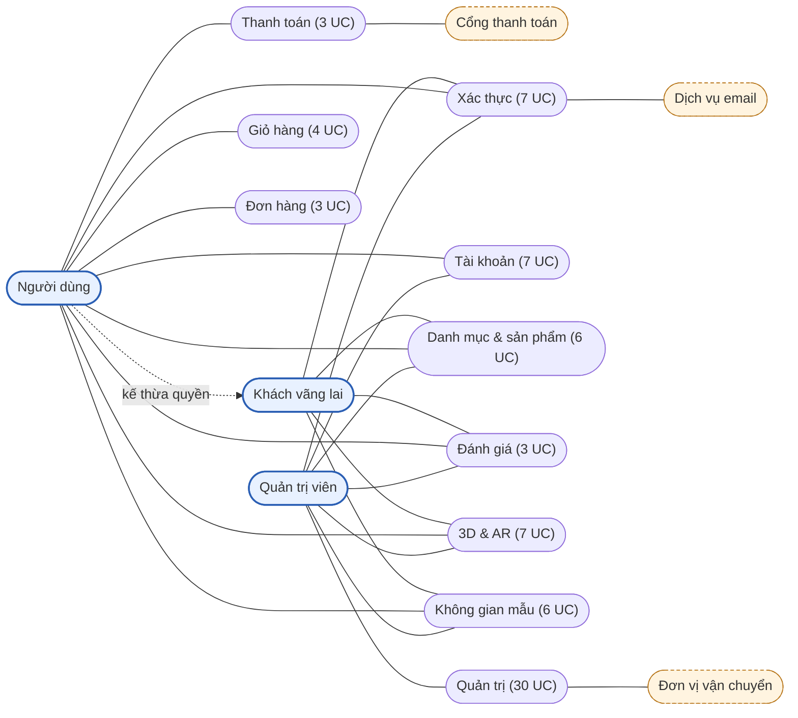

### 5.2. Khách vãng lai

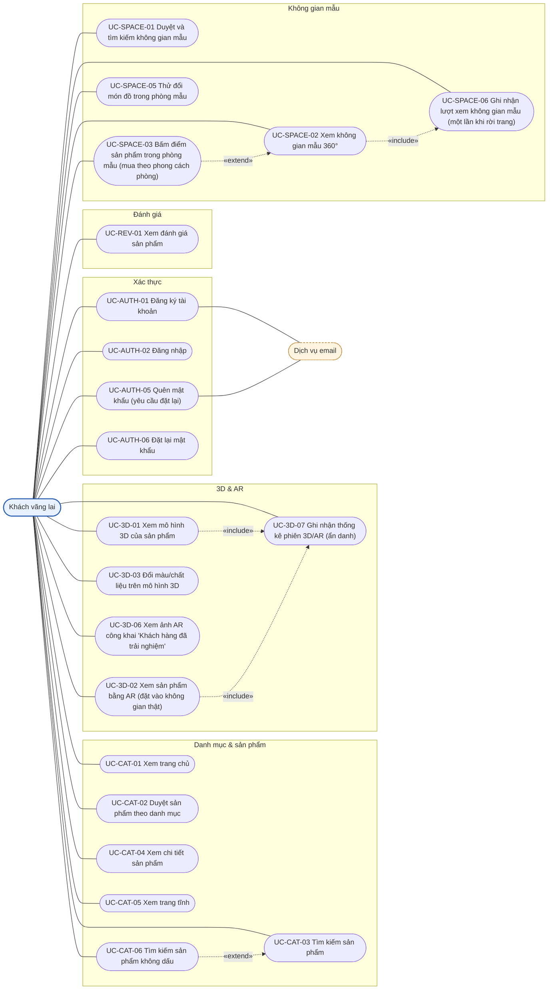

### 5.3. Người dùng (chức năng riêng, ngoài các chức năng kế thừa từ Khách)

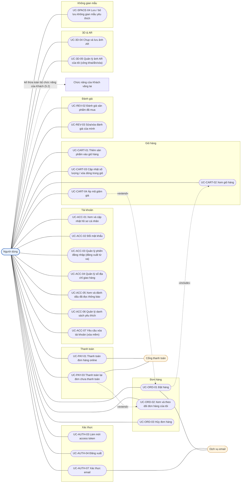

### 5.4. Quản trị viên: hệ thống, catalog, kho, 3D

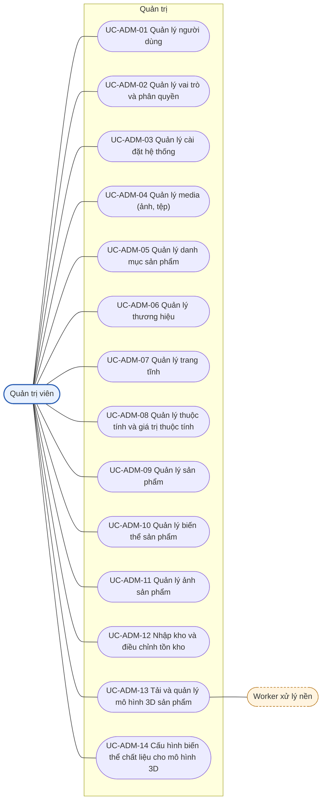

### 5.5. Quản trị viên: nội dung, đơn hàng, thống kê

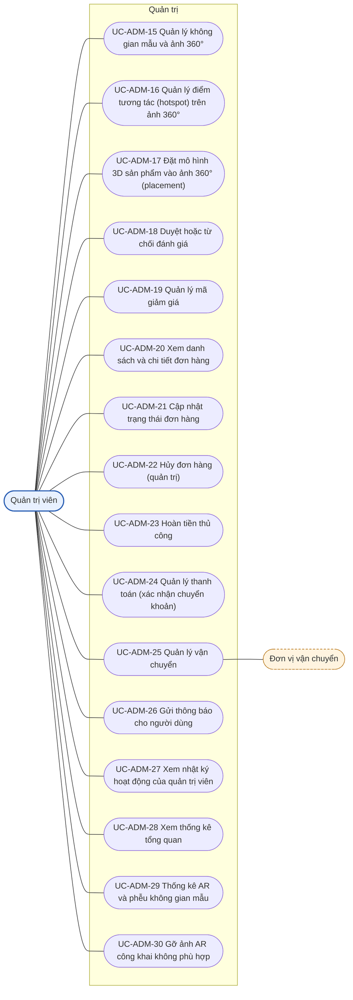

## 6. Chức năng chung

Các UC dưới đây Khách và Người dùng dùng giống hệt nhau (đặc tả một lần). Hành vi riêng của khách khi bị yêu cầu đăng nhập được ghi ở mục 7.

#### UC-AUTH-02 – Đăng nhập

| Mục | Nội dung |
| --- | --- |
| **Thông tin chung** | Nhóm: Xác thực · Ưu tiên: **Bắt buộc** · Khách: ✔ · User: ✔ · Admin: ✔ · Nguồn: CSDL (users, user_sessions) |
| **Tác nhân chính / phụ** | Khách vãng lai (đã có tài khoản) · phụ: không có |
| **Mô tả** | Người có tài khoản (user hoặc admin) đăng nhập bằng email và mật khẩu để nhận token. |
| **Tiền điều kiện** | Tài khoản tồn tại, chưa xóa mềm. |
| **Hậu điều kiện** | Có UserSession mới; `User.lastLoginAt` được cập nhật; client giữ access/refresh token. |
| **Luồng chính** | 1. Khách: Nhập email, mật khẩu tại `/login`. 2. Hệ thống: Gửi `POST /api/auth/login`. 3. Hệ thống: Tìm `User` (`findFirst({ email, deletedAt: null })`), kiểm tra `status = active`. 4. Hệ thống: So sánh mật khẩu với `passwordHash` (bcrypt). 5. Hệ thống: Đọc vai trò (`UserRole` → `Role.code`), ký access token và refresh token. 6. Hệ thống: Tạo `UserSession` (refreshTokenHash, ipAddress, userAgent, deviceName, expiresAt) và cập nhật `lastLoginAt` trong một transaction. 7. Hệ thống: Trả 200 kèm token; frontend lưu vào `authStore`, chuyển hướng (admin → `/dashboard`). |
| **Luồng thay thế** | 3a. Không tìm thấy email hoặc sai mật khẩu → 401 "Email hoặc mật khẩu không đúng" (cùng một thông báo để không lộ email). 3b. `status` là `suspended` hoặc `banned` → 403 "Tài khoản bị khóa". |
| **Ngoại lệ** | • Quá nhiều lần sai liên tiếp từ một IP/email → 429 (giới hạn tốc độ) [ĐỀ XUẤT]. |
| **Quy tắc nghiệp vụ** | • Chỉ tài khoản `status = active` và `deletedAt = null` mới đăng nhập được. • Refresh token chỉ lưu dạng băm (`UserSession.refreshTokenHash`, UNIQUE). • Vai trò chỉ gồm `admin` và `user`. |
| **Dữ liệu vào** | • email (bắt buộc): định dạng email • password (bắt buộc): không rỗng |
| **Dữ liệu ra** | • 200: `{ accessToken, refreshToken, user: { id, uuid, fullName, email, roles } }` |
| **Model + C/R/U/D** | User (users): R,U UserSession (user_sessions): C UserRole (user_roles): R Role (roles): R |
| **DB trigger / việc Service tự làm** | • DB trigger: `trg_users_set_updated_at` khi cập nhật `lastLoginAt`. • Service: bcrypt, ký JWT, tạo phiên (`$transaction`). |

#### UC-AUTH-03 – Làm mới access token

| Mục | Nội dung |
| --- | --- |
| **Thông tin chung** | Nhóm: Xác thực · Ưu tiên: **Bắt buộc** · Khách: ✘ · User: ✔ · Admin: ✔ · Nguồn: CSDL (user_sessions) |
| **Tác nhân chính / phụ** | Người dùng đã đăng nhập (client tự động) |
| **Mô tả** | Khi access token hết hạn, client dùng refresh token để lấy cặp token mới; refresh token được xoay vòng. |
| **Tiền điều kiện** | Có refresh token hợp lệ. |
| **Hậu điều kiện** | Phiên cũ bị thu hồi, phiên mới được tạo; client nhận cặp token mới. |
| **Luồng chính** | 1. Hệ thống: Interceptor của client nhận 401 từ API, gọi `POST /api/auth/refresh` kèm refresh token. 2. Hệ thống: `RefreshStrategy` kiểm tra chữ ký/thời hạn; Service băm token và tìm `UserSession` còn hiệu lực. 3. Hệ thống: Trong transaction, đặt `revokedAt` cho phiên cũ và tạo phiên mới; ký cặp token mới. 4. Hệ thống: Trả 200; client thử lại request ban đầu. |
| **Luồng thay thế** | 2a. Phiên không tồn tại, đã thu hồi hoặc hết hạn → 401; client xóa token và chuyển về `/login`. 2b. Refresh token cũ bị dùng lại (đã thu hồi) → thu hồi mọi phiên của user (nghi bị đánh cắp) [ĐỀ XUẤT]. |
| **Ngoại lệ** | • User đã bị khóa/xóa mềm → 401. |
| **Quy tắc nghiệp vụ** | • Xoay vòng token: mỗi refresh token chỉ dùng một lần. |
| **Dữ liệu vào** | • refreshToken (bắt buộc): JWT hợp lệ |
| **Dữ liệu ra** | • 200: `{ accessToken, refreshToken }` |
| **Model + C/R/U/D** | UserSession (user_sessions): R,U,C User (users): R |
| **DB trigger / việc Service tự làm** | • Service: xoay vòng phiên trong `$transaction`; không có DB trigger. |

#### UC-AUTH-04 – Đăng xuất

| Mục | Nội dung |
| --- | --- |
| **Thông tin chung** | Nhóm: Xác thực · Ưu tiên: **Bắt buộc** · Khách: ✘ · User: ✔ · Admin: ✔ · Nguồn: CSDL (user_sessions) |
| **Tác nhân chính / phụ** | Người dùng đã đăng nhập |
| **Mô tả** | Thu hồi phiên đăng nhập hiện tại. |
| **Tiền điều kiện** | Đã đăng nhập. |
| **Hậu điều kiện** | `UserSession.revokedAt` được đặt; token cũ không dùng làm mới được nữa. |
| **Luồng chính** | 1. Người dùng: Bấm "Đăng xuất" trên Header. 2. Hệ thống: Gửi `POST /api/auth/logout` kèm access token và refresh token. 3. Hệ thống: Tìm phiên theo hash refresh token của chính user, đặt `revokedAt = now()`. 4. Hệ thống: Trả 204; frontend xóa `authStore`, `cartStore` và chuyển về trang chủ. |
| **Luồng thay thế** | 3a. Phiên không tìm thấy hoặc đã thu hồi → vẫn trả 204 (idempotent). |
| **Ngoại lệ** | • Access token hết hạn → client tự làm mới (UC-AUTH-03) hoặc bỏ qua và xóa token cục bộ. |
| **Quy tắc nghiệp vụ** | • Chỉ thu hồi phiên của chính user (`userId` lấy từ token). |
| **Dữ liệu vào** | • refreshToken (bắt buộc): token của phiên cần thu hồi |
| **Dữ liệu ra** | • 204 không nội dung |
| **Model + C/R/U/D** | UserSession (user_sessions): U |
| **DB trigger / việc Service tự làm** | • Service: cập nhật `revokedAt`; không có DB trigger. |

#### UC-AUTH-05 – Quên mật khẩu (yêu cầu đặt lại)

| Mục | Nội dung |
| --- | --- |
| **Thông tin chung** | Nhóm: Xác thực · Ưu tiên: **Bắt buộc** · Khách: ✔ · User: ✔ · Admin: ✔ · Nguồn: CSDL (password_resets) |
| **Tác nhân chính / phụ** | Khách vãng lai (người quên mật khẩu) · phụ: Dịch vụ email |
| **Mô tả** | Người dùng nhập email để nhận liên kết đặt lại mật khẩu (dùng một lần, có thời hạn). |
| **Tiền điều kiện** | Chưa đăng nhập. |
| **Hậu điều kiện** | Nếu email tồn tại: có `PasswordReset` mới và email được gửi. |
| **Luồng chính** | 1. Khách: Bấm "Quên mật khẩu", nhập email. 2. Hệ thống: Gửi `POST /api/auth/forgot-password`. 3. Hệ thống: Tìm user theo email (`deletedAt: null`, `status = active`). 4. Hệ thống: Sinh token ngẫu nhiên, lưu `tokenHash` (SHA-256) và `expiresAt` (+30 phút) vào `PasswordReset`. 5. Hệ thống: Gửi email chứa liên kết `/reset-password?token=...`. 6. Hệ thống: Luôn trả 200 "Nếu email tồn tại, chúng tôi đã gửi hướng dẫn". |
| **Luồng thay thế** | 3a. Email không tồn tại hoặc tài khoản bị khóa → bỏ qua các bước 4–5 nhưng vẫn trả 200 (không lộ thông tin). |
| **Ngoại lệ** | • Gửi email lỗi → ghi log, vẫn trả 200. • Gọi quá nhiều lần → 429 [ĐỀ XUẤT]. |
| **Quy tắc nghiệp vụ** | • Chỉ lưu `tokenHash` (UNIQUE), không lưu token gốc; `expiresAt > createdAt` (CHECK `ck_password_resets_expiry`). |
| **Dữ liệu vào** | • email (bắt buộc): định dạng email |
| **Dữ liệu ra** | • 200 thông báo chung |
| **Model + C/R/U/D** | User (users): R PasswordReset (password_resets): C |
| **DB trigger / việc Service tự làm** | • Service: sinh/băm token, gửi email; không có DB trigger. |

#### UC-AUTH-06 – Đặt lại mật khẩu

| Mục | Nội dung |
| --- | --- |
| **Thông tin chung** | Nhóm: Xác thực · Ưu tiên: **Bắt buộc** · Khách: ✔ · User: ✔ · Admin: ✔ · Nguồn: CSDL (password_resets, user_sessions) |
| **Tác nhân chính / phụ** | Khách vãng lai (có liên kết từ email) |
| **Mô tả** | Đặt mật khẩu mới bằng token trong email; token chỉ dùng được một lần. |
| **Tiền điều kiện** | Có token chưa dùng, chưa hết hạn. |
| **Hậu điều kiện** | Mật khẩu đổi; token bị đánh dấu đã dùng; mọi phiên cũ bị thu hồi. |
| **Luồng chính** | 1. Khách: Mở liên kết, nhập mật khẩu mới và xác nhận. 2. Hệ thống: Gửi `POST /api/auth/reset-password`. 3. Hệ thống: Băm token, tìm `PasswordReset` có `usedAt = null` và `expiresAt > now()`. 4. Hệ thống: Trong `$transaction`: cập nhật `User.passwordHash`, đặt `PasswordReset.usedAt`, thu hồi mọi `UserSession` còn hiệu lực của user. 5. Hệ thống: Trả 200; frontend chuyển tới `/login`. |
| **Luồng thay thế** | 3a. Token không tồn tại, đã dùng hoặc hết hạn → 400 "Liên kết không hợp lệ hoặc đã hết hạn". |
| **Ngoại lệ** | • Mật khẩu mới không đạt chính sách → 400. |
| **Quy tắc nghiệp vụ** | • Mỗi token dùng một lần (`usedAt`). • Đổi mật khẩu buộc đăng nhập lại ở mọi thiết bị. |
| **Dữ liệu vào** | • token (bắt buộc): chuỗi token trong email • newPassword (bắt buộc): ≥ 8 ký tự, có chữ hoa, chữ thường, số • confirmPassword (bắt buộc): trùng `newPassword` |
| **Dữ liệu ra** | • 200 thông báo thành công |
| **Model + C/R/U/D** | PasswordReset (password_resets): R,U User (users): U UserSession (user_sessions): U |
| **DB trigger / việc Service tự làm** | • DB trigger: `trg_users_set_updated_at`. • Service: toàn bộ bước 4 trong `$transaction`. |

#### UC-CAT-01 – Xem trang chủ

| Mục | Nội dung |
| --- | --- |
| **Thông tin chung** | Nhóm: Danh mục & sản phẩm · Ưu tiên: **Bắt buộc** · Khách: ✔ · User: ✔ · Admin: ✔ · Nguồn: CSDL (products, categories, spaces) |
| **Tác nhân chính / phụ** | Khách vãng lai / Người dùng |
| **Mô tả** | Trang chủ giới thiệu Aurelia Living: sản phẩm nổi bật, danh mục gốc, không gian mẫu mới, liên kết 3D/AR. |
| **Tiền điều kiện** | Không. |
| **Hậu điều kiện** | Không thay đổi dữ liệu. |
| **Luồng chính** | 1. Khách: Mở `/`. 2. Hệ thống: Frontend gọi song song `GET /api/products?featured=true&pageSize=8`, `GET /api/categories?parent=root`, `GET /api/spaces?pageSize=4&sort=newest`. 3. Hệ thống: Backend chỉ trả bản ghi `status = published`, `deletedAt = null` (sản phẩm) và `isActive = true` (danh mục). 4. Hệ thống: Trả danh sách (giá đã `serialize` thành number); trang hiển thị các khối nội dung. |
| **Luồng thay thế** | 3a. Khối nào rỗng → ẩn khối đó. |
| **Ngoại lệ** | • Lỗi một API → khối tương ứng hiển thị lỗi cục bộ, các khối khác vẫn hiển thị. |
| **Quy tắc nghiệp vụ** | • Sản phẩm nổi bật: `isFeatured = true` (partial index `idx_products_featured`). • Không trả sản phẩm nháp, lưu trữ hoặc đã xóa mềm. |
| **Dữ liệu vào** | • (không có) |
| **Dữ liệu ra** | • 200: `{ featuredProducts[], categories[], spaces[] }` |
| **Model + C/R/U/D** | Product (products): R Category (categories): R Space (spaces): R Setting (settings): R |
| **DB trigger / việc Service tự làm** | • Không có. |

#### UC-CAT-02 – Duyệt sản phẩm theo danh mục

| Mục | Nội dung |
| --- | --- |
| **Thông tin chung** | Nhóm: Danh mục & sản phẩm · Ưu tiên: **Bắt buộc** · Khách: ✔ · User: ✔ · Admin: ✔ · Nguồn: CSDL (categories, products, product_variants) |
| **Tác nhân chính / phụ** | Khách vãng lai / Người dùng |
| **Mô tả** | Xem danh sách sản phẩm theo danh mục (cây nhiều cấp), lọc, sắp xếp, phân trang. |
| **Tiền điều kiện** | Không. |
| **Hậu điều kiện** | Không thay đổi dữ liệu. |
| **Luồng chính** | 1. Khách: Chọn danh mục trên menu hoặc mở `/products`. 2. Hệ thống: Gọi `GET /api/categories` (cây danh mục) và `GET /api/products?category=<slug>&brand=&minPrice=&maxPrice=&has3d=&hasAr=&sort=&page=&pageSize=`. 3. Hệ thống: `ProductsService.findAll(query)` lọc `status = published`, `deletedAt = null`, gồm cả sản phẩm thuộc danh mục con; kèm ảnh đại diện và giá thấp nhất của biến thể đang bán. 4. Hệ thống: Trả danh sách phân trang và tổng số. 5. Khách: Đổi bộ lọc/sắp xếp → lặp lại bước 2–4; bấm thẻ sản phẩm → UC-CAT-04. |
| **Luồng thay thế** | 3a. Danh mục không tồn tại/không `isActive` → 404. 3b. Không có sản phẩm khớp → trả danh sách rỗng, giao diện hiển thị "Không tìm thấy". |
| **Ngoại lệ** | • Tham số sai (page < 1, sort lạ) → 400. |
| **Quy tắc nghiệp vụ** | • Sắp xếp: `newest`, `price_asc`, `price_desc`, `best_selling` (`soldCount`), `rating` (`ratingAvg`). • Cờ `has3dModel`, `hasAr` do trigger DB duy trì; chỉ đọc. • Giá hiển thị: `salePrice ?? price` của biến thể rẻ nhất (`Decimal` → number bằng `serialize`). |
| **Dữ liệu vào** | • category, brand, minPrice, maxPrice, has3d, hasAr, sort, page, limit (tuỳ chọn): số nguyên dương, `limit` ≤ 50 |
| **Dữ liệu ra** | • 200: `{ items[], total, page, limit }` |
| **Model + C/R/U/D** | Category (categories): R Product (products): R ProductVariant (product_variants): R ProductImage (product_images): R Brand (brands): R |
| **DB trigger / việc Service tự làm** | • Không có (đọc dữ liệu do trigger duy trì). |

#### UC-CAT-03 – Tìm kiếm sản phẩm

| Mục | Nội dung |
| --- | --- |
| **Thông tin chung** | Nhóm: Danh mục & sản phẩm · Ưu tiên: **Bắt buộc** · Khách: ✔ · User: ✔ · Admin: ✔ · Nguồn: CSDL (products, index trigram idx_products_name_trgm) |
| **Tác nhân chính / phụ** | Khách vãng lai / Người dùng |
| **Mô tả** | Tìm sản phẩm theo tên gần đúng; gợi ý khi đang gõ. |
| **Tiền điều kiện** | Không. |
| **Hậu điều kiện** | Không thay đổi dữ liệu. |
| **Luồng chính** | 1. Khách: Gõ từ khóa vào ô tìm kiếm trên Header. 2. Hệ thống: Sau 300 ms (debounce) gọi `GET /api/products/search?q=...&pageSize=5` (gợi ý). 3. Hệ thống: `ProductsService.search(q)` chạy `$queryRaw` dùng `ILIKE`/`similarity` trên `products.name` (index GIN trigram), chỉ lấy `published`, `deletedAt IS NULL`. 4. Khách: Nhấn Enter → trang `/products?q=...` với `GET /api/products/search?q=&page=`. 5. Hệ thống: Trả danh sách sắp theo độ giống. |
| **Luồng thay thế** | 3a. Từ khóa < 2 ký tự → 400 hoặc trả rỗng. 3b. Không có kết quả → danh sách rỗng, gợi ý danh mục phổ biến. |
| **Ngoại lệ** | • Ký tự đặc biệt (`%`, `_`) phải được escape khi dựng mẫu ILIKE (tránh truy vấn chậm/sai). |
| **Quy tắc nghiệp vụ** | • UC này tìm theo tên có dấu (index trigram trên `name`). Tìm không dấu ('ban tra' ra 'Bàn trà') ở UC-CAT-06. • Prisma không biểu diễn index GIN nên bắt buộc dùng `$queryRaw` (QUY_UOC, DATABASE_SCHEMA 8.3). |
| **Dữ liệu vào** | • q (bắt buộc): 2–100 ký tự • page, limit (tuỳ chọn): số nguyên dương |
| **Dữ liệu ra** | • 200: `{ items[], total }` |
| **Model + C/R/U/D** | Product (products): R ProductImage (product_images): R |
| **DB trigger / việc Service tự làm** | • Không có. |

#### UC-CAT-04 – Xem chi tiết sản phẩm

| Mục | Nội dung |
| --- | --- |
| **Thông tin chung** | Nhóm: Danh mục & sản phẩm · Ưu tiên: **Bắt buộc** · Khách: ✔ · User: ✔ · Admin: ✔ · Nguồn: CSDL (products, product_variants, product_images, reviews) |
| **Tác nhân chính / phụ** | Khách vãng lai / Người dùng |
| **Mô tả** | Xem thông tin đầy đủ của sản phẩm: ảnh, biến thể (màu, chất liệu), giá, tồn kho, đánh giá, nút xem 3D/AR. |
| **Tiền điều kiện** | Sản phẩm `published` và chưa xóa mềm. |
| **Hậu điều kiện** | Không thay đổi dữ liệu. |
| **Luồng chính** | 1. Khách: Bấm thẻ sản phẩm → `/products/[slug]`. 2. Hệ thống: `GET /api/products/:slug`. 3. Hệ thống: `ProductsService.findBySlug` trả sản phẩm kèm ảnh (theo `sortOrder`), danh sách biến thể `isActive` với giá và thuộc tính, thương hiệu, danh mục, cờ `has3dModel`/`hasAr`, `ratingAvg`/`ratingCount`. 4. Khách: Chọn biến thể (màu/chất liệu) → giao diện cập nhật giá, ảnh của biến thể và `stockQuantity` (hiển thị "Còn hàng"/"Hết hàng"). 5. Khách: Bấm "Xem 3D/AR" → UC-3D-01/UC-3D-02; cuộn xuống xem đánh giá → UC-REV-01; bấm "Thêm vào giỏ" → UC-CART-01. |
| **Luồng thay thế** | 3a. Không tìm thấy hoặc đã ẩn/xóa mềm → 404. 4a. Biến thể hết hàng → vô hiệu nút thêm vào giỏ. |
| **Ngoại lệ** | • Lỗi mạng → trang báo lỗi, cho thử lại. |
| **Quy tắc nghiệp vụ** | • Ảnh đại diện duy nhất `ProductImage.isPrimary` (partial unique index). • Chỉ hiển thị cờ AR khi `hasAr = true` (đã có đủ file GLB và USDZ ở mô hình `ready`). • URL công khai dùng slug: route web hiện là `(shop)/products/[id]/page.tsx` → cần đổi thành `products/[slug]` [CẦN SỬA]. |
| **Dữ liệu vào** | • slug (bắt buộc): chuỗi slug |
| **Dữ liệu ra** | • 200: chi tiết sản phẩm (tiền dạng number) |
| **Model + C/R/U/D** | Product (products): R ProductVariant (product_variants): R VariantAttributeValue (variant_attribute_values): R AttributeValue (attribute_values): R Attribute (attributes): R ProductImage (product_images): R Media (media): R Brand (brands): R Category (categories): R Product3DModel (product_3d_models): R Review (reviews): R |
| **DB trigger / việc Service tự làm** | • Không có (cờ do trigger DB duy trì). |

#### UC-CAT-05 – Xem trang tĩnh

| Mục | Nội dung |
| --- | --- |
| **Thông tin chung** | Nhóm: Danh mục & sản phẩm · Ưu tiên: **Nên có** · Khách: ✔ · User: ✔ · Admin: ✔ · Nguồn: CSDL (pages) |
| **Tác nhân chính / phụ** | Khách vãng lai / Người dùng |
| **Mô tả** | Xem các trang Giới thiệu, Chính sách đổi trả, Hướng dẫn mua hàng. |
| **Tiền điều kiện** | Trang `published`. |
| **Hậu điều kiện** | Không thay đổi dữ liệu. |
| **Luồng chính** | 1. Khách: Bấm liên kết ở Footer. 2. Hệ thống: `GET /api/pages/:slug`. 3. Hệ thống: Trả `title`, `content`, `metaTitle`, `metaDescription` nếu `status = published`. 4. Hệ thống: Trang hiển thị nội dung đã được làm sạch (sanitize HTML). |
| **Luồng thay thế** | 3a. Trang nháp/lưu trữ/không có → 404. |
| **Ngoại lệ** | • Nội dung HTML chứa mã độc → bị loại khi lưu (ADM-07) và khi hiển thị. |
| **Quy tắc nghiệp vụ** | • Chỉ trang `published` hiển thị công khai. |
| **Dữ liệu vào** | • slug (bắt buộc): slug trang |
| **Dữ liệu ra** | • 200: `{ title, slug, content, metaTitle, metaDescription, publishedAt }` |
| **Model + C/R/U/D** | Page (pages): R |
| **DB trigger / việc Service tự làm** | • Không có. |

#### UC-CAT-06 – Tìm kiếm sản phẩm không dấu

| Mục | Nội dung |
| --- | --- |
| **Thông tin chung** | Nhóm: Danh mục & sản phẩm · Ưu tiên: **Nên có** · Khách: ✔ · User: ✔ · Admin: ✔ · Nguồn: [ĐỀ XUẤT] (products; cần migration index mới) |
| **Tác nhân chính / phụ** | Khách vãng lai / Người dùng |
| **Mô tả** | Gõ không dấu ("ban tra", "sofa oslo") vẫn tìm ra "Bàn trà", "Sofa Oslo". |
| **Tiền điều kiện** | Đã có index không dấu trên `products.name` (xem quy tắc). |
| **Hậu điều kiện** | Không thay đổi dữ liệu. |
| **Luồng chính** | 1. Khách: Gõ từ khóa không dấu vào ô tìm kiếm (hoặc có dấu: kết quả như nhau). 2. Hệ thống: `GET /api/products/search?q=...` (cùng endpoint UC-CAT-03). 3. Hệ thống: `ProductsService.search(q)` chạy `$queryRaw`: `immutable_unaccent(name) ILIKE '%' \|\| immutable_unaccent(:q) \|\| '%'`, kèm sắp xếp theo `similarity(immutable_unaccent(name), immutable_unaccent(:q))`, chỉ `published`, `deletedAt IS NULL`. 4. Hệ thống: Trả danh sách như UC-CAT-03. |
| **Luồng thay thế** | 3a. Từ khóa rỗng/quá ngắn → 400. |
| **Ngoại lệ** | • Ký tự `%`, `_` phải được escape trước khi ghép vào mẫu ILIKE. |
| **Quy tắc nghiệp vụ** | • Cần MỘT migration mới (tạo bằng `prisma migrate dev --create-only`, làm khi code): `CREATE INDEX idx_products_name_unaccent_trgm ON products USING gin (immutable_unaccent(name) gin_trgm_ops);` (hàm `immutable_unaccent` đã có trong CSDL). Cập nhật `docs/DATABASE_SCHEMA.md` và ghi chú trên model `Product` sau khi thêm. • Prisma không biểu diễn index biểu thức nên bắt buộc `$queryRaw`. |
| **Dữ liệu vào** | • q (bắt buộc): 2–100 ký tự • page, limit (tuỳ chọn): số nguyên dương |
| **Dữ liệu ra** | • 200: `{ items[], total }` |
| **Model + C/R/U/D** | Product (products): R ProductImage (product_images): R |
| **DB trigger / việc Service tự làm** | • Không có. |
| **Quan hệ UC** | extend: UC-CAT-03 |

#### UC-REV-01 – Xem đánh giá sản phẩm

| Mục | Nội dung |
| --- | --- |
| **Thông tin chung** | Nhóm: Đánh giá · Ưu tiên: **Nên có** · Khách: ✔ · User: ✔ · Admin: ✔ · Nguồn: CSDL (reviews) |
| **Tác nhân chính / phụ** | Khách vãng lai / Người dùng |
| **Mô tả** | Xem điểm trung bình, phân bố sao và danh sách đánh giá đã duyệt của sản phẩm. |
| **Tiền điều kiện** | Sản phẩm đang bán. |
| **Hậu điều kiện** | Không thay đổi dữ liệu. |
| **Luồng chính** | 1. Khách: Cuộn tới mục "Đánh giá" ở trang chi tiết. 2. Hệ thống: `GET /api/products/:slug/reviews?page=&rating=`. 3. Hệ thống: `ReviewsService.listByProduct` chỉ trả `status = approved`, kèm tên người đánh giá (rút gọn). 4. Hệ thống: Trả danh sách phân trang, `ratingAvg`, `ratingCount` (đọc từ `Product`). |
| **Luồng thay thế** | 3a. Chưa có đánh giá → hiển thị "Chưa có đánh giá". |
| **Ngoại lệ** | • Sản phẩm không tồn tại → 404. |
| **Quy tắc nghiệp vụ** | • `ratingAvg`/`ratingCount` do DB trigger tính từ review `approved`; không tính lại trong code. |
| **Dữ liệu vào** | • page, limit, rating (tuỳ chọn): rating 1–5 |
| **Dữ liệu ra** | • 200: `{ items[], total, ratingAvg, ratingCount }` |
| **Model + C/R/U/D** | Review (reviews): R User (users): R |
| **DB trigger / việc Service tự làm** | • Không có (đọc dữ liệu do trigger duy trì). |

#### UC-3D-01 – Xem mô hình 3D của sản phẩm

| Mục | Nội dung |
| --- | --- |
| **Thông tin chung** | Nhóm: 3D & AR · Ưu tiên: **Nên có** · Khách: ✔ · User: ✔ · Admin: ✔ · Nguồn: CSDL (product_3d_models, model_files) |
| **Tác nhân chính / phụ** | Khách vãng lai / Người dùng |
| **Mô tả** | Xem và xoay mô hình 3D tương tác của sản phẩm trên web (React Three Fiber / model-viewer). |
| **Tiền điều kiện** | Sản phẩm có mô hình `status = ready` (`has3dModel = true`). |
| **Hậu điều kiện** | Ghi một `ArSession` mode `view_3d` (ẩn danh nếu là khách). |
| **Luồng chính** | 1. Khách: Ở trang chi tiết bấm tab "Xem 3D". 2. Hệ thống: `GET /api/products/:slug/model`. 3. Hệ thống: `ProductModelsService.getPublicModel(slug, variantId?)` trả mô hình chính (`isPrimary`, `status = ready`), danh sách `ModelFile` (GLB theo LOD), kích thước thật, `viewerConfig`, ảnh chờ `posterMediaId`. 4. Hệ thống: Trình xem hiển thị ảnh chờ, tải tệp GLB theo LOD phù hợp thiết bị (`ModelLoader`), áp `viewerConfig` (góc camera, tự xoay, ánh sáng). 5. Hệ thống: Ghi nhận phiên (UC-3D-07). 6. Khách: Xoay/phóng to; chọn biến thể màu/chất liệu → UC-3D-03. |
| **Luồng thay thế** | 3a. Sản phẩm không có mô hình `ready` → ẩn nút "Xem 3D". 4a. Thiết bị yếu/mạng chậm → dùng LOD `low`/`medium`. 4b. Tải lỗi → hiển thị ảnh chờ và thông báo. |
| **Ngoại lệ** | • Mô hình đang `processing`/`failed` → không công khai. |
| **Quy tắc nghiệp vụ** | • Chỉ mô hình `ready` được công khai; mỗi sản phẩm tối đa một mô hình chính (`uq_product_3d_models_primary`). • Tệp lấy qua URL của `Media` (MinIO/S3). |
| **Dữ liệu vào** | • productId (bắt buộc): sản phẩm có mô hình • variantId (tuỳ chọn): biến thể để chọn mô hình riêng |
| **Dữ liệu ra** | • 200: `{ model: { uuid, lengthMm, widthMm, heightMm, placement, allowScaling, viewerConfig, posterUrl }, files: [{ format, lod, url, polygonCount }], materialVariants[] }` |
| **Model + C/R/U/D** | Product3DModel (product_3d_models): R ModelFile (model_files): R Media (media): R ModelMaterialVariant (model_material_variants): R |
| **DB trigger / việc Service tự làm** | • Không có (cờ `has3dModel` do trigger DB duy trì). |
| **Quan hệ UC** | include: UC-3D-07 |

#### UC-3D-02 – Xem sản phẩm bằng AR (đặt vào không gian thật)

| Mục | Nội dung |
| --- | --- |
| **Thông tin chung** | Nhóm: 3D & AR · Ưu tiên: **Nên có** · Khách: ✔ · User: ✔ · Admin: ✔ · Nguồn: CSDL (product_3d_models, model_files, ar_sessions) |
| **Tác nhân chính / phụ** | Khách vãng lai / Người dùng |
| **Mô tả** | Đặt sản phẩm đúng kích thước thật lên sàn/tường/mặt bàn bằng camera điện thoại (WebXR/Scene Viewer trên Android dùng GLB; Quick Look trên iPhone dùng USDZ). |
| **Tiền điều kiện** | `hasAr = true` (mô hình `ready` có đủ GLB và USDZ); thiết bị hỗ trợ AR. |
| **Hậu điều kiện** | Có `ArSession` mode `ar` với các cờ `placed`, `captured`, `addedToCart`. |
| **Luồng chính** | 1. Khách: Bấm "Xem trong không gian của bạn" trên trang chi tiết. 2. Hệ thống: Frontend phát hiện nền tảng (iOS/Android) và lấy `GET /api/products/:slug/model`. 3. Hệ thống: Chọn tệp: iOS → USDZ, Android/Web → GLB; truyền kích thước thật (`lengthMm`, `widthMm`, `heightMm`), `placement` và `allowScaling` cho trình AR. 4. Hệ thống: Ghi `ArSession` (mode `ar`, `arPlatform`) — UC-3D-07. 5. Khách: Đặt, di chuyển, xoay sản phẩm; (tuỳ chọn) chụp ảnh (UC-3D-04); (tuỳ chọn) thêm vào giỏ (UC-CART-01). 6. Hệ thống: Khi kết thúc phiên, cập nhật `durationSeconds`, `placed`, `captured`, `addedToCart`. |
| **Luồng thay thế** | 2a. Thiết bị không hỗ trợ AR → hiển thị hướng dẫn và chuyển sang xem 3D (UC-3D-01). 3a. Thiếu một trong hai định dạng → `hasAr = false`, ẩn nút AR. |
| **Ngoại lệ** | • Người dùng từ chối quyền camera → thông báo hướng dẫn cấp quyền. |
| **Quy tắc nghiệp vụ** | • Mô hình khóa tỉ lệ nếu `allowScaling = false`. • Trên mobile app, dữ liệu overlay AR do module `ar-overlay` cung cấp (ngoài phạm vi UC này). |
| **Dữ liệu vào** | • productId (bắt buộc): sản phẩm có `hasAr` |
| **Dữ liệu ra** | • 200: như UC-3D-01 + `arSessionUuid` |
| **Model + C/R/U/D** | Product3DModel (product_3d_models): R ModelFile (model_files): R ArSession (ar_sessions): C,U |
| **DB trigger / việc Service tự làm** | • DB trigger: `trg_ar_sessions_set_updated_at` khi cập nhật cờ. • Service: ghi/cập nhật `ArSession` (UC-3D-07). |
| **Quan hệ UC** | include: UC-3D-07 |

#### UC-3D-03 – Đổi màu/chất liệu trên mô hình 3D

| Mục | Nội dung |
| --- | --- |
| **Thông tin chung** | Nhóm: 3D & AR · Ưu tiên: **Mở rộng** · Khách: ✔ · User: ✔ · Admin: ✔ · Nguồn: CSDL (model_material_variants) |
| **Tác nhân chính / phụ** | Khách vãng lai / Người dùng |
| **Mô tả** | Khi chọn biến thể khác, mô hình áp cấu hình vật liệu tương ứng mà không tải lại mô hình mới. |
| **Luồng chính** | 1. Khách: Chọn biến thể (màu/chất liệu) ở trang chi tiết đang mở 3D. 2. Hệ thống: Dùng `materialVariants[]` đã nhận ở UC-3D-01, tìm bản ghi theo `variantId`. 3. Hệ thống: Áp `config` (baseColor, roughness...) vào vật liệu `materialName` của mô hình ở phía client; không gọi API thêm. |
| **Model + C/R/U/D** | ModelMaterialVariant (model_material_variants): R |

#### UC-3D-06 – Xem ảnh AR công khai "Khách hàng đã trải nghiệm"

| Mục | Nội dung |
| --- | --- |
| **Thông tin chung** | Nhóm: 3D & AR · Ưu tiên: **Nên có** · Khách: ✔ · User: ✔ · Admin: ✔ · Nguồn: CSDL (ar_snapshots) |
| **Tác nhân chính / phụ** | Khách vãng lai / Người dùng |
| **Mô tả** | Xem ảnh AR người dùng đã chọn công khai, theo sản phẩm hoặc trên trang chủ. |
| **Tiền điều kiện** |  |
| **Hậu điều kiện** |  |
| **Luồng chính** | 1. Khách: Mở mục "Khách hàng đã trải nghiệm" (trang chi tiết hoặc trang chủ). 2. Hệ thống: `GET /api/ar-snapshots/public?productId=&page=` chỉ trả `isPublic = true`, kèm tên rút gọn người chụp. 3. Hệ thống: Hiển thị lưới ảnh; không lộ email/điện thoại. |
| **Luồng thay thế** |  |
| **Ngoại lệ** |  |
| **Quy tắc nghiệp vụ** | • Không công khai thông tin cá nhân ngoài tên hiển thị rút gọn. |
| **Dữ liệu vào** |  |
| **Dữ liệu ra** |  |
| **Model + C/R/U/D** | ArSnapshot (ar_snapshots): R Media (media): R User (users): R |
| **DB trigger / việc Service tự làm** |  |

#### UC-3D-07 – Ghi nhận thống kê phiên 3D/AR (ẩn danh)

| Mục | Nội dung |
| --- | --- |
| **Thông tin chung** | Nhóm: 3D & AR · Ưu tiên: **Mở rộng** · Khách: ✔ · User: ✔ · Admin: ✔ · Nguồn: CSDL (ar_sessions) |
| **Tác nhân chính / phụ** | Khách vãng lai / Người dùng (tự động) |
| **Mô tả** | Mỗi lượt xem 3D/AR được ghi lại (thiết bị, hệ điều hành, nền tảng AR, thời gian, đặt được hay không, chụp ảnh, thêm giỏ). Khách dùng `visitorId` ẩn danh do client tạo. |
| **Luồng chính** | 1. Hệ thống: Khi mở trình xem, client gọi `POST /api/ar-sessions` (CreateArSessionDto: `productId`, `modelId`, `mode`, `device`, `os`, `arPlatform`, `visitorId`) — endpoint dùng `OptionalJwtAuthGuard` [CẦN TẠO MỚI]. 2. Hệ thống: Nếu có token → `userId`; ngược lại bắt buộc `visitorId` (UUID). Ràng buộc DB: phải có `userId` hoặc `visitorId` (CHECK `ck_ar_sessions_actor`). 3. Hệ thống: Trả `uuid` phiên. Khi đóng trình xem client gọi `PATCH /api/ar-sessions/:uuid` cập nhật `durationSeconds`, `placed`, `captured`, `addedToCart`. |
| **Quy tắc nghiệp vụ** | • Đây là ngoại lệ duy nhất cho phép khách ghi dữ liệu (cùng `space_views`); không chứa thông tin cá nhân. • Cập nhật phiên chỉ khi `visitorId`/`userId` khớp phiên; giới hạn tốc độ để chống ghi rác. |
| **Model + C/R/U/D** | ArSession (ar_sessions): C,U |

#### UC-SPACE-01 – Duyệt và tìm kiếm không gian mẫu

| Mục | Nội dung |
| --- | --- |
| **Thông tin chung** | Nhóm: Không gian mẫu · Ưu tiên: **Nên có** · Khách: ✔ · User: ✔ · Admin: ✔ · Nguồn: CSDL (spaces, index idx_spaces_title_unaccent_trgm) |
| **Tác nhân chính / phụ** | Khách vãng lai / Người dùng |
| **Mô tả** | Xem danh sách không gian mẫu, lọc theo loại phòng/phong cách/danh mục, tìm tiếng Việt không dấu ("phong khach" ra "Phòng khách"). |
| **Tiền điều kiện** | Không. |
| **Hậu điều kiện** | Không thay đổi dữ liệu. |
| **Luồng chính** | 1. Khách: Mở `/spaces`. 2. Hệ thống: `GET /api/spaces?roomType=&style=&category=&q=&sort=&page=`. 3. Hệ thống: `SpacesService.findAll` chỉ trả `status = published`; với `q` dùng `$queryRaw` `immutable_unaccent(title) ILIKE '%' \|\| immutable_unaccent(:q) \|\| '%'`. 4. Hệ thống: Trả danh sách (ảnh bìa, tiêu đề, loại phòng, `viewCount`). 5. Khách: Bấm một thẻ → UC-SPACE-02. |
| **Luồng thay thế** | 3a. Không có kết quả → danh sách rỗng. |
| **Ngoại lệ** | • `roomType` không thuộc enum → 400. |
| **Quy tắc nghiệp vụ** | • `RoomType`: living_room, bedroom, kitchen, dining_room, bathroom, office, other. • Prisma không biểu diễn index biểu thức → bắt buộc `$queryRaw` khi tìm không dấu. |
| **Dữ liệu vào** | • roomType, style, category, q, sort, page, limit (tuỳ chọn): q 2–100 ký tự |
| **Dữ liệu ra** | • 200: `{ items[], total }` |
| **Model + C/R/U/D** | Space (spaces): R Media (media): R Category (categories): R |
| **DB trigger / việc Service tự làm** | • Không có. |

#### UC-SPACE-02 – Xem không gian mẫu 360°

| Mục | Nội dung |
| --- | --- |
| **Thông tin chung** | Nhóm: Không gian mẫu · Ưu tiên: **Nên có** · Khách: ✔ · User: ✔ · Admin: ✔ · Nguồn: CSDL (spaces, space_panoramas, space_hotspots, space_product_placements, space_views) |
| **Tác nhân chính / phụ** | Khách vãng lai / Người dùng |
| **Mô tả** | Tham quan phòng mẫu bằng ảnh 360°: xoay xem, chuyển sang ảnh khác trong tour, bấm điểm tương tác, thấy sản phẩm 3D đặt đúng phối cảnh. |
| **Tiền điều kiện** | Không gian `published`. |
| **Hậu điều kiện** | Khi người xem rời trang, có một `SpaceView` (ẩn danh nếu là khách) và `Space.viewCount` tăng. |
| **Luồng chính** | 1. Khách: Bấm một không gian ở `/spaces`, mở `/spaces/[id]`. 2. Hệ thống: `GET /api/spaces/:slug` trả không gian, danh sách `SpacePanorama` (theo `sortOrder`), `SpaceHotspot` (kèm thông tin sản phẩm cho loại `product`), `SpaceProductPlacement` (kèm tệp GLB của mô hình). 3. Hệ thống: `SpacePanorama` component mở ảnh có `isStart = true` với góc nhìn mặc định (`defaultYaw`, `defaultPitch`, `defaultFov`). 4. Hệ thống: Client bắt đầu đếm cục bộ (số lần bấm hotspot, đã thêm giỏ); lượt xem được ghi MỘT lần khi người xem rời trang (UC-SPACE-06). 5. Khách: Xoay ảnh; bấm hotspot `navigation` → chuyển sang `targetPanoramaId`; hotspot `info` → hiện ghi chú; hotspot `product` → UC-SPACE-03. 6. Hệ thống: Hiển thị mô hình 3D của sản phẩm đã đặt (placement) đúng vị trí `yaw/pitch`, `distance`, `rotation`, `scale`. |
| **Luồng thay thế** | 2a. Không gian không `published` hoặc không có → 404. 3a. Không có ảnh `isStart` → dùng ảnh có `sortOrder` nhỏ nhất. |
| **Ngoại lệ** | • Ảnh 360° tải lỗi → thông báo, cho thử lại. |
| **Quy tắc nghiệp vụ** | • Mỗi không gian tối đa một ảnh mở đầu (`uq_space_panoramas_start`). • Hotspot hợp lệ theo loại (CHECK): `product` có `productId`, `navigation` có `targetPanoramaId`, `info` có `content`. • `Space.viewCount` do DB trigger tăng khi INSERT `SpaceView`, KHÔNG tăng trong code. • URL công khai dùng slug: route web hiện là `(shop)/spaces/[id]/page.tsx` → cần đổi thành `spaces/[slug]` [CẦN SỬA]. |
| **Dữ liệu vào** | • slug (bắt buộc): slug không gian |
| **Dữ liệu ra** | • 200: `{ space, panoramas[], hotspots[], placements[] }` |
| **Model + C/R/U/D** | Space (spaces): R SpacePanorama (space_panoramas): R SpaceHotspot (space_hotspots): R SpaceProductPlacement (space_product_placements): R Product (products): R Product3DModel (product_3d_models): R ModelFile (model_files): R Media (media): R SpaceView (space_views): C |
| **DB trigger / việc Service tự làm** | • DB trigger: `trg_space_views_increase_count`. |
| **Quan hệ UC** | include: UC-SPACE-06 |

#### UC-SPACE-03 – Bấm điểm sản phẩm trong phòng mẫu (mua theo phong cách phòng)

| Mục | Nội dung |
| --- | --- |
| **Thông tin chung** | Nhóm: Không gian mẫu · Ưu tiên: **Nên có** · Khách: ✔ · User: ✔ · Admin: ✔ · Nguồn: CSDL (space_hotspots, space_views) |
| **Tác nhân chính / phụ** | Khách vãng lai / Người dùng |
| **Mô tả** | Bấm hotspot loại sản phẩm để xem nhanh sản phẩm, chọn biến thể, thêm vào giỏ (user) hoặc mở trang chi tiết. |
| **Tiền điều kiện** |  |
| **Hậu điều kiện** |  |
| **Luồng chính** | 1. Khách: Bấm hotspot loại `product`. 2. Hệ thống: Hiển thị thẻ sản phẩm (ảnh, giá, biến thể) từ dữ liệu đã tải ở UC-SPACE-02; tăng bộ đếm `hotspotClickCount` cục bộ (không gọi API). 3. Khách: Bấm "Xem chi tiết" → UC-CAT-04, hoặc "Thêm vào giỏ" → UC-CART-01 (khách bị yêu cầu đăng nhập). 4. Hệ thống: Khi rời trang, `hotspotClickCount` và `addedToCart` được gửi kèm lượt xem (UC-SPACE-06). |
| **Luồng thay thế** |  |
| **Ngoại lệ** |  |
| **Quy tắc nghiệp vụ** | • Phễu: xem phòng → bấm điểm tương tác → thêm vào giỏ, dùng cho thống kê (UC-ADM-29). |
| **Dữ liệu vào** |  |
| **Dữ liệu ra** |  |
| **Model + C/R/U/D** | SpaceHotspot (space_hotspots): R Product (products): R ProductVariant (product_variants): R |
| **DB trigger / việc Service tự làm** |  |
| **Quan hệ UC** | extend: UC-SPACE-02 |

#### UC-SPACE-05 – Thử đổi món đồ trong phòng mẫu

| Mục | Nội dung |
| --- | --- |
| **Thông tin chung** | Nhóm: Không gian mẫu · Ưu tiên: **Mở rộng** · Khách: ✔ · User: ✔ · Admin: ✔ · Nguồn: [ĐỀ XUẤT] (space_product_placements) |
| **Tác nhân chính / phụ** | Khách vãng lai / Người dùng |
| **Mô tả** | Thay một món đồ đã đặt bằng sản phẩm khác cùng danh mục ngay trong phòng 360°, chỉ trên giao diện (không lưu vào CSDL). |
| **Luồng chính** | 1. Khách: Bấm vào món đồ 3D trong phòng, chọn "Đổi món". 2. Hệ thống: `GET /api/spaces/:slug/placements/:placementId/alternatives` trả sản phẩm cùng danh mục có mô hình `ready`. 3. Hệ thống: Client thay mô hình, giữ `yaw/pitch/distance/rotation/scale` của placement. |
| **Model + C/R/U/D** | SpaceProductPlacement (space_product_placements): R Product (products): R Product3DModel (product_3d_models): R |

#### UC-SPACE-06 – Ghi nhận lượt xem không gian mẫu (một lần khi rời trang)

| Mục | Nội dung |
| --- | --- |
| **Thông tin chung** | Nhóm: Không gian mẫu · Ưu tiên: **Mở rộng** · Khách: ✔ · User: ✔ · Admin: ✔ · Nguồn: CSDL (space_views) |
| **Tác nhân chính / phụ** | Khách vãng lai / Người dùng (tự động) |
| **Mô tả** | Mỗi lượt xem không gian được ghi MỘT lần khi người xem rời trang, kèm sản phẩm nguồn, số lần bấm hotspot, có thêm vào giỏ không. Khách dùng `visitorId` ẩn danh. |
| **Luồng chính** | 1. Hệ thống: Trong lúc xem, client giữ cục bộ: `visitorId` (UUID lưu ở localStorage), `sourceProductId` (từ tham số `?from=<slug sản phẩm>`), `hotspotClickCount`, `addedToCart`. 2. Hệ thống: Khi người xem rời trang (`visibilitychange` sang hidden hoặc `pagehide`), client gọi `navigator.sendBeacon('/api/spaces/<slug>/views', body)` với `body = { visitorId, sourceProductId, hotspotClickCount, addedToCart, accessToken? }`. 3. Hệ thống: `SpacesController.recordView` (route công khai, không `JwtAuthGuard`) kiểm tra DTO `RecordSpaceViewDto`; nếu `accessToken` hợp lệ thì gán `userId`, ngược lại `userId = NULL`. 4. Hệ thống: `SpacesService.recordView` INSERT đúng một `SpaceView`; trả 204. 5. CSDL: Trigger tăng `Space.viewCount`. |
| **Quy tắc nghiệp vụ** | • Chỉ INSERT một lần: không có PATCH, không có token phụ (đã quyết định, thay cho `viewToken`). • `navigator.sendBeacon` không đặt được header `Authorization` nên `userId` lấy từ `accessToken` trong body (tuỳ chọn); không có thì ghi ẩn danh [CẦN XÁC NHẬN: hoặc luôn ghi ẩn danh]. • CHECK `ck_space_views_actor`: phải có `userId` hoặc `visitorId`; luôn bắt buộc `visitorId` trong DTO. • Chống ghi rác: giới hạn tốc độ theo IP và `visitorId`; chặn `hotspotClickCount` bất thường (> 1000) [ĐỀ XUẤT]. • `Space.viewCount` do DB trigger tăng khi INSERT; Service không đụng. Hệ quả: lượt xem chỉ tính khi người xem rời trang; tab bị tắt đột ngột có thể không gửi được beacon. |
| **Model + C/R/U/D** | SpaceView (space_views): C |

## 7. Khách vãng lai

Khách chỉ xem nội dung công khai (mục 6) và được đăng ký, đăng nhập, quên/đặt lại mật khẩu. Mọi thao tác ghi khác đều bị chặn ở **cả hai lớp**: frontend hiện hộp thoại yêu cầu đăng nhập và KHÔNG gọi API ghi; backend trả 401 vì route có `JwtAuthGuard`. Ngoại lệ duy nhất cho khách ghi dữ liệu là thống kê ẩn danh `ArSession`, `SpaceView` kèm `visitorId` (UC-3D-07, UC-SPACE-06).

| Hành động khách thử | Hệ quả |
| --- | --- |
| Thêm vào giỏ (UC-CART-01), xem giỏ (UC-CART-02) | Yêu cầu đăng nhập; sau khi đăng nhập thực hiện lại hành động |
| Áp mã giảm giá (UC-CART-04), đặt hàng (UC-ORD-01), thanh toán (UC-PAY-01) | Yêu cầu đăng nhập |
| Yêu thích sản phẩm (UC-ACC-06), lưu không gian mẫu (UC-SPACE-04) | Yêu cầu đăng nhập |
| Viết đánh giá (UC-REV-02), chụp ảnh AR để lưu (UC-3D-04) | Yêu cầu đăng nhập |
| Xem/ghi thống kê 3D, AR, không gian mẫu | Được phép, ghi ẩn danh bằng `visitorId` (UUID do client tạo) |

#### UC-AUTH-01 – Đăng ký tài khoản

| Mục | Nội dung |
| --- | --- |
| **Thông tin chung** | Nhóm: Xác thực · Ưu tiên: **Bắt buộc** · Khách: ✔ · User: ✘ · Admin: ✘ · Nguồn: CSDL (users, user_roles, user_sessions) |
| **Tác nhân chính / phụ** | Khách vãng lai · phụ: Dịch vụ email |
| **Mô tả** | Khách tạo tài khoản mới để mua hàng, đánh giá, lưu yêu thích. Đăng ký xong được đăng nhập luôn. |
| **Tiền điều kiện** | Chưa đăng nhập. Email chưa thuộc tài khoản nào chưa xóa mềm. |
| **Hậu điều kiện** | Có bản ghi User (status = active), có UserSession, tài khoản có vai trò `user`. Email xác thực được gửi (bất đồng bộ). |
| **Luồng chính** | 1. Khách: Mở trang Đăng ký (`/register`), nhập họ tên, email, số điện thoại (tuỳ chọn), mật khẩu, nhập lại mật khẩu. 2. Hệ thống: Validate dữ liệu phía client (zod/validators) rồi gửi `POST /api/auth/register`. 3. Hệ thống: Validate DTO phía server, kiểm tra email chưa tồn tại (`findFirst({ email, deletedAt: null })`). 4. Hệ thống: Băm mật khẩu bằng bcrypt; trong `prisma.$transaction` tạo `User` và `UserSession`. 5. CSDL: Khi commit, trigger gán vai trò `user` cho tài khoản mới. 6. Hệ thống: Sinh access token (15 phút) và refresh token (7 ngày), gửi email xác thực, trả 201 kèm token và hồ sơ. 7. Khách: Được chuyển về trang trước đó (đã đăng nhập). |
| **Luồng thay thế** | 3a. Email đã tồn tại → trả 409 "Email đã được sử dụng", ở lại form. 3b. Hai request đăng ký cùng email đồng thời → vi phạm unique (P2002) → trả 409. 6a. Gửi email thất bại → vẫn đăng ký thành công, ghi log, cho phép gửi lại (UC-AUTH-07). |
| **Ngoại lệ** | • Dữ liệu sai định dạng → 400 kèm danh sách lỗi theo trường. • Lỗi CSDL → 500, không tạo tài khoản dở dang (transaction rollback). |
| **Quy tắc nghiệp vụ** | • Email là `citext`: không phân biệt hoa thường; duy nhất trên tài khoản chưa xóa mềm (partial unique index `uq_users_email_active`); phải khớp `ck_users_email_format`. • Mật khẩu ≥ 8 ký tự, có chữ hoa, chữ thường, số; chỉ lưu `passwordHash`. • Vai trò `user` do DB trigger gán lúc commit: Service KHÔNG tự tạo `UserRole` (QUY_UOC §6). Vì trigger chạy lúc commit, danh sách vai trò trong token của lần đăng ký lấy mặc định `['user']`. • Giỏ hàng không tạo ở bước này mà tạo khi thêm sản phẩm đầu tiên (UC-CART-01). |
| **Dữ liệu vào** | • fullName (bắt buộc): 2–150 ký tự • email (bắt buộc): đúng định dạng, ≤ 255 ký tự, chưa dùng • phone (tuỳ chọn): 10–11 chữ số, bắt đầu bằng 0 (cột tối đa 20 ký tự) • password (bắt buộc): ≥ 8 ký tự, có chữ hoa, chữ thường, số • confirmPassword (bắt buộc): trùng `password` |
| **Dữ liệu ra** | • 201: `{ accessToken, refreshToken, user: { id, uuid, fullName, email, roles } }` |
| **Model + C/R/U/D** | User (users): C UserSession (user_sessions): C UserRole (user_roles): C (trigger) |
| **DB trigger / việc Service tự làm** | • DB trigger: `trg_users_assign_default_role` (gán vai trò user), `trg_users_set_updated_at`. • Service: băm mật khẩu, tạo phiên, gửi email xác thực; bọc `prisma.$transaction`. |

## 8. Người dùng

Người dùng làm được mọi việc của khách (mục 6) và các chức năng dưới đây, luôn giới hạn theo dữ liệu của chính mình (`where: { userId }`, `userId` lấy từ token, không nhận từ client).

#### UC-AUTH-07 – Xác thực email

| Mục | Nội dung |
| --- | --- |
| **Thông tin chung** | Nhóm: Xác thực · Ưu tiên: **Nên có** · Khách: cần đăng nhập · User: chỉ của mình · Admin: ✘ · Nguồn: [ĐỀ XUẤT] (cột `User.emailVerifiedAt`) |
| **Tác nhân chính / phụ** | Người dùng · phụ: Dịch vụ email |
| **Mô tả** | Người dùng xác thực quyền sở hữu email bằng liên kết gửi qua email (cũng dùng để gửi lại email). |
| **Tiền điều kiện** | Đã đăng nhập (gửi lại) hoặc có liên kết hợp lệ (xác nhận). |
| **Hậu điều kiện** | `User.emailVerifiedAt` được đặt. |
| **Luồng chính** | 1. Người dùng: Bấm liên kết trong email xác thực (hoặc "Gửi lại email xác thực" ở hồ sơ). 2. Hệ thống: Gửi `GET /api/auth/verify-email?token=...`. 3. Hệ thống: Kiểm tra chữ ký/thời hạn token (JWT riêng mục đích `verify_email`), đặt `emailVerifiedAt = now()`. 4. Hệ thống: Trả 200 và chuyển tới hồ sơ. |
| **Luồng thay thế** | 3a. Token sai/hết hạn → 400; user bấm "Gửi lại" (`POST /api/auth/resend-verification`). 3b. Đã xác thực rồi → 200 (idempotent). |
| **Ngoại lệ** | • Gửi lại quá nhiều lần → 429. |
| **Quy tắc nghiệp vụ** | • Không bắt buộc xác thực để đặt hàng; BẮT BUỘC để viết đánh giá (UC-REV-02). • Schema không có bảng token xác thực email: dùng JWT ký riêng (mục đích `verify_email`), không tạo bảng (đã quyết định). |
| **Dữ liệu vào** | • token (bắt buộc): JWT mục đích verify_email |
| **Dữ liệu ra** | • 200 thông báo |
| **Model + C/R/U/D** | User (users): R,U |
| **DB trigger / việc Service tự làm** | • DB trigger: `trg_users_set_updated_at`. |

#### UC-ACC-01 – Xem và cập nhật hồ sơ cá nhân

| Mục | Nội dung |
| --- | --- |
| **Thông tin chung** | Nhóm: Tài khoản · Ưu tiên: **Nên có** · Khách: cần đăng nhập · User: chỉ của mình · Admin: chỉ của mình · Nguồn: CSDL (users, media) |
| **Tác nhân chính / phụ** | Người dùng |
| **Mô tả** | Xem và sửa họ tên, số điện thoại, ảnh đại diện. |
| **Tiền điều kiện** | Đã đăng nhập. |
| **Hậu điều kiện** | Thông tin User được cập nhật. |
| **Luồng chính** | 1. Người dùng: Mở `/account/profile`. 2. Hệ thống: `GET /api/users/me` trả hồ sơ. 3. Người dùng: Sửa họ tên, số điện thoại; chọn ảnh đại diện mới (tuỳ chọn). 4. Hệ thống: Nếu có ảnh: `POST /api/media/upload` tạo `Media`, nhận `mediaId`. 5. Hệ thống: `PATCH /api/users/me` (UpdateUserDto) cập nhật `fullName`, `phone`, `avatarMediaId` của chính user. 6. Hệ thống: Trả 200 hồ sơ mới. |
| **Luồng thay thế** | 5a. Dữ liệu sai → 400. 5b. Muốn đổi email → không hỗ trợ trong phiên bản này (email là định danh) [ĐỀ XUẤT]. |
| **Ngoại lệ** | • Ảnh sai định dạng/quá 5 MB → 400/413. |
| **Quy tắc nghiệp vụ** | • Chỉ sửa hồ sơ của chính mình (id lấy từ token, không nhận userId từ client). • Không cho sửa `status`, `email`, vai trò qua API này. |
| **Dữ liệu vào** | • fullName (tuỳ chọn): 2–150 ký tự • phone (tuỳ chọn): 10–11 chữ số • avatarMediaId (tuỳ chọn): id media do chính user tải lên |
| **Dữ liệu ra** | • 200: hồ sơ `{ id, uuid, fullName, email, phone, avatarUrl, emailVerifiedAt }` |
| **Model + C/R/U/D** | User (users): R,U Media (media): C |
| **DB trigger / việc Service tự làm** | • DB trigger: `trg_users_set_updated_at`. |

#### UC-ACC-02 – Đổi mật khẩu

| Mục | Nội dung |
| --- | --- |
| **Thông tin chung** | Nhóm: Tài khoản · Ưu tiên: **Nên có** · Khách: cần đăng nhập · User: chỉ của mình · Admin: chỉ của mình · Nguồn: CSDL (users, user_sessions) |
| **Tác nhân chính / phụ** | Người dùng |
| **Mô tả** | Người dùng đã đăng nhập đổi mật khẩu bằng cách nhập mật khẩu hiện tại. |
| **Tiền điều kiện** | Đã đăng nhập. |
| **Hậu điều kiện** | Mật khẩu đổi; các phiên khác bị thu hồi. |
| **Luồng chính** | 1. Người dùng: Nhập mật khẩu hiện tại, mật khẩu mới, xác nhận. 2. Hệ thống: `POST /api/users/me/change-password`. 3. Hệ thống: So sánh mật khẩu hiện tại với `passwordHash`. 4. Hệ thống: Trong `$transaction`: cập nhật `passwordHash`, thu hồi mọi phiên trừ phiên hiện tại. 5. Hệ thống: Trả 200. |
| **Luồng thay thế** | 3a. Mật khẩu hiện tại sai → 400. 3b. Mật khẩu mới trùng mật khẩu cũ → 400. |
| **Ngoại lệ** | • Dữ liệu không hợp lệ → 400. |
| **Quy tắc nghiệp vụ** | • Chính sách mật khẩu như UC-AUTH-01. |
| **Dữ liệu vào** | • currentPassword (bắt buộc): không rỗng • newPassword (bắt buộc): ≥ 8 ký tự, có chữ hoa, chữ thường, số • confirmPassword (bắt buộc): trùng `newPassword` |
| **Dữ liệu ra** | • 200 thông báo |
| **Model + C/R/U/D** | User (users): U UserSession (user_sessions): U |
| **DB trigger / việc Service tự làm** | • DB trigger: `trg_users_set_updated_at`. • Service: bước 4 trong `$transaction`. |

#### UC-ACC-03 – Quản lý phiên đăng nhập (đăng xuất từ xa)

| Mục | Nội dung |
| --- | --- |
| **Thông tin chung** | Nhóm: Tài khoản · Ưu tiên: **Mở rộng** · Khách: cần đăng nhập · User: chỉ của mình · Admin: chỉ của mình · Nguồn: CSDL (user_sessions) |
| **Tác nhân chính / phụ** | Người dùng |
| **Mô tả** | Xem danh sách thiết bị đang đăng nhập và đăng xuất một thiết bị từ xa. |
| **Luồng chính** | 1. Người dùng: Mở `/account/sessions`. 2. Hệ thống: `GET /api/users/me/sessions` trả các phiên chưa thu hồi và chưa hết hạn (deviceName, ipAddress, createdAt). 3. Người dùng: Bấm "Đăng xuất thiết bị" ở một dòng. 4. Hệ thống: `DELETE /api/users/me/sessions/:id` đặt `revokedAt` (chỉ phiên của chính user); trả 204. |
| **Model + C/R/U/D** | UserSession (user_sessions): R,U |

#### UC-ACC-04 – Quản lý sổ địa chỉ giao hàng

| Mục | Nội dung |
| --- | --- |
| **Thông tin chung** | Nhóm: Tài khoản · Ưu tiên: **Nên có** · Khách: cần đăng nhập · User: chỉ của mình · Admin: ✘ · Nguồn: CSDL (addresses) |
| **Tác nhân chính / phụ** | Người dùng |
| **Mô tả** | Thêm, sửa, xóa địa chỉ nhận hàng và chọn địa chỉ mặc định. |
| **Tiền điều kiện** | Đã đăng nhập. |
| **Hậu điều kiện** | Sổ địa chỉ của user được cập nhật; tối đa một địa chỉ mặc định. |
| **Luồng chính** | 1. Người dùng: Mở `/account/addresses`. 2. Hệ thống: `GET /api/addresses` trả danh sách địa chỉ của chính user. 3. Người dùng: Chọn Thêm/Sửa/Xóa/Đặt mặc định và nhập tên người nhận, điện thoại, tỉnh/thành, quận/huyện, phường/xã, số nhà. 4. Hệ thống: `POST /api/addresses`, `PATCH /api/addresses/:id`, `DELETE /api/addresses/:id` hoặc `PATCH /api/addresses/:id/default`. 5. Hệ thống: Kiểm tra địa chỉ thuộc user; với "đặt mặc định": trong `$transaction` bỏ cờ `isDefault` của địa chỉ cũ rồi đặt cờ cho địa chỉ mới. 6. Hệ thống: Trả danh sách mới. |
| **Luồng thay thế** | 3a. Địa chỉ đầu tiên của user tự động là mặc định [ĐỀ XUẤT]. 5a. Địa chỉ không thuộc user → 404. |
| **Ngoại lệ** | • Xóa địa chỉ mặc định khi còn địa chỉ khác → hệ thống đặt địa chỉ mới nhất làm mặc định [ĐỀ XUẤT]. |
| **Quy tắc nghiệp vụ** | • Mỗi user tối đa MỘT địa chỉ mặc định (partial unique index `uq_addresses_user_default`): Service phải bỏ cờ cũ trước khi đặt cờ mới. • Đơn hàng lưu bản chụp địa chỉ (không tham chiếu `Address`), nên sửa/xóa địa chỉ không ảnh hưởng đơn cũ. |
| **Dữ liệu vào** | • recipientName (bắt buộc): ≤ 150 ký tự • phone (bắt buộc): 10–11 chữ số • province, district, ward (bắt buộc): ≤ 100 ký tự • addressLine (bắt buộc): ≤ 255 ký tự • isDefault (tuỳ chọn): boolean |
| **Dữ liệu ra** | • 200/201: danh sách hoặc bản ghi `Address` |
| **Model + C/R/U/D** | Address (addresses): C,R,U,D |
| **DB trigger / việc Service tự làm** | • DB trigger: `trg_addresses_set_updated_at`. • Service: đổi mặc định trong `$transaction`. |

#### UC-ACC-05 – Xem và đánh dấu đã đọc thông báo

| Mục | Nội dung |
| --- | --- |
| **Thông tin chung** | Nhóm: Tài khoản · Ưu tiên: **Nên có** · Khách: cần đăng nhập · User: chỉ của mình · Admin: ✘ · Nguồn: CSDL (notifications) |
| **Tác nhân chính / phụ** | Người dùng |
| **Mô tả** | Xem thông báo (ví dụ đơn hàng đã giao), đánh dấu đã đọc, xóa. |
| **Tiền điều kiện** | Đã đăng nhập. |
| **Hậu điều kiện** | `readAt` được đặt cho thông báo đã đọc. |
| **Luồng chính** | 1. Người dùng: Bấm biểu tượng chuông trên Header. 2. Hệ thống: `GET /api/notifications` (phân trang, mới nhất trước) và số chưa đọc. 3. Người dùng: Bấm vào một thông báo. 4. Hệ thống: `PATCH /api/notifications/:id/read` đặt `readAt = now()` (chỉ của chính user); frontend điều hướng theo `data` (ví dụ `order_id`). 5. Người dùng: Bấm "Đánh dấu tất cả đã đọc" → `PATCH /api/notifications/read-all`. |
| **Luồng thay thế** | 4a. Thông báo không thuộc user → 404. |
| **Ngoại lệ** | • Không có thông báo → hiển thị trạng thái rỗng. |
| **Quy tắc nghiệp vụ** | • Thông báo do hệ thống tạo (khi đơn đổi trạng thái, đánh giá được duyệt...) hoặc admin gửi (UC-ADM-26). |
| **Dữ liệu vào** | • id (bắt buộc): id thông báo của user |
| **Dữ liệu ra** | • 200: danh sách `{ id, title, data, readAt, createdAt }` + `unreadCount` |
| **Model + C/R/U/D** | Notification (notifications): R,U,D |
| **DB trigger / việc Service tự làm** | • Service: tạo Notification là việc của Service ở các UC khác (không có DB trigger). |

#### UC-ACC-06 – Quản lý danh sách yêu thích

| Mục | Nội dung |
| --- | --- |
| **Thông tin chung** | Nhóm: Tài khoản · Ưu tiên: **Nên có** · Khách: cần đăng nhập · User: chỉ của mình · Admin: ✘ · Nguồn: CSDL (wishlists) |
| **Tác nhân chính / phụ** | Người dùng |
| **Mô tả** | Thêm/bỏ sản phẩm khỏi danh sách yêu thích và xem lại danh sách. |
| **Tiền điều kiện** | Đã đăng nhập (khách bấm tim sẽ được yêu cầu đăng nhập). |
| **Hậu điều kiện** | Có/không có bản ghi Wishlist của cặp (user, sản phẩm). |
| **Luồng chính** | 1. Người dùng: Bấm biểu tượng tim trên thẻ sản phẩm hoặc trang chi tiết. 2. Hệ thống: `PUT /api/wishlist/:slug` (thêm) hoặc `DELETE /api/wishlist/:slug` (bỏ). 3. Hệ thống: Kiểm tra sản phẩm `published`, chưa xóa mềm; `upsert` theo `(userId, productId)`. 4. Hệ thống: Trả 204; giao diện đổi trạng thái tim. 5. Người dùng: Mở `/account/wishlist` → `GET /api/wishlist` trả danh sách sản phẩm yêu thích. |
| **Luồng thay thế** | 1a. Khách chưa đăng nhập → frontend hiển thị yêu cầu đăng nhập, không gọi API ghi. 3a. Sản phẩm không tồn tại/đã ẩn → 404. |
| **Ngoại lệ** | • Thêm trùng → coi như thành công (idempotent). |
| **Quy tắc nghiệp vụ** | • UNIQUE `(userId, productId)`. |
| **Dữ liệu vào** | • slug (bắt buộc): slug sản phẩm đang bán |
| **Dữ liệu ra** | • 204 hoặc danh sách sản phẩm yêu thích (đã `serialize`) |
| **Model + C/R/U/D** | Wishlist (wishlists): C,R,D Product (products): R |
| **DB trigger / việc Service tự làm** | • Không có DB trigger. |

#### UC-ACC-07 – Yêu cầu xóa tài khoản (xóa mềm)

| Mục | Nội dung |
| --- | --- |
| **Thông tin chung** | Nhóm: Tài khoản · Ưu tiên: **Mở rộng** · Khách: cần đăng nhập · User: chỉ của mình · Admin: ✘ · Nguồn: [ĐỀ XUẤT] (users.deletedAt) |
| **Tác nhân chính / phụ** | Người dùng |
| **Mô tả** | User tự xóa tài khoản; hệ thống xóa mềm (`deletedAt` + `status = banned`), thu hồi phiên, giữ đơn hàng. |
| **Luồng chính** | 1. Người dùng: Bấm "Xóa tài khoản", nhập mật khẩu xác nhận. 2. Hệ thống: `DELETE /api/users/me` kiểm tra mật khẩu; không cho xóa nếu còn đơn đang xử lý (`pending`…`shipping`). 3. Hệ thống: `$transaction`: đặt `deletedAt`, `status = banned`, thu hồi mọi phiên. Không xóa cứng (QUY_UOC §4). 4. Hệ thống: Trả 204, đăng xuất. |
| **Model + C/R/U/D** | User (users): U UserSession (user_sessions): U |

#### UC-CART-01 – Thêm sản phẩm vào giỏ hàng

| Mục | Nội dung |
| --- | --- |
| **Thông tin chung** | Nhóm: Giỏ hàng · Ưu tiên: **Bắt buộc** · Khách: cần đăng nhập · User: chỉ của mình · Admin: ✘ · Nguồn: CSDL (carts, cart_items) |
| **Tác nhân chính / phụ** | Người dùng (khách chưa đăng nhập bị yêu cầu đăng nhập) |
| **Mô tả** | Thêm một biến thể sản phẩm với số lượng vào giỏ của chính mình; giỏ được tạo ở lần thêm đầu tiên. |
| **Tiền điều kiện** | Đã đăng nhập; biến thể đang bán. |
| **Hậu điều kiện** | Có/tăng `CartItem`; giỏ tồn tại. |
| **Luồng chính** | 1. Người dùng: Chọn biến thể và số lượng, bấm "Thêm vào giỏ". 2. Hệ thống: Frontend kiểm tra `authStore`; đã đăng nhập → `POST /api/cart/items` (AddCartItemDto). 3. Hệ thống: `JwtAuthGuard` xác thực; `CartService.addItem(userId, dto)`. 4. Hệ thống: Kiểm tra biến thể `isActive`, sản phẩm `published` và chưa xóa mềm, `quantity` không vượt `stockQuantity`. 5. Hệ thống: `cart.upsert({ where: { userId } })`; `cartItem.upsert` theo `(cartId, variantId)` — cộng dồn số lượng nếu đã có. 6. Hệ thống: Trả 201 giỏ hàng mới; giao diện cập nhật số lượng trên biểu tượng giỏ. |
| **Luồng thay thế** | 2a. Khách chưa đăng nhập → hiển thị hộp thoại yêu cầu đăng nhập/đăng ký (UC-AUTH-02, UC-AUTH-01), lưu ý định thêm vào giỏ để thực hiện lại sau khi đăng nhập; KHÔNG gọi API ghi. 2b. API nhận request không có token → 401. 4a. Số lượng cộng dồn vượt tồn kho → 409 "Chỉ còn N sản phẩm". 4b. Biến thể ngừng bán/hết hàng → 409. |
| **Ngoại lệ** | • Biến thể không tồn tại → 404. |
| **Quy tắc nghiệp vụ** | • Mỗi user một giỏ (`Cart.userId` UNIQUE); không có giỏ cho khách. • UNIQUE `(cartId, variantId)`; `quantity > 0` (CHECK); tối đa 99 mỗi dòng [ĐỀ XUẤT]. • Giỏ không giữ chỗ tồn kho; tồn kho chỉ bị trừ khi tạo đơn. |
| **Dữ liệu vào** | • variantId (bắt buộc): id biến thể đang bán • quantity (bắt buộc): số nguyên 1–99 |
| **Dữ liệu ra** | • 201: `{ id, items[{ id, variantId, sku, name, imageUrl, unitPrice, quantity, lineTotal }], subtotal }` |
| **Model + C/R/U/D** | Cart (carts): C,R CartItem (cart_items): C,U ProductVariant (product_variants): R |
| **DB trigger / việc Service tự làm** | • DB trigger: `trg_carts_set_updated_at`, `trg_cart_items_set_updated_at`. • Service: không cần transaction nhiều bước; `upsert` đủ nguyên tử. |
| **Quan hệ UC** | include: UC-AUTH-02 |

#### UC-CART-02 – Xem giỏ hàng

| Mục | Nội dung |
| --- | --- |
| **Thông tin chung** | Nhóm: Giỏ hàng · Ưu tiên: **Bắt buộc** · Khách: cần đăng nhập · User: chỉ của mình · Admin: ✘ · Nguồn: CSDL (carts, cart_items) |
| **Tác nhân chính / phụ** | Người dùng |
| **Mô tả** | Xem các dòng trong giỏ, giá hiện hành, cảnh báo thay đổi giá/hết hàng. |
| **Tiền điều kiện** | Đã đăng nhập. |
| **Hậu điều kiện** | Không thay đổi dữ liệu. |
| **Luồng chính** | 1. Người dùng: Mở `/cart`. 2. Hệ thống: `GET /api/cart`. 3. Hệ thống: `CartService.getCart(userId)` trả các dòng kèm giá hiện hành (`salePrice ?? price`), tồn kho, trạng thái biến thể. 4. Hệ thống: Đánh dấu dòng không còn bán/vượt tồn kho; tính `subtotal`. 5. Người dùng: Xem tổng kết (`CartSummary`) và bấm "Thanh toán" → UC-ORD-01. |
| **Luồng thay thế** | 2a. Khách chưa đăng nhập vào `/cart` → chuyển tới `/login?redirect=/cart`. 3a. Chưa có giỏ → trả giỏ rỗng (không tạo bản ghi). |
| **Ngoại lệ** | • Token hết hạn → làm mới (UC-AUTH-03). |
| **Quy tắc nghiệp vụ** | • Giá luôn tính lại từ biến thể tại thời điểm xem (giỏ không lưu đơn giá). |
| **Dữ liệu vào** | • (không có) |
| **Dữ liệu ra** | • 200: giỏ hàng như UC-CART-01 |
| **Model + C/R/U/D** | Cart (carts): R CartItem (cart_items): R ProductVariant (product_variants): R Product (products): R ProductImage (product_images): R |
| **DB trigger / việc Service tự làm** | • Không có. |

#### UC-CART-03 – Cập nhật số lượng / xóa dòng trong giỏ

| Mục | Nội dung |
| --- | --- |
| **Thông tin chung** | Nhóm: Giỏ hàng · Ưu tiên: **Bắt buộc** · Khách: cần đăng nhập · User: chỉ của mình · Admin: ✘ · Nguồn: CSDL (cart_items) |
| **Tác nhân chính / phụ** | Người dùng |
| **Mô tả** | Đổi số lượng, xóa một dòng hoặc xóa toàn bộ giỏ. |
| **Tiền điều kiện** | Đã đăng nhập; dòng thuộc giỏ của mình. |
| **Hậu điều kiện** | Dòng giỏ được cập nhật/xóa. |
| **Luồng chính** | 1. Người dùng: Đổi số lượng ở `CartItem` hoặc bấm xóa. 2. Hệ thống: `PATCH /api/cart/items/:id` (UpdateCartItemDto) hoặc `DELETE /api/cart/items/:id` hoặc `DELETE /api/cart`. 3. Hệ thống: Kiểm tra dòng thuộc giỏ của `userId`; với PATCH kiểm tra `quantity ≤ stockQuantity`. 4. Hệ thống: Cập nhật/xóa; trả giỏ mới. |
| **Luồng thay thế** | 3a. Dòng không thuộc user → 404. 3b. `quantity` vượt tồn kho → 409. 3c. `quantity = 0` → coi như xóa dòng. |
| **Ngoại lệ** | • `quantity` < 0 → 400. |
| **Quy tắc nghiệp vụ** | • `quantity > 0` (CHECK `ck_cart_items_quantity`). |
| **Dữ liệu vào** | • quantity (bắt buộc (PATCH)): số nguyên 1–99 |
| **Dữ liệu ra** | • 200: giỏ hàng mới / 204 |
| **Model + C/R/U/D** | CartItem (cart_items): U,D Cart (carts): R |
| **DB trigger / việc Service tự làm** | • DB trigger: `trg_cart_items_set_updated_at`. |

#### UC-CART-04 – Áp mã giảm giá

| Mục | Nội dung |
| --- | --- |
| **Thông tin chung** | Nhóm: Giỏ hàng · Ưu tiên: **Nên có** · Khách: cần đăng nhập · User: chỉ của mình · Admin: ✘ · Nguồn: CSDL (coupons, coupon_usages) |
| **Tác nhân chính / phụ** | Người dùng |
| **Mô tả** | Nhập mã để xem trước số tiền được giảm cho giỏ hàng hiện tại. Mã chỉ thực sự được dùng (ghi `CouponUsage`) khi đặt hàng. |
| **Tiền điều kiện** | Đã đăng nhập; giỏ có sản phẩm. |
| **Hậu điều kiện** | Giao diện hiển thị số tiền giảm; chưa thay đổi dữ liệu. |
| **Luồng chính** | 1. Người dùng: Nhập mã ở trang giỏ/thanh toán và bấm "Áp dụng". 2. Hệ thống: `POST /api/coupons/validate` (ValidateCouponDto). 3. Hệ thống: `CouponsService.validate(userId, code)` tìm mã (`citext` không phân biệt hoa thường), kiểm tra `isActive`, `startsAt ≤ now ≤ endsAt`. 4. Hệ thống: Kiểm tra `subtotal ≥ minOrderValue`, `usedCount < usageLimit`, số `CouponUsage` của user với mã `< perUserLimit`. 5. Hệ thống: Tính `discountAmount` (percent: `subtotal × value / 100` tối đa `maxDiscount`; fixed: `min(value, subtotal)`). 6. Hệ thống: Trả 200 kèm `discountAmount`, `total` dự kiến; frontend lưu `couponCode` để gửi kèm khi đặt hàng. |
| **Luồng thay thế** | 3a. Mã không tồn tại/hết hạn/ngừng → 400 kèm lý do cụ thể. 4a. Chưa đạt giá trị tối thiểu hoặc hết lượt (toàn hệ thống/cá nhân) → 400. 2a. Khách chưa đăng nhập → yêu cầu đăng nhập (không gọi API). |
| **Ngoại lệ** | • Giỏ rỗng → 400. |
| **Quy tắc nghiệp vụ** | • Không áp mã cho khách vãng lai. • Việc ghi `CouponUsage` và tăng `usedCount` xảy ra ở UC-ORD-01 trong transaction; ở đây kiểm tra lại là bắt buộc vì mã có thể hết lượt giữa hai bước. • `CouponType.percent` ≤ 100 (CHECK); `startsAt < endsAt`. |
| **Dữ liệu vào** | • code (bắt buộc): 1–50 ký tự |
| **Dữ liệu ra** | • 200: `{ code, discountAmount, subtotal, total }` |
| **Model + C/R/U/D** | Coupon (coupons): R CouponUsage (coupon_usages): R Cart (carts): R |
| **DB trigger / việc Service tự làm** | • Không có DB trigger. Service: kiểm tra (đọc), ghi nhận ở UC-ORD-01. |
| **Quan hệ UC** | extend: UC-ORD-01 |

#### UC-ORD-01 – Đặt hàng

| Mục | Nội dung |
| --- | --- |
| **Thông tin chung** | Nhóm: Đơn hàng · Ưu tiên: **Bắt buộc** · Khách: cần đăng nhập · User: chỉ của mình · Admin: ✘ · Nguồn: CSDL (orders, order_items, payments, inventory_movements, coupon_usages) |
| **Tác nhân chính / phụ** | Người dùng · phụ: Dịch vụ email |
| **Mô tả** | Chuyển giỏ hàng thành đơn: chụp địa chỉ, giá, áp mã, trừ tồn kho, tạo thanh toán. |
| **Tiền điều kiện** | Đã đăng nhập; giỏ có ít nhất một dòng; có địa chỉ giao hàng. |
| **Hậu điều kiện** | Có `Order` (status `pending`), `OrderItem`, `Payment` (pending); tồn kho đã trừ; giỏ đã được dọn; có thông báo. |
| **Luồng chính** | 1. Người dùng: Ở `/checkout` chọn địa chỉ (hoặc nhập mới, UC-ACC-04), phương thức thanh toán (COD, chuyển khoản, MoMo, VNPay, ZaloPay, thẻ), mã giảm giá (UC-CART-04), ghi chú; bấm "Đặt hàng". 2. Hệ thống: `POST /api/orders` (CreateOrderDto). 3. Hệ thống: `OrdersService.create(userId, dto)` mở `prisma.$transaction`. 4. Hệ thống: Đọc giỏ; kiểm tra từng dòng (biến thể `isActive`, sản phẩm `published`, chưa xóa mềm); tính `subtotal` bằng `Prisma.Decimal` từ `salePrice ?? price`. 5. Hệ thống: Với mỗi dòng: `productVariant.updateMany({ id, stockQuantity ≥ qty }, decrement)`; nếu `count ≠ 1` → hủy transaction; ghi `InventoryMovement` (type `sale`, `quantityChange` âm, `referenceCode = orderCode`). 6. Hệ thống: Nếu có mã: kiểm tra lại điều kiện (như UC-CART-04), giữ lượt bằng `coupon.updateMany` có điều kiện `usedCount < usageLimit` rồi tăng `usedCount`; tính `discountAmount`. 7. Hệ thống: Tính `shippingFee` từ `Setting` (`default_shipping_fee`, `free_shipping_threshold`) và `total = subtotal - discountAmount + shippingFee`. 8. Hệ thống: Tạo `Order` (status `pending`, `paymentStatus = unpaid`, bản chụp người nhận và địa chỉ), `OrderItem` (bản chụp `productName`, `sku`, `unitPrice`, `quantity`), `CouponUsage`, `Payment` (method, amount = total, status `pending`). 9. Hệ thống: Xóa các dòng giỏ đã đặt; commit transaction. 10. CSDL: Trigger ghi dòng đầu của `OrderStatusHistory` (null → pending). 11. Hệ thống: Tạo `Notification` "Đơn hàng đã được tạo", gửi email xác nhận; trả 201 `OrderResponse`. 12. Người dùng: COD/chuyển khoản → trang "Đặt hàng thành công"; online → bước UC-PAY-01. |
| **Luồng thay thế** | 2a. Giỏ rỗng → 400. 4a. Có dòng không còn bán → 409 kèm danh sách dòng; giỏ không đổi, không tạo đơn. 5a. Hết tồn kho giữa chừng → 409, rollback toàn bộ (tồn kho không bị trừ). 6a. Mã không hợp lệ ở thời điểm đặt → 400, rollback. 8a. Trùng `orderCode` (P2002) → sinh mã khác và thử lại tối đa 3 lần. |
| **Ngoại lệ** | • Địa chỉ không thuộc user → 404. • Lỗi CSDL → rollback, 500. |
| **Quy tắc nghiệp vụ** | • Trừ tồn kho khi TẠO ĐƠN (không phải khi thanh toán), trong cùng transaction; không để tồn kho âm (CHECK `ck_product_variants_stock`). • CHECK `ck_orders_total`: `total = subtotal - discount_amount + shipping_fee`. • `OrderItem.lineTotal` là cột tự tính, KHÔNG gán (QUY_UOC §2). • Đơn lưu bản chụp địa chỉ và giá; không tham chiếu `Address`. • `sold_count` chưa tăng ở bước này; tăng khi đơn `completed` (UC-ADM-25). • Mã đơn dạng `ALV-YYYYMMDD-NNNN`, duy nhất (`orderCode`). |
| **Dữ liệu vào** | • addressId (bắt buộc): địa chỉ của user • paymentMethod (bắt buộc): `cod`, `bank_transfer`, `momo`, `vnpay`, `zalopay`, `card` • couponCode (tuỳ chọn): mã hợp lệ • note (tuỳ chọn): ≤ 500 ký tự |
| **Dữ liệu ra** | • 201: `{ id, uuid, orderCode, status, subtotal, discountAmount, shippingFee, total, paymentMethod, items[] }` |
| **Model + C/R/U/D** | Cart (carts): R,D CartItem (cart_items): R,D ProductVariant (product_variants): R,U Product (products): R Address (addresses): R Coupon (coupons): R,U CouponUsage (coupon_usages): C Order (orders): C OrderItem (order_items): C Payment (payments): C InventoryMovement (inventory_movements): C OrderStatusHistory (order_status_history): C (trigger) Notification (notifications): C Setting (settings): R |
| **DB trigger / việc Service tự làm** | • DB trigger: `trg_orders_log_status_insert` (ghi OrderStatusHistory), `trg_orders_set_updated_at`, `trg_product_variants_set_updated_at`, `trg_coupons_set_updated_at`. • Service (trong `$transaction`): trừ kho + `InventoryMovement`, kiểm tra và ghi `CouponUsage`, tăng `usedCount`. |
| **Quan hệ UC** | include: UC-CART-02 |

#### UC-ORD-02 – Xem và theo dõi đơn hàng của tôi

| Mục | Nội dung |
| --- | --- |
| **Thông tin chung** | Nhóm: Đơn hàng · Ưu tiên: **Bắt buộc** · Khách: cần đăng nhập · User: chỉ của mình · Admin: ✘ · Nguồn: CSDL (orders, order_items, order_status_history, shipments, payments) |
| **Tác nhân chính / phụ** | Người dùng |
| **Mô tả** | Xem danh sách đơn, chi tiết, lịch sử trạng thái, thanh toán và vận chuyển. |
| **Tiền điều kiện** | Đã đăng nhập. |
| **Hậu điều kiện** | Không thay đổi dữ liệu. |
| **Luồng chính** | 1. Người dùng: Mở `/account/orders`. 2. Hệ thống: `GET /api/orders?status=&page=` trả đơn của chính user, mới nhất trước. 3. Người dùng: Bấm một đơn. 4. Hệ thống: `GET /api/orders/:orderCode` kiểm tra `order.userId = userId`, trả chi tiết, `OrderStatusHistory`, `Payment`, `Shipment` (carrier, trackingCode, status). 5. Người dùng: Xem tiến trình; có thể bấm "Hủy đơn" (UC-ORD-03), "Thanh toán lại" (UC-PAY-03), "Đánh giá" (UC-REV-02). |
| **Luồng thay thế** | 4a. Đơn của người khác → 404 (không lộ sự tồn tại). |
| **Ngoại lệ** | • Không có đơn → trạng thái rỗng. |
| **Quy tắc nghiệp vụ** | • Chỉ đọc dữ liệu của chính mình (`where: { userId }`). • Nút "Hủy đơn" chỉ hiện khi `status ∈ {pending, confirmed}`. |
| **Dữ liệu vào** | • status, page, limit (tuỳ chọn): `OrderStatus`, số nguyên dương |
| **Dữ liệu ra** | • 200: danh sách/ chi tiết (tiền dạng number) |
| **Model + C/R/U/D** | Order (orders): R OrderItem (order_items): R OrderStatusHistory (order_status_history): R Payment (payments): R Shipment (shipments): R |
| **DB trigger / việc Service tự làm** | • Không có (lịch sử do trigger DB ghi). |

#### UC-ORD-03 – Hủy đơn hàng

| Mục | Nội dung |
| --- | --- |
| **Thông tin chung** | Nhóm: Đơn hàng · Ưu tiên: **Bắt buộc** · Khách: cần đăng nhập · User: chỉ của mình · Admin: ✘ · Nguồn: CSDL (orders, inventory_movements, coupon_usages) |
| **Tác nhân chính / phụ** | Người dùng · phụ: Admin (UC-ADM-22 cho phạm vi rộng hơn) |
| **Mô tả** | User hủy đơn khi đơn ở trạng thái chờ xác nhận hoặc đã xác nhận; hoàn tồn kho và lượt dùng mã. |
| **Tiền điều kiện** | Đơn của user, `status ∈ {pending, confirmed}`. |
| **Hậu điều kiện** | Đơn `cancelled` kèm lý do; tồn kho và lượt dùng mã được hoàn. |
| **Luồng chính** | 1. Người dùng: Bấm "Hủy đơn" trong chi tiết đơn, nhập lý do, xác nhận. 2. Hệ thống: `POST /api/orders/:id/cancel` (CancelOrderDto). 3. Hệ thống: `OrdersService.cancel(userId, id, dto)` mở `prisma.$transaction`; kiểm tra đơn thuộc user và `status` hợp lệ. 4. Hệ thống: Đặt `SET LOCAL app.current_user_id`; cập nhật `Order.status = cancelled`, `cancelReason`. 5. Hệ thống: Với mỗi `OrderItem` còn `variantId`: cộng lại `stockQuantity`, ghi `InventoryMovement` (type `return`, số dương, `referenceCode = orderCode`). 6. Hệ thống: Nếu có mã: xóa `CouponUsage` của đơn và giảm `Coupon.usedCount`. 7. Hệ thống: `Payment` đang `pending` → `failed`; nếu đã `success` thì giữ nguyên để admin hoàn tiền thủ công (UC-ADM-23). 8. CSDL: Trigger ghi `OrderStatusHistory` (… → cancelled, `changedBy` = user). 9. Hệ thống: Tạo `Notification`; trả 200. |
| **Luồng thay thế** | 3a. Đơn đang `processing`, `shipping`, `completed`… → 409 "Đơn không thể hủy, vui lòng liên hệ cửa hàng". 3b. Đơn của người khác → 404. 7a. Đơn đã thanh toán online → thông báo "Cửa hàng sẽ hoàn tiền thủ công". |
| **Ngoại lệ** | • Hủy hai lần → lần hai trả 409 (đơn đã `cancelled`). |
| **Quy tắc nghiệp vụ** | • User chỉ hủy được khi `pending` hoặc `confirmed`; admin hủy được trước `shipping` (UC-ADM-22). • Hoàn kho và hoàn lượt coupon do Service làm trong cùng transaction (không có trigger). • Không đặt `sold_count` giảm vì chưa từng tăng (chỉ tăng khi `completed`). |
| **Dữ liệu vào** | • id (bắt buộc): id đơn của user • reason (bắt buộc): 5–500 ký tự |
| **Dữ liệu ra** | • 200: đơn sau khi hủy |
| **Model + C/R/U/D** | Order (orders): R,U OrderItem (order_items): R ProductVariant (product_variants): U InventoryMovement (inventory_movements): C Coupon (coupons): U CouponUsage (coupon_usages): D Payment (payments): U Notification (notifications): C OrderStatusHistory (order_status_history): C (trigger) |
| **DB trigger / việc Service tự làm** | • DB trigger: `trg_orders_log_status_update` (lịch sử + người đổi), `trg_orders_set_updated_at`. • Service: hoàn kho + `InventoryMovement`, hoàn `CouponUsage`/`usedCount`, tất cả trong `$transaction`. |

#### UC-PAY-01 – Thanh toán đơn hàng online

| Mục | Nội dung |
| --- | --- |
| **Thông tin chung** | Nhóm: Thanh toán · Ưu tiên: **Bắt buộc** · Khách: cần đăng nhập · User: chỉ của mình · Admin: ✘ · Nguồn: CSDL (payments, orders) |
| **Tác nhân chính / phụ** | Người dùng · phụ: Cổng thanh toán (MoMo, VNPay, ZaloPay) |
| **Mô tả** | Tạo yêu cầu thanh toán tại cổng và chuyển người dùng sang trang thanh toán của cổng. |
| **Tiền điều kiện** | Đơn `pending`, `paymentStatus = unpaid`, phương thức online (`momo`, `vnpay`, `zalopay`, `card`). |
| **Hậu điều kiện** | `Payment` có mã tham chiếu giao dịch; người dùng được chuyển sang cổng. |
| **Luồng chính** | 1. Người dùng: Sau khi đặt hàng (hoặc ở chi tiết đơn) bấm "Thanh toán". 2. Hệ thống: `POST /api/payments/:orderId/checkout`. 3. Hệ thống: `PaymentsService.createCheckout(userId, orderId)` kiểm tra đơn thuộc user, `pending`, chưa `paid`. 4. Hệ thống: Lấy `Payment` pending của đơn; tạo URL thanh toán có chữ ký (số tiền = `Order.total`, mã tham chiếu = `orderCode`, URL return/IPN). 5. Hệ thống: Trả 200 `{ paymentUrl }`. 6. Người dùng: Trình duyệt chuyển sang cổng, thanh toán. 7. Hệ thống ngoài: Cổng gọi IPN (UC-PAY-02) và chuyển người dùng về `GET /api/payments/:gateway/return`, rồi về `/orders/:orderCode`. |
| **Luồng thay thế** | 3a. Đơn đã `paid` hoặc không `pending` → 409. 3b. Phương thức COD/chuyển khoản → không có bước này (admin xác nhận, UC-ADM-24). |
| **Ngoại lệ** | • Cổng lỗi/không phản hồi → 502, giữ nguyên đơn; user thử lại (UC-PAY-03). |
| **Quy tắc nghiệp vụ** | • Số tiền gửi cổng luôn lấy từ `Order.total` trong CSDL, không nhận từ client. • Chữ ký (HMAC) tính bằng khóa bí mật của từng cổng (biến môi trường). |
| **Dữ liệu vào** | • orderId (bắt buộc): id đơn của user |
| **Dữ liệu ra** | • 200: `{ paymentUrl, expiresAt }` |
| **Model + C/R/U/D** | Order (orders): R Payment (payments): R,U |
| **DB trigger / việc Service tự làm** | • Không có DB trigger. `Payment.transactionCode` có thể được lưu ngay khi cổng trả mã giao dịch. |

#### UC-PAY-03 – Thanh toán lại đơn chưa thanh toán

| Mục | Nội dung |
| --- | --- |
| **Thông tin chung** | Nhóm: Thanh toán · Ưu tiên: **Nên có** · Khách: cần đăng nhập · User: chỉ của mình · Admin: ✘ · Nguồn: CSDL (payments) |
| **Tác nhân chính / phụ** | Người dùng · phụ: Cổng thanh toán |
| **Mô tả** | Khi thanh toán thất bại hoặc bỏ dở, user thanh toán lại hoặc đổi phương thức mà không phải đặt lại đơn. |
| **Tiền điều kiện** | Đơn `pending`, `paymentStatus ∈ {unpaid, failed}`. |
| **Hậu điều kiện** | Có `Payment` pending mới; chuyển sang cổng. |
| **Luồng chính** | 1. Người dùng: Ở chi tiết đơn bấm "Thanh toán lại" (có thể chọn phương thức khác). 2. Hệ thống: `POST /api/payments/:orderId/retry` (RetryPaymentDto). 3. Hệ thống: Kiểm tra điều kiện; đánh dấu `Payment` cũ còn pending là `failed`; tạo `Payment` mới (status `pending`); `Order.paymentMethod` cập nhật nếu đổi, `paymentStatus = unpaid`. 4. Hệ thống: Tiếp tục như UC-PAY-01 (bước 4–7). |
| **Luồng thay thế** | 3a. Đơn đã `paid` hoặc đã hủy → 409. |
| **Ngoại lệ** |  |
| **Dữ liệu vào** |  |
| **Dữ liệu ra** |  |
| **Model + C/R/U/D** | Order (orders): R,U Payment (payments): C,R |
| **DB trigger / việc Service tự làm** |  |
| **Quan hệ UC** | extend: UC-ORD-02 |

#### UC-REV-02 – Đánh giá sản phẩm đã mua

| Mục | Nội dung |
| --- | --- |
| **Thông tin chung** | Nhóm: Đánh giá · Ưu tiên: **Nên có** · Khách: cần đăng nhập · User: chỉ của mình · Admin: ✘ · Nguồn: CSDL (reviews) |
| **Tác nhân chính / phụ** | Người dùng |
| **Mô tả** | User đã mua và nhận sản phẩm viết đánh giá 1–5 sao; đánh giá chờ admin duyệt. |
| **Tiền điều kiện** | Đã đăng nhập; email đã xác thực (bắt buộc); có `OrderItem` của sản phẩm trong đơn `completed` của chính user; chưa đánh giá sản phẩm này cho đơn đó. |
| **Hậu điều kiện** | Có `Review` status `pending`. |
| **Luồng chính** | 1. Người dùng: Ở chi tiết đơn đã hoàn tất (hoặc trang sản phẩm) bấm "Đánh giá", chọn số sao, nhập nội dung. 2. Hệ thống: `POST /api/products/:slug/reviews` (CreateReviewDto). 3. Hệ thống: `ReviewsService.create(userId, productId, dto)` kiểm tra `emailVerifiedAt`. 4. Hệ thống: Kiểm tra "đã mua": `order.findFirst({ id: dto.orderId, userId, status: completed, items: { some: { variant: { productId } } } })`. 5. Hệ thống: Tạo `Review` (`status = pending`). 6. Hệ thống: Trả 201 "Đánh giá đang chờ duyệt". |
| **Luồng thay thế** | 3a. Email chưa xác thực → 403 kèm hướng dẫn (UC-AUTH-07). 4a. Chưa mua/đơn chưa hoàn tất/đơn của người khác → 403. 5a. Đã đánh giá sản phẩm này cho đơn đó (UNIQUE) → 409. 1a. Khách chưa đăng nhập → yêu cầu đăng nhập, không gọi API. |
| **Ngoại lệ** | • `rating` ngoài 1–5 → 400 (CHECK `ck_reviews_rating`). |
| **Quy tắc nghiệp vụ** | • Điều kiện "đã mua" do Service kiểm tra (không có trigger); không nhận `orderId` từ client mà không kiểm tra (QUY_UOC §5.4). • UNIQUE `(userId, productId, orderId)`. • Đánh giá `pending` chưa tính vào điểm trung bình (trigger chỉ tính `approved`). |
| **Dữ liệu vào** | • orderId (bắt buộc): đơn `completed` của user có chứa sản phẩm • rating (bắt buộc): số nguyên 1–5 • content (tuỳ chọn): ≤ 2000 ký tự |
| **Dữ liệu ra** | • 201: `{ id, rating, content, status: "pending" }` |
| **Model + C/R/U/D** | Review (reviews): C Order (orders): R OrderItem (order_items): R User (users): R |
| **DB trigger / việc Service tự làm** | • DB trigger: `trg_reviews_refresh_rating` (chạy khi INSERT nhưng không đổi điểm vì `pending`), `trg_reviews_set_updated_at`. • Service: kiểm tra đã mua, kiểm tra email xác thực. |
| **Quan hệ UC** | include: UC-AUTH-02 |

#### UC-REV-03 – Sửa/xóa đánh giá của mình

| Mục | Nội dung |
| --- | --- |
| **Thông tin chung** | Nhóm: Đánh giá · Ưu tiên: **Mở rộng** · Khách: cần đăng nhập · User: chỉ của mình · Admin: ✘ · Nguồn: [ĐỀ XUẤT] (reviews) |
| **Tác nhân chính / phụ** | Người dùng |
| **Mô tả** | User sửa nội dung/số sao hoặc xóa đánh giá của mình. Sau khi sửa đánh giá quay về `pending` để duyệt lại. |
| **Luồng chính** | 1. Người dùng: Mở đơn/sản phẩm đã đánh giá, bấm "Sửa" hoặc "Xóa". 2. Hệ thống: `PATCH /api/reviews/:id` hoặc `DELETE /api/reviews/:id`, kiểm tra review thuộc user. 3. Hệ thống: Sửa → đặt lại `status = pending`; xóa → xóa bản ghi. Trigger DB tính lại điểm trung bình. |
| **Model + C/R/U/D** | Review (reviews): U,D |

#### UC-3D-04 – Chụp và lưu ảnh AR

| Mục | Nội dung |
| --- | --- |
| **Thông tin chung** | Nhóm: 3D & AR · Ưu tiên: **Nên có** · Khách: cần đăng nhập · User: chỉ của mình · Admin: ✘ · Nguồn: CSDL (ar_snapshots, media) |
| **Tác nhân chính / phụ** | Người dùng |
| **Mô tả** | Trong phiên AR, user đăng nhập chụp ảnh sản phẩm đặt trong phòng và lưu vào tài khoản. |
| **Tiền điều kiện** | Đang trong phiên AR; đã đăng nhập. |
| **Hậu điều kiện** | Có `Media` (ảnh) và `ArSnapshot` (`isPublic = false`); `ArSession.captured = true`. |
| **Luồng chính** | 1. Người dùng: Bấm nút chụp trong chế độ AR. 2. Hệ thống: Frontend kiểm tra đăng nhập rồi gửi `POST /api/ar-snapshots` (multipart: ảnh, `productId`, `arSessionUuid`). 3. Hệ thống: `MediaService` lưu ảnh lên MinIO/S3, tạo `Media`; job nén ảnh chạy nền (`compress-image.processor`). 4. Hệ thống: `ArSnapshotsService.create(userId, dto)` tạo `ArSnapshot`; đặt `captured = true` cho phiên. 5. Hệ thống: Trả 201; giao diện cho phép chia sẻ/đặt công khai (UC-3D-05). |
| **Luồng thay thế** | 2a. Khách chưa đăng nhập → yêu cầu đăng nhập để lưu (có thể lưu cục bộ trên thiết bị). |
| **Ngoại lệ** | • Ảnh > 10 MB hoặc sai định dạng → 400/413. |
| **Quy tắc nghiệp vụ** | • `ArSnapshot.userId` bắt buộc (khách không lưu ảnh lên hệ thống). • Ảnh mặc định riêng tư (`isPublic = false`). |
| **Dữ liệu vào** | • file (bắt buộc): jpeg/png/webp, ≤ 10 MB • productId (bắt buộc): sản phẩm đang xem • arSessionUuid (tuỳ chọn): phiên AR của user |
| **Dữ liệu ra** | • 201: `{ id, imageUrl, isPublic }` |
| **Model + C/R/U/D** | ArSnapshot (ar_snapshots): C Media (media): C ArSession (ar_sessions): U |
| **DB trigger / việc Service tự làm** | • DB trigger: `trg_ar_snapshots_set_updated_at`, `trg_media_set_updated_at`. • Service: lưu tệp + tạo bản ghi trong `$transaction`. |
| **Quan hệ UC** | extend: UC-3D-02 |

#### UC-3D-05 – Quản lý ảnh AR của tôi (công khai/ẩn/xóa)

| Mục | Nội dung |
| --- | --- |
| **Thông tin chung** | Nhóm: 3D & AR · Ưu tiên: **Nên có** · Khách: cần đăng nhập · User: chỉ của mình · Admin: ✘ · Nguồn: CSDL (ar_snapshots) |
| **Tác nhân chính / phụ** | Người dùng |
| **Mô tả** | Xem các ảnh AR đã chụp, bật/tắt công khai để hiển thị ở mục "Khách hàng đã trải nghiệm", hoặc xóa. |
| **Tiền điều kiện** | Đã đăng nhập. |
| **Hậu điều kiện** | `isPublic` được đổi hoặc ảnh bị xóa. |
| **Luồng chính** | 1. Người dùng: Mở `/account/ar-photos`. 2. Hệ thống: `GET /api/ar-snapshots/me` trả ảnh của chính user. 3. Người dùng: Bật "Công khai" hoặc bấm "Xóa". 4. Hệ thống: `PATCH /api/ar-snapshots/:id` ({ isPublic }) hoặc `DELETE /api/ar-snapshots/:id`; kiểm tra ảnh thuộc user. 5. Hệ thống: Trả 200/204. |
| **Luồng thay thế** | 4a. Ảnh không thuộc user → 404. |
| **Ngoại lệ** | • Ảnh bị admin gỡ (UC-ADM-30) → hiển thị thông báo. |
| **Quy tắc nghiệp vụ** | • Chỉ ảnh `isPublic = true` xuất hiện công khai (partial index `idx_ar_snapshots_public`). |
| **Dữ liệu vào** | • isPublic (bắt buộc (PATCH)): boolean |
| **Dữ liệu ra** | • 200: bản ghi `ArSnapshot` |
| **Model + C/R/U/D** | ArSnapshot (ar_snapshots): R,U,D Media (media): R |
| **DB trigger / việc Service tự làm** | • DB trigger: `trg_ar_snapshots_set_updated_at`. |

#### UC-SPACE-04 – Lưu / bỏ lưu không gian mẫu yêu thích

| Mục | Nội dung |
| --- | --- |
| **Thông tin chung** | Nhóm: Không gian mẫu · Ưu tiên: **Nên có** · Khách: cần đăng nhập · User: chỉ của mình · Admin: ✘ · Nguồn: CSDL (space_bookmarks) |
| **Tác nhân chính / phụ** | Người dùng |
| **Mô tả** | User lưu không gian mẫu để xem lại và xem danh sách đã lưu. |
| **Tiền điều kiện** | Đã đăng nhập (khách bấm lưu được yêu cầu đăng nhập). |
| **Hậu điều kiện** | Có/không có `SpaceBookmark` của cặp (user, không gian). |
| **Luồng chính** | 1. Người dùng: Bấm biểu tượng "Lưu" ở không gian. 2. Hệ thống: `PUT /api/spaces/:slug/bookmark` hoặc `DELETE /api/spaces/:slug/bookmark`. 3. Hệ thống: Kiểm tra không gian `published`; `upsert` theo `(userId, spaceId)`. 4. Hệ thống: Trả 204; giao diện đổi trạng thái. 5. Người dùng: Mở `/account/saved-spaces` → `GET /api/spaces/bookmarks/me`. |
| **Luồng thay thế** | 1a. Khách chưa đăng nhập → yêu cầu đăng nhập, không gọi API. 3a. Không gian không tồn tại/đã ẩn → 404. |
| **Ngoại lệ** | • Lưu trùng → coi như thành công. |
| **Quy tắc nghiệp vụ** | • UNIQUE `(userId, spaceId)`. |
| **Dữ liệu vào** | • slug (bắt buộc): slug không gian đang `published` |
| **Dữ liệu ra** | • 204 hoặc danh sách không gian đã lưu |
| **Model + C/R/U/D** | SpaceBookmark (space_bookmarks): C,R,D Space (spaces): R |
| **DB trigger / việc Service tự làm** | • Không có. |
| **Quan hệ UC** | include: UC-AUTH-02 |

## 9. Quản trị viên

Mọi UC quản trị: đi qua `JwtAuthGuard` + `RolesGuard('admin')` + `PermissionsGuard` (quyền ghi ở từng UC); mọi thao tác ghi tạo một dòng `ActivityLog` (`actorId` = admin) qua `ActivityLogInterceptor` [CẦN TẠO MỚI]; xóa luôn là xóa mềm với bảng có `deletedAt`.

#### UC-ADM-01 – Quản lý người dùng

| Mục | Nội dung |
| --- | --- |
| **Thông tin chung** | Nhóm: Quản trị · Ưu tiên: **Nên có** · Khách: ✘ · User: ✘ · Admin: ✔ · Nguồn: CSDL (users, user_sessions) |
| **Tác nhân chính / phụ** | Quản trị viên (quyền `manage_users`) |
| **Mô tả** | Xem, tìm kiếm người dùng; khóa/mở khóa/cấm tài khoản; xóa mềm. |
| **Tiền điều kiện** | Admin đã đăng nhập, có quyền `manage_users`. |
| **Hậu điều kiện** | Trạng thái tài khoản thay đổi; phiên đăng nhập bị thu hồi khi khóa/cấm; có `ActivityLog`. |
| **Luồng chính** | 1. Admin: Mở `/admin/users`, lọc theo trạng thái, tìm theo tên/email. 2. Hệ thống: `GET /api/admin/users?q=&status=&page=` (không trả `passwordHash`). 3. Admin: Mở chi tiết (hồ sơ, số đơn, lần đăng nhập cuối). 4. Admin: Chọn "Khóa" (`suspended`), "Cấm" (`banned`), "Mở khóa" (`active`) hoặc "Xóa". 5. Hệ thống: `PATCH /api/admin/users/:id/status` (UpdateUserStatusDto) hoặc `DELETE /api/admin/users/:id`. 6. Hệ thống: Trong `$transaction`: đổi `status` (hoặc đặt `deletedAt` + `status = banned` khi xóa mềm), thu hồi mọi `UserSession`, ghi `ActivityLog`. 7. Hệ thống: Trả 200. |
| **Luồng thay thế** | 5a. Admin tự khóa/xóa chính mình hoặc tài khoản admin cuối cùng → 409. 5b. User không tồn tại → 404. |
| **Ngoại lệ** | • Thiếu quyền → 403. |
| **Quy tắc nghiệp vụ** | • Chỉ xóa mềm, không xóa cứng (QUY_UOC §4). • Hành động khóa/cấm có hiệu lực ngay: guard kiểm tra `status` và `deletedAt` mỗi request. |
| **Dữ liệu vào** | • status (bắt buộc): `active`, `suspended`, `banned` • reason (tuỳ chọn): ≤ 500 ký tự |
| **Dữ liệu ra** | • 200: hồ sơ user (không có mật khẩu) |
| **Model + C/R/U/D** | User (users): R,U UserSession (user_sessions): U Order (orders): R |
| **DB trigger / việc Service tự làm** | • DB trigger: `trg_users_set_updated_at`. • Service: ghi `ActivityLog`, thu hồi phiên (`$transaction`). |

#### UC-ADM-02 – Quản lý vai trò và phân quyền

| Mục | Nội dung |
| --- | --- |
| **Thông tin chung** | Nhóm: Quản trị · Ưu tiên: **Mở rộng** · Khách: ✘ · User: ✘ · Admin: ✔ · Nguồn: CSDL (roles, permissions, role_permissions, user_roles) |
| **Tác nhân chính / phụ** | Quản trị viên (quyền `manage_users`) |
| **Mô tả** | Xem 2 vai trò (`admin`, `user`) và 6 quyền; gán/gỡ vai trò `admin` cho người dùng. Không tạo vai trò mới. |
| **Luồng chính** | 1. Admin: Mở `/admin/users/:id` mục "Vai trò". 2. Hệ thống: `GET /api/admin/roles` trả vai trò và quyền của từng vai trò. 3. Admin: Gán/gỡ vai trò `admin` → `PUT\|DELETE /api/admin/users/:id/roles/admin`. 4. Hệ thống: `$transaction`: tạo/xóa `UserRole`; chặn gỡ admin cuối cùng; ghi `ActivityLog`. |
| **Quy tắc nghiệp vụ** | • Chỉ có vai trò `admin` và `user`; không có `staff`, `editor`, `guest`. • Admin có đủ 6 quyền; user không có quyền nào. |
| **Model + C/R/U/D** | Role (roles): R,U Permission (permissions): R RolePermission (role_permissions): R,U UserRole (user_roles): C,D,R |

#### UC-ADM-03 – Quản lý cài đặt hệ thống

| Mục | Nội dung |
| --- | --- |
| **Thông tin chung** | Nhóm: Quản trị · Ưu tiên: **Nên có** · Khách: ✘ · User: ✘ · Admin: ✔ · Nguồn: CSDL (settings) |
| **Tác nhân chính / phụ** | Quản trị viên (quyền `manage_settings`) |
| **Mô tả** | Xem và sửa cấu hình: tên website, email/điện thoại liên hệ, tiền tệ, phí vận chuyển mặc định, ngưỡng miễn phí vận chuyển, bật AR, bảo trì. |
| **Tiền điều kiện** | Admin có quyền `manage_settings`. |
| **Hậu điều kiện** | Giá trị cấu hình được cập nhật; có `ActivityLog`. |
| **Luồng chính** | 1. Admin: Mở `/admin/settings`. 2. Hệ thống: `GET /api/admin/settings` trả danh sách khóa-giá trị (JSONB). 3. Admin: Sửa giá trị (ví dụ `default_shipping_fee`) và lưu. 4. Hệ thống: `PUT /api/admin/settings/:key` (UpdateSettingDto) kiểm tra kiểu giá trị theo từng khóa. 5. Hệ thống: `upsert` theo `key`, ghi `ActivityLog` (giá trị trước/sau trong `changes`), trả 200. |
| **Luồng thay thế** | 4a. Khóa không thuộc danh sách cho phép → 400. 4b. Sai kiểu (ví dụ phí âm) → 400. |
| **Ngoại lệ** | • Thiếu quyền → 403. |
| **Quy tắc nghiệp vụ** | • Giá trị lưu `JSONB`; khóa `UNIQUE`. • Chỉ nhóm khóa công khai (tên website, liên hệ, tiền tệ, phí vận chuyển, ngưỡng miễn phí, bật AR) được trả qua `GET /api/settings/public` [ĐỀ XUẤT: schema chưa có cờ công khai, dùng danh sách trắng trong Service]. • `OrdersService` đọc `default_shipping_fee` và `free_shipping_threshold` khi tính phí (UC-ORD-01). |
| **Dữ liệu vào** | • key (bắt buộc): thuộc danh sách khóa hợp lệ • value (bắt buộc): đúng kiểu của khóa |
| **Dữ liệu ra** | • 200: `{ key, value, updatedAt }` |
| **Model + C/R/U/D** | Setting (settings): R,U,C |
| **DB trigger / việc Service tự làm** | • DB trigger: `trg_settings_set_updated_at`. |

#### UC-ADM-04 – Quản lý media (ảnh, tệp)

| Mục | Nội dung |
| --- | --- |
| **Thông tin chung** | Nhóm: Quản trị · Ưu tiên: **Bắt buộc** · Khách: ✘ · User: ✘ · Admin: ✔ · Nguồn: CSDL (media) |
| **Tác nhân chính / phụ** | Quản trị viên (quyền `manage_products` hoặc `manage_content`) |
| **Mô tả** | Tải lên, xem, sửa mô tả ảnh (alt) và xóa tệp trong kho media dùng chung. |
| **Tiền điều kiện** | Admin đã đăng nhập, có quyền. |
| **Hậu điều kiện** | Tệp lưu trên MinIO (bucket public hoặc private); có bản ghi `Media` (`file_path` là object key, không phải URL). |
| **Luồng chính** | 1. Admin: Mở thư viện media, chọn ảnh (≤ `UPLOAD_MAX_IMAGE_MB` = 5 MB) hoặc ảnh 360° (≤ `UPLOAD_MAX_PANORAMA_MB` = 20 MB). 2a. Ảnh thường: `POST /api/admin/media` (multipart, trường `file`) → `MediaService.uploadImage`; API kiểm tra MIME/dung lượng rồi ghi lên bucket public bằng `putObject`. 2b. Panorama: `POST /api/admin/media/presign` (`kind = panorama`, `fileName`, `mimeType`, `size`) → API kiểm tra và trả `uploadUrl` (presigned PUT); trình duyệt `PUT` thẳng lên MinIO bucket public; `POST /api/admin/media/confirm` xác nhận (API `head` tệp rồi tạo `Media`). 3. Hệ thống: Tạo `Media` (`fileName`, `filePath` = object key, `mimeType`, `fileSize`, `uploadedBy`). URL công khai = `STORAGE_PUBLIC_URL` + key. 4. Hệ thống: Đưa job vào hàng đợi `image-processing` (tạo `<key>.webp` và `<key>_thumb.webp` bằng `sharp`). 5. Hệ thống: Trả 201 `{ id, url, ... }`. 6. Admin: Sửa `altText` → `PATCH /api/admin/media/:id`; xóa → `DELETE /api/admin/media/:id`. Tệp mô hình 3D không tải ở đây mà theo UC-ADM-13. |
| **Luồng thay thế** | 2a. Loại tệp không cho phép → 400; quá dung lượng → 413. 6a. Tệp đang được dùng (ảnh sản phẩm, model, panorama...) → 409 vì khóa ngoại `RESTRICT`. |
| **Ngoại lệ** | • MinIO lỗi → 502, không tạo `Media`. • Ảnh/panorama vượt giới hạn → 413 (`PAYLOAD_TOO_LARGE`); sai loại tệp → 415. • Xác nhận khi tệp chưa có trên MinIO → 404. |
| **Quy tắc nghiệp vụ** | • `filePath` UNIQUE; `fileSize` ≥ 0 và tối đa 2 GB (cột INTEGER). • Xóa `Media` làm `SET NULL` ở tham chiếu tùy chọn (ảnh danh mục, logo, avatar...) nhưng bị chặn ở tham chiếu bắt buộc. |
| **Dữ liệu vào** | • file (bắt buộc): ảnh ≤ 10 MB; GLB/USDZ ≤ 100 MB [ĐỀ XUẤT] • altText (tuỳ chọn): ≤ 255 ký tự |
| **Dữ liệu ra** | • 201: `{ id, fileName, url, mimeType, fileSize, altText }` |
| **Model + C/R/U/D** | Media (media): C,R,U,D |
| **DB trigger / việc Service tự làm** | • DB trigger: `trg_media_set_updated_at`. • Service: lưu tệp và tạo bản ghi; xóa tệp S3 sau khi xóa bản ghi thành công. |

#### UC-ADM-05 – Quản lý danh mục sản phẩm

| Mục | Nội dung |
| --- | --- |
| **Thông tin chung** | Nhóm: Quản trị · Ưu tiên: **Bắt buộc** · Khách: ✘ · User: ✘ · Admin: ✔ · Nguồn: CSDL (categories) |
| **Tác nhân chính / phụ** | Quản trị viên (quyền `manage_products`) |
| **Mô tả** | Tạo, sửa, sắp xếp, bật/tắt và xóa danh mục nhiều cấp (Nội thất → Phòng khách → Sofa). |
| **Tiền điều kiện** | Admin có quyền. |
| **Hậu điều kiện** | Cây danh mục được cập nhật; có `ActivityLog`. |
| **Luồng chính** | 1. Admin: Mở `/admin/categories` xem cây danh mục. 2. Hệ thống: `GET /api/admin/categories`. 3. Admin: Thêm/sửa danh mục: tên, slug, danh mục cha, ảnh, thứ tự, bật/tắt, SEO. 4. Hệ thống: `POST /api/admin/categories` hoặc `PATCH /api/admin/categories/:id` (CreateCategoryDto/UpdateCategoryDto). 5. Hệ thống: Kiểm tra slug duy nhất; kiểm tra danh mục cha không phải chính nó hoặc hậu duệ của nó (chống vòng lặp). 6. Hệ thống: Lưu, ghi `ActivityLog`, trả 200/201. |
| **Luồng thay thế** | 5a. Slug trùng → 409. 5b. `parentId` tạo vòng lặp → 400 (CHECK `ck_categories_parent_not_self` chỉ chặn tự tham chiếu trực tiếp). |
| **Ngoại lệ** | • Xóa danh mục còn danh mục con → 409 (`RESTRICT`). Sản phẩm thuộc danh mục bị xóa chuyển `categoryId = NULL` (`SET NULL`). |
| **Quy tắc nghiệp vụ** | • Nên "tắt" (`isActive = false`) thay vì xóa khi đã có sản phẩm. • `slug` UNIQUE, tự sinh từ tên (bỏ dấu) nếu để trống. |
| **Dữ liệu vào** | • name (bắt buộc): ≤ 150 ký tự • slug (tuỳ chọn): ≤ 180, chữ thường/số/dấu gạch • parentId (tuỳ chọn): id danh mục hợp lệ • imageMediaId, sortOrder, isActive, metaTitle, metaDescription (tuỳ chọn): theo kiểu cột |
| **Dữ liệu ra** | • 200/201: bản ghi `Category` |
| **Model + C/R/U/D** | Category (categories): C,R,U,D Media (media): R |
| **DB trigger / việc Service tự làm** | • DB trigger: `trg_categories_set_updated_at`. |

#### UC-ADM-06 – Quản lý thương hiệu

| Mục | Nội dung |
| --- | --- |
| **Thông tin chung** | Nhóm: Quản trị · Ưu tiên: **Nên có** · Khách: ✘ · User: ✘ · Admin: ✔ · Nguồn: CSDL (brands) |
| **Tác nhân chính / phụ** | Quản trị viên (quyền `manage_products`) |
| **Mô tả** | Thêm, sửa, bật/tắt, xóa thương hiệu và logo. |
| **Tiền điều kiện** | Admin có quyền. |
| **Hậu điều kiện** | Danh sách thương hiệu được cập nhật. |
| **Luồng chính** | 1. Admin: Mở `/admin/brands`. 2. Hệ thống: `GET /api/admin/brands`. 3. Admin: Thêm/sửa tên, slug, logo, `isActive`. 4. Hệ thống: `POST /api/admin/brands`, `PATCH /api/admin/brands/:id`, `DELETE /api/admin/brands/:id`. 5. Hệ thống: Kiểm tra slug duy nhất, lưu, ghi `ActivityLog`. |
| **Luồng thay thế** | 5a. Slug trùng → 409. |
| **Ngoại lệ** | • Xóa thương hiệu đang có sản phẩm → sản phẩm chuyển `brandId = NULL` (`SET NULL`); giao diện cảnh báo trước khi xóa. |
| **Quy tắc nghiệp vụ** | • `slug` UNIQUE. |
| **Dữ liệu vào** | • name (bắt buộc): ≤ 150 ký tự • slug, logoMediaId, isActive (tuỳ chọn): theo kiểu cột |
| **Dữ liệu ra** | • 200/201: bản ghi `Brand` |
| **Model + C/R/U/D** | Brand (brands): C,R,U,D Media (media): R |
| **DB trigger / việc Service tự làm** | • DB trigger: `trg_brands_set_updated_at`. |

#### UC-ADM-07 – Quản lý trang tĩnh

| Mục | Nội dung |
| --- | --- |
| **Thông tin chung** | Nhóm: Quản trị · Ưu tiên: **Nên có** · Khách: ✘ · User: ✘ · Admin: ✔ · Nguồn: CSDL (pages) |
| **Tác nhân chính / phụ** | Quản trị viên (quyền `manage_content`) |
| **Mô tả** | Soạn, xuất bản, lưu trữ các trang Giới thiệu, Chính sách đổi trả, Hướng dẫn mua hàng. |
| **Tiền điều kiện** | Admin có quyền. |
| **Hậu điều kiện** | Trang thay đổi trạng thái/nội dung. |
| **Luồng chính** | 1. Admin: Mở `/admin/pages`, tạo hoặc sửa trang: tiêu đề, slug, nội dung, SEO. 2. Hệ thống: `POST /api/admin/pages` / `PATCH /api/admin/pages/:id`; làm sạch HTML (loại script) trước khi lưu. 3. Admin: Đổi trạng thái `draft` → `published` → `archived`. 4. Hệ thống: `PATCH /api/admin/pages/:id/status`; khi lần đầu `published` đặt `publishedAt = now()`. |
| **Luồng thay thế** | 2a. Slug trùng → 409. |
| **Ngoại lệ** | • HTML không hợp lệ → làm sạch tự động và cảnh báo. |
| **Quy tắc nghiệp vụ** | • `slug` UNIQUE; chỉ trang `published` hiển thị công khai (UC-CAT-05). |
| **Dữ liệu vào** | • title (bắt buộc): ≤ 255 ký tự • slug, content, metaTitle, metaDescription (tuỳ chọn): theo kiểu cột • status (bắt buộc (đổi trạng thái)): `draft`, `published`, `archived` |
| **Dữ liệu ra** | • 200/201: bản ghi `Page` |
| **Model + C/R/U/D** | Page (pages): C,R,U,D |
| **DB trigger / việc Service tự làm** | • DB trigger: `trg_pages_set_updated_at`. |

#### UC-ADM-08 – Quản lý thuộc tính và giá trị thuộc tính

| Mục | Nội dung |
| --- | --- |
| **Thông tin chung** | Nhóm: Quản trị · Ưu tiên: **Bắt buộc** · Khách: ✘ · User: ✘ · Admin: ✔ · Nguồn: CSDL (attributes, attribute_values) |
| **Tác nhân chính / phụ** | Quản trị viên (quyền `manage_products`) |
| **Mô tả** | Định nghĩa Màu sắc, Chất liệu, Kích thước và các giá trị (Xám, Be, Gỗ sồi...) để gắn cho biến thể. |
| **Tiền điều kiện** | Admin có quyền. |
| **Hậu điều kiện** | Danh mục thuộc tính được cập nhật. |
| **Luồng chính** | 1. Admin: Mở `/admin/attributes`. 2. Hệ thống: `GET /api/admin/attributes` (kèm giá trị). 3. Admin: Thêm thuộc tính (mã, tên) hoặc thêm giá trị cho thuộc tính. 4. Hệ thống: `POST /api/admin/attributes`, `POST /api/admin/attributes/:id/values`, `PATCH`, `DELETE`. 5. Hệ thống: Kiểm tra `code`/`name` duy nhất và `(attributeId, value)` duy nhất; lưu. |
| **Luồng thay thế** | 5a. Trùng → 409. |
| **Ngoại lệ** | • Xóa giá trị đang được biến thể dùng → 409 (Service kiểm tra; DB sẽ xóa dây chuyền `variant_attribute_values` nên phải chặn ở Service). |
| **Quy tắc nghiệp vụ** | • `Attribute.code`, `Attribute.name` UNIQUE; `UNIQUE (attributeId, value)`. |
| **Dữ liệu vào** | • code (bắt buộc): ≤ 50 ký tự, chữ thường • name (bắt buộc): ≤ 100 ký tự • value (bắt buộc (giá trị)): ≤ 150 ký tự |
| **Dữ liệu ra** | • 200/201: thuộc tính/giá trị |
| **Model + C/R/U/D** | Attribute (attributes): C,R,U,D AttributeValue (attribute_values): C,R,U,D VariantAttributeValue (variant_attribute_values): R |
| **DB trigger / việc Service tự làm** | • DB trigger: `trg_attributes_set_updated_at`, `trg_attribute_values_set_updated_at`. |

#### UC-ADM-09 – Quản lý sản phẩm

| Mục | Nội dung |
| --- | --- |
| **Thông tin chung** | Nhóm: Quản trị · Ưu tiên: **Bắt buộc** · Khách: ✘ · User: ✘ · Admin: ✔ · Nguồn: CSDL (products) |
| **Tác nhân chính / phụ** | Quản trị viên (quyền `manage_products`) |
| **Mô tả** | Tạo, sửa, đăng/ẩn, đánh dấu nổi bật và xóa mềm sản phẩm. |
| **Tiền điều kiện** | Admin có quyền. |
| **Hậu điều kiện** | Sản phẩm thay đổi; có `ActivityLog`. |
| **Luồng chính** | 1. Admin: Mở `/admin/products` (danh sách, lọc theo trạng thái/danh mục, tìm tên). 2. Hệ thống: `GET /api/admin/products?status=&category=&q=&deleted=&page=`. 3. Admin: Bấm "Thêm sản phẩm" (`/admin/products/new`): tên, slug, mô tả ngắn/chi tiết, danh mục, thương hiệu, trạng thái, nổi bật, SEO. 4. Hệ thống: `POST /api/admin/products` (CreateProductDto); `PATCH /api/admin/products/:id` (UpdateProductDto). 5. Hệ thống: Sinh slug nếu trống; kiểm tra slug duy nhất (kể cả sản phẩm đã xóa mềm), danh mục/thương hiệu tồn tại. 6. Hệ thống: Lưu `Product` (`ratingAvg`, `ratingCount`, `has3dModel`, `hasAr` giữ do trigger), ghi `ActivityLog`, trả 201. 7. Admin: Thêm biến thể, ảnh (UC-ADM-10, UC-ADM-11), mô hình 3D (UC-ADM-13). 8. Admin: Đổi `status` sang `published`; hoặc "Xóa". 9. Hệ thống: `PATCH /api/admin/products/:id/status`; kiểm tra điều kiện đăng; xóa mềm = `DELETE /api/admin/products/:id` đặt `deletedAt = now()`, `status = archived`. |
| **Luồng thay thế** | 5a. Slug trùng → 409. 9a. Đăng khi chưa có biến thể `isActive` hoặc chưa có ảnh đại diện → 400 [ĐỀ XUẤT]. |
| **Ngoại lệ** | • Danh mục/thương hiệu không tồn tại → 400. |
| **Quy tắc nghiệp vụ** | • Không bao giờ xóa cứng; `deletedAt` + `archived` (QUY_UOC §4); mọi danh sách công khai lọc `deletedAt: null`. • `ratingAvg`, `ratingCount`, `has3dModel`, `hasAr` do trigger DB tính: Service không ghi (QUY_UOC §6). `soldCount` do Service tăng khi đơn hoàn tất. • Tìm gần đúng theo tên dùng index GIN trigram. |
| **Dữ liệu vào** | • name (bắt buộc): ≤ 255 ký tự • slug (tuỳ chọn): ≤ 280 ký tự • shortDescription (tuỳ chọn): ≤ 500; description • categoryId, brandId (tuỳ chọn): id tồn tại • status (tuỳ chọn): `draft`, `published`, `archived` (mặc định `draft`) • isFeatured, metaTitle, metaDescription (tuỳ chọn): theo kiểu cột |
| **Dữ liệu ra** | • 200/201: `ProductResponseDto` |
| **Model + C/R/U/D** | Product (products): C,R,U,D Category (categories): R Brand (brands): R ProductVariant (product_variants): R ProductImage (product_images): R ActivityLog (activity_logs): C |
| **DB trigger / việc Service tự làm** | • DB trigger: `trg_products_set_updated_at`. • Service: ghi `ActivityLog` qua interceptor. |

#### UC-ADM-10 – Quản lý biến thể sản phẩm

| Mục | Nội dung |
| --- | --- |
| **Thông tin chung** | Nhóm: Quản trị · Ưu tiên: **Bắt buộc** · Khách: ✘ · User: ✘ · Admin: ✔ · Nguồn: CSDL (product_variants, variant_attribute_values) |
| **Tác nhân chính / phụ** | Quản trị viên (quyền `manage_products`) |
| **Mô tả** | Thêm/sửa biến thể bán (SKU, giá, giá khuyến mãi, cân nặng, trạng thái) và gắn giá trị thuộc tính. |
| **Tiền điều kiện** | Sản phẩm tồn tại. |
| **Hậu điều kiện** | Biến thể và thuộc tính được lưu. |
| **Luồng chính** | 1. Admin: Ở trang sửa sản phẩm, mục "Biến thể" bấm "Thêm biến thể". 2. Admin: Nhập SKU, giá, giá khuyến mãi (tuỳ chọn), cân nặng, chọn mỗi thuộc tính một giá trị. 3. Hệ thống: `POST /api/admin/products/:id/variants` (CreateVariantDto) hoặc `PATCH /api/admin/variants/:id`. 4. Hệ thống: Trong `$transaction`: kiểm tra SKU duy nhất, `salePrice ≤ price`, mỗi thuộc tính một giá trị; tạo `ProductVariant` và `VariantAttributeValue` (kèm `attributeId`). 5. Hệ thống: Tồn kho ban đầu = 0 (nhập kho ở UC-ADM-12). 6. Hệ thống: Ghi `ActivityLog`, trả 201. |
| **Luồng thay thế** | 4a. SKU trùng → 409. 4b. `salePrice > price` → 400 (CHECK `ck_product_variants_sale_price`). 4c. Hai giá trị cho cùng một thuộc tính → 400 (UNIQUE `(variantId, attributeId)`). |
| **Ngoại lệ** | • Giá trị thuộc tính không thuộc thuộc tính khai báo → 400 (khóa ngoại kép). |
| **Quy tắc nghiệp vụ** | • Không xóa biến thể đã có lịch sử kho (`RESTRICT` ở `InventoryMovement`): chuyển `isActive = false`. • Giá `price ≥ 0`; `stockQuantity` không sửa trực tiếp ở đây mà qua phiếu kho. • Biến thể bị xóa: dòng giỏ bị xóa theo (`CASCADE`), `OrderItem.variantId` thành NULL (đơn cũ vẫn giữ tên/SKU/giá). |
| **Dữ liệu vào** | • sku (bắt buộc): ≤ 100 ký tự, duy nhất • price (bắt buộc): số ≥ 0 (VND) • salePrice (tuỳ chọn): ≥ 0 và ≤ `price` • weightGram (tuỳ chọn): số nguyên ≥ 0 • isActive (tuỳ chọn): boolean • attributeValueIds[] (bắt buộc): mỗi thuộc tính một giá trị |
| **Dữ liệu ra** | • 200/201: biến thể (giá dạng number) |
| **Model + C/R/U/D** | ProductVariant (product_variants): C,R,U,D VariantAttributeValue (variant_attribute_values): C,D AttributeValue (attribute_values): R Attribute (attributes): R |
| **DB trigger / việc Service tự làm** | • DB trigger: `trg_product_variants_set_updated_at`. • Service: tạo biến thể và thuộc tính trong `$transaction`. |

#### UC-ADM-11 – Quản lý ảnh sản phẩm

| Mục | Nội dung |
| --- | --- |
| **Thông tin chung** | Nhóm: Quản trị · Ưu tiên: **Bắt buộc** · Khách: ✘ · User: ✘ · Admin: ✔ · Nguồn: CSDL (product_images) |
| **Tác nhân chính / phụ** | Quản trị viên (quyền `manage_products`) |
| **Mô tả** | Gắn ảnh vào sản phẩm hoặc biến thể, sắp thứ tự và chọn ảnh đại diện. |
| **Tiền điều kiện** | Sản phẩm tồn tại; ảnh đã tải lên (UC-ADM-04) hoặc tải ngay. |
| **Hậu điều kiện** | `ProductImage` được thêm/sửa; đúng một ảnh đại diện. |
| **Luồng chính** | 1. Admin: Ở mục "Ảnh", chọn/ tải ảnh, (tuỳ chọn) chọn biến thể. 2. Hệ thống: `POST /api/admin/products/:id/images` ({ mediaId, variantId?, sortOrder }). 3. Admin: Sắp xếp kéo thả, chọn "Đặt làm ảnh đại diện". 4. Hệ thống: `PATCH /api/admin/products/:id/images/order`, `PATCH /api/admin/product-images/:imageId/primary`. 5. Hệ thống: Đặt ảnh đại diện trong `$transaction`: bỏ cờ `isPrimary` của ảnh cũ rồi đặt cờ cho ảnh mới. 6. Hệ thống: Xóa ảnh: `DELETE /api/admin/product-images/:imageId` (không xóa tệp media). |
| **Luồng thay thế** | 2a. Biến thể không thuộc sản phẩm → 400 (khóa ngoại kép `(variantId, productId)`). |
| **Ngoại lệ** | • Xóa ảnh đại diện → Service chọn ảnh kế tiếp làm đại diện [ĐỀ XUẤT]. |
| **Quy tắc nghiệp vụ** | • Mỗi sản phẩm tối đa MỘT ảnh đại diện (partial unique `uq_product_images_primary`): Service phải bỏ cờ cũ trước. |
| **Dữ liệu vào** | • mediaId (bắt buộc): id media ảnh • variantId (tuỳ chọn): biến thể của sản phẩm • sortOrder (tuỳ chọn): số nguyên |
| **Dữ liệu ra** | • 200/201: danh sách ảnh của sản phẩm |
| **Model + C/R/U/D** | ProductImage (product_images): C,R,U,D Media (media): C,R ProductVariant (product_variants): R |
| **DB trigger / việc Service tự làm** | • DB trigger: `trg_product_images_set_updated_at`. |

#### UC-ADM-12 – Nhập kho và điều chỉnh tồn kho

| Mục | Nội dung |
| --- | --- |
| **Thông tin chung** | Nhóm: Quản trị · Ưu tiên: **Bắt buộc** · Khách: ✘ · User: ✘ · Admin: ✔ · Nguồn: CSDL (inventory_movements, product_variants) |
| **Tác nhân chính / phụ** | Quản trị viên (quyền `manage_products`) |
| **Mô tả** | Nhập hàng, điều chỉnh (kiểm kê), ghi nhận hàng trả; xem lịch sử biến động tồn kho. |
| **Tiền điều kiện** | Biến thể tồn tại. |
| **Hậu điều kiện** | `stockQuantity` thay đổi và có đúng một `InventoryMovement` tương ứng. |
| **Luồng chính** | 1. Admin: Mở `/admin/inventory`, chọn biến thể (theo SKU), bấm "Nhập kho" hoặc "Điều chỉnh". 2. Admin: Nhập loại (`import`/`adjustment`/`return`), số lượng thay đổi, lý do, mã chứng từ. 3. Hệ thống: `POST /api/admin/inventory/movements` (CreateInventoryMovementDto). 4. Hệ thống: `InventoryService.record(adminId, dto)` mở `$transaction`. 5. Hệ thống: `productVariant.updateMany({ id, stockQuantity: { gte: -quantityChange nếu âm } }, { stockQuantity: { increment: quantityChange } })`; nếu `count ≠ 1` → 409. 6. Hệ thống: Tạo `InventoryMovement` (`performedBy = adminId`); ghi `ActivityLog`. 7. Hệ thống: Trả 201 kèm tồn kho mới. 8. Admin: Xem `GET /api/admin/inventory/movements?variantId=&type=&from=&to=` để đối soát. |
| **Luồng thay thế** | 5a. Điều chỉnh âm làm tồn kho < 0 → 409 "Tồn kho không đủ". |
| **Ngoại lệ** | • `quantityChange = 0` → 400 (CHECK `ck_inventory_movements_quantity`). |
| **Quy tắc nghiệp vụ** | • Loại `sale` chỉ do hệ thống tạo khi đặt hàng (UC-ORD-01); admin không tạo. • Mọi thay đổi tồn kho phải kèm `InventoryMovement` trong cùng transaction (không có trigger tự làm, QUY_UOC §5.1). • Tồn kho không âm (CHECK `ck_product_variants_stock`). |
| **Dữ liệu vào** | • variantId (bắt buộc): biến thể tồn tại • type (bắt buộc): `import`, `adjustment`, `return` • quantityChange (bắt buộc): số nguyên khác 0 • reason (tuỳ chọn): ≤ 255; referenceCode |
| **Dữ liệu ra** | • 201: `{ movement, stockQuantity }` |
| **Model + C/R/U/D** | InventoryMovement (inventory_movements): C,R ProductVariant (product_variants): R,U |
| **DB trigger / việc Service tự làm** | • DB trigger: `trg_product_variants_set_updated_at`. • Service: cập nhật tồn kho + ghi `InventoryMovement` trong `$transaction`. |

#### UC-ADM-13 – Tải và quản lý mô hình 3D sản phẩm

| Mục | Nội dung |
| --- | --- |
| **Thông tin chung** | Nhóm: Quản trị · Ưu tiên: **Nên có** · Khách: ✘ · User: ✘ · Admin: ✔ · Nguồn: CSDL (product_3d_models, model_files) |
| **Tác nhân chính / phụ** | Quản trị viên (quyền `manage_products`) · phụ: Worker xử lý nền (BullMQ, chạy cùng tiến trình API), MinIO |
| **Mô tả** | Khai báo kích thước thật, vị trí đặt AR, cấu hình trình xem; tải tệp GLB/USDZ; hệ thống tối ưu và đưa mô hình sang trạng thái sẵn sàng. |
| **Tiền điều kiện** | Sản phẩm tồn tại; admin có quyền. |
| **Hậu điều kiện** | Mô hình `ready` (hoặc `failed`); cờ `has3dModel`/`hasAr` của sản phẩm được trigger cập nhật. |
| **Luồng chính** | 1. Admin: Ở trang sửa sản phẩm mục "Mô hình 3D" bấm "Thêm mô hình"; nhập dài/rộng/cao (mm), vị trí đặt (sàn/tường/mặt bàn), cho phép đổi tỉ lệ, cấu hình trình xem, ảnh chờ, (tuỳ chọn) biến thể. 2. Hệ thống: `POST /api/admin/products/:id/models` (CreateProductModelDto) tạo `Product3DModel` với `status = uploading`. 3. Admin: Chọn tệp GLB hoặc USDZ (≤ `UPLOAD_MAX_MODEL_MB` = 100 MB); USDZ có thể kèm LOD. 4. Hệ thống: `POST /api/admin/models/:id/files/presign` (`format`, `lod`, `fileName`, `size`): kiểm tra quyền admin, mô hình tồn tại, dung lượng; trả `uploadUrl` (presigned PUT, hiệu lực `PRESIGN_EXPIRES_SECONDS` = 900 giây, ký cả `Content-Type` và `Content-Length`) vào bucket PRIVATE `aurelia-private`, khóa `models/incoming/:id/<uuid>.<glb\|usdz>`. 5. Trình duyệt: `PUT` tệp thẳng lên MinIO (không qua API; MinIO bật CORS cho `http://localhost:3000`). 6. Frontend: `POST /api/admin/models/:id/files/confirm` (`key`, `format`, `lod`, `fileName`). 7. Hệ thống: `head` tệp trên MinIO (tồn tại, không vượt giới hạn), đặt `status = processing`, đẩy job vào hàng đợi `model-processing`, trả 202 `{ modelId, jobId, status }`. 8. Worker (`modules/jobs`): tải tệp gốc từ bucket private. GLB: kiểm tra hợp lệ bằng `@gltf-transform/core`, đo `polygonCount`, `textureResolution`, sinh 3 LOD high/medium/low (dedup, prune, simplify bằng Meshopt, thu nhỏ texture bằng `sharp`, nén Meshopt), tải lên bucket public `aurelia-public` (`models/:id/<tên>-<lod>.glb`), tạo `Media` + `ModelFile` (`isCompressed`, `checksum` SHA-256) trong `$transaction`. USDZ (admin tải thủ công từng LOD): chỉ kiểm tra chữ ký ZIP, tính checksum, chép sang bucket public. 9. Worker: thành công → `Product3DModel.status = ready`; lỗi → `failed` (tệp hỏng: không thử lại; lỗi tạm thời: thử lại 3 lần, backoff mũ). 10. CSDL: Trigger cập nhật `Product.has3dModel`, `Product.hasAr`. 11. Admin: Đặt mô hình làm "mô hình chính" (`PATCH /api/admin/models/:id/primary`); xem trạng thái; thử lại khi `failed`. |
| **Luồng thay thế** | 4a. Tệp vượt giới hạn → 413 `PAYLOAD_TOO_LARGE`; không phải GLB/USDZ → 400/415. 7a. Chưa thấy tệp trên MinIO khi xác nhận → 404. 9a. Xử lý lỗi → `failed`; admin tải lại tệp hợp lệ hoặc bấm "Xử lý lại" (`POST /api/admin/models/:id/reprocess`) → `processing`. Tải lại cùng định dạng/LOD thì ghi đè bản ghi `ModelFile` cũ (upsert, không nhân đôi). |
| **Ngoại lệ** | • Tệp sai định dạng/quá lớn → 400/413. • Kích thước ≤ 0 → 400 (CHECK `ck_product_3d_models_size`). |
| **Quy tắc nghiệp vụ** | • Đặt mô hình chính trong `$transaction`: bỏ cờ cũ rồi đặt cờ mới (partial unique `uq_product_3d_models_primary`). • `has3dModel` = có mô hình `ready`; `hasAr` = có mô hình `ready` với đủ GLB và USDZ; do trigger DB, Service không ghi. • Xử lý nền chạy trong `apps/api/src/modules/jobs` bằng BullMQ + Redis (compose mặc định có `redis`). Worker chạy CÙNG tiến trình API; processor chỉ là lớp mỏng gọi `ModelProcessingService` nên có thể tách sang `apps/worker` mà không sửa logic. • Tệp gốc nằm ở bucket private (chỉ presigned GET), bản đã xử lý ở bucket public. `media.file_path` lưu object key. • Job thất bại được giữ lại để xem ở Bull Board `/admin/queues` (chỉ admin). |
| **Dữ liệu vào** | • lengthMm, widthMm, heightMm (bắt buộc): số nguyên > 0 • placement (bắt buộc): `floor`, `wall`, `table` • allowScaling (tuỳ chọn): boolean • viewerConfig (tuỳ chọn): JSON • posterMediaId, variantId (tuỳ chọn): id hợp lệ (biến thể phải thuộc sản phẩm) • format, lod, file (khi tải tệp) (bắt buộc): `glb |
| **Dữ liệu ra** | • 201: `Product3DModel` kèm `files[]` và `status` |
| **Model + C/R/U/D** | Product3DModel (product_3d_models): C,R,U,D ModelFile (model_files): C,R,U,D Media (media): C,R Product (products): R |
| **DB trigger / việc Service tự làm** | • DB trigger: `trg_product_3d_models_refresh_flags`, `trg_model_files_refresh_flags`, `trg_product_3d_models_set_updated_at`. • Service: cấp presigned URL, đặt `processing`, đẩy job. Worker: kiểm tra tệp, sinh LOD, tạo `Media`/`ModelFile`, đặt `ready`/`failed`. |

#### UC-ADM-14 – Cấu hình biến thể chất liệu cho mô hình 3D

| Mục | Nội dung |
| --- | --- |
| **Thông tin chung** | Nhóm: Quản trị · Ưu tiên: **Mở rộng** · Khách: ✘ · User: ✘ · Admin: ✔ · Nguồn: CSDL (model_material_variants) |
| **Tác nhân chính / phụ** | Quản trị viên (quyền `manage_products`) |
| **Mô tả** | Gắn cấu hình vật liệu (màu, độ nhám) cho từng biến thể trên cùng một mô hình để đổi màu không cần tải mô hình mới. |
| **Luồng chính** | 1. Admin: Mở mô hình 3D, mục "Vật liệu theo biến thể". 2. Hệ thống: `PUT /api/admin/models/:id/material-variants/:variantId` ({ materialName, config }) kiểm tra biến thể cùng sản phẩm với mô hình, UNIQUE `(modelId, variantId)`. 3. Hệ thống: Lưu và trả 200. |
| **Model + C/R/U/D** | ModelMaterialVariant (model_material_variants): C,R,U,D ProductVariant (product_variants): R |

#### UC-ADM-15 – Quản lý không gian mẫu và ảnh 360°

| Mục | Nội dung |
| --- | --- |
| **Thông tin chung** | Nhóm: Quản trị · Ưu tiên: **Nên có** · Khách: ✘ · User: ✘ · Admin: ✔ · Nguồn: CSDL (spaces, space_panoramas) |
| **Tác nhân chính / phụ** | Quản trị viên (quyền `manage_content`) |
| **Mô tả** | Tạo không gian mẫu, tải các ảnh 360°, chọn ảnh mở đầu, đăng/lưu trữ. |
| **Tiền điều kiện** | Admin có quyền. |
| **Hậu điều kiện** | Không gian có ít nhất một ảnh và đúng một ảnh mở đầu khi `published`. |
| **Luồng chính** | 1. Admin: Mở `/admin/spaces` → "Thêm không gian": tiêu đề, slug, mô tả, loại phòng, phong cách, danh mục, ảnh bìa. 2. Hệ thống: `POST /api/admin/spaces` (CreateSpaceDto) tạo không gian `draft`. 3. Admin: Thêm ảnh 360° (tải lên bằng presigned PUT theo UC-ADM-04, hoặc chọn từ media), nhập tiêu đề, góc nhìn mặc định (yaw, pitch, fov), thứ tự. 4. Hệ thống: `POST /api/admin/spaces/:id/panoramas`; chọn ảnh mở đầu: `PATCH /api/admin/panoramas/:id/start` (`$transaction`: bỏ cờ `isStart` cũ rồi đặt mới). 5. Admin: Đăng không gian: `PATCH /api/admin/spaces/:id/status` → `published`. 6. Hệ thống: Kiểm tra có ≥ 1 ảnh và đúng một `isStart`; đặt `publishedAt`; ghi `ActivityLog`. |
| **Luồng thay thế** | 2a. Slug trùng → 409. 6a. Chưa có ảnh/ảnh mở đầu → 400 không cho đăng. |
| **Ngoại lệ** | • Ảnh 360° không đúng tỉ lệ 2:1 → cảnh báo [ĐỀ XUẤT]. |
| **Quy tắc nghiệp vụ** | • Tối đa một ảnh mở đầu mỗi không gian (partial unique `uq_space_panoramas_start`). • `defaultFov` trong (0, 180) (CHECK). • Xóa không gian xóa dây chuyền ảnh, hotspot, placement (`CASCADE`) và lượt xem. • `viewCount` do trigger DB, không sửa tay. |
| **Dữ liệu vào** | • title (bắt buộc): ≤ 255 ký tự • roomType (bắt buộc): `RoomType` • slug, description, style, categoryId, coverMediaId (tuỳ chọn): theo kiểu cột • (ảnh 360°) mediaId (bắt buộc): media ảnh; defaultYaw, defaultPitch, defaultFov, sortOrder, isStart |
| **Dữ liệu ra** | • 200/201: không gian kèm danh sách ảnh |
| **Model + C/R/U/D** | Space (spaces): C,R,U,D SpacePanorama (space_panoramas): C,R,U,D Media (media): C,R Category (categories): R |
| **DB trigger / việc Service tự làm** | • DB trigger: `trg_spaces_set_updated_at`, `trg_space_panoramas_set_updated_at`. |

#### UC-ADM-16 – Quản lý điểm tương tác (hotspot) trên ảnh 360°

| Mục | Nội dung |
| --- | --- |
| **Thông tin chung** | Nhóm: Quản trị · Ưu tiên: **Nên có** · Khách: ✘ · User: ✘ · Admin: ✔ · Nguồn: CSDL (space_hotspots) |
| **Tác nhân chính / phụ** | Quản trị viên (quyền `manage_content`) |
| **Mô tả** | Đặt hotspot loại sản phẩm, điều hướng hoặc thông tin lên ảnh 360°. |
| **Tiền điều kiện** | Ảnh 360° tồn tại. |
| **Hậu điều kiện** | Hotspot hợp lệ theo loại. |
| **Luồng chính** | 1. Admin: Mở ảnh 360° trong trình soạn thảo, bấm vào vị trí cần đặt (yaw, pitch). 2. Admin: Chọn loại: sản phẩm (chọn sản phẩm), điều hướng (chọn ảnh đích), thông tin (nhập nội dung). 3. Hệ thống: `POST /api/admin/panoramas/:id/hotspots` (CreateHotspotDto) hoặc `PATCH /api/admin/hotspots/:id`. 4. Hệ thống: Validate DTO theo loại; kiểm tra ảnh đích cùng không gian và khác ảnh hiện tại. 5. Hệ thống: Lưu, ghi `ActivityLog`, trả 201. |
| **Luồng thay thế** | 4a. Loại `product` thiếu `productId` / `navigation` thiếu `targetPanoramaId` / `info` thiếu `content` → 400 (khớp CHECK DB). 4b. Ảnh đích là chính ảnh hiện tại → 400 (CHECK `ck_space_hotspots_not_self`). |
| **Ngoại lệ** | • Sản phẩm đã xóa mềm → 400. |
| **Quy tắc nghiệp vụ** | • Xóa sản phẩm/ảnh đích xóa dây chuyền hotspot (`CASCADE`). |
| **Dữ liệu vào** | • type (bắt buộc): `product`, `navigation`, `info` • yaw, pitch (bắt buộc): số thập phân (độ) • productId (bắt buộc nếu `product`; targetPanoramaId): Có nếu `navigation`; content • title (tuỳ chọn): ≤ 255 ký tự |
| **Dữ liệu ra** | • 200/201: bản ghi `SpaceHotspot` |
| **Model + C/R/U/D** | SpaceHotspot (space_hotspots): C,R,U,D SpacePanorama (space_panoramas): R Product (products): R |
| **DB trigger / việc Service tự làm** | • DB trigger: `trg_space_hotspots_set_updated_at`. |

#### UC-ADM-17 – Đặt mô hình 3D sản phẩm vào ảnh 360° (placement)

| Mục | Nội dung |
| --- | --- |
| **Thông tin chung** | Nhóm: Quản trị · Ưu tiên: **Mở rộng** · Khách: ✘ · User: ✘ · Admin: ✔ · Nguồn: CSDL (space_product_placements) |
| **Tác nhân chính / phụ** | Quản trị viên (quyền `manage_content`) |
| **Mô tả** | Đặt mô hình 3D thật vào ảnh 360° với vị trí, khoảng cách tới camera, góc xoay và tỉ lệ để khớp phối cảnh. |
| **Luồng chính** | 1. Admin: Trong trình soạn thảo ảnh 360°, bấm "Đặt sản phẩm", chọn sản phẩm (và biến thể/mô hình nếu cần). 2. Hệ thống: `POST /api/admin/panoramas/:id/placements` (CreatePlacementDto: yaw, pitch, distance, rotationX/Y/Z, scale); không chọn `modelId` thì dùng mô hình chính. 3. Hệ thống: Kiểm tra `scale > 0`, `distance > 0`, biến thể thuộc sản phẩm; lưu và trả 201. |
| **Model + C/R/U/D** | SpaceProductPlacement (space_product_placements): C,R,U,D Product (products): R Product3DModel (product_3d_models): R ProductVariant (product_variants): R |

#### UC-ADM-18 – Duyệt hoặc từ chối đánh giá

| Mục | Nội dung |
| --- | --- |
| **Thông tin chung** | Nhóm: Quản trị · Ưu tiên: **Nên có** · Khách: ✘ · User: ✘ · Admin: ✔ · Nguồn: CSDL (reviews) |
| **Tác nhân chính / phụ** | Quản trị viên (quyền `manage_content`) |
| **Mô tả** | Xem hàng đợi đánh giá chờ duyệt, duyệt hoặc từ chối. |
| **Tiền điều kiện** | Có đánh giá `pending`. |
| **Hậu điều kiện** | Review `approved` hoặc `rejected`; điểm trung bình sản phẩm được trigger cập nhật. |
| **Luồng chính** | 1. Admin: Mở `/admin/reviews`, lọc `pending`. 2. Hệ thống: `GET /api/admin/reviews?status=pending&page=`. 3. Admin: Đọc đánh giá, bấm "Duyệt" hoặc "Từ chối". 4. Hệ thống: `PATCH /api/admin/reviews/:id/status` (ModerateReviewDto: `status`). 5. Hệ thống: Cập nhật `Review.status`, ghi `ActivityLog`. 6. CSDL: Trigger tính lại `Product.ratingAvg`, `ratingCount` (chỉ review `approved`). 7. Hệ thống: Gửi `Notification` cho người viết [ĐỀ XUẤT]; trả 200. |
| **Luồng thay thế** | 4a. Đánh giá không tồn tại → 404. 4b. Đổi từ `approved` sang `rejected` → điểm trung bình tự giảm theo trigger. |
| **Ngoại lệ** | • Giá trị `status` ngoài enum → 400. |
| **Quy tắc nghiệp vụ** | • KHÔNG tự tính hay ghi `ratingAvg`/`ratingCount` trong Service (QUY_UOC §6). |
| **Dữ liệu vào** | • status (bắt buộc): `approved`, `rejected` (và `pending` để hoàn tác) |
| **Dữ liệu ra** | • 200: review sau khi duyệt |
| **Model + C/R/U/D** | Review (reviews): R,U,D Product (products): R User (users): R Notification (notifications): C |
| **DB trigger / việc Service tự làm** | • DB trigger: `trg_reviews_refresh_rating`, `trg_reviews_set_updated_at`. |

#### UC-ADM-19 – Quản lý mã giảm giá

| Mục | Nội dung |
| --- | --- |
| **Thông tin chung** | Nhóm: Quản trị · Ưu tiên: **Nên có** · Khách: ✘ · User: ✘ · Admin: ✔ · Nguồn: CSDL (coupons, coupon_usages) |
| **Tác nhân chính / phụ** | Quản trị viên (quyền `manage_content`) |
| **Mô tả** | Tạo, sửa, bật/tắt mã giảm giá phần trăm hoặc số tiền cố định; xem lịch sử sử dụng. |
| **Tiền điều kiện** | Admin có quyền. |
| **Hậu điều kiện** | Mã được lưu; có `ActivityLog`. |
| **Luồng chính** | 1. Admin: Mở `/admin/coupons` → "Thêm mã". 2. Admin: Nhập mã, loại (`percent`/`fixed`), giá trị, mức giảm tối đa, đơn tối thiểu, tổng lượt, lượt/người, thời gian hiệu lực. 3. Hệ thống: `POST /api/admin/coupons` (CreateCouponDto) / `PATCH /api/admin/coupons/:id`. 4. Hệ thống: Kiểm tra mã duy nhất (không phân biệt hoa thường), ràng buộc giá trị và thời gian. 5. Hệ thống: Lưu, ghi `ActivityLog`, trả 201. 6. Admin: Xem `GET /api/admin/coupons/:id/usages` (user, đơn, thời điểm). |
| **Luồng thay thế** | 4a. Mã trùng → 409. 4b. `percent > 100`, `value ≤ 0`, `startsAt ≥ endsAt` → 400 (CHECK). |
| **Ngoại lệ** | • Xóa mã đã có lượt dùng → 409 (`RESTRICT` ở `CouponUsage`): chuyển `isActive = false`. |
| **Quy tắc nghiệp vụ** | • `usedCount` do Service cập nhật khi đặt/hủy đơn; admin không sửa tay. • Chỉ user đã đăng nhập áp được mã. |
| **Dữ liệu vào** | • code (bắt buộc): ≤ 50, duy nhất • type (bắt buộc): `percent`, `fixed` • value (bắt buộc): > 0 (percent ≤ 100) • maxDiscount, minOrderValue (tuỳ chọn): ≥ 0 • usageLimit, perUserLimit (tuỳ chọn): > 0 hoặc để trống (không giới hạn) • startsAt (bắt buộc; endsAt): Không • isActive (tuỳ chọn): boolean |
| **Dữ liệu ra** | • 200/201: bản ghi `Coupon` |
| **Model + C/R/U/D** | Coupon (coupons): C,R,U,D CouponUsage (coupon_usages): R |
| **DB trigger / việc Service tự làm** | • DB trigger: `trg_coupons_set_updated_at`. |

#### UC-ADM-20 – Xem danh sách và chi tiết đơn hàng

| Mục | Nội dung |
| --- | --- |
| **Thông tin chung** | Nhóm: Quản trị · Ưu tiên: **Bắt buộc** · Khách: ✘ · User: ✘ · Admin: ✔ · Nguồn: CSDL (orders, order_items, order_status_history, payments, shipments) |
| **Tác nhân chính / phụ** | Quản trị viên (quyền `view_orders`) |
| **Mô tả** | Tra cứu đơn theo trạng thái, mã đơn, khách hàng, ngày; xem chi tiết đầy đủ. |
| **Tiền điều kiện** | Admin có quyền `view_orders`. |
| **Hậu điều kiện** | Không thay đổi dữ liệu. |
| **Luồng chính** | 1. Admin: Mở `/admin/orders`, chọn bộ lọc (trạng thái, thanh toán, khoảng ngày, từ khóa mã đơn/tên/điện thoại). 2. Hệ thống: `GET /api/admin/orders?status=&paymentStatus=&from=&to=&q=&page=` (index `idx_orders_status_created`). 3. Admin: Bấm một đơn. 4. Hệ thống: `GET /api/admin/orders/:id` trả đơn, dòng hàng, lịch sử trạng thái (kèm người đổi), thanh toán, vận chuyển. |
| **Luồng thay thế** | 4a. Không tồn tại → 404. |
| **Ngoại lệ** | • Thiếu quyền → 403. |
| **Quy tắc nghiệp vụ** | • Chỉ đọc; tiền trả về dạng number (`serialize`). |
| **Dữ liệu vào** | • status, paymentStatus, from, to, q, page, limit (tuỳ chọn): theo enum/ngày/số |
| **Dữ liệu ra** | • 200: danh sách phân trang hoặc chi tiết đơn |
| **Model + C/R/U/D** | Order (orders): R OrderItem (order_items): R OrderStatusHistory (order_status_history): R Payment (payments): R Shipment (shipments): R User (users): R |
| **DB trigger / việc Service tự làm** | • Không có. |

#### UC-ADM-21 – Cập nhật trạng thái đơn hàng

| Mục | Nội dung |
| --- | --- |
| **Thông tin chung** | Nhóm: Quản trị · Ưu tiên: **Bắt buộc** · Khách: ✘ · User: ✘ · Admin: ✔ · Nguồn: CSDL (orders, order_status_history) |
| **Tác nhân chính / phụ** | Quản trị viên (quyền `process_orders`) |
| **Mô tả** | Chuyển đơn qua các bước xử lý: xác nhận → đang xử lý → đang giao. Bước hoàn tất do UC-ADM-25 (vận đơn đã giao). |
| **Tiền điều kiện** | Đơn ở trạng thái hợp lệ cho bước kế tiếp. |
| **Hậu điều kiện** | Đơn sang trạng thái mới; lịch sử được ghi tự động; người dùng được thông báo. |
| **Luồng chính** | 1. Admin: Ở chi tiết đơn chọn hành động ("Xác nhận", "Bắt đầu xử lý", "Giao hàng") và (tuỳ chọn) ghi chú. 2. Hệ thống: `PATCH /api/admin/orders/:id/status` (UpdateOrderStatusDto: `status`, `note`). 3. Hệ thống: `OrdersService.updateStatus(adminId, id, dto)` mở `$transaction`, kiểm tra chuyển trạng thái hợp lệ. 4. Hệ thống: Đặt `SET LOCAL app.current_user_id` (và `app.status_note`) rồi cập nhật `Order.status`. 5. CSDL: Trigger ghi `OrderStatusHistory` (từ → đến, `changedBy`). 6. Hệ thống: Khi sang `shipping`: yêu cầu đã có `Shipment` (UC-ADM-25). 7. Hệ thống: Tạo `Notification` cho user, gửi email; trả 200. |
| **Luồng thay thế** | 3a. Chuyển trạng thái không hợp lệ (ví dụ `pending` → `shipping`) → 409. 3b. Yêu cầu `status = completed` → 409 "Hoàn tất khi vận đơn được đánh dấu đã giao (UC-ADM-25)". 6a. Sang `shipping` khi chưa có vận đơn → 400. |
| **Ngoại lệ** | • Đơn đã `cancelled`/`refunded`/`completed` → không đổi được (409). |
| **Quy tắc nghiệp vụ** | • Chuyển hợp lệ tại UC này: `pending→confirmed→processing→shipping`. `pending→confirmed` cũng xảy ra tự động khi thanh toán online thành công (UC-PAY-02, `changedBy = NULL`). `completed` do UC-ADM-25; hủy ở UC-ADM-22; hoàn tiền ở UC-ADM-23. • `OrderStatusHistory` do DB trigger ghi; Service KHÔNG tự `create` (QUY_UOC §6). Người đổi lấy từ `app.current_user_id`. |
| **Dữ liệu vào** | • status (bắt buộc): `confirmed`, `processing` hoặc `shipping` theo thứ tự • note (tuỳ chọn): ≤ 500 ký tự |
| **Dữ liệu ra** | • 200: đơn mới kèm lịch sử |
| **Model + C/R/U/D** | Order (orders): R,U OrderItem (order_items): R Shipment (shipments): R Notification (notifications): C OrderStatusHistory (order_status_history): C (trigger) |
| **DB trigger / việc Service tự làm** | • DB trigger: `trg_orders_log_status_update`, `trg_orders_set_updated_at`. • Service: kiểm tra chuyển trạng thái, thông báo (`$transaction`). |

#### UC-ADM-22 – Hủy đơn hàng (quản trị)

| Mục | Nội dung |
| --- | --- |
| **Thông tin chung** | Nhóm: Quản trị · Ưu tiên: **Bắt buộc** · Khách: ✘ · User: ✘ · Admin: ✔ · Nguồn: CSDL (orders, inventory_movements, coupon_usages) |
| **Tác nhân chính / phụ** | Quản trị viên (quyền `process_orders`) |
| **Mô tả** | Admin hủy đơn trước khi giao (`pending`, `confirmed`, `processing`); hoàn tồn kho và lượt dùng mã. |
| **Tiền điều kiện** | Đơn ở trạng thái `pending`, `confirmed` hoặc `processing`. |
| **Hậu điều kiện** | Đơn `cancelled`; tồn kho và lượt dùng mã được hoàn. |
| **Luồng chính** | 1. Admin: Bấm "Hủy đơn", nhập lý do. 2. Hệ thống: `POST /api/admin/orders/:id/cancel` (CancelOrderDto). 3. Hệ thống: `OrdersService.cancelByAdmin` thực hiện các bước như UC-ORD-03 (bước 3–8) trong một `$transaction`. 4. Hệ thống: Nếu đơn đã thanh toán: giữ `Payment.success`, hiển thị cảnh báo cần hoàn tiền (UC-ADM-23). 5. Hệ thống: Thông báo user; ghi `ActivityLog`; trả 200. |
| **Luồng thay thế** | 3a. Đơn đã `shipping` trở đi → 409 (không hủy được). |
| **Ngoại lệ** | • Hủy hai lần → 409. |
| **Quy tắc nghiệp vụ** | • Admin hủy được trước `shipping`; user chỉ khi `pending`/`confirmed`. • Hoàn kho + `InventoryMovement` (type `return`) + hoàn `CouponUsage`/`usedCount` do Service làm trong transaction. |
| **Dữ liệu vào** | • reason (bắt buộc): 5–500 ký tự |
| **Dữ liệu ra** | • 200: đơn đã hủy |
| **Model + C/R/U/D** | Order (orders): R,U OrderItem (order_items): R ProductVariant (product_variants): U InventoryMovement (inventory_movements): C Coupon (coupons): U CouponUsage (coupon_usages): D Payment (payments): U Notification (notifications): C OrderStatusHistory (order_status_history): C (trigger) |
| **DB trigger / việc Service tự làm** | • DB trigger: `trg_orders_log_status_update`. • Service: hoàn kho, hoàn mã (`$transaction`). |

#### UC-ADM-23 – Hoàn tiền thủ công

| Mục | Nội dung |
| --- | --- |
| **Thông tin chung** | Nhóm: Quản trị · Ưu tiên: **Nên có** · Khách: ✘ · User: ✘ · Admin: ✔ · Nguồn: CSDL (orders, payments) |
| **Tác nhân chính / phụ** | Quản trị viên (quyền `process_orders`) |
| **Mô tả** | Sau khi đã hoàn tiền ngoài hệ thống (chuyển khoản/cổng), admin ghi nhận để đóng đơn. |
| **Tiền điều kiện** | Đơn `completed` hoặc `cancelled` đã thanh toán (`paymentStatus = paid`). |
| **Hậu điều kiện** | `Order.status = refunded`, `Order.paymentStatus = refunded`, `Payment.status = refunded`. |
| **Luồng chính** | 1. Admin: Ở chi tiết đơn bấm "Ghi nhận hoàn tiền", nhập ghi chú, chọn "nhập lại kho" nếu hàng được trả. 2. Hệ thống: `POST /api/admin/orders/:id/refund` (RefundOrderDto). 3. Hệ thống: `$transaction`: kiểm tra điều kiện; `Order.status = refunded`, `paymentStatus = refunded`; `Payment.status = refunded`. 4. Hệ thống: Nếu chọn nhập lại kho: cộng tồn kho + `InventoryMovement` (`return`). 5. CSDL: Trigger ghi `OrderStatusHistory` (→ refunded). 6. Hệ thống: Thông báo user; ghi `ActivityLog`; trả 200. |
| **Luồng thay thế** | 3a. Đơn chưa thanh toán hoặc đã hoàn → 409. |
| **Ngoại lệ** | • Thiếu quyền → 403. |
| **Quy tắc nghiệp vụ** | • Hệ thống KHÔNG gọi API hoàn tiền của cổng thanh toán; đây chỉ là ghi nhận thủ công. |
| **Dữ liệu vào** | • note (tuỳ chọn): ≤ 500 ký tự • restock (tuỳ chọn): boolean (mặc định false) |
| **Dữ liệu ra** | • 200: đơn sau hoàn tiền |
| **Model + C/R/U/D** | Order (orders): R,U Payment (payments): R,U OrderItem (order_items): R ProductVariant (product_variants): U InventoryMovement (inventory_movements): C Notification (notifications): C OrderStatusHistory (order_status_history): C (trigger) |
| **DB trigger / việc Service tự làm** | • DB trigger: `trg_orders_log_status_update`, `trg_payments_set_updated_at`. • Service: đồng bộ trạng thái, hoàn kho tuỳ chọn. |

#### UC-ADM-24 – Quản lý thanh toán (xác nhận chuyển khoản)

| Mục | Nội dung |
| --- | --- |
| **Thông tin chung** | Nhóm: Quản trị · Ưu tiên: **Nên có** · Khách: ✘ · User: ✘ · Admin: ✔ · Nguồn: CSDL (payments, orders) |
| **Tác nhân chính / phụ** | Quản trị viên (quyền `process_orders`) |
| **Mô tả** | Xem giao dịch, xác nhận thủ công khoản chuyển khoản ngân hàng, đánh dấu thất bại. |
| **Tiền điều kiện** | Có `Payment` pending (chuyển khoản). |
| **Hậu điều kiện** | `Payment` success/failed; `Order.paymentStatus` tương ứng. |
| **Luồng chính** | 1. Admin: Mở `/admin/payments`, lọc `pending`, `bank_transfer`. 2. Hệ thống: `GET /api/admin/payments?status=&method=&page=`. 3. Admin: Đối soát sao kê, bấm "Xác nhận đã nhận tiền" (nhập mã giao dịch). 4. Hệ thống: `PATCH /api/admin/payments/:id/confirm` ({ transactionCode }) trong `$transaction`: `Payment.status = success`, `paidAt`; `Order.paymentStatus = paid`; nếu đơn đang `pending` thì tự chuyển `confirmed` (`changedBy` = admin, ghi chú 'Xác nhận chuyển khoản') [ĐỀ XUẤT: áp dụng như thanh toán online]. 5. Hệ thống: Thông báo user; ghi `ActivityLog`; trả 200. |
| **Luồng thay thế** | 4a. `transactionCode` trùng → 409 (UNIQUE). 4b. Chọn "Thất bại" → `Payment.failed`, `Order.paymentStatus = failed`. |
| **Ngoại lệ** | • Giao dịch online do cổng quản lý → không xác nhận tay (chỉ xem). |
| **Quy tắc nghiệp vụ** | • COD tự chuyển `success` khi vận đơn `delivered` và đơn `completed` (UC-ADM-25). |
| **Dữ liệu vào** | • transactionCode (tuỳ chọn): ≤ 100, duy nhất |
| **Dữ liệu ra** | • 200: `Payment` mới |
| **Model + C/R/U/D** | Payment (payments): R,U Order (orders): R,U Notification (notifications): C |
| **DB trigger / việc Service tự làm** | • DB trigger: `trg_payments_set_updated_at`, `trg_orders_set_updated_at`. |

#### UC-ADM-25 – Quản lý vận chuyển

| Mục | Nội dung |
| --- | --- |
| **Thông tin chung** | Nhóm: Quản trị · Ưu tiên: **Bắt buộc** · Khách: ✘ · User: ✘ · Admin: ✔ · Nguồn: CSDL (shipments) |
| **Tác nhân chính / phụ** | Quản trị viên (quyền `process_orders`) · phụ: Đơn vị vận chuyển (GHN, GHTK, Viettel Post) |
| **Mô tả** | Tạo vận đơn, nhập mã vận đơn, cập nhật tiến trình giao hàng. Khi vận đơn được đánh dấu đã giao, đơn tự chuyển hoàn tất. |
| **Tiền điều kiện** | Đơn `processing` trở đi. |
| **Hậu điều kiện** | `Shipment` cập nhật; khi `delivered`: đơn `completed`, COD được ghi nhận đã thanh toán. |
| **Luồng chính** | 1. Admin: Ở chi tiết đơn bấm "Tạo vận đơn": chọn đơn vị (GHN/GHTK/Viettel Post/khác), mã vận đơn, phí. 2. Hệ thống: `POST /api/admin/orders/:id/shipments` (CreateShipmentDto) tạo `Shipment` `pending`. 3. Admin: Cập nhật trạng thái: `picked_up` → `in_transit` → `delivered` (hoặc `failed`/`returned`). 4. Hệ thống: `PATCH /api/admin/shipments/:id` (UpdateShipmentDto): đặt `shippedAt` khi `picked_up`, `deliveredAt` khi `delivered`. 5. Hệ thống: Khi `delivered`, `OrdersService.completeOrder(adminId, orderId)` chạy trong CÙNG `$transaction`: đặt `app.current_user_id` (và `app.status_note = 'Giao hàng thành công'`), `Order.status`: `shipping → completed`; tăng `Product.soldCount` theo số lượng từng dòng; nếu `paymentMethod = cod` và `Payment` đang `pending` thì `Payment.status = success` (`paidAt`) và `Order.paymentStatus = paid`. 6. CSDL: Trigger ghi `OrderStatusHistory` (`shipping → completed`). 7. Hệ thống: Thông báo user ở các mốc chính (đã giao); ghi `ActivityLog`; trả 200. |
| **Luồng thay thế** | 2a. Đơn chưa `processing` → 409. 4a. `deliveredAt < shippedAt` → 400 (CHECK `ck_shipments_dates`). 5a. Đánh dấu `delivered` khi đơn không ở `shipping` (chưa chuyển giao hàng ở UC-ADM-21) → 409. 5b. Đơn đã thanh toán trước (không COD) → chỉ đổi trạng thái đơn và `soldCount`, `Payment` giữ nguyên. |
| **Ngoại lệ** | • Mã vận đơn trùng đơn vị khác → cảnh báo. • `failed`/`returned`: đơn giữ nguyên `shipping`; cách xử lý đơn bị giao thất bại/hoàn hàng chưa chốt (xem mục 12.2). |
| **Quy tắc nghiệp vụ** | • Giai đoạn đầu nhập tay; đồng bộ tự động qua webhook đơn vị vận chuyển là hướng phát triển (mục 13). • `delivered` TỰ chuyển đơn `completed` (đã quyết định); không còn thao tác "Hoàn tất" thủ công ở UC-ADM-21. • `soldCount` tăng trong cùng transaction với `completed` (Service, QUY_UOC §5.2); `OrderStatusHistory` do DB trigger ghi. |
| **Dữ liệu vào** | • carrier (bắt buộc): `ghn`, `ghtk`, `viettel_post`, `other` • trackingCode (tuỳ chọn): ≤ 100 • fee (tuỳ chọn): ≥ 0 • status (bắt buộc (cập nhật)): `ShipmentStatus` |
| **Dữ liệu ra** | • 200/201: `Shipment` (kèm trạng thái đơn mới khi `delivered`) |
| **Model + C/R/U/D** | Shipment (shipments): C,R,U Order (orders): R,U OrderItem (order_items): R Product (products): U Payment (payments): U Notification (notifications): C OrderStatusHistory (order_status_history): C (trigger) |
| **DB trigger / việc Service tự làm** | • DB trigger: `trg_shipments_set_updated_at`, `trg_orders_log_status_update`, `trg_orders_set_updated_at`. • Service: `completeOrder` (`soldCount`, đồng bộ COD) trong `$transaction`. |

#### UC-ADM-26 – Gửi thông báo cho người dùng

| Mục | Nội dung |
| --- | --- |
| **Thông tin chung** | Nhóm: Quản trị · Ưu tiên: **Mở rộng** · Khách: ✘ · User: ✘ · Admin: ✔ · Nguồn: [ĐỀ XUẤT] (notifications) |
| **Tác nhân chính / phụ** | Quản trị viên (quyền `manage_content`) |
| **Mô tả** | Gửi thông báo thủ công tới một hoặc nhiều user (khuyến mãi, bảo trì). |
| **Luồng chính** | 1. Admin: Mở `/admin/notifications`, chọn người nhận và nhập tiêu đề, nội dung. 2. Hệ thống: `POST /api/admin/notifications` (CreateNotificationDto) tạo `Notification` (`data` JSONB). 3. Hệ thống: Ghi `ActivityLog`, trả 201. |
| **Model + C/R/U/D** | Notification (notifications): C User (users): R |

#### UC-ADM-27 – Xem nhật ký hoạt động của quản trị viên

| Mục | Nội dung |
| --- | --- |
| **Thông tin chung** | Nhóm: Quản trị · Ưu tiên: **Mở rộng** · Khách: ✘ · User: ✘ · Admin: ✔ · Nguồn: CSDL (activity_logs) |
| **Tác nhân chính / phụ** | Quản trị viên (quyền `manage_settings`) |
| **Mô tả** | Tra cứu ai làm gì, trên đối tượng nào, nội dung thay đổi, IP. |
| **Luồng chính** | 1. Admin: Mở `/admin/activity-logs`, lọc theo admin, hành động, loại đối tượng, ngày. 2. Hệ thống: `GET /api/admin/activity-logs?actorId=&action=&targetType=&from=&to=&page=` (index `idx_activity_logs_target`). 3. Hệ thống: Trả danh sách; chỉ đọc, không sửa/xóa. |
| **Quy tắc nghiệp vụ** | • Chỉ ghi thao tác của admin (`actorId` là admin do Service/interceptor bảo đảm). |
| **Model + C/R/U/D** | ActivityLog (activity_logs): R User (users): R |

#### UC-ADM-28 – Xem thống kê tổng quan

| Mục | Nội dung |
| --- | --- |
| **Thông tin chung** | Nhóm: Quản trị · Ưu tiên: **Mở rộng** · Khách: ✘ · User: ✘ · Admin: ✔ · Nguồn: [ĐỀ XUẤT] (orders, order_items, users) |
| **Tác nhân chính / phụ** | Quản trị viên (quyền `view_orders`) |
| **Mô tả** | Dashboard: doanh thu, số đơn theo trạng thái, sản phẩm bán chạy, người dùng mới. |
| **Luồng chính** | 1. Admin: Mở `/dashboard`, chọn khoảng ngày. 2. Hệ thống: `GET /api/admin/stats/overview?from=&to=` tổng hợp (SUM `total` của đơn `completed`, COUNT theo `status`, top `soldCount`, COUNT user mới). 3. Hệ thống: Trả số liệu (tiền dạng number) để vẽ biểu đồ. |
| **Model + C/R/U/D** | Order (orders): R OrderItem (order_items): R Product (products): R User (users): R |

#### UC-ADM-29 – Thống kê AR và phễu không gian mẫu

| Mục | Nội dung |
| --- | --- |
| **Thông tin chung** | Nhóm: Quản trị · Ưu tiên: **Mở rộng** · Khách: ✘ · User: ✘ · Admin: ✔ · Nguồn: CSDL (ar_sessions, space_views) |
| **Tác nhân chính / phụ** | Quản trị viên (quyền `manage_content`) |
| **Mô tả** | Đánh giá hiệu quả AR (tỉ lệ đặt được, chụp ảnh, thêm giỏ theo nền tảng) và phễu phòng mẫu (xem → bấm điểm → thêm giỏ). |
| **Luồng chính** | 1. Admin: Mở trang thống kê AR/không gian. 2. Hệ thống: `GET /api/admin/stats/ar?from=&to=` và `GET /api/admin/stats/spaces?from=&to=` tổng hợp `ArSession`, `SpaceView` (gộp user và khách qua `visitorId`). 3. Hệ thống: Trả tỉ lệ chuyển đổi theo sản phẩm/nền tảng/phòng mẫu. |
| **Model + C/R/U/D** | ArSession (ar_sessions): R SpaceView (space_views): R Space (spaces): R Product (products): R |

#### UC-ADM-30 – Gỡ ảnh AR công khai không phù hợp

| Mục | Nội dung |
| --- | --- |
| **Thông tin chung** | Nhóm: Quản trị · Ưu tiên: **Mở rộng** · Khách: ✘ · User: ✘ · Admin: ✔ · Nguồn: [ĐỀ XUẤT] (ar_snapshots) |
| **Tác nhân chính / phụ** | Quản trị viên (quyền `manage_content`) |
| **Mô tả** | Ẩn hoặc xóa ảnh AR công khai vi phạm. |
| **Luồng chính** | 1. Admin: Mở danh sách ảnh AR công khai, chọn ảnh vi phạm. 2. Hệ thống: `PATCH /api/admin/ar-snapshots/:id` ({ isPublic: false }) hoặc `DELETE /api/admin/ar-snapshots/:id`. 3. Hệ thống: Ghi `ActivityLog`, trả 200/204. |
| **Model + C/R/U/D** | ArSnapshot (ar_snapshots): R,U,D |

## 10. Vòng đời trạng thái

Nhãn trên mũi tên ghi tác nhân thực hiện và mã UC. Các chuyển đổi do DB trigger ghi lịch sử được nêu rõ.

### 10.1. User (`UserStatus`)

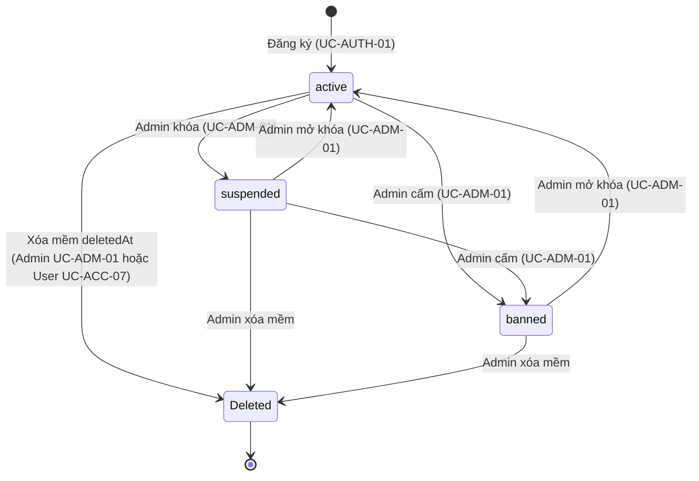

Tài khoản `Deleted` luôn kèm `status = banned` và `deletedAt` khác NULL; không đăng nhập được; email có thể đăng ký lại.

### 10.2. Order (`OrderStatus`)

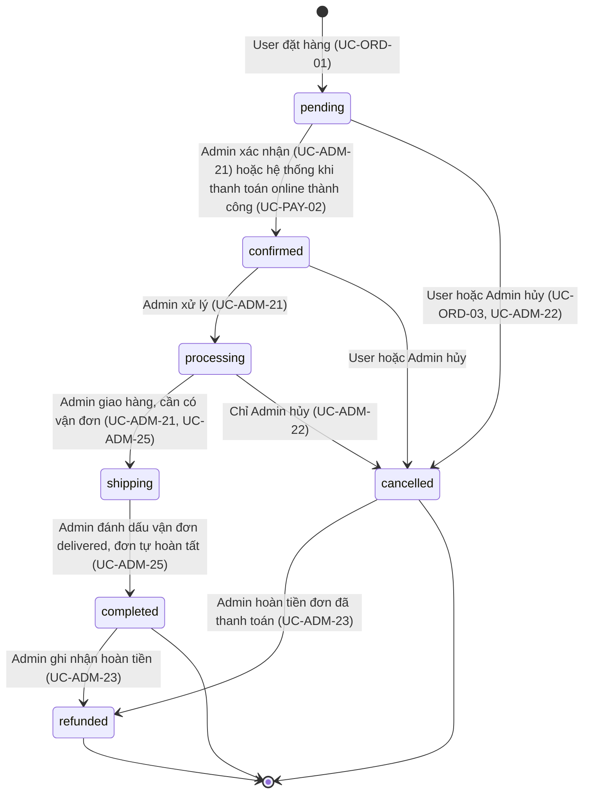

Mỗi chuyển đổi (kể cả dòng khởi tạo) được DB trigger `trg_orders_log_status_*` ghi vào `OrderStatusHistory`; chuyển `pending → confirmed` do thanh toán online có `changedBy = NULL` và ghi chú "Thanh toán online thành công". Hủy hoàn tồn kho và lượt dùng mã (Service). `soldCount` tăng khi sang `completed` (Service). Đơn đã thanh toán bị hủy vẫn giữ `Payment.success` cho tới khi admin hoàn tiền (`cancelled → refunded`).

### 10.3. Payment (`PaymentTxnStatus`) và Order.paymentStatus (`OrderPaymentStatus`)

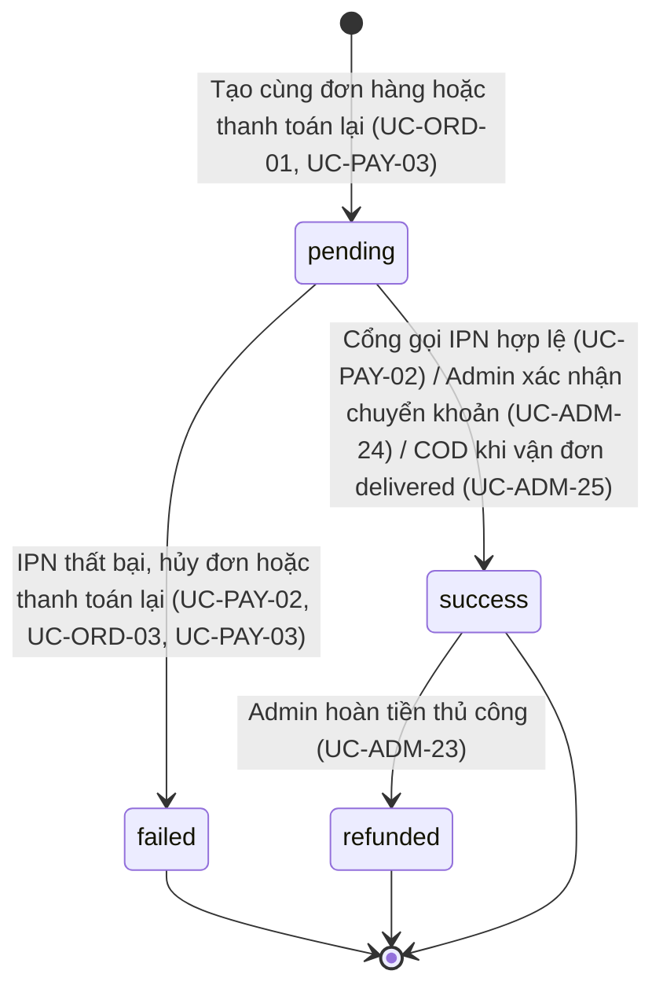

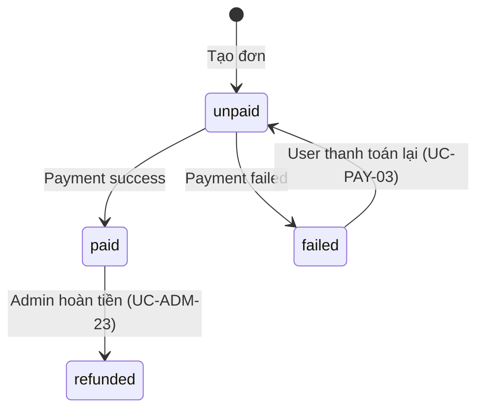

### 10.4. Shipment (`ShipmentStatus`)

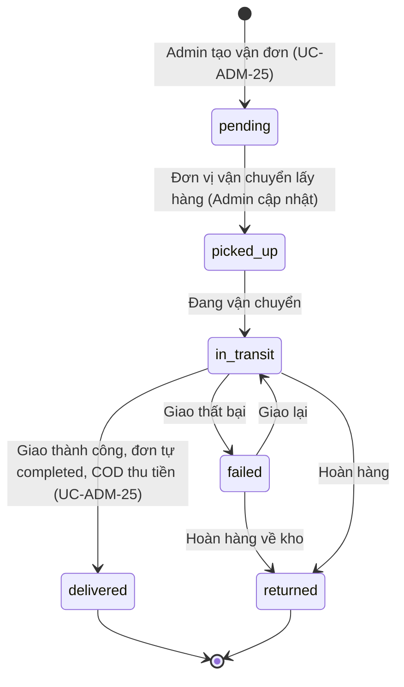

`shippedAt` đặt khi `picked_up`, `deliveredAt` khi `delivered` (CHECK `deliveredAt ≥ shippedAt`).

### 10.5. Review (`ReviewStatus`)

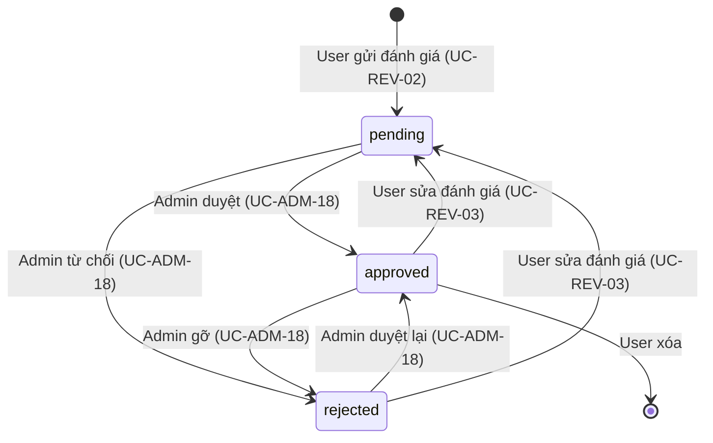

DB trigger `trg_reviews_refresh_rating` tính lại `ratingAvg`/`ratingCount` ở mọi chuyển đổi liên quan đến `approved`.

### 10.6. Page và Space (`ContentStatus`)

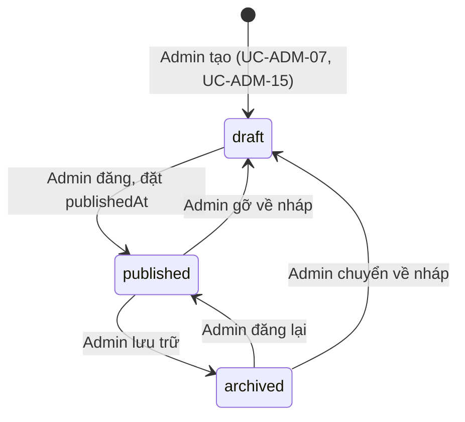

Áp dụng cho `Page`, `Space` và cả `Product` (UC-ADM-09; sản phẩm còn có xóa mềm `deletedAt`). Space chỉ được `published` khi có ít nhất một ảnh 360° và đúng một ảnh mở đầu.

### 10.7. Product3DModel (`ModelStatus`)

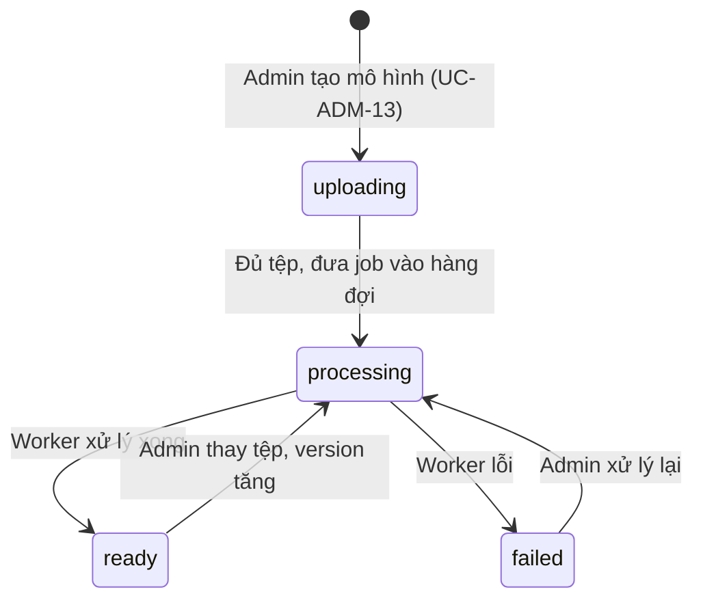

Khi `ready`, DB trigger cập nhật `Product.has3dModel` và `hasAr` (chỉ khi đủ GLB và USDZ).

## 11. Tích hợp ngoài

### 11.1. Cổng thanh toán (MoMo, VNPay, ZaloPay)

| Hạng mục | Nội dung |
| --- | --- |
| Luồng | Redirect: User bấm thanh toán → API tạo URL có chữ ký (UC-PAY-01) → trình duyệt sang cổng → cổng gọi IPN về máy chủ (UC-PAY-02) và chuyển trình duyệt về trang kết quả |
| Nguồn sự thật | IPN/callback có chữ ký hợp lệ; trang return chỉ để hiển thị |
| Endpoint | `POST /api/payments/:orderId/checkout`, `POST /api/payments/:orderId/retry`, `GET /api/payments/:gateway/return`, `POST\|GET /api/payments/:gateway/ipn` (công khai, xác thực bằng chữ ký) |
| Chữ ký | VNPay: HMAC-SHA512 (`vnp_SecureHash`); MoMo, ZaloPay: HMAC-SHA256 [CẦN XÁC NHẬN theo tài liệu cổng khi tích hợp] |
| Idempotent | Callback lặp không xử lý lại khi `Payment.status` đã `success` |
| Biến môi trường | Chưa có trong `.env.example`: `VNPAY_TMN_CODE`, `VNPAY_HASH_SECRET`, `MOMO_PARTNER_CODE`, `MOMO_ACCESS_KEY`, `MOMO_SECRET_KEY`, `ZALOPAY_APP_ID`, `ZALOPAY_KEY1`, `ZALOPAY_KEY2`, `PAYMENT_RETURN_URL`, `PAYMENT_IPN_BASE_URL` [CẦN TẠO MỚI] |
| Phương thức `card` | Thanh toán thẻ đi qua cổng VNPay (đã quyết định) |
| Hoàn tiền | Thủ công (UC-ADM-23); không gọi API hoàn tiền của cổng |
| Module | `modules/payments` [CẦN TẠO MỚI] |

#### UC-PAY-02 – Nhận callback/IPN từ cổng thanh toán

| Mục | Nội dung |
| --- | --- |
| **Thông tin chung** | Nhóm: Thanh toán · Ưu tiên: **Bắt buộc** · Khách: hệ thống ngoài · User: hệ thống ngoài · Admin: hệ thống ngoài · Nguồn: CSDL (payments, orders) |
| **Tác nhân chính / phụ** | Cổng thanh toán (MoMo, VNPay, ZaloPay) |
| **Mô tả** | Cổng gọi máy chủ để báo kết quả thanh toán; hệ thống xác thực chữ ký rồi cập nhật Payment và Order. |
| **Tiền điều kiện** | Có `Payment` pending tương ứng. |
| **Hậu điều kiện** | `Payment.status` = `success` hoặc `failed`; `Order.paymentStatus` tương ứng; khi thành công và đơn đang `pending` thì đơn tự chuyển `confirmed`. |
| **Luồng chính** | 1. Hệ thống ngoài: Cổng gửi `POST\|GET /api/payments/:gateway/ipn` kèm dữ liệu và chữ ký. 2. Hệ thống: Endpoint công khai (không JWT); `PaymentsService.handleCallback(gateway, payload)` xác thực chữ ký HMAC. 3. Hệ thống: Tìm `Payment` theo mã tham chiếu; đối chiếu `amount` với `Order.total`. 4. Hệ thống: Mở `$transaction`; nếu `Payment.status` đã `success` → bỏ qua (idempotent). 5. Hệ thống: Kết quả thành công → `Payment.status = success`, `transactionCode`, `gatewayResponse`, `paidAt`; `Order.paymentStatus = paid`. 6. Hệ thống: Nếu `Order.status = pending`: tự chuyển `confirmed` trong cùng transaction. KHÔNG đặt `app.current_user_id` nên trigger ghi `OrderStatusHistory` với `changedBy = NULL`; đặt `app.status_note = 'Thanh toán online thành công'`. 7. Hệ thống: Kết quả thất bại → `Payment.status = failed`, `gatewayResponse`; `Order.paymentStatus = failed`; đơn vẫn `pending`. 8. Hệ thống: Tạo `Notification` cho user; trả cổng đúng định dạng quy định (ví dụ `{ RspCode: "00" }`). |
| **Luồng thay thế** | 2a. Chữ ký sai → từ chối (400/`RspCode 97`), ghi log bảo mật, không đổi dữ liệu. 3a. Không tìm thấy giao dịch hoặc sai số tiền → từ chối (`RspCode 01/04`). 4a. Callback lặp lại → trả thành công nhưng không xử lý lại. 5a. Callback thành công đến khi đơn đã `cancelled` (đã hủy trước khi cổng báo) → chỉ ghi `Payment` success, KHÔNG đổi trạng thái đơn, tạo cảnh báo cho admin để hoàn tiền thủ công (UC-ADM-23) [ĐỀ XUẤT]. |
| **Ngoại lệ** | • Lỗi CSDL → trả mã lỗi để cổng gọi lại sau. |
| **Quy tắc nghiệp vụ** | • Callback là nguồn sự thật duy nhất để xác nhận thanh toán online; không tin redirect của trình duyệt. • `transactionCode` UNIQUE: giao dịch trùng bị từ chối. • Thanh toán online thành công TỰ chuyển đơn `pending → confirmed` (đã quyết định); lịch sử do DB trigger ghi, Service chỉ đặt biến phiên `app.status_note`. |
| **Dữ liệu vào** | • payload của từng cổng (bắt buộc): chữ ký hợp lệ |
| **Dữ liệu ra** | • Phản hồi theo chuẩn từng cổng |
| **Model + C/R/U/D** | Payment (payments): R,U Order (orders): R,U Notification (notifications): C OrderStatusHistory (order_status_history): C (trigger) |
| **DB trigger / việc Service tự làm** | • DB trigger: `trg_payments_set_updated_at`, `trg_orders_set_updated_at`, `trg_orders_log_status_update` (ghi lịch sử `pending → confirmed`, `changedBy = NULL`). • Service: `$transaction` đồng bộ `Payment`, `Order.paymentStatus` và `Order.status`. |

### 11.2. Đơn vị vận chuyển (GHN, GHTK, Viettel Post)

| Hạng mục | Nội dung |
| --- | --- |
| Giai đoạn đầu | Admin tạo vận đơn và cập nhật trạng thái thủ công (UC-ADM-25); lưu `carrier`, `trackingCode`, `fee`, `shippedAt`, `deliveredAt` |
| Mở rộng | Gọi API tạo vận đơn và nhận webhook trạng thái của từng hãng, ánh xạ sang `ShipmentStatus` [ĐỀ XUẤT] |
| Tác nhân ngoài | Đơn vị vận chuyển lấy/giao hàng; trạng thái do admin cập nhật, khi `delivered` đơn tự `completed` (UC-ADM-25) |
| Module | `modules/shipments` [CẦN TẠO MỚI] |

### 11.3. Dịch vụ email

| Sự kiện | Nội dung email | UC |
| --- | --- | --- |
| Đăng ký | Xác thực email | UC-AUTH-01, UC-AUTH-07 |
| Quên mật khẩu | Liên kết đặt lại (hiệu lực 30 phút) | UC-AUTH-05 |
| Đặt hàng | Xác nhận đơn | UC-ORD-01 |
| Đổi trạng thái đơn / giao hàng / hoàn tiền | Cập nhật tiến trình | UC-ADM-21, UC-ADM-23, UC-ADM-25 |

Gửi qua SMTP (dev: Mailpit, http://localhost:8025) bằng `MailService` (`apps/api/src/mail`), không dùng hàng đợi; lỗi gửi chỉ ghi log và không làm hỏng luồng chính (luồng không quan trọng gọi không `await`). Biến môi trường `MAIL_HOST`, `MAIL_PORT`, `MAIL_FROM`. Chuyển sang hàng đợi `mail` là hướng phát triển.

### 11.4. Lưu trữ tệp và xử lý nền

`StorageService` có hai driver chọn bằng `STORAGE_DRIVER`: `minio` (mặc định dev) và `local`. MinIO có hai bucket: `aurelia-public` (ảnh, panorama, mô hình đã xử lý; đọc ẩn danh qua `STORAGE_PUBLIC_URL`) và `aurelia-private` (tệp gốc chờ xử lý, ảnh AR chưa công khai; chỉ truy cập bằng presigned GET). Ảnh ≤ 5 MB tải qua API (multipart); mô hình 3D (≤ 100 MB) và panorama (≤ 20 MB) tải bằng presigned PUT thẳng lên MinIO rồi gọi API xác nhận. Hàng đợi BullMQ + Redis (`modules/jobs`): queue `model-processing` (kiểm tra GLB, đo đa giác/texture, sinh LOD, tính checksum) và `image-processing` (webp + thumbnail bằng `sharp`); mỗi job thử lại tối đa 3 lần với backoff mũ, job thất bại được giữ lại; Bull Board tại `/admin/queues` (chỉ admin). Worker chạy cùng tiến trình API, thiết kế để tách sang `apps/worker`. Redis cũng lưu bộ đếm giới hạn tốc độ (`@nestjs/throttler`). Quyết định: `docs/DECISIONS.md` D-T21..D-T23.

## 12. Quyết định nghiệp vụ và điểm còn mở

### 12.1. Đã quyết định

| # | Quyết định | UC |
| --- | --- | --- |
| 1 | User hủy đơn khi `pending` hoặc `confirmed`; admin hủy được trước `shipping` (`pending`, `confirmed`, `processing`). Hủy đơn hoàn tồn kho và lượt dùng coupon | UC-ORD-03, UC-ADM-22 |
| 2 | COD: `Payment` `pending`, chuyển `success` khi vận đơn `delivered` (đơn `completed`). Online: `success` khi nhận callback hợp lệ; callback thất bại: đơn vẫn `pending`, cho thanh toán lại | UC-PAY-02, UC-PAY-03, UC-ADM-25 |
| 3 | Hoàn tiền thủ công: admin đổi đơn sang `refunded` và payment sang `refunded`; không gọi API hoàn tiền của cổng | UC-ADM-23 |
| 4 | Không bắt buộc xác thực email để đặt hàng; **bắt buộc** xác thực email mới được đánh giá | UC-AUTH-07, UC-REV-02 |
| 5 | Trừ tồn kho khi tạo đơn, trong `$transaction`, không phải khi thanh toán | UC-ORD-01 |
| 6 | Đánh giá chỉ khi có `OrderItem` của sản phẩm thuộc đơn `completed` của chính user; review mới `pending`, admin duyệt | UC-REV-02, UC-ADM-18 |
| 7 | Mô hình 3D: `uploading` → `processing` → `ready`/`failed`; xử lý bởi processor nền | UC-ADM-13 |
| 8 | **Xử lý nền** bằng BullMQ + Redis trong `apps/api/src/modules/jobs` (queue `model-processing`, `image-processing`); worker chạy cùng tiến trình API. Lưu trữ tệp bằng MinIO (2 bucket public/private) qua `StorageService`; mô hình 3D và panorama tải bằng presigned PUT. Redis và MinIO nằm trong profile mặc định của `docker-compose.yml`. (Thay thế quyết định tạm "không dùng Redis/MinIO" ngày 2026-10-08.) | UC-ADM-13, UC-ADM-04 |
| 9 | **Xác thực email**: JWT ký riêng mục đích `verify_email`, không thêm bảng | UC-AUTH-07 |
| 10 | **Setting**: danh sách trắng khóa công khai trong Service, không thêm cột | UC-ADM-03 |
| 11 | **Ghi lượt xem không gian mẫu**: MỘT lần khi người xem rời trang bằng `navigator.sendBeacon` (kèm `hotspotClickCount`, `addedToCart`); bỏ `viewToken` | UC-SPACE-06 |
| 12 | **Slug** cho cả API và web: route web cần đổi `products/[id]` → `products/[slug]`, `spaces/[id]` → `spaces/[slug]` [CẦN SỬA]. Quy ước: API công khai/của user dùng slug trong URL (`/api/products/:slug`, `/api/spaces/:slug`, `/api/wishlist/:slug`); API quản trị và nội dung body dùng id | UC-CAT-04, UC-SPACE-02 |
| 13 | **Thanh toán online thành công** tự chuyển đơn `pending → confirmed`; lịch sử ghi `changedBy = NULL`, ghi chú "Thanh toán online thành công" | UC-PAY-02 |
| 14 | **Vận đơn `delivered`** tự chuyển đơn `completed`; nếu COD thì payment đồng thời `success` | UC-ADM-25 |
| 15 | **Hủy đơn đã thanh toán**: `cancelled`, `Payment` giữ `success`, admin hoàn tiền thủ công; cho phép `cancelled → refunded` | UC-ORD-03, UC-ADM-22, UC-ADM-23 |
| 16 | **Áp mã giảm giá chỉ xem trước**; mã được ghi khi đặt hàng và kiểm tra lại trong transaction | UC-CART-04, UC-ORD-01 |
| 17 | **Phương thức `card`** đi qua cổng VNPay | UC-PAY-01 |
| 18 | **Tìm kiếm sản phẩm không dấu** (Nên có): cần thêm MỘT migration (index GIN trigram trên `immutable_unaccent(name)`), làm khi code | UC-CAT-06 |
| 19 | **Ngoài phạm vi UC**: module `ai`, `ar-overlay`, ứng dụng `apps/mobile`; đưa vào "Hướng phát triển" (mục 13) | — |

### 12.2. Điểm còn mở (đang áp dụng mặc định, chờ phản hồi)

| # | Điểm | Mặc định đang áp dụng |
| --- | --- | --- |
| 1 | Mã đơn | Dạng `ALV-YYYYMMDD-NNNN`, thử lại khi trùng (UC-ORD-01) |
| 2 | Giới hạn tệp | Ảnh ≤ 5 MB, panorama ≤ 20 MB, GLB/USDZ ≤ 100 MB (biến `UPLOAD_MAX_IMAGE_MB`, `UPLOAD_MAX_PANORAMA_MB`, `UPLOAD_MAX_MODEL_MB`); `Media.fileSize` là INTEGER nên tối đa ~2 GB (UC-ADM-04) |
| 3 | Giới hạn tốc độ (đăng nhập, quên mật khẩu, thống kê ẩn danh) | Trả 429; chưa quyết định triển khai ở giai đoạn nào |
| 4 | Thông báo tự động (đổi trạng thái đơn, duyệt đánh giá) | Service tạo `Notification`; không có trigger |
| 5 | Gộp giỏ khách vào giỏ user sau đăng nhập | Không gộp (khách không có giỏ); client chỉ nhớ ý định thêm vào giỏ để thực hiện lại sau khi đăng nhập |
| 6 | Xác nhận chuyển khoản (UC-ADM-24) cũng tự chuyển đơn `pending → confirmed` giống thanh toán online | Có áp dụng [ĐỀ XUẤT] |
| 7 | Callback thanh toán thành công đến sau khi đơn đã `cancelled` | Chỉ ghi `Payment` success, không đổi đơn, cảnh báo admin hoàn tiền thủ công [ĐỀ XUẤT] |
| 8 | Vận đơn `failed`/`returned` khi đơn đang `shipping` | Chưa chốt; đề xuất cho admin hủy/hoàn tiền đơn khi vận đơn `returned` (mở rộng UC-ADM-22 cho trường hợp này) |
| 9 | `userId` của lượt xem không gian khi dùng `sendBeacon` (không gửi được header Authorization) | Gửi `accessToken` tuỳ chọn trong body; không có thì ghi ẩn danh |
| 10 | Đã xác thực email hay chưa với tài khoản cũ khi bật tính năng | Chưa có dữ liệu cũ; không áp dụng |

### 12.3. Thành phần cần tạo mới / cần sửa / cần migration (tóm tắt; chi tiết ở Giai đoạn 2)

- **[CẦN TẠO MỚI]** `OptionalJwtAuthGuard` (cho `POST/PATCH /api/ar-sessions`), `PermissionsGuard`, `ActivityLogInterceptor`; module `categories`, `brands`, `pages`, `attributes`, `reviews`, `coupons`, `addresses`, `notifications`, `wishlist`, `payments`, `shipments`, `inventory`, `settings`, `stats`, `activity-logs`, `mail`, `ar-sessions`, `ar-snapshots`; DTO tương ứng; `setGlobalPrefix('api')`; cấu hình `ConfigModule` đọc `.env`; (tuỳ chọn) `src/worker.ts`.
- **[CẦN SỬA]** `apps/web/src/app/(shop)/products/[id]` → `products/[slug]`; `apps/web/src/app/(shop)/spaces/[id]` → `spaces/[slug]`.
- **Migration cần làm khi code** (tạo bằng `prisma migrate dev --create-only`): index `idx_products_name_unaccent_trgm` ON `products` USING gin (`immutable_unaccent(name)` gin_trgm_ops) (UC-CAT-06).

## 13. Hướng phát triển

Các thành phần đã có trong khung code nhưng **không thuộc danh sách use case** của đồ án này:

| Thành phần | Vị trí | Ghi chú |
| --- | --- | --- |
| Module AI (gợi ý sản phẩm, mô tả tự động; OpenAI/Ollama) | `apps/api/src/modules/ai` | Tuỳ chọn, chưa có yêu cầu nghiệp vụ |
| Module overlay AR cho mobile | `apps/api/src/modules/ar-overlay` | Sinh dữ liệu/metadata overlay cho ứng dụng Android |
| Ứng dụng Android (camera AR overlay, catalog, giỏ hàng, chi tiết sản phẩm) | `apps/mobile` | Kotlin, dùng cùng API |
| Tách worker BullMQ sang `apps/worker` (tiến trình riêng) | `infra/docker/Dockerfile.worker`, `apps/api/src/modules/jobs` | Hiện worker chạy cùng tiến trình API; processor đã tách logic nên chuyển được mà không sửa |
| Webhook đơn vị vận chuyển, đồng bộ trạng thái tự động | UC-ADM-25 | Hiện nhập tay |
| Hoàn tiền qua API cổng thanh toán | UC-ADM-23 | Hiện ghi nhận thủ công |
| Gộp giỏ khách vào giỏ user | UC-CART-01 | Hiện không có |

## 14. Thống kê và kiểm tra

| Chỉ số | Giá trị |
| --- | --- |
| Tổng UC | 76 |
| UC Khách vãng lai | 21 |
| UC Người dùng (gồm kế thừa Khách) | 44 |
| UC Quản trị viên | 55 |
| UC Tác nhân ngoài | 1 |
| UC riêng của Khách (chỉ dành cho khách chưa đăng nhập) | 1 |
| UC chung (mục 6) | 22 |
| UC riêng của User (mục 8) | 22 |
| UC Quản trị (mục 9) | 30 |
| Ưu tiên Bắt buộc | 29 |
| Ưu tiên Nên có | 32 |
| Ưu tiên Mở rộng | 15 |
| Model được ít nhất 1 UC sử dụng | 44/44 |

Đã kiểm tra tự động: mã UC duy nhất; mọi `include`/`extend` trỏ tới UC tồn tại; 44/44 model có UC sử dụng; không UC nào cho khách ghi dữ liệu ngoài `User`, `UserSession`, `UserRole`, `PasswordReset` (đăng ký/đăng nhập/quên mật khẩu) và `ArSession`, `SpaceView` (thống kê ẩn danh).
