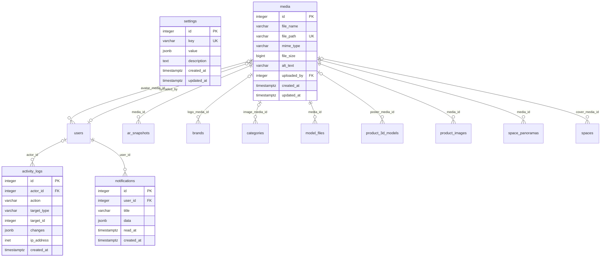
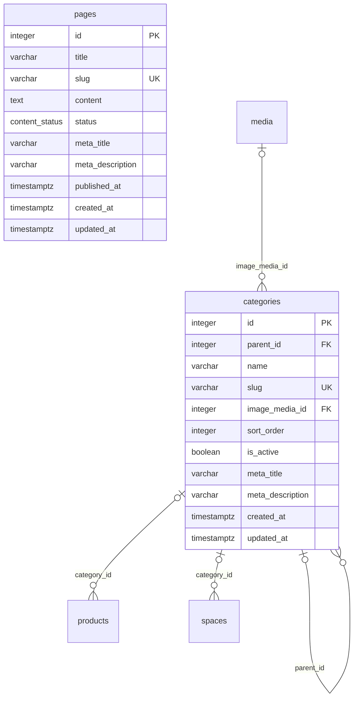
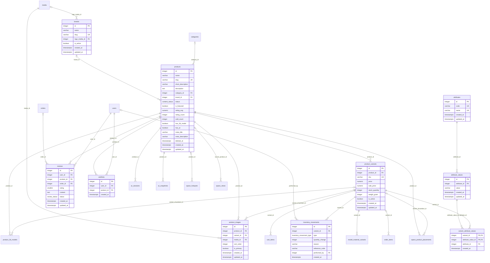
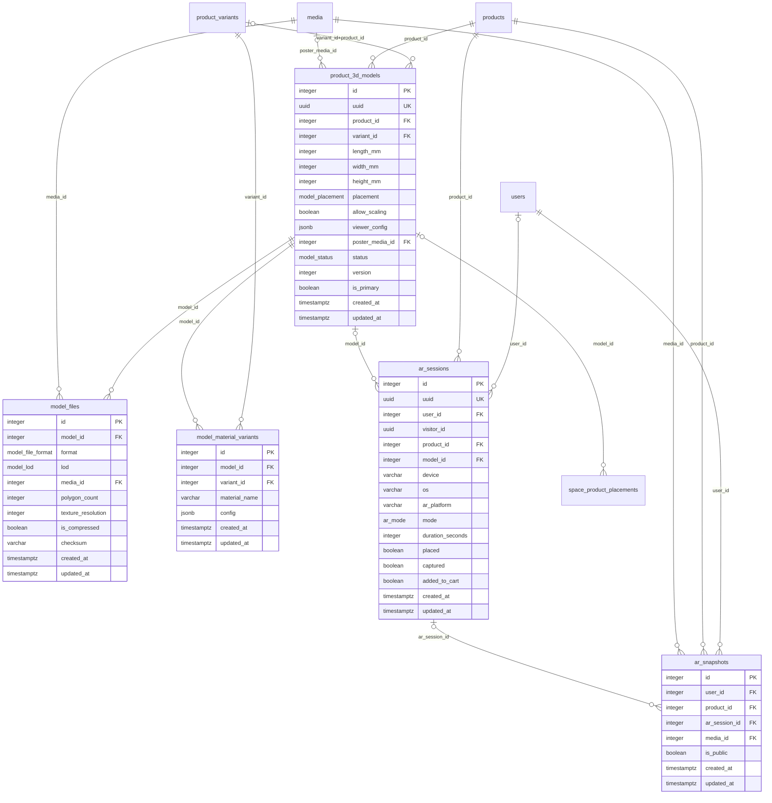
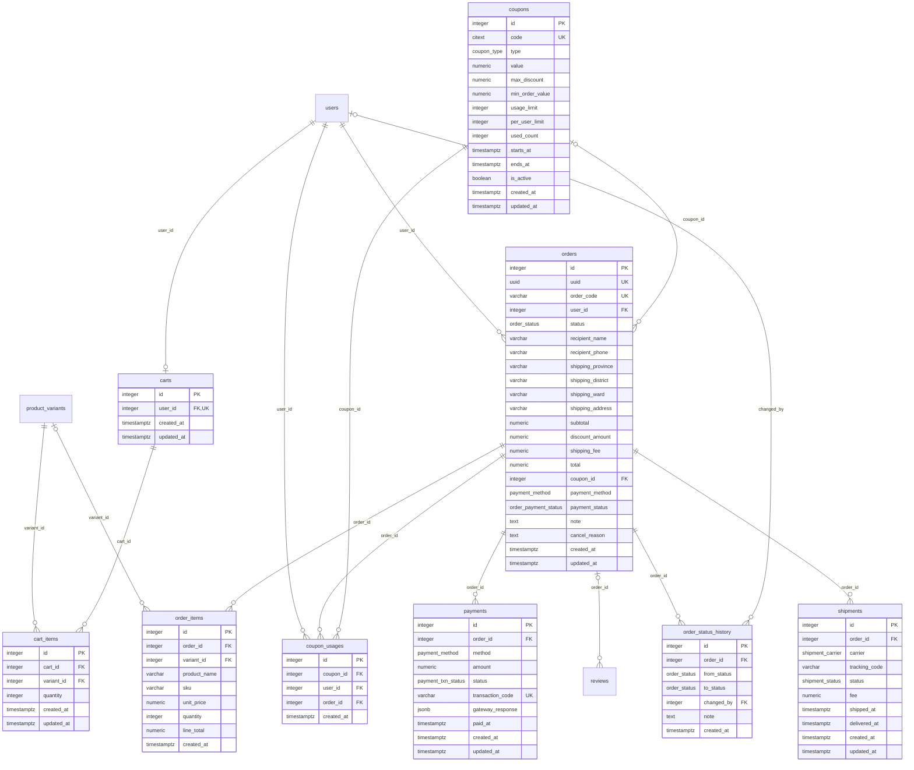
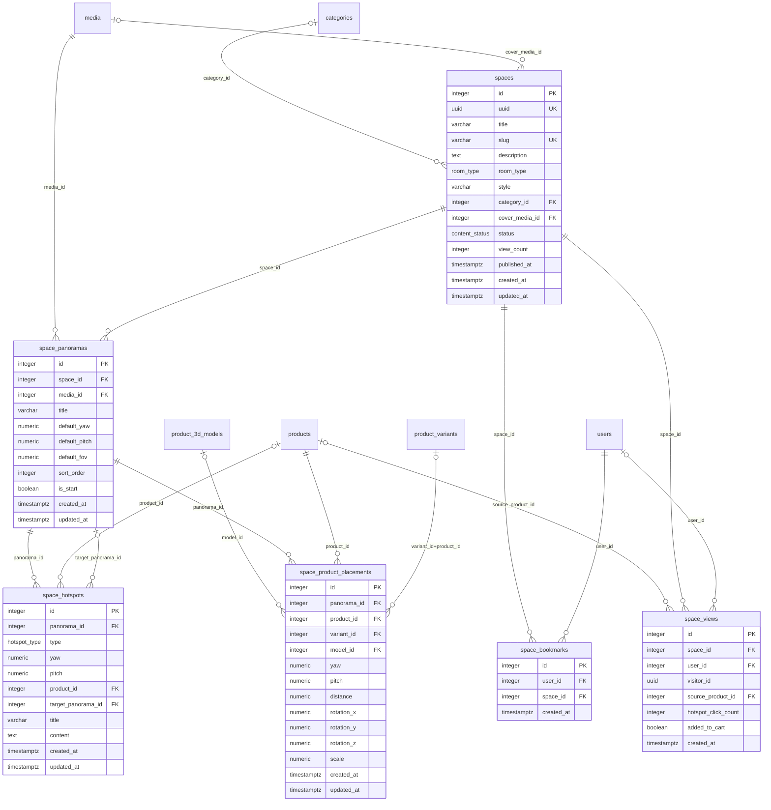

# Cơ sở dữ liệu Aurelia Living – Tài liệu schema

Website thương mại điện tử nội thất, tích hợp xem 3D, AR và không gian mẫu 360°.
Hệ quản trị: **PostgreSQL 15+** (dùng `UNIQUE NULLS NOT DISTINCT` và `ON DELETE SET NULL (cột)`, đã chạy thử trên 16).
Nguồn mô tả nghiệp vụ: [CAU_TRUC_DB.md](CAU_TRUC_DB.md).

> **Nguồn chuẩn cấu trúc CSDL là `apps/api/prisma`** (`schema.prisma` + `migrations/0_init`). Thư mục [`database/`](../database/) chỉ còn là tài liệu tham khảo (SQL thuần, xem [database/README.md](../database/README.md)). Mọi thay đổi về sau làm qua `prisma migrate dev`.

## 1. Tổng quan và cách dựng

| Hạng mục | Số lượng |
| --- | --- |
| Bảng | 44 (7 nhóm) |
| ENUM | 18 |
| Hàm PL/pgSQL / SQL | 10 |
| Trigger | 36 (29 trigger `updated_at` + 7 trigger nghiệp vụ) |
| Index | 168 (78 gắn với PK/UNIQUE + 90 tạo riêng, trong đó 13 partial và 2 GIN trigram) |
| Khóa ngoại / CHECK | 74 / 47 |

| File | Nội dung |
| --- | --- |
| `00_reset.sql` | Xóa toàn bộ bảng, hàm, ENUM. **Chỉ dùng khi dev** |
| `01_extensions.sql` | `citext`, `pg_trgm`, `unaccent`, `pgcrypto` + hàm `immutable_unaccent()` |
| `02_types.sql` | 18 ENUM |
| `03_tables.sql` | 44 bảng, `COMMENT ON` tiếng Việt, khóa ngoại và CHECK |
| `04_constraints_indexes.sql` | Khóa ngoại vòng, partial unique index, index cho khóa ngoại và cột hay lọc |
| `05_functions_triggers.sql` | Hàm và trigger |
| `06_seed.sql` | 2 vai trò, 6 quyền, cấu hình mặc định, tài khoản admin |
| `07_sample_data.sql` | Dữ liệu mẫu cho dev/test |
| `run_all.sql` | Chạy 01 → 07 (dùng `\ir`, chạy được từ thư mục bất kỳ) |

Dựng CSDL thật (khuyến nghị) qua Prisma:

```bash
cd apps/api
npx prisma migrate deploy      # áp migration 0_init
npx prisma db seed             # vai trò, quyền, settings, admin + dữ liệu mẫu (SEED_SAMPLE=false để bỏ dữ liệu mẫu)
npx prisma migrate reset       # dev: xóa và dựng lại toàn bộ
```

Dựng bản SQL thuần để đối chiếu: `psql -d <db> -v ON_ERROR_STOP=1 -f database/run_all.sql`.

Tài khoản mẫu (mật khẩu băm bcrypt bằng `crypt()`): `admin@aurelia.vn` / `Admin@123456`; `nguyenvana@example.com` và `tranthib@example.com` / `User@123456`. **Đổi mật khẩu admin trước khi triển khai thật.**

### Quy ước thiết kế

- Khóa chính và khóa ngoại dùng `INTEGER` (`id INTEGER GENERATED ALWAYS AS IDENTITY`) để Prisma sinh kiểu `Int`/`number`. Ngoại lệ có chủ ý: `media.file_size` là `BIGINT` (dung lượng byte, Prisma trả `BigInt`). Thêm cột `uuid` (UNIQUE, `gen_random_uuid()`) cho `users`, `orders`, `spaces`, `ar_sessions` (và `product_3d_models`) để dùng làm mã công khai ngoài API.
- Tiền `NUMERIC(15,2)` có CHECK ≥ 0; kích thước 3D `INTEGER` (mm); góc, tỉ lệ, tọa độ `NUMERIC(9,4)`; email và mã giảm giá `CITEXT`; IP `INET`; dữ liệu linh hoạt `JSONB`.
- Tên ràng buộc: `pk_`, `fk_<bảng>_<cột>`, `uq_`, `ck_`; tên index: `idx_`.
- Bảng nhật ký (`activity_logs`, `inventory_movements`, `order_status_history`, `space_views`, `coupon_usages`) chỉ có `created_at`. Bảng có dữ liệu sửa được (kể cả `ar_sessions`, vì các cờ `placed/captured/added_to_cart` được cập nhật khi phiên diễn ra) có thêm `updated_at` (trigger tự cập nhật). Các bảng liên kết/nhật ký khác (`role_permissions`, `user_roles`, `wishlists`, `space_bookmarks`, `order_items`, `notifications`, `password_resets`, `user_sessions`, `permissions`, `variant_attribute_values`) cũng chỉ có `created_at`.
- `ON DELETE`: `CASCADE` cho dữ liệu con thuần túy, `RESTRICT` cho dữ liệu cần giữ lịch sử, `SET NULL` cho tham chiếu tùy chọn. Lý do ghi ngay cạnh từng khóa ngoại trong `03_tables.sql`. Hai trường hợp đặc biệt: `ar_sessions.user_id` và `space_views.user_id` dùng `CASCADE` (không `SET NULL`), `space_hotspots.product_id` dùng `CASCADE`, vì `SET NULL` sẽ vi phạm CHECK của chính bảng đó.
- Biến thể phải thuộc đúng sản phẩm được bảo đảm bằng **khóa ngoại kép** `(variant_id, product_id)` ở `product_images`, `product_3d_models`, `space_product_placements`; giá trị thuộc tính phải thuộc đúng thuộc tính bằng khóa kép `(attribute_value_id, attribute_id)` ở `variant_attribute_values`.
- Các ràng buộc "tối đa một" (ảnh đại diện, mô hình chính, ảnh mở đầu, địa chỉ mặc định) là partial unique index: chặn trường hợp có **hai**, còn việc phải có **đúng một** do tầng Service bảo đảm.

## 2. Vai trò và quyền truy cập dữ liệu

Hệ thống chỉ có **3 loại người dùng**. Không có vai trò `staff`, `editor`, `customer`, `guest`.

| Vai trò | Lưu trong CSDL | Được làm gì |
| --- | --- | --- |
| Quản trị viên (admin) | `users` + `roles` (`admin`), có đủ 6 quyền | Toàn bộ quyền quản trị |
| Người dùng (user) | `users` + `roles` (`user`), không có quyền quản trị | Mua hàng, giỏ hàng, áp mã giảm giá, đánh giá, yêu thích, sổ địa chỉ, chụp ảnh AR, lưu không gian mẫu; chỉ thao tác trên dữ liệu của chính mình |
| Khách vãng lai | **Không lưu** (không có tài khoản, không có trong `roles`) | Chỉ xem sản phẩm, 3D/AR, không gian mẫu, trang tĩnh. Thêm giỏ, mua hàng, áp mã phải đăng ký/đăng nhập |

Cách CSDL thể hiện quy định này: `carts.user_id` NOT NULL + UNIQUE (không có `session_token`); `orders`, `addresses`, `wishlists`, `reviews`, `coupon_usages`, `ar_snapshots`, `space_bookmarks`, `notifications`, `user_sessions`, `password_resets` có `user_id` NOT NULL; `ar_sessions` và `space_views` cho phép `user_id` NULL nhưng bắt buộc có `user_id` hoặc `visitor_id` (CHECK); `activity_logs` chỉ ghi thao tác admin qua `actor_id`.

### Ma trận C/R/U/D theo bảng

Ký hiệu: **C** tạo, **R** xem, **U** sửa, **D** xóa, **—** không có quyền.
`*` chỉ dữ liệu của chính mình · `†` chỉ dữ liệu công khai/đang hiển thị (ví dụ sản phẩm `published`, chưa xóa mềm; review `approved`; ảnh AR `is_public`) · `‡` luồng xác thực do API xử lý cho người chưa đăng nhập (đăng ký, đăng nhập, quên mật khẩu).
Đây là quy tắc để tầng API/Service thực thi; CSDL không dùng Row-Level Security.

| # | Bảng | Admin | User | Khách vãng lai |
| --- | --- | --- | --- | --- |
| 1 | users | CRUD | R\* U\* | C‡ (đăng ký) |
| 2 | roles | R U (không thêm vai trò mới) | — | — |
| 3 | permissions | R | — | — |
| 4 | role_permissions | R U | — | — |
| 5 | user_roles | CRUD | R\* | — |
| 6 | password_resets | — | C\* U\* | C‡ U‡ |
| 7 | user_sessions | R D (thu hồi) | C\* R\* D\* | C‡ |
| 8 | addresses | R | CRUD\* | — |
| 9 | settings | CRUD | R† | R† |
| 10 | media | CRUD | C R† | R† |
| 11 | notifications | C R | R\* U\* D\* | — |
| 12 | activity_logs | R (ghi C tự động) | — | — |
| 13 | categories | CRUD | R† | R† |
| 14 | pages | CRUD | R† | R† |
| 15 | brands | CRUD | R† | R† |
| 16 | products | CRUD | R† | R† |
| 17 | attributes | CRUD | R | R |
| 18 | attribute_values | CRUD | R | R |
| 19 | product_variants | CRUD | R† | R† |
| 20 | variant_attribute_values | CRUD | R† | R† |
| 21 | product_images | CRUD | R† | R† |
| 22 | inventory_movements | C R | — | — |
| 23 | reviews | R U (duyệt) D | C\* R† U\* D\* | R† |
| 24 | wishlists | R | CRD\* | — |
| 25 | product_3d_models | CRUD | R† | R† |
| 26 | model_files | CRUD | R† | R† |
| 27 | model_material_variants | CRUD | R† | R† |
| 28 | ar_sessions | R | C\* R\* | C (kèm `visitor_id`) |
| 29 | ar_snapshots | R D | CRUD\* | R† |
| 30 | carts | R | CRU\* | — |
| 31 | cart_items | R | CRUD\* | — |
| 32 | coupons | CRUD | R† (áp mã) | — |
| 33 | coupon_usages | R | C\* R\* | — |
| 34 | orders | R U | C\* R\* U\* (hủy khi còn `pending`) | — |
| 35 | order_items | R | C\* R\* | — |
| 36 | order_status_history | R (ghi C tự động) | R\* | — |
| 37 | payments | R U | C\* R\* | — |
| 38 | shipments | CRU | R\* | — |
| 39 | spaces | CRUD | R† | R† |
| 40 | space_panoramas | CRUD | R† | R† |
| 41 | space_hotspots | CRUD | R† | R† |
| 42 | space_product_placements | CRUD | R† | R† |
| 43 | space_bookmarks | R | CRD\* | — |
| 44 | space_views | R | C\* | C (kèm `visitor_id`) |

Phân quyền chi tiết trong khu vực quản trị dùng 6 quyền (`permissions`): `manage_users`, `manage_products`, `view_orders`, `process_orders`, `manage_content`, `manage_settings`. Admin có cả 6; user không có quyền nào.

## 4. Từ điển dữ liệu

Phần này được sinh trực tiếp từ CSDL đã dựng bằng `run_all.sql` (kiểu, ràng buộc, mô tả lấy từ `COMMENT ON`). Mọi bảng đều có khóa chính `id INTEGER GENERATED ALWAYS AS IDENTITY` (trừ các bảng liên kết dùng khóa kép).

### Nhóm 1 – Người dùng và phân quyền (8 bảng)

#### 1. `users`

Tài khoản người dùng (admin và user). Khách vãng lai không có tài khoản. Hỗ trợ xóa mềm.

| Cột | Kiểu | Ràng buộc | Mô tả |
| --- | --- | --- | --- |
| `id` | integer | PK<br>IDENTITY | Khóa chính |
| `uuid` | uuid | UNIQUE<br>NOT NULL<br>DEFAULT gen_random_uuid() | Mã công khai dùng ngoài API, không lộ id tuần tự |
| `full_name` | varchar(150) | NOT NULL | Họ và tên |
| `email` | citext | NOT NULL | Email đăng nhập, không phân biệt hoa thường; duy nhất trên tài khoản chưa xóa mềm |
| `phone` | varchar(20) | — | Số điện thoại |
| `password_hash` | varchar(255) | NOT NULL | Mật khẩu đã băm (bcrypt/argon2), không lưu mật khẩu gốc |
| `avatar_media_id` | integer | FK → media.id (set null) | Ảnh đại diện (media) |
| `status` | user_status | NOT NULL<br>DEFAULT 'active' | Trạng thái tài khoản: active, suspended (tạm khóa), banned (bị cấm) |
| `email_verified_at` | timestamptz | — | Thời điểm xác thực email |
| `last_login_at` | timestamptz | — | Lần đăng nhập gần nhất |
| `deleted_at` | timestamptz | — | Thời điểm xóa mềm; NULL = còn hoạt động |
| `created_at` | timestamptz | NOT NULL<br>DEFAULT now() | Thời điểm tạo |
| `updated_at` | timestamptz | NOT NULL<br>DEFAULT now() | Thời điểm cập nhật cuối (trigger tự cập nhật) |

**Ràng buộc cấp bảng:**

- **CHECK** `ck_users_email_format`: `((email ~ '^[^@[:space:]]+@[^@[:space:]]+$'::citext))`
- **Partial unique index** `uq_users_email_active` trên (email): `WHERE (deleted_at IS NULL)`

#### 2. `roles`

Vai trò trong hệ thống: chỉ có admin và user. Khách vãng lai không lưu ở đây.

| Cột | Kiểu | Ràng buộc | Mô tả |
| --- | --- | --- | --- |
| `id` | integer | PK<br>IDENTITY | Khóa chính |
| `code` | varchar(50) | UNIQUE<br>NOT NULL | Mã vai trò: admin \| user |
| `name` | varchar(100) | NOT NULL | Tên hiển thị |
| `description` | text | — | Mô tả vai trò |
| `created_at` | timestamptz | NOT NULL<br>DEFAULT now() | Thời điểm tạo |
| `updated_at` | timestamptz | NOT NULL<br>DEFAULT now() | Thời điểm cập nhật cuối |

#### 3. `permissions`

Danh sách quyền cụ thể trong khu vực quản trị

| Cột | Kiểu | Ràng buộc | Mô tả |
| --- | --- | --- | --- |
| `id` | integer | PK<br>IDENTITY | Khóa chính |
| `code` | varchar(100) | UNIQUE<br>NOT NULL | Mã quyền, ví dụ manage_users |
| `name` | varchar(150) | NOT NULL | Tên hiển thị |
| `description` | text | — | Mô tả quyền |
| `created_at` | timestamptz | NOT NULL<br>DEFAULT now() | Thời điểm tạo |

#### 4. `role_permissions`

Gán quyền cho vai trò. Admin có đủ quyền; user không có quyền quản trị.

| Cột | Kiểu | Ràng buộc | Mô tả |
| --- | --- | --- | --- |
| `role_id` | integer | PK (khóa kép)<br>FK → roles.id (cascade) | Vai trò |
| `permission_id` | integer | PK (khóa kép)<br>FK → permissions.id (cascade) | Quyền |
| `created_at` | timestamptz | NOT NULL<br>DEFAULT now() | Thời điểm gán |

**Ràng buộc cấp bảng:**

- **PK** `pk_role_permissions`: (role_id, permission_id)

#### 5. `user_roles`

Gán vai trò cho người dùng (trigger tự gán vai trò user cho tài khoản mới)

| Cột | Kiểu | Ràng buộc | Mô tả |
| --- | --- | --- | --- |
| `user_id` | integer | PK (khóa kép)<br>FK → users.id (cascade) | Người dùng |
| `role_id` | integer | PK (khóa kép)<br>FK → roles.id (restrict) | Vai trò |
| `created_at` | timestamptz | NOT NULL<br>DEFAULT now() | Thời điểm gán |

**Ràng buộc cấp bảng:**

- **PK** `pk_user_roles`: (user_id, role_id)

#### 6. `password_resets`

Mã đặt lại mật khẩu (đã băm), dùng một lần

| Cột | Kiểu | Ràng buộc | Mô tả |
| --- | --- | --- | --- |
| `id` | integer | PK<br>IDENTITY | Khóa chính |
| `user_id` | integer | FK → users.id (cascade)<br>NOT NULL | Người dùng yêu cầu đặt lại |
| `token_hash` | varchar(255) | UNIQUE<br>NOT NULL | Mã đặt lại đã băm |
| `expires_at` | timestamptz | NOT NULL | Thời hạn hiệu lực |
| `used_at` | timestamptz | — | Thời điểm đã sử dụng; NULL = chưa dùng |
| `created_at` | timestamptz | NOT NULL<br>DEFAULT now() | Thời điểm tạo |

**Ràng buộc cấp bảng:**

- **CHECK** `ck_password_resets_expiry`: `((expires_at > created_at))`

#### 7. `user_sessions`

Phiên đăng nhập (refresh token), cho phép đăng xuất từ xa

| Cột | Kiểu | Ràng buộc | Mô tả |
| --- | --- | --- | --- |
| `id` | integer | PK<br>IDENTITY | Khóa chính |
| `user_id` | integer | FK → users.id (cascade)<br>NOT NULL | Chủ phiên |
| `refresh_token_hash` | varchar(255) | UNIQUE<br>NOT NULL | Refresh token đã băm |
| `ip_address` | inet | — | Địa chỉ IP khi đăng nhập |
| `user_agent` | text | — | User-Agent của trình duyệt/ứng dụng |
| `device_name` | varchar(150) | — | Tên thiết bị |
| `expires_at` | timestamptz | NOT NULL | Thời hạn phiên |
| `revoked_at` | timestamptz | — | Thời điểm thu hồi (đăng xuất); NULL = còn hiệu lực |
| `created_at` | timestamptz | NOT NULL<br>DEFAULT now() | Thời điểm tạo |

#### 8. `addresses`

Sổ địa chỉ giao hàng của user; mỗi user chỉ có một địa chỉ mặc định

| Cột | Kiểu | Ràng buộc | Mô tả |
| --- | --- | --- | --- |
| `id` | integer | PK<br>IDENTITY | Khóa chính |
| `user_id` | integer | FK → users.id (cascade)<br>NOT NULL | Chủ sổ địa chỉ |
| `recipient_name` | varchar(150) | NOT NULL | Tên người nhận |
| `phone` | varchar(20) | NOT NULL | Số điện thoại người nhận |
| `province` | varchar(100) | NOT NULL | Tỉnh/thành phố |
| `district` | varchar(100) | NOT NULL | Quận/huyện |
| `ward` | varchar(100) | NOT NULL | Phường/xã |
| `address_line` | varchar(255) | NOT NULL | Số nhà, tên đường |
| `is_default` | boolean | NOT NULL<br>DEFAULT false | Địa chỉ mặc định (tối đa một mỗi user) |
| `created_at` | timestamptz | NOT NULL<br>DEFAULT now() | Thời điểm tạo |
| `updated_at` | timestamptz | NOT NULL<br>DEFAULT now() | Thời điểm cập nhật cuối |

**Ràng buộc cấp bảng:**

- **Partial unique index** `uq_addresses_user_default` trên (user_id): `WHERE is_default`

### Nhóm 2 – Hệ thống chung (4 bảng)

#### 9. `settings`

Cấu hình website dạng khóa - giá trị JSON

| Cột | Kiểu | Ràng buộc | Mô tả |
| --- | --- | --- | --- |
| `id` | integer | PK<br>IDENTITY | Khóa chính |
| `key` | varchar(100) | UNIQUE<br>NOT NULL | Khóa cấu hình, duy nhất |
| `value` | jsonb | NOT NULL | Giá trị (JSONB) |
| `description` | text | — | Mô tả cấu hình |
| `created_at` | timestamptz | NOT NULL<br>DEFAULT now() | Thời điểm tạo |
| `updated_at` | timestamptz | NOT NULL<br>DEFAULT now() | Thời điểm cập nhật cuối |

#### 10. `media`

Kho tệp dùng chung: ảnh sản phẩm, ảnh danh mục, tệp mô hình 3D, ảnh AR, ảnh 360°

| Cột | Kiểu | Ràng buộc | Mô tả |
| --- | --- | --- | --- |
| `id` | integer | PK<br>IDENTITY | Khóa chính |
| `file_name` | varchar(255) | NOT NULL | Tên tệp gốc |
| `file_path` | varchar(500) | UNIQUE<br>NOT NULL | Đường dẫn/khóa lưu trữ (duy nhất) |
| `mime_type` | varchar(100) | NOT NULL | Loại tệp (MIME) |
| `file_size` | bigint | NOT NULL | Dung lượng (byte) |
| `alt_text` | varchar(255) | — | Mô tả ảnh (SEO/trợ năng) |
| `uploaded_by` | integer | FK → users.id (set null) | Người tải lên |
| `created_at` | timestamptz | NOT NULL<br>DEFAULT now() | Thời điểm tạo |
| `updated_at` | timestamptz | NOT NULL<br>DEFAULT now() | Thời điểm cập nhật cuối |

**Ràng buộc cấp bảng:**

- **CHECK** `ck_media_file_size`: `((file_size >= 0))`

#### 11. `notifications`

Thông báo gửi đến user

| Cột | Kiểu | Ràng buộc | Mô tả |
| --- | --- | --- | --- |
| `id` | integer | PK<br>IDENTITY | Khóa chính |
| `user_id` | integer | FK → users.id (cascade)<br>NOT NULL | Người nhận |
| `title` | varchar(255) | NOT NULL | Tiêu đề |
| `data` | jsonb | NOT NULL<br>DEFAULT '{}' | Dữ liệu kèm theo (JSONB), ví dụ mã đơn hàng |
| `read_at` | timestamptz | — | Thời điểm đã đọc; NULL = chưa đọc |
| `created_at` | timestamptz | NOT NULL<br>DEFAULT now() | Thời điểm tạo |

#### 12. `activity_logs`

Nhật ký thao tác của quản trị viên (chỉ admin)

| Cột | Kiểu | Ràng buộc | Mô tả |
| --- | --- | --- | --- |
| `id` | integer | PK<br>IDENTITY | Khóa chính |
| `actor_id` | integer | FK → users.id (set null) | Admin thực hiện |
| `action` | varchar(100) | NOT NULL | Thao tác, ví dụ product.update |
| `target_type` | varchar(100) | — | Loại đối tượng bị tác động (tên bảng) |
| `target_id` | integer | — | Id đối tượng bị tác động |
| `changes` | jsonb | — | Nội dung thay đổi (JSONB: trước/sau) |
| `ip_address` | inet | — | Địa chỉ IP |
| `created_at` | timestamptz | NOT NULL<br>DEFAULT now() | Thời điểm thực hiện |

### Nhóm 3 – Nội dung (2 bảng)

#### 13. `categories`

Danh mục sản phẩm nhiều cấp (tự tham chiếu parent_id)

| Cột | Kiểu | Ràng buộc | Mô tả |
| --- | --- | --- | --- |
| `id` | integer | PK<br>IDENTITY | Khóa chính |
| `parent_id` | integer | FK → categories.id (restrict) | Danh mục cha; NULL = danh mục gốc |
| `name` | varchar(150) | NOT NULL | Tên danh mục |
| `slug` | varchar(180) | UNIQUE<br>NOT NULL | Đường dẫn thân thiện, duy nhất |
| `image_media_id` | integer | FK → media.id (set null) | Ảnh danh mục |
| `sort_order` | integer | NOT NULL<br>DEFAULT 0 | Thứ tự hiển thị |
| `is_active` | boolean | NOT NULL<br>DEFAULT true | Bật/tắt hiển thị |
| `meta_title` | varchar(255) | — | SEO: tiêu đề |
| `meta_description` | varchar(500) | — | SEO: mô tả |
| `created_at` | timestamptz | NOT NULL<br>DEFAULT now() | Thời điểm tạo |
| `updated_at` | timestamptz | NOT NULL<br>DEFAULT now() | Thời điểm cập nhật cuối |

**Ràng buộc cấp bảng:**

- **CHECK** `ck_categories_parent_not_self`: `((parent_id <> id))`

#### 14. `pages`

Trang tĩnh (Giới thiệu, Chính sách đổi trả, Hướng dẫn mua hàng...)

| Cột | Kiểu | Ràng buộc | Mô tả |
| --- | --- | --- | --- |
| `id` | integer | PK<br>IDENTITY | Khóa chính |
| `title` | varchar(255) | NOT NULL | Tiêu đề trang |
| `slug` | varchar(180) | UNIQUE<br>NOT NULL | Đường dẫn thân thiện, duy nhất |
| `content` | text | — | Nội dung (HTML/Markdown) |
| `status` | content_status | NOT NULL<br>DEFAULT 'draft' | Trạng thái: draft, published, archived |
| `meta_title` | varchar(255) | — | SEO: tiêu đề |
| `meta_description` | varchar(500) | — | SEO: mô tả |
| `published_at` | timestamptz | — | Thời điểm đăng |
| `created_at` | timestamptz | NOT NULL<br>DEFAULT now() | Thời điểm tạo |
| `updated_at` | timestamptz | NOT NULL<br>DEFAULT now() | Thời điểm cập nhật cuối |

### Nhóm 4 – Sản phẩm (10 bảng)

#### 15. `brands`

Thương hiệu sản phẩm

| Cột | Kiểu | Ràng buộc | Mô tả |
| --- | --- | --- | --- |
| `id` | integer | PK<br>IDENTITY | Khóa chính |
| `name` | varchar(150) | NOT NULL | Tên thương hiệu |
| `slug` | varchar(180) | UNIQUE<br>NOT NULL | Đường dẫn thân thiện, duy nhất |
| `logo_media_id` | integer | FK → media.id (set null) | Logo |
| `is_active` | boolean | NOT NULL<br>DEFAULT true | Bật/tắt hiển thị |
| `created_at` | timestamptz | NOT NULL<br>DEFAULT now() | Thời điểm tạo |
| `updated_at` | timestamptz | NOT NULL<br>DEFAULT now() | Thời điểm cập nhật cuối |

#### 16. `products`

Thông tin chung của sản phẩm; hỗ trợ xóa mềm và tìm kiếm gần đúng theo tên

| Cột | Kiểu | Ràng buộc | Mô tả |
| --- | --- | --- | --- |
| `id` | integer | PK<br>IDENTITY | Khóa chính |
| `name` | varchar(255) | NOT NULL | Tên sản phẩm |
| `slug` | varchar(280) | UNIQUE<br>NOT NULL | Đường dẫn thân thiện, duy nhất |
| `short_description` | varchar(500) | — | Mô tả ngắn |
| `description` | text | — | Mô tả chi tiết |
| `category_id` | integer | FK → categories.id (set null) | Danh mục |
| `brand_id` | integer | FK → brands.id (set null) | Thương hiệu |
| `status` | content_status | NOT NULL<br>DEFAULT 'draft' | Trạng thái: draft, published, archived |
| `is_featured` | boolean | NOT NULL<br>DEFAULT false | Sản phẩm nổi bật |
| `rating_avg` | numeric(3,2) | NOT NULL<br>DEFAULT 0 | Điểm đánh giá trung bình (trigger tự tính từ review đã duyệt) |
| `rating_count` | integer | NOT NULL<br>DEFAULT 0 | Số lượt đánh giá đã duyệt (trigger tự tính) |
| `sold_count` | integer | NOT NULL<br>DEFAULT 0 | Số lượng đã bán (Service cập nhật trong transaction) |
| `has_3d_model` | boolean | NOT NULL<br>DEFAULT false | Có mô hình 3D ở trạng thái ready (trigger tự cập nhật) |
| `has_ar` | boolean | NOT NULL<br>DEFAULT false | Hỗ trợ AR: có mô hình ready với đủ file GLB và USDZ (trigger tự cập nhật) |
| `meta_title` | varchar(255) | — | SEO: tiêu đề |
| `meta_description` | varchar(500) | — | SEO: mô tả |
| `deleted_at` | timestamptz | — | Thời điểm xóa mềm |
| `created_at` | timestamptz | NOT NULL<br>DEFAULT now() | Thời điểm tạo |
| `updated_at` | timestamptz | NOT NULL<br>DEFAULT now() | Thời điểm cập nhật cuối |

**Ràng buộc cấp bảng:**

- **CHECK** `ck_products_rating_avg`: `(((rating_avg >= (0)::numeric) AND (rating_avg <= (5)::numeric)))`
- **CHECK** `ck_products_rating_count`: `((rating_count >= 0))`
- **CHECK** `ck_products_sold_count`: `((sold_count >= 0))`

#### 17. `attributes`

Loại thuộc tính sản phẩm (Màu sắc, Kích thước, Chất liệu)

| Cột | Kiểu | Ràng buộc | Mô tả |
| --- | --- | --- | --- |
| `id` | integer | PK<br>IDENTITY | Khóa chính |
| `code` | varchar(50) | UNIQUE<br>NOT NULL | Mã thuộc tính, duy nhất |
| `name` | varchar(100) | UNIQUE<br>NOT NULL | Tên thuộc tính, duy nhất |
| `created_at` | timestamptz | NOT NULL<br>DEFAULT now() | Thời điểm tạo |
| `updated_at` | timestamptz | NOT NULL<br>DEFAULT now() | Thời điểm cập nhật cuối |

#### 18. `attribute_values`

Giá trị cụ thể của thuộc tính (Đỏ, XL, Gỗ sồi...)

| Cột | Kiểu | Ràng buộc | Mô tả |
| --- | --- | --- | --- |
| `id` | integer | PK<br>IDENTITY | Khóa chính |
| `attribute_id` | integer | FK → attributes.id (cascade)<br>NOT NULL | Thuộc tính cha |
| `value` | varchar(150) | NOT NULL | Giá trị; duy nhất trong cùng thuộc tính |
| `created_at` | timestamptz | NOT NULL<br>DEFAULT now() | Thời điểm tạo |
| `updated_at` | timestamptz | NOT NULL<br>DEFAULT now() | Thời điểm cập nhật cuối |

**Ràng buộc cấp bảng:**

- **UNIQUE** `uq_attribute_values_attribute_value`: (attribute_id, value)
- **UNIQUE** `uq_attribute_values_id_attribute`: (id, attribute_id)

#### 19. `product_variants`

Biến thể bán hàng: SKU, giá, giá khuyến mãi, tồn kho, cân nặng

| Cột | Kiểu | Ràng buộc | Mô tả |
| --- | --- | --- | --- |
| `id` | integer | PK<br>IDENTITY | Khóa chính |
| `product_id` | integer | FK → products.id (cascade)<br>NOT NULL | Sản phẩm |
| `sku` | varchar(100) | UNIQUE<br>NOT NULL | Mã SKU, duy nhất |
| `price` | numeric(15,2) | NOT NULL | Giá gốc (VND) |
| `sale_price` | numeric(15,2) | — | Giá khuyến mãi; NULL = không khuyến mãi; không được lớn hơn giá gốc |
| `stock_quantity` | integer | NOT NULL<br>DEFAULT 0 | Số lượng tồn kho (không âm) |
| `weight_gram` | integer | — | Cân nặng (gram) |
| `is_active` | boolean | NOT NULL<br>DEFAULT true | Còn bán hay không |
| `created_at` | timestamptz | NOT NULL<br>DEFAULT now() | Thời điểm tạo |
| `updated_at` | timestamptz | NOT NULL<br>DEFAULT now() | Thời điểm cập nhật cuối |

**Ràng buộc cấp bảng:**

- **CHECK** `ck_product_variants_price`: `((price >= (0)::numeric))`
- **CHECK** `ck_product_variants_sale_price`: `(((sale_price IS NULL) OR ((sale_price >= (0)::numeric) AND (sale_price <= price))))`
- **CHECK** `ck_product_variants_stock`: `((stock_quantity >= 0))`
- **CHECK** `ck_product_variants_weight`: `(((weight_gram IS NULL) OR (weight_gram >= 0)))`
- **UNIQUE** `uq_product_variants_id_product`: (id, product_id)

#### 20. `variant_attribute_values`

Liên kết biến thể với giá trị thuộc tính; mỗi biến thể chỉ một giá trị cho mỗi thuộc tính

| Cột | Kiểu | Ràng buộc | Mô tả |
| --- | --- | --- | --- |
| `variant_id` | integer | PK (khóa kép)<br>FK → product_variants.id (cascade) | Biến thể |
| `attribute_value_id` | integer | PK (khóa kép)<br>FK → attribute_values.id (cascade) | Giá trị thuộc tính |
| `attribute_id` | integer | FK → attribute_values.attribute_id (cascade)<br>NOT NULL | Thuộc tính (khớp với giá trị nhờ khóa ngoại kép) |
| `created_at` | timestamptz | NOT NULL<br>DEFAULT now() | Thời điểm tạo |

**Ràng buộc cấp bảng:**

- **FK kép** `fk_variant_attribute_values_attribute_value_id`: (attribute_value_id, attribute_id) → attribute_values(id, attribute_id), on delete cascade
- **PK** `pk_variant_attribute_values`: (variant_id, attribute_value_id)
- **UNIQUE** `uq_variant_attribute_values_variant_attribute`: (variant_id, attribute_id)

#### 21. `product_images`

Ảnh sản phẩm, có thể gắn riêng cho biến thể; mỗi sản phẩm một ảnh đại diện

| Cột | Kiểu | Ràng buộc | Mô tả |
| --- | --- | --- | --- |
| `id` | integer | PK<br>IDENTITY | Khóa chính |
| `product_id` | integer | FK → products.id (cascade)<br>NOT NULL | Sản phẩm |
| `variant_id` | integer | FK → product_variants.id (cascade) | Biến thể (nếu ảnh riêng cho biến thể) |
| `media_id` | integer | FK → media.id (restrict)<br>NOT NULL | Tệp ảnh |
| `sort_order` | integer | NOT NULL<br>DEFAULT 0 | Thứ tự hiển thị |
| `is_primary` | boolean | NOT NULL<br>DEFAULT false | Ảnh đại diện (tối đa một mỗi sản phẩm) |
| `created_at` | timestamptz | NOT NULL<br>DEFAULT now() | Thời điểm tạo |
| `updated_at` | timestamptz | NOT NULL<br>DEFAULT now() | Thời điểm cập nhật cuối |

**Ràng buộc cấp bảng:**

- **FK kép** `fk_product_images_variant_id`: (variant_id, product_id) → product_variants(id, product_id), on delete cascade
- **Partial unique index** `uq_product_images_primary` trên (product_id): `WHERE is_primary`

#### 22. `inventory_movements`

Lịch sử biến động tồn kho (nhập, bán, trả, điều chỉnh)

| Cột | Kiểu | Ràng buộc | Mô tả |
| --- | --- | --- | --- |
| `id` | integer | PK<br>IDENTITY | Khóa chính |
| `variant_id` | integer | FK → product_variants.id (restrict)<br>NOT NULL | Biến thể |
| `type` | inventory_movement_type | NOT NULL | Loại: import, sale, return, adjustment |
| `quantity_change` | integer | NOT NULL | Số lượng thay đổi (+ nhập/trả, - xuất), khác 0 |
| `reason` | varchar(255) | — | Lý do |
| `reference_code` | varchar(100) | — | Mã chứng từ liên quan (mã đơn, phiếu nhập) |
| `performed_by` | integer | FK → users.id (set null) | Người thực hiện; NULL = hệ thống |
| `created_at` | timestamptz | NOT NULL<br>DEFAULT now() | Thời điểm phát sinh |

**Ràng buộc cấp bảng:**

- **CHECK** `ck_inventory_movements_quantity`: `((quantity_change <> 0))`

#### 23. `reviews`

Đánh giá sản phẩm 1-5 sao; cần duyệt mới hiển thị và tính vào điểm trung bình

| Cột | Kiểu | Ràng buộc | Mô tả |
| --- | --- | --- | --- |
| `id` | integer | PK<br>IDENTITY | Khóa chính |
| `user_id` | integer | FK → users.id (cascade)<br>NOT NULL | Người đánh giá |
| `product_id` | integer | FK → products.id (cascade)<br>NOT NULL | Sản phẩm |
| `order_id` | integer | FK → orders.id (set null) | Đơn hàng đã mua (Service kiểm tra điều kiện đã mua) |
| `rating` | smallint | NOT NULL | Số sao 1-5 |
| `content` | text | — | Nội dung đánh giá |
| `status` | review_status | NOT NULL<br>DEFAULT 'pending' | Trạng thái: pending, approved, rejected |
| `created_at` | timestamptz | NOT NULL<br>DEFAULT now() | Thời điểm tạo |
| `updated_at` | timestamptz | NOT NULL<br>DEFAULT now() | Thời điểm cập nhật cuối |

**Ràng buộc cấp bảng:**

- **CHECK** `ck_reviews_rating`: `(((rating >= 1) AND (rating <= 5)))`
- **UNIQUE** `uq_reviews_user_product_order`: (user_id, product_id, order_id) — `NULLS NOT DISTINCT`

#### 24. `wishlists`

Sản phẩm yêu thích của user

| Cột | Kiểu | Ràng buộc | Mô tả |
| --- | --- | --- | --- |
| `id` | integer | PK<br>IDENTITY | Khóa chính |
| `user_id` | integer | FK → users.id (cascade)<br>NOT NULL | Người dùng |
| `product_id` | integer | FK → products.id (cascade)<br>NOT NULL | Sản phẩm yêu thích |
| `created_at` | timestamptz | NOT NULL<br>DEFAULT now() | Thời điểm thêm |

**Ràng buộc cấp bảng:**

- **UNIQUE** `uq_wishlists_user_product`: (user_id, product_id)

### Nhóm 5 – Mô hình 3D và AR (5 bảng)

#### 25. `product_3d_models`

Mô hình 3D của sản phẩm hoặc biến thể: kích thước thật, vị trí đặt AR, cấu hình trình xem

| Cột | Kiểu | Ràng buộc | Mô tả |
| --- | --- | --- | --- |
| `id` | integer | PK<br>IDENTITY | Khóa chính |
| `uuid` | uuid | UNIQUE<br>NOT NULL<br>DEFAULT gen_random_uuid() | Mã công khai |
| `product_id` | integer | FK → products.id (cascade)<br>NOT NULL | Sản phẩm |
| `variant_id` | integer | FK → product_variants.id (cascade) | Biến thể cụ thể (NULL = áp dụng cho cả sản phẩm) |
| `length_mm` | integer | NOT NULL | Chiều dài thật (mm) |
| `width_mm` | integer | NOT NULL | Chiều rộng thật (mm) |
| `height_mm` | integer | NOT NULL | Chiều cao thật (mm) |
| `placement` | model_placement | NOT NULL<br>DEFAULT 'floor' | Vị trí đặt trong AR: floor (sàn), wall (tường), table (mặt bàn) |
| `allow_scaling` | boolean | NOT NULL<br>DEFAULT false | Cho phép người xem đổi tỉ lệ trong AR |
| `viewer_config` | jsonb | NOT NULL<br>DEFAULT '{}' | Cấu hình trình xem 3D (JSONB): góc camera, tự xoay, ánh sáng, độ sáng |
| `poster_media_id` | integer | FK → media.id (set null) | Ảnh chờ hiển thị khi đang tải mô hình |
| `status` | model_status | NOT NULL<br>DEFAULT 'uploading' | Trạng thái xử lý: uploading, processing, ready, failed |
| `version` | integer | NOT NULL<br>DEFAULT 1 | Phiên bản mô hình |
| `is_primary` | boolean | NOT NULL<br>DEFAULT false | Mô hình chính của sản phẩm (tối đa một) |
| `created_at` | timestamptz | NOT NULL<br>DEFAULT now() | Thời điểm tạo |
| `updated_at` | timestamptz | NOT NULL<br>DEFAULT now() | Thời điểm cập nhật cuối |

**Ràng buộc cấp bảng:**

- **CHECK** `ck_product_3d_models_size`: `(((length_mm > 0) AND (width_mm > 0) AND (height_mm > 0)))`
- **CHECK** `ck_product_3d_models_version`: `((version >= 1))`
- **FK kép** `fk_product_3d_models_variant_id`: (variant_id, product_id) → product_variants(id, product_id), on delete cascade
- **Partial unique index** `uq_product_3d_models_primary` trên (product_id): `WHERE is_primary`

#### 26. `model_files`

Tệp thực tế của mô hình 3D: GLB (web/Android), USDZ (iPhone) theo 3 mức chi tiết

| Cột | Kiểu | Ràng buộc | Mô tả |
| --- | --- | --- | --- |
| `id` | integer | PK<br>IDENTITY | Khóa chính |
| `model_id` | integer | FK → product_3d_models.id (cascade)<br>NOT NULL | Mô hình 3D |
| `format` | model_file_format | NOT NULL | Định dạng: glb, usdz |
| `lod` | model_lod | NOT NULL<br>DEFAULT 'high' | Mức chi tiết: high, medium, low |
| `media_id` | integer | FK → media.id (restrict)<br>NOT NULL | Tệp trong kho media |
| `polygon_count` | integer | — | Số đa giác |
| `texture_resolution` | integer | — | Độ phân giải texture (px, cạnh dài) |
| `is_compressed` | boolean | NOT NULL<br>DEFAULT false | Đã nén (Draco/Meshopt...) |
| `checksum` | varchar(128) | — | Mã kiểm tra tệp (SHA-256) |
| `created_at` | timestamptz | NOT NULL<br>DEFAULT now() | Thời điểm tạo |
| `updated_at` | timestamptz | NOT NULL<br>DEFAULT now() | Thời điểm cập nhật cuối |

**Ràng buộc cấp bảng:**

- **CHECK** `ck_model_files_polygon`: `(((polygon_count IS NULL) OR (polygon_count >= 0)))`
- **CHECK** `ck_model_files_texture`: `(((texture_resolution IS NULL) OR (texture_resolution > 0)))`
- **UNIQUE** `uq_model_files_model_format_lod`: (model_id, format, lod)

#### 27. `model_material_variants`

Đổi màu/chất liệu trên cùng một mô hình 3D theo biến thể, không tải lại mô hình

| Cột | Kiểu | Ràng buộc | Mô tả |
| --- | --- | --- | --- |
| `id` | integer | PK<br>IDENTITY | Khóa chính |
| `model_id` | integer | FK → product_3d_models.id (cascade)<br>NOT NULL | Mô hình 3D |
| `variant_id` | integer | FK → product_variants.id (cascade)<br>NOT NULL | Biến thể tương ứng |
| `material_name` | varchar(150) | NOT NULL | Tên vật liệu trong mô hình cần đổi |
| `config` | jsonb | NOT NULL<br>DEFAULT '{}' | Cấu hình vật liệu (JSONB): màu, texture, độ nhám... |
| `created_at` | timestamptz | NOT NULL<br>DEFAULT now() | Thời điểm tạo |
| `updated_at` | timestamptz | NOT NULL<br>DEFAULT now() | Thời điểm cập nhật cuối |

**Ràng buộc cấp bảng:**

- **UNIQUE** `uq_model_material_variants_model_variant`: (model_id, variant_id)

#### 28. `ar_sessions`

Thống kê mỗi lượt xem 3D/AR của user và khách vãng lai

| Cột | Kiểu | Ràng buộc | Mô tả |
| --- | --- | --- | --- |
| `id` | integer | PK<br>IDENTITY | Khóa chính |
| `uuid` | uuid | UNIQUE<br>NOT NULL<br>DEFAULT gen_random_uuid() | Mã công khai của phiên |
| `user_id` | integer | FK → users.id (cascade) | User đã đăng nhập; NULL nếu là khách |
| `visitor_id` | uuid | — | UUID ẩn danh do client tạo, dùng thống kê khách vãng lai |
| `product_id` | integer | FK → products.id (cascade)<br>NOT NULL | Sản phẩm được xem |
| `model_id` | integer | FK → product_3d_models.id (set null) | Mô hình 3D được dùng |
| `device` | varchar(150) | — | Thiết bị |
| `os` | varchar(50) | — | Hệ điều hành |
| `ar_platform` | varchar(50) | — | Nền tảng AR (webxr, scene_viewer, quick_look...) |
| `mode` | ar_mode | NOT NULL | Chế độ: view_3d hoặc ar |
| `duration_seconds` | integer | NOT NULL<br>DEFAULT 0 | Thời gian xem (giây) |
| `placed` | boolean | NOT NULL<br>DEFAULT false | Có đặt được sản phẩm vào không gian |
| `captured` | boolean | NOT NULL<br>DEFAULT false | Có chụp ảnh |
| `added_to_cart` | boolean | NOT NULL<br>DEFAULT false | Có thêm vào giỏ sau đó |
| `created_at` | timestamptz | NOT NULL<br>DEFAULT now() | Thời điểm bắt đầu phiên |
| `updated_at` | timestamptz | NOT NULL<br>DEFAULT now() | Thời điểm cập nhật cuối (trigger tự cập nhật) |

**Ràng buộc cấp bảng:**

- **CHECK** `ck_ar_sessions_actor`: `(((user_id IS NOT NULL) OR (visitor_id IS NOT NULL)))`
- **CHECK** `ck_ar_sessions_duration`: `((duration_seconds >= 0))`

#### 29. `ar_snapshots`

Ảnh user (đã đăng nhập) chụp khi đặt sản phẩm vào không gian thật bằng AR

| Cột | Kiểu | Ràng buộc | Mô tả |
| --- | --- | --- | --- |
| `id` | integer | PK<br>IDENTITY | Khóa chính |
| `user_id` | integer | FK → users.id (cascade)<br>NOT NULL | Người chụp |
| `product_id` | integer | FK → products.id (cascade)<br>NOT NULL | Sản phẩm |
| `ar_session_id` | integer | FK → ar_sessions.id (set null) | Phiên AR phát sinh ảnh |
| `media_id` | integer | FK → media.id (restrict)<br>NOT NULL | Tệp ảnh |
| `is_public` | boolean | NOT NULL<br>DEFAULT false | Công khai trong mục "Khách hàng đã trải nghiệm" |
| `created_at` | timestamptz | NOT NULL<br>DEFAULT now() | Thời điểm tạo |
| `updated_at` | timestamptz | NOT NULL<br>DEFAULT now() | Thời điểm cập nhật cuối |

### Nhóm 6 – Giỏ hàng và đơn hàng (9 bảng)

#### 30. `carts`

Giỏ hàng của user đã đăng nhập (mỗi user một giỏ; không có giỏ cho khách)

| Cột | Kiểu | Ràng buộc | Mô tả |
| --- | --- | --- | --- |
| `id` | integer | PK<br>IDENTITY | Khóa chính |
| `user_id` | integer | FK → users.id (cascade)<br>UNIQUE<br>NOT NULL | Chủ giỏ hàng (duy nhất) |
| `created_at` | timestamptz | NOT NULL<br>DEFAULT now() | Thời điểm tạo |
| `updated_at` | timestamptz | NOT NULL<br>DEFAULT now() | Thời điểm cập nhật cuối |

#### 31. `cart_items`

Sản phẩm (theo biến thể) và số lượng trong giỏ

| Cột | Kiểu | Ràng buộc | Mô tả |
| --- | --- | --- | --- |
| `id` | integer | PK<br>IDENTITY | Khóa chính |
| `cart_id` | integer | FK → carts.id (cascade)<br>NOT NULL | Giỏ hàng |
| `variant_id` | integer | FK → product_variants.id (cascade)<br>NOT NULL | Biến thể |
| `quantity` | integer | NOT NULL<br>DEFAULT 1 | Số lượng (> 0) |
| `created_at` | timestamptz | NOT NULL<br>DEFAULT now() | Thời điểm thêm |
| `updated_at` | timestamptz | NOT NULL<br>DEFAULT now() | Thời điểm cập nhật cuối |

**Ràng buộc cấp bảng:**

- **CHECK** `ck_cart_items_quantity`: `((quantity > 0))`
- **UNIQUE** `uq_cart_items_cart_variant`: (cart_id, variant_id)

#### 32. `coupons`

Mã giảm giá theo phần trăm hoặc số tiền cố định; chỉ user đã đăng nhập được áp

| Cột | Kiểu | Ràng buộc | Mô tả |
| --- | --- | --- | --- |
| `id` | integer | PK<br>IDENTITY | Khóa chính |
| `code` | citext | UNIQUE<br>NOT NULL | Mã giảm giá, không phân biệt hoa thường |
| `type` | coupon_type | NOT NULL | Loại: percent hoặc fixed |
| `value` | numeric(15,2) | NOT NULL | Giá trị giảm (percent: 0-100; fixed: số tiền) |
| `max_discount` | numeric(15,2) | — | Mức giảm tối đa (áp cho loại percent) |
| `min_order_value` | numeric(15,2) | NOT NULL<br>DEFAULT 0 | Giá trị đơn hàng tối thiểu để áp mã |
| `usage_limit` | integer | — | Tổng số lượt dùng tối đa; NULL = không giới hạn |
| `per_user_limit` | integer | — | Số lượt tối đa cho mỗi user; NULL = không giới hạn |
| `used_count` | integer | NOT NULL<br>DEFAULT 0 | Số lượt đã dùng (Service cập nhật) |
| `starts_at` | timestamptz | NOT NULL<br>DEFAULT now() | Bắt đầu hiệu lực |
| `ends_at` | timestamptz | — | Hết hiệu lực; NULL = không hết hạn |
| `is_active` | boolean | NOT NULL<br>DEFAULT true | Bật/tắt mã |
| `created_at` | timestamptz | NOT NULL<br>DEFAULT now() | Thời điểm tạo |
| `updated_at` | timestamptz | NOT NULL<br>DEFAULT now() | Thời điểm cập nhật cuối |

**Ràng buộc cấp bảng:**

- **CHECK** `ck_coupons_max_discount`: `(((max_discount IS NULL) OR (max_discount >= (0)::numeric)))`
- **CHECK** `ck_coupons_min_order`: `((min_order_value >= (0)::numeric))`
- **CHECK** `ck_coupons_per_user_limit`: `(((per_user_limit IS NULL) OR (per_user_limit > 0)))`
- **CHECK** `ck_coupons_percent_max`: `(((type <> 'percent'::coupon_type) OR (value <= (100)::numeric)))`
- **CHECK** `ck_coupons_period`: `((starts_at < ends_at))`
- **CHECK** `ck_coupons_usage_limit`: `(((usage_limit IS NULL) OR (usage_limit > 0)))`
- **CHECK** `ck_coupons_used_count`: `((used_count >= 0))`
- **CHECK** `ck_coupons_value`: `((value > (0)::numeric))`

#### 33. `coupon_usages`

Mỗi lần dùng mã giảm giá (user nào, đơn nào) để kiểm soát giới hạn lượt dùng

| Cột | Kiểu | Ràng buộc | Mô tả |
| --- | --- | --- | --- |
| `id` | integer | PK<br>IDENTITY | Khóa chính |
| `coupon_id` | integer | FK → coupons.id (restrict)<br>NOT NULL | Mã giảm giá |
| `user_id` | integer | FK → users.id (restrict)<br>NOT NULL | Người dùng đã áp mã |
| `order_id` | integer | FK → orders.id (cascade)<br>NOT NULL | Đơn hàng áp mã |
| `created_at` | timestamptz | NOT NULL<br>DEFAULT now() | Thời điểm dùng |

**Ràng buộc cấp bảng:**

- **UNIQUE** `uq_coupon_usages_coupon_order`: (coupon_id, order_id)

#### 34. `orders`

Đơn hàng; thông tin người nhận lưu dạng bản chụp tại thời điểm đặt

| Cột | Kiểu | Ràng buộc | Mô tả |
| --- | --- | --- | --- |
| `id` | integer | PK<br>IDENTITY | Khóa chính |
| `uuid` | uuid | UNIQUE<br>NOT NULL<br>DEFAULT gen_random_uuid() | Mã công khai |
| `order_code` | varchar(30) | UNIQUE<br>NOT NULL | Mã đơn hàng hiển thị cho khách, duy nhất |
| `user_id` | integer | FK → users.id (restrict)<br>NOT NULL | Người đặt hàng |
| `status` | order_status | NOT NULL<br>DEFAULT 'pending' | Trạng thái: pending, confirmed, processing, shipping, completed, cancelled, refunded |
| `recipient_name` | varchar(150) | NOT NULL | Tên người nhận (bản chụp) |
| `recipient_phone` | varchar(20) | NOT NULL | Số điện thoại người nhận (bản chụp) |
| `shipping_province` | varchar(100) | NOT NULL | Tỉnh/thành giao hàng (bản chụp) |
| `shipping_district` | varchar(100) | NOT NULL | Quận/huyện giao hàng (bản chụp) |
| `shipping_ward` | varchar(100) | NOT NULL | Phường/xã giao hàng (bản chụp) |
| `shipping_address` | varchar(255) | NOT NULL | Số nhà, tên đường giao hàng (bản chụp) |
| `subtotal` | numeric(15,2) | NOT NULL | Tạm tính (tổng thành tiền các dòng hàng) |
| `discount_amount` | numeric(15,2) | NOT NULL<br>DEFAULT 0 | Số tiền giảm giá |
| `shipping_fee` | numeric(15,2) | NOT NULL<br>DEFAULT 0 | Phí vận chuyển |
| `total` | numeric(15,2) | NOT NULL | Tổng tiền = subtotal - discount_amount + shipping_fee (CSDL tự kiểm tra) |
| `coupon_id` | integer | FK → coupons.id (set null) | Mã giảm giá đã áp |
| `payment_method` | payment_method | NOT NULL | Phương thức thanh toán |
| `payment_status` | order_payment_status | NOT NULL<br>DEFAULT 'unpaid' | Trạng thái thanh toán: unpaid, paid, refunded, failed |
| `note` | text | — | Ghi chú của khách |
| `cancel_reason` | text | — | Lý do hủy |
| `created_at` | timestamptz | NOT NULL<br>DEFAULT now() | Thời điểm đặt hàng |
| `updated_at` | timestamptz | NOT NULL<br>DEFAULT now() | Thời điểm cập nhật cuối |

**Ràng buộc cấp bảng:**

- **CHECK** `ck_orders_amounts`: `(((subtotal >= (0)::numeric) AND (discount_amount >= (0)::numeric) AND (shipping_fee >= (0)::numeric) AND (total >= (0)::numeric)))`
- **CHECK** `ck_orders_total`: `((total = ((subtotal - discount_amount) + shipping_fee)))`

#### 35. `order_items`

Chi tiết dòng hàng; lưu tên, SKU, đơn giá tại thời điểm mua

| Cột | Kiểu | Ràng buộc | Mô tả |
| --- | --- | --- | --- |
| `id` | integer | PK<br>IDENTITY | Khóa chính |
| `order_id` | integer | FK → orders.id (cascade)<br>NOT NULL | Đơn hàng |
| `variant_id` | integer | FK → product_variants.id (set null) | Biến thể (NULL nếu biến thể đã bị xóa) |
| `product_name` | varchar(255) | NOT NULL | Tên sản phẩm lúc mua |
| `sku` | varchar(100) | NOT NULL | SKU lúc mua |
| `unit_price` | numeric(15,2) | NOT NULL | Đơn giá lúc mua |
| `quantity` | integer | NOT NULL | Số lượng (> 0) |
| `line_total` | numeric(15,2) (tính tự động) | GENERATED STORED | Thành tiền = unit_price * quantity (CSDL tự tính) |
| `created_at` | timestamptz | NOT NULL<br>DEFAULT now() | Thời điểm tạo |

**Ràng buộc cấp bảng:**

- **CHECK** `ck_order_items_quantity`: `((quantity > 0))`
- **CHECK** `ck_order_items_unit_price`: `((unit_price >= (0)::numeric))`

#### 36. `order_status_history`

Lịch sử đổi trạng thái đơn hàng (trigger tự ghi)

| Cột | Kiểu | Ràng buộc | Mô tả |
| --- | --- | --- | --- |
| `id` | integer | PK<br>IDENTITY | Khóa chính |
| `order_id` | integer | FK → orders.id (cascade)<br>NOT NULL | Đơn hàng |
| `from_status` | order_status | — | Trạng thái cũ; NULL ở dòng khởi tạo |
| `to_status` | order_status | NOT NULL | Trạng thái mới |
| `changed_by` | integer | FK → users.id (set null) | Người thay đổi (lấy từ biến phiên app.current_user_id); NULL = hệ thống |
| `note` | text | — | Ghi chú |
| `created_at` | timestamptz | NOT NULL<br>DEFAULT now() | Thời điểm thay đổi |

#### 37. `payments`

Giao dịch thanh toán của đơn hàng

| Cột | Kiểu | Ràng buộc | Mô tả |
| --- | --- | --- | --- |
| `id` | integer | PK<br>IDENTITY | Khóa chính |
| `order_id` | integer | FK → orders.id (restrict)<br>NOT NULL | Đơn hàng |
| `method` | payment_method | NOT NULL | Phương thức: cod, bank_transfer, momo, vnpay, zalopay, card |
| `amount` | numeric(15,2) | NOT NULL | Số tiền |
| `status` | payment_txn_status | NOT NULL<br>DEFAULT 'pending' | Trạng thái giao dịch: pending, success, failed, refunded |
| `transaction_code` | varchar(100) | UNIQUE | Mã giao dịch từ cổng thanh toán (duy nhất, có thể NULL) |
| `gateway_response` | jsonb | — | Dữ liệu phản hồi của cổng thanh toán (JSONB) |
| `paid_at` | timestamptz | — | Thời điểm thanh toán thành công |
| `created_at` | timestamptz | NOT NULL<br>DEFAULT now() | Thời điểm tạo |
| `updated_at` | timestamptz | NOT NULL<br>DEFAULT now() | Thời điểm cập nhật cuối |

**Ràng buộc cấp bảng:**

- **CHECK** `ck_payments_amount`: `((amount >= (0)::numeric))`

#### 38. `shipments`

Thông tin vận chuyển của đơn hàng

| Cột | Kiểu | Ràng buộc | Mô tả |
| --- | --- | --- | --- |
| `id` | integer | PK<br>IDENTITY | Khóa chính |
| `order_id` | integer | FK → orders.id (restrict)<br>NOT NULL | Đơn hàng |
| `carrier` | shipment_carrier | NOT NULL | Đơn vị vận chuyển: ghn, ghtk, viettel_post, other |
| `tracking_code` | varchar(100) | — | Mã vận đơn |
| `status` | shipment_status | NOT NULL<br>DEFAULT 'pending' | Trạng thái: pending, picked_up, in_transit, delivered, failed, returned |
| `fee` | numeric(15,2) | NOT NULL<br>DEFAULT 0 | Phí vận chuyển |
| `shipped_at` | timestamptz | — | Thời điểm gửi hàng |
| `delivered_at` | timestamptz | — | Thời điểm giao thành công |
| `created_at` | timestamptz | NOT NULL<br>DEFAULT now() | Thời điểm tạo |
| `updated_at` | timestamptz | NOT NULL<br>DEFAULT now() | Thời điểm cập nhật cuối |

**Ràng buộc cấp bảng:**

- **CHECK** `ck_shipments_dates`: `(((delivered_at IS NULL) OR (shipped_at IS NULL) OR (delivered_at >= shipped_at)))`
- **CHECK** `ck_shipments_fee`: `((fee >= (0)::numeric))`

### Nhóm 7 – Không gian mẫu (6 bảng)

#### 39. `spaces`

Không gian mẫu hoàn chỉnh (ví dụ "Phòng khách tối giản 20m²"); tìm kiếm không dấu theo title

| Cột | Kiểu | Ràng buộc | Mô tả |
| --- | --- | --- | --- |
| `id` | integer | PK<br>IDENTITY | Khóa chính |
| `uuid` | uuid | UNIQUE<br>NOT NULL<br>DEFAULT gen_random_uuid() | Mã công khai |
| `title` | varchar(255) | NOT NULL | Tên không gian |
| `slug` | varchar(280) | UNIQUE<br>NOT NULL | Đường dẫn thân thiện, duy nhất |
| `description` | text | — | Mô tả |
| `room_type` | room_type | NOT NULL<br>DEFAULT 'other' | Loại phòng: living_room, bedroom, kitchen, dining_room, bathroom, office, other |
| `style` | varchar(100) | — | Phong cách (ví dụ Scandinavian) |
| `category_id` | integer | FK → categories.id (set null) | Danh mục/bộ sưu tập |
| `cover_media_id` | integer | FK → media.id (set null) | Ảnh bìa |
| `status` | content_status | NOT NULL<br>DEFAULT 'draft' | Trạng thái: draft, published, archived |
| `view_count` | integer | NOT NULL<br>DEFAULT 0 | Số lượt xem (trigger tự tăng khi có space_views) |
| `published_at` | timestamptz | — | Thời điểm đăng |
| `created_at` | timestamptz | NOT NULL<br>DEFAULT now() | Thời điểm tạo |
| `updated_at` | timestamptz | NOT NULL<br>DEFAULT now() | Thời điểm cập nhật cuối |

**Ràng buộc cấp bảng:**

- **CHECK** `ck_spaces_view_count`: `((view_count >= 0))`

#### 40. `space_panoramas`

Ảnh 360° của không gian mẫu; mỗi không gian có đúng một ảnh mở đầu

| Cột | Kiểu | Ràng buộc | Mô tả |
| --- | --- | --- | --- |
| `id` | integer | PK<br>IDENTITY | Khóa chính |
| `space_id` | integer | FK → spaces.id (cascade)<br>NOT NULL | Không gian mẫu |
| `media_id` | integer | FK → media.id (restrict)<br>NOT NULL | Tệp ảnh 360° |
| `title` | varchar(255) | — | Tiêu đề (tên phòng/góc nhìn) |
| `default_yaw` | numeric(9,4) | NOT NULL<br>DEFAULT 0 | Góc ngang mặc định khi mở (độ) |
| `default_pitch` | numeric(9,4) | NOT NULL<br>DEFAULT 0 | Góc dọc mặc định khi mở (độ) |
| `default_fov` | numeric(9,4) | NOT NULL<br>DEFAULT 90 | Độ rộng khung nhìn mặc định (độ) |
| `sort_order` | integer | NOT NULL<br>DEFAULT 0 | Thứ tự trong tour |
| `is_start` | boolean | NOT NULL<br>DEFAULT false | Ảnh mở đầu tour (tối đa một mỗi không gian) |
| `created_at` | timestamptz | NOT NULL<br>DEFAULT now() | Thời điểm tạo |
| `updated_at` | timestamptz | NOT NULL<br>DEFAULT now() | Thời điểm cập nhật cuối |

**Ràng buộc cấp bảng:**

- **CHECK** `ck_space_panoramas_fov`: `(((default_fov > (0)::numeric) AND (default_fov < (180)::numeric)))`
- **Partial unique index** `uq_space_panoramas_start` trên (space_id): `WHERE is_start`

#### 41. `space_hotspots`

Điểm bấm tương tác trên ảnh 360°: product, navigation, info (CSDL kiểm tra dữ liệu khớp theo loại)

| Cột | Kiểu | Ràng buộc | Mô tả |
| --- | --- | --- | --- |
| `id` | integer | PK<br>IDENTITY | Khóa chính |
| `panorama_id` | integer | FK → space_panoramas.id (cascade)<br>NOT NULL | Ảnh 360° chứa điểm bấm |
| `type` | hotspot_type | NOT NULL | Loại: product (mở sản phẩm), navigation (chuyển ảnh), info (ghi chú) |
| `yaw` | numeric(9,4) | NOT NULL | Vị trí góc ngang (độ) |
| `pitch` | numeric(9,4) | NOT NULL | Vị trí góc dọc (độ) |
| `product_id` | integer | FK → products.id (cascade) | Sản phẩm (bắt buộc với loại product) |
| `target_panorama_id` | integer | FK → space_panoramas.id (cascade) | Ảnh 360° đích (bắt buộc với loại navigation) |
| `title` | varchar(255) | — | Tiêu đề điểm bấm |
| `content` | text | — | Nội dung ghi chú (bắt buộc với loại info) |
| `created_at` | timestamptz | NOT NULL<br>DEFAULT now() | Thời điểm tạo |
| `updated_at` | timestamptz | NOT NULL<br>DEFAULT now() | Thời điểm cập nhật cuối |

**Ràng buộc cấp bảng:**

- **CHECK** `ck_space_hotspots_info`: `(((type <> 'info'::hotspot_type) OR (content IS NOT NULL)))`
- **CHECK** `ck_space_hotspots_navigation`: `(((type <> 'navigation'::hotspot_type) OR (target_panorama_id IS NOT NULL)))`
- **CHECK** `ck_space_hotspots_not_self`: `(((target_panorama_id IS NULL) OR (target_panorama_id <> panorama_id)))`
- **CHECK** `ck_space_hotspots_product`: `(((type <> 'product'::hotspot_type) OR (product_id IS NOT NULL)))`

#### 42. `space_product_placements`

Đặt mô hình 3D thật của sản phẩm vào ảnh 360° với đúng phối cảnh

| Cột | Kiểu | Ràng buộc | Mô tả |
| --- | --- | --- | --- |
| `id` | integer | PK<br>IDENTITY | Khóa chính |
| `panorama_id` | integer | FK → space_panoramas.id (cascade)<br>NOT NULL | Ảnh 360° |
| `product_id` | integer | FK → products.id (cascade)<br>NOT NULL | Sản phẩm được đặt |
| `variant_id` | integer | FK → product_variants.id (set null (variant_id)) | Biến thể (tùy chọn) |
| `model_id` | integer | FK → product_3d_models.id (set null) | Mô hình cụ thể; NULL = dùng mô hình chính của sản phẩm |
| `yaw` | numeric(9,4) | NOT NULL | Vị trí góc ngang (độ) |
| `pitch` | numeric(9,4) | NOT NULL | Vị trí góc dọc (độ) |
| `distance` | numeric(9,4) | NOT NULL | Khoảng cách tới camera (mét), dùng tính kích thước hiển thị đúng tỉ lệ |
| `rotation_x` | numeric(9,4) | NOT NULL<br>DEFAULT 0 | Góc xoay quanh trục X (độ) |
| `rotation_y` | numeric(9,4) | NOT NULL<br>DEFAULT 0 | Góc xoay quanh trục Y (độ) |
| `rotation_z` | numeric(9,4) | NOT NULL<br>DEFAULT 0 | Góc xoay quanh trục Z (độ) |
| `scale` | numeric(9,4) | NOT NULL<br>DEFAULT 1 | Tỉ lệ (> 0) |
| `created_at` | timestamptz | NOT NULL<br>DEFAULT now() | Thời điểm tạo |
| `updated_at` | timestamptz | NOT NULL<br>DEFAULT now() | Thời điểm cập nhật cuối |

**Ràng buộc cấp bảng:**

- **CHECK** `ck_space_product_placements_distance`: `((distance > (0)::numeric))`
- **CHECK** `ck_space_product_placements_scale`: `((scale > (0)::numeric))`
- **FK kép** `fk_space_product_placements_variant_id`: (variant_id, product_id) → product_variants(id, product_id), on delete set null (variant_id)

#### 43. `space_bookmarks`

Không gian mẫu yêu thích của user

| Cột | Kiểu | Ràng buộc | Mô tả |
| --- | --- | --- | --- |
| `id` | integer | PK<br>IDENTITY | Khóa chính |
| `user_id` | integer | FK → users.id (cascade)<br>NOT NULL | Người dùng |
| `space_id` | integer | FK → spaces.id (cascade)<br>NOT NULL | Không gian mẫu |
| `created_at` | timestamptz | NOT NULL<br>DEFAULT now() | Thời điểm lưu |

**Ràng buộc cấp bảng:**

- **UNIQUE** `uq_space_bookmarks_user_space`: (user_id, space_id)

#### 44. `space_views`

Mỗi lượt xem không gian mẫu (user hoặc khách vãng lai) để đo hiệu quả bán hàng

| Cột | Kiểu | Ràng buộc | Mô tả |
| --- | --- | --- | --- |
| `id` | integer | PK<br>IDENTITY | Khóa chính |
| `space_id` | integer | FK → spaces.id (cascade)<br>NOT NULL | Không gian mẫu được xem |
| `user_id` | integer | FK → users.id (cascade) | User đã đăng nhập; NULL nếu là khách |
| `visitor_id` | uuid | — | UUID ẩn danh do client tạo, dùng thống kê khách vãng lai |
| `source_product_id` | integer | FK → products.id (set null) | Sản phẩm mà người xem đi từ đó vào không gian mẫu |
| `hotspot_click_count` | integer | NOT NULL<br>DEFAULT 0 | Số lần bấm điểm tương tác |
| `added_to_cart` | boolean | NOT NULL<br>DEFAULT false | Có thêm sản phẩm vào giỏ trong lượt xem |
| `created_at` | timestamptz | NOT NULL<br>DEFAULT now() | Thời điểm xem |

**Ràng buộc cấp bảng:**

- **CHECK** `ck_space_views_actor`: `(((user_id IS NOT NULL) OR (visitor_id IS NOT NULL)))`
- **CHECK** `ck_space_views_clicks`: `((hotspot_click_count >= 0))`

## 5. Sơ đồ quan hệ (ERD)

Ký hiệu: `||` đúng một, `|o` không hoặc một (khóa ngoại cho phép NULL), `o{` không hoặc nhiều. Bảng nằm ngoài nhóm đang xem chỉ hiện tên (không liệt kê cột).

### 5.1. Nhóm 1 – Người dùng và phân quyền

```mermaid
erDiagram
    users {
        integer id PK
        uuid uuid UK
        varchar full_name
        citext email
        varchar phone
        varchar password_hash
        integer avatar_media_id FK
        user_status status
        timestamptz email_verified_at
        timestamptz last_login_at
        timestamptz deleted_at
        timestamptz created_at
        timestamptz updated_at
    }
    roles {
        integer id PK
        varchar code UK
        varchar name
        text description
        timestamptz created_at
        timestamptz updated_at
    }
    permissions {
        integer id PK
        varchar code UK
        varchar name
        text description
        timestamptz created_at
    }
    role_permissions {
        integer role_id PK,FK
        integer permission_id PK,FK
        timestamptz created_at
    }
    user_roles {
        integer user_id PK,FK
        integer role_id PK,FK
        timestamptz created_at
    }
    password_resets {
        integer id PK
        integer user_id FK
        varchar token_hash UK
        timestamptz expires_at
        timestamptz used_at
        timestamptz created_at
    }
    user_sessions {
        integer id PK
        integer user_id FK
        varchar refresh_token_hash UK
        inet ip_address
        text user_agent
        varchar device_name
        timestamptz expires_at
        timestamptz revoked_at
        timestamptz created_at
    }
    addresses {
        integer id PK
        integer user_id FK
        varchar recipient_name
        varchar phone
        varchar province
        varchar district
        varchar ward
        varchar address_line
        boolean is_default
        timestamptz created_at
        timestamptz updated_at
    }
    users |o--o{ activity_logs : "actor_id"
    users ||--o{ addresses : "user_id"
    users |o--o{ ar_sessions : "user_id"
    users ||--o{ ar_snapshots : "user_id"
    users ||--o| carts : "user_id"
    users ||--o{ coupon_usages : "user_id"
    users |o--o{ inventory_movements : "performed_by"
    users |o--o{ media : "uploaded_by"
    users ||--o{ notifications : "user_id"
    users ||--o{ orders : "user_id"
    users |o--o{ order_status_history : "changed_by"
    users ||--o{ password_resets : "user_id"
    users ||--o{ reviews : "user_id"
    permissions ||--o{ role_permissions : "permission_id"
    roles ||--o{ role_permissions : "role_id"
    users ||--o{ space_bookmarks : "user_id"
    users |o--o{ space_views : "user_id"
    roles ||--o{ user_roles : "role_id"
    users ||--o{ user_roles : "user_id"
    media |o--o{ users : "avatar_media_id"
    users ||--o{ user_sessions : "user_id"
    users ||--o{ wishlists : "user_id"
```



### 5.2. Nhóm 2 – Hệ thống chung



### 5.3. Nhóm 3 – Nội dung



### 5.4. Nhóm 4 – Sản phẩm



### 5.5. Nhóm 5 – Mô hình 3D và AR



### 5.6. Nhóm 6 – Giỏ hàng và đơn hàng



### 5.7. Nhóm 7 – Không gian mẫu



### 5.8. Sơ đồ tổng quan (chỉ tên bảng và quan hệ)

```mermaid
erDiagram
    users |o--o{ activity_logs : "actor_id"
    users ||--o{ addresses : "user_id"
    product_3d_models |o--o{ ar_sessions : "model_id"
    products ||--o{ ar_sessions : "product_id"
    users |o--o{ ar_sessions : "user_id"
    ar_sessions |o--o{ ar_snapshots : "ar_session_id"
    media ||--o{ ar_snapshots : "media_id"
    products ||--o{ ar_snapshots : "product_id"
    users ||--o{ ar_snapshots : "user_id"
    attributes ||--o{ attribute_values : "attribute_id"
    media |o--o{ brands : "logo_media_id"
    carts ||--o{ cart_items : "cart_id"
    product_variants ||--o{ cart_items : "variant_id"
    users ||--o| carts : "user_id"
    media |o--o{ categories : "image_media_id"
    categories |o--o{ categories : "parent_id"
    coupons ||--o{ coupon_usages : "coupon_id"
    orders ||--o{ coupon_usages : "order_id"
    users ||--o{ coupon_usages : "user_id"
    users |o--o{ inventory_movements : "performed_by"
    product_variants ||--o{ inventory_movements : "variant_id"
    users |o--o{ media : "uploaded_by"
    media ||--o{ model_files : "media_id"
    product_3d_models ||--o{ model_files : "model_id"
    product_3d_models ||--o{ model_material_variants : "model_id"
    product_variants ||--o{ model_material_variants : "variant_id"
    users ||--o{ notifications : "user_id"
    orders ||--o{ order_items : "order_id"
    product_variants |o--o{ order_items : "variant_id"
    coupons |o--o{ orders : "coupon_id"
    users ||--o{ orders : "user_id"
    users |o--o{ order_status_history : "changed_by"
    orders ||--o{ order_status_history : "order_id"
    users ||--o{ password_resets : "user_id"
    orders ||--o{ payments : "order_id"
    media |o--o{ product_3d_models : "poster_media_id"
    products ||--o{ product_3d_models : "product_id"
    product_variants |o--o{ product_3d_models : "variant_id+product_id"
    media ||--o{ product_images : "media_id"
    products ||--o{ product_images : "product_id"
    product_variants |o--o{ product_images : "variant_id+product_id"
    brands |o--o{ products : "brand_id"
    categories |o--o{ products : "category_id"
    products ||--o{ product_variants : "product_id"
    orders |o--o{ reviews : "order_id"
    products ||--o{ reviews : "product_id"
    users ||--o{ reviews : "user_id"
    permissions ||--o{ role_permissions : "permission_id"
    roles ||--o{ role_permissions : "role_id"
    orders ||--o{ shipments : "order_id"
    spaces ||--o{ space_bookmarks : "space_id"
    users ||--o{ space_bookmarks : "user_id"
    space_panoramas ||--o{ space_hotspots : "panorama_id"
    products |o--o{ space_hotspots : "product_id"
    space_panoramas |o--o{ space_hotspots : "target_panorama_id"
    media ||--o{ space_panoramas : "media_id"
    spaces ||--o{ space_panoramas : "space_id"
    product_3d_models |o--o{ space_product_placements : "model_id"
    space_panoramas ||--o{ space_product_placements : "panorama_id"
    products ||--o{ space_product_placements : "product_id"
    product_variants |o--o{ space_product_placements : "variant_id+product_id"
    categories |o--o{ spaces : "category_id"
    media |o--o{ spaces : "cover_media_id"
    products |o--o{ space_views : "source_product_id"
    spaces ||--o{ space_views : "space_id"
    users |o--o{ space_views : "user_id"
    roles ||--o{ user_roles : "role_id"
    users ||--o{ user_roles : "user_id"
    media |o--o{ users : "avatar_media_id"
    users ||--o{ user_sessions : "user_id"
    attribute_values ||--o{ variant_attribute_values : "attribute_value_id+attribute_id"
    product_variants ||--o{ variant_attribute_values : "variant_id"
    products ||--o{ wishlists : "product_id"
    users ||--o{ wishlists : "user_id"
```



## 6. Trigger và hàm tự động (`05_functions_triggers.sql`)

| # | Trigger | Bảng | Sự kiện | Việc làm |
| --- | --- | --- | --- | --- |
| 1 | `trg_<bảng>_set_updated_at` (29 trigger) | mọi bảng có cột `updated_at` | BEFORE UPDATE | `set_updated_at()` gán `updated_at = now()`. Gắn bằng vòng lặp theo danh mục hệ thống nên thêm bảng mới không cần sửa file |
| 2 | `trg_reviews_refresh_rating` | `reviews` | AFTER INSERT / UPDATE (rating, status, product_id) / DELETE | Tính lại `products.rating_avg`, `rating_count` chỉ từ review `approved` |
| 3a | `trg_product_3d_models_refresh_flags` | `product_3d_models` | AFTER INSERT / UPDATE (status, product_id) / DELETE | Cập nhật `products.has_3d_model` (có mô hình `ready`) và `has_ar` |
| 3b | `trg_model_files_refresh_flags` | `model_files` | AFTER INSERT / UPDATE (format, model_id) / DELETE | Như trên. `has_ar` = có mô hình `ready` có đủ cả file GLB và USDZ |
| 4 | `trg_space_views_increase_count` | `space_views` | AFTER INSERT | `spaces.view_count + 1` |
| 5a | `trg_orders_log_status_insert` | `orders` | AFTER INSERT | Ghi dòng khởi tạo vào `order_status_history` (`from_status` NULL) |
| 5b | `trg_orders_log_status_update` | `orders` | AFTER UPDATE OF status (khi đổi) | Ghi `from_status → to_status`. `changed_by` lấy từ biến phiên `app.current_user_id`, ghi chú từ `app.status_note` (dùng `SET LOCAL` trong transaction); không đặt thì `changed_by` là NULL |
| 6 | `trg_users_assign_default_role` | `users` | AFTER INSERT, **CONSTRAINT TRIGGER deferred** | Cuối transaction, nếu user chưa có vai trò nào thì gán `user`. Tạo admin trong cùng transaction với việc gán vai trò `admin` sẽ không bị gán thêm `user` |

Hàm hỗ trợ: `immutable_unaccent(text)` (file 01), `refresh_product_rating(integer)`, `refresh_product_3d_flags(integer)`.

Tìm kiếm không dấu: `WHERE immutable_unaccent(title) ILIKE '%' || immutable_unaccent('phong khach') || '%'` dùng được index `idx_spaces_title_unaccent_trgm`.

## 7. Nghiệp vụ để tầng Service xử lý (KHÔNG cài trigger)

Các việc này cần khóa dòng, trả lỗi nghiệp vụ rõ ràng và chạy **trong một transaction** ở tầng Service:

1. **Trừ/hoàn tồn kho**: khi đặt hàng trừ `product_variants.stock_quantity` (dùng `SELECT ... FOR UPDATE` hoặc `UPDATE ... WHERE stock_quantity >= n`), khi hủy/trả thì cộng lại; mỗi lần đổi tồn ghi một dòng `inventory_movements` (CSDL chỉ chặn tồn âm).
2. **Tăng `products.sold_count`** khi đơn hoàn tất (và giảm khi hoàn tiền nếu muốn).
3. **Mã giảm giá**: kiểm tra `is_active`, thời gian hiệu lực, `min_order_value`, `usage_limit` so với `used_count`, `per_user_limit` so với số dòng `coupon_usages` của user; tính `discount_amount` (có `max_discount`); ghi `coupon_usages` và tăng `coupons.used_count`. CSDL chỉ bảo đảm `(coupon_id, order_id)` không trùng.
4. **Chỉ người đã mua mới được đánh giá**: kiểm tra `reviews.order_id` thuộc `user_id`, đơn `completed` và có chứa sản phẩm.
5. **Tính tiền đơn hàng**: `subtotal`, `discount_amount`, `shipping_fee`, `total` (CSDL chỉ kiểm tra `total = subtotal - discount_amount + shipping_fee`); chụp địa chỉ vào `orders`, chụp tên/SKU/giá vào `order_items`.
6. **Quy tắc "đúng một"**: bảo đảm mỗi sản phẩm luôn có một ảnh đại diện, một mô hình chính; mỗi space có một ảnh mở đầu; khi đổi địa chỉ mặc định phải bỏ cờ cũ trước khi đặt cờ mới (partial unique index chỉ chặn trường hợp có hai).
7. **Giỏ hàng**: tạo giỏ (`carts`) lúc đăng ký hoặc lúc thêm sản phẩm đầu tiên; chỉ cho phép khi đã đăng nhập; kiểm tra biến thể còn bán (`is_active`, còn hàng).
8. **Phân quyền truy cập**: lọc theo `user_id` của người đăng nhập (mục 2), kiểm tra quyền admin theo `role_permissions`, ghi `activity_logs` cho mọi thao tác admin và bảo đảm `actor_id` là admin.
9. **Vòng đời đơn/thanh toán/vận chuyển**: chuyển trạng thái hợp lệ (ví dụ không từ `completed` về `pending`), đồng bộ `orders.payment_status` với `payments.status`, `shipments`.
10. **Tính nhất quán 3D/AR**: chuyển `product_3d_models.status` sang `ready` sau khi xử lý xong file; mô hình của biến thể cần cấu hình `model_material_variants` khớp sản phẩm (CSDL chưa kiểm tra `model_material_variants.variant_id` có cùng sản phẩm với mô hình).
11. **Dọn dữ liệu**: xóa `password_resets`, `user_sessions` hết hạn; xóa mềm `users`/`products` thay vì xóa cứng (nhiều khóa ngoại `RESTRICT`).
12. **Thống kê khách vãng lai**: client tự sinh `visitor_id` (UUID) và gửi kèm khi ghi `ar_sessions`, `space_views`. `ar_sessions` có `updated_at` nên có thể UPDATE các cờ `placed`, `captured`, `added_to_cart`, `duration_seconds` trong khi phiên diễn ra.

## 8. Thay đổi

### 8.1. Lần đồng bộ Prisma (bản này)

- `ar_sessions` có thêm `updated_at` (kèm trigger `set_updated_at`) vì phiên được cập nhật các cờ khi đang diễn ra. Trigger tăng từ 35 lên 36.
- Toàn bộ khóa chính và khóa ngoại đổi từ `BIGINT` sang `INTEGER` (giữ nguyên các cột `uuid`); Prisma sinh `Int`. `media.file_size` giữ `BIGINT`.
- Đã xóa schema cũ của Prisma (`apps/api/prisma/schema.sql`, `migrations/20261001000000_init`). `schema.prisma` được sinh lại bằng `prisma db pull` từ DB dựng bởi `database/01..05`, rồi đổi tên: model PascalCase số ít (`@@map`), field camelCase (`@map`), quan hệ đặt theo khóa ngoại (`user`, `product`, `variant`...), cặp model có nhiều quan hệ được đặt tên tường minh (`SpaceHotspotPanorama`/`SpaceHotspotTargetPanorama`, `MediaUploadedByUser`/`UserAvatarMedia`...), ENUM đổi sang PascalCase (`@@map`).
- Migration baseline `prisma/migrations/0_init/migration.sql` = nối nguyên văn `database/01..05` (không gồm seed), đã `migrate resolve --applied`.
- `prisma/seed.ts` viết lại (idempotent, `bcryptjs`); khai báo `"prisma": { "seed": "ts-node prisma/seed.ts" }` trong `apps/api/package.json`.
- `database/` chuyển sang vai trò tài liệu tham khảo ([database/README.md](../database/README.md)).
- Kiểm tra: `migrate deploy` trên DB trống so với DB dựng từ `run_all.sql` cho `prisma migrate diff` rỗng; `schema.prisma` so với DB cũng rỗng; `prisma generate` và `tsc --noEmit` không lỗi.

### 8.2. So với schema thiết kế trước đó (`apps/api/prisma/schema.sql`, đã xóa)

Thư mục `database/` chưa tồn tại trước lần build đầu tiên; so sánh với schema cũ của Prisma:

| Hạng mục | Schema cũ | Hiện tại |
| --- | --- | --- |
| Vai trò | `admin`, `editor`, `staff`, `customer` | Chỉ `admin`, `user`; khách vãng lai không lưu |
| Quyền | 7 quyền (`user.manage`, `post.manage`, `space.manage`...), phân cho editor/staff | 6 quyền (`manage_users`, `manage_products`, `view_orders`, `process_orders`, `manage_content`, `manage_settings`); chỉ admin có |
| Khóa chính | `UUID` | `INTEGER IDENTITY` + cột `uuid` ở `users`, `orders`, `spaces`, `ar_sessions`, `product_3d_models` |
| `carts` | `user_id` nullable + `session_id` (giỏ của khách) | `user_id` NOT NULL UNIQUE, bỏ `session_id` |
| `ar_sessions` | `session_key`, `model_id` NOT NULL, `mode IN ('3d','ar')`, `platform` ENUM, `started_at`, `object_placed`, `snapshot_taken` | `visitor_id UUID` + CHECK có `user_id` hoặc `visitor_id`, `model_id` nullable, ENUM `ar_mode (view_3d, ar)`, `ar_platform` dạng text, cờ `placed`, `captured`, `created_at`/`updated_at` |
| `space_views` | `session_key`, `panorama_id`, `duration_seconds`, `referrer_product_id`, `hotspot_clicks`, `started_at` | `visitor_id UUID` + CHECK, `source_product_id`, `hotspot_click_count`, `created_at`; bỏ `panorama_id`, `duration_seconds` |
| `activity_logs` | `user_id` UUID, `target_id` UUID | `actor_id` (admin), `target_id` INTEGER |
| ENUM | `user_status` có `inactive`; `publish_status`; `payment_status` dùng chung; `shipment_status` không có `failed`; `model_format` 6 giá trị; `ar_placement` có `any`; `space_room_type` có `kids_room`, `outdoor` | `user_status` có `suspended`; `content_status`; tách `order_payment_status` và `payment_txn_status`; `shipment_status` thêm `failed`; `model_file_format` chỉ `glb`, `usdz`; `model_placement` chỉ `floor/wall/table`; `room_type` có `bathroom`, bỏ `kids_room`, `outdoor` |
| Hàm bỏ dấu | `f_unaccent` | `immutable_unaccent` |
| Khóa ngoại kép | không có | `(variant_id, product_id)`, `(attribute_value_id, attribute_id)` |
| `reviews` | — | `UNIQUE NULLS NOT DISTINCT (user_id, product_id, order_id)` |
| `order_status_history` | — | Trigger ghi cả dòng khởi tạo đơn (`from_status` NULL) |

### 8.3. Ánh xạ Tên bảng ↔ Model Prisma

Tên field là camelCase của tên cột (`full_name` → `fullName`, `created_at` → `createdAt`); quan hệ lấy tên theo khóa ngoại bỏ hậu tố `_id` (`user_id` → `user`).

| # | Bảng | Model Prisma | Truy cập trong code |
| --- | --- | --- | --- |
| 1 | `users` | `User` | `prisma.user` |
| 2 | `roles` | `Role` | `prisma.role` |
| 3 | `permissions` | `Permission` | `prisma.permission` |
| 4 | `role_permissions` | `RolePermission` | `prisma.rolePermission` |
| 5 | `user_roles` | `UserRole` | `prisma.userRole` |
| 6 | `password_resets` | `PasswordReset` | `prisma.passwordReset` |
| 7 | `user_sessions` | `UserSession` | `prisma.userSession` |
| 8 | `addresses` | `Address` | `prisma.address` |
| 9 | `settings` | `Setting` | `prisma.setting` |
| 10 | `media` | `Media` | `prisma.media` |
| 11 | `notifications` | `Notification` | `prisma.notification` |
| 12 | `activity_logs` | `ActivityLog` | `prisma.activityLog` |
| 13 | `categories` | `Category` | `prisma.category` |
| 14 | `pages` | `Page` | `prisma.page` |
| 15 | `brands` | `Brand` | `prisma.brand` |
| 16 | `products` | `Product` | `prisma.product` |
| 17 | `attributes` | `Attribute` | `prisma.attribute` |
| 18 | `attribute_values` | `AttributeValue` | `prisma.attributeValue` |
| 19 | `product_variants` | `ProductVariant` | `prisma.productVariant` |
| 20 | `variant_attribute_values` | `VariantAttributeValue` | `prisma.variantAttributeValue` |
| 21 | `product_images` | `ProductImage` | `prisma.productImage` |
| 22 | `inventory_movements` | `InventoryMovement` | `prisma.inventoryMovement` |
| 23 | `reviews` | `Review` | `prisma.review` |
| 24 | `wishlists` | `Wishlist` | `prisma.wishlist` |
| 25 | `product_3d_models` | `Product3DModel` | `prisma.product3DModel` |
| 26 | `model_files` | `ModelFile` | `prisma.modelFile` |
| 27 | `model_material_variants` | `ModelMaterialVariant` | `prisma.modelMaterialVariant` |
| 28 | `ar_sessions` | `ArSession` | `prisma.arSession` |
| 29 | `ar_snapshots` | `ArSnapshot` | `prisma.arSnapshot` |
| 30 | `carts` | `Cart` | `prisma.cart` |
| 31 | `cart_items` | `CartItem` | `prisma.cartItem` |
| 32 | `coupons` | `Coupon` | `prisma.coupon` |
| 33 | `coupon_usages` | `CouponUsage` | `prisma.couponUsage` |
| 34 | `orders` | `Order` | `prisma.order` |
| 35 | `order_items` | `OrderItem` | `prisma.orderItem` |
| 36 | `order_status_history` | `OrderStatusHistory` | `prisma.orderStatusHistory` |
| 37 | `payments` | `Payment` | `prisma.payment` |
| 38 | `shipments` | `Shipment` | `prisma.shipment` |
| 39 | `spaces` | `Space` | `prisma.space` |
| 40 | `space_panoramas` | `SpacePanorama` | `prisma.spacePanorama` |
| 41 | `space_hotspots` | `SpaceHotspot` | `prisma.spaceHotspot` |
| 42 | `space_product_placements` | `SpaceProductPlacement` | `prisma.spaceProductPlacement` |
| 43 | `space_bookmarks` | `SpaceBookmark` | `prisma.spaceBookmark` |
| 44 | `space_views` | `SpaceView` | `prisma.spaceView` |

Lưu ý khi dùng Prisma Client:

- `User.email` **không có `@unique`** (DB dùng partial unique index trên bản ghi chưa xóa mềm): tra cứu bằng `findFirst({ where: { email, deletedAt: null } })`, không dùng `findUnique`.
- `Product.ratingAvg`, `ratingCount`, `has3dModel`, `hasAr`, `Space.viewCount`, `OrderItem.lineTotal` do DB tự tính: không ghi từ app.
- Đổi trạng thái đơn hàng trong transaction nên đặt người thực hiện: `SELECT set_config('app.current_user_id', '<id>', true)` (tương đương `SET LOCAL`) để `order_status_history.changed_by` có giá trị.
- Tìm kiếm không dấu / gần đúng (`Space.title`, `Product.name`) dùng `$queryRaw` với `immutable_unaccent()` và `ILIKE`, vì Prisma không biểu diễn index biểu thức.
- Số tiền là `Decimal` (`Prisma.Decimal`), không phải `number`.

## 9. Quyết định đã chốt và điểm còn vướng

### 9.1. Đã xác nhận

1. Đồng bộ Prisma: đã làm (mục 8.1).
2. Giữ trigger tự gán vai trò `user` (CONSTRAINT TRIGGER deferred).
3. Đăng ký / đăng nhập / quên mật khẩu là luồng xác thực do API xử lý cho người chưa đăng nhập (ký hiệu ‡ ở mục 2).
4. `activity_logs`: không cài trigger; tầng Service bảo đảm `actor_id` là admin.
5. Giữ trigger ghi `order_status_history` cả lúc tạo đơn.
6. `ar_sessions` có `updated_at` + trigger `set_updated_at`.

### 9.2. Còn vướng / lưu ý

1. **Prisma không thấy** CHECK, partial unique index, trigger, index biểu thức/GIN, generated column, `NULLS NOT DISTINCT`. Chúng nằm trong `0_init`. `migrate dev` về sau không tự bỏ chúng (đã kiểm tra `migrate diff` từ DB sang `schema.prisma` rỗng), nhưng luôn cần đọc lại SQL sinh ra; với CHECK/trigger dùng `--create-only`.
2. **`order_items.line_total`** là generated column nhưng Prisma Client thấy như cột có default (kiểu `Decimal?`); gán giá trị từ app sẽ bị PostgreSQL từ chối.
3. **`media.file_size` là `BigInt`** trong Prisma Client (giữ `BIGINT` để chứa tệp > 2 GB). Muốn là `number` thì đổi cột sang `INTEGER` bằng một migration mới.
4. **`model_material_variants`** chưa ép biến thể cùng sản phẩm với mô hình (cần trigger hoặc cột `product_id` thừa); hiện Service kiểm tra.
5. **`ON DELETE`**: `categories.parent_id` là `RESTRICT`; media bắt buộc (`product_images`, `model_files`, `space_panoramas`, `ar_snapshots`) là `RESTRICT`; `ar_sessions.user_id`, `space_views.user_id`, `space_hotspots.product_id` là `CASCADE` để không vi phạm CHECK của chính bảng. Xóa cứng user bị chặn khi còn đơn hoặc lượt dùng mã; dùng xóa mềm.
6. **Dữ liệu mẫu** (`seed.ts`, `07_sample_data.sql`) ghi tay các thay đổi mà Service sẽ làm (trừ kho, `sold_count`, `used_count`); chỉ dùng cho dev (`SEED_SAMPLE=false` để bỏ).
7. **Seed** dùng `bcryptjs` (băm bcrypt, tương thích `crypt()` của pgcrypto trong phần seed SQL). Mật khẩu admin mặc định phải đổi trước khi triển khai thật.
8. **`npm install` ở thư mục gốc** (workspaces) bị lỗi `EPERM` trên máy này khi xóa thư mục trong `node_modules`; phụ thuộc của `apps/api` được cài bằng `npm install --workspaces=false` trong `apps/api`. `package-lock.json` gốc chưa được cập nhật cho `bcryptjs`, nên cần chạy `npm install` ở gốc trên môi trường không bị lỗi này.
