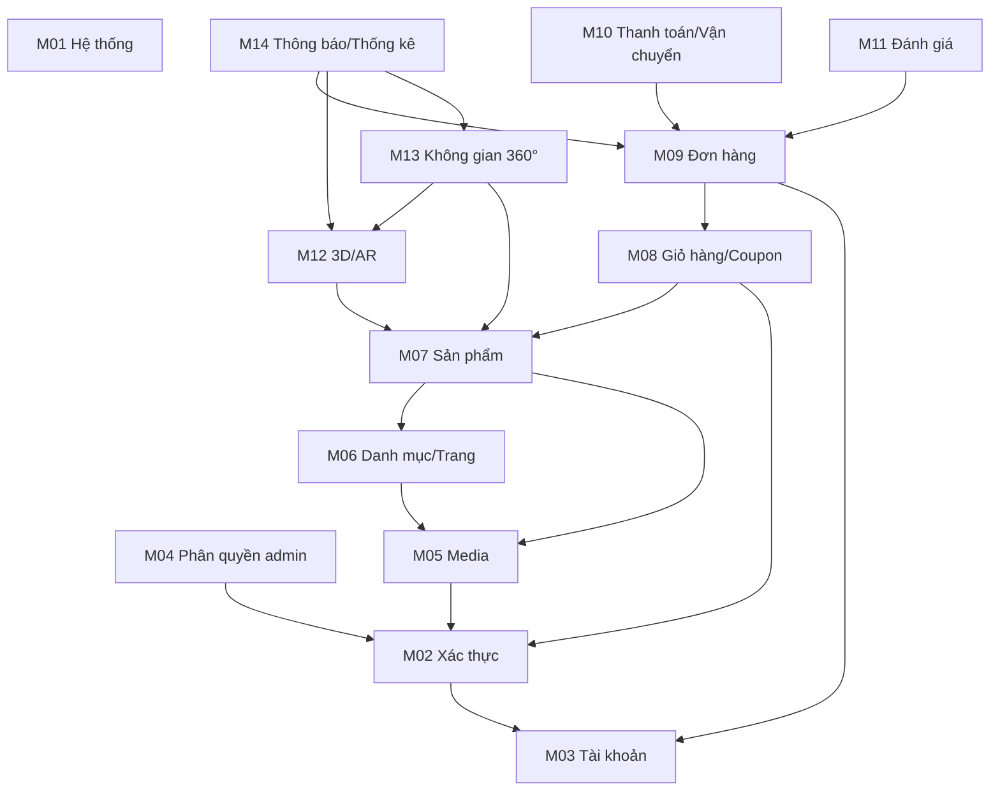

# Báo cáo module và môi trường triển khai

> **Cập nhật 2026-10-09, commit `b30fc75`. Báo cáo này là ảnh chụp ngày 2026-10-08; nội dung cũ được giữ nguyên.** Đã lỗi thời: tóm tắt mục 1 (M05, M12, M13 "thiếu cấu hình", M10 "bị chặn" về hạ tầng: Redis, MinIO, BullMQ, giới hạn upload đều đã xong; M10 chỉ còn chờ tài khoản VNPay sandbox); bảng biến môi trường (mục 5: nay có `REDIS_*`, `S3_*`, `STORAGE_*`, `THROTTLE_*`, `CACHE_*`, `MAIL_TRANSPORT`... xem [ENVIRONMENT.md](ENVIRONMENT.md)); bảng dịch vụ (mục 6: Redis, MinIO đã vào profile mặc định, đang chạy); kết quả lệnh (mục 7: `npm run build` nay qua); việc cần làm (mục 8: gần như đã xong); mâu thuẫn (mục 9); số liệu "76 UC", "141 API" (nay 80 UC với nhóm UC-MOB và 144 endpoint thiết kế; đã cài 6 route). Vẫn còn đúng: danh sách 14 module, hồ sơ module, phụ thuộc và thứ tự triển khai (mục 3, 4); module thứ 15 là Mobile (M15, xem [TIEN_DO.md](TIEN_DO.md)). **Tài liệu hiện hành:** [TIEN_DO.md](TIEN_DO.md), [CONG_NGHE.md](CONG_NGHE.md), [ENVIRONMENT.md](ENVIRONMENT.md), [ENV_SETUP_REPORT.md](ENV_SETUP_REPORT.md), [DECISIONS.md](DECISIONS.md).

Ngày quét: 2026-10-08. Phạm vi: toàn bộ workspace `C:\Users\Dell\XDUDTMDT` (bỏ qua `node_modules`, `.git`, `dist`, `.next`, `.turbo`). Báo cáo chỉ đọc và chạy lệnh kiểm tra; không sửa file nào ngoài file này. Giá trị secret trong `.env` không được ghi lại (chỉ "có / rỗng / không có").

## 1. Tóm tắt

- **Tổng số module nghiệp vụ: 14** (M01–M14), gom từ 76 use case, 141 API, 44 bảng. Ba nguồn (tài liệu, CSDL, code) khớp tổng số khi chia theo bảng ánh xạ ở mục 3.
- **Trạng thái môi trường (backend): ✅ 10 module sẵn sàng, ⚠️ 3 module thiếu cấu hình (M05, M12, M13), ❌ 1 module bị chặn một phần (M10, phần thanh toán online).**
- **Trạng thái code: 0/14 module hoàn thành.** Chỉ có nền tảng dùng chung (response/lỗi, guard, Prisma, health, storage, mail, activity log). Tất cả module nghiệp vụ còn là khung rỗng (toàn dòng chú thích) hoặc chưa có thư mục.
- **Môi trường chung (backend, CSDL, Docker, lint/test/CI): đã hoàn tất.** **Môi trường frontend chưa hoàn tất:** `next build` đang lỗi (hai trang `/products` trùng đường dẫn), chưa có wireframe, thiếu cấu hình Tailwind/PostCSS.
- **3 việc cần làm ngay:** (1) sửa lỗi build web và dựng khung layout/route; (2) chốt cổng thanh toán VNPay sandbox và biến môi trường; (3) bật Redis + hàng đợi và thêm cấu hình giới hạn upload trước khi làm M05/M12/M13.

## 2. Bảng tổng hợp module

Cột "Trạng thái môi trường" áp dụng cho backend; điều kiện frontend chung xem mục 8 (việc #1, #2).

| STT | Module | BE/FE | Số UC | Số API | Số bảng | Trạng thái code | Trạng thái môi trường | Thiếu gì |
| --- | --- | --- | --- | --- | --- | --- | --- | --- |
| M01 | Hệ thống và cấu hình | BE + FE(admin) | 2 | 4 | 2 | Đang làm dở (nền tảng xong, chưa có endpoint settings/logs) | ✅ | Không |
| M02 | Xác thực và phiên | BE + FE | 7 | 8 | 3 | Khung rỗng (`modules/auth`) | ✅ | Giới hạn tần suất (throttler) chưa cài |
| M03 | Tài khoản cá nhân | BE + FE | 7 | 17 | 2 | Khung rỗng (`modules/users`) | ✅ | Không |
| M04 | Người dùng và phân quyền (admin) | BE + FE(admin) | 2 | 7 | 4 | Chưa có | ✅ | Không |
| M05 | Media và lưu trữ tệp | BE + FE(admin) | 1 | 4 | 1 | Khung rỗng (`modules/media`) | ⚠️ | Giới hạn kích thước/MIME upload, thư mục phục vụ ảnh đã thử chưa, chưa có MinIO |
| M06 | Danh mục, thương hiệu, thuộc tính, trang tĩnh | BE + FE | 5 | 18 | 5 | Chưa có | ✅ | Không |
| M07 | Sản phẩm, biến thể, tồn kho | BE + FE | 9 | 19 | 5 | Khung rỗng (`modules/products`) | ✅ | Không |
| M08 | Giỏ hàng và mã giảm giá | BE + FE | 5 | 10 | 4 | Khung rỗng (`modules/cart`) | ✅ | Không |
| M09 | Đơn hàng | BE + FE | 6 | 10 | 3 | Khung rỗng (`modules/orders`) | ✅ | Không |
| M10 | Thanh toán và vận chuyển | BE + FE | 6 | 7 | 2 | Chưa có | ❌ một phần | Tài khoản sandbox VNPay, biến môi trường cổng, URL callback công khai |
| M11 | Đánh giá sản phẩm | BE + FE | 4 | 4 | 1 | Chưa có | ✅ | Không |
| M12 | Mô hình 3D và AR | BE + FE | 10 | 13 | 5 | Khung rỗng (`modules/product-models`, `jobs`) | ⚠️ | Redis/BullMQ chưa bật, giới hạn file GLB/USDZ, chưa có file 3D mẫu |
| M13 | Không gian mẫu 360° | BE + FE | 9 | 16 | 6 | Khung rỗng (`modules/spaces`) | ⚠️ | Ảnh panorama mẫu, giới hạn upload, Redis nếu tính thống kê nền |
| M14 | Thông báo và thống kê quản trị | BE + FE(admin) | 3 | 4 | 1 | Chưa có | ✅ | Không |
| | **Tổng** | | **76** | **141** | **44** | | | |

Kiểm tra tổng: UC 2+7+7+2+1+5+9+5+6+6+4+10+9+3 = 76; API 4+8+17+7+4+18+19+10+10+7+4+13+16+4 = 141; bảng 2+3+2+4+1+5+5+4+3+2+1+5+6+1 = 44. Mỗi bảng chỉ thuộc một module "sở hữu"; các bảng dùng chung được liệt kê ở cột "dùng thêm" của mục 3.

Ngoài 14 module: `apps/mobile` (Android), `modules/ai`, `modules/ar-overlay` (ngoài phạm vi theo `docs/READINESS_REPORT.md` mục M6) và `modules/jobs` (hạ tầng hàng đợi, thuộc M12) không tính là module nghiệp vụ.

## 3. Hồ sơ chi tiết và ánh xạ các cách chia

### 3.1 Cách chia và lý do

- Tài liệu chia use case theo tiền tố: AUTH, ACC, CAT, CART, ORD, PAY, REV, 3D, SPACE, ADM (30 UC quản trị, `docs/DAC_TA_CHUC_NANG_THEO_VAI_TRO.md`), và API theo tiền tố URL (`docs/BAO_CAO_PHAN_TICH_THIET_KE.md` mục 6).
- CSDL chia 7 nhóm (`docs/CAU_TRUC_DB.md`).
- Code chỉ có 11 thư mục `apps/api/src/modules/*`, đều là khung rỗng; thư mục web theo màn hình (shop, auth, admin).
- Chọn chia **theo nghiệp vụ, 14 module**, vì ADM-xx (30 UC) cắt ngang nhiều nghiệp vụ nên phải chia nhỏ theo đối tượng quản trị; mỗi module có ranh giới bảng rõ, kích thước 1–19 API.

| Module | Tiền tố UC | Tiền tố API | Nhóm CSDL (CAU_TRUC_DB) | Thư mục code hiện có |
| --- | --- | --- | --- | --- |
| M01 | ADM-03, ADM-27 | settings, admin/settings, admin/activity-logs | Hệ thống chung | (nền tảng ở `src/activity-log`, `src/config`, `src/health`) |
| M02 | AUTH-01..07 | auth | Người dùng và phân quyền | `modules/auth` |
| M03 | ACC-01..07 | users, addresses, wishlist, notifications | Người dùng và phân quyền, Hệ thống chung | `modules/users` |
| M04 | ADM-01, ADM-02 | admin/users, admin/roles | Người dùng và phân quyền | `modules/users` (dùng chung) |
| M05 | ADM-04 | admin/media | Hệ thống chung | `modules/media` |
| M06 | CAT-05, ADM-05..08 | categories, pages, admin/categories, admin/brands, admin/attributes, admin/pages | Nội dung, Sản phẩm | chưa có |
| M07 | CAT-01..04, CAT-06, ADM-09..12 | products, admin/products, admin/variants, admin/product-images, admin/inventory | Sản phẩm | `modules/products` |
| M08 | CART-01..04, ADM-19 | cart, coupons, admin/coupons | Giỏ hàng và khuyến mãi | `modules/cart` |
| M09 | ORD-01..03, ADM-20..22 | orders, admin/orders | Đơn hàng | `modules/orders` |
| M10 | PAY-01..03, ADM-23..25 | payments, admin/payments, admin/shipments | Đơn hàng | chưa có |
| M11 | REV-01..03, ADM-18 | reviews, admin/reviews | Đánh giá | chưa có |
| M12 | 3D-01..07, ADM-13, ADM-14, ADM-30 | admin/models, ar-snapshots, ar-sessions, admin/ar-snapshots | 3D và AR | `modules/product-models`, `modules/jobs` |
| M13 | SPACE-01..06, ADM-15..17 | spaces, admin/spaces, admin/panoramas, admin/hotspots | Không gian mẫu | `modules/spaces` |
| M14 | ADM-26, ADM-28, ADM-29 | admin/notifications, admin/stats | Hệ thống chung | chưa có |

Ghi chú ánh xạ: số API theo tiền tố URL được đếm từ bảng "Danh sách API" (141 dòng); việc xếp `ar-sessions` (thống kê 3D/AR ẩn danh, UC-3D-07) và `admin/stats` vào M12/M14 là quyết định của báo cáo này.

### 3.2 Hồ sơ từng module

Ký hiệu hạ tầng: PG = PostgreSQL, ST = StorageService, ML = MailService, Q = hàng đợi/Redis. Biến môi trường ghi tên biến, xem mục 5.

**M01 Hệ thống và cấu hình** — Cài đặt website, nhật ký thao tác admin, kiểm tra sức khỏe.
- BE + FE (trang admin). UC: ADM-03, ADM-27 (2). API: 4 (`GET /api/settings`, 2 admin/settings, 1 admin/activity-logs) + `GET /health`.
- Bảng: `settings`, `activity_logs`. Phụ thuộc module: M04 (quyền admin). Hạ tầng: PG.
- Env: `DATABASE_URL`, `SWAGGER_ENABLED`. Danh sách whitelist key settings đã chốt ở `docs/DAC_TA_CHUC_NANG_THEO_VAI_TRO.md`.
- Code: **Đang làm dở.** Đã có `GET /health` (`apps/api/src/health/health.controller.ts`), `ActivityLogService` (`src/activity-log/activity-log.service.ts`), `AppConfig`; chưa có endpoint settings/logs. Test: health e2e (`apps/api/test/health.e2e-spec.ts`).

**M02 Xác thực và phiên** — Đăng ký, đăng nhập, refresh, đăng xuất, quên/đặt lại mật khẩu, xác thực email.
- BE + FE. UC: AUTH-01..07 (7). API: 8 (`auth/*`).
- Bảng: `users`, `password_resets`, `user_sessions` (dùng thêm `user_roles`, `roles`). Phụ thuộc: M04 (vai trò mặc định do trigger). Hạ tầng: PG, ML.
- Env: `JWT_ACCESS_SECRET`, `JWT_REFRESH_SECRET`, `JWT_ACCESS_EXPIRES_IN`, `JWT_REFRESH_EXPIRES_IN`, `MAIL_*`, `APP_URL`.
- Code: **Khung rỗng** (`apps/api/src/modules/auth/*`, 0 dòng mã). Guard JWT toàn cục và `JwtModule` đã có ở nền tảng (`src/common/guards/jwt-auth.guard.ts`). Chưa có test.

**M03 Tài khoản cá nhân** — Hồ sơ, đổi mật khẩu, phiên, sổ địa chỉ, thông báo, yêu thích, xóa tài khoản.
- BE + FE. UC: ACC-01..07 (7). API: 17 (users 6, addresses 5, wishlist 3, notifications 3).
- Bảng: `addresses`, `wishlists` (dùng thêm `users`, `user_sessions`, `notifications`, `media`). Phụ thuộc: M02, M05 (avatar), M07 (yêu thích). Hạ tầng: PG, ST.
- Env: `STORAGE_*`. Code: **Khung rỗng** (`modules/users`).

**M04 Người dùng và phân quyền (admin)** — Danh sách, khóa/mở khóa người dùng, gán vai trò.
- BE + FE(admin). UC: ADM-01, ADM-02 (2). API: 7 (admin/users 6, admin/roles 1).
- Bảng: `roles`, `permissions`, `role_permissions`, `user_roles` (dùng thêm `users`). Phụ thuộc: M02. Hạ tầng: PG.
- Code: **Chưa có** controller admin (chỉ có seed: 2 vai trò, 6 quyền, `apps/api/prisma/seed.ts`).

**M05 Media và lưu trữ tệp** — Tải lên, liệt kê, xóa tệp dùng chung.
- BE + FE(admin). UC: ADM-04 (1). API: 4. Bảng: `media`. Phụ thuộc: M02. Hạ tầng: PG, ST.
- Env: `STORAGE_DRIVER`, `STORAGE_LOCAL_DIR`, `STORAGE_PUBLIC_URL`; tương lai MinIO: `S3_*` (có trong `.env`, chưa được code đọc).
- Code: **Khung rỗng** (`modules/media`). Đã có `LocalStorageService` + route `/uploads` (`src/storage/*`, `src/main.ts`), chưa kiểm thử tải tệp thật. Chưa có giới hạn kích thước/MIME (NFR đề xuất 5 MB phục vụ, 100 MB upload GLB/USDZ).

**M06 Danh mục, thương hiệu, thuộc tính, trang tĩnh** — Dữ liệu danh mục sản phẩm và nội dung tĩnh.
- BE + FE. UC: CAT-05, ADM-05..08 (5). API: 18 (categories 1, pages 1, admin 16). Bảng: `categories`, `brands`, `attributes`, `attribute_values`, `pages`. Phụ thuộc: M05 (logo/ảnh). Hạ tầng: PG, ST.
- Code: **Chưa có** thư mục module.

**M07 Sản phẩm, biến thể, tồn kho** — Duyệt, tìm kiếm (không dấu), chi tiết, quản trị sản phẩm/biến thể/ảnh/kho.
- BE + FE. UC: CAT-01..04, CAT-06, ADM-09..12 (9). API: 19. Bảng: `products`, `product_variants`, `variant_attribute_values`, `product_images`, `inventory_movements`. Phụ thuộc: M06, M05. Hạ tầng: PG (extension `unaccent`, `pg_trgm` đã có trong migration), ST.
- Code: **Khung rỗng** (`modules/products`, kể cả `dto/`); web có trang `products`, `products/[id]` chỉ `return null`.

**M08 Giỏ hàng và mã giảm giá** — Giỏ theo biến thể, xem trước mã giảm giá, quản trị coupon.
- BE + FE. UC: CART-01..04, ADM-19 (5). API: 10. Bảng: `carts`, `cart_items`, `coupons`, `coupon_usages`. Phụ thuộc: M02, M07. Hạ tầng: PG.
- Code: **Khung rỗng** (`modules/cart`); web: `cart/page.tsx`, `store/cartStore.ts` rỗng.

**M09 Đơn hàng** — Đặt hàng (transaction trừ kho), theo dõi, hủy, quản trị trạng thái.
- BE + FE. UC: ORD-01..03, ADM-20..22 (6). API: 10. Bảng: `orders`, `order_items`, `order_status_history` (trigger ghi lịch sử). Phụ thuộc: M08, M03 (địa chỉ), M07, M02. Hạ tầng: PG, ML (email xác nhận).
- Code: **Khung rỗng** (`modules/orders`); web: `checkout/page.tsx` rỗng.

**M10 Thanh toán và vận chuyển** — Thanh toán online (VNPay), IPN, thanh toán lại, xác nhận chuyển khoản, hoàn tiền thủ công, vận chuyển.
- BE + FE. UC: PAY-01..03, ADM-23..25 (6). API: 7. Bảng: `payments`, `shipments`. Phụ thuộc: M09. Hạ tầng: PG, **cổng thanh toán VNPay**, URL công khai cho IPN. Vận chuyển do admin nhập tay (ADM-25), chưa tích hợp GHN/GHTK.
- Env cần (chưa tồn tại ở đâu): mã merchant, khóa băm, URL cổng, URL trả về, URL IPN.
- Code: **Chưa có.**

**M11 Đánh giá sản phẩm** — Xem, viết (đã mua và đã xác thực email), sửa/xóa, duyệt.
- BE + FE. UC: REV-01..03, ADM-18 (4). API: 4. Bảng: `reviews` (trigger cập nhật điểm trung bình). Phụ thuộc: M09, M07, M02. Hạ tầng: PG.
- Code: **Chưa có.**

**M12 Mô hình 3D và AR** — Tải/quản lý GLB/USDZ, biến thể chất liệu, xem 3D/AR, chụp và chia sẻ ảnh AR, thống kê phiên.
- BE + FE. UC: 3D-01..07, ADM-13, ADM-14, ADM-30 (10). API: 13. Bảng: `product_3d_models`, `model_files`, `model_material_variants`, `ar_sessions`, `ar_snapshots`. Phụ thuộc: M07, M05. Hạ tầng: PG, ST (tệp lớn), Q (job tối ưu mô hình, nén ảnh: `modules/jobs/processors/*` còn khung).
- Env: `STORAGE_*`, `REDIS_HOST`, `REDIS_PORT` (có trong `.env`, không có trong `.env.example`, không được validate/đọc).
- Code: **Khung rỗng** (`modules/product-models`, `modules/jobs`); web: `components/viewer/*` rỗng.

**M13 Không gian mẫu 360°** — Duyệt, xem panorama, hotspot, đặt sản phẩm vào phòng, lưu yêu thích, ghi lượt xem.
- BE + FE. UC: SPACE-01..06, ADM-15..17 (9). API: 16. Bảng: `spaces`, `space_panoramas`, `space_hotspots`, `space_product_placements`, `space_bookmarks`, `space_views`. Phụ thuộc: M07, M05, M12 (placement dùng mô hình 3D). Hạ tầng: PG, ST.
- Code: **Khung rỗng** (`modules/spaces`); web: `spaces/*`, `SpacePanorama.tsx` rỗng.

**M14 Thông báo và thống kê quản trị** — Gửi thông báo cho người dùng, bảng điều khiển thống kê, phễu không gian mẫu và AR.
- BE + FE(admin). UC: ADM-26, ADM-28, ADM-29 (3). API: 4. Bảng: `notifications` (dùng thêm bảng của M09, M12, M13 để tổng hợp). Phụ thuộc: M02, M09, M12, M13. Hạ tầng: PG.
- Code: **Chưa có**; web: `(admin)/dashboard/page.tsx` rỗng.

## 4. Sơ đồ phụ thuộc và thứ tự triển khai

Thứ tự đề xuất (cùng đợt có thể làm song song):
1. M04 + M02 (xác thực trước vì guard nền đã sẵn) và M01.
2. M05, M03.
3. M06, rồi M07.
4. M08, M12 (song song nếu có 2 người; M12 cần Redis và file mẫu 3D).
5. M09, M13.
6. M10, M11.
7. M14 (cuối, vì tổng hợp dữ liệu từ nhiều module).

Khớp với đề xuất trong `docs/READINESS_REPORT.md` mục 7.

## 5. Biến môi trường

"Có validate" = có trong schema zod `apps/api/src/config/env.validation.ts`. "Đọc bởi code" = có chỗ dùng `process.env`/`config.get`. Cột `.env`: có / rỗng / không có (chỉ so tên, không xem giá trị).

| Biến | Module dùng | Trong `.env.example` | Trong `.env` | Validate | Ghi chú |
| --- | --- | --- | --- | --- | --- |
| `DATABASE_URL` | tất cả | có | có | có (bắt buộc) | Đọc bởi Prisma, seed |
| `POSTGRES_PORT` | hạ tầng | có | có | không | Chỉ docker-compose |
| `TEST_DATABASE_URL` | test | có | không có | không | Mặc định trong `test/setup-env.ts` |
| `POSTGRES_TEST_PORT` | test | có | không có | không | Mặc định 5433 trong compose |
| `NODE_ENV` | tất cả | có | không có | có (mặc định development) | |
| `PORT` | tất cả | có | có | có | |
| `API_PORT` | hạ tầng | có | có | không | Chỉ docker-compose |
| `CORS_ORIGINS` | tất cả | có | không có | có (mặc định) | Đọc ở `app.setup.ts` |
| `APP_URL` | M02, M09 (link trong email) | có | không có | có (mặc định) | Chưa có chỗ đọc |
| `SWAGGER_ENABLED` | M01 | có | không có | có (mặc định true) | |
| `JWT_ACCESS_SECRET` | M02 | có | có | có (≥16 ký tự) | Đã đọc ở guard |
| `JWT_REFRESH_SECRET` | M02 | có | có | có (≥16 ký tự) | Chưa có chỗ đọc (M02 sẽ dùng) |
| `JWT_ACCESS_EXPIRES_IN` | M02 | có | có | có | Chưa có chỗ đọc |
| `JWT_REFRESH_EXPIRES_IN` | M02 | có | có | có | Chưa có chỗ đọc |
| `STORAGE_DRIVER` | M05, M12, M13 | có | không có | có (chỉ `local`) | MinIO chưa hỗ trợ |
| `STORAGE_LOCAL_DIR` | M05, M12, M13 | có | không có | có | |
| `STORAGE_PUBLIC_URL` | M05, M12, M13 | có | không có | có | |
| `MAIL_HOST`, `MAIL_PORT`, `MAIL_FROM` | M02, M09 | có | không có | có | Mặc định trỏ Mailpit |
| `MAILPIT_SMTP_PORT`, `MAILPIT_UI_PORT` | hạ tầng | có | không có | không | Chỉ docker-compose |
| `SEED_SAMPLE` | seed | có | có | không | Đọc bởi `seed.ts` |
| `SEED_ADMIN_EMAIL`, `SEED_ADMIN_PASSWORD`, `SEED_SAMPLE_USER_PASSWORD` | seed | có | không có | không | Có mặc định cho dev; production bắt buộc đặt mật khẩu |
| `NEXT_PUBLIC_API_URL` | FE tất cả | có | có | không | Đọc ở `apps/web/src/services/api-client.ts` |
| `DOCKER_DATABASE_URL` | hạ tầng | có (chú thích) | có | không | Chỉ compose |
| `REDIS_HOST`, `REDIS_PORT` | M12 (hàng đợi) | chú thích | có | không | Code chưa đọc; **thừa so với code hiện tại, cần cho M12** |
| `S3_ENDPOINT`, `S3_REGION`, `S3_BUCKET`, `S3_ACCESS_KEY`, `S3_SECRET_KEY` | M05, M12 (MinIO sau này) | chú thích | có | không | Code chưa đọc |
| `AI_PROVIDER`, `OLLAMA_BASE_URL`, `OPENAI_API_KEY` | `modules/ai` (ngoài phạm vi) | chú thích | có (`OPENAI_API_KEY` rỗng) | không | Thừa |
| Biến VNPay (merchant, khóa băm, URL) | M10 | **không có** | **không có** | không | **Thiếu hoàn toàn** |
| Biến upload (kích thước tối đa, MIME) | M05, M12, M13 | **không có** | **không có** | không | **Thiếu** |
| Biến vận chuyển (GHN/GHTK) | M10 | không có | không có | không | Không cần nếu giữ ADM-25 nhập tay |

Phát hiện thêm: `apps/api/.env` là bản sao `.env` gốc (Prisma CLI đọc file này), dễ lệch nhau; `apps/web` không có `.env` riêng và `NEXT_PUBLIC_API_URL` không được validate.

## 6. Dịch vụ hạ tầng

| Dịch vụ | Module cần | Trong docker-compose | Đang chạy (2026-10-08) | Ghi chú |
| --- | --- | --- | --- | --- |
| PostgreSQL 16 | tất cả | có (`postgres`, healthcheck, volume `postgres-data`) | Có, `healthy` (container `xdudtmdt-postgres-1`) | Container cũ tạo từ định nghĩa trước; DB dev là `aurelia_dev` |
| PostgreSQL test | e2e | có (profile `test`) | Có, `healthy` (cổng 5433, tmpfs) | |
| Mailpit | M02, M09 | có (healthcheck `readyz`) | Có, `healthy` | UI cổng 8025 |
| API (NestJS) | tất cả | có | Có, `healthy` (cổng host 4001) | Cổng 4000 máy này đang bị dự án khác chiếm |
| Redis | M12 (job), có thể M02 (rate limit) | có, profile `later` | Có (`xdudtmdt-redis-1`, tạo từ định nghĩa cũ, cổng host 61379) | Không nằm trong `up` mặc định; code chưa dùng |
| MinIO | M05, M12, M13 (khi đổi driver) | có, profile `later` | Không | Chưa có `MinioStorageService` |
| Worker (BullMQ) | M12 | có, profile `later` | Không | Dockerfile.worker còn node:20, không COPY lockfile |
| Web (Next.js) | FE | có, profile `later` | Không | Dockerfile.web còn node:20, không COPY lockfile; `next build` đang lỗi |
| Cổng thanh toán VNPay | M10 | không (dịch vụ ngoài) | Không | Cần tài khoản sandbox và URL công khai (tunnel) cho IPN |
| Đơn vị vận chuyển | M10 | không | Không | Chưa tích hợp, ADM-25 nhập tay |
| CDN | M12, M13 | không | Không | Chưa cần ở dev |

## 7. Kết quả lệnh kiểm tra

| Lệnh | Kết quả |
| --- | --- |
| `node -v` / `npm -v` | v24.20.0 / 11.19.0. Không có `engines` hay `.nvmrc`; `packageManager` ghi `npm@10.0.0`; Docker/CI dùng Node 22 |
| `docker -v` / `docker compose version` | Docker 29.7.2 / Compose v5.4.0 |
| `node_modules` | Đã có (649 mục ở gốc); không cài thêm |
| `docker compose config -q` | Thành công |
| `docker compose ps` | api, mailpit, postgres, postgres-test chạy và `healthy`; redis chạy (không có healthcheck) |
| `prisma validate` | Thành công ("The schema is valid"), kèm cảnh báo `onDelete: SetNull` trên khóa ngoại bắt buộc (không chặn) |
| `prisma migrate status` | "Database schema is up to date!" (2 migration, DB `aurelia_dev`) |
| `npm run types:check` | Thành công: 18 enum, 44 entity khớp `schema.prisma` |
| `npm run lint` | Thành công, 0 cảnh báo |
| `npm run typecheck` | Thành công, 4 tác vụ (api, web, shared-types) |
| `npm test` | Thành công, 7/7 unit test (bộ lọc lỗi, validation) |
| `npm run test:e2e` | Thành công, 7/7 (health, 404, validation, guard JWT, roles), DB test cổng 5433 |
| `npm run build` | **Thất bại ở `apps/web`**: "You cannot have two parallel pages that resolve to the same path: `/(admin)/products/page` và `/(shop)/products/page`". Thêm cảnh báo `Found lockfile missing swc dependencies... ENOWORKSPACES` (Next 14 vá lockfile bằng npm không hỗ trợ workspace). Phần `shared-types` và `api` build thành công |
| `GET /health` (API đang chạy, cổng 4001) | `{"success":true,"data":{"status":"ok",...,"checks":{"database":"up"}}}` |

## 8. Việc cần làm để hoàn tất môi trường

| STT | Việc | Module mở khóa | File cần sửa | Mức độ | Ước lượng (giờ) |
| --- | --- | --- | --- | --- | --- |
| 1 | Sửa xung đột route `(admin)/products` với `(shop)/products` (ví dụ đổi admin thành `/admin/products` bằng thư mục `admin/`), cho `next build` qua | Mọi module phần FE | `apps/web/src/app/(admin)/**` | Chặn (với FE) | 1 |
| 2 | Chốt VNPay: đăng ký sandbox, thêm biến vào schema env và `.env.example`, quyết định cách mở URL IPN ở dev | M10 | `apps/api/src/config/env.validation.ts`, `.env.example`, `docs/` | Chặn (với M10) | 3 + thời gian chờ tài khoản |
| 3 | Bật Redis mặc định (hoặc khi làm M12) và thêm biến `REDIS_*` vào schema env và `.env.example`; nối BullMQ vào `modules/jobs` | M12, M13 (thống kê nền) | `docker-compose.yml`, `env.validation.ts`, `.env.example`, `modules/jobs/jobs.module.ts` | Cao | 3 |
| 4 | Thêm cấu hình giới hạn upload (kích thước, MIME whitelist), dùng multer; kiểm thử tải tệp thật qua `/uploads` | M05, M12, M13 | `env.validation.ts`, `.env.example`, `modules/media/*` | Cao | 3 |
| 5 | Chuẩn bị dữ liệu mẫu: vài file GLB/USDZ và ảnh panorama | M12, M13 | `apps/api/prisma/seed.ts`, thư mục assets | Cao | 3 |
| 6 | Cài giới hạn tần suất (`@nestjs/throttler`) cho đăng nhập/quên mật khẩu | M02 | `package.json`, `app.module.ts` | Trung bình | 2 |
| 7 | Làm wireframe các màn hình chính (readiness M-open), cấu hình Tailwind/PostCSS đúng chỗ | FE tất cả | `apps/web/postcss.config.js`, `apps/web/tailwind.config.ts` | Cao | 8 |
| 8 | Cập nhật `Dockerfile.web`, `Dockerfile.worker` (Node 22, COPY lockfile, `npm ci`) và sửa `next build` trong Docker (lỗi ENOWORKSPACES) | Triển khai web/worker | `infra/docker/Dockerfile.web`, `Dockerfile.worker` | Trung bình | 3 |
| 9 | Thêm `engines` (Node ≥22), `.nvmrc`, sửa `packageManager` cho khớp npm thực dùng | Tất cả | `package.json`, `.nvmrc` | Trung bình | 0.5 |
| 10 | Dùng chung một file `.env`: bỏ bản sao `apps/api/.env` (cấu hình `dotenv-cli` hoặc `prisma` đọc biến từ gốc) | Tất cả | `package.json` các cấp, README | Thấp | 1 |
| 11 | Thêm `MinioStorageService` khi cần chuyển driver; thêm giá trị `minio` vào `STORAGE_DRIVER` | M05, M12, M13 | `src/storage/*`, `env.validation.ts` | Thấp | 4 |
| 12 | Validate `NEXT_PUBLIC_API_URL` cho web và chuyển route web từ `[id]` sang `[slug]` | FE M06, M07, M13 | `apps/web/src/app/(shop)/**` | Thấp | 1 |
| 13 | Dọn thư mục `.github/modernize/java-upgrade` (công cụ không liên quan) | CI | `.github/modernize/` | Thấp | 0.2 |
| 14 | Viết `docs/DECISIONS.md` gom các quyết định đã chốt (hiện nằm rải ở `DAC_TA_CHUC_NANG_THEO_VAI_TRO.md` cuối file) | Tất cả | `docs/DECISIONS.md` | Thấp | 1 |

Tổng ước lượng: khoảng 33 giờ, chưa tính thời gian chờ tài khoản VNPay.

## 9. Mâu thuẫn giữa tài liệu, CSDL và code

| # | Mô tả | Nguồn A | Nguồn B | Mức |
| --- | --- | --- | --- | --- |
| 1 | Hai trang `/products` trùng đường dẫn khiến web không build được | `apps/web/src/app/(admin)/products/page.tsx` | `apps/web/src/app/(shop)/products/page.tsx` | Cao |
| 2 | Tài liệu và API dùng slug cho đường dẫn công khai, web dùng `[id]` | `docs/DAC_TA_CHUC_NANG_THEO_VAI_TRO.md` (quyết định #12) | `apps/web/src/app/(shop)/products/[id]`, `spaces/[id]` | Trung bình |
| 3 | Tài liệu xếp `ai`, `ar-overlay`, `apps/mobile` ngoài phạm vi, nhưng repo vẫn có thư mục (khung rỗng) | `docs/READINESS_REPORT.md` mục M6 | `apps/api/src/modules/ai`, `ar-overlay`, `apps/mobile` | Thấp |
| 4 | Sơ đồ và đặc tả cũ còn ghi `limit=`, quy ước hiện hành là `pageSize` | `docs/DAC_TA_CHUC_NANG_THEO_VAI_TRO.md` dòng 658, 676, 694; sơ đồ trong `BAO_CAO_PHAN_TICH_THIET_KE.md` | `docs/API_CONVENTIONS.md` mục 6 | Thấp |
| 5 | Thư mục code gộp `users` cho cả M03 và M04, trong khi `addresses`, `wishlist`, `notifications` (có API riêng) chưa có thư mục module | `apps/api/src/modules/users` | `docs/BAO_CAO_PHAN_TICH_THIET_KE.md` mục 6–7 (controller riêng cho từng nhóm) | Thấp |
| 6 | Compose/`.env.example` hiện chỉ cấu hình storage `local`, tài liệu phần 3D/AR giả định tệp lớn và xử lý nền (MinIO + BullMQ) | `docs/DAC_TA_CHUC_NANG_THEO_VAI_TRO.md` (UC-ADM-13) | `docker-compose.yml` (profile `later`), `env.validation.ts` | Trung bình |
| 7 | Hai container (`redis`, `postgres`) đang chạy tạo từ định nghĩa compose cũ nên khác cấu hình hiện tại (redis cổng 61379, không healthcheck cho postgres) | `docker ps` | `docker-compose.yml` | Thấp |
| 8 | `.env` có biến `S3_*`, `REDIS_*`, `AI_*` mà `.env.example` đã bỏ hoặc chú thích và code không đọc | `.env` | `.env.example`, `env.validation.ts` | Thấp |
| 9 | `packageManager` ghi `npm@10.0.0`, máy dùng npm 11.19; Node máy 24, CI/Docker 22; README ghi Node 22 trở lên | `package.json` | `node -v`, `.github/workflows/ci.yml` | Thấp |
| 10 | Tài liệu nghiệp vụ cũ nói "một người dùng có nhiều vai trò", quy tắc hiện hành chỉ có hai vai trò và cho phép chồng vai trò qua `user_roles` | `docs/READINESS_REPORT.md` M5 | `schema.prisma` (`UserRole`) | Thấp |

Đối chiếu số lượng khớp nhau: 44 bảng (`schema.prisma`, `docs/CAU_TRUC_DB.md`), 76 UC, 141 API, 18 enum; kiểu dùng chung đã khớp CSDL (`docs/SHARED_TYPES_SYNC.md`).

## 10. Phụ lục

File đã đọc hoặc quét:
- Tài liệu: `docs/DAC_TA_CHUC_NANG_THEO_VAI_TRO.md` (mục UC và quyết định), `docs/BAO_CAO_PHAN_TICH_THIET_KE.md` (mục 6, 7, 9), `docs/CAU_TRUC_DB.md`, `docs/READINESS_REPORT.md`, `docs/API_CONVENTIONS.md`, `docs/SHARED_TYPES_SYNC.md`, `docs/QUY_UOC_CODE_DB.md`.
- CSDL: `apps/api/prisma/schema.prisma`, `apps/api/prisma/migrations/*`, `apps/api/prisma/seed.ts`, `database/*`.
- Backend: toàn bộ `apps/api/src/**`, `apps/api/test/**`, `apps/api/package.json`, `tsconfig*.json`, `nest-cli.json`, `jest*.js`.
- Frontend: `apps/web/src/**` (danh sách file và nội dung các trang mẫu), `apps/web/package.json`, `tsconfig.json`, `next.config.js`.
- Packages và cấu hình: `packages/shared-types/**`, `package.json` gốc, `turbo.json`, `.eslintrc.cjs`, `.prettierrc.json`, `commitlint.config.cjs`, `.lintstagedrc.json`, `.husky/*`, `.github/workflows/ci.yml`, `docker-compose.yml`, `infra/docker/Dockerfile.*`, `.env.example`.
- `.env` và `apps/api/.env`: chỉ đọc tên biến và trạng thái rỗng/có giá trị.

Không đọc được hoặc không áp dụng: `docs/DECISIONS.md` (không tồn tại); `apps/mobile/**` (Android, ngoài phạm vi, chỉ xác nhận có tồn tại); ảnh sơ đồ trong `docs/diagrams/**` (không phân tích nội dung ảnh); `.qodo/` và `.github/modernize/java-upgrade` (công cụ không liên quan).
