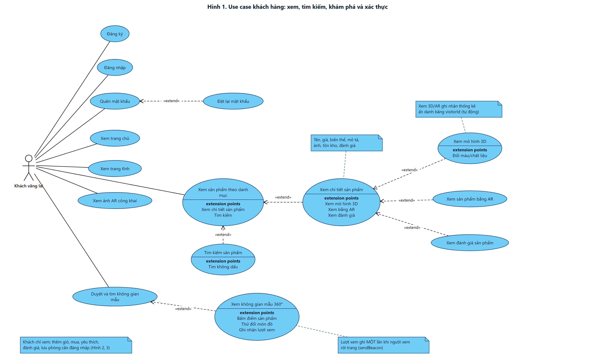
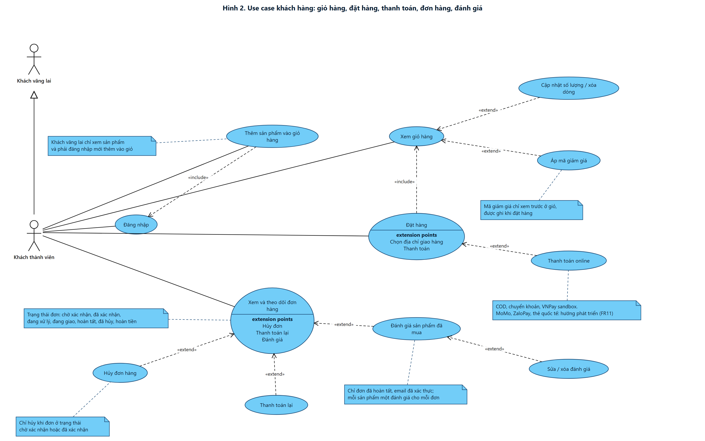
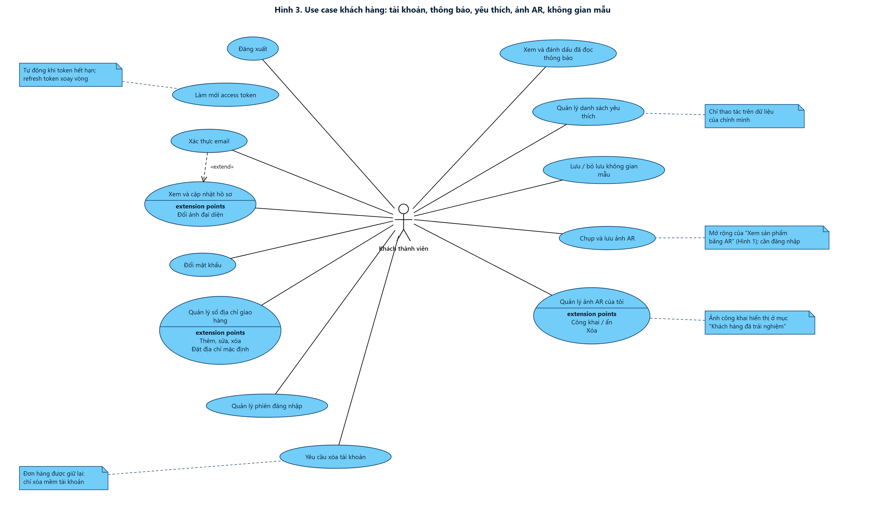
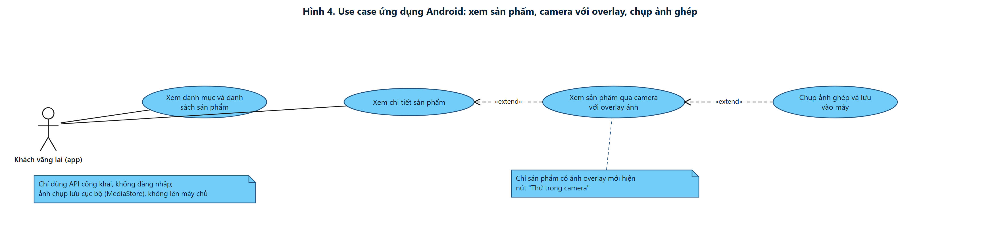

# Tổng hợp use case khách hàng

Aurelia Living: website thương mại điện tử nội thất (mô hình B2C) tích hợp xem 3D, AR và không gian mẫu 360°.

Tài liệu tổng hợp **đầy đủ 49 use case phía khách hàng** (45 trên website và 4 trên ứng dụng Android, nhóm UC-MOB), trình bày theo kiểu sơ đồ use case UML (tác nhân, use case dạng ellipse, `extension points`, ghi chú, quan hệ `«extend»`, `«include»`, kế thừa tác nhân). Mã use case khớp với [DAC_TA_CHUC_NANG_THEO_VAI_TRO.md](DAC_TA_CHUC_NANG_THEO_VAI_TRO.md) và [BAO_CAO_PHAN_TICH_THIET_KE.md](BAO_CAO_PHAN_TICH_THIET_KE.md).

## 1. Tác nhân

| Tác nhân | Mô tả |
| --- | --- |
| **Khách vãng lai** | Chưa đăng nhập, không có tài khoản lưu trong hệ thống. Chỉ xem: trang chủ, danh mục, tìm kiếm, chi tiết sản phẩm, 3D/AR, không gian mẫu 360°, trang tĩnh, đánh giá đã duyệt, ảnh AR công khai. Được đăng ký, đăng nhập, quên mật khẩu. Lượt xem 3D/AR và không gian mẫu được ghi ẩn danh bằng `visitorId` |
| **Khách thành viên** (user) | Đã đăng nhập. **Kế thừa mọi quyền của khách vãng lai** (trừ Đăng ký) và có thêm: hồ sơ, sổ địa chỉ, giỏ hàng, áp mã giảm giá, đặt hàng, thanh toán, theo dõi và hủy đơn, đánh giá, yêu thích, ảnh AR, lưu không gian mẫu, thông báo. Chỉ thao tác trên dữ liệu của chính mình |

Ký hiệu trong sơ đồ: ellipse = use case; ô có dòng **extension points** = use case có các chức năng mở rộng; mũi tên đứt `«extend»` đi từ use case mở rộng tới use case gốc; mũi tên đứt `«include»` đi từ use case gọi tới use case được gọi (luôn thực hiện); mũi tên rỗng giữa hai tác nhân = kế thừa; ô gấp góc = ghi chú; ưu tiên BB = Bắt buộc, NC = Nên có, MR = Mở rộng.

## 2. Sơ đồ

### Hình 1. Xem, tìm kiếm, khám phá và xác thực (21 use case của Khách vãng lai)

### Hình 2. Giỏ hàng, đặt hàng, thanh toán, đơn hàng, đánh giá (11 use case của Khách thành viên)

### Hình 3. Tài khoản, thông báo, yêu thích, ảnh AR, không gian mẫu (13 use case của Khách thành viên)

### Hình 4. Ứng dụng Android (4 use case của Khách vãng lai dùng app)

File ảnh PNG và SVG (phóng to không vỡ) nằm trong `docs/diagrams/khach-hang/`.

## 3. Danh sách đầy đủ 49 use case

| STT | Mã | Use case | Tác nhân | Ưu tiên | Hình | Hiển thị trong hình |
| --- | --- | --- | --- | --- | --- | --- |
| 1 | UC-AUTH-01 | Đăng ký tài khoản | Khách vãng lai | BB | 1 | Ellipse "Đăng ký" |
| 2 | UC-AUTH-02 | Đăng nhập | Khách vãng lai | BB | 1, 2 | Ellipse "Đăng nhập"; Hình 2 là đích của `«include»` |
| 3 | UC-AUTH-05 | Quên mật khẩu (yêu cầu đặt lại) | Khách vãng lai | BB | 1 | Ellipse "Quên mật khẩu" |
| 4 | UC-AUTH-06 | Đặt lại mật khẩu | Khách vãng lai | BB | 1 | Ellipse "Đặt lại mật khẩu" (`«extend»` Quên mật khẩu) |
| 5 | UC-CAT-01 | Xem trang chủ | Khách vãng lai | BB | 1 | Ellipse "Xem trang chủ" |
| 6 | UC-CAT-02 | Duyệt sản phẩm theo danh mục | Khách vãng lai | BB | 1 | Ellipse "Xem sản phẩm theo danh mục" |
| 7 | UC-CAT-03 | Tìm kiếm sản phẩm | Khách vãng lai | BB | 1 | Ellipse "Tìm kiếm sản phẩm" (`«extend»` Xem sản phẩm) |
| 8 | UC-CAT-04 | Xem chi tiết sản phẩm | Khách vãng lai | BB | 1 | Ellipse "Xem chi tiết sản phẩm" (`«extend»` Xem sản phẩm) |
| 9 | UC-CAT-05 | Xem trang tĩnh | Khách vãng lai | NC | 1 | Ellipse "Xem trang tĩnh" |
| 10 | UC-CAT-06 | Tìm kiếm sản phẩm không dấu | Khách vãng lai | NC | 1 | Extension point "Tìm không dấu" của Tìm kiếm |
| 11 | UC-REV-01 | Xem đánh giá sản phẩm | Khách vãng lai | NC | 1 | Ellipse "Xem đánh giá sản phẩm" (`«extend»` Chi tiết) |
| 12 | UC-3D-01 | Xem mô hình 3D của sản phẩm | Khách vãng lai | NC | 1 | Ellipse "Xem mô hình 3D" (`«extend»` Chi tiết) |
| 13 | UC-3D-02 | Xem sản phẩm bằng AR | Khách vãng lai | NC | 1 | Ellipse "Xem sản phẩm bằng AR" (`«extend»` Chi tiết) |
| 14 | UC-3D-03 | Đổi màu/chất liệu trên mô hình 3D | Khách vãng lai | MR | 1 | Extension point "Đổi màu/chất liệu" của Xem mô hình 3D |
| 15 | UC-3D-06 | Xem ảnh AR công khai "Khách hàng đã trải nghiệm" | Khách vãng lai | NC | 1 | Ellipse "Xem ảnh AR công khai" |
| 16 | UC-3D-07 | Ghi nhận thống kê 3D/AR ẩn danh (tự động) | Hệ thống | MR | 1 | Ghi chú "ghi nhận thống kê ẩn danh bằng visitorId" |
| 17 | UC-SPACE-01 | Duyệt và tìm kiếm không gian mẫu | Khách vãng lai | NC | 1 | Ellipse "Duyệt và tìm không gian mẫu" |
| 18 | UC-SPACE-02 | Xem không gian mẫu 360° | Khách vãng lai | NC | 1 | Ellipse "Xem không gian mẫu 360°" (`«extend»` Duyệt) |
| 19 | UC-SPACE-03 | Bấm điểm sản phẩm trong phòng mẫu | Khách vãng lai | NC | 1 | Extension point "Bấm điểm sản phẩm" |
| 20 | UC-SPACE-05 | Thử đổi món đồ trong phòng mẫu | Khách vãng lai | MR | 1 | Extension point "Thử đổi món đồ" |
| 21 | UC-SPACE-06 | Ghi nhận lượt xem không gian mẫu (một lần khi rời trang) | Hệ thống | MR | 1 | Extension point "Ghi nhận lượt xem" + ghi chú sendBeacon |
| 22 | UC-CART-01 | Thêm sản phẩm vào giỏ hàng | Khách thành viên | BB | 2 | Ellipse "Thêm sản phẩm vào giỏ hàng" (`«include»` Đăng nhập) |
| 23 | UC-CART-02 | Xem giỏ hàng | Khách thành viên | BB | 2 | Ellipse "Xem giỏ hàng" |
| 24 | UC-CART-03 | Cập nhật số lượng / xóa dòng trong giỏ | Khách thành viên | BB | 2 | Ellipse "Cập nhật số lượng / xóa dòng" (`«extend»` Xem giỏ) |
| 25 | UC-CART-04 | Áp mã giảm giá (xem trước) | Khách thành viên | NC | 2 | Ellipse "Áp mã giảm giá" (`«extend»` Xem giỏ) |
| 26 | UC-ORD-01 | Đặt hàng | Khách thành viên | BB | 2 | Ellipse "Đặt hàng" (`«include»` Xem giỏ hàng) |
| 27 | UC-PAY-01 | Thanh toán đơn hàng online | Khách thành viên | BB | 2 | Ellipse "Thanh toán online" (`«extend»` Đặt hàng) |
| 28 | UC-ORD-02 | Xem và theo dõi đơn hàng của tôi | Khách thành viên | BB | 2 | Ellipse "Xem và theo dõi đơn hàng" |
| 29 | UC-ORD-03 | Hủy đơn hàng | Khách thành viên | BB | 2 | Ellipse "Hủy đơn hàng" (`«extend»` Xem đơn) |
| 30 | UC-PAY-03 | Thanh toán lại đơn chưa thanh toán | Khách thành viên | NC | 2 | Ellipse "Thanh toán lại" (`«extend»` Xem đơn) |
| 31 | UC-REV-02 | Đánh giá sản phẩm đã mua | Khách thành viên | NC | 2 | Ellipse "Đánh giá sản phẩm đã mua" (`«extend»` Xem đơn) |
| 32 | UC-REV-03 | Sửa/xóa đánh giá của mình | Khách thành viên | MR | 2 | Ellipse "Sửa / xóa đánh giá" (`«extend»` Đánh giá) |
| 33 | UC-AUTH-03 | Làm mới access token (tự động) | Khách thành viên | BB | 3 | Ellipse "Làm mới access token" + ghi chú |
| 34 | UC-AUTH-04 | Đăng xuất | Khách thành viên | BB | 3 | Ellipse "Đăng xuất" |
| 35 | UC-AUTH-07 | Xác thực email | Khách thành viên | NC | 3 | Ellipse "Xác thực email" (`«extend»` Hồ sơ) |
| 36 | UC-ACC-01 | Xem và cập nhật hồ sơ cá nhân | Khách thành viên | NC | 3 | Ellipse "Xem và cập nhật hồ sơ" |
| 37 | UC-ACC-02 | Đổi mật khẩu | Khách thành viên | NC | 3 | Ellipse "Đổi mật khẩu" |
| 38 | UC-ACC-03 | Quản lý phiên đăng nhập (đăng xuất từ xa) | Khách thành viên | MR | 3 | Ellipse "Quản lý phiên đăng nhập" |
| 39 | UC-ACC-04 | Quản lý sổ địa chỉ giao hàng | Khách thành viên | NC | 3 | Ellipse "Quản lý sổ địa chỉ giao hàng" |
| 40 | UC-ACC-05 | Xem và đánh dấu đã đọc thông báo | Khách thành viên | NC | 3 | Ellipse "Xem và đánh dấu đã đọc thông báo" |
| 41 | UC-ACC-06 | Quản lý danh sách yêu thích | Khách thành viên | NC | 3 | Ellipse "Quản lý danh sách yêu thích" |
| 42 | UC-ACC-07 | Yêu cầu xóa tài khoản (xóa mềm) | Khách thành viên | MR | 3 | Ellipse "Yêu cầu xóa tài khoản" |
| 43 | UC-3D-04 | Chụp và lưu ảnh AR | Khách thành viên | NC | 3 | Ellipse "Chụp và lưu ảnh AR" (mở rộng của Xem bằng AR) |
| 44 | UC-3D-05 | Quản lý ảnh AR của tôi (công khai/ẩn/xóa) | Khách thành viên | NC | 3 | Ellipse "Quản lý ảnh AR của tôi" |
| 45 | UC-SPACE-04 | Lưu / bỏ lưu không gian mẫu yêu thích | Khách thành viên | NC | 3 | Ellipse "Lưu / bỏ lưu không gian mẫu" |

| 46 | UC-MOB-01 | Xem danh mục và danh sách sản phẩm trên app Android | Khách vãng lai (app) | NC | 4 | Hình 4; activity/sequence A.64, S.64 |
| 47 | UC-MOB-02 | Xem chi tiết sản phẩm trên app Android | Khách vãng lai (app) | NC | 4 | Hình 4; activity/sequence A.65, S.65 |
| 48 | UC-MOB-03 | Xem sản phẩm qua camera với overlay ảnh | Khách vãng lai (app) | NC | 4 | Hình 4; activity/sequence A.62, S.62 |
| 49 | UC-MOB-04 | Chụp ảnh ghép và lưu vào máy | Khách vãng lai (app) | NC | 4 | Hình 4; activity/sequence A.63, S.63 |

Thống kê: 49 use case (Bắt buộc 17, Nên có 25, Mở rộng 7), gồm 21 ở Hình 1, 11 ở Hình 2, 13 ở Hình 3 và 4 use case UC-MOB của ứng dụng Android ở Hình 4. Hai use case ghi nhận thống kê (UC-3D-07, UC-SPACE-06) do hệ thống tự thực hiện khi khách xem.

## 4. Quy tắc nghiệp vụ chính thể hiện trong sơ đồ

- **Khách vãng lai chỉ xem.** Thêm giỏ, áp mã, đặt hàng, thanh toán, yêu thích, đánh giá, lưu không gian đều yêu cầu đăng nhập (use case có `«include»` Đăng nhập); khách bấm vào sẽ nhận hộp thoại yêu cầu đăng nhập.
- **Mỗi khách thành viên một giỏ hàng**; giỏ không giữ chỗ tồn kho, tồn kho chỉ bị trừ khi đặt hàng.
- **Áp mã giảm giá chỉ xem trước** ở giỏ; mã được ghi nhận và kiểm tra lại khi đặt hàng.
- **Hủy đơn** chỉ khi đơn ở trạng thái chờ xác nhận hoặc đã xác nhận; hệ thống hoàn tồn kho và lượt dùng mã. Đơn đã thanh toán online bị hủy sẽ được cửa hàng hoàn tiền thủ công.
- **Đánh giá** chỉ cho đơn đã hoàn tất, với email đã xác thực; mỗi sản phẩm một đánh giá cho mỗi đơn; đánh giá chờ admin duyệt.
- **Ứng dụng Android** chỉ dành cho khách vãng lai (không đăng nhập, không giỏ hàng, không đặt hàng): xem danh mục và sản phẩm, đặt ảnh sản phẩm lên camera để hình dung, chụp ảnh ghép lưu vào máy (phạm vi tối thiểu, DECISIONS D-P06, D-P07).
- **Xem 3D/AR và không gian mẫu 360°** do cửa hàng dựng sẵn; khách tham quan và tương tác (xoay, đặt thử bằng camera, bấm điểm sản phẩm), không tự dựng phòng.
